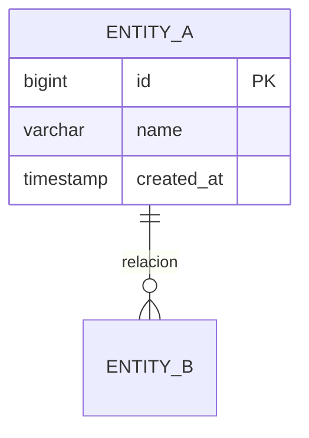

# Modelado de Base de Datos

## Proceso de modelado
1. Identificar entidades a partir de requerimientos.
2. Definir atributos con tipos de datos precisos.
3. Establecer relaciones (1:1, 1:N, N:M).
4. Normalizar a 3FN minimo (salvo justificacion).
5. Definir PKs, FKs, UNIQUEs, CHECKs.
6. Disenar indices basados en patrones de consulta.
7. Generar diagrama ER en Mermaid.
8. Escribir scripts DDL versionados.

## Formato de diagrama

## Cuando usar esta habilidad
- Al disenar un nuevo modulo con persistencia.
- Al modificar el modelo de datos existente.
- Al evaluar impacto de un requerimiento en datos.

## naming-conventions
- Tablas: snake_case, plural (users, orders).
- Columnas: snake_case (created_at, user_id).
- PKs: id (bigint autoincrement).
- FKs: tabla_singular_id (user_id).
- Indices: idx_tabla_columna.
- Constraints: chk_tabla_regla, uq_tabla_columna.
