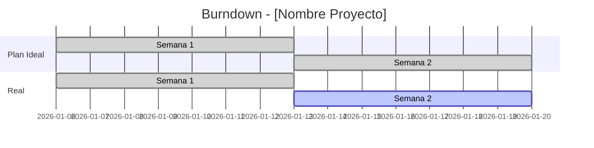

# Seguimiento y Control de Proyecto

## Tablero Kanban del Proyecto

Estructura un tablero Kanban basado en Markdown para visualizar el estado
de todas las tareas del proyecto. El tablero debe mantenerse actualizado
diariamente y ser la fuente unica de verdad del estado de trabajo.

```markdown
## Tablero de Tareas - [Nombre Proyecto] - [Fecha]

### Backlog
| ID | Tarea | Responsable | Prioridad | Fase |
|---|---|---|---|---|

### En Progreso (WIP Limit: 5)
| ID | Tarea | Responsable | Inicio | Dias | Bloqueante |
|---|---|---|---|---|---|

### En Revision
| ID | Tarea | Revisor | Fecha Envio |
|---|---|---|---|

### Completado (Sprint/Semana actual)
| ID | Tarea | Responsable | Completado | Dias Total |
|---|---|---|---|---|
```

## Reglas del Tablero

- WIP Limit: Maximo 5 tareas en progreso simultaneamente por equipo.
- Una tarea no pasa a "En Progreso" sin tarea previa completada si hay dependencia.
- Toda tarea en "En Revision" tiene maximo 2 dias para ser revisada.
- Tareas bloqueadas mas de 2 dias se escalan automaticamente.
- Mover de columna solo cuando realmente se cumple el criterio.
- Cada tarea debe tener un unico responsable asignado.
- Las prioridades se revisan al inicio de cada semana.
- El tablero se revisa en la daily standup del equipo.

## Metricas de Seguimiento

### Metricas Obligatorias

| Metrica | Formula | Frecuencia | Target |
|---|---|---|---|
| Avance vs Plan | (Tareas completadas / Tareas planificadas) x 100 | Semanal | >= 90% |
| Lead Time | Fecha completado - Fecha inicio | Por tarea | <= dias estimados |
| Cycle Time | Fecha completado - Fecha inicio trabajo activo | Por tarea | Tendencia decreciente |
| WIP | Tareas en progreso actualmente | Diario | <= WIP Limit |
| Tasa de Bloqueo | Tareas bloqueadas / Total en progreso | Semanal | <= 10% |
| Defect Density | Defectos / Tareas completadas | Por ciclo QA | Tendencia decreciente |
| Desvio de Cronograma | (Fecha real - Fecha planificada) / Duracion fase | Por fase | <= 5% |

### Burndown Chart

Para generar un burndown chart basado en Mermaid gantt:

- Eje X: semanas o sprints del proyecto.
- Eje Y: tareas pendientes (total backlog + en progreso).
- Linea 1: plan ideal (reduccion lineal desde total hasta 0).
- Linea 2: avance real (actualizacion semanal).
- Generar con la herramienta create-dashboard.
- Actualizar al cierre de cada semana.
- Si la linea real esta por encima de la ideal, hay retraso.
- Si la linea real esta por debajo, hay adelanto.

Ejemplo de estructura Mermaid:



## Reporte de Avance Semanal

Estructura para el reporte de estado semanal. Este reporte se genera
cada viernes y se distribuye a todos los stakeholders del proyecto.

| Seccion | Contenido |
|---|---|
| Resumen Ejecutivo | 2-3 lineas: estado general (Verde/Amarillo/Rojo), % avance, hitos proximos |
| Avance vs Plan | Tabla: fase, tareas planificadas, completadas, % avance |
| Hitos | Tabla: hito, fecha plan, fecha real/estimada, estado |
| Riesgos y Bloqueantes | Tabla: riesgo, impacto, mitigacion, responsable |
| Metricas | Lead time promedio, WIP actual, tasa de bloqueo |
| Proximos Pasos | Top 5 tareas de la proxima semana |
| Decisiones Requeridas | Preguntas pendientes que requieren decision |

### Semaforo de Estado

- **Verde**: Avance >= 90% del plan, sin bloqueantes criticos.
- **Amarillo**: Avance 70-89% o bloqueantes en resolucion.
- **Rojo**: Avance < 70% o bloqueantes sin resolucion > 3 dias.

El semaforo se determina de forma objetiva con las metricas. No se permite
poner Verde si hay bloqueantes criticos abiertos, independientemente del
porcentaje de avance.

### Formato del Resumen Ejecutivo

El resumen ejecutivo debe seguir esta plantilla:

```
Estado: [VERDE/AMARILLO/ROJO]
Avance global: [XX]% (plan: [YY]%)
Fase actual: [nombre de fase]
Proximo hito: [nombre] - [fecha]
Bloqueantes criticos: [cantidad] ([resumen breve si > 0])
```

## Control de Tiempos

### Registro de Tiempo por Tarea

| ID Tarea | Responsable | Estimado (h) | Real (h) | Desvio | Causa Desvio |
|---|---|---|---|---|---|

Cada responsable debe registrar el tiempo real al completar una tarea.
El desvio se calcula automaticamente como: (Real - Estimado) / Estimado x 100.
Toda tarea con desvio mayor al 20% debe documentar la causa del desvio.

### Indicadores de Tiempo

- Precision de estimacion: |Real - Estimado| / Estimado x 100 (target: <= 20%).
- Velocidad del equipo: tareas/semana (promedio ultimas 3 semanas).
- Tiempo en revision: promedio dias en columna "En Revision".
- Ratio de retrabajo: tareas devueltas / tareas revisadas (target: <= 15%).

Los indicadores de tiempo se usan para calibrar las estimaciones futuras.
Si la precision de estimacion es consistentemente mayor al 20%, se debe
ajustar la metodologia de estimacion del equipo.

### Analisis de Tendencias

Cada dos semanas, analizar la tendencia de las metricas principales:

- Si el lead time aumenta: revisar dependencias y bloqueos.
- Si el WIP excede el limite: priorizar finalizacion sobre inicio.
- Si la tasa de bloqueo sube: identificar cuellos de botella.
- Si el desvio de cronograma crece: convocar reunion de riesgo.

## Escalamiento

| Condicion | Accion | Escalado a |
|---|---|---|
| Tarea bloqueada > 2 dias | Escalar a Tech Lead | tech-lead |
| Fase con desvio > 10% | Reunion de riesgo con PM | project-manager |
| Riesgo materializado | Comunicar a sponsors | product-owner |
| WIP > limite 3 dias seguidos | Revisar capacidad y prioridades | tech-lead + PM |

### Proceso de Escalamiento

1. Detectar la condicion de escalamiento en el tablero o metricas.
2. Documentar el problema con contexto: que paso, desde cuando, impacto.
3. Notificar al rol correspondiente segun la tabla de escalamiento.
4. Registrar la accion tomada y la fecha de resolucion esperada.
5. Hacer seguimiento diario hasta que se resuelva.
6. Documentar la resolucion y lecciones aprendidas.

Si un escalamiento no se resuelve en el tiempo esperado, se escala
al siguiente nivel segun la cadena: tech-lead -> project-manager ->
product-owner -> sponsors.

## Cuando usar esta habilidad
- Usar cuando se necesita dar seguimiento al estado de las tareas del proyecto.
- Usar cuando se prepara un reporte de avance semanal o por hito.
- Usar cuando se detectan desvios en cronograma y se requiere tomar acciones.
- Usar cuando se quiere visualizar el estado general del proyecto en un tablero.
- Usar cuando se necesita medir velocity o lead time del equipo.

## plantilla-tablero-kanban
# Plantilla de Tablero Kanban

Esta plantilla esta lista para copiar y adaptar a cualquier proyecto.
Reemplaza los valores entre corchetes con los datos reales del proyecto.

## Tablero de Tareas - [Nombre del Proyecto] - [Fecha Actualizacion]

**Equipo**: [nombre del equipo]
**Sprint/Semana**: [numero]
**WIP Limit**: 5 tareas en progreso

---

### Backlog (Priorizado)

| ID | Tarea | Responsable | Prioridad | Fase | Estimado (h) | Dependencia |
|---|---|---|---|---|---|---|
| T-001 | [descripcion tarea] | [nombre] | Alta/Media/Baja | [fase] | [horas] | [T-XXX o -] |
| T-002 | [descripcion tarea] | [nombre] | Alta/Media/Baja | [fase] | [horas] | [T-XXX o -] |

**Total backlog**: [N] tareas | **Estimado total**: [X] horas

---

### En Progreso (WIP Limit: 5)

| ID | Tarea | Responsable | Inicio | Dias | Bloqueante | Notas |
|---|---|---|---|---|---|---|
| T-003 | [descripcion] | [nombre] | [YYYY-MM-DD] | [N] | [Si/No: detalle] | [contexto] |

**WIP actual**: [N]/5

---

### En Revision

| ID | Tarea | Revisor | Fecha Envio | Dias en Revision | Resultado |
|---|---|---|---|---|---|
| T-004 | [descripcion] | [revisor] | [YYYY-MM-DD] | [N] | Pendiente/Aprobado/Devuelto |

**Regla**: Maximo 2 dias en revision. Despues se escala.

---

### Completado (Semana Actual)

| ID | Tarea | Responsable | Completado | Dias Total | Estimado (h) | Real (h) |
|---|---|---|---|---|---|---|
| T-005 | [descripcion] | [nombre] | [YYYY-MM-DD] | [N] | [X] | [Y] |

**Completadas esta semana**: [N] tareas

---

### Bloqueadas

| ID | Tarea | Responsable | Bloqueado Desde | Motivo | Escalado a | Estado |
|---|---|---|---|---|---|---|
| T-006 | [descripcion] | [nombre] | [YYYY-MM-DD] | [motivo] | [rol] | Abierto/Resolviendo |

---

### Reglas del Tablero

1. **WIP Limit**: Maximo 5 tareas en "En Progreso" por equipo.
2. **Dependencias**: No iniciar tarea si su dependencia no esta completada.
3. **Revision**: Maximo 2 dias. Pasado ese tiempo, escalar.
4. **Bloqueos**: Registrar inmediatamente con motivo y escalar si > 2 dias.
5. **Actualizacion**: El tablero se actualiza al menos una vez al dia.
6. **Prioridad**: Backlog ordenado por prioridad (Alta primero).
7. **Movimiento**: Solo mover cuando se cumple el criterio de la columna destino.

## metricas-y-formulas
# Guia de Metricas y Formulas

Guia detallada para calcular, interpretar y actuar sobre cada metrica
del sistema de seguimiento de proyecto.

## 1. Avance vs Plan

**Formula**: (Tareas completadas / Tareas planificadas) x 100
**Frecuencia**: Semanal
**Target**: >= 90%

**Como calcular**:
- Contar tareas completadas en el periodo (semana o fase).
- Dividir entre tareas que debian completarse segun el plan.
- Multiplicar por 100 para obtener porcentaje.

**Interpretacion**:
- >= 90%: El proyecto avanza segun lo planificado.
- 70-89%: Hay retraso moderado, investigar causas.
- < 70%: Retraso critico, requiere accion inmediata.

**Acciones correctivas**:
- Revisar si las tareas incompletas tienen bloqueos.
- Evaluar si las estimaciones fueron realistas.
- Considerar reasignacion de recursos si hay sobrecarga.
- Si es sistematico, replanificar con estimaciones ajustadas.

## 2. Lead Time

**Formula**: Fecha completado - Fecha creacion de la tarea
**Frecuencia**: Por tarea (agregado semanal)
**Target**: <= dias estimados para la tarea

**Como calcular**:
- Registrar fecha en que la tarea entra al backlog.
- Registrar fecha en que la tarea se marca como completada.
- La diferencia en dias es el lead time.

**Interpretacion**:
- Menor o igual al estimado: buena planificacion.
- Hasta 20% mayor: aceptable, monitorear tendencia.
- Mas de 20% mayor: problema en el flujo o estimacion.

**Acciones correctivas**:
- Analizar en que columna se acumula mas tiempo.
- Reducir tareas en espera (backlog excesivo).
- Mejorar la priorizacion para reducir tiempo de espera.

## 3. Cycle Time

**Formula**: Fecha completado - Fecha inicio de trabajo activo
**Frecuencia**: Por tarea (agregado semanal)
**Target**: Tendencia decreciente semana a semana

**Como calcular**:
- Registrar fecha en que la tarea pasa a "En Progreso".
- Registrar fecha en que la tarea se completa.
- La diferencia en dias es el cycle time.

**Interpretacion**:
- Cycle time decreciente: el equipo mejora su eficiencia.
- Cycle time estable: flujo predecible (bueno).
- Cycle time creciente: problemas de complejidad o bloqueos.

**Acciones correctivas**:
- Dividir tareas grandes en subtareas mas pequenas.
- Reducir contexto switching (respetar WIP limit).
- Eliminar pasos innecesarios en el flujo de trabajo.

## 4. WIP (Work In Progress)

**Formula**: Conteo de tareas en estado "En Progreso"
**Frecuencia**: Diario
**Target**: <= WIP Limit (5 por equipo)

**Como calcular**:
- Contar tareas en la columna "En Progreso" del tablero.

**Interpretacion**:
- Dentro del limite: flujo saludable.
- En el limite: equipo a capacidad maxima, no agregar mas.
- Sobre el limite: sobrecarga, riesgo de baja calidad.

**Acciones correctivas**:
- Completar tareas en progreso antes de iniciar nuevas.
- Identificar y resolver bloqueos que impiden completar.
- Si WIP > limite por 3+ dias, reunion de capacidad.

## 5. Tasa de Bloqueo

**Formula**: (Tareas bloqueadas / Total tareas en progreso) x 100
**Frecuencia**: Semanal
**Target**: <= 10%

**Como calcular**:
- Contar tareas marcadas como bloqueadas durante la semana.
- Dividir entre total de tareas que estuvieron en progreso.
- Multiplicar por 100.

**Interpretacion**:
- <= 10%: Nivel normal de impedimentos.
- 10-25%: Problemas frecuentes, revisar dependencias.
- > 25%: Problema sistematico, accion urgente requerida.

**Acciones correctivas**:
- Categorizar bloqueos por tipo (dependencia, recurso, tecnico).
- Atacar la categoria mas frecuente.
- Mejorar la identificacion temprana de dependencias.
- Escalar bloqueos segun la tabla de escalamiento.

## 6. Defect Density

**Formula**: Defectos encontrados / Tareas completadas en el periodo
**Frecuencia**: Por ciclo de QA
**Target**: Tendencia decreciente

**Como calcular**:
- Contar defectos reportados en el ciclo de QA.
- Dividir entre tareas que pasaron a QA en ese ciclo.

**Interpretacion**:
- Decreciente: la calidad mejora con el tiempo.
- Estable bajo: calidad consistente y aceptable.
- Creciente: problemas de calidad, revisar proceso.

**Acciones correctivas**:
- Reforzar criterios de "Definition of Done".
- Agregar revisiones de codigo mas rigurosas.
- Identificar patrones en los tipos de defectos.
- Capacitar al equipo en las areas con mas defectos.

## 7. Desvio de Cronograma

**Formula**: (Fecha real - Fecha planificada) / Duracion total de la fase x 100
**Frecuencia**: Por fase del proyecto
**Target**: <= 5%

**Como calcular**:
- Comparar la fecha real de fin de fase vs la planificada.
- Dividir la diferencia entre la duracion total de la fase.
- Multiplicar por 100 para obtener porcentaje.

**Interpretacion**:
- <= 5%: Desvio aceptable, dentro de margenes normales.
- 5-10%: Desvio moderado, ajustar plan si es posible.
- > 10%: Desvio critico, requiere reunion de riesgo.

**Acciones correctivas**:
- Analizar causas raiz del desvio.
- Evaluar impacto en fases posteriores.
- Proponer plan de recuperacion o ajuste de alcance.
- Comunicar a stakeholders si afecta fecha de entrega.

## Resumen de Acciones por Rango

| Metrica | Normal | Alerta | Critico |
|---|---|---|---|
| Avance vs Plan | >= 90% | 70-89% | < 70% |
| Lead Time | <= estimado | hasta +20% | > +20% |
| Cycle Time | decreciente | estable | creciente |
| WIP | < limite | = limite | > limite |
| Tasa Bloqueo | <= 10% | 10-25% | > 25% |
| Defect Density | decreciente | estable | creciente |
| Desvio Cronograma | <= 5% | 5-10% | > 10% |
