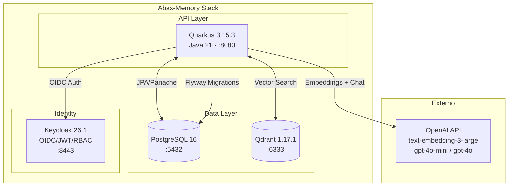

# Abax-Memory — Plataforma de Memoria Operativa con IA

[](https://github.com/breisnerlopez/abax-memory/releases/tag/v1.0.0)
[](https://github.com/breisnerlopez/abax-memory/pkgs/container/abax-memory)
[](https://adoptium.net/)
[](https://quarkus.io/)
[](#licencia)
[](#metricas-del-proyecto)
[](#metricas-del-proyecto)
[](#metricas-del-proyecto)

**Plataforma backend API-first de memoria operativa para agentes con IA**, construida bajo metodologia corporativa en cascada con verificacion formal de calidad. Gestion de casos, memorias operativas enriquecidas con embeddings semanticos, flujos de aprobacion con reglas de negocio, busqueda vectorial y gobierno de acceso basado en roles (RBAC).

> **PMOA** — Plataforma de Memoria Operativa con Agentes · v1.0.0 MVP

---

## ¿Que es PMOA / Abax-Memory?

Abax-Memory es el motor de persistencia inteligente de la plataforma PMOA. Proporciona a los agentes de IA una **memoria operativa estructurada y consultable semanticamente** — es decir, los agentes no solo guardan informacion, sino que pueden recuperarla por significado, no por palabras clave.

**Tres capacidades principales**: gestion de casos operativos (CRUD completo con validacion semantica), busqueda vectorial sobre memorias (Qdrant + OpenAI embeddings de 3072 dimensiones), y gobierno de acceso con RBAC via Keycloak OIDC. Todo expuesto como API REST documentada con OpenAPI 3.0.3.

> **Documentacion completa del proyecto** en GitHub Pages: **[https://breisnerlopez.github.io/abax-memory/](https://breisnerlopez.github.io/abax-memory/)**

---

## Quick Start

Con Docker instalado, en **3 pasos**:

```bash
# 1. Clonar
git clone https://github.com/breisnerlopez/abax-memory.git && cd abax-memory

# 2. Configurar tu API key de OpenAI (NUNCA hardcodear)
export OPENAI_API_KEY="sk-..."

# 3. Levantar el stack completo
docker compose up -d
```

Verificar que todo esta funcionando:

```bash
curl http://localhost:8080/q/health          # Backend Quarkus
curl http://localhost:6333/healthz            # Qdrant
curl http://localhost:8443/realms/abax-memory # Keycloak
```

> **Swagger UI**: [http://localhost:8080/q/swagger-ui](http://localhost:8080/q/swagger-ui) · **OpenAPI spec**: [http://localhost:8080/q/openapi](http://localhost:8080/q/openapi)

Para detener:

```bash
docker compose down           # preserva datos
docker compose down -v        # elimina todo (⚠️)
```

---

## Arquitectura



Flujo principal: **Cliente autenticado** → Keycloak (JWT) → API REST Quarkus → PostgreSQL (metadatos) + Qdrant (embeddings semanticos) + OpenAI (generacion de embeddings, extraccion de entidades, validacion semantica).

---

## Documentacion del Proyecto

El proyecto fue ejecutado bajo metodologia en cascada con 10 fases, cada una con entregables formales, aprobaciones y gates de calidad. La documentacion completa esta disponible en el repositorio y en GitHub Pages.

| Fase | Estado | Gate | Entregables |
|---|---|---|---|
| F0 — Descubrimiento | 🟢 Completada | Documentada | Hallazgos, stakeholders, vision preliminar |
| F1 — Inicio | 🟢 Completada | Documentada | Charter, kickoff, cronograma, alcance |
| F2 — Analisis Funcional | 🟢 Completada | Documentada | Requerimientos, reglas de negocio, CAs |
| F3 — Diseno Tecnico | 🟢 Completada | Documentada | Arquitectura, ADRs, modelo de datos |
| F4 — Construccion | 🟢 Completada | Aprobada | Backend, API REST, integraciones |
| F5 — Pruebas QA | 🟢 Completada | Aprobada (0 defectos) | 49/49 casos de prueba aprobados |
| F6 — UAT | 🟢 Completada | Aceptada (61/61 CA) | Pruebas de aceptacion de usuario |
| F7 — Despliegue | 🟢 Completada | Desplegada con IA real | Go-live, GHCR, verificacion |
| F8 — Estabilizacion | 🟢 Completada | Aprobada (26/26 PASS) | Burn-in, monitoreo, soporte |
| F9 — Cierre | 🟢 Completada | **Proyecto CERRADO** | Lecciones aprendidas, consistencia final |

---

## Presentaciones

Las presentaciones ejecutivas y tecnicas del proyecto estan disponibles como documentos HTML autonomos — abren en cualquier navegador y se pueden imprimir como PDF.

> **🔗 Indice completo en GitHub Pages:** [https://breisnerlopez.github.io/abax-memory/](https://breisnerlopez.github.io/abax-memory/)

| # | Fase | Presentacion | Enlace |
|---|---|---|---|
| 1 | F0 · Descubrimiento | Hallazgos iniciales y vision preliminar | [Ver](docs/entregables/fase-0-descubrimiento/presentacion-descubrimiento.html) |
| 2 | F1 · Inicio | Kickoff, equipo, cronograma y alcance | [Ver](docs/entregables/fase-1-inicio/presentacion-kickoff.html) |
| 3 | F2 · Analisis | Propuesta funcional y criterios de aceptacion | [Ver](docs/entregables/fase-2-analisis/presentacion-propuesta-funcional.html) |
| 4 | F3 · Diseno Tecnico | Arquitectura, ADRs y modelo de datos | [Ver](docs/entregables/fase-3-diseno-tecnico/presentacion-arquitectura.html) |
| 5 | F4 · Construccion | Avance de implementacion y metricas de build | [Ver](docs/entregables/fase-4-construccion/presentacion-avance.html) |
| 6 | F6 · UAT | Resultados de User Acceptance Testing | [Ver](docs/entregables/fase-6-uat/presentacion-resultados-uat.html) |
| 7 | F7 · Despliegue | Plan de Go-Live y verificacion post-deploy | [Ver](docs/entregables/fase-7-despliegue/presentacion-go-live.html) |
| 8 | F9 · Cierre | Resumen ejecutivo, logros y lecciones aprendidas | [Ver](docs/entregables/fase-9-cierre/presentacion-cierre.html) |

---

## Stack Tecnologico

| Componente | Tecnologia | Version | Proposito |
|---|---|---|---|
| **Backend** | Quarkus (Java) | 3.15.3 | Framework REST reactivo, CDI, Hibernate ORM |
| **Lenguaje** | Java | 21 (LTS) | JDK base |
| **Base de Datos** | PostgreSQL (Alpine) | 16 | Persistencia operativa de casos y memorias |
| **Migraciones** | Flyway | — | Baseline `V1__baseline_operational_store` |
| **Vector DB** | Qdrant | 1.17.1 | Busqueda semantica sobre embeddings (3072 dims) |
| **IA** | OpenAI API | text-embedding-3-large, gpt-4o-mini, gpt-4o | Embeddings, extraccion de entidades, validacion semantica |
| **Integracion IA** | LangChain4j | 1.0.0-beta1 | Cliente OpenAI declarativo para Quarkus |
| **Identity** | Keycloak | 26.1 | OIDC Provider con JWT, realm `abax-memory` |
| **Contenedores** | Docker + Compose | 3.9 | Despliegue local completo con 4 servicios |
| **Registro** | GitHub Container Registry | ghcr.io | Imagen publica `ghcr.io/breisnerlopez/abax-memory` |
| **Documentacion API** | OpenAPI 3.0.3 | `/q/openapi` | Contrato API auto-generado por SmallRye OpenAPI |

---

## Instalacion y Despliegue

### Requisitos Previos

| Herramienta | Version minima | Nota |
|---|---|---|
| Docker | 24+ | Con soporte para Compose v2 (`docker compose`) |
| Docker Compose | 2.x | Incluido en Docker Desktop |
| OpenAI API Key | — | Cuenta con acceso a modelos `text-embedding-3-large`, `gpt-4o-mini`, `gpt-4o` |
| Java (solo desarrollo) | 21 (Temurin/Eclipse) | Para compilacion local con Maven |
| Maven (solo desarrollo) | 3.9+ | Wrapper incluido (`./mvnw`) |
| Puertos disponibles | 8080, 5432, 6333, 6334, 8443 | Verificar que no esten en uso |

### Despliegue con Docker Compose

```bash
# 1. Clonar repositorio
git clone https://github.com/breisnerlopez/abax-memory.git
cd abax-memory

# 2. Configurar API key de OpenAI (NUNCA hardcodear)
export OPENAI_API_KEY="sk-..."

# 3. Desplegar stack completo
docker compose up -d

# 4. Verificar que los 4 servicios estan UP
curl http://localhost:8080/q/health       # Backend Quarkus
curl http://localhost:6333/healthz         # Qdrant
curl http://localhost:8443/realms/abax-memory  # Keycloak
```

### Servicios levantados

| Servicio | URL interna | Puerto host | Contenedor |
|---|---|---|---|
| Backend Quarkus | `http://abax-memory:8080` | `8080` | `abax-memory-backend` |
| PostgreSQL | `postgres://postgres:5432` | `5432` | `abax-postgres` |
| Qdrant | `http://qdrant:6333` | `6333` | `abax-qdrant` |
| Keycloak | `http://keycloak:8080` | `8443` | `abax-keycloak` |

---

## Endpoints API

Swagger UI disponible en: `http://localhost:8080/q/swagger-ui`  
OpenAPI spec: `http://localhost:8080/q/openapi`

### Gestion de Casos

| Metodo | Ruta | Descripcion | Auth |
|---|---|---|---|
| `POST` | `/api/casos` | Crear nuevo caso operativo | JWT |
| `GET` | `/api/casos` | Listar casos (paginado, filtrable) | JWT |
| `GET` | `/api/casos/{id}` | Obtener caso por ID | JWT |
| `PUT` | `/api/casos/{id}` | Actualizar caso | JWT |
| `DELETE` | `/api/casos/{id}` | Eliminar caso (soft-delete) | JWT |

### Gestion de Memorias

| Metodo | Ruta | Descripcion | Auth |
|---|---|---|---|
| `POST` | `/api/memorias` | Crear memoria asociada a un caso | JWT |
| `GET` | `/api/memorias` | Listar memorias (con filtros) | JWT |
| `GET` | `/api/memorias/{id}` | Obtener memoria por ID | JWT |
| `PUT` | `/api/memorias/{id}` | Actualizar memoria | JWT |
| `DELETE` | `/api/memorias/{id}` | Eliminar memoria | JWT |

### Busqueda Semantica

| Metodo | Ruta | Descripcion | Auth |
|---|---|---|---|
| `GET` | `/api/memorias/search?q={texto}` | Busqueda semantica sobre embeddings en Qdrant | JWT |

### Health y Monitoreo

| Metodo | Ruta | Descripcion | Auth |
|---|---|---|---|
| `GET` | `/q/health` | Health check agregado | Publico |
| `GET` | `/q/health/live` | Liveness probe | Publico |
| `GET` | `/q/health/ready` | Readiness probe | Publico |
| `GET` | `/q/openapi` | Especificacion OpenAPI 3.0.3 | Publico |

### Auditoria

| Metodo | Ruta | Descripcion | Auth |
|---|---|---|---|
| `GET` | `/api/audit` | Consultar registro de auditoria | JWT (admin) |

---

## Autenticacion — Keycloak OIDC

El backend requiere autenticacion via **OIDC con Keycloak** para todos los endpoints de negocio (excepto health checks y documentacion).

### Flujo de Autenticacion

1. **Obtener token JWT** desde Keycloak:
   ```bash
   curl -X POST http://localhost:8443/realms/abax-memory/protocol/openid-connect/token \
     -H "Content-Type: application/x-www-form-urlencoded" \
     -d "client_id=abax-memory-api" \
     -d "client_secret=ZN8NB5raPHtfYozXLVrEGnbBdXI48BTI" \
     -d "username={usuario}" \
     -d "password={password}" \
     -d "grant_type=password"
   ```

2. **Usar el token** en peticiones subsecuentes:
   ```bash
   curl http://localhost:8080/api/casos \
     -H "Authorization: Bearer {access_token}"
   ```

### Realm y Cliente OIDC

| Parametro | Valor |
|---|---|
| Realm | `abax-memory` |
| Client ID | `abax-memory-api` |
| Grant types | `password`, `client_credentials` |
| JWT Audience | `abax-memory-api` |
| JWT Issuer | `http://keycloak:8080/realms/abax-memory` |

---

## Configuracion

Toda la configuracion se realiza mediante **variables de entorno**. La unica variable obligatoria es `OPENAI_API_KEY`.

### Variables de Entorno

| Variable | Obligatoria | Valor por defecto | Descripcion |
|---|---|---|---|
| `OPENAI_API_KEY` | **SI** | *(vacia)* | API key de OpenAI. NUNCA hardcodear en codigo ni config. |
| `QUARKUS_DATASOURCE_JDBC_URL` | No | `jdbc:postgresql://localhost:5432/pmoadb` | JDBC URL de PostgreSQL |
| `QUARKUS_DATASOURCE_USERNAME` | No | `pmoa` | Usuario de base de datos |
| `QUARKUS_DATASOURCE_PASSWORD` | No | `pmoa` | Password de base de datos |
| `ABAX_QDRANT_HOST` | No | `localhost` | Host de Qdrant |
| `ABAX_QDRANT_PORT` | No | `6333` | Puerto REST de Qdrant |
| `ABAX_QDRANT_COLLECTION` | No | `abax-memories` | Nombre de la coleccion de embeddings |
| `ABAX_QDRANT_USE_TLS` | No | `false` | Usar TLS para Qdrant |
| `QUARKUS_OIDC_AUTH_SERVER_URL` | No | `http://localhost:8443/realms/abax-memory` | URL del servidor OIDC (Keycloak) |
| `QUARKUS_OIDC_CLIENT_ID` | No | `abax-memory-api` | Client ID OIDC |
| `QUARKUS_OIDC_CREDENTIALS_SECRET` | No | *(valor por defecto)* | Client secret OIDC |
| `MP_JWT_VERIFY_ISSUER` | No | Derivado del auth server | Emisor JWT a verificar |
| `MP_JWT_VERIFY_AUDIENCES` | No | `abax-memory-api` | Audiencias JWT aceptadas |
| `ABAX_OPENAI_VALIDATION_MODEL` | No | `gpt-4o` | Modelo para validacion semantica critica |
| `ABAX_PROCESSING_AUTO_RUN` | No | `true` | Ejecutar procesamiento automatico al iniciar |

### Modelos OpenAI configurados

| Config key | Modelo | Uso |
|---|---|---|
| `quarkus.langchain4j.openai.embedding-model.model-name` | `text-embedding-3-large` (3072 dims) | Generacion de embeddings para busqueda semantica |
| `quarkus.langchain4j.openai.chat-model.model-name` | `gpt-4o-mini` | Extraccion de entidades (structured outputs) |
| `abax.openai.validation-model` | `gpt-4o` | Validacion semantica de criticidad alta |

> **Nota de seguridad**: La API key se gestiona exclusivamente via variable de entorno. No se almacena en codigo fuente, archivos de configuracion, ni imagenes Docker. Rotar la key despues del desarrollo y antes de produccion definitiva.

---

## Estructura del Proyecto

```
abax-memory/
├── backend-quarkus/                  # Modulo backend (Quarkus + Java 21)
│   ├── pom.xml                       # Maven POM (dependencias, plugins)
│   └── src/
│       ├── main/
│       │   ├── java/com/btl/administrador/api/
│       │   │   ├── resource/         # REST endpoints (CaseResource, MemoryResource,
│       │   │   │                      #   SearchResource, AuditResource)
│       │   │   ├── service/          # Logica de negocio
│       │   │   ├── domain/           # Entidades JPA (Case, Memory, AuditEntry)
│       │   │   ├── dto/              # Objetos de transferencia (requests/responses)
│       │   │   ├── persistence/      # Repositorios Panache
│       │   │   ├── integration/      # Clientes externos (OpenAI, Qdrant)
│       │   │   ├── exception/        # Manejo de errores y excepciones
│       │   │   └── security/         # RBAC, OIDC interceptors
│       │   └── resources/
│       │       ├── application.properties   # Configuracion principal
│       │       └── db/migration/
│       │           └── V1__baseline_operational_store.sql
│       └── test/
│           └── java/com/btl/         # 54 tests unitarios e integracion
├── Dockerfile                        # Imagen Docker (eclipse-temurin:21-jre)
├── docker-compose.yml                # Stack local: Backend + PG + Qdrant + Keycloak
├── CHANGELOG.md                      # Historial de versiones
├── project-manifest.yaml             # Manifiesto del proyecto (metadatos)
├── docs/                             # Documentacion cascada por fase
│   ├── index.html                    # GitHub Pages: indice de presentaciones
│   ├── entregables/                  # 42+ entregables formales (F0-F9)
│   │   ├── fase-0-descubrimiento/
│   │   ├── fase-1-inicio/
│   │   ├── fase-2-analisis/
│   │   ├── fase-3-diseno-tecnico/
│   │   ├── fase-4-construccion/
│   │   ├── fase-5-pruebas-qa/
│   │   ├── fase-6-uat/
│   │   ├── fase-7-despliegue/
│   │   ├── fase-8-estabilizacion/
│   │   └── fase-9-cierre/
│   ├── design-system/
│   │   └── presentacion-template.html
│   ├── bitacora.md
│   └── registro-entregables.md
└── .opencode/                        # Configuracion de agentes OpenCode
```

---

## Desarrollo Local

### Compilar y ejecutar (sin Docker)

```bash
cd backend-quarkus
export OPENAI_API_KEY="sk-..."

# Compilar
./mvnw clean package -DskipTests

# Ejecutar en modo dev (hot reload)
./mvnw quarkus:dev
```

El backend en modo dev escucha en `http://localhost:8080` y espera que los servicios externos (PostgreSQL, Qdrant, Keycloak) esten disponibles. Para desarrollo completo, usar `docker compose up -d postgres qdrant keycloak` (sin el backend) y ejecutar el backend con `quarkus:dev`.

### Ejecutar tests

```bash
cd backend-quarkus
./mvnw test
```

La suite de tests usa H2 en memoria (`MODE=PostgreSQL`) con Flyway migrations y mocks para OpenAI. No requiere API key ni servicios externos.

### Build de imagen Docker

```bash
# Compilar el JAR runner primero
cd backend-quarkus && ./mvnw package -DskipTests && cd ..

# Build de imagen
docker build -t abax-memory:local .

# Ejecutar
docker run -p 8080:8080 -e OPENAI_API_KEY="sk-..." abax-memory:local
```

---

## Metricas del Proyecto

### Calidad

| Indicador | Valor |
|---|---|
| Tests automatizados | **54** (BUILD SUCCESS, 0 failures, 0 errors) |
| Casos de prueba QA | **49/49 aprobados** (100%) |
| Criterios de aceptacion UAT (R1-MVP) | **61/61 aprobados** (100%) |
| Escenarios de estabilizacion (burn-in) | **26/26 PASS** (100%) |
| Defectos criticos abiertos | **0** |
| Defectos totales detectados | 4 (3 QA cerrados + 1 baja severidad documentado) |

### Cobertura Funcional (R1-MVP)

| Modulo | CAs | Aprobados |
|---|---|---|
| M1. Gestion de memorias (CRUD + validacion) | 12 | 12 |
| M2. API operativa (13 endpoints REST) | 9 | 9 |
| M3. Busqueda y recuperacion semantica | 9 | 9 |
| M4. Persistencia y metadatos | 6 | 6 |
| M5. Gobierno de memoria (reglas + ciclo de vida) | 12 | 12 |
| M6. Depuracion y mantenimiento | 3 | 3 |
| M7. Acceso y visibilidad (RBAC) | 5 | 5 |
| M8. Contrato API (OpenAPI 3.0.3) | 5 | 5 |

---

## Release

- **Version**: v1.0.0 (MVP)
- **GitHub Release**: [v1.0.0](https://github.com/breisnerlopez/abax-memory/releases/tag/v1.0.0)
- **GitHub Container Registry**: `ghcr.io/breisnerlopez/abax-memory:latest`
- **Changelog**: [CHANGELOG.md](CHANGELOG.md)

### Pendiente conocido (R2)

- **Repositorio Git real para memorias**: Actualmente se usa `InMemoryGitProvider`. La implementacion con repositorio Git real queda diferida para una iteracion futura (R2). No bloqueante para el MVP.

---

## Licencia

Software propietario. Todos los derechos reservados. Consulte los terminos de licencia corporativa aplicables.
