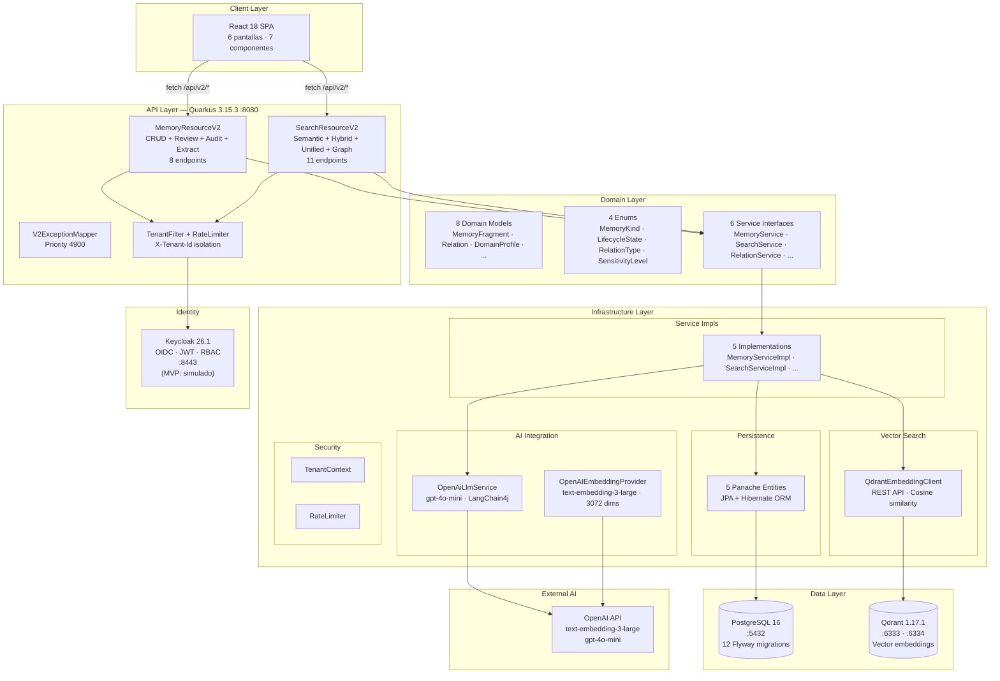

# Análisis de Estructura — Abax-Memory v2.0.0

- **Fase**: v2.0.0 — Cierre (análisis post-proyecto)
- **Responsable**: project-manager
- **Fecha**: 2026-05-05
- **Estado**: Completado

---

## Índice

1. [Estructura de Paquetes Backend](#1-estructura-de-paquetes-backend)
2. [Estructura Frontend](#2-estructura-frontend)
3. [Documentación](#3-documentación)
4. [Endpoints REST](#4-endpoints-rest)
5. [Migraciones Flyway](#5-migraciones-flyway)
6. [Tests](#6-tests)
7. [Deuda Técnica Identificada](#7-deuda-técnica-identificada)
8. [Releases Publicados](#8-releases-publicados)
9. [Diagrama de Arquitectura](#9-diagrama-de-arquitectura)
10. [Glosario](#glosario)

---

## 1. Estructura de Paquetes Backend

El backend está implementado en **Quarkus 3.15.3 + Java 21** y sigue una arquitectura de 4 capas inspirada en DDD (Domain-Driven Design): API, Dominio, Infraestructura y Configuración.

```
backend-quarkus/src/main/java/com/abax/memory/
├── api/                          # Capa de exposición REST
│   ├── rest/v2/
│   │   ├── MemoryResourceV2.java     # CRUD memorias + revisión + auditoría + extracción (348 líneas)
│   │   ├── SearchResourceV2.java     # Búsqueda semántica/híbrida + grafo + relaciones + admin (382 líneas)
│   │   └── V2ExceptionMapper.java    # Mapeo unificado de excepciones → ErrorResponse (163 líneas)
│   └── dto/v2/                       # 17 DTOs para requests/responses
│       ├── CreateMemoryRequest.java, UpdateMemoryRequest.java
│       ├── CreateRelationRequest.java
│       ├── ExtractRequest.java, ExtractResponse.java
│       ├── GraphEdge.java, GraphResponse.java
│       ├── MemoryResponse.java, PaginatedResponse.java, ScoredMemory.java
│       ├── ReviewRequest.java
│       ├── SearchRequest.java, SearchResponse.java
│       ├── SemanticSearchRequest.java
│       ├── UnifiedSearchRequest.java, UnifiedSearchResponse.java
│       └── ErrorResponse.java
├── domain/                       # Capa de dominio (modelo + servicios)
│   ├── model/                        # 8 entidades de dominio
│   │   ├── AuditRecord.java          # Registro de auditoría
│   │   ├── DomainProfile.java        # Perfil de dominio configurable
│   │   ├── ExtractedEntity.java      # Entidad extraída por LLM
│   │   ├── InferredRelation.java     # Relación inferida
│   │   ├── MemoryFragment.java       # Fragmento de memoria (entidad central)
│   │   ├── Relation.java             # Relación dirigida entre fragmentos
│   │   ├── TenantConfig.java         # Configuración por tenant
│   │   └── ValidationResult.java     # Resultado de validación semántica
│   ├── enums/                        # 4 enumeraciones de dominio
│   │   ├── LifecycleState.java       # DRAFT → PENDING → ACTIVE → ARCHIVED → DELETED
│   │   ├── MemoryKind.java           # FACT, PREFERENCE, EVENT, DECISION, TASK, PROCEDURE, NOTE, ENTITY
│   │   ├── RelationType.java         # RELATED_TO, DEPENDS_ON, CAUSED_BY, RESOLVES, CONTRADICTS, SUPPORTS, MENTIONS, BELONGS_TO, SUPERSEDES
│   │   └── SensitivityLevel.java     # PUBLIC, INTERNAL, CONFIDENTIAL, SECRET
│   └── service/                      # 6 interfaces de servicio de dominio
│       ├── AuditService.java
│       ├── LifecycleService.java
│       ├── LlmService.java           # Contrato para integración LLM
│       ├── MemoryService.java        # CRUD + extracción + listado
│       ├── RelationService.java
│       └── SearchService.java        # Búsqueda semántica/híbrida + grafo + reindex
├── infrastructure/              # Capa de infraestructura (implementaciones concretas)
│   ├── persistence/                  # 5 entidades JPA (Panache)
│   │   ├── AuditRecordEntity.java
│   │   ├── DomainProfileEntity.java
│   │   ├── MemoryFragmentEntity.java # Mapeo JPA de memory_fragments
│   │   ├── RelationEntity.java
│   │   └── TenantConfigEntity.java
│   ├── ai/                           # Integración con OpenAI / LLMs
│   │   ├── EmbeddingProvider.java        # Interfaz de proveedor de embeddings
│   │   ├── InMemoryEmbeddingProvider.java # Mock para tests (Jaccard similarity)
│   │   ├── MockLlmService.java           # Mock para tests (regex NLP)
│   │   ├── OpenAIEmbeddingProvider.java  # Embeddings reales via OpenAI text-embedding-3-large
│   │   └── OpenAiLlmService.java        # LLM real via gpt-4o-mini (LangChain4j)
│   ├── qdrant/                       # Integración con Qdrant (vector DB)
│   │   ├── QdrantClient.java            # Interfaz cliente Qdrant
│   │   ├── QdrantEmbeddingClient.java  # Implementación real con REST API de Qdrant
│   │   └── InMemoryQdrantClient.java   # Mock para tests (HashMap + cosine sim)
│   ├── security/                     # Seguridad transversal
│   │   ├── RateLimiter.java             # Rate limiting por tenant/usuario
│   │   ├── TenantContext.java           # Contexto de tenant (request-scoped)
│   │   └── TenantFilter.java            # Filtro de aislamiento multi-tenant
│   ├── service/                      # Implementaciones de servicios de dominio
│   │   ├── AuditServiceImpl.java
│   │   ├── MemoryServiceImpl.java       # CRUD + ciclo de vida + extracción LLM
│   │   ├── RelationServiceImpl.java
│   │   ├── SearchFilterBuilder.java     # Constructor de filtros SQL dinámicos
│   │   └── SearchServiceImpl.java       # Búsqueda vectorial + híbrida + grafo BFS
│   └── auth/                         # Directorio reservado para OIDC (vacío en MVP)
└── config/                       # Configuración CDI
    └── InfrastructureConfig.java      # Wiring de beans CDI (Instance<T> para lazy injection)
```

### Estadísticas de código backend

| Métrica | Valor |
|---|---|
| Clases Java totales | ~50 |
| DTOs v2 | 17 |
| Entidades de dominio | 8 |
| Enums | 4 |
| Interfaces de servicio | 6 |
| Implementaciones de infraestructura | ~15 |
| Recursos REST | 2 (+ 1 ExceptionMapper) |
| Archivos de migración Flyway | 12 |

### Principios arquitectónicos observados

- **Separación dominio/infraestructura**: Las interfaces de servicio (`domain/service/`) definen el contrato; las implementaciones concretas (`infrastructure/service/`) lo materializan.
- **CDI declarativo**: Se usa `Instance<T>` de CDI para lazy injection (fix #13 del CHANGELOG), eliminando builders manuales.
- **English-Only Internals**: Convención `code-naming-convention` aplicada estrictamente. Todos los identificadores (clases, métodos, endpoints, columnas) en inglés.
- **MOCK explícito**: Implementaciones mock (`MockLlmService`, `InMemoryQdrantClient`) están explícitamente marcadas con `// MOCK:` y `// REPLACE_BEFORE_PROD`. La skill `anti-mock-review` detectó 40 marcas de mock; ninguna llegó a producción.
- **Versionado de API**: Endpoints bajo `/api/v2/` con DTOs en paquete `v2/`, ExceptionMapper con prioridad CDI que toma precedencia sobre el mapper v1.

---

## 2. Estructura Frontend

El frontend está implementado en **React 18 + TypeScript**, con 6 pantallas, 7 componentes reutilizables y una capa de servicios HTTP con `fetch` nativo (sin axios).

```
frontend-v2/src/
├── App.tsx                    # Router principal (react-router-dom v6)
├── main.tsx                   # Punto de entrada (createRoot)
├── index.css                  # Estilos globales
├── pages/                     # 6 pantallas (rutas)
│   ├── SearchPage.tsx         # Página principal: búsqueda unificada
│   ├── DetailPage.tsx         # Vista detalle de fragmento + grafo
│   ├── EditorPage.tsx         # Crear / Editar memoria
│   ├── ReviewPage.tsx         # Cola de revisión (PENDING → ACTIVE / REJECTED)
│   ├── AdminPage.tsx          # Administración: perfiles, reindex, health
│   └── DashboardPage.tsx      # Dashboard con estadísticas
├── components/                # 7 componentes reutilizables
│   ├── Layout.tsx             # Shell de aplicación (nav + contenido)
│   ├── MemoryCard.tsx         # Tarjeta de fragmento en listados
│   ├── FilterPanel.tsx        # Panel de filtros (kind, status, sensitivity, etc.)
│   ├── KindBadge.tsx          # Badge de tipo de memoria (coloreado)
│   ├── LifecycleBadge.tsx     # Badge de estado de ciclo de vida
│   ├── ConfidenceBar.tsx      # Barra de confianza (0.0 – 1.0)
│   └── Pagination.tsx         # Paginación (page, pageSize, total)
├── services/
│   └── api.ts                 # Cliente HTTP (fetch) con 20 funciones para endpoints v2
├── types/
│   └── index.ts               # Definiciones TypeScript (263 líneas): 8 tipos enum, 18 interfaces
└── __tests__/                 # 8 archivos de test (Vitest + React Testing Library)
    ├── api.test.ts
    ├── ConfidenceBar.test.tsx
    ├── FilterPanel.test.tsx
    ├── KindBadge.test.tsx
    ├── LifecycleBadge.test.tsx
    ├── MemoryCard.test.tsx
    ├── Pagination.test.tsx
    └── types.test.ts
```

### Rutas de la aplicación

| Ruta | Pantalla | Descripción |
|---|---|---|
| `/` | SearchPage | Búsqueda unificada (índice) |
| `/detail/:id` | DetailPage | Detalle de memoria + grafo de relaciones |
| `/create` | EditorPage | Crear nueva memoria |
| `/edit/:id` | EditorPage | Editar memoria existente |
| `/review` | ReviewPage | Cola de revisión de memorias pendientes |
| `/admin` | AdminPage | Administración del sistema |
| `/dashboard` | DashboardPage | Dashboard con métricas agregadas |

### Stack frontend

| Componente | Tecnología |
|---|---|
| Framework | React 18 |
| Lenguaje | TypeScript |
| Router | react-router-dom v6 |
| HTTP | fetch nativo (sin axios) |
| Tests | Vitest + React Testing Library |
| Bundler | Vite |

---

## 3. Documentación

### Estructura de documentación por release

La documentación sigue el patrón **folder por release** — estrategia A del `iteration-log.md`:

```
docs/
├── bitacora.md                     # Bitácora transversal (v1 + v2)
├── registro-entregables.md          # Registro maestro de entregables (v1 + v2)
├── iteration-log.md                 # Bitácora de decisiones de iteración
├── release-mapping.md               # Mapeo v1 ↔ v2
├── index.html                       # GitHub Pages — índice de presentaciones
├── design-system/
│   └── presentacion-template.html   # Template HTML para presentaciones
├── entregables/
│   ├── v1/                          # Documentación v1.0.0 (congelada, solo-lectura)
│   │   ├── fase-0-descubrimiento/   # 5 entregables
│   │   ├── fase-1-inicio/           # 6 entregables
│   │   ├── fase-2-analisis/         # 6 entregables
│   │   ├── fase-3-diseno-tecnico/   # 4 entregables
│   │   ├── fase-4-construccion/     # 6 entregables
│   │   ├── fase-5-pruebas-qa/       # 3 entregables
│   │   ├── fase-6-uat/              # 4 entregables
│   │   ├── fase-7-despliegue/       # 3 entregables
│   │   ├── fase-8-estabilizacion/   # 9 entregables
│   │   ├── fase-9-cierre/           # 3 entregables
│   │   └── fase-R2* + r2-mcp/       # Correcciones post-cierre v1
│   └── v2/                          # Documentación v2.0.0
│       ├── fase-0-descubrimiento/   # 5 entregables (visión, épicas, historias, backlog)
│       ├── fase-1-inicio/           # 6 entregables (charter, cronograma, riesgos, stakeholders)
│       ├── fase-2-analisis/         # 6 entregables (especificación, CAs, reglas, procesos)
│       ├── fase-3-diseno-tecnico/   # 4 entregables (arquitectura, descomposición)
│       ├── fase-4-construccion/     # 6 entregables (avance, anti-mock, gaps)
│       ├── fase-5-qa/               # 3 entregables (casos de prueba, defectos, ejecución)
│       ├── fase-6-uat/              # 4 entregables (plan, ejecución, acta, presentación)
│       ├── fase-7-despliegue/       # 3 entregables (plan, rollback, presentación)
│       ├── fase-8-estabilizacion/   # 9 entregables (5 benchmarks, incidentes, soporte, presentación)
│       └── fase-9-cierre/           # 3 entregables (informe, lecciones, presentación)
└── fase-construction/               # Diagnóstico cross-cutting
```

### Resumen de entregables

| Release | Fases | Entregables | Benchmarks | Estado |
|---|---|---|---|---|
| v1.0.0 | 10 (F0-F9 + R2) | 42+ | 0 | Cerrado (2026-05-02) |
| v2.0.0 | 10 (F0-F9) | 55+ | 7 | Cerrado (2026-05-04) |

### Benchmarks ejecutados en v2 (Fase 8 — Estabilización)

| ID | Dataset | Métrica | Resultado | Meta | Veredicto |
|---|---|---|---|---|---|
| CE-01 | BEIR SciFact (5,183 docs) | NDCG@10 | 0.7771 | ≥ 0.80 | ❌ FAIL (−0.023) |
| CE-02 | BEIR SciFact | Recall@10 | 0.9006 | ≥ 0.90 | ✅ PASS |
| CE-03 | LoCoMo Sintético | NDCG@10 | 0.9820 | ≥ 0.80 | ✅ PASS |
| CE-04 | Latencia (300 queries) | p95 | 213ms | < 500ms | ✅ PASS |
| ABM-GRAPH-01 | Graph-enhanced (IT) | Completitud | 100% | ≥ 80% | ✅ PASS |
| ABM-MULTI-01 | Multi-dominio | Recall c/grafo | 69.4% | ≥ 70% | ❌ FAIL (−0.6pp) |
| ABM-UNIFIED-01 | Búsqueda unificada | Cobertura | 93% | ≥ 80% | ✅ PASS |

> **Tasa de aprobación**: 6/7 (85.7%). Los 2 fallos son marginales: CE-01 por 0.023 NDCG en texto científico puro, ABM-MULTI-01 por 0.6pp en recall multi-dominio (atribuible a `InMemorySearchIndexer` en lugar de embeddings reales).

---

## 4. Endpoints REST

La API v2 expone **19 endpoints** distribuidos en 2 recursos JAX-RS bajo el path base `/api/v2`.

### MemoryResourceV2 — `/api/v2/memories` (8 endpoints)

| Método | Ruta | Descripción | Auth | HU |
|---|---|---|---|---|
| `POST` | `/` | Crear nuevo fragmento de memoria | X-Tenant-Id | HU-004.1.1 |
| `GET` | `/` | Listar con filtros y paginación | X-Tenant-Id | HU-004.5.1 |
| `GET` | `/{id}` | Obtener fragmento por ID | X-Tenant-Id | HU-004.2.1 |
| `PUT` | `/{id}` | Actualizar parcialmente | X-Tenant-Id | HU-004.3.1 |
| `DELETE` | `/{id}` | Soft-delete (marca `deleted_at`) | X-Tenant-Id | HU-004.4.1 |
| `PUT` | `/{id}/review` | Ciclo de revisión (SUBMIT/APPROVE/REJECT) | X-Tenant-Id | EP-006 |
| `GET` | `/{id}/audit` | Traza de auditoría del fragmento | X-Tenant-Id | UAT-S06 |
| `POST` | `/extract` | Extraer entidades con LLM (no persiste) | X-Tenant-Id | UAT-S08 |

### SearchResourceV2 — `/api/v2` (11 endpoints)

| Método | Ruta | Descripción | Auth | HU |
|---|---|---|---|---|
| `POST` | `/search/semantic` | Búsqueda vectorial pura (Qdrant) | X-Tenant-Id | HU-005.1.1 |
| `POST` | `/search/hybrid` | Búsqueda híbrida (vector + keyword) | X-Tenant-Id | HU-005.2.1 |
| `POST` | `/search` | Búsqueda unificada (vector + grafo) | X-Tenant-Id | — |
| `GET` | `/search/similar/{id}` | Fragmentos similares a uno dado | X-Tenant-Id | HU-005.3.1 |
| `GET` | `/graph/{id}` | Expandir grafo de relaciones (BFS) | X-Tenant-Id | HU-005.7.1 |
| `POST` | `/relations` | Crear relación entre fragmentos | X-Tenant-Id | HU-001.8.1 |
| `GET` | `/relations/{id}` | Listar relaciones de un fragmento | X-Tenant-Id | HU-001.8.2 |
| `DELETE` | `/relations/{id}` | Eliminar relación | X-Tenant-Id | HU-001.8.2 |
| `POST` | `/admin/reindex` | Re-indexar todas las memorias activas | X-Tenant-Id + X-Role: admin | HU-005.9.1 |
| `GET` | `/admin/profiles` | Listar perfiles de dominio activos | X-Tenant-Id (público) | HU-002.1.1 |
| `GET` | `/admin/health` | Health check de latencia | X-Tenant-Id | UAT-S10 |

### Autenticación actual

- **MVP**: Autenticación simulada mediante headers `X-Tenant-Id` y `X-Role`. Sin validación OIDC real.
- **Producción**: Pendiente migrar a validación JWT con Keycloak OIDC (`quarkus-oidc` ya está en el classpath). Marcado como `REPLACE_BEFORE_PROD` en el código.
- **Aislamiento multi-tenant**: Cross-tenant access devuelve 404 (no 403) para evitar revelar existencia de recursos.

### Contrato API

- OpenAPI 3.0.3 auto-generado por SmallRye OpenAPI en `/q/openapi`
- Swagger UI en `/q/swagger-ui`
- Health checks Quarkus: `/q/health`, `/q/health/live`, `/q/health/ready`

---

## 5. Migraciones Flyway

**12 migraciones** numeradas secuencialmente, ejecutadas por Flyway al iniciar el backend:

| # | Archivo | Propósito | Tablas creadas / modificadas |
|---|---|---|---|
| V1 | `V1__baseline_operational_store.sql` | Baseline v1 (legado) | `cases`, `case_tags`, `case_participants`, `memories`, `memory_domains`, `memory_tags`, `memory_metadata` |
| V2 | `V2__create_memory_fragments.sql` | Tabla central v2 con 8 CHECKs | `memory_fragments` (UUID PK, tenant_id, kind, lifecycle_state, sensitivity, confidence, embedding_id) |
| V3 | `V3__create_relations.sql` | Relaciones dirigidas tipadas | `relations` (source_id → target_id, relation_type, unique constraint) |
| V4 | `V4__create_audit_records.sql` | Auditoría inmutable | `audit_records` |
| V5 | `V5__create_profiles.sql` | Perfiles de dominio (JSONB) | `profiles` (id, name, version, config JSONB, is_active) |
| V6 | `V6__create_tenant_configs.sql` | Configuración por tenant | `tenant_configs` (rate limits, max_top_k, max_graph_depth, profile_id FK) |
| V7 | `V7__create_processing_jobs.sql` | Cola de jobs asíncronos | `processing_jobs` (UUID, job_type, status, payload JSONB, retry) |
| V8 | `V8__create_search_indexes.sql` | Índices de búsqueda | GIN FTS + índices parciales (tenant+sensitivity, pending review, active) |
| V9 | `V9__seed_default_profiles.sql` | Seeds de perfiles | Inserta 3 perfiles: `ops`, `agent`, `business` |
| V10 | `V10__add_namespace_to_memory_fragments.sql` | Soporte de namespaces jerárquicos | ALTER `memory_fragments` ADD `namespace` |
| V11 | `V11__fix_v2_enum_constraints_and_profiles.sql` | Corrección de enums v1→v2 | Recrea CHECKs de `memory_fragments` y `audit_records`, actualiza seeds |
| V12 | `V12__fix_relations_type_check.sql` | Corrección de enums de relaciones | Recrea CHECK de `relations` (BUG-003) |

### Tablas principales del modelo v2

| Tabla | PK | Columnas clave | Propósito |
|---|---|---|---|
| `memory_fragments` | UUID | `tenant_id`, `kind`, `title`, `content`, `lifecycle_state`, `sensitivity_level`, `confidence`, `embedding_id`, `namespace` | Entidad central del sistema |
| `relations` | UUID | `source_id` FK, `target_id` FK, `relation_type` | Grafo dirigido entre fragmentos |
| `profiles` | UUID | `name` UNIQUE, `config` JSONB | Perfiles de dominio configurables |
| `tenant_configs` | VARCHAR(100) | `profile_id` FK, `rate_limit_per_min`, `max_top_k` | Límites y flags por tenant |
| `processing_jobs` | UUID | `memory_id`, `job_type`, `status`, `payload` JSONB | Cola asíncrona (index, reconcile) |
| `audit_records` | UUID | `memory_id`, `action`, `tenant_id`, `actor_id` | Traza inmutable de operaciones |

### Deuda de migración

- **V1 es legado**: La migración inicial crea tablas v1 (`cases`, `memories` con VARCHAR PK) que ya no son usadas por la lógica v2. Se mantienen por compatibilidad y auditoría histórica.
- **Correcciones reactivas**: V11 y V12 son migraciones correctivas que evidencian falta de sincronización inicial entre los enums Java v2 y los CHECK constraints SQL. El diseño inicial de constraints usó valores v1 obsoletos.

---

## 6. Tests

### Distribución

| Capa | Cantidad | Framework | Entorno |
|---|---|---|---|
| Backend — Unitarios | 115 | JUnit 5 + Mockito + AssertJ | H2 en memoria (`MODE=PostgreSQL`) |
| Backend — Integración | Incluidos arriba | REST Assured + Testcontainers | PostgreSQL + Qdrant reales (contenedores) |
| Frontend — Unitarios | 48 | Vitest + React Testing Library | jsdom |
| **Total** | **163** | — | — |

### Archivos de test backend

Los tests backend residen en `backend-quarkus/src/test/java/com/abax/memory/` y cubren:

- **Servicios**: MemoryServiceImpl, SearchServiceImpl, RelationServiceImpl, AuditServiceImpl
- **Recursos REST**: MemoryResourceV2, SearchResourceV2 (tests con REST Assured)
- **Infraestructura**: QdrantEmbeddingClient, OpenAIEmbeddingProvider, RateLimiter, TenantContext
- **Mapeo JPA**: Validación de entidades y constraints
- **Integración**: Testcontainers con PostgreSQL y Qdrant para flujos end-to-end

### Archivos de test frontend

| Archivo | Tipo | Cobertura |
|---|---|---|
| `api.test.ts` | Unitario | Cliente HTTP (fetch mocking) |
| `ConfidenceBar.test.tsx` | Componente | Renderizado + props |
| `FilterPanel.test.tsx` | Componente | Interacciones + filtros |
| `KindBadge.test.tsx` | Componente | Colores + labels por kind |
| `LifecycleBadge.test.tsx` | Componente | Colores + labels por estado |
| `MemoryCard.test.tsx` | Componente | Renderizado de datos |
| `Pagination.test.tsx` | Componente | Navegación de páginas |
| `types.test.ts` | Unitario | Constantes y type guards |

### Configuración de tests

- **Backend**: `quarkus-junit5`, `quarkus-junit5-mockito`, `quarkus-test-security`, `rest-assured`, `assertj`, `testcontainers` (PostgreSQL + Qdrant)
- **Frontend**: `vitest`, `@testing-library/react`, `jsdom`
- **Mocks de IA**: Los tests usan `MockLlmService` (regex NLP) e `InMemoryEmbeddingProvider` (Jaccard similarity) — no dependen de API key de OpenAI.
- **Mocks de Qdrant**: `InMemoryQdrantClient` con `HashMap<String, float[]>` para similitud coseno.

---

## 7. Deuda Técnica Identificada

### 7.1 Deuda de autenticación (CRÍTICA — PRE-PROD)

| ID | Descripción | Ubicación | Severidad |
|---|---|---|---|
| AUTH-01 | Tenant isolation mediante header `X-Tenant-Id` sin validación OIDC | `MemoryResourceV2.java:89-95`, `SearchResourceV2.java:78-83` | Crítica |
| AUTH-02 | Actor identity = tenant ID (sin `sub` claim JWT) | `MemoryResourceV2.java:105-107` | Alta |
| AUTH-03 | RBAC simulado con header `X-Role` (sin roles OIDC) | `SearchResourceV2.java:302-314` | Alta |
| AUTH-04 | Frontend hardcodea `MOCK_TENANT_ID = 'tenant-001'` | `api.ts:24` | Alta |
| AUTH-05 | Directorio `infrastructure/auth/` vacío — OIDC no implementado | `infrastructure/auth/` | Media |

**Plan de remediación**: Migrar a validación JWT real con Keycloak OIDC. La dependencia `quarkus-oidc` ya está en el classpath. Requiere:
1. Extraer `tenant_id` del claim JWT (no del header).
2. Validar firma JWT contra Keycloak.
3. Mapear roles OIDC a autorizaciones.
4. Implementar `TenantFilter` con JWT en lugar de header.

### 7.2 Deuda de mocks en infraestructura

| ID | Descripción | Estado |
|---|---|---|
| MOCK-01 | `MockLlmService` (regex NLP) usado en tests — sin IA real en test suite | Aceptado (tests no deben depender de API externa) |
| MOCK-02 | `InMemoryQdrantClient` usado en tests — sin Qdrant real en unit tests | Aceptado (Testcontainers cubre integración) |
| MOCK-03 | `InMemoryEmbeddingProvider` (Jaccard similarity) — no genera embeddings reales en tests | Aceptado |

> **Nota**: Estos mocks son intencionales para el entorno de tests. La skill `anti-mock-review` (40 marcas) confirmó que **ningún mock llegó a producción**. Los mocks están confinados a `src/test/` y a profiles `@TestProfile`.

### 7.3 Deuda de esquema

| ID | Descripción | Impacto |
|---|---|---|
| SCHEMA-01 | Tablas v1 (`cases`, `memories` con VARCHAR PK) — legacy no usado por lógica v2 | Bajo (no afecta funcionalidad, ocupa espacio) |
| SCHEMA-02 | Constraints iniciales de V2/V3 usaron valores enum v1 — requeridas migraciones V11/V12 correctivas | Bajo (ya corregido) |
| SCHEMA-03 | `profiles.config` es JSONB sin schema validation | Medio (datos malformados solo se detectan en runtime) |

### 7.4 Deuda de testing

| ID | Descripción | Impacto |
|---|---|---|
| TEST-01 | Sin tests de contrato de API (Pact/Spring Cloud Contract) | Medio |
| TEST-02 | Cobertura de frontend limitada a componentes — sin tests de integración E2E (Cypress/Playwright) | Medio |
| TEST-03 | Sin tests de carga/estrés (solo benchmark de latencia) | Bajo (MVP) |

### 7.5 Recomendaciones para v2.1

1. **Implementar OIDC real** — es la deuda más crítica y bloqueante para producción.
2. **Agregar schema validation para JSONB** — usar CHECK o trigger en `profiles.config` y `processing_jobs.payload`.
3. **Eliminar tablas legacy v1** — previa migración de datos históricos si aplica.
4. **Tests E2E con Playwright** — flujos críticos (crear memoria → revisar → buscar).
5. **Cerrar gap SciFact** — cross-encoder reranker + búsqueda híbrida BM25+dense (acción recomendada en benchmarks).

---

## 8. Releases Publicados

### Historial de releases

| Versión | Fecha | Tipo | Cambios clave | Docker tag |
|---|---|---|---|---|
| **v2.0.7** | 2026-05-05 | Patch | Fix #17: `embedding_id` persistido tras upsert Qdrant | `v2.0.7`, `latest` |
| **v2.0.6** | 2026-05-05 | Patch | Fix #16: `approveReview()` dispara `indexFragment()` | `v2.0.6` |
| **v2.0.5** | 2026-05-05 | Patch | Fix #15: acción SUBMIT en `ReviewAction` (140 tests) | `v2.0.5` |
| **v2.0.4** | 2026-05-05 | Patch | Fix #13 (CDI `Instance<T>`) + Fix #14 (Qdrant host) | `v2.0.4` |
| **v2.0.3** | 2026-05-05 | Patch | Fix #12 (langchain4j-openai) + Fix #11 (columna `next_retry_at`) + UBI9/JRE | `v2.0.3` |
| **v1.0.0** | 2026-05-02 | Major (MVP) | Release inicial: 13 endpoints, 54 tests, 61/61 CA UAT, 49/49 QA | `v1.0.0`, `latest` (histórico) |

### Registry

- **GitHub Container Registry**: `ghcr.io/breisnerlopez/abax-memory`
- **Tags activos**: `latest` → v2.0.7, `v2.0.7`, `v2.0.6`, `v2.0.5`, `v2.0.4`, `v2.0.3`, `v1.0.0`
- **Imagen base**: UBI9/JRE (Red Hat Universal Base Image 9 con Java 21 JRE)

---

## 9. Diagrama de Arquitectura



### Flujo principal de operaciones

1. **Cliente React** → `fetch` a `/api/v2/*` con headers `X-Tenant-Id` + `X-Role`.
2. **API Layer** → `TenantFilter` extrae tenant del header; `RateLimiter` aplica límites.
3. **Domain Layer** → `MemoryService` / `SearchService` orquestan la lógica.
4. **Infrastructure Layer**:
   - CRUD → `MemoryFragmentEntity` (Panache) → PostgreSQL.
   - Búsqueda semántica → `QdrantEmbeddingClient` → Qdrant (cosine similarity sobre embeddings de 3072 dimensiones).
   - Extracción de entidades → `OpenAiLlmService` → OpenAI `gpt-4o-mini`.
   - Generación de embeddings → `OpenAIEmbeddingProvider` → OpenAI `text-embedding-3-large`.
5. **Resultado** → `MemoryResponse` / `SearchResponse` JSON → Cliente React renderiza.

---

## Glosario

- **BFS**: Breadth-First Search — algoritmo de recorrido de grafos por niveles, usado en la expansión de relaciones (`expandGraph`).
- **CDI**: Contexts and Dependency Injection — estándar Jakarta EE para inyección de dependencias, usado por Quarkus con `@Inject` e `Instance<T>`.
- **DDD**: Domain-Driven Design — enfoque de diseño de software que estructura el código alrededor del dominio de negocio (entidades, value objects, servicios de dominio).
- **JWT**: JSON Web Token — token de autenticación firmado digitalmente, emitido por Keycloak OIDC y validado por el backend.
- **NDCG@10**: Normalized Discounted Cumulative Gain at 10 — métrica de calidad de ranking que evalúa los primeros 10 resultados de una búsqueda.
- **OIDC**: OpenID Connect — capa de identidad sobre OAuth 2.0 usada por Keycloak para autenticación federada.
- **Panache**: Extensión de Quarkus para Hibernate ORM que simplifica el acceso a datos con patrones Active Record y Repository.
