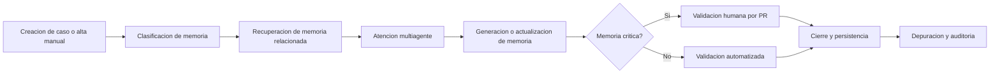

# Vision del Producto
- **Fase**: 0-Descubrimiento
- **Entregable**: Vision del Producto
- **Responsable**: business-analyst
- **Fecha**: 2026-05-01
- **Estado**: Completado
---

## 1. Proposito y justificacion

**PMOA - Plataforma de Memoria Operativa para Agentes** tiene como proposito capturar, estructurar, relacionar, validar, reutilizar y auditar conocimiento operativo para reducir la perdida de conocimiento, aumentar la reutilizacion y mejorar la consistencia de respuesta de agentes y operadores.

La necesidad de negocio surge porque hoy el conocimiento operativo:
- se pierde entre casos resueltos, conversaciones y acciones no documentadas;
- se reutiliza poco o de forma manual;
- produce respuestas inconsistentes entre agentes;
- tiene baja trazabilidad sobre origen, cambios, validacion y depuracion;
- dificulta distinguir memoria confiable de memoria obsoleta, duplicada o no validada.

La vision del MVP es disponer de una plataforma **backend, API-first y lista para produccion inicial** que permita gestionar memorias operativas en un repositorio unico, con soporte para creacion, clasificacion, recuperacion, validacion, persistencia, auditoria y depuracion, usando flujos operativos basados en Git/GitHub.

## 2. Problema que resuelve

La plataforma busca resolver de forma prioritaria:
- perdida de conocimiento operativo reutilizable;
- baja velocidad para encontrar antecedentes utiles;
- respuestas distintas ante situaciones similares;
- dificultad para auditar de donde salio una memoria y quien la cambio;
- baja capacidad para depurar memoria generada por agentes.

## 3. Objetivo del producto

Habilitar un proceso confiable y auditable para transformar casos y conocimiento operativo en memorias reutilizables, con mecanismos de clasificacion, busqueda, validacion y depuracion que permitan su uso posterior por agentes y equipos operativos.

## 4. Usuarios objetivo MVP y necesidades

### 4.1 Roles MVP propuestos

Se proponen los siguientes roles MVP por ser los minimos necesarios para operar el ciclo de vida de la memoria sin incorporar una UI dedicada:

| Rol MVP | Descripcion | Necesidades principales |
|---|---|---|
| Operador de Memoria | Usuario que crea memorias desde casos o manualmente | Registrar conocimiento rapido, con estructura minima y trazabilidad |
| Revisor/Validador | Usuario responsable de aprobar memorias criticas por PR manual | Ver origen, cambios, criticidad y decidir aprobacion o rechazo |
| Consumidor Operativo | Usuario o agente que consulta memoria para resolver casos | Encontrar memoria relevante, confiable y actualizada |
| Administrador de Memoria | Responsable de depuracion y gobierno operativo del repositorio | Archivar, fusionar duplicadas, eliminar y mantener calidad del repositorio |
| Auditor/Owner de Dominio | Responsable de revisar cumplimiento, trazabilidad y calidad por dominio | Ver historial, responsables, estado y cobertura del conocimiento |

### 4.2 Justificacion de roles propuestos

- **Operador de Memoria** es necesario porque la memoria puede originarse desde un caso o de forma manual.
- **Revisor/Validador** es necesario porque existe validacion humana obligatoria para memorias criticas.
- **Consumidor Operativo** representa el beneficio principal del producto: reutilizacion efectiva del conocimiento.
- **Administrador de Memoria** es necesario por el alcance explicito de depuracion: archivar, marcar duplicadas, fusionar y eliminar.
- **Auditor/Owner de Dominio** es adecuado porque la plataforma debe ser auditable y los dominios son dinamicos.

> Nota: en el MVP un mismo usuario puede cumplir mas de un rol, segun permisos del repositorio y proceso operativo definido por el negocio.

## 5. Necesidades por usuario

| Usuario/Rol | Necesidad | Resultado esperado |
|---|---|---|
| Operador de Memoria | Crear memoria desde caso o manualmente | Conocimiento capturado con estructura y contexto minimo |
| Consumidor Operativo | Buscar por significado y filtros | Recuperar memorias utiles para resolver mas rapido |
| Revisor/Validador | Validar memorias criticas | Asegurar confiabilidad antes de reutilizacion sensible |
| Administrador de Memoria | Depurar repositorio | Reducir ruido, duplicidad y obsolescencia |
| Auditor/Owner de Dominio | Revisar trazabilidad | Confirmar origen, historial y estado de validacion |

## 6. Alcance de alto nivel

### 6.1 Incluye

- Creacion de memorias desde casos.
- Creacion manual de memorias.
- Uso de Markdown con frontmatter YAML como formato estandar de memoria.
- Gestion de un repositorio unico de memorias.
- Clasificacion de memorias por tipo y dominio.
- Recuperacion de memorias mediante busqueda semantica y filtros estructurados.
- Relacionamiento de memorias y dominios.
- Validacion automatizada y validacion humana para memorias criticas.
- Persistencia y auditoria de cambios basada en Git.
- Depuracion de memoria: archivar, marcar duplicadas, fusionar y eliminar.
- Exposicion mediante API para integracion con otros componentes.

### 6.2 Fuera de alcance del MVP

- UI dedicada para usuarios finales.
- Resolucion de la orquestacion multiagente en esta plataforma.
- Gestion de visibilidad fina por memoria dentro del mismo repositorio.
- Soporte multi-repositorio en la primera version.
- Flujos especificos para proveedores no Git/GitHub en el MVP.
- Automatizacion completa de aprobacion humana de memorias criticas.
- Modelado cerrado y definitivo de dominios de negocio.

## 7. Flujo objetivo de negocio

## 8. Tipos iniciales de memoria

Los tipos iniciales sugeridos para el MVP son:
- Resolucion de caso
- Procedimiento
- Decision
- Incidente / Postmortem
- Leccion aprendida
- Patron reutilizable

## 9. Criterios de criticidad propuestos

Se propone tratar la criticidad como un criterio de negocio para decidir el nivel de validacion requerido antes de reutilizar memoria.

### 9.1 Niveles propuestos

| Nivel | Descripcion | Validacion requerida |
|---|---|---|
| Baja | Error o uso inadecuado genera impacto limitado y reversible | Validacion automatizada |
| Media | Puede afectar calidad operativa, tiempos o consistencia | Validacion automatizada reforzada y muestreo humano segun politica |
| Alta | Puede provocar impacto relevante en operacion, cliente, cumplimiento o decisiones | Validacion humana obligatoria por PR |
| Critica | Puede causar riesgo severo, incumplimiento, incidente mayor o daño reputacional | Validacion humana obligatoria y trazabilidad reforzada |

### 9.2 Factores para determinar criticidad

| ID | Condicion | Accion | Excepciones |
|---|---|---|---|
| RC-01 | La memoria contiene pasos operativos que pueden alterar datos, configuraciones o estados productivos | Clasificar al menos como Alta | Salvo definicion formal distinta del negocio |
| RC-02 | La memoria impacta cumplimiento normativo, auditoria o evidencia operativa | Clasificar como Critica | Ninguna en MVP |
| RC-03 | La memoria se usa para decisiones repetibles de negocio con impacto externo | Clasificar al menos como Alta | Puede bajar a Media si el impacto es totalmente reversible y acotado |
| RC-04 | La memoria es una leccion aprendida o referencia interna sin accion operativa sensible | Clasificar como Baja o Media | Si incluye decisiones sensibles, reevaluar |
| RC-05 | La memoria fue generada por agentes con baja evidencia o fuentes incompletas | Elevar un nivel la criticidad base | Salvo que exista validacion humana previa |
| RC-06 | La memoria afecta multiples dominios o equipos | Clasificar al menos como Alta | Salvo uso meramente informativo |

### 9.3 Justificacion

Estos criterios son adecuados al contexto porque priorizan el riesgo operativo, la auditabilidad y la confiabilidad de la memoria reutilizable, que son los problemas centrales del producto.

## 10. Supuestos y restricciones

### 10.1 Supuestos

- El repositorio Git sera la fuente operativa unica de memorias del MVP.
- Los usuarios MVP tendran acceso operativo a Git/GitHub.
- La organizacion acepta visibilidad total del contenido para quienes tengan acceso al repositorio.
- La estructura Markdown + YAML sera suficiente para representar los tipos iniciales de memoria.
- Los dominios podran evolucionar dinamicamente sin bloquear el MVP.
- La validacion humana se realizara mediante PR manual para memorias criticas.

### 10.2 Restricciones

- No habra UI dedicada en el MVP inicial.
- La plataforma se enfoca en memoria, no en orquestacion de agentes.
- El alcance inicial contempla un solo repositorio de memorias.
- La portabilidad a otros proveedores Git queda diferida a evolucion futura.
- Si una memoria se elimina, debe borrarse del sistema activo, manteniendo trazabilidad historica en Git.

## 11. Dependencias relevantes

- Git/GitHub como interfaz operativa principal del MVP.
- Proceso de PR para validacion humana.
- Definicion de politicas de criticidad por negocio.
- Definicion progresiva de dominios y ownership.

## 12. Criterios de exito medibles

El MVP se considerara exitoso si logra evidenciar, durante una ventana de adopcion inicial, los siguientes resultados:

| ID | Criterio de exito | Meta inicial |
|---|---|---|
| CE-01 | Porcentaje de memorias almacenadas con tipo, dominio, origen y estado de validacion completos | >= 95% |
| CE-02 | Porcentaje de casos piloto en los que se recupera al menos una memoria relevante | >= 70% |
| CE-03 | Reduccion del tiempo de localizacion de conocimiento operativo en casos piloto | >= 30% versus linea base |
| CE-04 | Porcentaje de memorias criticas publicadas con validacion humana registrada | 100% |
| CE-05 | Porcentaje de memorias con trazabilidad verificable de creacion y cambios | 100% |
| CE-06 | Porcentaje de duplicados detectados o memorias obsoletas tratadas en el ciclo de depuracion | >= 80% de los identificados |
| CE-07 | Consistencia de respuesta en escenarios piloto repetibles usando memoria reutilizable | Mejora medible definida por QA/PO en al menos 3 casos piloto |

> Nota: las metas que dependen de linea base o medicion operativa deben validarse con Product Owner antes de adoptarse como compromiso formal.

## 13. Criterios de aceptacion de la vision

### AC-01 Alcance del producto
**Given** una revision del documento de vision  
**When** el Product Owner y stakeholders de discovery lo analicen  
**Then** deben poder identificar claramente que incluye y que no incluye el MVP.

### AC-02 Usuarios objetivo
**Given** el documento de vision  
**When** se revisen los usuarios objetivo del MVP  
**Then** deben estar definidos los roles minimos para crear, consumir, validar, depurar y auditar memoria.

### AC-03 Criticidad
**Given** una memoria candidata a incorporarse al repositorio  
**When** se evalua su impacto operativo  
**Then** debe poder clasificarse en un nivel de criticidad con una regla clara de validacion asociada.

### AC-04 Exito medible
**Given** la definicion del MVP  
**When** el equipo prepare la etapa siguiente  
**Then** debe contar con criterios de exito medibles para seguimiento y validacion.

## 14. Resumen ejecutivo

PMOA busca convertirse en la base confiable y auditable de memoria operativa reutilizable para agentes y equipos. El MVP debe concentrarse en capturar y gobernar memoria de forma estructurada, sin UI propia, usando Git/GitHub como interfaz operativa inicial, con foco en trazabilidad, recuperacion efectiva, validacion por criticidad y depuracion continua.
