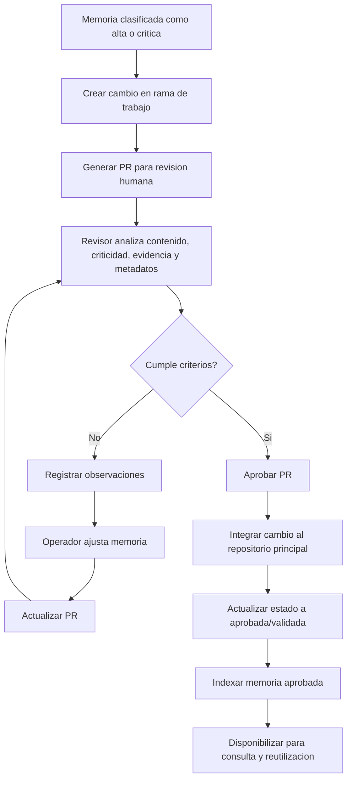
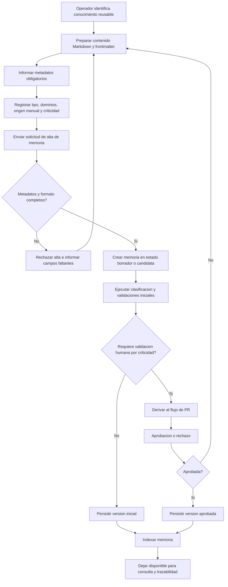
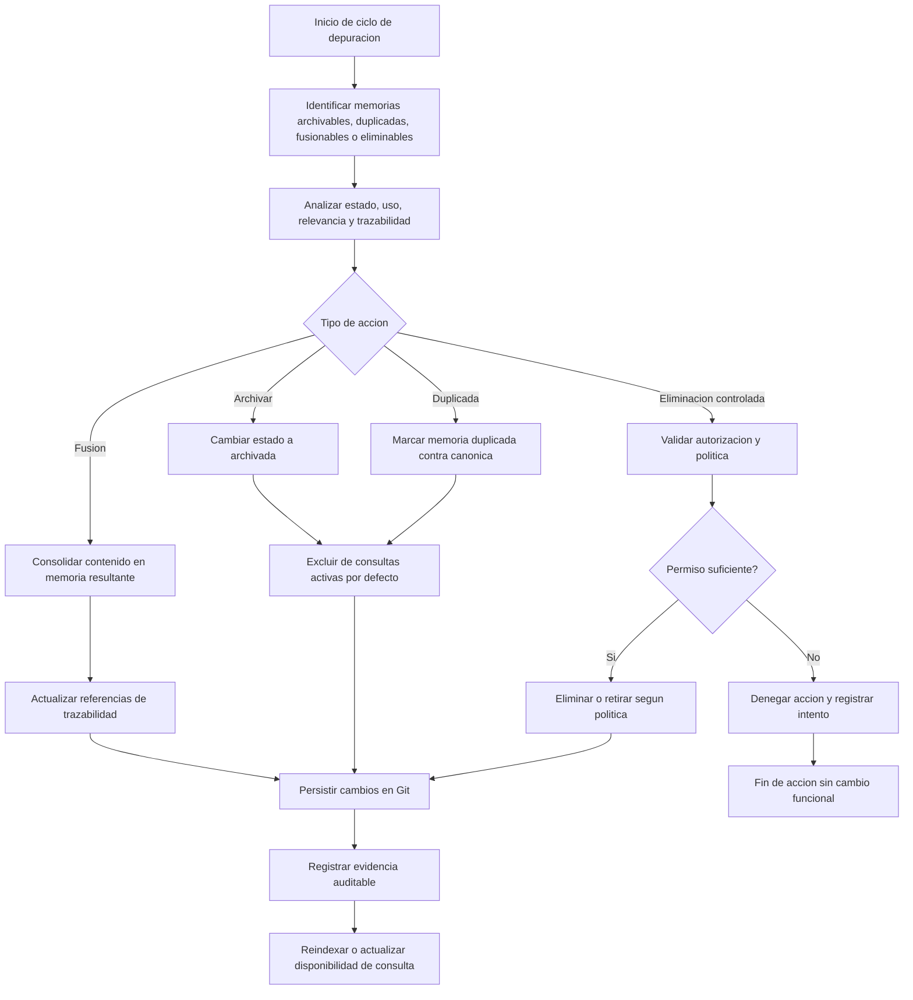
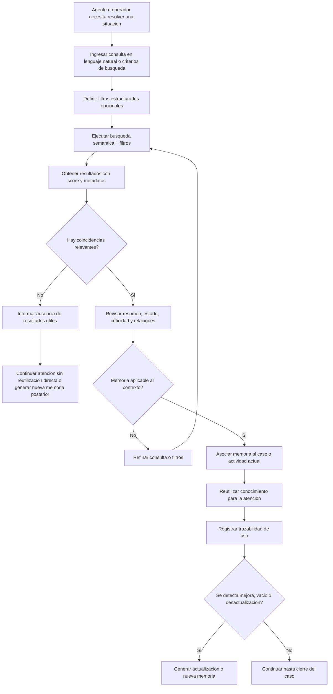

# Diagramas de Proceso
- **Fase**: 2-Analisis Funcional
- **Entregable**: Diagramas de Proceso
- **Responsable**: business-analyst
- **Fecha**: 2026-05-01
- **Estado**: Completado
---

## 1. Objetivo

Documentar los flujos funcionales principales del MVP PMOA / Abax-Memory para alinear negocio, analisis, QA y equipos tecnicos sobre el ciclo de vida de los casos y memorias operativas.

## 2. Alcance funcional considerado

### Incluye
- Creacion de caso y alta manual de memoria.
- Clasificacion por tipo, dominio y criticidad.
- Recuperacion de memorias por busqueda semantica y filtros.
- Atencion operativa multiagente con trazabilidad de aportes.
- Generacion de memoria desde caso o manual.
- Validacion automatizada y validacion humana por PR para memorias criticas.
- Cierre, persistencia versionada, auditoria y depuracion.

### No incluye
- UI dedicada para operar los flujos.
- Orquestacion general de agentes fuera del registro colaborativo del caso.
- Aprobacion automatica de memorias criticas sin intervencion humana.
- Multi-repositorio o visibilidad fina por memoria.

## 3. Actores funcionales referenciados

- **Operador de Memoria**: crea casos y memorias.
- **Consumidor Operativo / Agente**: consulta memorias para reutilizacion.
- **Revisor / Validador**: aprueba o rechaza memorias criticas.
- **Administrador de Memoria**: ejecuta depuracion y saneamiento.
- **Sistema PMOA / Abax-Memory**: valida, versiona, indexa y deja trazabilidad.

## 4. Diagramas de proceso

### 4.1 Flujo principal end-to-end

Describe el recorrido funcional base desde el inicio de una necesidad operativa hasta la persistencia y depuracion posterior del conocimiento generado.

```mermaid
flowchart LR
    A[Inicio de necesidad operativa] --> B{Origen del flujo}
    B -- Caso operativo --> C[Crear caso]
    B -- Conocimiento directo --> D[Crear memoria manual]
    C --> E[Clasificar caso y contexto]
    E --> F[Buscar memorias relacionadas]
    F --> G{Existe memoria util reutilizable?}
    G -- Si --> H[Asociar memoria al caso y reutilizar]
    G -- No --> I[Atender caso con aportes multiagente]
    H --> J{Se requiere nueva memoria o actualizacion?}
    I --> J
    D --> K[Validar estructura minima de memoria]
    J -- Si --> L[Generar o actualizar memoria]
    J -- No --> M[Cerrar caso con trazabilidad]
    L --> N[Clasificar memoria por tipo, dominio y criticidad]
    K --> N
    N --> O{Memoria critica o alta?}
    O -- Si --> P[Enviar a validacion humana por PR]
    O -- No --> Q[Ejecutar validacion automatizada]
    P --> R{Aprobada?}
    R -- No --> S[Registrar observaciones y volver a ajuste]
    S --> L
    R -- Si --> T[Persistir en repositorio Git]
    Q --> U{Valida?}
    U -- No --> V[Registrar error y corregir borrador]
    V --> L
    U -- Si --> T
    T --> W[Indexar y dejar disponible para busqueda]
    W --> M
    M --> X[Registrar auditoria y evidencias]
    X --> Y[Ejecutar depuracion periodica]
```

### 4.2 Flujo de validacion critica por PR

Detalla el control obligatorio para memorias de criticidad alta o critica antes de quedar disponibles para uso operativo.

### 4.3 Flujo de creacion manual de memoria

Representa el alta de conocimiento que no nace de un caso previo, pero debe conservar estructura, validacion y trazabilidad equivalentes.

### 4.4 Flujo de depuracion de memorias

Muestra el saneamiento operativo del repositorio para reducir ruido, duplicidad u obsolescencia sin perder evidencia historica.

### 4.5 Flujo de recuperacion y busqueda de memoria

Explica como un agente u operador consulta el repositorio para reutilizar conocimiento existente antes de generar nueva memoria.

## 5. Observaciones funcionales para uso del documento

- Los diagramas reflejan el **MVP aprobado API-first**, sin asumir una interfaz web dedicada.
- La **validacion humana por PR** aplica a memorias de criticidad alta o critica, en linea con el alcance ya aprobado.
- La **atencion multiagente** se interpreta como registro y consolidacion de aportes sobre el caso, no como orquestacion integral de agentes.
- La **depuracion** no elimina la necesidad de trazabilidad: cualquier accion debe dejar evidencia auditable.
- La **recuperacion** debe ocurrir antes de crear nuevo conocimiento cuando existan antecedentes reutilizables.

## 6. Uso esperado por equipo

- **Negocio / Product Owner**: validar cobertura funcional y secuencia operativa.
- **QA funcional**: derivar escenarios de prueba por flujo principal y excepciones.
- **Arquitectura / Tech Lead**: alinear contratos API y estados funcionales sin alterar el alcance.
- **Proyecto**: usar los diagramas como base para trazabilidad de requerimientos y criterios de aceptacion.
