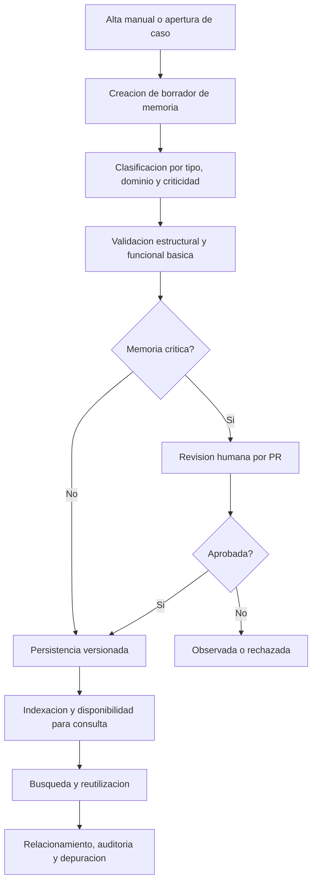

# Especificacion Funcional
- **Fase**: 2-Analisis Funcional
- **Entregable**: Especificacion Funcional
- **Responsable**: business-analyst
- **Fecha**: 2026-05-01
- **Estado**: Completado
---

## 1. Objetivo del documento

Definir el comportamiento funcional del MVP de **PMOA / Abax-Memory** para que arquitectura, desarrollo, QA y UAT cuenten con una base comun, verificable y sin ambiguedad sobre el producto aprobado.

## 2. Referencias de origen

| Artefacto | Fase | Uso en este documento |
|---|---|---|
| Vision del Producto | 0-Descubrimiento | Objetivo, alcance, roles y restricciones |
| Mapa de Epicas y Features | 0-Descubrimiento | Estructura funcional y trazabilidad |
| Historias de Usuario | 0-Descubrimiento | Necesidades detalladas y criterios base |
| Product Backlog Priorizado | 0-Descubrimiento | Priorizacion MVP / R1 / R2 / R3 |
| Acta de Constitucion | 1-Inicio | Alcance aprobado y restricciones de proyecto |

## 3. Alcance funcional del MVP

### 3.1 Incluye

- Gestion de memorias operativas en formato Markdown con frontmatter.
- Creacion de memorias manuales.
- Creacion de memorias a partir de casos.
- Borrador, validacion, aprobacion y cambio de estado de memorias.
- Busqueda semantica con filtros estructurados.
- Relacionamiento de memorias, casos y dominios.
- Persistencia versionada en Git/GitHub.
- Trazabilidad y auditoria de origen, cambios y decisiones.
- Archivado de memorias.
- Deteccion y gestion de duplicidad, fusion y eliminacion controlada segun prioridad aprobada.
- Exposicion de capacidades mediante API REST.

### 3.2 Fuera de alcance del MVP

- UI dedicada para usuarios finales.
- Orquestacion general de agentes.
- Visibilidad granular por memoria dentro del mismo repositorio.
- Soporte multi-repositorio en la primera version.
- Aprobacion automatica de memorias criticas sin intervencion humana.
- Proveedores Git distintos de GitHub como primera implementacion operativa.
- Modelado cerrado y definitivo de dominios de negocio.

## 4. Objetivo funcional del producto

Permitir que el conocimiento operativo sea capturado, estructurado, validado, reutilizado y auditado en un repositorio unico, con capacidad de consulta por API y controles de criticidad acordes al riesgo operativo.

## 5. Actores funcionales

| Actor | Descripcion | Capacidades funcionales principales |
|---|---|---|
| Operador de Memoria | Usuario que crea o actualiza memorias | Crear, editar, clasificar, relacionar, archivar |
| Revisor/Validador | Usuario que aprueba memorias criticas | Revisar PR, aprobar, observar o rechazar |
| Consumidor Operativo | Usuario o agente que consulta memoria | Buscar, filtrar, consultar detalle, reutilizar |
| Administrador de Memoria | Responsable de calidad del repositorio | Depurar, marcar duplicadas, fusionar, eliminar bajo control |
| Auditor/Owner de Dominio | Responsable de control y trazabilidad | Consultar historial, validaciones y relaciones |
| Sistema Consumidor API | Integracion autorizada | Invocar endpoints REST del MVP |

> Nota: un mismo usuario puede cumplir varios roles si el proceso operativo y los permisos del repositorio lo permiten.

## 6. Modulos funcionales

| Modulo | Objetivo |
|---|---|
| MF-01 Gestion de Casos | Registrar contexto operativo del caso origen y su cierre |
| MF-02 Modelo Canonico de Memoria | Estandarizar la estructura de memoria reusable |
| MF-03 Captura y Generacion de Memoria | Crear memorias manuales o desde casos |
| MF-04 Clasificacion y Extraccion Estructurada | Tipificar, etiquetar y enriquecer minimamente la memoria |
| MF-05 Recuperacion y Reutilizacion | Localizar memorias relevantes mediante busqueda y filtros |
| MF-06 Relacionamiento de Conocimiento | Conectar memorias, casos y dominios |
| MF-07 Validacion y Aprobacion | Aplicar controles estructurales, funcionales y humanos |
| MF-08 Persistencia y Versionado Operativo | Versionar y auditar cambios en Git/GitHub |
| MF-09 Depuracion y Ciclo de Vida | Archivar, marcar duplicadas, fusionar y eliminar bajo control |
| MF-10 Auditoria y Trazabilidad | Consultar origen, cambios, aprobaciones y acciones de saneamiento |
| MF-11 Plataforma API-First | Exponer operaciones funcionales via REST |

## 7. Flujo funcional principal TO-BE



## 8. Entradas y salidas funcionales

| Proceso | Entradas | Salidas |
|---|---|---|
| Alta manual de memoria | Metadata, contenido Markdown, criticidad, dominios | Memoria borrador o publicada, ID unico, referencia de version |
| Alta de memoria desde caso | ID de caso, datos del caso, criticidad, dominios | Memoria vinculada a caso origen |
| Busqueda de memoria | Consulta natural, filtros, topK | Lista ordenada de coincidencias y metadatos |
| Validacion | Archivo Markdown, metadata, relaciones, criticidad | Resultado valido/invalido/observado |
| Aprobacion critica | Memoria en revision, decision humana | Aprobada, observada o rechazada |
| Archivado o depuracion | ID de memoria, motivo, accion | Cambio de estado y evidencia auditable |
| Consulta de trazabilidad | ID de memoria o caso | Historial, relaciones, aprobaciones y cambios |

## 9. Especificacion funcional por modulo

### 9.1 MF-01 Gestion de Casos

**Proposito**: registrar el caso que origina una memoria y mantener trazabilidad hasta su cierre.

**Requerimientos funcionales**
- **RF-001** El sistema debe permitir crear un caso con identificador unico, origen, titulo, descripcion y estado inicial.
- **RF-002** El sistema debe permitir registrar metadata operativa del caso: prioridad, dominio, criticidad, etiquetas y responsables participantes.
- **RF-003** El sistema debe permitir iniciar la atencion de un caso aunque no exista memoria previa relacionada.
- **RF-004** El sistema debe permitir cerrar el caso con resultado operativo y vinculo a memoria reutilizada o generada.

**Excepciones**
- Caso inexistente o ID invalido: la operacion dependiente debe rechazarse.
- Cierre de caso sin resultado minimo: no debe completarse el cierre.

### 9.2 MF-02 Modelo Canonico de Memoria

**Proposito**: definir la estructura estandar de la memoria reutilizable.

**Requerimientos funcionales**
- **RF-005** Toda memoria debe almacenarse en Markdown con frontmatter YAML valido.
- **RF-006** La memoria debe soportar origen `caso` y `manual`.
- **RF-007** La memoria debe registrar metadata minima obligatoria para dominio, estado, fuentes, fecha, version, criticidad y relaciones.
- **RF-008** La memoria debe cumplir convenciones de nombre, ruta y organizacion dentro del repositorio unico.

**Excepciones**
- Frontmatter ausente o ilegible: la memoria no debe aceptarse.
- Campos obligatorios faltantes: la memoria no debe persistirse.

### 9.3 MF-03 Captura y Generacion de Memoria

**Proposito**: transformar conocimiento operativo en memoria persistible.

**Requerimientos funcionales**
- **RF-009** El sistema debe permitir crear una memoria manualmente sin depender de un caso previo.
- **RF-010** El sistema debe permitir generar una memoria desde un caso valido.
- **RF-011** El sistema debe crear un borrador editable antes de la publicacion final cuando la informacion requiera revision previa.
- **RF-012** El sistema debe asignar una primera version formal al aprobarse la publicacion.

**Excepciones**
- Caso origen inexistente: no debe generarse la memoria desde caso.
- Informacion incompleta del caso: debe generarse borrador con faltantes identificados, no una publicacion final automatica.

### 9.4 MF-04 Clasificacion y Extraccion Estructurada

**Proposito**: dejar la memoria utilizable para busqueda, relacionamiento y validacion.

**Requerimientos funcionales**
- **RF-013** El sistema debe clasificar la memoria por dominio y tipo.
- **RF-014** El sistema debe extraer estructura minima: entidades, pasos, decisiones, evidencias y resultados cuando aplique.
- **RF-015** El sistema debe permitir generar o asignar etiquetas operativas.
- **RF-016** El sistema debe identificar criticidad para activar controles de validacion.

**Excepciones**
- Dominio obligatorio no informado: la memoria no debe publicarse.
- Clasificacion inconsistente con contenido: la memoria debe quedar observada o invalidada.

### 9.5 MF-05 Recuperacion y Reutilizacion

**Proposito**: localizar conocimiento relevante antes de crear nuevo contenido.

**Requerimientos funcionales**
- **RF-017** El sistema debe permitir busqueda semantica de memorias por consulta en lenguaje natural.
- **RF-018** El sistema debe permitir filtros por dominio, etiquetas, estado, criticidad, fecha, origen y tipo.
- **RF-019** El sistema debe devolver coincidencias con score, resumen y metadatos clave.
- **RF-020** El sistema debe permitir asociar memorias recuperadas a un caso activo.

**Excepciones**
- Sin coincidencias relevantes: debe devolverse resultado vacio controlado.
- Filtros invalidos: la solicitud debe rechazarse con error consistente.

### 9.6 MF-06 Relacionamiento de Conocimiento

**Proposito**: representar conexiones funcionales entre memorias, casos y dominios.

**Requerimientos funcionales**
- **RF-021** El sistema debe permitir relaciones entre memorias del tipo `relacionada-con`, `complementa`, `reemplaza` o `depende-de`.
- **RF-022** El sistema debe permitir asociar memorias a uno o varios dominios dinamicos.
- **RF-023** El sistema debe mantener vinculacion entre caso origen, memorias consultadas y memoria resultante.
- **RF-024** El sistema debe permitir consultar conexiones relevantes para navegacion contextual.

**Excepciones**
- Memoria destino inexistente: no debe registrarse la relacion.
- Relacion no valida o no soportada: debe rechazarse.

### 9.7 MF-07 Validacion y Aprobacion

**Proposito**: asegurar calidad minima antes de publicar memoria reutilizable.

**Requerimientos funcionales**
- **RF-025** El sistema debe validar automaticamente frontmatter, campos obligatorios y formato.
- **RF-026** El sistema debe validar consistencia minima entre contenido, clasificacion y relaciones.
- **RF-027** Las memorias criticas deben requerir aprobacion humana mediante PR manual antes de quedar aprobadas.
- **RF-028** El sistema debe manejar estados de validacion y ciclo de vida al menos para borrador, validada, observada, aprobada, archivada y rechazada.

**Excepciones**
- Memoria critica sin aprobacion humana: no debe quedar publicada como aprobada.
- Rechazo del revisor: la memoria debe permanecer no disponible para reutilizacion normal.

### 9.8 MF-08 Persistencia y Versionado Operativo

**Proposito**: asegurar auditoria y portabilidad operacional.

**Requerimientos funcionales**
- **RF-029** El sistema debe persistir memorias en un repositorio unico de Git.
- **RF-030** El sistema debe registrar en Git las altas, actualizaciones, fusiones y archivados.
- **RF-031** El sistema debe operar el flujo Git completo sin UI dedicada.
- **RF-032** El sistema debe soportar GitHub como proveedor inicial del MVP.

**Excepciones**
- Falla de persistencia Git: la operacion no debe considerarse completada.
- Cambio sin referencia de version: debe tratarse como inconsistencia operativa.

### 9.9 MF-09 Depuracion y Ciclo de Vida

**Proposito**: mantener la calidad del repositorio.

**Requerimientos funcionales**
- **RF-033** El sistema debe permitir archivar memorias y retirarlas de consultas activas por defecto.
- **RF-034** El sistema debe identificar posibles memorias duplicadas para revision.
- **RF-035** El sistema debe permitir marcar una memoria como duplicada de una memoria canonica.
- **RF-036** El sistema debe permitir fusionar memorias manteniendo trazabilidad de origen.
- **RF-037** El sistema debe permitir eliminacion controlada solo bajo autorizacion y evidencia auditable.

**Excepciones**
- Usuario sin autorizacion suficiente para eliminar: la accion debe denegarse.
- Fusion con memorias no elegibles: la operacion debe rechazarse.

### 9.10 MF-10 Auditoria y Trazabilidad

**Proposito**: hacer verificable el ciclo de vida completo del conocimiento.

**Requerimientos funcionales**
- **RF-038** El sistema debe permitir consultar historial de cambios de una memoria.
- **RF-039** El sistema debe mantener trazabilidad extremo a extremo entre caso, clasificacion, validacion, persistencia y cierre.
- **RF-040** El sistema debe conservar evidencias de validacion, observaciones y aprobaciones.
- **RF-041** El sistema debe registrar acciones de archivado, fusion, duplicidad y eliminacion.

### 9.11 MF-11 Plataforma API-First

**Proposito**: exponer las capacidades funcionales del MVP a sistemas consumidores y flujos operativos.

**Requerimientos funcionales**
- **RF-042** El sistema debe exponer API REST para casos.
- **RF-043** El sistema debe exponer API REST para memorias.
- **RF-044** El sistema debe exponer API REST para busqueda y consulta de relaciones.
- **RF-045** El sistema debe exponer API REST para auditoria y acciones de depuracion controlada.
- **RF-046** Cada endpoint funcional debe documentar metodo HTTP, path y payload JSON de request/response.

## 10. Flujos funcionales principales

### 10.1 Flujo A - Crear memoria manual
1. El operador envia metadata minima y contenido.
2. El sistema valida frontmatter y campos obligatorios.
3. El sistema clasifica tipo, dominio y criticidad.
4. El sistema crea memoria en estado borrador o validada segun resultado.
5. Si la memoria es critica, pasa a revision humana.
6. Si no es critica y supera validaciones, se persiste en Git.
7. El sistema registra version, trazabilidad e indexacion.

### 10.2 Flujo B - Crear memoria desde caso
1. El operador informa el ID de caso.
2. El sistema recupera el contexto del caso.
3. El sistema genera una propuesta o borrador de memoria.
4. El operador revisa y completa campos faltantes.
5. Se ejecutan clasificacion, validacion y persistencia segun criticidad.
6. El caso queda vinculado a la memoria resultante.

### 10.3 Flujo C - Buscar y reutilizar memoria
1. El consumidor envia consulta natural y filtros.
2. El sistema ejecuta busqueda semantica.
3. El sistema aplica filtros estructurados.
4. El sistema devuelve resultados ordenados por relevancia.
5. El operador asocia memoria recuperada a un caso activo si corresponde.

### 10.4 Flujo D - Validar memoria critica
1. El sistema identifica criticidad alta o critica.
2. La memoria queda en revision pendiente.
3. El revisor humano analiza contenido, evidencia y riesgo.
4. El revisor aprueba, observa o rechaza.
5. Si aprueba, el sistema persiste la version aprobada y la deja disponible.
6. Si observa o rechaza, la memoria no queda publicada como aprobada.

### 10.5 Flujo E - Archivar o depurar memoria
1. El administrador identifica memoria obsoleta, duplicada o fusionable.
2. El sistema valida elegibilidad de la accion.
3. Se ejecuta archivado, marcado de duplicidad, fusion o eliminacion controlada.
4. El sistema registra evidencia auditable y actualiza el estado operativo.

## 11. Reglas funcionales de negocio

| ID | Condicion | Accion | Excepciones |
|---|---|---|---|
| RN-001 | La memoria se crea o actualiza | Debe almacenarse en Markdown con frontmatter valido | Ninguna |
| RN-002 | Falta al menos un campo obligatorio de metadata | La memoria no debe persistirse | Ninguna |
| RN-003 | La memoria proviene de un caso | Debe quedar vinculada al caso origen | Salvo que el caso informado sea invalido; en ese caso se rechaza |
| RN-004 | La memoria es clasificada con criticidad alta o critica | Debe requerir revision humana por PR antes de aprobarse | Ninguna validada para MVP |
| RN-005 | La memoria es de criticidad baja | Puede seguir validacion automatizada sin PR manual | Si otra politica aprobada del negocio eleva criticidad |
| RN-006 | La memoria impacta cumplimiento, auditoria o evidencia operativa | Debe tratarse al menos como critica | Ninguna en MVP |
| RN-007 | La memoria afecta datos, configuraciones o estados productivos | Debe clasificarse al menos como alta | Salvo definicion formal aprobada distinta |
| RN-008 | Se consulta memoria en modo estandar | No deben devolverse archivadas ni duplicadas salvo solicitud explicita | No aplica cuando el filtro incluye esos estados |
| RN-009 | Se detecta duplicidad potencial por encima del umbral vigente | La memoria debe marcarse para revision, no fusionarse automaticamente | Ninguna |
| RN-010 | Se archiva una memoria | Debe dejar de aparecer en consultas activas por defecto, conservando historial | Ninguna |
| RN-011 | Se elimina una memoria | Debe existir autorizacion y evidencia auditable | Si no hay permisos, la operacion se deniega |
| RN-012 | Se registra una relacion entre memorias | Ambas memorias deben existir y el tipo de relacion debe ser valido | Ninguna |
| RN-013 | Se aprueba una memoria critica | Debe conservarse evidencia de aprobacion y version publicada | Ninguna |
| RN-014 | Existe cambio persistido sobre una memoria | Debe quedar referencia de version e historial de cambio | Ninguna |
| RN-015 | Se incorpora un nuevo dominio aprobado | Debe poder usarse sin redisenar el modelo funcional | Su alta depende de validacion previa del negocio |

## 12. Estados funcionales principales

| Entidad | Estados |
|---|---|
| Caso | Abierto, En atencion, Cerrado |
| Memoria | Borrador, Validada, En revision, Aprobada, Observada, Rechazada, Archivada, Duplicada, Eliminada controlada |
| Indexacion/Procesamiento | Pendiente, En proceso, Disponible, Fallida |

## 13. Contratos funcionales API REST de referencia

> Estos contratos reflejan necesidades funcionales aprobadas. El detalle tecnico definitivo debe formalizarse en fase de diseno tecnico sin alterar el alcance aprobado.

### 13.1 Casos

| Metodo | Path | Proposito |
|---|---|---|
| POST | /api/casos | Crear caso operativo |
| GET | /api/casos/{id} | Consultar detalle de caso |
| PATCH | /api/casos/{id} | Actualizar metadata de caso |
| POST | /api/casos/{id}/cerrar | Cerrar caso y registrar resultado |

**Payload JSON de referencia - crear caso**
```json
{
  "titulo": "Incidencia operativa en regularizacion",
  "descripcion": "Caso sin memoria previa asociada",
  "origen": "operacion",
  "prioridad": "alta",
  "dominio": "regularizacion",
  "criticidad": "media",
  "etiquetas": ["incidencia", "regularizacion"]
}
```

### 13.2 Memorias

| Metodo | Path | Proposito |
|---|---|---|
| POST | /api/memorias | Crear memoria manual |
| POST | /api/memorias/desde-caso | Crear memoria desde caso |
| GET | /api/memorias/{id} | Consultar memoria |
| GET | /api/memorias | Listar memorias con filtros |
| PATCH | /api/memorias/{id} | Actualizar contenido o metadata |
| PATCH | /api/memorias/{id}/estado | Cambiar estado operativo |
| POST | /api/memorias/{id}/aprobar | Aprobar memoria critica |
| POST | /api/memorias/{id}/relaciones | Registrar relaciones |
| POST | /api/memorias/{id}/fusion | Fusionar memorias |

**Payload JSON de referencia - crear memoria manual**
```json
{
  "titulo": "Procedimiento de regularizacion operativa",
  "tipo": "procedimiento",
  "origen": "manual",
  "dominios": ["operaciones", "regularizacion"],
  "criticidad": "alta",
  "contenidoMarkdown": "# Resumen\n...",
  "metadata": {
    "fuente": "manual",
    "autor": "usuario.operativo"
  }
}
```

**Payload JSON de referencia - crear memoria desde caso**
```json
{
  "caseId": "CASO-12345",
  "criticidad": "media",
  "dominios": ["cobranzas"],
  "forzarRevisionHumana": false
}
```

**Payload JSON de referencia - cambio de estado**
```json
{
  "estadoObjetivo": "archivada",
  "motivo": "obsolescencia funcional"
}
```

### 13.3 Busqueda y recuperacion

| Metodo | Path | Proposito |
|---|---|---|
| POST | /api/memorias/busqueda | Busqueda semantica con filtros |
| GET | /api/memorias/{id}/relaciones | Consultar red de relaciones |

**Payload JSON de referencia - busqueda**
```json
{
  "query": "como regularizar una incidencia de cobranza",
  "topK": 10,
  "filtros": {
    "dominios": ["cobranzas"],
    "estado": ["aprobada"],
    "criticidad": ["media", "alta"]
  }
}
```

### 13.4 Auditoria y depuracion

| Metodo | Path | Proposito |
|---|---|---|
| GET | /api/memorias/{id}/trazabilidad | Consultar trazabilidad completa |
| POST | /api/memorias/{id}/archivar | Archivar memoria |
| POST | /api/memorias/{id}/duplicada | Marcar duplicidad |
| DELETE | /api/memorias/{id} | Eliminar memoria bajo control |

## 14. Dependencias funcionales

| Dependencia | Uso funcional |
|---|---|
| Git | Fuente operativa unica y versionado |
| GitHub | Proveedor inicial para repositorio y PR manual |
| PostgreSQL | Metadatos estructurados, consulta y control operativo |
| Qdrant | Recuperacion semantica de memorias |
| Neo4j | Relaciones, dominios dinamicos y navegacion contextual |
| Redis | Cache de consultas frecuentes y apoyo de latencia |
| Politica de criticidad | Determina flujo de aprobacion humana |
| Proceso de PR manual | Valida memorias criticas antes de publicacion |

## 15. Excepciones y casos borde relevantes

| ID | Escenario | Comportamiento esperado |
|---|---|---|
| EX-001 | Intento de crear memoria sin frontmatter valido | Rechazar solicitud e informar error de validacion |
| EX-002 | Intento de crear memoria desde caso inexistente | Rechazar operacion |
| EX-003 | Busqueda sin resultados relevantes | Responder vacio controlado, sin error tecnico |
| EX-004 | Memoria critica sin aprobacion humana | Mantener no publicada como aprobada |
| EX-005 | Consulta estandar con memorias archivadas existentes | No devolver archivadas salvo filtro explicito |
| EX-006 | Relacion entre memorias con destino inexistente | Rechazar registro de relacion |
| EX-007 | Fusion con memoria no elegible | Rechazar operacion informando causa |
| EX-008 | Eliminacion solicitada por usuario no autorizado | Denegar operacion y registrar evidencia |
| EX-009 | Falla de persistencia en Git | No confirmar operacion como completada |
| EX-010 | Falla de procesamiento o indexacion | Informar estado fallido y causa registrada |

## 16. Criterios de aceptacion funcionales

### AC-01 Creacion manual
**Given** un operador autorizado con metadata minima y contenido valido  
**When** solicita crear una memoria manual  
**Then** el sistema genera una memoria con identificador unico, estructura Markdown valida y referencia de version.

### AC-02 Creacion desde caso
**Given** un caso existente y valido  
**When** se solicita crear memoria desde ese caso  
**Then** la memoria queda vinculada trazablemente al caso origen.

### AC-03 Validacion estructural
**Given** una memoria candidata con frontmatter mal formado o incompleto  
**When** el sistema la valida  
**Then** la memoria es rechazada o marcada invalida con detalle de errores.

### AC-04 Criticidad
**Given** una memoria clasificada como alta o critica  
**When** se intenta publicarla  
**Then** el sistema exige revision humana por PR antes de aprobarla.

### AC-05 Busqueda semantica
**Given** una consulta natural valida  
**When** el consumidor ejecuta la busqueda  
**Then** el sistema devuelve memorias ordenadas por relevancia con score y metadatos clave.

### AC-06 Filtros estructurados
**Given** una busqueda con filtros validos  
**When** el sistema ejecuta la consulta  
**Then** solo devuelve memorias que cumplan los filtros solicitados.

### AC-07 Archivado
**Given** una memoria existente  
**When** un usuario autorizado la archiva  
**Then** la memoria deja de aparecer en consultas activas por defecto y conserva su historial.

### AC-08 Trazabilidad
**Given** una memoria creada, versionada y eventualmente aprobada  
**When** un auditor consulta su trazabilidad  
**Then** puede verificar origen, cambios, validaciones y acciones de depuracion asociadas.

## 17. Trazabilidad funcional

| ID Req | Descripcion resumida | Epica | Feature | Historia aprobada | Release |
|---|---|---|---|---|---|
| RF-001 a RF-004 | Gestion y cierre de casos | EP-001 | FT-001.1 a FT-001.4 | HU-002.1.1, backlog R1 base de caso | R1-MVP |
| RF-005 a RF-008 | Modelo canonico Markdown + frontmatter | EP-002 | FT-002.1 a FT-002.4 | HU-001.1.1, HU-001.1.2, HU-003.1.1 | R1-MVP |
| RF-009 a RF-012 | Creacion manual y desde caso con borrador/version inicial | EP-003 | FT-003.1 a FT-003.4 | HU-001.1.1, HU-002.1.1, HU-002.1.2 | R1-MVP |
| RF-013 a RF-016 | Clasificacion, extraccion y criticidad | EP-004 | FT-004.1 a FT-004.4 | HU-005.1.1, HU-005.1.2, HU-013.1.1 | R1-MVP |
| RF-017 a RF-020 | Busqueda semantica y filtros | EP-005 | FT-005.1 a FT-005.4 | HU-005.1.1, HU-005.1.2, HU-006.1.1, HU-006.1.2 | R1-MVP |
| RF-021 a RF-024 | Relaciones y dominios dinamicos | EP-006 | FT-006.1 a FT-006.4 | HU-007.1.1, HU-007.1.2, HU-008.1.1, HU-008.1.2 | R2 |
| RF-025 a RF-028 | Validacion automatizada y aprobacion humana | EP-007 | FT-007.1 a FT-007.4 | HU-003.1.1, HU-003.1.2, HU-004.1.2, HU-013.1.2 | R1-MVP / R3 segun criticidad avanzada |
| RF-029 a RF-032 | Persistencia Git y GitHub | EP-008 | FT-008.1 a FT-008.4 | HU-004.1.1 | R1-MVP |
| RF-033 a RF-037 | Archivado, duplicadas, fusion y eliminacion | EP-010 | FT-010.1 a FT-010.4 | HU-010.1.1, HU-010.1.2, HU-011.1.1, HU-012.1.1, HU-012.1.2 | R1-MVP / R2 / R3 |
| RF-038 a RF-041 | Auditoria y trazabilidad | EP-011 | FT-011.1 a FT-011.4 | HU-009.1.1 | R1-MVP |
| RF-042 a RF-046 | Plataforma API-First | EP-012 | FT-012.1 a FT-012.4 | HU-014.1.1, HU-014.1.2 | R1-MVP |

## 18. Limites funcionales para fases siguientes

### 18.1 Lo que arquitectura y desarrollo pueden tomar como definido
- Alcance MVP backend/API-first sin UI dedicada.
- Uso de Git/GitHub como interfaz operativa principal.
- Memorias en Markdown + frontmatter como formato canonico.
- Validacion humana obligatoria para memorias criticas.
- Consulta por API para creacion, busqueda, auditoria y depuracion.

### 18.2 Lo que requiere definicion posterior sin alterar alcance
- Contrato tecnico final de cada endpoint.
- Reglas exactas de serializacion y codigos HTTP detallados.
- Modelo fisico de datos en PostgreSQL, Qdrant, Neo4j y Redis.
- Parametros tecnicos de umbral de similitud, cache o indexacion.
- Politicas operativas detalladas de PR, ramas y merge.

## 19. Resumen final

La especificacion funcional establece un MVP orientado a operar memoria reutilizable de forma auditable, API-first y sin UI dedicada. El producto queda definido alrededor de cinco capacidades centrales: **capturar**, **estructurar**, **validar**, **reutilizar** y **auditar** conocimiento operativo, con Git/GitHub como interfaz operativa principal y controles reforzados para memorias criticas. La trazabilidad documentada en este entregable permite continuar con diseno tecnico, implementacion, QA y UAT sin ambiguedad funcional.
