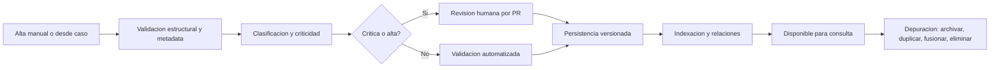

# Documento de Reglas de Negocio
- **Fase**: 2-Analisis Funcional
- **Entregable**: Documento de Reglas de Negocio
- **Responsable**: business-analyst
- **Fecha**: 2026-05-01
- **Estado**: Completado
---

## 1. Objetivo

Definir las reglas de negocio del MVP de **PMOA / Abax-Memory** para gobernar el ciclo de vida de las memorias operativas: creacion, actualizacion, versionado, criticidad, aprobacion, visibilidad, clasificacion, relaciones, busqueda, persistencia, cierre y depuracion.

## 2. Alcance funcional considerado

### Incluye
- Memorias creadas manualmente y desde casos.
- Uso de Markdown con frontmatter como formato de memoria.
- Versionado y trazabilidad de cambios en Git/GitHub.
- Validacion humana por PR para memorias criticas.
- Busqueda semantica con filtros estructurados.
- Clasificacion por tipo, dominio, criticidad y estado.
- Relaciones en grafo entre memorias y entidades.
- Depuracion mediante archivar, marcar duplicadas, fusionar y eliminar segun prioridad MVP.

### No incluye
- UI dedicada para usuarios finales en el MVP.
- Visibilidad fina por memoria dentro del mismo repositorio.
- Aprobacion automatica de memorias criticas sin intervencion humana.
- Soporte multi-repositorio en el MVP.
- Cambios de alcance no aprobados formalmente.

## 3. Definiciones operativas

| Termino | Definicion funcional |
|---|---|
| Memoria | Unidad de conocimiento operativo reutilizable almacenada en formato Markdown con frontmatter. |
| Memoria critica | Memoria cuyo uso indebido puede generar impacto alto o severo en operacion, cumplimiento, cliente o reputacion. |
| Memoria canonica | Memoria principal que permanece vigente cuando otra es marcada como duplicada. |
| Archivada | Memoria excluida de consultas activas por defecto, pero recuperable con filtros explicitos. |
| Eliminada | Memoria retirada del uso activo bajo control y con evidencia auditable. |
| Cerrada | Memoria que completo validacion, persistencia e indexacion y ya puede ser consumida segun su estado. |

## 4. Flujo de negocio objetivo

## 5. Reglas de negocio

| ID | Categoria | Prioridad | Condicion | Accion / Resultado | Excepciones |
|---|---|---|---|---|---|
| BR-001 | Creacion | MVP Obligatoria | Se crea una memoria manual o desde un caso. | El sistema debe registrar la memoria solo si recibe metadata minima obligatoria y contenido valido. | Ninguna. |
| BR-002 | Creacion | MVP Obligatoria | La memoria se crea desde un caso existente. | La memoria debe conservar referencia trazable al identificador del caso origen. | Si el caso no existe o es invalido, la creacion debe rechazarse. |
| BR-003 | Creacion | MVP Obligatoria | La memoria se registra en el repositorio. | Debe almacenarse en formato Markdown con frontmatter legible y cuerpo de contenido. | Si el frontmatter es invalido o falta, no debe persistirse. |
| BR-004 | Actualizacion | MVP Obligatoria | Se modifica contenido o metadata de una memoria existente. | Toda actualizacion debe generar una nueva evidencia versionada y mantener historial auditable del cambio. | No aplica si la memoria no existe. |
| BR-005 | Actualizacion | MVP Obligatoria | Se intenta actualizar una memoria archivada, duplicada o eliminada. | La operacion debe respetar el estado vigente y no reactivar implicitamente la memoria. | Solo una accion explicita aprobada puede cambiar el estado. |
| BR-006 | Versionado | MVP Obligatoria | Una memoria es creada, actualizada, archivada, fusionada, marcada duplicada o eliminada. | El sistema debe dejar evidencia auditable del cambio en Git/GitHub. | Ninguna. |
| BR-007 | Criticidad | MVP Obligatoria | Una memoria contiene instrucciones con impacto en datos productivos, cumplimiento, cliente o decisiones sensibles. | Debe clasificarse al menos como alta o critica segun el impacto definido por negocio. | Si el contenido es solo informativo y sin accion operativa sensible, puede clasificarse baja o media. |
| BR-008 | Criticidad | MVP Obligatoria | Una memoria fue generada desde fuentes incompletas o con baja evidencia. | Debe elevarse su criticidad base o forzar revision adicional antes de quedar disponible. | Salvo validacion humana previa ya registrada. |
| BR-009 | Aprobacion | MVP Obligatoria | Una memoria esta clasificada como alta o critica. | No debe quedar publicada como aprobada sin revision humana por PR. | Ninguna. |
| BR-010 | Aprobacion | MVP Obligatoria | Una memoria no es alta ni critica. | Puede seguir flujo de validacion automatizada y quedar disponible sin PR manual por criticidad. | Si una politica operativa posterior exige revision humana, sera cambio de alcance. |
| BR-011 | Visibilidad | MVP Obligatoria | La memoria pertenece al repositorio del MVP. | La visibilidad funcional se gobierna a nivel repositorio; no existe visibilidad fina por memoria en esta fase. | Ninguna dentro del MVP. |
| BR-012 | Visibilidad | MVP Obligatoria | Una memoria esta pendiente de aprobacion humana. | Puede existir en el repositorio, pero no debe tratarse como memoria aprobada para consumo operativo general. | Puede ser visible para revisores segun acceso al repositorio. |
| BR-013 | Clasificacion | MVP Obligatoria | Se crea o actualiza una memoria. | Debe clasificarse al menos por tipo, dominio, criticidad y estado operativo. | Si el dominio es obligatorio por politica y no se informa, no debe publicarse. |
| BR-014 | Clasificacion | Diferida | El negocio requiere alta de nuevos dominios dinamicos. | El sistema debe permitir incorporar nuevos dominios sin redisenar el modelo funcional. | Regla diferida si no se prioriza en la liberacion inicial. |
| BR-015 | Relaciones en grafo | MVP Obligatoria | Se vinculan memorias o entidades relacionadas. | La relacion debe guardarse de forma consultable y trazable para navegacion posterior. | Si alguno de los nodos no existe, la relacion debe rechazarse. |
| BR-016 | Relaciones en grafo | Diferida | Se solicita vista navegable de red de relaciones. | El sistema debe devolver nodos y vinculos asociados a la memoria consultada. | Diferida si solo se requiere registrar relaciones en el MVP inicial. |
| BR-017 | Busqueda | MVP Obligatoria | Un usuario autorizado ejecuta una busqueda semantica. | El sistema debe devolver memorias ordenadas por relevancia semantica. | Si no hay coincidencias relevantes, debe responder vacio sin error tecnico. |
| BR-018 | Busqueda | MVP Obligatoria | La consulta incluye filtros estructurados validos. | El sistema debe devolver solo memorias que cumplan simultaneamente los filtros aplicados. | Si el filtro es invalido, la solicitud debe rechazarse o informarse como invalida. |
| BR-019 | Busqueda | MVP Obligatoria | La consulta es estandar y no solicita estados no activos. | Las memorias archivadas, duplicadas o eliminadas no deben aparecer por defecto. | Solo deben aparecer si se solicitan explicitamente. |
| BR-020 | Busqueda | Diferida | Se requiere combinar semantica con terminos textuales estrictos. | El sistema debe aplicar ambos criterios en la misma consulta. | Diferida si el MVP libera solo busqueda semantica con filtros. |
| BR-021 | Persistencia | MVP Obligatoria | Una memoria supera validaciones funcionales y de criticidad. | Debe persistirse como fuente operativa unica en el repositorio Git definido para el MVP. | Ninguna. |
| BR-022 | Persistencia | MVP Obligatoria | Una memoria fue creada o actualizada pero aun no termino su procesamiento. | Debe mantenerse en estado transitorio hasta completar indexacion y disponibilidad de consulta. | Si falla el procesamiento, debe quedar evidencia de la causa. |
| BR-023 | Cierre | MVP Obligatoria | Una memoria completo validacion, persistencia e indexacion requeridas. | Debe pasar a estado cerrada/disponible para consulta segun su criticidad y estado operativo. | Si falta una validacion obligatoria, no debe cerrarse. |
| BR-024 | Depuracion | MVP Obligatoria | Una memoria ya no debe usarse operativamente pero debe conservar historial. | Debe archivarse y excluirse de consultas activas por defecto. | Sigue siendo recuperable con filtros explicitos. |
| BR-025 | Depuracion | MVP Obligatoria | Una memoria se identifica como duplicada de otra. | Debe asociarse a una memoria canonica y excluirse de consultas activas por defecto. | La memoria canonica debe existir. |
| BR-026 | Depuracion | Diferida | Dos o mas memorias son elegibles para consolidacion. | Debe permitirse fusionarlas sin perder trazabilidad hacia las memorias origen. | Diferida si la liberacion inicial prioriza solo marcado de duplicados. |
| BR-027 | Depuracion | Diferida | Se requiere eliminar una memoria por contenido invalido o no permitido. | La eliminacion debe ejecutarse solo con permisos autorizados y con evidencia auditable. | Regla diferida si el MVP inicial libera solo archivado y duplicados. |
| BR-028 | Trazabilidad | MVP Obligatoria | Se consulta una memoria. | Debe ser posible identificar su origen, estado, criticidad y principales cambios registrados. | Ninguna. |

## 6. Reglas obligatorias del MVP

Las siguientes reglas se consideran obligatorias para aceptar el MVP funcional:

- **Creacion y estructura**: BR-001, BR-002, BR-003.
- **Actualizacion y versionado**: BR-004, BR-005, BR-006.
- **Criticidad y aprobacion**: BR-007, BR-008, BR-009, BR-010.
- **Visibilidad y clasificacion**: BR-011, BR-012, BR-013.
- **Relaciones y busqueda base**: BR-015, BR-017, BR-018, BR-019.
- **Persistencia, cierre y trazabilidad**: BR-021, BR-022, BR-023, BR-028.
- **Depuracion minima**: BR-024, BR-025.

## 7. Reglas diferidas o sujetas a priorizacion posterior

Las siguientes reglas no bloquean la salida inicial del MVP salvo aprobacion formal de cambio de alcance:

| ID | Regla diferida | Motivo funcional |
|---|---|---|
| BR-014 | Alta dinamica de nuevos dominios administrables | Puede implementarse despues si el set inicial de dominios alcanza para salida controlada. |
| BR-016 | Consulta navegable de grafo | El MVP puede registrar relaciones sin exponer aun una vista navegable completa. |
| BR-020 | Busqueda combinada semantica + texto estricto | La busqueda semantica con filtros cubre la necesidad minima inicial. |
| BR-026 | Fusion de memorias | La consolidacion puede diferirse mientras exista marcado de duplicados y trazabilidad. |
| BR-027 | Eliminacion controlada | El archivado puede cubrir la depuracion inicial con menor riesgo operativo. |

## 8. Contratos API funcionales impactados

> Nota: esta seccion documenta impacto funcional esperado sobre la API REST del MVP; no constituye diseno tecnico detallado.

| Operacion | Metodo | Path | Payload JSON funcional minimo |
|---|---|---|---|
| Crear memoria manual | POST | `/api/memorias` | `{ "titulo": "...", "dominios": ["..."], "criticidad": "media", "contenidoMarkdown": "# ...", "metadata": { "fuente": "manual" } }` |
| Crear desde caso | POST | `/api/memorias/desde-caso` | `{ "caseId": "CASO-123", "dominios": ["..."], "criticidad": "alta" }` |
| Consultar memoria | GET | `/api/memorias/{id}` | Sin body |
| Actualizar memoria | PATCH | `/api/memorias/{id}` | `{ "titulo": "...", "contenidoMarkdown": "# ...", "metadata": { "...": "..." } }` |
| Cambiar estado | PATCH | `/api/memorias/{id}/estado` | `{ "estado": "archivada|duplicada|eliminada", "memoriaCanonicaId": "MEM-001" }` |
| Buscar memorias | POST | `/api/memorias/busqueda` | `{ "query": "...", "topK": 10, "filtros": { "dominios": ["..."], "estado": ["activa"] } }` |
| Registrar relaciones | POST | `/api/memorias/{id}/relaciones` | `{ "relaciones": [{ "tipo": "relacionada", "destinoId": "MEM-002" }] }` |
| Fusionar memorias | POST | `/api/memorias/{id}/fusion` | `{ "memoriasOrigen": ["MEM-002", "MEM-003"] }` |

## 9. Criterios de verificacion funcional

### AC-01 Creacion valida
**Given** un usuario autorizado con metadata obligatoria completa  
**When** crea una memoria manual o desde un caso valido  
**Then** la memoria debe persistirse con formato Markdown, frontmatter y trazabilidad de origen.

### AC-02 Control por criticidad
**Given** una memoria clasificada como alta o critica  
**When** intenta publicarse para uso operativo  
**Then** debe requerir aprobacion humana por PR antes de quedar aprobada.

### AC-03 Exclusiones por defecto
**Given** memorias archivadas, duplicadas o eliminadas  
**When** se ejecuta una consulta estandar  
**Then** esas memorias no deben aparecer salvo solicitud explicita.

### AC-04 Cierre de memoria
**Given** una memoria ya validada y persistida  
**When** completa su indexacion requerida  
**Then** debe quedar disponible para consulta segun su estado y criticidad.

### AC-05 Trazabilidad
**Given** una memoria existente  
**When** un auditor consulta su detalle  
**Then** debe poder identificar origen, versionado, estado y evidencia principal de cambios.

## 10. Observaciones de gobierno

- Toda regla diferida requiere priorizacion explicita del Product Owner antes de entrar al alcance de implementacion.
- Toda excepcion adicional no documentada debe tratarse como cambio de alcance hasta ser validada formalmente.
- Las reglas aqui definidas deben servir como base para criterios de aceptacion, casos de prueba funcionales y trazabilidad posterior.
