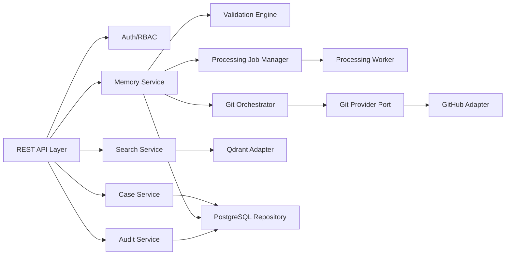
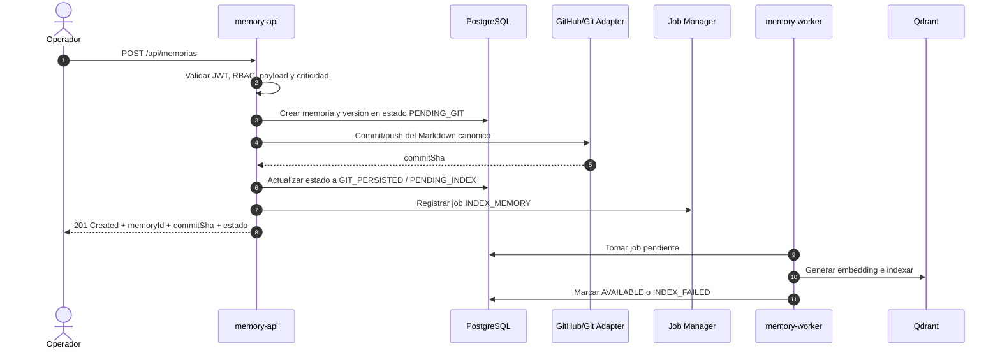
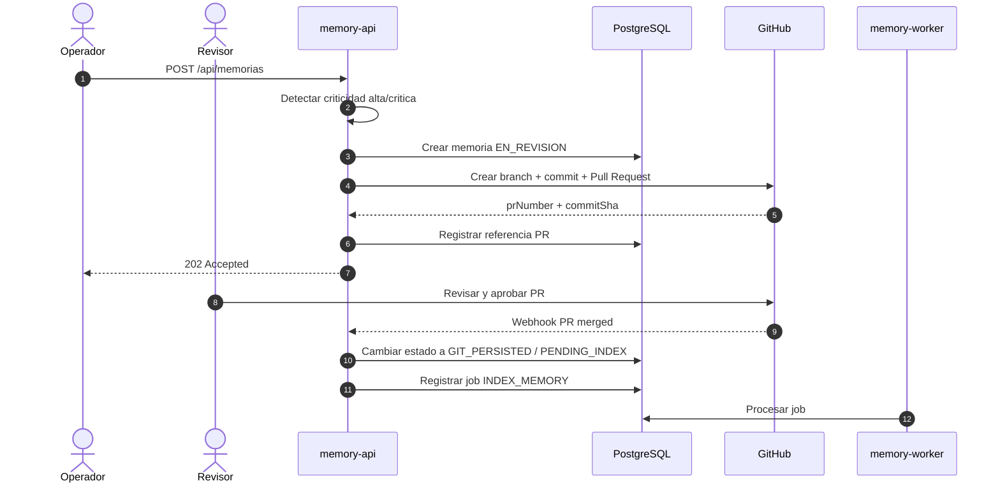
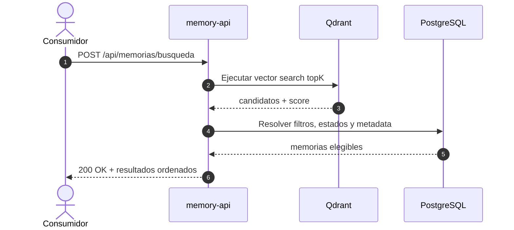
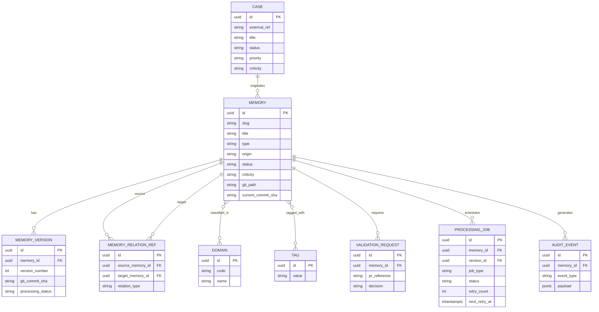
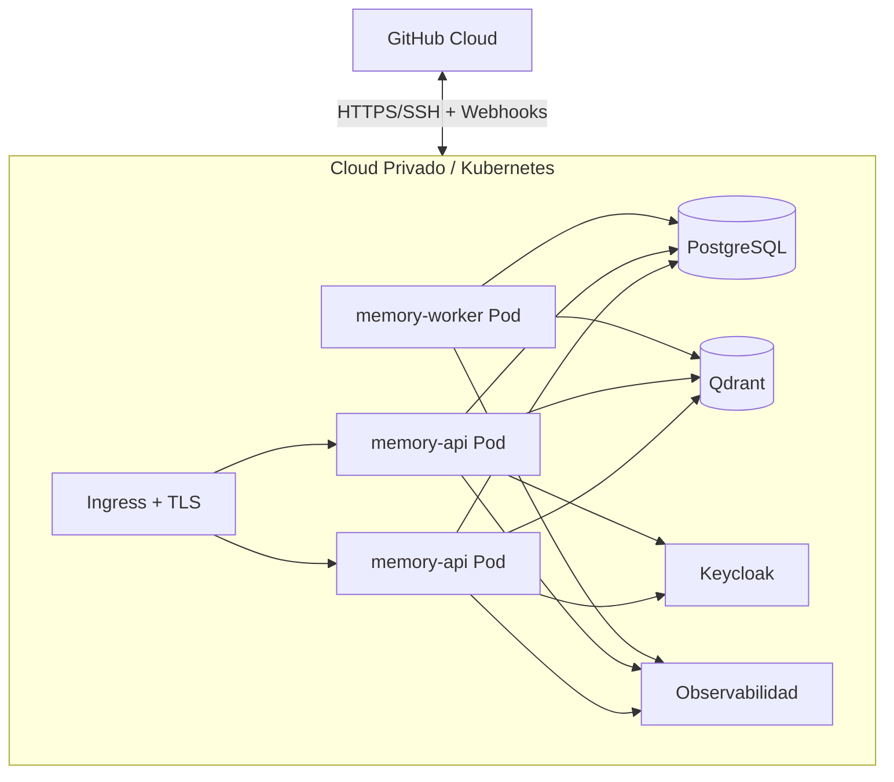

# Documento de Arquitectura
- **Fase**: 3-Diseno Tecnico
- **Entregable**: Documento de Arquitectura
- **Responsable**: solution-architect
- **Fecha**: 2026-05-01
- **Estado**: Completado
---

## 1. Objetivo

Establecer la **baseline tecnica oficial unica** para construccion del MVP de **PMOA / Abax-Memory**, corrigiendo las inconsistencias detectadas entre entregables de Fase 3 y dejando decisiones definitivas, implementables y trazables al alcance funcional aprobado.

## 2. Insumos y trazabilidad de origen

### 2.1 Requerimientos funcionales aprobados

- `docs/entregables/fase-2-analisis/especificacion-funcional.md`
- `docs/entregables/fase-2-analisis/criterios-aceptacion.md`
- `docs/entregables/fase-2-analisis/reglas-de-negocio.md`
- `docs/entregables/fase-2-analisis/diagramas-proceso.md`

### 2.2 Cobertura funcional prioritaria para construccion MVP

| Bloque funcional | Estado para MVP | Observacion de arquitectura |
|---|---|---|
| Casos, memorias, validacion, aprobacion, auditoria | Incluido | Implementacion directa en Quarkus + PostgreSQL + Git/GitHub |
| Busqueda semantica | Incluido | Qdrant es parte del MVP porque RF-017 a RF-020 son R1-MVP |
| Relaciones avanzadas y navegacion de grafo | Posterior | Neo4j queda fuera del MVP; se conserva referencia minima en PostgreSQL |
| Cache de aceleracion | Posterior | Redis queda fuera del MVP |
| Procesamiento asincrono confiable | Incluido | Se resuelve con tabla de jobs en PostgreSQL + worker Quarkus |
| Broker de eventos empresarial | Posterior | Kafka no entra en MVP |

## 3. Correccion de inconsistencias detectadas

Este documento reemplaza como referencia oficial cualquier interpretacion contradictoria previa de Fase 3 respecto de:

1. **Procesamiento asincrono MVP**: aprobado con **tabla de jobs + worker Quarkus**, no con Kafka.
2. **Kafka**: **no forma parte del MVP**; queda como evolucion posible posterior si la volumetria o el desacoplamiento operativo lo justifican.
3. **Neo4j**: **no forma parte del MVP**; las relaciones minimas requeridas para trazabilidad se resuelven en PostgreSQL/Git.
4. **Redis**: **no forma parte del MVP**; cache, locks distribuidos y optimizaciones quedan para release posterior.
5. **ADRs**: las decisiones definitivas de este documento son las unicas vigentes como baseline de construccion.

## 4. Baseline oficial para construccion

### 4.1 Definicion oficial y cerrada

- **Asincronia MVP oficial**: tabla `processing_jobs` en PostgreSQL + `memory-worker` Quarkus.
- **Kafka en MVP**: no incluido.
- **Neo4j en MVP**: no incluido.
- **Redis en MVP**: no incluido.
- **Qdrant en MVP**: incluido.
- **Persistencia operativa obligatoria MVP**: Git/GitHub + PostgreSQL.

> **Nota de prevalencia**: esta seccion constituye la **verdad oficial de construccion para Fase 3** y **prevalece sobre cualquier presentacion, descomposicion tecnica, borrador o entregable previo** que mencione Redis, Neo4j, Kafka o locks Redis dentro del MVP.

### 4.2 Decisiones definitivas MVP vs posteriores

| Decision | MVP | Posterior | Justificacion definitiva |
|---|---|---|---|
| Mecanismo asincrono | **Si** | - | Se requiere indexacion desacoplada sin agregar complejidad operativa innecesaria |
| Implementacion asincrona | **Tabla `processing_jobs` en PostgreSQL + worker Quarkus** | Kafka opcional futuro | Suficiente para el volumen inicial y alineado con mantenibilidad MVP |
| Kafka | **No** | R2/R3 segun necesidad | No es requisito funcional aprobado ni condicion para salida MVP |
| Qdrant | **Si** | - | Busqueda semantica si es requerida por RF-017 a RF-020 en R1-MVP |
| Neo4j | **No** | R2 | El valor funcional de relaciones avanzadas fue trazado como R2; no bloquea construccion MVP |
| Redis | **No** | R2 | La cache mejora performance, pero no es prerequisito funcional de salida |
| Relaciones minimas caso-memoria / memoria-memoria | **Si** | - | Se persisten en PostgreSQL y frontmatter para trazabilidad basica |
| Navegacion contextual avanzada de grafo | **No** | R2 | Requiere Neo4j y sincronizacion adicional |

### 4.3 Baseline oficial de stack MVP

- **Backend**: Quarkus Java 21, RESTEasy Reactive, CDI, DTO + mappers.
- **Seguridad**: Quarkus OIDC con Keycloak, JWT, RBAC.
- **Persistencia transaccional**: PostgreSQL.
- **Persistencia documental operativa**: Git/GitHub.
- **Busqueda semantica**: Qdrant.
- **Asincronia MVP**: scheduler/worker Quarkus sobre tabla de jobs en PostgreSQL.
- **Fuera del MVP**: Kafka, Neo4j, Redis.

### 4.4 Trazabilidad de baseline a construccion

| Baseline | Impacto directo en construccion |
|---|---|
| Sin Kafka en MVP | No se construyen topics, brokers ni consumers/producers SmallRye en R1 |
| Sin Neo4j en MVP | No se implementa persistencia ni consultas Bolt en R1 |
| Sin Redis en MVP | No se implementa cache-aside ni locks distribuidos en R1 |
| Jobs en PostgreSQL | Se implementan `processing_jobs`, retries, scheduler y worker idempotente |
| Relaciones basicas en PostgreSQL | Se construye `memory_relations_ref` y endpoints minimos alineados a alcance MVP efectivo |

## 5. Alcance tecnico oficial

### 5.1 Incluido en MVP

- API REST para casos, memorias, busqueda, aprobacion, archivado y auditoria.
- Persistencia de memorias en Markdown + frontmatter sobre Git/GitHub.
- Metadata, estados, trazabilidad, referencias Git/PR y jobs en PostgreSQL.
- Busqueda semantica con Qdrant y filtros estructurados apoyados en PostgreSQL.
- Flujo de aprobacion humana por PR para memorias de criticidad alta/critica.
- Procesamiento asincrono para indexacion semantica y reconciliacion operacional.
- Seguridad OIDC/JWT con RBAC.
- Observabilidad, health checks y despliegue en Kubernetes.

### 5.2 Excluido del MVP y reservado a posteriores

- Kafka como broker de eventos.
- Neo4j como grafo especializado.
- Redis como cache o coordinador distribuido.
- Navegacion contextual avanzada de relaciones.
- Duplicadas/fusion automatizadas avanzadas dependientes de grafo o cache.

## 6. Principios de arquitectura

1. **Git es la fuente canonica del contenido de memoria**.
2. **PostgreSQL es la fuente oficial del estado operativo y la auditoria**.
3. **La asincronia del MVP debe ser simple, observable e idempotente**.
4. **No se incorpora infraestructura no bloqueante al MVP**.
5. **Toda decision de seguridad aplica desde R1**.
6. **Las capacidades R2 se preparan por contrato, no por despliegue prematuro**.

## 7. Vista de contexto

```mermaid
C4Context
    title Contexto - PMOA / Abax-Memory MVP
    Person(operador, "Operador de Memoria", "Crea y actualiza memorias")
    Person(revisor, "Revisor/Validador", "Aprueba memorias criticas por PR")
    Person(admin, "Administrador de Memoria", "Archiva y gobierna memorias")
    Person(auditor, "Auditor/Owner de Dominio", "Consulta trazabilidad")
    System_Ext(consumidor, "Sistema Consumidor API", "Consume endpoints REST")
    System_Ext(keycloak, "Keycloak", "OIDC/JWT")
    System_Ext(github, "GitHub", "Repositorio Git + Pull Requests")
    System_Boundary(pmoa, "PMOA / Abax-Memory") {
        System(api, "Memory Platform", "API-first para casos, memorias, busqueda y auditoria")
    }
    operador --> api
    admin --> api
    auditor --> api
    consumidor --> api
    revisor --> github
    api --> keycloak
    api --> github
```

## 8. Arquitectura logica oficial del MVP

```mermaid
C4Container
    title Contenedores - PMOA / Abax-Memory MVP Baseline Oficial
    Person(user, "Consumidores autorizados", "Usuarios y sistemas")
    System_Ext(idp, "Keycloak", "OIDC")
    System_Ext(gh, "GitHub", "Repo + PR + Webhooks")

    System_Boundary(sys, "PMOA / Abax-Memory") {
        Container(api, "memory-api", "Quarkus REST", "API, validacion, orquestacion y consulta")
        Container(worker, "memory-worker", "Quarkus Worker", "Procesa jobs de indexacion y reconciliacion")
        ContainerDb(pg, "PostgreSQL", "RDBMS", "Metadata, estados, auditoria, relaciones basicas, jobs")
        ContainerDb(qdrant, "Qdrant", "Vector DB", "Embeddings e indice semantico")
        Container(repo, "Workspace Git", "Volumen controlado", "Clone de trabajo para operaciones Git")
    }

    user --> api
    api --> idp
    api --> pg
    api --> gh
    api --> qdrant
    api --> repo
    worker --> pg
    worker --> qdrant
    worker --> gh
    worker --> repo
```

> Nota de baseline: **Kafka, Neo4j y Redis no aparecen en la topologia MVP porque no forman parte del alcance de construccion aprobado**.

## 9. Arquitectura de componentes



### 9.1 Complejidad tecnica por componente

| Componente | Responsabilidad | Patron / tecnologia | Complejidad |
|---|---|---|---|
| REST API Layer | Contratos, validacion, errores HTTP | RESTEasy Reactive | Media |
| Auth/RBAC | OIDC, JWT, roles | Quarkus OIDC + MP JWT | Media |
| Case Service | Alta, consulta y cierre de casos | Servicio de aplicacion | Baja |
| Memory Service | Alta, actualizacion, archivado, estados | Servicio de dominio | Alta |
| Validation Engine | Frontmatter, criticidad, consistencia | Reglas de negocio | Alta |
| Git Orchestrator | Branch, commit, push, PR y referencias | Adapter + saga local | Alta |
| Search Service | Busqueda semantica + filtros | Qdrant + PostgreSQL | Alta |
| Audit Service | Trazabilidad funcional y tecnica | PostgreSQL | Media |
| Processing Job Manager | Alta de jobs, retries, control de estados | Tabla en PostgreSQL | Media |
| Processing Worker | Indexacion Qdrant y reconciliacion | Scheduler/worker Quarkus | Media |
| GitHub Adapter | Integracion PR/webhooks | REST adapter | Media |

## 10. Fuentes de verdad y consistencia

### 10.1 Fuentes oficiales por dato

| Dato | Fuente de verdad | Observacion |
|---|---|---|
| Contenido Markdown + frontmatter | Git/GitHub | Artefacto canonico |
| Estado operativo y auditoria | PostgreSQL | Store transaccional oficial |
| Embeddings y score vectorial | Qdrant | Indice derivado regenerable |
| Relaciones minimas requeridas para trazabilidad | PostgreSQL + frontmatter | Suficiente para MVP |

### 10.2 Estrategia de consistencia

- No se usa transaccion distribuida entre Git, PostgreSQL y Qdrant.
- La operacion funcional queda confirmada cuando **Git y PostgreSQL** completan el minimo requerido del flujo.
- La indexacion en Qdrant es **eventual controlada**.
- Los jobs deben ser **idempotentes** por `memoryId + versionId + jobType`.
- La toma de jobs se resuelve con capacidades de PostgreSQL (`FOR UPDATE SKIP LOCKED` o equivalente), evitando dependencia de Redis en MVP.

### 10.3 Estados tecnicos minimos de procesamiento

- `PENDING_GIT`
- `GIT_PERSISTED`
- `PENDING_INDEX`
- `INDEXING`
- `AVAILABLE`
- `INDEX_FAILED`
- `GIT_FAILED`

## 11. Flujos tecnicos principales

### 11.1 Creacion de memoria no critica



### 11.2 Memoria alta o critica con aprobacion humana



### 11.3 Busqueda semantica MVP



## 12. Modelo de datos de alto nivel



### 12.1 Objetos por tecnologia

| Tecnologia | Objetos principales |
|---|---|
| PostgreSQL | `cases`, `memories`, `memory_versions`, `domains`, `tags`, `memory_tags`, `memory_relation_ref`, `validation_requests`, `processing_jobs`, `audit_events` |
| Git/GitHub | archivos Markdown, branches de revision, commits, PRs |
| Qdrant | coleccion `memories_embeddings` con `memoryId`, `versionId`, `status`, `domains`, `tags` |

## 13. Matriz de integraciones

| Integracion | Origen | Destino | Protocolo / patron | Contrato | Observaciones |
|---|---|---|---|---|---|
| Autenticacion | memory-api | Keycloak | OIDC/OAuth2 | JWT access token | Validacion de issuer, audience y expiracion |
| Persistencia documental | memory-api / worker | GitHub Repo | Git HTTPS/SSH | repo path, branch, commitSha | Fuente canonica del contenido |
| Aprobacion critica | memory-api | GitHub PR API | REST + webhook | PR ref, reviewer, estado | Requiere branch protection |
| Metadata y workflow | memory-api / worker | PostgreSQL | JDBC/reactive SQL | entidades transaccionales | Estado oficial del flujo |
| Busqueda vectorial | memory-api / worker | Qdrant | REST/gRPC segun SDK | vector + payload filters | Solo memorias disponibles |

### 13.1 Contrato interno de job MVP

```json
{
  "jobId": "uuid",
  "jobType": "INDEX_MEMORY|RECONCILE_MEMORY",
  "memoryId": "uuid",
  "versionId": "uuid",
  "attempt": 1,
  "requestedAt": "2026-05-01T12:00:00Z"
}
```

## 14. Seguridad

### 14.1 Controles obligatorios MVP

- OIDC con Keycloak.
- JWT firmado y validado.
- RBAC por roles: `memory-operator`, `memory-reviewer`, `memory-admin`, `memory-auditor`, `api-consumer`.
- `Idempotency-Key` en POST criticos.
- Validacion estricta de payload JSON y frontmatter YAML.
- PR obligatoria para memorias de criticidad alta/critica.
- Prohibicion explicita de publicar memorias criticas sin evidencia de aprobacion.
- Secretos fuera del repositorio.
- TLS 1.2+ extremo a extremo.

### 14.2 Controles de auditoria

- Registrar `actor`, `action`, `entity`, `memoryId`, `caseId`, `commitSha`, `prRef`, `correlationId`.
- Separar logs funcionales y logs de seguridad.
- Retencion minima recomendada: 12 meses.

## 15. Observabilidad y operacion

### 15.1 Logging y trazas

- Logs estructurados JSON.
- `traceId` y `correlationId` obligatorios.
- Trazas distribuidas desde request REST hasta Git, PostgreSQL y Qdrant.

### 15.2 Metricas minimas

- latencia p95/p99 por endpoint.
- errores por categoria.
- tiempo de PR hasta aprobacion.
- jobs pendientes, fallidos y reintentados.
- indexaciones Qdrant exitosas/fallidas.

### 15.3 Alertas minimas

- `git_failure_rate > umbral`
- `pending_jobs > umbral`
- `critical_pr_without_resolution > SLA`
- `qdrant_unavailable`
- `postgres_unavailable`

## 16. Despliegue MVP



### 16.1 Capacidad inicial sugerida

| Componente | Capacidad inicial |
|---|---|
| memory-api | 2 replicas, 1 vCPU, 2 GB RAM |
| memory-worker | 1-2 replicas, 1 vCPU, 2 GB RAM |
| PostgreSQL | 2-4 vCPU, 8 GB RAM, SSD |
| Qdrant | 2 vCPU, 4-8 GB RAM |

## 17. Lineamientos de construccion

### 17.1 Paquetes tecnicos obligatorios R1

1. API y contratos OpenAPI.
2. Modelo PostgreSQL MVP.
3. Parser/render de Markdown + frontmatter.
4. Integracion Git/GitHub.
5. Maquina de estados y aprobacion critica.
6. Tabla `processing_jobs` + worker Quarkus.
7. Integracion de embeddings + Qdrant.
8. Busqueda semantica con filtros.
9. Auditoria y observabilidad.
10. Seguridad OIDC/RBAC.

### 17.2 Gates minimos antes de produccion

- OpenAPI validada.
- Migraciones DB automatizadas.
- PR/webhooks probados extremo a extremo.
- Worker idempotente y con retries controlados.
- Reconciliacion Git/DB operativa.
- Health checks de aplicacion, PostgreSQL y Qdrant.
- Pruebas 401/403, errores de validacion y fallas de dependencias.

## 18. ADRs oficiales de baseline

## ADR-001: Git como fuente operativa canonica del artefacto de memoria

**Estado**: Aceptado  
**Fecha**: 2026-05-01

**Contexto**: El alcance funcional aprobado exige memorias en Markdown con frontmatter, versionadas en Git/GitHub y revisables por PR.

**Decision**: El contenido persistido de la memoria es canonico en Git/GitHub. PostgreSQL conserva metadata operacional y estado transaccional.

**Alternativas consideradas**:
- Guardar el Markdown canonico en PostgreSQL y exportarlo a Git.
- Guardar todo solo en Git sin store transaccional.

**Consecuencias**:
- Positivas: portabilidad, auditoria natural, versionado y PR manual.
- Negativas: necesidad de consistencia entre Git y PostgreSQL.
- Riesgos: divergencia temporal mitigada con estados y reconciliacion.

**Participantes**: solution-architect, tech-lead, integration-architect.

## ADR-002: PostgreSQL como store transaccional oficial del MVP

**Estado**: Aceptado  
**Fecha**: 2026-05-01

**Contexto**: El MVP necesita estados, filtros, auditoria, trazabilidad, referencias de relaciones basicas y coordinacion de jobs.

**Decision**: PostgreSQL sera el store oficial para metadata, workflow state, auditoria, referencias relacionales minimas y tabla de jobs.

**Alternativas consideradas**:
- Resolver todo desde Git en runtime.
- Introducir un segundo store especializado adicional en MVP.

**Consecuencias**:
- Positivas: simplicidad operativa y consistencia transaccional.
- Negativas: duplicidad controlada frente al contenido de Git.
- Riesgos: disciplina de sincronizacion entre stores.

**Participantes**: solution-architect, dba, tech-lead.

## ADR-003: Procesamiento asincrono MVP con tabla de jobs y worker Quarkus

**Estado**: Aceptado  
**Fecha**: 2026-05-01

**Contexto**: El MVP requiere desacoplar indexacion y reconciliacion, pero no justifica introducir infraestructura de mensajeria adicional.

**Decision**: El procesamiento asincrono del MVP se implementa con tabla `processing_jobs` en PostgreSQL y `memory-worker` Quarkus. La toma de jobs se resuelve con mecanismos nativos de PostgreSQL. Kafka no forma parte del MVP.

**Alternativas consideradas**:
- Kafka + Reactive Messaging desde R1.
- Procesamiento completamente sincrono dentro del request.

**Consecuencias**:
- Positivas: menor complejidad operativa, observabilidad directa y salida mas rapida.
- Negativas: menor desacoplamiento que un broker dedicado.
- Riesgos: crecimiento de carga futura; mitigable migrando a broker en R2/R3.

**Participantes**: solution-architect, devops, tech-lead.

## ADR-004: Qdrant si forma parte del MVP

**Estado**: Aceptado  
**Fecha**: 2026-05-01

**Contexto**: La busqueda semantica con filtros es parte del alcance funcional R1-MVP.

**Decision**: Qdrant se incorpora desde el MVP como indice vectorial derivado para soportar RF-017 a RF-020.

**Alternativas consideradas**:
- Postergar la busqueda semantica a una release posterior.
- Resolver busqueda solo por SQL/texto estructurado.

**Consecuencias**:
- Positivas: cumple alcance funcional aprobado.
- Negativas: agrega una dependencia de datos especializada.
- Riesgos: latencia o reindexaciones; mitigado con jobs idempotentes y rebuild controlado.

**Participantes**: solution-architect, tech-lead.

## ADR-005: Neo4j queda excluido del MVP

**Estado**: Aceptado  
**Fecha**: 2026-05-01

**Contexto**: Las relaciones avanzadas y dominios dinamicos aparecen trazados como evolucion R2 en los entregables funcionales y de construccion.

**Decision**: Neo4j no se implementa ni despliega en el MVP. Las relaciones minimas necesarias para trazabilidad se registran en PostgreSQL y frontmatter. Neo4j queda reservado para navegacion contextual avanzada en R2.

**Alternativas consideradas**:
- Incluir Neo4j desde R1.
- No modelar ninguna relacion en MVP.

**Consecuencias**:
- Positivas: reduce complejidad multi-store del MVP.
- Negativas: la navegacion avanzada de grafo no estara disponible en R1.
- Riesgos: necesidad de migracion posterior a proyeccion de grafo, mitigable con contratos internos desacoplados.

**Participantes**: solution-architect, dba, tech-lead.

## ADR-006: Redis queda excluido del MVP

**Estado**: Aceptado  
**Fecha**: 2026-05-01

**Contexto**: El MVP debe priorizar funcionalidad obligatoria y evitar dependencias no bloqueantes.

**Decision**: Redis no se implementa ni despliega en R1. El MVP opera sin cache distribuida y sin locks Redis, usando consultas directas y control de concurrencia soportado por PostgreSQL.

**Alternativas consideradas**:
- Incluir Redis desde el inicio para cache y coordinacion.
- Implementar cache embebida por nodo.

**Consecuencias**:
- Positivas: menor complejidad operativa y menor superficie de falla.
- Negativas: algunas consultas pueden tener mayor latencia que en R2.
- Riesgos: degradacion bajo lecturas repetitivas, mitigable con tuning SQL/topK y adicion posterior de Redis.

**Participantes**: solution-architect, tech-lead, devops.

## ADR-007: GitHub es el proveedor inicial, desacoplado por puertos

**Estado**: Aceptado  
**Fecha**: 2026-05-01

**Contexto**: El negocio aprueba GitHub como proveedor inicial, pero no desea lock-in permanente.

**Decision**: Separar operaciones Git y operaciones de Pull Request mediante puertos/adapters, usando GitHub solo como implementacion inicial.

**Alternativas consideradas**:
- Acoplamiento directo a APIs GitHub.
- Soporte multi-provider completo desde MVP.

**Consecuencias**:
- Positivas: menor lock-in y evolucion controlada.
- Negativas: una capa extra de abstraccion.
- Riesgos: diferencias entre providers en PR/webhooks.

**Participantes**: solution-architect, integration-architect, tech-lead.

## 19. Riesgos tecnicos vigentes

| Riesgo | Impacto | Probabilidad | Mitigacion |
|---|---|---|---|
| Divergencia Git vs PostgreSQL | Alto | Media | estados transitorios, reconciliacion, auditoria |
| Falla de webhook GitHub | Alto | Media | polling de respaldo y reproceso idempotente |
| Falla o latencia de Qdrant | Media | Media | reintentos, rebuild de indice y degradacion controlada |
| Latencia de busqueda semantica | Media | Media | topK acotado, filtros eficientes e indices SQL |
| Crecimiento de backlog de jobs | Media | Media | monitoreo, escalado del worker y ajuste de retries |
| Complejidad futura de R2 | Media | Media | contratos desacoplados para Kafka/Neo4j/Redis |

## 20. Anexo de reconciliacion final de baseline

### 20.1 Reconciliacion explicita de decisiones

| Tema | Baseline oficial definitiva | Decision de reconciliacion |
|---|---|---|
| Mecanismo asincrono MVP exacto | `processing_jobs` en PostgreSQL + worker Quarkus | Se descartan broker Kafka y locks Redis para MVP |
| Uso de Redis en MVP | No | No se implementa cache distribuida, ni coordinacion, ni locks Redis |
| Uso de Neo4j en MVP | No | Las relaciones minimas se resuelven en PostgreSQL + frontmatter |
| Uso de Kafka en MVP | No | Queda reservado a una evolucion posterior si la carga lo justifica |

### 20.2 Ambiguedades resueltas

- Cualquier referencia previa a **Redis dentro del MVP** queda **sin efecto**.
- Cualquier referencia previa a **Neo4j dentro del MVP** queda **sin efecto**.
- Cualquier referencia previa a **Kafka dentro del MVP** queda **sin efecto**.
- Cualquier referencia previa a **locks Redis para toma de jobs** queda **sin efecto**.
- La implementacion oficial de asincronia para construccion R1 es exclusivamente **PostgreSQL + worker Quarkus**.

## 21. Resumen ejecutivo de baseline

La baseline oficial aprobable para construccion del MVP queda definida asi:

- **Asincronia MVP**: `PostgreSQL processing_jobs + memory-worker Quarkus`.
- **Kafka**: **fuera del MVP**.
- **Neo4j**: **fuera del MVP**.
- **Redis**: **fuera del MVP**.
- **Qdrant**: **dentro del MVP**.
- **Git/GitHub + PostgreSQL**: nucleo operativo obligatorio.

Con esta correccion, el documento de arquitectura queda unificado, implementable, sin contradicciones internas y trazable al alcance funcional aprobado para iniciar construccion.
