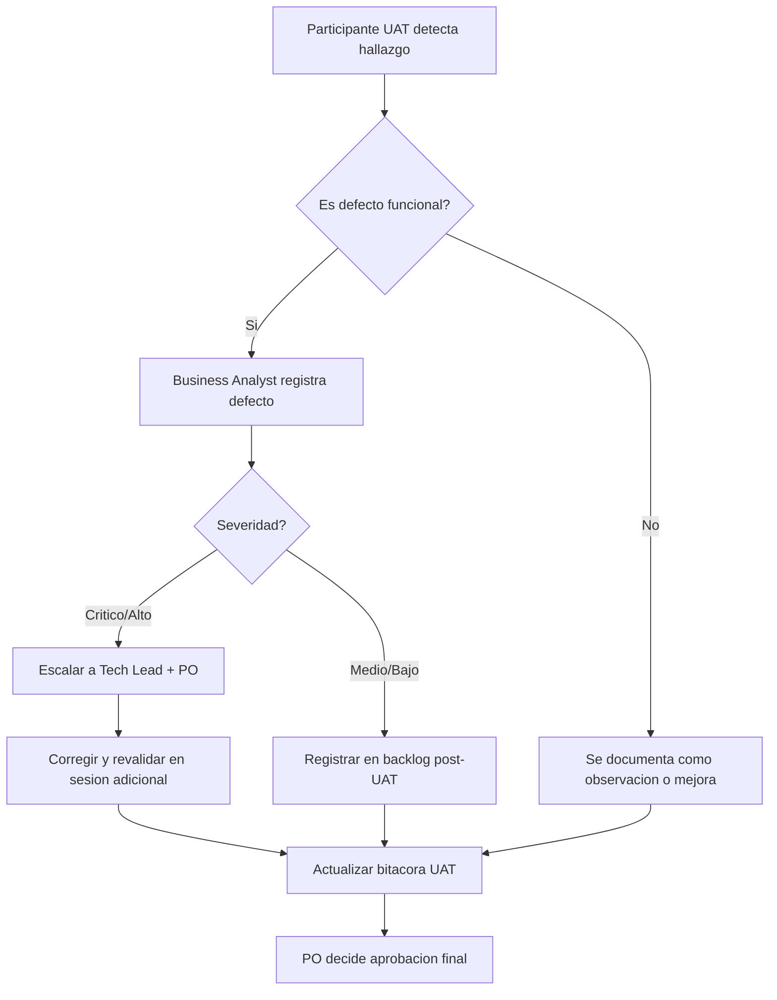

# Plan de UAT
- **Fase**: 6-UAT
- **Entregable**: Plan de UAT
- **Responsable**: business-analyst
- **Fecha**: 2026-05-02
- **Estado**: Completado

---

## 1. Objetivo

Validar que el producto **PMOA / Abax-Memory (MVP)** cumple con los criterios de aceptacion del negocio, verificando que las capacidades funcionales definidas en el backlog aprobado de **R1-MVP** operan correctamente desde la perspectiva de los actores operativos reales, y que el producto esta listo para ser entregado a produccion inicial.

Este plan establece:
- Que se va a validar (alcance funcional de negocio).
- Como se va a validar (estrategia y sesiones API-first).
- Quien participa (roles y responsabilidades).
- Condiciones de entrada y salida (gates de UAT).
- Criterios de aprobacion final.

---

## 2. Alcance

### 2.1 Incluye

| Item | Descripcion |
|---|---|
| **Flujo completo de creacion de memoria** | Alta manual y alta desde caso, con validacion estructural (frontmatter, Markdown, campos obligatorios). |
| **Flujo de validacion y aprobacion** | Clasificacion de criticidad, revision humana por PR para memorias criticas, aprobacion, observacion y rechazo. |
| **Flujo de busqueda y reutilizacion** | Busqueda semantica por lenguaje natural, filtros estructurados combinados, orden por relevancia. |
| **Flujo de trazabilidad y auditoria** | Historial de cambios, origen de memoria, creador y modificador, aprobaciones y evidencia versionada en Git. |
| **Flujo de ciclo de vida y depuracion** | Archivado de memorias obsoletas, exclusion de consultas activas, consulta de archivadas bajo solicitud explicita. |
| **Gestion de casos** | Creacion de caso operativo, cierre con resultado y vinculo a memoria. |
| **Seguridad y acceso API** | Autenticacion OIDC/JWT, autorizacion RBAC, denegacion 401/403 segun rol. |
| **Contrato API y consistencia de errores** | Respuesta consistente de endpoints del MVP, formato de error funcional y trazable. |
| **Procesamiento asincrono e indexacion** | Estados transitorios de indexacion, disponibilidad post-indexacion, falla controlada. |

### 2.2 Fuera de alcance

| Item | Justificacion |
|---|---|
| UI dedicada para usuarios finales | No incluida en el MVP por decision de producto. |
| Dominios dinamicos y relaciones en Neo4j (grafo) | Release R2. |
| Cache con Redis | Release R2. |
| Fusion de memorias | Release R2. |
| Marcado de duplicadas y eliminacion controlada | Release R2/R3. |
| Endpoints de salud (`/api/health`) | Release R2. |
| Kafka, Neo4j, Redis | Tecnologias fuera del baseline MVP. |
| Rendimiento, carga o estres | Pruebas no funcionales fuera del alcance de esta fase UAT. |

---

## 3. Participantes y roles UAT

| Rol UAT | Responsabilidad | Perfil sugerido |
|---|---|---|
| **Product Owner** | Aprueba o rechaza el resultado UAT; valida que el producto satisface la necesidad de negocio. | Dueño de producto o responsable de operaciones. |
| **Business Analyst** | Facilita las sesiones UAT, documenta hallazgos, mantiene trazabilidad. | Analista funcional del proyecto (este agente). |
| **Operador de Memoria** | Ejecuta escenarios de creacion, clasificacion y consulta de memorias. | Usuario operativo real o representante designado por el negocio. |
| **Revisor / Validador** | Ejecuta escenarios de aprobacion humana para memorias criticas. | Responsable de calidad operativa o senior del dominio. |
| **Administrador de Memoria** | Ejecuta escenarios de archivado y administracion del repositorio. | Responsable de gobierno de conocimiento. |
| **Auditor / Owner de Dominio** | Ejecuta escenarios de trazabilidad y auditoria. | Responsable de cumplimiento o auditoria operativa. |
| **QA Lead** | Soporte tecnico en ejecucion, validacion de consistencia con baseline QA. | QA functional o QA lead del proyecto. |
| **Tech Lead / Arquitecto** | Soporte en entorno UAT, resolucion de bloqueos tecnicos. | Arquitecto o tech lead asignado. |

> **Nota**: un mismo participante puede asumir multiples roles UAT durante las sesiones si el negocio lo autoriza. Se requiere al menos un representante del negocio con capacidad de decision (Product Owner o delegado).

---

## 4. Criterios de entrada

| ID | Criterio | Estado esperado |
|---|---|---|
| CE-01 | Fase 5 - Pruebas QA aprobada | **CUMPLIDO**: 49/49 casos QA aprobados, BUILD SUCCESS (54 tests, 0 fallos). |
| CE-02 | Baseline de codigo estable en entorno UAT | **CUMPLIDO**: build `mvn test` exitoso en `backend-quarkus/`. |
| CE-03 | Backlog R1-MVP aprobado y trazable | **CUMPLIDO**: `backlog-priorizado.md` con historias Must de R1-MVP definidas. |
| CE-04 | Criterios de aceptacion documentados | **CUMPLIDO**: `criterios-aceptacion.md` con 61 CA (R1) + 15 CA (R2). |
| CE-05 | Especificacion funcional aprobada | **CUMPLIDO**: `especificacion-funcional.md` con 46 RF, 15 RN y 13 contratos API. |
| CE-06 | Entorno UAT operativo con dependencias completas | **PENDIENTE**: Quarkus + PostgreSQL + Git/GitHub + Qdrant + OIDC funcionales. |
| CE-07 | Usuarios de prueba con roles configurados | **PENDIENTE**: `memory-operator`, `memory-reviewer`, `memory-admin`, `memory-auditor`, `api-consumer`. |
| CE-08 | Datos de prueba sembrados en entorno UAT | **PENDIENTE**: casos, memorias y datos funcionales para las sesiones. |
| CE-09 | Contratos API documentados y accesibles | **CUMPLIDO**: endpoints funcionales definidos en especificacion funcional. |
| CE-10 | Herramientas de ejecucion API disponibles | **PENDIENTE**: curl, Postman/coleccion o scripts equivalentes. |

### Acciones previas requeridas (checklist pre-UAT)

1. [ ] Desplegar baseline de codigo en entorno UAT.
2. [ ] Sembrar esquema de base de datos y migraciones.
3. [ ] Configurar Qdrant con collection de embeddings.
4. [ ] Configurar repositorio Git/GitHub de prueba para UAT.
5. [ ] Generar tokens JWT para cada rol de prueba.
6. [ ] Preparar datos funcionales: 5-10 casos de prueba, 10-15 memorias de distintos tipos y criticidades.
7. [ ] Verificar conectividad a todos los servicios desde el entorno UAT.
8. [ ] Ejecutar smoke test de endpoints principales (POST /api/memorias, GET /api/memorias/{id}, POST /api/busquedas/semantica).

---

## 5. Criterios de salida

| ID | Criterio | Umbral de aprobacion |
|---|---|---|
| CS-01 | Todos los casos UAT prioritarios ejecutados | **100%** de los 15 casos UAT (ver seccion 8). |
| CS-02 | Casos UAT aprobados | **≥95%** (maximo 1 caso pendiente con plan de remediacion aprobado por PO). |
| CS-03 | Defectos criticos abiertos | **0** defectos criticos sin resolver. |
| CS-04 | Trazabilidad UAT → backlog verificada | **100%** de los casos UAT trazables a historias Must de R1-MVP. |
| CS-05 | Evidencia de ejecucion documentada | Cada caso UAT con request, response, fecha, actor y resultado registrado. |
| CS-06 | Aprobacion formal del Product Owner | Firma o decision documentada en acta de cierre UAT. |
| CS-07 | Condiciones de aprobacion cumplidas | Ver seccion 10 (todas las condiciones satisfechas o con waiver). |

---

## 6. Entorno de UAT

| Componente | Descripcion |
|---|---|
| **Backend** | Quarkus + Java 21 (GraalVM compatible). |
| **Base de datos** | PostgreSQL con esquema de metadatos de memorias y casos. |
| **Motor vectorial** | Qdrant con collection de embeddings de memorias. |
| **Control de versiones** | Git con repositorio remoto en GitHub (repositorio de prueba designado). |
| **Autenticacion** | OIDC / JWT con proveedor configurado para entorno UAT. |
| **Autorizacion** | RBAC con roles: `memory-operator`, `memory-reviewer`, `memory-admin`, `memory-auditor`, `api-consumer`. |
| **Herramientas de prueba** | curl, Postman (o equivalente), scripts bash con jq para validacion. |
| **Datos** | Set de datos funcionales sembrados especificamente para UAT (no productivos). |
| **Aislamiento** | Entorno separado de QA y produccion. |

---

## 7. Estrategia de UAT

### 7.1 Enfoque

UAT para un MVP **backend API-first sin UI dedicada** se ejecuta mediante **invocacion directa de endpoints REST**, simulando los flujos operativos reales que ejecutarian los consumidores de la API. No se evalua experiencia de usuario grafica; se evalua **comportamiento funcional desde la perspectiva del negocio**.

### 7.2 Principios de ejecucion

1. **Cada sesion UAT representa un flujo de negocio real**, no un test atomico de endpoint.
2. **Los participantes ejecutan con su rol real**, usando tokens JWT correspondientes a su perfil operativo.
3. **La evidencia se captura por cada paso**: request enviado, response recibida, codigo HTTP, payload, timestamp y actor.
4. **Los hallazgos se clasifican** como: defecto (no cumple lo esperado), observacion (cumple pero con salvedad), o mejora (funciona pero podria ser mejor; no bloquea la aprobacion).
5. **El Product Owner tiene la decision final** sobre aceptacion o rechazo de cada caso UAT.

### 7.3 Modalidad de sesiones

| Aspecto | Decision |
|---|---|
| **Formato** | Sesiones guiadas con facilitador (Business Analyst) y ejecucion por el participante de negocio. |
| **Ejecucion** | El participante invoca endpoints (puede usar Postman, curl o script preparado). |
| **Registro** | Business Analyst documenta cada paso, resultado y observaciones en la bitacora UAT. |
| **Duracion estimada por sesion** | 45-60 minutos. |
| **Cantidad de sesiones** | 5 sesiones planificadas. |

---

## 8. Sesiones planificadas

### 8.1 Sesion UAT-S1: Ciclo de Vida de Memoria No Critica

| Elemento | Detalle |
|---|---|
| **Objetivo** | Validar que un operador puede crear una memoria manual, que el sistema la valida, la persiste y queda disponible para consulta sin requerir aprobacion humana. |
| **Participantes** | Operador de Memoria, Business Analyst |
| **Duracion estimada** | 45 min |
| **Casos UAT** | UAT-001, UAT-002 |

**Escenario de negocio**: un operador documenta un procedimiento operativo estandar (baja criticidad) que aprendio durante una incidencia. Espera que la memoria quede disponible inmediatamente para que otros operadores la consulten.

### 8.2 Sesion UAT-S2: Ciclo de Vida de Memoria Critica con Aprobacion Humana

| Elemento | Detalle |
|---|---|
| **Objetivo** | Validar el flujo completo de una memoria critica: creacion, bloqueo automatico por criticidad, revision humana, aprobacion (o rechazo) y disponibilidad posterior. |
| **Participantes** | Operador de Memoria, Revisor/Validador, Business Analyst |
| **Duracion estimada** | 60 min |
| **Casos UAT** | UAT-003, UAT-004, UAT-005 |

**Escenario de negocio**: un operador documenta un procedimiento que afecta cumplimiento normativo (alta criticidad). El sistema debe retener la memoria hasta que un revisor autorizado la apruebe. Si el revisor la rechaza, no debe quedar disponible.

### 8.3 Sesion UAT-S3: Busqueda Semantica y Reutilizacion Operativa

| Elemento | Detalle |
|---|---|
| **Objetivo** | Validar que un consumidor puede encontrar memorias relevantes mediante busqueda en lenguaje natural, con filtros combinados, y reutilizar ese conocimiento en un caso activo. |
| **Participantes** | Consumidor Operativo, Operador de Memoria, Business Analyst |
| **Duracion estimada** | 50 min |
| **Casos UAT** | UAT-006, UAT-007, UAT-008 |

**Escenario de negocio**: un operador enfrenta una situacion similar a una incidencia pasada. Consulta en lenguaje natural, encuentra la memoria relevante, la asocia a su caso activo y resuelve utilizando el conocimiento recuperado.

### 8.4 Sesion UAT-S4: Gobierno de Repositorio — Archivado y Auditoria

| Elemento | Detalle |
|---|---|
| **Objetivo** | Validar que un administrador puede archivar memorias obsoletas, que estas dejan de aparecer en consultas activas, y que un auditor puede verificar trazabilidad completa del ciclo de vida. |
| **Participantes** | Administrador de Memoria, Auditor/Owner de Dominio, Business Analyst |
| **Duracion estimada** | 50 min |
| **Casos UAT** | UAT-009, UAT-010, UAT-011, UAT-012 |

**Escenario de negocio**: un administrador identifica una memoria obsoleta, la archiva, y verifica que ya no contamina las busquedas del equipo. Un auditor luego consulta la trazabilidad de una memoria critica y verifica quien la creo, quien la aprobo y cuando.

### 8.5 Sesion UAT-S5: Casos, Seguridad y Contrato API

| Elemento | Detalle |
|---|---|
| **Objetivo** | Validar el flujo completo de gestion de casos (creacion y cierre con resultado), la seguridad RBAC (denegacion por rol insuficiente) y la consistencia del contrato API. |
| **Participantes** | Operador de Memoria, Consumidor Operativo, Business Analyst |
| **Duracion estimada** | 50 min |
| **Casos UAT** | UAT-013, UAT-014, UAT-015 |

**Escenario de negocio**: un operador abre un caso, busca una memoria para reutilizar, la asocia y cierra el caso con resultado documentado. Verifica que un usuario sin autorizacion no puede archivar ni aprobar memorias. Verifica que los errores de la API son consistentes y comprensibles para un consumidor.

---

## 9. Casos UAT prioritarios

### 9.1 Tabla resumen de casos UAT

| ID UAT | Sesion | Descripcion | Actor principal | Prioridad |
|---|---|---|---|---|
| UAT-001 | S1 | Crear memoria manual no critica y verificar disponibilidad inmediata | Operador | Must |
| UAT-002 | S1 | Intentar crear memoria con frontmatter invalido y verificar rechazo | Operador | Must |
| UAT-003 | S2 | Crear memoria critica y verificar que queda bloqueada en revision | Operador | Must |
| UAT-004 | S2 | Revisor aprueba memoria critica y verifica disponibilidad | Revisor | Must |
| UAT-005 | S2 | Revisor rechaza memoria critica y verifica que no queda publicada | Revisor | Must |
| UAT-006 | S3 | Buscar memorias semanticamente con consulta en lenguaje natural | Consumidor | Must |
| UAT-007 | S3 | Combinar busqueda semantica con filtros estructurados | Consumidor | Must |
| UAT-008 | S3 | Crear memoria desde caso y verificar trazabilidad origen | Operador | Must |
| UAT-009 | S4 | Archivar memoria y verificar exclusion de consultas activas | Administrador | Must |
| UAT-010 | S4 | Consultar memoria archivada por ID directo | Auditor | Should |
| UAT-011 | S4 | Consultar trazabilidad completa de una memoria (origen, cambios, aprobacion) | Auditor | Must |
| UAT-012 | S4 | Verificar creador y modificador en auditoria con actores distintos | Auditor | Must |
| UAT-013 | S5 | Crear caso operativo, asociar memoria y cerrar con resultado | Operador | Must |
| UAT-014 | S5 | Intentar archivar/aprobar con rol insuficiente y verificar denegacion | Operador | Must |
| UAT-015 | S5 | Verificar consistencia de errores en al menos 2 endpoints distintos | Consumidor | Must |

### 9.2 Casos UAT detallados

---

#### UAT-001: Crear memoria manual no critica y verificar disponibilidad inmediata

- **Sesion**: S1
- **Actor**: Operador de Memoria (rol `memory-operator`)
- **Prioridad**: Must
- **Objetivo de negocio**: Un operador documenta un procedimiento estandar (baja criticidad) y espera que este disponible de inmediato para el resto del equipo.

**Precondiciones**:
- Entorno UAT operativo.
- Token JWT con rol `memory-operator`.
- No existe memoria previa con el mismo titulo.

**Escenario principal**:

**Given** un operador autorizado con contenido y metadata validos para una memoria de tipo `procedimiento`, criticidad `baja`, dominio `operaciones`
**When** invoca `POST /api/memorias` con payload valido
**Then**:
1. El sistema responde con codigo HTTP 200 o 201.
2. La respuesta incluye un `id` unico de memoria.
3. El estado inicial es `BORRADOR` u otro estado inicial verificable (no `EN_REVISION` por no ser critica).
4. Al consultar `GET /api/memorias/{id}`, el contenido y metadata devueltos coinciden con lo enviado.
5. La memoria aparece en el listado `GET /api/memorias` con filtro por estado activo.
6. La memoria queda disponible para busqueda semantica tras indexacion (verificar estado `DISPONIBLE` tras esperar procesamiento).

**Criterios de aceptacion trazados**: CA-001, CA-007, CA-008, CA-013, CA-015, CA-016, CA-031, CA-046.

**Caso QA relacionado**: TC-MEM-001, TC-GOV-001.

---

#### UAT-002: Intentar crear memoria con frontmatter invalido y verificar rechazo

- **Sesion**: S1
- **Actor**: Operador de Memoria (rol `memory-operator`)
- **Prioridad**: Must
- **Objetivo de negocio**: El sistema debe proteger la calidad del repositorio rechazando memorias mal formadas.

**Given** un operador autorizado que envia un payload con frontmatter mal formado (YAML invalido o campos obligatorios faltantes)
**When** invoca `POST /api/memorias`
**Then**:
1. El sistema rechaza la operacion con codigo HTTP 400 o 422.
2. El cuerpo de error identifica claramente que campos faltan o que el formato es invalido.
3. No se genera persistencia ni ID de memoria.
4. Al consultar `GET /api/memorias`, la memoria no aparece en ningun listado.

**Criterios de aceptacion trazados**: CA-002, CA-003, CA-009, CA-014, CA-032.

**Caso QA relacionado**: TC-MEM-002, TC-MEM-003.

---

#### UAT-003: Crear memoria critica y verificar que queda bloqueada en revision

- **Sesion**: S2
- **Actor**: Operador de Memoria (rol `memory-operator`)
- **Prioridad**: Must
- **Objetivo de negocio**: Las memorias que impactan cumplimiento o seguridad operativa no deben publicarse sin revision humana.

**Given** un operador autorizado que crea una memoria clasificada como `critica` o `alta`
**When** completa la creacion
**Then**:
1. El estado de la memoria es `EN_REVISION` (o equivalente definido).
2. La memoria **no** aparece en busquedas o listados que filtren por estado `aprobada` o activo.
3. Al intentar consultar la memoria por ID directo, devuelve su estado real de revision.
4. La memoria no puede ser aprobada por el mismo operador que la creo.

**Criterios de aceptacion trazados**: CA-043, CA-046.

**Caso QA relacionado**: TC-APR-001.

---

#### UAT-004: Revisor aprueba memoria critica y verifica disponibilidad

- **Sesion**: S2
- **Actor**: Revisor / Validador (rol `memory-reviewer`)
- **Prioridad**: Must
- **Objetivo de negocio**: Un revisor autorizado puede aprobar una memoria critica tras evaluar su contenido, y esta queda disponible para todo el equipo.

**Given** una memoria critica en estado `EN_REVISION` y un usuario con rol `memory-reviewer`
**When** el revisor ejecuta el flujo de aprobacion (`POST /api/memorias/{id}/aprobar`)
**Then**:
1. El sistema cambia el estado a `APROBADA`.
2. La respuesta incluye evidencia de aprobacion (comentario del revisor, timestamp).
3. La memoria aparece en busquedas y listados activos.
4. La trazabilidad (`GET /api/memorias/{id}/trazabilidad`) registra el evento de aprobacion con el actor revisor.
5. La memoria queda indexada y disponible para busqueda semantica.

**Criterios de aceptacion trazados**: CA-044.

**Caso QA relacionado**: TC-APR-002.

---

#### UAT-005: Revisor rechaza memoria critica y verifica que no queda publicada

- **Sesion**: S2
- **Actor**: Revisor / Validador (rol `memory-reviewer`)
- **Prioridad**: Must
- **Objetivo de negocio**: Si un revisor encuentra que la memoria no cumple con calidad o exactitud, debe poder rechazarla y esta no debe quedar disponible para reutilizacion.

**Given** una memoria critica en estado `EN_REVISION` y un revisor autorizado
**When** el revisor la observa o rechaza mediante el flujo definido
**Then**:
1. El estado cambia a `OBSERVADA` o `RECHAZADA` segun el flujo.
2. La memoria **no** queda disponible para reutilizacion operativa general.
3. La trazabilidad conserva la evidencia del rechazo con motivo y actor.
4. La memoria no aparece en busquedas activas por defecto.

**Criterios de aceptacion trazados**: CA-044, CA-047.

**Caso QA relacionado**: TC-APR-003.

---

#### UAT-006: Buscar memorias semanticamente con consulta en lenguaje natural

- **Sesion**: S3
- **Actor**: Consumidor Operativo (rol `api-consumer` o `memory-operator`)
- **Prioridad**: Must
- **Objetivo de negocio**: Un operador puede encontrar conocimiento relevante usando sus propias palabras, sin necesidad de conocer terminos exactos o IDs.

**Given** existen al menos 3 memorias indexadas sobre el dominio `cobranzas`, incluyendo una sobre "regularizacion de incidencias"
**When** el consumidor ejecuta `POST /api/busquedas/semantica` (o endpoint equivalente) con consulta "como resolver un problema de cobranza"
**Then**:
1. El sistema devuelve resultados ordenados por relevancia (score descendente).
2. Entre los primeros resultados aparece la memoria sobre regularizacion de incidencias.
3. Cada resultado incluye score, titulo, resumen y metadatos clave (dominio, tipo, criticidad).
4. La cantidad de resultados no excede el `topK` solicitado.
5. La memoria de cobranzas aparece aunque la consulta no contenga la palabra exacta "regularizacion".

**Criterios de aceptacion trazados**: CA-025, CA-027.

**Caso QA relacionado**: TC-SRC-001, TC-SRC-002.

---

#### UAT-007: Combinar busqueda semantica con filtros estructurados

- **Sesion**: S3
- **Actor**: Consumidor Operativo
- **Prioridad**: Must
- **Objetivo de negocio**: Un operador puede acotar resultados de busqueda usando filtros por dominio, estado y criticidad para encontrar exactamente lo que necesita.

**Given** existen memorias indexadas de multiples dominios (`cobranzas`, `operaciones`, `regularizacion`) y estados (`aprobada`, `borrador`)
**When** el consumidor busca "procedimiento operativo" con filtros `dominio=cobranzas` y `estado=aprobada`
**Then**:
1. Solo se devuelven memorias del dominio `cobranzas` en estado `aprobada`.
2. Una memoria relevante del dominio `operaciones` **no** aparece en los resultados.
3. Si no hay coincidencias que cumplan ambos criterios, el sistema devuelve resultado vacio controlado (sin error).

**Criterios de aceptacion trazados**: CA-028, CA-029, CA-030.

**Caso QA relacionado**: TC-SRC-004, TC-SRC-005.

---

#### UAT-008: Crear memoria desde caso y verificar trazabilidad origen

- **Sesion**: S3
- **Actor**: Operador de Memoria (rol `memory-operator`)
- **Prioridad**: Must
- **Objetivo de negocio**: Cuando el conocimiento surge de un caso operativo real, la memoria debe quedar vinculada trazablemente a ese caso para auditoria y contexto.

**Given** existe un caso operativo con ID valido (creado previamente)
**When** el operador invoca `POST /api/memorias/desde-caso` con el `caseId` del caso
**Then**:
1. El sistema genera una memoria vinculada al caso.
2. Al consultar `GET /api/memorias/{id}`, el detalle incluye referencia al `caseId` origen.
3. La trazabilidad (`GET /api/memorias/{id}/trazabilidad`) muestra el caso como origen.
4. Al consultar el caso (`GET /api/casos/{id}`), se puede verificar el vinculo con la memoria generada.

**Criterios de aceptacion trazados**: CA-004, CA-005.

**Caso QA relacionado**: TC-MEM-004, TC-CASE-003.

---

#### UAT-009: Archivar memoria y verificar exclusion de consultas activas

- **Sesion**: S4
- **Actor**: Administrador de Memoria (rol `memory-admin`)
- **Prioridad**: Must
- **Objetivo de negocio**: El administrador del repositorio puede retirar memorias obsoletas del uso activo sin perder el historial, manteniendo limpio el espacio de busqueda.

**Given** existe una memoria activa y un usuario con rol `memory-admin`
**When** el administrador ejecuta el archivado (`POST /api/memorias/{id}/archivar`) con un motivo documentado
**Then**:
1. El estado de la memoria cambia a `ARCHIVADA`.
2. La memoria **no** aparece en busquedas activas por defecto.
3. La memoria **no** aparece en listados que no incluyan explicitamente archivadas.
4. Al consultar `GET /api/memorias/{id}` directamente, la memoria se devuelve con su estado real y trazabilidad intacta.
5. La trazabilidad registra el evento de archivado con el actor y motivo.

**Criterios de aceptacion trazados**: CA-049, CA-050, CA-051.

**Caso QA relacionado**: TC-ARC-001, TC-MEM-010, TC-SRC-007, TC-SRC-008.

---

#### UAT-010: Consultar memoria archivada por ID directo

- **Sesion**: S4
- **Actor**: Auditor (rol `memory-auditor`)
- **Prioridad**: Should
- **Objetivo de negocio**: Aunque una memoria este archivada, debe seguir siendo consultable por quien necesite auditar su contenido o historial.

**Given** existe una memoria previamente archivada
**When** un auditor consulta `GET /api/memorias/{id}` con el ID de la memoria archivada
**Then**:
1. El sistema devuelve la memoria con codigo HTTP 200.
2. El estado indicado es `ARCHIVADA`.
3. El contenido, metadata y trazabilidad estan disponibles sin restriccion adicional.

**Criterios de aceptacion trazados**: CA-018, CA-051.

**Caso QA relacionado**: TC-MEM-010, TC-SRC-008.

---

#### UAT-011: Consultar trazabilidad completa de una memoria

- **Sesion**: S4
- **Actor**: Auditor (rol `memory-auditor`)
- **Prioridad**: Must
- **Objetivo de negocio**: Un auditor debe poder reconstruir el ciclo de vida completo de una memoria: origen, cambios, validaciones, aprobaciones y acciones de depuracion.

**Given** una memoria que fue creada, aprobada (si era critica), modificada y eventualmente archivada
**When** el auditor invoca `GET /api/memorias/{id}/trazabilidad`
**Then**:
1. La respuesta incluye todos los eventos del ciclo de vida en orden cronologico.
2. Se identifica el origen (manual o caso).
3. Se identifica cada cambio de estado con actor y timestamp.
4. Si fue aprobada, se identifica el revisor, fecha y comentario de aprobacion.
5. Si fue archivada, se identifica el administrador, fecha y motivo.
6. Se conserva la referencia de version o commit de Git.

**Criterios de aceptacion trazados**: CA-054, CA-055, CA-056. Reglas funcionales: RF-038, RF-039, RF-040, RF-041.

**Caso QA relacionado**: TC-AUD-003, TC-AUD-004.

---

#### UAT-012: Verificar creador y modificador en auditoria con actores distintos

- **Sesion**: S4
- **Actor**: Auditor
- **Prioridad**: Must
- **Objetivo de negocio**: La trazabilidad debe distinguir claramente quien creo una memoria y quien la modifico posteriormente, manteniendo responsabilidad auditable.

**Given** una memoria creada por el usuario `operador-A` y posteriormente modificada por `operador-B`
**When** el auditor consulta la trazabilidad
**Then**:
1. `createdBy` muestra `operador-A`.
2. `lastModifiedBy` muestra `operador-B`.
3. Las fechas de creacion y modificacion son distintas y correctas.
4. Ambos actores aparecen en los eventos de trazabilidad.

**Criterios de aceptacion trazados**: CA-054, CA-055, CA-056.

**Caso QA relacionado**: TC-AUD-004.

---

#### UAT-013: Crear caso operativo, asociar memoria y cerrar con resultado

- **Sesion**: S5
- **Actor**: Operador de Memoria
- **Prioridad**: Must
- **Objetivo de negocio**: Un operador puede abrir un caso cuando enfrenta una situacion, buscar y asociar una memoria relevante, y cerrar el caso documentando el resultado.

**Given** un operador autorizado
**When** ejecuta el flujo completo:
1. `POST /api/casos` para crear un caso con titulo, descripcion, dominio y criticidad.
2. `POST /api/busquedas/semantica` para buscar una memoria relevante.
3. Asocia la memoria encontrada al caso.
4. `POST /api/casos/{id}/cerrar` con resultado operativo y referencia a la memoria utilizada.
**Then**:
1. El caso se crea con estado `ABIERTO` e ID unico.
2. La busqueda devuelve al menos un resultado relevante con score.
3. Al cerrar, el caso cambia a `CERRADO` y conserva el resultado operativo.
4. La consulta `GET /api/casos/{id}` muestra el estado cerrado y el vinculo con la memoria.

**Criterios de aceptacion trazados**: RF-001, RF-003, RF-004. Casos de prueba asociados: TC-CASE-001, TC-CASE-003, TC-CASE-005.

**Caso QA relacionado**: TC-CASE-001, TC-CASE-003.

---

#### UAT-014: Intentar archivar o aprobar con rol insuficiente y verificar denegacion

- **Sesion**: S5
- **Actor**: Operador de Memoria (rol `memory-operator`)
- **Prioridad**: Must
- **Objetivo de negocio**: El sistema debe proteger las operaciones sensibles (archivar, aprobar memorias criticas) para que solo usuarios con el rol adecuado puedan ejecutarlas.

**Given** un usuario con rol `memory-operator` (sin permisos de aprobacion de criticas ni de administracion)
**When** intenta:
1. `POST /api/memorias/{id}/aprobar` sobre una memoria critica en revision.
2. `POST /api/memorias/{id}/archivar` sobre una memoria activa.
**Then**:
1. Ambas operaciones son denegadas con codigo HTTP 403.
2. El estado de la memoria no cambia.
3. El mensaje de error indica autorizacion insuficiente sin exponer detalles tecnicos internos.

**Criterios de aceptacion trazados**: CA-053, CA-059.

**Caso QA relacionado**: TC-APR-004, TC-ARC-002.

---

#### UAT-015: Verificar consistencia de errores en multiples endpoints

- **Sesion**: S5
- **Actor**: Consumidor Operativo
- **Prioridad**: Must
- **Objetivo de negocio**: Un consumidor de la API, sea humano o sistema, debe recibir errores consistentes y comprensibles que le permitan identificar la causa sin depender de mensajes tecnicos.

**Given** el API del MVP operativa
**When** el consumidor ejecuta solicitudes invalidas en al menos 3 endpoints distintos:
1. `GET /api/memorias/{id}` con ID inexistente.
2. `GET /api/memorias` con filtro de estado no valido.
3. `POST /api/busquedas/semantica` con `topK` negativo o invalido.
**Then**:
1. Las 3 respuestas de error tienen estructura consistente (mismos campos: codigo, mensaje, detalle).
2. Cada error permite identificar la causa funcional (ID no encontrado, filtro invalido, parametro fuera de rango).
3. Ningun error expone stack traces, consultas SQL o detalles tecnicos internos.
4. Los codigos HTTP son apropiados para cada caso (404, 400, 422 segun corresponda).

**Criterios de aceptacion trazados**: CA-017, CA-021, CA-059, CA-060, CA-061.

**Caso QA relacionado**: TC-MEM-007, TC-MEM-009, TC-SRC-006, TC-API-002.

---

## 10. Condiciones de aprobacion

Para que el producto sea aprobado en UAT, deben cumplirse **todas** las siguientes condiciones:

| ID | Condicion | Verificacion |
|---|---|---|
| **AP-01** | El 100% de los casos UAT Must (13/13) han sido ejecutados y aprobados. | Bitacora de ejecucion UAT con evidencia de cada caso. |
| **AP-02** | Los casos Should (2/2) han sido ejecutados; se admiten observaciones no bloqueantes. | Bitacora UAT con resultado aprobado u observado. |
| **AP-03** | No existen defectos criticos abiertos. | Registro de defectos UAT. |
| **AP-04** | El Product Owner confirma que los flujos de negocio validados cubren el MVP aprobado. | Acta de cierre UAT firmada. |
| **AP-05** | La trazabilidad UAT → backlog muestra que todas las epicas Must de R1-MVP tienen al menos 1 caso UAT aprobado. | Matriz de trazabilidad UAT (seccion 11). |
| **AP-06** | El repositorio Git de prueba contiene evidencia versionada de las memorias creadas durante UAT. | Verificar commits en el repositorio UAT. |
| **AP-07** | No hay regresiones detectadas sobre funcionalidades previamente aprobadas en QA (smoke test post-UAT OK). | Smoke test automatizado al finalizar todas las sesiones. |

---

## 11. Trazabilidad UAT → Backlog aprobado

| ID UAT | Titulo resumido | Historia Must trazada | Epica | CA trazados | Caso QA |
|---|---|---|---|---|---|
| UAT-001 | Crear memoria manual no critica | HU-001.1.1, HU-001.1.3, HU-002.1.1, HU-002.1.2, HU-005.1.4 | EP-001, EP-002, EP-005 | CA-001, CA-007, CA-008, CA-013, CA-015, CA-016, CA-031, CA-046 | TC-MEM-001, TC-GOV-001 |
| UAT-002 | Rechazar memoria con frontmatter invalido | HU-001.1.1, HU-001.1.3, HU-002.1.1 | EP-001, EP-002 | CA-002, CA-003, CA-009, CA-014, CA-032 | TC-MEM-002, TC-MEM-003 |
| UAT-003 | Memoria critica bloqueada en revision | HU-005.1.3, HU-005.1.4 | EP-005 | CA-043, CA-046 | TC-APR-001 |
| UAT-004 | Revisor aprueba memoria critica | HU-005.1.3 | EP-005 | CA-044 | TC-APR-002 |
| UAT-005 | Revisor rechaza memoria critica | HU-005.1.3, HU-005.1.4 | EP-005 | CA-044, CA-047 | TC-APR-003 |
| UAT-006 | Busqueda semantica por lenguaje natural | HU-003.1.2 | EP-003 | CA-025, CA-027 | TC-SRC-001, TC-SRC-002 |
| UAT-007 | Busqueda con filtros estructurados combinados | HU-003.1.3 | EP-003 | CA-028, CA-029, CA-030 | TC-SRC-004, TC-SRC-005 |
| UAT-008 | Memoria desde caso con trazabilidad origen | HU-001.1.2 | EP-001 | CA-004, CA-005 | TC-MEM-004, TC-CASE-003 |
| UAT-009 | Archivar memoria y exclusion de activas | HU-006.1.1 | EP-006 | CA-049, CA-050, CA-051 | TC-ARC-001, TC-MEM-010, TC-SRC-007, TC-SRC-008 |
| UAT-010 | Consultar memoria archivada por ID | HU-006.1.1, HU-002.1.2 | EP-006, EP-002 | CA-018, CA-051 | TC-MEM-010, TC-SRC-008 |
| UAT-011 | Trazabilidad completa de ciclo de vida | HU-007.1.2 | EP-007 | CA-054, CA-055, CA-056 | TC-AUD-003, TC-AUD-004 |
| UAT-012 | Creador y modificador distintos en auditoria | HU-007.1.2 | EP-007 | CA-054, CA-055, CA-056 | TC-AUD-004 |
| UAT-013 | Caso completo: crear, asociar memoria, cerrar | HU-001.1.2, HU-002.1.1 | EP-001, EP-002 | RF-001, RF-003, RF-004 | TC-CASE-001, TC-CASE-003 |
| UAT-014 | Denegacion por rol insuficiente | HU-007.1.1 | EP-007 | CA-053, CA-059 | TC-APR-004, TC-ARC-002 |
| UAT-015 | Consistencia de errores en API | HU-008.1.2 | EP-008 | CA-017, CA-021, CA-059, CA-060, CA-061 | TC-MEM-007, TC-MEM-009, TC-SRC-006, TC-API-002 |

### 11.1 Cobertura por epica R1-MVP

| Epica | Historias Must | Casos UAT que la cubren | Cobertura |
|---|---|---|---|
| EP-001 Gestion de memorias | HU-001.1.1, HU-001.1.2, HU-001.1.3, HU-001.1.4 | UAT-001, UAT-002, UAT-008, UAT-013 | 100% |
| EP-002 API operativa | HU-002.1.1, HU-002.1.2, HU-002.1.3 | UAT-001, UAT-010, UAT-013 | 100% |
| EP-003 Busqueda y recuperacion | HU-003.1.1, HU-003.1.2, HU-003.1.3 | UAT-006, UAT-007 | 100% |
| EP-004 Persistencia y metadatos | HU-004.1.1, HU-004.1.2 | UAT-001, UAT-011 | 100% |
| EP-005 Gobierno de memoria | HU-005.1.1, HU-005.1.2, HU-005.1.3, HU-005.1.4 | UAT-003, UAT-004, UAT-005 | 100% |
| EP-006 Depuracion y mantenimiento | HU-006.1.1 | UAT-009 | 100% |
| EP-007 Acceso y visibilidad | HU-007.1.1, HU-007.1.2 | UAT-011, UAT-012, UAT-014 | 100% |
| EP-008 Contrato API | HU-008.1.1, HU-008.1.2 | UAT-015 | 100% |

---

## 12. Gestion de defectos en UAT

### 12.1 Clasificacion

| Severidad | Definicion | Accion |
|---|---|---|
| **Critico** | La funcionalidad no cumple un criterio de aceptacion Must; el producto no puede salir a produccion sin resolverlo. | Bloquea la aprobacion UAT. Se requiere correccion y revalidacion. |
| **Alto** | La funcionalidad cumple parcialmente pero con desviacion significativa respecto al comportamiento esperado. | Debe corregirse antes del cierre; puede requerir waiver del PO si es aceptable. |
| **Medio** | Comportamiento aceptable pero con deficiencia menor que no impide la operacion. | Se documenta, se prioriza para siguiente release. |
| **Bajo** | Sugerencia de mejora o inconveniente estetico/logging. | Se registra en backlog de mejora continua. |

### 12.2 Flujo de gestion

---

## 13. Plan de sesiones — Cronograma

| ID Sesion | Descripcion | Participantes requeridos | Fecha propuesta | Duracion | Casos UAT |
|---|---|---|---|---|---|
| S1 | Ciclo de vida de memoria no critica | Operador, BA | Dia 1 UAT | 45 min | UAT-001, UAT-002 |
| S2 | Ciclo de vida de memoria critica con aprobacion humana | Operador, Revisor, BA | Dia 1 UAT | 60 min | UAT-003, UAT-004, UAT-005 |
| S3 | Busqueda semantica y reutilizacion operativa | Consumidor, Operador, BA | Dia 2 UAT | 50 min | UAT-006, UAT-007, UAT-008 |
| S4 | Gobierno de repositorio — Archivado y Auditoria | Administrador, Auditor, BA | Dia 2 UAT | 50 min | UAT-009, UAT-010, UAT-011, UAT-012 |
| S5 | Casos, Seguridad y Contrato API | Operador, Consumidor, BA | Dia 3 UAT | 50 min | UAT-013, UAT-014, UAT-015 |
| — | Cierre y aprobacion | PO, BA, QA Lead | Dia 3 UAT | 30 min | Revision de bitacora y decision final |

> **Nota**: el cronograma asume 3 dias habiles de UAT con sesiones distribuidas. Las fechas exactas deben coordinarse con la disponibilidad de los participantes de negocio. Se requiere un minimo de 2 dias para cubrir todos los casos Must.

---

## 14. Artefactos de salida de UAT

Al finalizar la ejecucion UAT, se produciran los siguientes artefactos:

| Artefacto | Descripcion | Responsable |
|---|---|---|
| **Bitacora de ejecucion UAT** | Registro detallado de cada caso UAT: request, response, resultado, observaciones, actor, fecha. | Business Analyst |
| **Registro de defectos UAT** | Listado de defectos encontrados con severidad, estado y plan de accion. | Business Analyst + QA Lead |
| **Matriz de trazabilidad UAT** | Vinculo entre casos UAT, historias de backlog, criterios de aceptacion y casos QA. | Business Analyst |
| **Acta de cierre UAT** | Documento de decision final firmado por Product Owner: APROBADO / APROBADO CON OBSERVACIONES / RECHAZADO. | Business Analyst + Product Owner |
| **Evidencia de ejecucion** | Capturas, logs, payloads y respuestas de cada sesion UAT. | Business Analyst |

---

## 15. Riesgos del plan UAT

| ID | Riesgo | Probabilidad | Impacto | Mitigacion |
|---|---|---|---|---|
| R-01 | Entorno UAT no disponible a tiempo | Media | Alto | Verificar disponibilidad con 48h de anticipacion; tener checklist pre-UAT ejecutado. |
| R-02 | Participantes de negocio no disponibles en las fechas planificadas | Media | Alto | Confirmar agenda con 1 semana de anticipacion; identificar suplentes autorizados por el PO. |
| R-03 | Defectos criticos encontrados durante UAT que requieran nueva build | Baja | Alto | Planificar un buffer de 1-2 dias post-UAT para correcciones y revalidacion. |
| R-04 | Datos de prueba insuficientes o no representativos | Baja | Medio | Preparar datos con anticipacion y validar con PO que representan escenarios reales. |
| R-05 | Inconsistencia entre entorno UAT y baseline QA aprobado | Baja | Critico | Ejecutar smoke test automatizado antes de cada sesion UAT. |
| R-06 | Indisponibilidad de Qdrant o Git durante las sesiones | Baja | Alto | Verificar conectividad y salud de dependencias al inicio de cada sesion. |

---

## 16. Resumen y decision final esperada

El **Plan de UAT** esta disenado para validar que el MVP backend de **PMOA / Abax-Memory** cumple con las necesidades operativas del negocio, cubriendo los flujos criticos de **creacion**, **validacion**, **aprobacion**, **busqueda**, **gobierno** y **auditoria** de memorias operativas, en un entorno API-first sin UI dedicada.

Los **15 casos UAT** (13 Must + 2 Should) han sido trazados a las historias de usuario del backlog aprobado de R1-MVP, a los criterios de aceptacion funcionales y a los casos de prueba QA previamente aprobados (49/49, BUILD SUCCESS), garantizando cobertura completa desde la necesidad de negocio hasta la validacion final.

La aprobacion UAT requiere:
- 100% de casos Must ejecutados y aprobados.
- 0 defectos criticos abiertos.
- Firma del Product Owner en acta de cierre.

Con este plan, el proyecto cuenta con una hoja de ruta clara y verificable para la **Fase 6 — Pruebas de Aceptacion (UAT)**.
