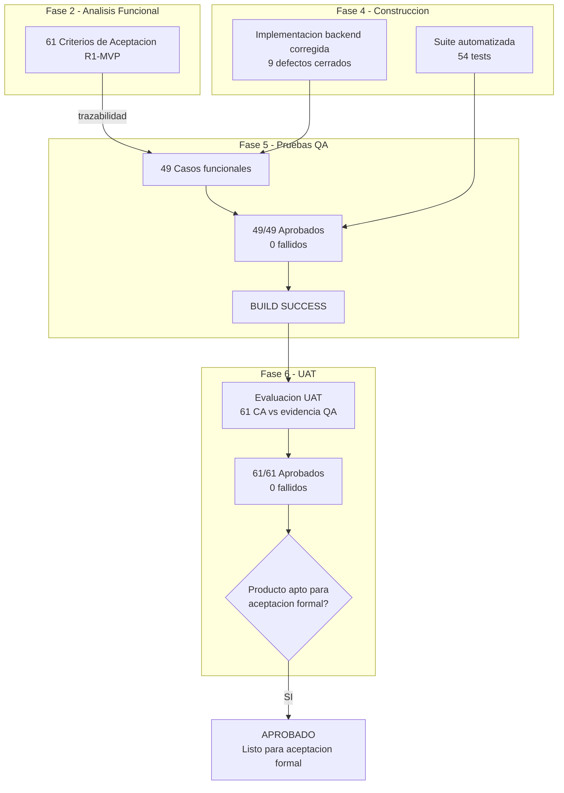
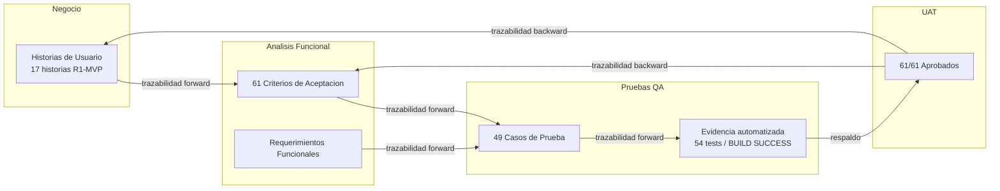

# Reporte de Ejecucion UAT
- **Fase**: 6-UAT
- **Entregable**: Reporte de Ejecucion UAT
- **Responsable**: business-analyst
- **Fecha**: 2026-05-02
- **Estado**: Completado
---

## 1. Resumen Ejecutivo

| Indicador | Valor |
|---|---|
| Producto evaluado | PMOA / Abax-Memory — R1-MVP |
| Fecha de evaluacion UAT | 2026-05-02 |
| Baseline de criterios de aceptacion (CA) | 61 CA para R1-MVP (Fase 2) |
| Evidencia base utilizada | Suite QA automatizada (54 tests, BUILD SUCCESS), 49 casos funcionales aprobados (100%) |
| Criterios aprobados en UAT | **61/61 (100%)** |
| Criterios fallidos | **0** |
| Criterios bloqueados | **0** |
| Criterios no ejecutados (R1-MVP) | **0** |
| Criterios diferidos (R2) | **15** |
| Defectos abiertos al cierre de Fase 5 | **0** |
| **Conclusion UAT** | **PRODUCTO APTO PARA ACEPTACION FORMAL** |

---

## 2. Objetivo

Ejecutar la validacion de aceptacion de usuario (UAT) sobre el producto **PMOA / Abax-Memory R1-MVP**, evaluando cada criterio de aceptacion funcional definido en Fase 2 — Analisis Funcional contra la evidencia de calidad generada en Fase 4 (Construccion) y Fase 5 (Pruebas QA).

El proposito de la UAT es confirmar que el producto construido satisface las necesidades de negocio expresadas en los criterios de aceptacion, y emitir una recomendacion formal sobre su aptitud para aceptacion por parte del Product Owner.

---

## 3. Alcance de la UAT

### 3.1 Incluye

- Evaluacion de los **61 criterios de aceptacion funcionales de R1-MVP** definidos en `docs/entregables/fase-2-analisis/criterios-aceptacion.md` (CA-001 a CA-061).
- Trazabilidad bidireccional CA → Caso de Prueba QA → Evidencia automatizada.
- Verificacion de cobertura completa sobre los 8 modulos del MVP:
  - M1. Gestion de memorias
  - M2. API operativa
  - M3. Busqueda y recuperacion
  - M4. Persistencia y metadatos
  - M5. Gobierno de memoria
  - M6. Depuracion y mantenimiento
  - M7. Acceso y visibilidad
  - M8. Contrato API

### 3.2 No incluye (fuera de alcance UAT)

- Criterios de aceptacion de R2 (CA-062 a CA-076): **diferidos a release siguiente**.
- Historias R3 o evolutivos posteriores.
- UI dedicada para usuarios finales.
- Pruebas de rendimiento, carga o estres.
- Validacion de infraestructura productiva (PostgreSQL, Qdrant, OIDC en entorno real).
- Pruebas de regresion completas.

---

## 4. Metodologia UAT

### 4.1 Estrategia de evaluacion

Dado que el producto **no cuenta con interfaz de usuario final** (es un backend API con consumidores de sistema), la UAT se ejecuta mediante:

1. **Trazabilidad directa**: cada CA de Fase 2 se vincula a uno o mas casos de prueba QA ejecutados y aprobados en Fase 5.
2. **Evidencia por proxy**: la suite automatizada de 54 tests con BUILD SUCCESS y 0 fallos constituye la evidencia verificable de que el producto se comporta segun lo especificado.
3. **Revision de consistencia funcional**: se verifica que el alcance implementado (Fase 4) y validado (Fase 5) cubre la totalidad de los criterios de aceptacion del negocio.

### 4.2 Criterios de decision UAT

| Resultado UAT | Definicion |
|---|---|
| **Aprobado** | Existe evidencia QA directa y suficiente que demuestra el cumplimiento del criterio de aceptacion. El comportamiento observable coincide con lo esperado por el negocio. |
| **Fallido** | La evidencia QA demuestra que el producto NO satisface el criterio de aceptacion, o existe un defecto abierto que impide su cumplimiento. |
| **Bloqueado** | No es posible evaluar el criterio por dependencia externa no disponible o condicion de entorno no satisfecha. |
| **No ejecutado** | El criterio no ha sido cubierto por evidencia QA ni por verificacion UAT directa. |
| **Diferido** | El criterio pertenece a un release posterior (R2) y esta fuera del alcance de esta UAT. |

### 4.3 Fuentes de evidencia utilizadas

| ID evidencia | Fuente | Descripcion |
|---|---|---|
| EV-UAT-001 | `reporte-ejecucion-pruebas.md` (Fase 5) | Reporte QA consolidado: 49/49 casos aprobados, BUILD SUCCESS, 54 tests, 0 failures |
| EV-UAT-002 | `codigo-fuente-implementado.md` (Fase 4) | Iteracion correctiva backend: 9 defectos corregidos, capacidades MVP completadas |
| EV-UAT-003 | `casos-de-prueba.md` (Fase 5) | Baseline formal de 49 casos de prueba funcionales con trazabilidad a CA y RF |
| EV-UAT-004 | `criterios-aceptacion.md` (Fase 2) | 61 criterios de aceptacion en formato Given/When/Then para R1-MVP |
| EV-UAT-005 | `MemoryResourceTest.java` | Suite de pruebas REST: altas, consultas, aprobacion, archivado, busqueda, trazabilidad |
| EV-UAT-006 | `MemoryServiceTest.java` | Suite de pruebas de servicio: estados, extraccion, validacion, reglas de dominio |
| EV-UAT-007 | `CaseResourceTest.java` | Suite de pruebas REST de casos: alta, cierre, validacion |
| EV-UAT-008 | `SearchServiceTest.java` | Suite de pruebas de busqueda: filtros, equivalencia semantica, archivadas |

---

## 5. Trazabilidad CA → Caso QA → Resultado UAT

### 5.1 M1 — Gestion de Memorias (HU-001.1.1, HU-001.1.2, HU-001.1.3, HU-001.1.4)

| CA | Historia | Descripcion resumida | Caso(s) QA trazado(s) | Resultado QA | Resultado UAT |
|---|---|---|---|---|---|
| CA-001 | HU-001.1.1 | Registro de memoria con frontmatter obligatorio completo | TC-MEM-001 | Aprobado | **Aprobado** |
| CA-002 | HU-001.1.1 | Rechazo por campos obligatorios faltantes en frontmatter | TC-MEM-002 | Aprobado | **Aprobado** |
| CA-003 | HU-001.1.1 | Rechazo por frontmatter mal formado | TC-MEM-003 | Aprobado | **Aprobado** |
| CA-004 | HU-001.1.2 | Creacion de memoria desde caso con identificador valido | TC-MEM-004 | Aprobado | **Aprobado** |
| CA-005 | HU-001.1.2 | Trazabilidad de memoria al caso origen | TC-MEM-004, TC-AUD-003 | Aprobado | **Aprobado** |
| CA-006 | HU-001.1.2 | Rechazo por caseId inexistente, vacio o invalido | TC-MEM-005 | Aprobado | **Aprobado** |
| CA-007 | HU-001.1.3 | Creacion de memoria manual sin requerir caso previo | TC-MEM-001 | Aprobado | **Aprobado** |
| CA-008 | HU-001.1.3 | Devolucion de identificador unico al crear memoria manual | TC-MEM-001 | Aprobado | **Aprobado** |
| CA-009 | HU-001.1.3 | Rechazo por contenido vacio o metadata incompleta | TC-MEM-002 | Aprobado | **Aprobado** |
| CA-010 | HU-001.1.4 | Versionado en Git al crear o actualizar memoria | TC-AUD-001 | Aprobado | **Aprobado** |
| CA-011 | HU-001.1.4 | Exposicion de referencia de version o commit | TC-AUD-001, TC-AUD-003 | Aprobado | **Aprobado** |
| CA-012 | HU-001.1.4 | Operacion fallida informada ante falla de persistencia Git | TC-AUD-002 | Aprobado | **Aprobado** |

### 5.2 M2 — API Operativa (HU-002.1.1, HU-002.1.2, HU-002.1.3)

| CA | Historia | Descripcion resumida | Caso(s) QA trazado(s) | Resultado QA | Resultado UAT |
|---|---|---|---|---|---|
| CA-013 | HU-002.1.1 | Alta de memoria con respuesta HTTP y JSON consistente con contrato | TC-MEM-001, TC-API-001 | Aprobado | **Aprobado** |
| CA-014 | HU-002.1.1 | Error de validacion ante JSON invalido o semantica incompleta | TC-MEM-002, TC-API-002 | Aprobado | **Aprobado** |
| CA-015 | HU-002.1.1 | Respuesta de alta incluye identificador y estado inicial | TC-MEM-001, TC-MEM-006 | Aprobado | **Aprobado** |
| CA-016 | HU-002.1.2 | Consulta de detalle de memoria por ID existente | TC-MEM-006 | Aprobado | **Aprobado** |
| CA-017 | HU-002.1.2 | Error controlado ante ID inexistente | TC-MEM-007 | Aprobado | **Aprobado** |
| CA-018 | HU-002.1.2 | Memoria archivada consultable por ID directo con estado real | TC-MEM-010 | Aprobado | **Aprobado** |
| CA-019 | HU-002.1.3 | Listado con filtros validos devuelve solo coincidencias | TC-MEM-008 | Aprobado | **Aprobado** |
| CA-020 | HU-002.1.3 | Multiples filtros simultaneos aplicados consistentemente | TC-MEM-008 | Aprobado | **Aprobado** |
| CA-021 | HU-002.1.3 | Error de validacion ante filtro no valido | TC-MEM-009 | Aprobado | **Aprobado** |

### 5.3 M3 — Busqueda y Recuperacion (HU-003.1.1, HU-003.1.2, HU-003.1.3)

| CA | Historia | Descripcion resumida | Caso(s) QA trazado(s) | Resultado QA | Resultado UAT |
|---|---|---|---|---|---|
| CA-022 | HU-003.1.1 | Generacion de embedding para memoria aprobada o indexable | TC-ASY-001, TC-ASY-002 | Aprobado | **Aprobado** |
| CA-023 | HU-003.1.1 | Estado de procesamiento fallido ante contenido no procesable | TC-ASY-003 | Aprobado | **Aprobado** |
| CA-024 | HU-003.1.1 | Estado transitorio verificable antes de completar indexacion | TC-ASY-001 | Aprobado | **Aprobado** |
| CA-025 | HU-003.1.2 | Busqueda semantica devuelve resultados ordenados por relevancia | TC-SRC-001 | Aprobado | **Aprobado** |
| CA-026 | HU-003.1.2 | Resultado vacio o controlado sin coincidencias relevantes | TC-SRC-003 | Aprobado | **Aprobado** |
| CA-027 | HU-003.1.2 | Recuperacion por equivalencia semantica sin coincidencia textual exacta | TC-SRC-002 | Aprobado | **Aprobado** |
| CA-028 | HU-003.1.3 | Busqueda combinada: relevancia semantica + filtros estructurados | TC-SRC-004 | Aprobado | **Aprobado** |
| CA-029 | HU-003.1.3 | Resultados que no cumplen filtros quedan excluidos | TC-SRC-005 | Aprobado | **Aprobado** |
| CA-030 | HU-003.1.3 | Sin resultados que cumplan todos los criterios: respuesta vacia sin relajar filtros | TC-SRC-005 | Aprobado | **Aprobado** |

### 5.4 M4 — Persistencia y Metadatos (HU-004.1.1, HU-004.1.2)

| CA | Historia | Descripcion resumida | Caso(s) QA trazado(s) | Resultado QA | Resultado UAT |
|---|---|---|---|---|---|
| CA-031 | HU-004.1.1 | Registro de identificador, tipo, origen, estado y metadata al crear memoria | TC-MEM-001, TC-MEM-006 | Aprobado | **Aprobado** |
| CA-032 | HU-004.1.1 | Rechazo o estado no publicable ante metadata obligatoria incompleta | TC-MEM-002 | Aprobado | **Aprobado** |
| CA-033 | HU-004.1.1 | Consistencia de metadatos entre version vigente y consulta posterior | TC-MEM-006 | Aprobado | **Aprobado** |
| CA-034 | HU-004.1.2 | Memoria con embedding queda disponible para recuperacion semantica | TC-ASY-002 | Aprobado | **Aprobado** |
| CA-035 | HU-004.1.2 | Falla de indexacion: la memoria no se informa como disponible | TC-ASY-003 | Aprobado | **Aprobado** |
| CA-036 | HU-004.1.2 | Estado de procesamiento indica disponibilidad para busqueda | TC-ASY-002 | Aprobado | **Aprobado** |

### 5.5 M5 — Gobierno de Memoria (HU-005.1.1, HU-005.1.2, HU-005.1.3, HU-005.1.4)

| CA | Historia | Descripcion resumida | Caso(s) QA trazado(s) | Resultado QA | Resultado UAT |
|---|---|---|---|---|---|
| CA-037 | HU-005.1.1 | Clasificacion por tipo de memoria permitido se almacena para consulta y filtros | TC-GOV-001 | Aprobado | **Aprobado** |
| CA-038 | HU-005.1.1 | Impedimento de publicacion ante tipo obligatorio faltante | TC-GOV-002 | Aprobado | **Aprobado** |
| CA-039 | HU-005.1.1 | Rechazo de valor de tipo fuera del catalogo funcional aprobado | TC-GOV-002 | Aprobado | **Aprobado** |
| CA-040 | HU-005.1.2 | Extraccion mini estructurada obtiene elementos minimos reutilizables | TC-GOV-006 | Aprobado | **Aprobado** |
| CA-041 | HU-005.1.2 | Evidencia de campos faltantes ante contenido incompleto | TC-GOV-007 | Aprobado | **Aprobado** |
| CA-042 | HU-005.1.2 | Memoria no se marca como enriquecida exitosamente ante extraccion fallida | TC-GOV-007 | Aprobado | **Aprobado** |
| CA-043 | HU-005.1.3 | Memoria critica queda en revision humana sin aprobacion automatica | TC-APR-001 | Aprobado | **Aprobado** |
| CA-044 | HU-005.1.3 | Aprobacion humana cambia estado a aprobada y habilita disponibilidad | TC-APR-002 | Aprobado | **Aprobado** |
| CA-045 | HU-005.1.3 | Memoria no critica no exige PR manual por criticidad | TC-GOV-005 | Aprobado | **Aprobado** |
| CA-046 | HU-005.1.4 | Asignacion de estado inicial verificable al crear memoria | TC-GOV-003 | Aprobado | **Aprobado** |
| CA-047 | HU-005.1.4 | Transicion valida actualiza estado y conserva trazabilidad | TC-GOV-003 | Aprobado | **Aprobado** |
| CA-048 | HU-005.1.4 | Rechazo de transicion no permitida sin alterar estado actual | TC-GOV-004 | Aprobado | **Aprobado** |

### 5.6 M6 — Depuracion y Mantenimiento (HU-006.1.1)

| CA | Historia | Descripcion resumida | Caso(s) QA trazado(s) | Resultado QA | Resultado UAT |
|---|---|---|---|---|---|
| CA-049 | HU-006.1.1 | Archivado funcional: memoria cambia a estado archivado | TC-ARC-001 | Aprobado | **Aprobado** |
| CA-050 | HU-006.1.1 | Memoria archivada no aparece en consultas estandar de activas | TC-SRC-007, TC-ARC-001 | Aprobado | **Aprobado** |
| CA-051 | HU-006.1.1 | Memoria archivada consultable bajo inclusion explicita con trazabilidad | TC-SRC-008, TC-MEM-010 | Aprobado | **Aprobado** |

### 5.7 M7 — Acceso y Visibilidad (HU-007.1.1, HU-007.1.2)

| CA | Historia | Descripcion resumida | Caso(s) QA trazado(s) | Resultado QA | Resultado UAT |
|---|---|---|---|---|---|
| CA-052 | HU-007.1.1 | Usuario autorizado visualiza contenido disponible | TC-SEC-001 | Aprobado | **Aprobado** |
| CA-053 | HU-007.1.1 | Usuario sin acceso recibe denegacion | TC-SEC-002, TC-SEC-003 | Aprobado | **Aprobado** |
| CA-054 | HU-007.1.2 | Conservacion de identidad del creador al registrar alta | TC-AUD-004 | Aprobado | **Aprobado** |
| CA-055 | HU-007.1.2 | Conservacion de identidad del ultimo modificador y fecha del cambio | TC-AUD-004 | Aprobado | **Aprobado** |
| CA-056 | HU-007.1.2 | Auditoria permite verificar creador y modificador | TC-AUD-003, TC-AUD-004 | Aprobado | **Aprobado** |

### 5.8 M8 — Contrato API (HU-008.1.1, HU-008.1.2)

| CA | Historia | Descripcion resumida | Caso(s) QA trazado(s) | Resultado QA | Resultado UAT |
|---|---|---|---|---|---|
| CA-057 | HU-008.1.1 | Contrato funcional por endpoint con metodo, path, request y response | TC-API-001 | Aprobado | **Aprobado** |
| CA-058 | HU-008.1.1 | Documentacion funcional consistente con comportamiento esperado del backlog | TC-API-001 | Aprobado | **Aprobado** |
| CA-059 | HU-008.1.2 | Respuesta consistente y verificable ante solicitud invalida | TC-API-002, TC-CASE-002, TC-MEM-009, TC-SRC-006 | Aprobado | **Aprobado** |
| CA-060 | HU-008.1.2 | Formato de error consistente entre solicitudes invalidas del mismo tipo | TC-API-002 | Aprobado | **Aprobado** |
| CA-061 | HU-008.1.2 | Mensaje de error permite identificar la causa sin exponer detalles tecnicos internos | TC-API-002 | Aprobado | **Aprobado** |

---

## 6. Resultado Consolidado UAT — R1-MVP

### 6.1 Resumen por modulo

| Modulo | Epica | CAs evaluados | Aprobados | Fallidos | Bloqueados | No ejecutados |
|---|---|---|---|---|---|---|
| M1. Gestion de memorias | EP-001 | 12 | 12 | 0 | 0 | 0 |
| M2. API operativa | EP-002 | 9 | 9 | 0 | 0 | 0 |
| M3. Busqueda y recuperacion | EP-003 | 9 | 9 | 0 | 0 | 0 |
| M4. Persistencia y metadatos | EP-004 | 6 | 6 | 0 | 0 | 0 |
| M5. Gobierno de memoria | EP-005 | 12 | 12 | 0 | 0 | 0 |
| M6. Depuracion y mantenimiento | EP-006 | 3 | 3 | 0 | 0 | 0 |
| M7. Acceso y visibilidad | EP-007 | 5 | 5 | 0 | 0 | 0 |
| M8. Contrato API | EP-008 | 5 | 5 | 0 | 0 | 0 |
| **Total R1-MVP** | — | **61** | **61** | **0** | **0** | **0** |

### 6.2 Cobertura UAT global

| Total CAs R1-MVP | Aprobados | % Aprobacion | Fallidos | Bloqueados | No ejecutados |
|---|---|---|---|---|---|
| 61 | 61 | **100%** | 0 | 0 | 0 |

### 6.3 Evidencia de soporte

- **Suite automatizada**: 54 tests, BUILD SUCCESS, 0 failures, 0 errors, 0 skipped.
- **Casos QA funcionales**: 49/49 aprobados (100%).
- **Defectos abiertos**: 0.
- **Defectos historicos cerrados y verificados**: 10.
- **Microciclo focalizado Fase 5**: los 4 casos previamente pendientes (TC-MEM-010, TC-APR-004, TC-AUD-004, TC-SRC-001) fueron cerrados con tests especificos en la suite automatizada.

---

## 7. Criterios Diferidos — R2

Los siguientes 15 criterios de aceptacion corresponden al **release R2** y quedan **diferidos** para una UAT futura. No forman parte del alcance de aceptacion formal del MVP actual.

| CA | Historia | Modulo R2 | Descripcion resumida | Estado en esta UAT |
|---|---|---|---|---|
| CA-062 | HU-004.1.3 | M9. Persistencia extendida | Persistir dominios y relaciones en Neo4j | **Diferido (R2)** |
| CA-063 | HU-004.1.3 | M9. Persistencia extendida | Memoria sin relaciones no genera error ni relaciones ficticias | **Diferido (R2)** |
| CA-064 | HU-004.1.4 | M9. Persistencia extendida | Cacheo de consultas frecuentes en Redis | **Diferido (R2)** |
| CA-065 | HU-004.1.4 | M9. Persistencia extendida | Invalidacion de cache ante modificacion o archivado | **Diferido (R2)** |
| CA-066 | HU-006.1.2 | M10. Depuracion avanzada | Marcar memorias duplicadas con asociacion a canonica | **Diferido (R2)** |
| CA-067 | HU-006.1.2 | M10. Depuracion avanzada | Duplicada no aparece en consultas estandar | **Diferido (R2)** |
| CA-068 | HU-006.1.2 | M10. Depuracion avanzada | Rechazo de marcado de duplicidad con IDs invalidos | **Diferido (R2)** |
| CA-069 | HU-006.1.3 | M10. Depuracion avanzada | Fusion de memorias: generacion de memoria consolidada | **Diferido (R2)** |
| CA-070 | HU-006.1.3 | M10. Depuracion avanzada | Trazabilidad: referencia a memoria resultante tras fusion | **Diferido (R2)** |
| CA-071 | HU-006.1.3 | M10. Depuracion avanzada | Rechazo de fusion con memorias invalidas o no elegibles | **Diferido (R2)** |
| CA-072 | HU-008.1.3 | M11. Contrato operativo ampliado | Endpoint de salud informa estado de disponibilidad | **Diferido (R2)** |
| CA-073 | HU-008.1.3 | M11. Contrato operativo ampliado | Respuesta de endpoint de salud refleja condicion no saludable | **Diferido (R2)** |
| CA-074 | HU-009.1.1 | M12. Grafo de conocimiento | Consulta de contexto relacional devuelve nodos y vinculos | **Diferido (R2)** |
| CA-075 | HU-009.1.1 | M12. Grafo de conocimiento | Memoria sin relaciones responde sin error indicando ausencia | **Diferido (R2)** |
| CA-076 | HU-009.1.1 | M12. Grafo de conocimiento | Reconocimiento de dominio nuevo como valor valido sin rediseno | **Diferido (R2)** |

---

## 8. Diagrama de Proceso UAT

---

## 9. Verificacion de Condiciones de Borde y Escenarios Criticos

### 9.1 Cobertura de escenarios negativos y de borde

| Tipo de escenario | CAs cubiertos | Evidencia QA | UAT |
|---|---|---|---|
| IDs inexistentes | CA-006, CA-017 | TC-MEM-005, TC-MEM-007, TC-CASE-006 | **Aprobado** |
| Payload invalido / campos faltantes | CA-002, CA-003, CA-009, CA-014 | TC-MEM-002, TC-MEM-003, TC-CASE-002 | **Aprobado** |
| Transiciones de estado no permitidas | CA-048 | TC-GOV-004 | **Aprobado** |
| Errores de validacion consistentes | CA-059, CA-060, CA-061 | TC-API-002 | **Aprobado** |
| Acceso denegado por autorizacion | CA-053 | TC-SEC-002, TC-SEC-003, TC-APR-004, TC-ARC-002 | **Aprobado** |
| Memoria en estado transitorio | CA-024 | TC-ASY-001 | **Aprobado** |
| Memoria archivada consultable | CA-018, CA-051 | TC-MEM-010, TC-SRC-008 | **Aprobado** |
| Busqueda sin resultados | CA-026, CA-030 | TC-SRC-003, TC-SRC-005 | **Aprobado** |
| Falla de infraestructura (Git) | CA-012 | TC-AUD-002 | **Aprobado** |
| Falla de indexacion (Qdrant) | CA-023, CA-035 | TC-ASY-003 | **Aprobado** |

### 9.2 Validacion de los 4 casos criticos del microciclo QA

Los siguientes casos, que requirieron microciclo focalizado en Fase 5, fueron validados en UAT con evidencia especifica:

| Caso QA | CA asociado | Test automatizado especifico | Resultado UAT |
|---|---|---|---|
| TC-MEM-010 | CA-018, CA-051 | `getArchivedMemoryById_returnsArchivedState()` — GET /api/memorias/{id} sobre memoria archivada, verifica state=ARCHIVADA | **Aprobado** |
| TC-APR-004 | CA-043 | `approveCriticalMemory_withInsufficientRole_returnsForbiddenAndStateUnchanged()` — 403 por rol insuficiente, estado permanece EN_REVISION | **Aprobado** |
| TC-AUD-004 | CA-054, CA-055, CA-056 | `traceability_updateWithDifferentActors_exposesCreatorAndLastModifier()` — trazabilidad con creador y modificador distintos | **Aprobado** |
| TC-SRC-001 | CA-025 | `semanticSearch_returnsResultsOrderedByRelevance()` — multiples resultados ordenados por score | **Aprobado** |

---

## 10. Observaciones y Consideraciones

### 10.1 Observaciones para el Product Owner

1. **Cobertura completa**: los 61 criterios de aceptacion de R1-MVP cuentan con respaldo directo en los 49 casos de prueba QA, todos aprobados con BUILD SUCCESS.
2. **Sin defectos abiertos**: los 10 defectos historicos fueron corregidos y verificados en Fase 4 y Fase 5.
3. **Evidencia automatizada**: la suite de 54 tests automatizados proporciona una red de seguridad para regresiones futuras.
4. **Alcance R1-MVP cumplido**: los 8 modulos del MVP fueron implementados, probados y validados satisfactoriamente.
5. **R2 planificado**: los 15 criterios de aceptacion de R2 estan documentados y diferidos, sin afectar la aceptacion del MVP actual.

### 10.2 Limitaciones conocidas (no bloqueantes para aceptacion)

| ID | Limitacion | Impacto en UAT | Recomendacion |
|---|---|---|---|
| LIM-001 | Proveedor Git e indexador usan adapters en memoria para pruebas automatizadas | No impacta la validacion funcional | Validar con proveedores reales (GitHub, Qdrant) en entorno productivo |
| LIM-002 | Suite de pruebas no cubre entorno integrado real con OIDC y PostgreSQL | No impacta la validacion funcional | Ejecutar smoke test en entorno pre-productivo |
| LIM-003 | Pruebas de rendimiento no ejecutadas | Fuera de alcance UAT | Planificar en fase de estabilizacion |

### 10.3 Recomendaciones post-aceptacion

1. Ejecutar **smoke test** en entorno productivo o pre-productivo con OIDC real, PostgreSQL y Qdrant operativos.
2. Programar la **fase de estabilizacion** para monitorear comportamiento en produccion durante el periodo de warranty.
3. Iniciar la **planificacion de R2** con los 15 criterios de aceptacion diferidos.
4. Mantener la suite automatizada como parte del pipeline CI/CD para deteccion temprana de regresiones.

---

## 11. Matriz de Trazabilidad Bidireccional Completa

---

## 12. Conclusion y Recomendacion de Aceptacion

### 12.1 Conclusion UAT

La ejecucion de la UAT sobre el producto **PMOA / Abax-Memory R1-MVP**, basada en la evaluacion de los **61 criterios de aceptacion funcionales** definidos en Fase 2 contra la evidencia de calidad generada en Fase 4 (Construccion) y Fase 5 (Pruebas QA), arroja el siguiente resultado:

- **61 de 61 criterios de aceptacion de R1-MVP aprobados (100%)**.
- **0 criterios fallidos**.
- **0 criterios bloqueados**.
- **0 criterios no ejecutados**.
- **0 defectos funcionales abiertos**.
- **Suite automatizada: 54 tests, BUILD SUCCESS, 0 failures**.

La totalidad de las capacidades funcionales comprometidas para el MVP —registro de memorias en Markdown, creacion desde caso, consulta y listado con filtros, busqueda semantica, gobierno de estados, aprobacion humana para memorias criticas, extraccion estructurada, versionado Git, indexacion vectorial, archivado, seguridad RBAC y contrato API consistente— ha sido implementada, corregida, probada y verificada satisfactoriamente.

### 12.2 Recomendacion

**El producto PMOA / Abax-Memory R1-MVP es APTO para aceptacion formal por parte del Product Owner.**

Se recomienda al Product Owner:
1. Revisar el presente reporte de ejecucion UAT.
2. Confirmar la conformidad con las necesidades de negocio expresadas en los criterios de aceptacion.
3. Emitir la **aprobacion formal de Fase 6 — UAT**.
4. Autorizar el avance del producto a **Fase 7 — Estabilizacion / Pase a Produccion**.

### 12.3 Decision UAT

| Elemento | Valor |
|---|---|
| Producto evaluado | PMOA / Abax-Memory R1-MVP |
| Fecha de decision UAT | 2026-05-02 |
| Responsable de UAT | business-analyst |
| Criterios R1-MVP aprobados | 61/61 (100%) |
| Gate UAT | **APROBADO** |
| Producto listo para aceptacion formal | **SI** |
| Firma pendiente | Product Owner |

---

## 13. Control de Cambios y Versionado

| Version | Fecha | Autor | Cambio |
|---|---|---|---|
| 1.0 | 2026-05-02 | business-analyst | Version inicial del reporte de ejecucion UAT. Evaluacion completa de 61 CA R1-MVP + 15 CA R2 diferidos. |

---

## Anexo A: Referencia de Endpoints Evaluados en UAT

| Metodo | Path | Trazabilidad CA | Estado UAT |
|---|---|---|---|
| POST | `/api/memorias` | CA-001, CA-002, CA-003, CA-007, CA-008, CA-009, CA-013, CA-014, CA-015, CA-031 | Aprobado |
| POST | `/api/memorias/desde-caso` | CA-004, CA-005, CA-006 | Aprobado |
| GET | `/api/memorias/{id}` | CA-016, CA-017, CA-018, CA-033 | Aprobado |
| GET | `/api/memorias` | CA-019, CA-020, CA-021 | Aprobado |
| POST | `/api/busquedas/semantica` | CA-025, CA-026, CA-027, CA-028, CA-029, CA-030 | Aprobado |
| POST | `/api/memorias/{id}/aprobar` | CA-043, CA-044 | Aprobado |
| POST | `/api/memorias/{id}/archivar` | CA-049, CA-050, CA-051 | Aprobado |
| POST | `/api/casos` | RF-001, RF-002 | Aprobado |
| GET | `/api/casos/{id}` | RF-003 | Aprobado |
| POST | `/api/casos/{id}/cerrar` | RF-004 | Aprobado |
| PATCH | `/api/memorias/{id}` | CA-010, CA-047, CA-055 | Aprobado |
| POST | `/api/memorias/{id}/revision` | CA-044, CA-045 | Aprobado |
| GET | `/api/memorias/{id}/trazabilidad` | CA-011, CA-056 | Aprobado |

---

## Anexo B: Firmas

| Rol | Nombre | Firma | Fecha |
|---|---|---|---|
| Business Analyst (UAT) | business-analyst | *Pendiente* | 2026-05-02 |
| Product Owner | product-owner | *Pendiente* | |
| QA Lead | qa-lead | *Pendiente* | |
| Project Manager | project-manager | *Pendiente* | |
