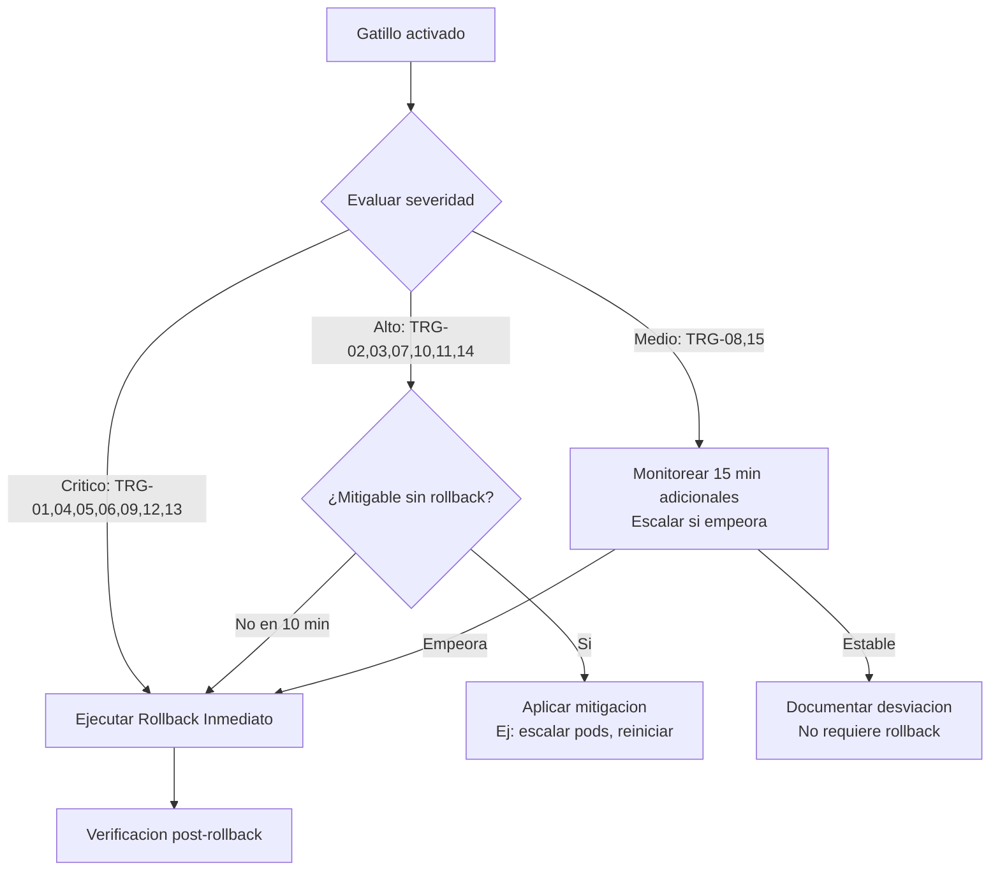
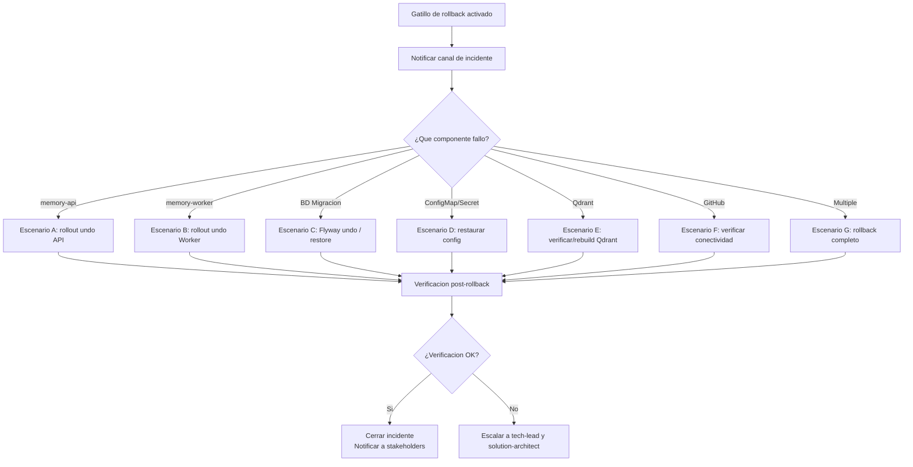

# Plan de Rollback — Abax-Memory R1-MVP
- **Fase**: 7 — Despliegue
- **Entregable**: Plan de Rollback
- **Responsable**: devops
- **Fecha**: 2026-05-02
- **Estado**: Completado

---

## 1. Proposito y Alcance

Este documento define el plan de rollback para el despliegue del MVP **PMOA / Abax-Memory R1-MVP** en el servidor cloud privado corporativo. Establece las condiciones que activan una reversión, los pasos detallados para ejecutarla, los responsables, los tiempos estimados y la verificación post-rollback. Su objetivo es garantizar que, ante cualquier falla en el despliegue, el sistema pueda retornar a un **punto de retorno seguro (Safe Return Point — SRP)** de forma controlada, predecible y con minima afectacion al negocio.

### 1.1 Alcance del MVP (Componentes bajo este plan)

| Componente | Rol | Estrategia de rollback |
|---|---|---|
| `memory-api` (Quarkus, 2 replicas) | API REST principal | **K8s Rollback**: revertir Deployment a revision anterior |
| `memory-worker` (Quarkus, 1-2 replicas) | Procesamiento asincrono de jobs | **K8s Rollback**: revertir Deployment a revision anterior |
| PostgreSQL | Store transaccional (metadata, estados, auditoria, jobs) | **Flyway Undo** / **Snapshot restore** |
| Qdrant | Indice vectorial derivado (embeddings) | **Rebuild desde PostgreSQL** (indice regenerable) |
| Keycloak | OIDC / JWT (gestionado separadamente) | No incluido en este plan; gestionado por equipo IAM |
| Git/GitHub | Fuente canonica de contenido | Fuera de infraestructura propia; solo verificacion de conectividad |
| Ingress / TLS | Punto de entrada | Revertir manifiesto de Ingress si se modificaron reglas |

### 1.2 Exclusiones

- Rollback de Keycloak: gestionado por el equipo de IAM corporativo con su propio procedimiento.
- Rollback de infraestructura Kubernetes (nodos, CNI, CSI): responsabilidad del equipo de plataforma cloud.
- Desastres mayores (perdida total de cluster o datacenter): cubierto por el plan de DR, no por este plan de rollback operativo.

---

## 2. Punto de Retorno Seguro (Safe Return Point — SRP)

> **Definicion**: El SRP es el estado verificable del sistema inmediatamente antes del inicio del despliegue, documentado de forma tal que cualquier rollback puede restaurarlo con certeza.

### 2.1 Artefactos que componen el SRP

| Artefacto | Como se captura | Responsable de captura | Formato de evidencia |
|---|---|---|---|
| Version actual de imagen `memory-api` | `kubectl get deployment memory-api -o jsonpath='{.spec.template.spec.containers[0].image}'` | devops | Log de pipeline pre-deploy |
| Version actual de imagen `memory-worker` | `kubectl get deployment memory-worker -o jsonpath='{.spec.template.spec.containers[0].image}'` | devops | Log de pipeline pre-deploy |
| Revision actual del Deployment (K8s) | `kubectl rollout history deployment/memory-api` | devops | Revision number anotado |
| Tag de imagen Docker previa en registry | `docker pull <registry>/abax-memory-api:<current-tag>` | devops | Tag confirmado disponible |
| Esquema actual de PostgreSQL | `pg_dump --schema-only` o hash de migraciones Flyway aplicadas | devops / dba | Snapshot de esquema |
| Estado de migraciones Flyway | `flyway info` / tabla `flyway_schema_history` | devops | Listado de versiones aplicadas |
| Indice Qdrant (opcional, regenerable) | Snapshot de coleccion `memories_embeddings` | devops | Opcional si se quiere evitar rebuild |
| Manifiestos K8s actuales | `kubectl get all -n abax-memory -o yaml` | devops | Backup YAML en artifact store |

### 2.2 Procedimiento obligatorio de captura del SRP (PRE-DEPLOY)

Este procedimiento debe ejecutarse **inmediatamente antes** de iniciar cualquier paso de despliegue. Si falla, **no se procede con el despliegue**.

```bash
#!/bin/bash
# srp-capture.sh — Ejecutar ANTES de cualquier paso de despliegue
set -euo pipefail

NAMESPACE="abax-memory"
TIMESTAMP=$(date -u +"%Y%m%dT%H%M%SZ")
SRP_DIR="./srp-${TIMESTAMP}"
mkdir -p "${SRP_DIR}"

echo "[SRP] Capturando punto de retorno seguro..."

# 1. Versiones de imagenes actuales
kubectl get deployment memory-api -n "${NAMESPACE}" \
  -o jsonpath='{.spec.template.spec.containers[0].image}' > "${SRP_DIR}/image-api.txt"
kubectl get deployment memory-worker -n "${NAMESPACE}" \
  -o jsonpath='{.spec.template.spec.containers[0].image}' > "${SRP_DIR}/image-worker.txt"

# 2. Numero de revision actual
kubectl rollout history deployment/memory-api -n "${NAMESPACE}" \
  > "${SRP_DIR}/rollout-history-api.txt"
kubectl rollout history deployment/memory-worker -n "${NAMESPACE}" \
  > "${SRP_DIR}/rollout-history-worker.txt"

# 3. Replicas actuales
kubectl get deployment memory-api -n "${NAMESPACE}" \
  -o jsonpath='{.spec.replicas}' > "${SRP_DIR}/replicas-api.txt"
kubectl get deployment memory-worker -n "${NAMESPACE}" \
  -o jsonpath='{.spec.replicas}' > "${SRP_DIR}/replicas-worker.txt"

# 4. Backup de manifiestos completos
kubectl get all,ingress,configmap,secret -n "${NAMESPACE}" -o yaml \
  > "${SRP_DIR}/namespace-full.yaml"

# 5. Estado de migraciones (requiere conectividad a PostgreSQL)
# flyway -url="${DB_URL}" -user="${DB_USER}" -password="${DB_PASS}" info \
#   > "${SRP_DIR}/flyway-info.txt"

# 6. Verificar que imagenes previas existen en registry
PREV_API_IMAGE=$(cat "${SRP_DIR}/image-api.txt")
PREV_WORKER_IMAGE=$(cat "${SRP_DIR}/image-worker.txt")
docker manifest inspect "${PREV_API_IMAGE}" > /dev/null 2>&1 \
  && echo "[SRP] OK - Imagen API previa disponible en registry" \
  || echo "[SRP] WARN - Imagen API previa NO encontrada en registry"
docker manifest inspect "${PREV_WORKER_IMAGE}" > /dev/null 2>&1 \
  && echo "[SRP] OK - Imagen Worker previa disponible en registry" \
  || echo "[SRP] WARN - Imagen Worker previa NO encontrada en registry"

echo "[SRP] SRP capturado exitosamente en ${SRP_DIR}"
```

**Gate PRE-DEPLOY**: Si las imagenes previas NO estan en el registry (fueron eliminadas por politica de retencion), el despliegue **no procede** hasta que se asegure que el tag previo es recuperable o se tiene un plan B documentado.

---

## 3. Condiciones de Activacion del Rollback

### 3.1 Gatillos automaticos (monitoreo)

El rollback se activa automaticamente (o debe ser evaluado inmediatamente) si se detecta cualquiera de las siguientes condiciones dentro de los primeros **15 minutos** post-despliegue:

| ID | Condicion | Indicador | Ventana de deteccion |
|---|---|---|---|
| TRG-01 | Health check de `memory-api` falla en >50% de replicas | `/q/health/live` retorna DOWN | 2 min consecutivos |
| TRG-02 | Tasa de errores HTTP 5xx > 5% del trafico total | Metrica `http_server_requests_seconds_count{status=~"5.."}` | 5 min consecutivos |
| TRG-03 | Latencia p95 de endpoints criticos > 3x la linea base pre-deploy | Metrica `http_server_requests_seconds{quantile="0.95"}` | 5 min consecutivos |
| TRG-04 | `CrashLoopBackOff` en cualquier pod de `memory-api` o `memory-worker` | `kubectl get pods` | Inmediato tras 3 reinicios |
| TRG-05 | `ImagePullBackOff` o `ErrImagePull` en nuevos pods | `kubectl describe pod` | Inmediato |
| TRG-06 | PostgreSQL no responde o rechaza conexiones | Health check `/q/health/ready` reporta DB DOWN | 2 min consecutivos |
| TRG-07 | Qdrant no responde tras despliegue | Logs: `Connection refused` a Qdrant | 2 min consecutivos |
| TRG-08 | Jobs de `processing_jobs` acumulados > 3x linea base sin resolverse | Metrica `pending_jobs` | 10 min consecutivos |
| TRG-09 | Tests de humo (smoke tests) automatizados fallan en algun endpoint critico | Suite de smoke tests | Inmediato tras ejecucion |
| TRG-10 | Errores de autenticacion 401/403 masivos no atribuibles a Keycloak | Tasa 401/403 > 1% del trafico total | 5 min consecutivos |

### 3.2 Gatillos manuales (decision humana)

| ID | Condicion | Quien activa |
|---|---|---|
| TRG-11 | Falla en migracion de base de datos (Flyway error) | devops / dba |
| TRG-12 | Comportamiento funcional incorrecto detectado en verificacion post-deploy | qa-functional |
| TRG-13 | Incidente de seguridad detectado durante el despliegue | security-team / devops |
| TRG-14 | Decision del Product Owner o Tech Lead ante evidencia de degradacion | product-owner / tech-lead |
| TRG-15 | Rollback de un componente dependiente (ej: Keycloak) que impacta la operacion | devops |

### 3.3 Matriz de decision

Ante un gatillo activado, la decision sigue este arbol:



> **Regla de oro**: Si hay duda entre mitigar y revertir, **revertir**. El costo de un rollback es predecible; el costo de una degradacion prolongada no lo es.

---

## 4. Escenarios de Falla Cubiertos y Procedimientos de Rollback

### 4.1 Escenario A: Falla en despliegue de `memory-api` (nueva imagen defectuosa)

**Descripcion**: La nueva imagen de `memory-api` causa errores en runtime (CrashLoopBackOff, health checks fallidos, errores funcionales).

**Estrategia**: Kubernetes `rollout undo` al revision number capturado en el SRP.

**Tiempo estimado de rollback**: 2–5 minutos.

| Paso | Accion | Comando / Procedimiento | Responsable | Tiempo |
|---|---|---|---|---|
| A.1 | Detener el rolling update en curso (si aplica) | `kubectl rollout pause deployment/memory-api -n abax-memory` | devops | 10 s |
| A.2 | Revertir al revision number del SRP | `kubectl rollout undo deployment/memory-api -n abax-memory --to-revision=<SRP_REVISION>` | devops | 30 s |
| A.3 | Verificar que los pods antiguos estan levantando | `kubectl get pods -n abax-memory -l app=memory-api -w` | devops | 60–120 s |
| A.4 | Esperar a que los pods esten Ready | `kubectl wait --for=condition=Ready pod -l app=memory-api -n abax-memory --timeout=120s` | devops | 120 s |
| A.5 | Verificar health endpoints | `curl -s https://<host>/q/health/live` esperado: `{"status":"UP"}` | devops | 10 s |
| A.6 | Verificar health endpoint con readiness | `curl -s https://<host>/q/health/ready` | devops | 10 s |
| A.7 | Ejecutar smoke tests automatizados | Script `smoke-tests.sh` | qa-functional | 60 s |

**Verificacion minima post-rollback**: Health `UP`, readiness `UP`, smoke tests pass.

---

### 4.2 Escenario B: Falla en despliegue de `memory-worker` (jobs no se procesan)

**Descripcion**: La nueva imagen del worker causa que los jobs de indexacion/reconciliacion no se procesen, acumulandose en la tabla `processing_jobs`.

**Estrategia**: Kubernetes `rollout undo` del Deployment del worker. Los jobs pendientes seran retomados por la version anterior.

**Tiempo estimado de rollback**: 2–4 minutos.

| Paso | Accion | Comando / Procedimiento | Responsable | Tiempo |
|---|---|---|---|---|
| B.1 | Pausar despliegue del worker | `kubectl rollout pause deployment/memory-worker -n abax-memory` | devops | 10 s |
| B.2 | Revertir a revision SRP | `kubectl rollout undo deployment/memory-worker -n abax-memory --to-revision=<SRP_REVISION>` | devops | 30 s |
| B.3 | Verificar pods del worker | `kubectl get pods -n abax-memory -l app=memory-worker` | devops | 30 s |
| B.4 | Esperar Ready del worker | `kubectl wait --for=condition=Ready pod -l app=memory-worker -n abax-memory --timeout=120s` | devops | 120 s |
| B.5 | Verificar que el worker esta tomando jobs | `kubectl logs -l app=memory-worker -n abax-memory --tail=20 | grep "Picked job"` | devops | 15 s |
| B.6 | Verificar que la cola de pending_jobs empieza a disminuir | Consulta SQL: `SELECT COUNT(*) FROM processing_jobs WHERE status = 'PENDING'` | devops | 15 s |

**Consideracion especial**: Si el worker se revierte pero los jobs ya fueron marcados como procesados erroneamente por la version defectuosa, se requiere intervencion manual para resetear el estado de esos jobs especificos a `PENDING`.

---

### 4.3 Escenario C: Falla en migracion de base de datos (Flyway)

**Descripcion**: Una migracion Flyway nueva falla durante el despliegue, dejando la base de datos en un estado inconsistente.

**Estrategia**: Flyway undo (si la migracion lo soporta) o restauracion desde snapshot pre-deploy.

**Tiempo estimado**: 5–20 minutos (dependiendo del tamano de la BD y si se requiere restore).

| Paso | Accion | Comando / Procedimiento | Responsable | Tiempo |
|---|---|---|---|---|
| C.1 | Identificar la migracion fallida | `flyway info` — revisar ultima migracion con estado `FAILED` | devops / dba | 2 min |
| C.2a | **Opcion A (preferida)**: Ejecutar Flyway Undo | `flyway undo` (requiere que la migracion tenga undo script) | devops / dba | 2–5 min |
| C.2b | **Opcion B (fallback)**: Restaurar desde snapshot | `pg_restore` desde snapshot capturado en SRP + re-aplicar migraciones hasta la version pre-deploy | dba | 10–20 min |
| C.3 | Verificar consistencia del esquema | `flyway validate` o comparacion de schema dump | devops / dba | 2 min |
| C.4 | Verificar que la API funciona con el esquema restaurado | Health check + smoke test de endpoints que consultan BD | devops | 2 min |

**Prerequisito critico**: Toda migracion Flyway que se despliega DEBE tener un script `UNDO` asociado. Sin script de undo, solo se puede restaurar por snapshot. Esta regla es **inquebrantable**.

**Restriccion**: Si el snapshot de BD es mayor a 50 GB, el tiempo de restauracion se extiende. Para BD grandes, se recomienda PITR (Point-in-Time Recovery) o replicas con delay.

---

### 4.4 Escenario D: Falla en despliegue de ConfigMap o Secret

**Descripcion**: Un cambio en ConfigMap o Secret causa mal comportamiento (variables incorrectas, secretos mal formados, URLs erroneas).

**Estrategia**: Re-aplicar el ConfigMap/Secret desde el backup YAML capturado en el SRP, luego reiniciar los pods afectados.

**Tiempo estimado**: 3–6 minutos.

| Paso | Accion | Comando / Procedimiento | Responsable | Tiempo |
|---|---|---|---|---|
| D.1 | Restaurar ConfigMap/Secret desde SRP | `kubectl apply -f srp-<timestamp>/namespace-full.yaml` filtrando solo el recurso afectado | devops | 1 min |
| D.2 | Reiniciar pods para que tomen la configuracion anterior | `kubectl rollout restart deployment/memory-api -n abax-memory` | devops | 30 s |
| D.3 | Esperar a que los pods esten Ready | `kubectl wait --for=condition=Ready pod -l app=memory-api -n abax-memory --timeout=120s` | devops | 120 s |
| D.4 | Verificar health y funcionalidad | Smoke tests | devops / qa-functional | 2 min |

---

### 4.5 Escenario E: Falla por degradacion de Qdrant

**Descripcion**: Tras el despliegue, Qdrant deja de responder o devuelve errores en las consultas de busqueda semantica.

**Estrategia**: Qdrant es un indice derivado regenerable. Si el problema esta en Qdrant mismo, se verifica conectividad. Si el indice se corrompio, se reconstruye desde PostgreSQL.

**Tiempo estimado**: 5–30 minutos (dependiendo del tamano del rebuild).

| Paso | Accion | Comando / Procedimiento | Responsable | Tiempo |
|---|---|---|---|---|
| E.1 | Verificar conectividad con Qdrant | `kubectl exec -it deploy/memory-api -n abax-memory -- curl -s http://qdrant:6333/health` | devops | 1 min |
| E.2 | Verificar que la coleccion `memories_embeddings` existe y tiene datos | Consulta via API de Qdrant o `qdrant-client` | devops | 1 min |
| E.3 | Si Qdrant esta caido, reiniciar/revertir su Deployment (si fue actualizado) | `kubectl rollout undo deployment/qdrant -n abax-memory` | devops | 3 min |
| E.4 | Si la coleccion de embeddings esta corrupta/incompleta, lanzar rebuild | Ejecutar job de rebuild via endpoint interno: `POST /api/admin/qdrant/rebuild` | devops / backend | 5–20 min |
| E.5 | Verificar busqueda semantica funcional | Smoke test: `POST /api/busquedas/semantica` con query conocida | qa-functional | 2 min |

**Nota**: La busqueda semantica puede operar en modo degradado durante el rebuild. Si el rebuild tarda mas de 30 min, escalar al tech-lead para decision.

---

### 4.6 Escenario F: Falla por conectividad con GitHub (externo)

**Descripcion**: Tras el despliegue, la API no puede conectar con GitHub para commits, PRs o webhooks.

**Estrategia**: Verificar conectividad de red, credenciales y firewall. Si es un problema de la nueva version (cambio en adapter), revertir `memory-api`.

**Tiempo estimado**: 5–15 minutos.

| Paso | Accion | Comando / Procedimiento | Responsable | Tiempo |
|---|---|---|---|---|
| F.1 | Verificar conectividad de red a GitHub desde el cluster | `kubectl exec -it deploy/memory-api -n abax-memory -- curl -sI https://api.github.com` | devops | 1 min |
| F.2 | Verificar credenciales (GitHub token/app) | Validar Secret en K8s y probar autenticacion | devops | 2 min |
| F.3 | Si es falla externa (GitHub caido), esperar y monitorear | `https://www.githubstatus.com/` | devops | — |
| F.4 | Si es falla interna (codigo nuevo), revertir `memory-api` | Escenario A de este plan | devops | 5 min |
| F.5 | Verificar que las operaciones Git funcionan | Smoke test: crear memoria de prueba y verificar commit en GitHub | qa-functional | 2 min |

---

### 4.7 Escenario G: Rollback completo de todos los componentes

**Descripcion**: El despliegue causo fallas multiples que requieren reversion total al SRP.

**Estrategia**: Reversion en cascada de todos los componentes en orden inverso al despliegue.

**Tiempo estimado**: 10–20 minutos.

**Orden de rollback completo** (inverso al orden de deploy):

| Orden | Componente | Accion |
|---|---|---|
| 1 | `memory-worker` | `kubectl rollout undo deployment/memory-worker -n abax-memory` |
| 2 | `memory-api` | `kubectl rollout undo deployment/memory-api -n abax-memory` |
| 3 | ConfigMaps / Secrets | Re-aplicar desde SRP YAML backup |
| 4 | Qdrant (si fue actualizado) | `kubectl rollout undo deployment/qdrant -n abax-memory` |
| 5 | PostgreSQL (migraciones) | Flyway undo o restore de snapshot |
| 6 | Verificacion global | Smoke test suite completa |

---

## 5. Procedimiento Estandar de Rollback (Paso a Paso)

### 5.1 Precondiciones

- [ ] SRP capturado y verificado (ver seccion 2.2).
- [ ] Canal de comunicacion de incidente abierto (Slack/Teams `#abax-incidents`).
- [ ] Responsables notificados y disponibles (ver seccion 7).
- [ ] Acceso a cluster Kubernetes verificado (`kubectl cluster-info`).
- [ ] Acceso a registry de imagenes verificado.
- [ ] Acceso a PostgreSQL verificado (para undo/restore si aplica).

### 5.2 Flujo de ejecucion



### 5.3 Script de rollback automatizado (memory-api + memory-worker)

```bash
#!/bin/bash
# rollback-k8s-deployments.sh — Rollback estandar de Deployments
set -euo pipefail

NAMESPACE="${1:-abax-memory}"
SRP_DIR="${2:?Debe especificar directorio SRP (ej: ./srp-20260502T120000Z)}"
COMPONENT="${3:-all}"  # api, worker, o all

rollback_component() {
    local deploy_name="$1"
    local srp_revision_file="$2"
    
    if [ ! -f "${srp_revision_file}" ]; then
        echo "[ERROR] No se encontro archivo de revision SRP: ${srp_revision_file}"
        return 1
    fi
    
    local srp_revision
    srp_revision=$(grep -oP "^\d+" "${srp_revision_file}" | head -1)
    
    if [ -z "${srp_revision}" ]; then
        echo "[ERROR] No se pudo extraer revision de ${srp_revision_file}"
        return 1
    fi
    
    echo "[ROLLBACK] Revirtiendo ${deploy_name} a revision ${srp_revision}..."
    
    kubectl rollout undo deployment/"${deploy_name}" \
        -n "${NAMESPACE}" --to-revision="${srp_revision}"
    
    echo "[ROLLBACK] Esperando a que ${deploy_name} este Ready..."
    kubectl rollout status deployment/"${deploy_name}" \
        -n "${NAMESPACE}" --timeout=180s
    
    echo "[ROLLBACK] ${deploy_name} revertido exitosamente."
}

case "${COMPONENT}" in
    api)
        rollback_component "memory-api" "${SRP_DIR}/rollout-history-api.txt"
        ;;
    worker)
        rollback_component "memory-worker" "${SRP_DIR}/rollout-history-worker.txt"
        ;;
    all)
        rollback_component "memory-worker" "${SRP_DIR}/rollout-history-worker.txt"
        rollback_component "memory-api" "${SRP_DIR}/rollout-history-api.txt"
        ;;
    *)
        echo "[ERROR] Componente desconocido: ${COMPONENT}. Use: api, worker, all"
        exit 1
        ;;
esac

echo "[ROLLBACK] Completado para: ${COMPONENT}"
```

---

## 6. Verificacion Post-Rollback

### 6.1 Checklist obligatoria de verificacion

Toda ejecucion de rollback debe completar esta checklist antes de declarar el incidente como resuelto:

| # | Verificacion | Metodo | Resultado esperado | Responsable |
|---|---|---|---|---|
| V-01 | Health check `/q/health/live` de `memory-api` | `curl -s https://<host>/q/health/live` | `{"status":"UP"}` | devops |
| V-02 | Health check `/q/health/ready` de `memory-api` | `curl -s https://<host>/q/health/ready` | `{"status":"UP"}` y checks de DB y Qdrant UP | devops |
| V-03 | Todos los pods en estado `Running` y `Ready` | `kubectl get pods -n abax-memory` | 0 pods en CrashLoopBackOff, Pending, ImagePullBackOff | devops |
| V-04 | Logs sin errores FATAL/ERROR nuevos | `kubectl logs -l app=memory-api -n abax-memory --tail=50` | Sin stacktraces ni conexiones rechazadas | devops |
| V-05 | Smoke test: `POST /api/memorias` (crear) | Crear memoria de prueba con payload valido | 201 Created con `memoryId` | qa-functional |
| V-06 | Smoke test: `GET /api/memorias/{id}` (consultar) | Consultar la memoria creada | 200 OK con contenido y metadata | qa-functional |
| V-07 | Smoke test: `POST /api/busquedas/semantica` | Buscar con query de prueba | 200 OK con resultados (o array vacio aceptable si no hay embeddings aun) | qa-functional |
| V-08 | Smoke test: `GET /api/casos` (listar casos) | Listar casos existentes | 200 OK con array | qa-functional |
| V-09 | Worker procesando jobs (si aplica) | `kubectl logs -l app=memory-worker -n abax-memory --tail=10` | Logs de actividad de worker | devops |
| V-10 | Conexion PostgreSQL activa | Metrica `agroal_available_count` > 0 en `/q/metrics` | Conexiones disponibles al pool | devops |
| V-11 | Conexion Qdrant activa | Health check readiness incluye Qdrant UP | Qdrant reportado como UP | devops |
| V-12 | Conectividad GitHub (si aplica) | Probar creacion de memoria que involucre commit | Sin errores de red | devops |
| V-13 | Tasa de errores HTTP 5xx < 1% | Dashboard de monitoreo / Prometheus | Menos de 1% de requests con error | devops |
| V-14 | Latencia p95 dentro de 1.5x linea base pre-deploy | Dashboard de monitoreo | latencia comparable al SRP | devops |

### 6.2 Smoke test script automatizado

```bash
#!/bin/bash
# smoke-tests-post-rollback.sh
set -euo pipefail

BASE_URL="${1:?Debe especificar BASE_URL (ej: https://abax-memory.corp.example.com)}"
TOKEN="${2:?Debe especificar TOKEN de autenticacion}"
PASSED=0
FAILED=0

test_endpoint() {
    local method="$1"
    local path="$2"
    local expected_code="$3"
    local description="$4"
    local data="${5:-}"
    
    if [ -n "$data" ]; then
        response=$(curl -s -o /dev/null -w "%{http_code}" -X "${method}" \
            "${BASE_URL}${path}" \
            -H "Authorization: Bearer ${TOKEN}" \
            -H "Content-Type: application/json" \
            -d "${data}")
    else
        response=$(curl -s -o /dev/null -w "%{http_code}" -X "${method}" \
            "${BASE_URL}${path}" \
            -H "Authorization: Bearer ${TOKEN}")
    fi
    
    if [ "${response}" = "${expected_code}" ]; then
        echo "[PASS] ${description} (${response})"
        PASSED=$((PASSED + 1))
    else
        echo "[FAIL] ${description}: esperado ${expected_code}, obtenido ${response}"
        FAILED=$((FAILED + 1))
    fi
}

echo "=== Smoke Tests Post-Rollback ==="
echo "Target: ${BASE_URL}"

# Health checks
test_endpoint "GET" "/q/health/live" "200" "Liveness health check"
test_endpoint "GET" "/q/health/ready" "200" "Readiness health check"

# API funcional
test_endpoint "GET" "/api/casos" "200" "Listar casos"

# Crear memoria de prueba
MEMORY_PAYLOAD='{"title":"Smoke Test Post-Rollback","content":"# Test\n\nContenido de prueba.","frontmatter":{"type":"decision","origin":"manual","criticity":"low","domain":"test","tags":["smoke-test"]}}'
test_endpoint "POST" "/api/memorias" "201" "Crear memoria de prueba" "${MEMORY_PAYLOAD}"

# Busqueda semantica
SEARCH_PAYLOAD='{"query":"test","topK":5}'
test_endpoint "POST" "/api/busquedas/semantica" "200" "Busqueda semantica" "${SEARCH_PAYLOAD}"

echo "=== Resultados: ${PASSED} PASSED, ${FAILED} FAILED ==="

if [ "${FAILED}" -gt 0 ]; then
    echo "[ROLLBACK-VERIFY] FAIL — Smoke tests no pasaron. Revisar antes de cerrar incidente."
    exit 1
else
    echo "[ROLLBACK-VERIFY] PASS — Todos los smoke tests pasaron."
    exit 0
fi
```

---

## 7. Responsables y Escalamiento

### 7.1 Equipo de despliegue y rollback

| Rol | Responsable | Responsabilidades en rollback | Contacto |
|---|---|---|---|
| DevOps Engineer (primario) | devops | Ejecutar procedimiento de rollback, verificar infraestructura | Canal `#abax-incidents` |
| DevOps Engineer (secundario) | devops-backup | Respaldo si primario no disponible | Canal `#abax-incidents` |
| Tech Lead | tech-lead | Decision tecnica de rollback, evaluacion de severidad | Slack @tech-lead |
| QA Functional | qa-functional | Ejecutar smoke tests y verificacion funcional post-rollback | Slack @qa-functional |
| DBA (si aplica migracion) | dba | Ejecutar Flyway undo o restore de snapshot | Slack @dba |
| Product Owner | product-owner | Aprobar rollback si hay impacto de negocio, comunicar a stakeholders | Slack @product-owner |

### 7.2 Escalamiento

| Nivel | Condicion de escalamiento | A quien escalar | Tiempo maximo |
|---|---|---|---|
| N1 — Operativo | Rollback no se completa en tiempo estimado | Tech Lead | 10 min |
| N2 — Tecnico | Rollback no resuelve el incidente (sistema sigue degradado) | Solution Architect | 20 min |
| N3 — Negocio | Impacto de negocio significativo por tiempo de indisponibilidad | Product Owner + Project Manager | 30 min |
| N4 — Ejecutivo | Indisponibilidad > 2 horas o perdida de datos | Steering Committee | 120 min |

---

## 8. Comunicacion Durante el Rollback

### 8.1 Canales

| Canal | Audiencia | Proposito |
|---|---|---|
| `#abax-incidents` (Slack/Teams) | Equipo tecnico completo | Coordinacion operativa en tiempo real |
| `#abax-status` (Slack/Teams) | Stakeholders y usuarios internos | Notificaciones de estado (inicio, progreso, fin) |
| Email `abax-stakeholders@corp.com` | Product Owner, Project Manager, Steering | Resumen post-mortem tras cierre de incidente |

### 8.2 Plantilla de notificacion de inicio de rollback

```
[ABAX-ROLLBACK-INIT] Se ha activado el procedimiento de rollback para Abax-Memory R1-MVP.

- Motivo: <TRG-XX: descripcion>
- Componente(s) afectado(s): <memory-api | memory-worker | PostgreSQL | Qdrant>
- Hora de inicio: <HH:MM UTC>
- Tiempo estimado de recuperacion: <X minutos>
- Responsable: <devops>
- Impacto esperado: <servicio degradado / no disponible>
- SRP: <ruta o referencia al punto de retorno capturado>

Proxima actualizacion en <X minutos> o al finalizar el procedimiento.
```

### 8.3 Plantilla de notificacion de fin de rollback

```
[ABAX-ROLLBACK-COMPLETE] Rollback de Abax-Memory R1-MVP completado.

- Resultado: <EXITO / FALLA PARCIAL>
- Duracion total: <X minutos>
- Componente(s) revertido(s): <detalle>
- Estado actual: <operativo / degradado>
- Smoke tests: <PASSED X/Y>
- SRP restaurado: <SI / NO>

Acciones de seguimiento:
- [ ] Post-mortem agendado para <fecha>
- [ ] Defecto registrado en backlog: <link>
- [ ] Monitoreo extendido por 2 horas

El servicio esta <operativo / en observacion>. Contactar a @devops ante cualquier anomalia.
```

---

## 9. Tiempos Estimados y RTO/RPO

### 9.1 Tiempos por escenario

| Escenario | Componente(s) | Tiempo estimado de rollback | RTO Objetivo | RPO Objetivo |
|---|---|---|---|---|
| A | memory-api | 2–5 min | 10 min | 0 (sin perdida de datos) |
| B | memory-worker | 2–4 min | 10 min | 0 (jobs se retoman) |
| C | PostgreSQL (migracion) | 5–20 min | 30 min | 0 (undo) / <5 min (snapshot) |
| D | ConfigMap / Secret | 3–6 min | 10 min | 0 |
| E | Qdrant (indice) | 5–30 min | 30 min | 0 (indice regenerable) |
| F | GitHub (conectividad) | 5–15 min | 20 min | 0 |
| G | Rollback completo | 10–20 min | 30 min | 0 (con undo) / <5 min (snapshot) |

> **RTO** (Recovery Time Objective): Tiempo maximo aceptable para restaurar el servicio.
> **RPO** (Recovery Point Objective): Cantidad maxima de datos que se acepta perder (medido en tiempo).

### 9.2 Indisponibilidad aceptable

- **Ventana de despliegue planificada**: 60 minutos.
- **Tiempo maximo de indisponibilidad tolerado**: 15 minutos continuos.
- Si el rollback + verificacion excede 30 minutos, se activa escalamiento N2 (Solution Architect).

---

## 10. Restricciones y Reglas Inquebrantables

| # | Regla | Justificacion |
|---|---|---|
| R-01 | **No se despliega sin SRP capturado.** Si el SRP no se puede capturar, el despliegue se cancela. | Sin SRP, el rollback no es deterministico. |
| R-02 | **No se despliega sin script UNDO de migracion.** Toda migracion Flyway nueva debe incluir su script de deshacer. | Sin undo, el rollback de BD requiere restore manual, que es mas lento y riesgoso. |
| R-03 | **No se despliega en viernes, vispera de feriado ni fuera de ventana de soporte.** | Equipo reducido = tiempo de recuperacion extendido. |
| R-04 | **El rollback tiene prioridad sobre cualquier otra actividad.** | Restaurar el servicio es la prioridad maxima. |
| R-05 | **No se modifica infraestructura de produccion sin aprobacion.** | Aplica a cambios en Deployments, Services, Ingress, ConfigMaps y Secrets. |
| R-06 | **Todo rollback debe ser verificado con smoke tests.** | Sin verificacion, no se puede declarar exito. |
| R-07 | **Los secretos nunca se incluyen en logs, scripts de rollback ni backups en texto plano.** | Usar K8s Secrets o Vault. Los backups de SRP se almacenan en ubicacion segura. |
| R-08 | **Si hay duda entre mitigar y revertir, se revierte.** | El costo de un rollback es conocido; el de una degradacion prolongada no. |

---

## 11. Post-Mortem Post-Rollback

Tras cada ejecucion de rollback (exitosa o fallida), se debe realizar un **post-mortem blameless** dentro de las 48 horas habiles siguientes.

### 11.1 Agenda minima del post-mortem

1. **Cronologia del incidente**: Linea de tiempo desde el despliegue hasta la restauracion.
2. **Causa raiz**: Analisis 5-Whys o diagrama de Ishikawa.
3. **Evaluacion del plan de rollback**: ¿El plan fue adecuado? ¿Los tiempos estimados fueron realistas?
4. **Lecciones aprendidas**: ¿Que se puede mejorar en el proceso de despliegue, monitoreo o rollback?
5. **Acciones correctivas**: Tickets en el backlog con responsables y fechas.

### 11.2 Registro de incidentes

| Campo | Valor |
|---|---|
| ID Incidente | INC-<YYYYMMDD>-<NNN> |
| Fecha/Hora inicio | |
| Fecha/Hora fin | |
| Componente(s) afectado(s) | |
| Gatillo de activacion | |
| Escenario ejecutado | |
| Duracion total | |
| SRP utilizado | |
| Resultado verificacion | |
| Responsable ejecucion | |

---

## 12. Prueba del Plan de Rollback

### 12.1 Prueba en Staging (obligatoria antes de prod)

Antes del primer despliegue a produccion, este plan debe probarse en el entorno de **staging**:

| # | Prueba | Proposito |
|---|---|---|
| P-01 | Rollback de `memory-api` | Validar que `rollout undo` funciona y que la revision SRP es correcta |
| P-02 | Rollback de `memory-worker` | Validar que los jobs pendientes se retoman |
| P-03 | Undo de migracion Flyway | Validar que los scripts UNDO funcionan correctamente |
| P-04 | Restauracion de ConfigMap | Validar que el backup SRP es re-aplicable |
| P-05 | Rollback completo (escenario G) | Validar el flujo completo de reversion |
| P-06 | Smoke tests automatizados | Validar que el script de smoke test detecta fallas reales |

### 12.2 Simulacro de rollback (obligatorio primer mes)

Durante el primer mes en produccion, se debe realizar un **simulacro de rollback** en ventana de bajo trafico para validar que:
- Los tiempos estimados son realistas en el entorno productivo.
- Los responsables conocen el procedimiento y tienen acceso.
- Las notificaciones llegan a los canales correctos.

---

## 13. Anexos

### 13.1 Archivos de soporte requeridos para este plan

| Archivo | Proposito | Ubicacion |
|---|---|---|
| `srp-capture.sh` | Captura del punto de retorno seguro | `scripts/deploy/srp-capture.sh` |
| `rollback-k8s.sh` | Rollback automatizado de Deployments | `scripts/deploy/rollback-k8s.sh` |
| `smoke-tests.sh` | Smoke tests post-rollback | `scripts/deploy/smoke-tests.sh` |
| `notify-rollback.sh` | Notificaciones a canales | `scripts/deploy/notify-rollback.sh` |

### 13.2 Documentos de referencia

| Documento | Ruta |
|---|---|
| Documento de Arquitectura MVP | `docs/entregables/fase-3-diseno-tecnico/documento-arquitectura.md` |
| Acta de Aceptacion UAT | `docs/entregables/fase-6-uat/acta-aceptacion-uat.md` |
| Codigo Fuente Implementado | `docs/entregables/fase-4-construccion/codigo-fuente-implementado.md` |
| Plan de Despliegue | `docs/entregables/fase-7-despliegue/plan-despliegue.md` (a elaborar) |

### 13.3 Glosario

| Termino | Definicion |
|---|---|
| **SRP** | Safe Return Point — Punto de retorno seguro: estado verificable del sistema antes del despliegue. |
| **RTO** | Recovery Time Objective — Tiempo maximo aceptable para restaurar el servicio. |
| **RPO** | Recovery Point Objective — Cantidad maxima de datos que se acepta perder. |
| **Smoke Test** | Prueba minima de humo que verifica que las funcionalidades criticas operan tras un despliegue o rollback. |
| **Flyway Undo** | Migracion inversa que deshace los cambios de una migracion especifica. |
| **Rollout Undo** | Comando de Kubernetes que revierte un Deployment a una revision anterior. |

---

## 14. Control de Versiones

| Version | Fecha | Autor | Cambios | Estado |
|---|---|---|---|---|
| v1.0 | 2026-05-02 | devops | Version inicial del plan de rollback para R1-MVP. Cubre 7 escenarios de falla, define SRP, condiciones de activacion, verificacion post-rollback y responsables. | Completado |

---

*Fin del Plan de Rollback — Abax-Memory R1-MVP. Este documento debe ser revisado y aprobado por el Tech Lead antes del primer despliegue a produccion.*
