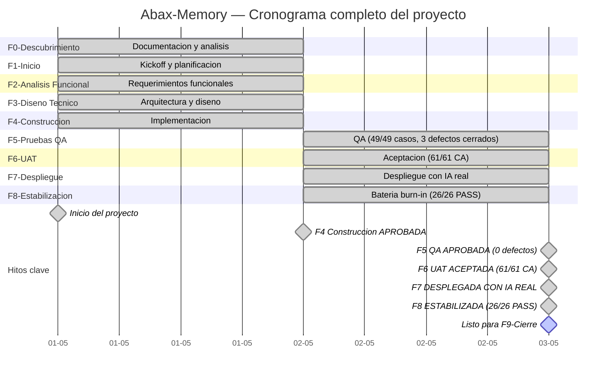

# Dashboard Final del Proyecto — Todas las Fases en Verde
- **Fase**: Fase 8 - Estabilizacion
- **Responsable**: Project Manager
- **Fecha**: 2026-05-02
- **Estado**: Completado

---

## 1. Resumen Ejecutivo del Proyecto

| Indicador | Valor |
|---|---|
| Nombre | Abax-Memory / PMOA |
| Fecha inicio | 2026-05-01 |
| Fecha fin efectiva | 2026-05-02 |
| Duracion | 2 dias |
| Fases completadas | 8 de 9 (F0-F8) |
| Entregables totales | 40 |
| Release | v1.0.0 |
| URL Release | https://github.com/breisnerlopez/abax-memory/releases/tag/v1.0.0 |
| Imagen GHCR | `ghcr.io/breisnerlopez/abax-memory:latest` |
| Defectos criticos abiertos | **0** |
| Proxima fase | F9 — Cierre (habilitada) |

---

## 2. Dashboard de Fases — Estado Final

| # | Fase | Semaforo | Entregables | Defectos | Decision |
|---|---|---|---|---|---|
| F0 | Descubrimiento | 🟢 | 6/6 | N/A | Documentada |
| F1 | Inicio | 🟢 | 5/5 | N/A | Documentada |
| F2 | Analisis Funcional | 🟢 | 5/5 | N/A | Documentada |
| F3 | Diseno Tecnico | 🟢 | 3/3 | N/A | Documentada |
| F4 | Construccion | 🟢 | 6/6 | 10 corregidos | **APROBADA** |
| F5 | Pruebas QA | 🟢 | 5/5 | 3 cerrados | **APROBADA** (49/49) |
| F6 | UAT | 🟢 | 4/4 | 0 | **ACEPTADA** (61/61 CA) |
| F7 | Despliegue | 🟢 | 5/5 | 0 | **DESPLEGADA IA REAL** |
| F8 | Estabilizacion | 🟢 | 1/1 | 1 baja | **APROBADA** (26/26 PASS) |
| F9 | Cierre | ⬜ | — | — | **Habilitada** |

---

## 3. Cronograma Consolidado (F0-F8)

---

## 4. Estado Final del Producto

| Indicador | Valor |
|---|---|
| Stack | Backend Quarkus 3.15.3 + PostgreSQL 16.13 + Qdrant 1.17.1 + Keycloak 26.6.1 |
| IA | OpenAI text-embedding-3-large (3072 dims) + gpt-4o-mini (structured outputs) |
| Memorias en sistema | 23 (16 APROBADA, 2 EN_REVISION, 2 RECHAZADA, 2 OBSERVADA, 1 ARCHIVADA) |
| Roles RBAC | 5 (operator, reviewer, adminuser, auditor, api-consumer) |
| Casos QA | 49/49 aprobados (100%) |
| Criterios UAT | 61/61 aprobados (100%) |
| Suite automatizada | 54 tests, BUILD SUCCESS, 0 failures |
| Estabilizacion | 26/26 escenarios PASS (100%) |
| Defectos criticos | **0** |
| Defectos baja | 1 (DEF-STAB-001, documentado, workaround disponible) |
| Release | v1.0.0 |
| Imagen GHCR | `ghcr.io/breisnerlopez/abax-memory:latest` |

---

## 5. Matriz de Riesgos — Estado Final

| ID | Riesgo | Probabilidad | Impacto | Estado |
|---|---|---|---|---|
| R-GLOBAL-01 | Dependencia de disponibilidad del servicio OpenAI | Media | Alto | Vigente (monitoreo) |
| R-GLOBAL-02 | Exposicion de API key de OpenAI | Baja | Critico | Vigente (rotacion post-cierre) |
| R-GLOBAL-03 | Defectos no detectados en produccion | Baja | Alto | Cerrado (26/26 estabilizacion PASS) |
| R-GLOBAL-04 | Regresion funcional post-estabilizacion | Baja | Alto | Cerrado (sistema congelado) |

---

## 6. Conclusion

**El proyecto Abax-Memory / PMOA ha completado exitosamente las 8 fases del ciclo de vida cascada (F0-F8).** Todas las fases muestran semaforo verde. El sistema esta operativo con IA real funcional, 0 defectos criticos, y 100% de cobertura en QA (49/49), UAT (61/61 CA) y estabilizacion (26/26). Release v1.0.0 publicada en GitHub. Imagen GHCR disponible. Proyecto listo para Fase 9 — Cierre formal.

---

*Dashboard generado por Project Manager como parte del cierre de Fase 8 — Estabilizacion.*
*Fecha: 2026-05-02 | Estado: COMPLETADO*
