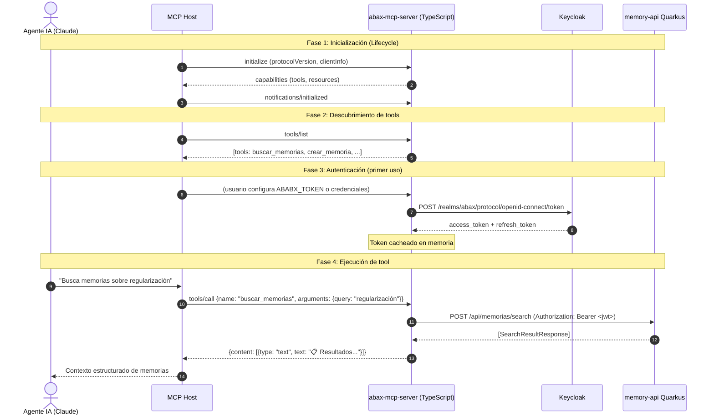
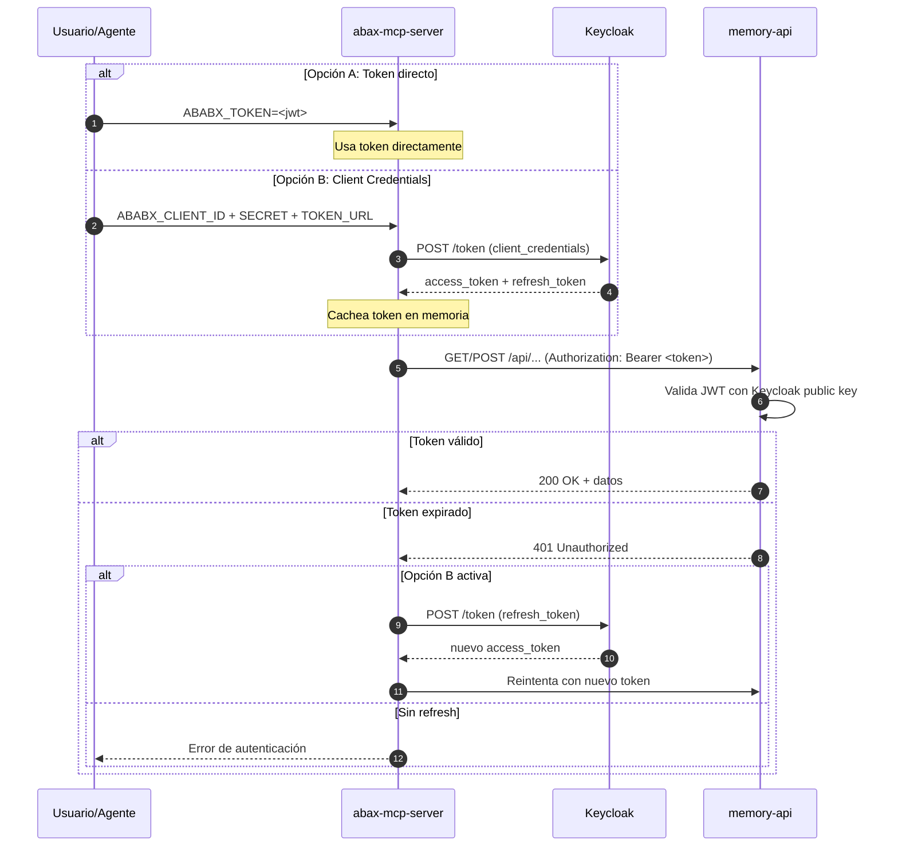
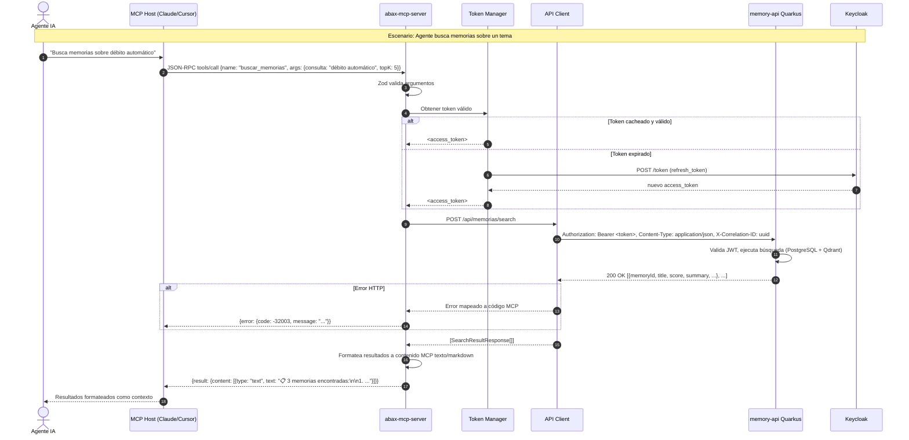

# Diseño del MCP Server para Abax-Memory

- **Fase**: R2 - Diseño
- **Entregable**: Diseño del MCP Server
- **Responsable**: solution-architect
- **Fecha**: 2026-05-02
- **Estado**: Completado
- **Versión**: 1.0.0

---

## 1. Resumen Ejecutivo

Este documento presenta el diseño arquitectónico completo de un **MCP (Model Context Protocol) Server** para **Abax-Memory v1.0.0**. El MCP Server expone las capacidades de memoria operativa del sistema a agentes de IA (Claude, ChatGPT, Cursor, VS Code Copilot) mediante herramientas y recursos estandarizados del protocolo MCP, operando como una **capa de adaptación ligera sobre la REST API existente** sin reemplazar ni modificar el backend Quarkus.

### Objetivos de diseño

| Objetivo | Descripción |
|---|---|
| **Transparencia** | El MCP Server delega toda la lógica de negocio al backend Quarkus existente |
| **Ligereza** | Instalable en segundos vía `npm install -g` o `pip install` |
| **Estándar MCP** | Compatible con cualquier cliente MCP (Claude Desktop, Cursor, VS Code, etc.) |
| **Seguridad** | Autenticación OIDC passthrough — el token JWT del agente se propaga al backend |
| **Extensibilidad** | Nuevas tools se agregan sin modificar el core del servidor |

---

## 2. Decisión Tecnológica: TypeScript vs Python

### 2.1 Matriz de evaluación

| Criterio | Peso | TypeScript (npm) | Python (pip) |
|---|---|---|---|
| Madurez SDK MCP | 25% | **9** (Tier 1, SDK oficial) | **9** (Tier 1, SDK oficial) |
| Facilidad de instalación | 20% | **9** (`npm install -g`) | **8** (`pip install` / `uv tool install`) |
| Ecosistema de validación | 15% | **9** (Zod, JSON Schema nativo) | **7** (Pydantic, jsonschema) |
| Tipado y seguridad | 15% | **9** (TypeScript estricto) | **5** (type hints opcionales) |
| Tamaño de distribución | 10% | **7** (node_modules) | **8** (dependencias más ligeras) |
| Familiaridad en comunidad IA | 10% | **8** (Claude, Cursor usan Node) | **9** (ML/IA tradicional) |
| Performance stdio | 5% | **8** (V8 rápido) | **7** (más overhead) |
| **Total ponderado** | | **8.55** | **7.90** |

### 2.2 Decisión: **TypeScript (npm)**

**Justificación**: TypeScript obtiene un puntaje superior gracias a su ecosistema de validación (Zod), tipado estático que previene errores en las definiciones de tools, y la familiaridad del ecosistema Node.js entre desarrolladores de agentes IA. El SDK MCP de TypeScript es Tier 1 y ofrece la misma calidad que Python. La distribución vía npm permite instalación global con un solo comando y actualización sencilla.

### 2.3 ADR-008: MCP Server implementado en TypeScript con distribución npm

**Estado**: Aceptado
**Fecha**: 2026-05-02

**Contexto**: Se requiere un MCP Server liviano, instalable fácilmente por usuarios de agentes IA, que actúe como capa de adaptación sobre la REST API existente de Abax-Memory.

**Decisión**: Implementar el MCP Server en TypeScript usando el SDK oficial `@modelcontextprotocol/sdk`, distribuido como paquete npm `@abax/mcp-server` con binario CLI `abax-memory`.

**Alternativas consideradas**:
- **Python (FastMCP)**: SDK Tier 1, ecosistema familiar para ML/IA, pero menor tipado estático y validación de esquemas ligeramente menos integrada.
- **Go**: SDK Tier 1, binario estático ideal para distribución, pero menor familiaridad en la comunidad de agentes IA y más verbosidad para definir tools.
- **Java (Spring AI)**: SDK Tier 2, integración natural con el backend Quarkus, pero distribución excesivamente pesada para una herramienta CLI de agente.

**Consecuencias**:
- **Positivas**: Tipado fuerte, Zod para validación, npm global install, ecosistema Node.js familiar para usuarios de Claude Desktop/Cursor/VS Code.
- **Negativas**: Dependencia de Node.js runtime (>=18).
- **Riesgos**: Posible breaking change en SDK MCP; mitigado con versionado semver estricto.

**Participantes**: solution-architect, tech-lead.

---

## 3. Arquitectura del MCP Server

### 3.1 Diagrama de contexto C4 — Nivel 1

```mermaid
C4Context
    title Contexto - Abax-Memory MCP Server

    Person(agente, "Agente IA", "Claude Desktop, Cursor, VS Code Copilot")
    System_Ext(mcp_host, "MCP Host", "Cliente MCP dentro del agente")
    
    System_Boundary(abax_mcp, "Abax-Memory MCP Server") {
        System(mcp_server, "abax-mcp-server", "TypeScript + SDK MCP. Expone tools y resources via stdio/SSE")
    }
    
    System_Boundary(abax_platform, "Abax-Memory Platform") {
        System(api, "memory-api Quarkus", "REST API existente con 16 endpoints")
        SystemDb(pg, "PostgreSQL", "Metadata, auditoría, estados")
        SystemDb(qdrant, "Qdrant", "Índice semántico")
    }
    
    System_Ext(keycloak, "Keycloak", "OIDC/JWT IdP")
    System_Ext(github, "GitHub", "Repositorio Git")

    agente --> mcp_host
    mcp_host <--> mcp_server : "JSON-RPC 2.0 sobre stdio / HTTP+SSE"
    mcp_server --> api : "REST HTTPS + JWT passthrough"
    api --> pg
    api --> qdrant
    api --> keycloak
    api --> github
```

### 3.2 Diagrama de componentes — Nivel 2

```mermaid
C4Container
    title Componentes del MCP Server Abax-Memory

    System_Ext(host, "MCP Host", "Claude Desktop / Cursor / VS Code")
    System_Ext(abax_api, "memory-api Quarkus", "REST API Backend")
    System_Ext(kc, "Keycloak", "OIDC Provider")

    System_Boundary(mcp_boundary, "abax-mcp-server") {
        Container(transport, "Transport Layer", "StdioServerTransport / StreamableHTTP", "Maneja conexión JSON-RPC 2.0 con el MCP Host")
        Container(discovery, "Tool & Resource Registry", "Registro declarativo de tools/resources", "Define inputSchema, descripciones, y mapeo a endpoints REST")
        Container(auth, "Auth Manager", "Token Manager", "Obtiene/refresca JWT de Keycloak y lo inyecta en headers REST")
        Container(http, "HTTP Client", "fetch API + retry", "Llama a la REST API con JWT passthrough")
        Container(formatter, "Response Formatter", "Adaptador de respuestas", "Transforma JSON REST → contenido MCP (text/markdown)")
        
        transport --> discovery
        transport --> auth
        discovery --> http
        http --> formatter
        auth --> kc
        http --> abax_api
    }

    host <--> transport : "JSON-RPC 2.0"
```

### 3.3 Flujo de comunicación: Agente → MCP → REST API



### 3.4 Roles MCP y RBAC mapping

El MCP Server hereda los roles definidos en el backend. El token JWT del usuario contiene los roles asignados en Keycloak:

| Rol Keycloak | Permisos MCP |
|---|---|
| `memory-operator` | Crear, actualizar, buscar, relacionar memorias y casos |
| `memory-reviewer` | Aprobar, revisar memorias |
| `memory-admin` | Archivar, todas las operaciones CRUD |
| `memory-auditor` | Consultar trazabilidad, auditoría |
| `api-consumer` | Buscar y consultar memorias (solo lectura) |

---

## 4. Tools MCP — Catálogo Completo

### 4.1 Mapeo Tool → Endpoint REST

| # | Tool MCP | Método | Endpoint REST | Rol requerido |
|---|---|---|---|---|
| T01 | `buscar_memorias` | POST | `/api/memorias/search` | operator, admin, auditor, api-consumer |
| T02 | `consultar_memoria` | GET | `/api/memorias/{id}` | operator, admin, auditor, api-consumer |
| T03 | `listar_memorias` | GET | `/api/memorias` (query params) | operator, admin, auditor, api-consumer |
| T04 | `crear_memoria` | POST | `/api/memorias` | operator, admin |
| T05 | `crear_memoria_desde_caso` | POST | `/api/memorias/desde-caso` | operator, admin |
| T06 | `actualizar_memoria` | PATCH | `/api/memorias/{id}` | operator, admin |
| T07 | `archivar_memoria` | POST | `/api/memorias/{id}/archivar` | admin |
| T08 | `relacionar_memorias` | POST | `/api/memorias/{id}/relaciones` | operator, admin |
| T09 | `consultar_trazabilidad` | GET | `/api/memorias/{id}/trazabilidad` | operator, admin, auditor, api-consumer |
| T10 | `aprobar_memoria` | POST | `/api/memorias/{id}/aprobar` | reviewer, admin |
| T11 | `revisar_memoria` | POST | `/api/memorias/{id}/revision` | reviewer, admin |
| T12 | `buscar_por_similitud` | POST | `/api/busquedas/semantica` | operator, admin, auditor, api-consumer |
| T13 | `crear_caso` | POST | `/api/casos` | operator, admin |
| T14 | `consultar_caso` | GET | `/api/casos/{id}` | operator, admin, auditor, api-consumer |
| T15 | `cerrar_caso` | POST | `/api/casos/{id}/cerrar` | operator, admin |
| T16 | `consultar_auditoria` | GET | `/api/auditoria/memorias/{id}` | auditor, admin |

### 4.2 Contrato detallado de cada Tool

---

#### T01 — `buscar_memorias`

**Descripción para el agente**:
```
Busca memorias operativas en Abax-Memory usando una consulta en lenguaje natural.
Devuelve las memorias más relevantes con su score de similitud, título, resumen,
estado y metadatos. Útil para encontrar conocimiento operativo antes de crear
nuevas memorias.
```

**Input Schema**:
```json
{
  "type": "object",
  "properties": {
    "consulta": {
      "type": "string",
      "description": "Texto de búsqueda en lenguaje natural. Máximo 500 caracteres. Ej: 'cómo resolver una incidencia de cobranza con débito automático'"
    },
    "topK": {
      "type": "integer",
      "description": "Cantidad máxima de resultados a devolver",
      "default": 5,
      "minimum": 1,
      "maximum": 20
    },
    "dominios": {
      "type": "array",
      "items": { "type": "string" },
      "description": "Filtrar por dominios (ej: ['cobranzas', 'regularizacion'])"
    },
    "estados": {
      "type": "array",
      "items": { "type": "string", "enum": ["BORRADOR", "VALIDADA", "EN_REVISION", "APROBADA", "OBSERVADA", "ARCHIVADA", "RECHAZADA", "DUPLICADA", "ELIMINADA"] },
      "description": "Filtrar por estados de memoria"
    },
    "criticidades": {
      "type": "array",
      "items": { "type": "string", "enum": ["BAJA", "MEDIA", "ALTA", "CRITICA"] },
      "description": "Filtrar por nivel de criticidad"
    },
    "tipos": {
      "type": "array",
      "items": { "type": "string", "enum": ["procedimiento", "runbook", "incidente", "politica", "caso", "guia"] },
      "description": "Filtrar por tipo de memoria"
    },
    "incluirArchivadas": {
      "type": "boolean",
      "description": "Incluir memorias archivadas en los resultados",
      "default": false
    }
  },
  "required": ["consulta"]
}
```

**Endpoint REST**: `POST /api/memorias/search`
**Request body al backend**:
```json
{
  "consulta": "<valor de consulta>",
  "topK": 5,
  "filtros": {
    "domains": ["cobranzas"],
    "states": ["APROBADA"],
    "criticalities": ["ALTA"],
    "types": ["procedimiento"],
    "tags": null,
    "origins": null,
    "includeArchived": false
  }
}
```

**Ejemplo de uso por el agente**:
```
Agente: "Quiero buscar cómo manejar incidencias de cobranza con débito automático"
→ mcp.call("buscar_memorias", { consulta: "incidencia cobranza débito automático", topK: 3, dominios: ["cobranzas"] })
← Resultados con score, título, resumen y metadatos de las 3 memorias más relevantes
```

---

#### T02 — `consultar_memoria`

**Descripción para el agente**:
```
Obtiene el contenido completo de una memoria operativa por su identificador único.
Devuelve título, tipo, criticidad, estado, dominios, etiquetas, contenido Markdown
completo, commit SHA y relaciones con otras memorias.
```

**Input Schema**:
```json
{
  "type": "object",
  "properties": {
    "id": {
      "type": "string",
      "description": "Identificador único de la memoria (UUID). Ej: '550e8400-e29b-41d4-a716-446655440000'"
    }
  },
  "required": ["id"]
}
```

**Endpoint REST**: `GET /api/memorias/{id}`

**Ejemplo de uso**:
```
Agente: "Muéstrame el detalle de la memoria 550e8400-e29b-41d4-a716-446655440000"
→ mcp.call("consultar_memoria", { id: "550e8400-e29b-41d4-a716-446655440000" })
← Contenido Markdown completo, metadatos, estado, relaciones y commit SHA
```

---

#### T03 — `listar_memorias`

**Descripción para el agente**:
```
Lista memorias operativas usando filtros básicos por tipo, estado, origen y dominio.
No realiza búsqueda semántica; usar 'buscar_memorias' para búsquedas por relevancia.
Útil para explorar todas las memorias de un dominio o estado específico.
```

**Input Schema**:
```json
{
  "type": "object",
  "properties": {
    "tipo": {
      "type": "string",
      "enum": ["procedimiento", "runbook", "incidente", "politica", "caso", "guia"],
      "description": "Filtrar por tipo de memoria"
    },
    "estado": {
      "type": "string",
      "enum": ["BORRADOR", "VALIDADA", "EN_REVISION", "APROBADA", "OBSERVADA", "ARCHIVADA", "RECHAZADA", "DUPLICADA", "ELIMINADA"],
      "description": "Filtrar por estado"
    },
    "origen": {
      "type": "string",
      "enum": ["MANUAL", "CASO"],
      "description": "Filtrar por origen de la memoria"
    },
    "dominio": {
      "type": "string",
      "description": "Filtrar por dominio exacto (ej: 'cobranzas')"
    },
    "incluirArchivadas": {
      "type": "boolean",
      "description": "Incluir memorias archivadas en la lista",
      "default": false
    }
  }
}
```

**Endpoint REST**: `GET /api/memorias?type={tipo}&state={estado}&origin={origen}&domain={dominio}&includeArchived={incluirArchivadas}`

---

#### T04 — `crear_memoria`

**Descripción para el agente**:
```
Crea una nueva memoria operativa manual. Requiere título, tipo, criticidad, dominios
y contenido en formato Markdown. La memoria se versiona automáticamente en Git/GitHub.
Si la criticidad es ALTA o CRITICA, la memoria quedará en revisión pendiente de
aprobación humana por PR. Devuelve el ID de la memoria creada y la referencia del commit.
```

**Input Schema**:
```json
{
  "type": "object",
  "properties": {
    "titulo": {
      "type": "string",
      "description": "Título descriptivo de la memoria. Ej: 'Procedimiento de regularización de débito automático'"
    },
    "tipo": {
      "type": "string",
      "enum": ["procedimiento", "runbook", "incidente", "politica", "caso", "guia"],
      "description": "Tipo de memoria según su naturaleza"
    },
    "criticidad": {
      "type": "string",
      "enum": ["BAJA", "MEDIA", "ALTA", "CRITICA"],
      "description": "Nivel de criticidad. ALTA o CRITICA requieren aprobación humana por PR"
    },
    "dominios": {
      "type": "array",
      "items": { "type": "string" },
      "description": "Dominios de negocio a los que pertenece (mínimo 1). Ej: ['cobranzas', 'operaciones']"
    },
    "etiquetas": {
      "type": "array",
      "items": { "type": "string" },
      "description": "Etiquetas para categorización y búsqueda"
    },
    "contenido": {
      "type": "string",
      "description": "Contenido de la memoria en formato Markdown. Debe ser texto Markdown válido con frontmatter"
    },
    "metadatos": {
      "type": "object",
      "additionalProperties": { "type": "string" },
      "description": "Metadatos adicionales como fuente, autor, versión"
    }
  },
  "required": ["titulo", "tipo", "criticidad", "dominios", "contenido"]
}
```

**Endpoint REST**: `POST /api/memorias`
**Request body al backend**:
```json
{
  "title": "<titulo>",
  "type": "<tipo>",
  "criticality": "<criticidad>",
  "domains": ["<dominios>"],
  "tags": ["<etiquetas>"],
  "contenidoMarkdown": "<contenido>",
  "metadata": { "<metadatos>" },
  "frontmatter": {}
}
```

**Ejemplo de uso**:
```
Agente: "Crea una memoria de tipo procedimiento sobre regularización de débito automático, criticidad ALTA, dominio cobranzas"
→ mcp.call("crear_memoria", {
    titulo: "Procedimiento de regularización de débito automático",
    tipo: "procedimiento",
    criticidad: "ALTA",
    dominios: ["cobranzas"],
    etiquetas: ["débito", "regularización", "incidencia"],
    contenido: "# Regularización de Débito Automático\n\n## Pasos\n1. Verificar...",
    metadatos: { fuente: "agente-ia", autor: "claude" }
  })
← { id: "abc-123", state: "EN_REVISION", pullRequestRef: "PR#45", commitSha: "def456..." }
```

---

#### T05 — `crear_memoria_desde_caso`

**Descripción para el agente**:
```
Crea una nueva memoria operativa a partir de un caso existente. La memoria queda
vinculada trazablemente al caso origen. Útil cuando se quiere documentar la
resolución de un caso como memoria reusable.
```

**Input Schema**:
```json
{
  "type": "object",
  "properties": {
    "caseId": {
      "type": "string",
      "description": "Identificador único del caso origen (UUID)"
    },
    "titulo": {
      "type": "string",
      "description": "Título de la memoria resultante"
    },
    "tipo": {
      "type": "string",
      "enum": ["procedimiento", "runbook", "incidente", "politica", "caso", "guia"]
    },
    "criticidad": {
      "type": "string",
      "enum": ["BAJA", "MEDIA", "ALTA", "CRITICA"]
    },
    "dominios": {
      "type": "array",
      "items": { "type": "string" }
    },
    "etiquetas": {
      "type": "array",
      "items": { "type": "string" }
    },
    "metadatos": {
      "type": "object",
      "additionalProperties": { "type": "string" }
    }
  },
  "required": ["caseId", "titulo", "tipo", "criticidad", "dominios"]
}
```

**Endpoint REST**: `POST /api/memorias/desde-caso`

---

#### T06 — `actualizar_memoria`

**Descripción para el agente**:
```
Actualiza el contenido o metadatos de una memoria existente. Solo se modifican los
campos proporcionados (actualización parcial). La actualización genera una nueva
versión en Git si el contenido cambia.
```

**Input Schema**:
```json
{
  "type": "object",
  "properties": {
    "id": {
      "type": "string",
      "description": "Identificador único de la memoria a actualizar"
    },
    "titulo": {
      "type": "string",
      "description": "Nuevo título (opcional)"
    },
    "tipo": {
      "type": "string",
      "enum": ["procedimiento", "runbook", "incidente", "politica", "caso", "guia"]
    },
    "dominios": {
      "type": "array",
      "items": { "type": "string" }
    },
    "etiquetas": {
      "type": "array",
      "items": { "type": "string" }
    },
    "contenido": {
      "type": "string",
      "description": "Nuevo contenido Markdown (opcional)"
    },
    "metadatos": {
      "type": "object",
      "additionalProperties": { "type": "string" }
    }
  },
  "required": ["id"]
}
```

**Endpoint REST**: `PATCH /api/memorias/{id}`

---

#### T07 — `archivar_memoria`

**Descripción para el agente**:
```
Archiva una memoria operativa. La memoria archivada deja de aparecer en búsquedas
y listados por defecto, pero conserva todo su historial de trazabilidad.
Requiere rol de administrador.
```

**Input Schema**:
```json
{
  "type": "object",
  "properties": {
    "id": {
      "type": "string",
      "description": "Identificador de la memoria a archivar"
    },
    "motivo": {
      "type": "string",
      "description": "Razón del archivado (ej: 'obsolescencia funcional', 'reemplazada por MEM-456')"
    }
  },
  "required": ["id", "motivo"]
}
```

**Endpoint REST**: `POST /api/memorias/{id}/archivar`

---

#### T08 — `relacionar_memorias`

**Descripción para el agente**:
```
Crea una relación entre dos memorias operativas. Los tipos de relación soportados
son: RELACIONADA_CON (conexión general), COMPLEMENTA (una complementa a la otra),
REEMPLAZA (una reemplaza a la otra), DEPENDE_DE (una depende de la otra).
Ambas memorias deben existir.
```

**Input Schema**:
```json
{
  "type": "object",
  "properties": {
    "sourceId": {
      "type": "string",
      "description": "Identificador de la memoria origen"
    },
    "targetId": {
      "type": "string",
      "description": "Identificador de la memoria destino con la que se relaciona"
    },
    "tipoRelacion": {
      "type": "string",
      "enum": ["RELACIONADA_CON", "COMPLEMENTA", "REEMPLAZA", "DEPENDE_DE"],
      "description": "Tipo de relación entre las memorias"
    }
  },
  "required": ["sourceId", "targetId", "tipoRelacion"]
}
```

**Endpoint REST**: `POST /api/memorias/{sourceId}/relaciones`

---

#### T09 — `consultar_trazabilidad`

**Descripción para el agente**:
```
Consulta la trazabilidad completa de una memoria: origen, estado actual, versiones,
commits en Git, referencias a Pull Requests, y todos los eventos de auditoría
asociados (creación, actualizaciones, aprobaciones, revisiones, archivado).
```

**Input Schema**:
```json
{
  "type": "object",
  "properties": {
    "id": {
      "type": "string",
      "description": "Identificador único de la memoria"
    }
  },
  "required": ["id"]
}
```

**Endpoint REST**: `GET /api/memorias/{id}/trazabilidad`

---

#### T10 — `aprobar_memoria`

**Descripción para el agente**:
```
Aprueba una memoria que está en estado EN_REVISION (memorias de criticidad ALTA
o CRITICA). La aprobación cambia el estado a APROBADA y dispara la indexación
semántica. Requiere rol de revisor o administrador. Solo usable cuando el PR
en GitHub ya fue mergeado.
```

**Input Schema**:
```json
{
  "type": "object",
  "properties": {
    "id": {
      "type": "string",
      "description": "Identificador de la memoria a aprobar"
    },
    "comentario": {
      "type": "string",
      "description": "Comentario de aprobación (ej: 'Contenido verificado, PR #45 mergeado correctamente')"
    }
  },
  "required": ["id", "comentario"]
}
```

**Endpoint REST**: `POST /api/memorias/{id}/aprobar`

---

#### T11 — `revisar_memoria`

**Descripción para el agente**:
```
Registra una observación o rechazo sobre una memoria en revisión. Decisiones
posibles: OBSERVADA (requiere correcciones) o RECHAZADA (no apta para publicación).
Requiere rol de revisor o administrador.
```

**Input Schema**:
```json
{
  "type": "object",
  "properties": {
    "id": {
      "type": "string",
      "description": "Identificador de la memoria a revisar"
    },
    "decision": {
      "type": "string",
      "enum": ["OBSERVADA", "RECHAZADA"],
      "description": "Decisión de revisión"
    },
    "comentario": {
      "type": "string",
      "description": "Comentario detallado explicando la observación o motivo de rechazo"
    }
  },
  "required": ["id", "decision", "comentario"]
}
```

**Endpoint REST**: `POST /api/memorias/{id}/revision`

---

#### T12 — `buscar_por_similitud`

**Descripción para el agente**:
```
Ejecuta una búsqueda puramente semántica usando embeddings vectoriales (Qdrant).
A diferencia de 'buscar_memorias', este endpoint usa exclusivamente el motor
de búsqueda vectorial con filtros estructurados. Ideal para encontrar memorias
semánticamente similares a un texto dado.
```

**Input Schema**:
```json
{
  "type": "object",
  "properties": {
    "consulta": {
      "type": "string",
      "description": "Texto para la búsqueda semántica vectorial"
    },
    "topK": {
      "type": "integer",
      "default": 10,
      "minimum": 1,
      "maximum": 50
    },
    "dominios": {
      "type": "array",
      "items": { "type": "string" }
    },
    "estados": {
      "type": "array",
      "items": { "type": "string" }
    },
    "criticidades": {
      "type": "array",
      "items": { "type": "string" }
    },
    "tipos": {
      "type": "array",
      "items": { "type": "string" }
    },
    "etiquetas": {
      "type": "array",
      "items": { "type": "string" }
    },
    "incluirArchivadas": {
      "type": "boolean",
      "default": false
    }
  },
  "required": ["consulta"]
}
```

**Endpoint REST**: `POST /api/busquedas/semantica`

---

#### T13 — `crear_caso`

**Descripción para el agente**:
```
Crea un nuevo caso operativo en el sistema. Un caso representa un incidente,
solicitud o contexto que puede originar una memoria operativa.
```

**Input Schema**:
```json
{
  "type": "object",
  "properties": {
    "titulo": {
      "type": "string",
      "description": "Título descriptivo del caso"
    },
    "descripcion": {
      "type": "string",
      "description": "Descripción detallada del caso"
    },
    "origen": {
      "type": "string",
      "description": "Origen del caso (ej: 'operacion', 'incidente', 'solicitud')"
    },
    "prioridad": {
      "type": "string",
      "description": "Prioridad del caso (ej: 'baja', 'media', 'alta', 'critica')"
    },
    "dominio": {
      "type": "string",
      "description": "Dominio principal del caso"
    },
    "criticidad": {
      "type": "string",
      "enum": ["BAJA", "MEDIA", "ALTA", "CRITICA"]
    },
    "etiquetas": {
      "type": "array",
      "items": { "type": "string" }
    },
    "participantes": {
      "type": "array",
      "items": { "type": "string" },
      "description": "Lista de participantes involucrados"
    }
  },
  "required": ["titulo", "descripcion", "origen", "prioridad", "dominio", "criticidad"]
}
```

**Endpoint REST**: `POST /api/casos`

---

#### T14 — `consultar_caso`

**Descripción para el agente**:
```
Consulta el detalle completo de un caso operativo por su identificador único.
Devuelve título, descripción, estado, prioridad, dominio, criticidad, etiquetas
y memoria asociada si existe.
```

**Input Schema**:
```json
{
  "type": "object",
  "properties": {
    "id": {
      "type": "string",
      "description": "Identificador único del caso (UUID)"
    }
  },
  "required": ["id"]
}
```

**Endpoint REST**: `GET /api/casos/{id}`

---

#### T15 — `cerrar_caso`

**Descripción para el agente**:
```
Cierra un caso operativo registrando el resultado. Opcionalmente se puede vincular
el cierre a una memoria creada durante la resolución del caso.
```

**Input Schema**:
```json
{
  "type": "object",
  "properties": {
    "id": {
      "type": "string",
      "description": "Identificador del caso a cerrar"
    },
    "resultado": {
      "type": "string",
      "description": "Resultado operativo del caso (ej: 'Resuelto con memoria MEM-123')"
    },
    "memoryId": {
      "type": "string",
      "description": "Identificador de la memoria creada a partir de este caso (opcional)"
    },
    "observaciones": {
      "type": "string",
      "description": "Observaciones adicionales sobre el cierre"
    }
  },
  "required": ["id", "resultado"]
}
```

**Endpoint REST**: `POST /api/casos/{id}/cerrar`

---

#### T16 — `consultar_auditoria`

**Descripción para el agente**:
```
Consulta los eventos de auditoría registrados para una memoria específica.
Devuelve la lista cronológica de todas las acciones realizadas sobre la memoria:
creación, actualizaciones, validaciones, aprobaciones, revisiones y archivado.
Requiere rol de auditor o administrador.
```

**Input Schema**:
```json
{
  "type": "object",
  "properties": {
    "id": {
      "type": "string",
      "description": "Identificador único de la memoria"
    }
  },
  "required": ["id"]
}
```

**Endpoint REST**: `GET /api/auditoria/memorias/{id}`

---

### 4.3 Resumen de tools por perfil de uso

| Perfil de agente | Tools recomendadas |
|---|---|
| **Agente de soporte** | `buscar_memorias`, `consultar_memoria`, `crear_caso`, `crear_memoria_desde_caso` |
| **Agente de documentación** | `crear_memoria`, `actualizar_memoria`, `listar_memorias`, `relacionar_memorias` |
| **Agente de auditoría** | `consultar_trazabilidad`, `consultar_auditoria`, `listar_memorias` |
| **Agente de gobierno** | `aprobar_memoria`, `revisar_memoria`, `archivar_memoria` |

---

## 5. Resources MCP

### 5.1 Resources definidos

Los resources MCP proporcionan datos de contexto que el agente puede leer sin ejecutar funciones. Son de solo lectura y están siempre disponibles.

| # | Resource URI | Descripción | Tipo MIME |
|---|---|---|---|
| R01 | `abax://dominios` | Lista de dominios de negocio disponibles | `application/json` |
| R02 | `abax://memoria/{id}/contenido` | Contenido Markdown de una memoria específica | `text/markdown` |
| R03 | `abax://memoria/{id}/metadatos` | Metadatos estructurados de una memoria | `application/json` |
| R04 | `abax://estadisticas` | Estadísticas del repositorio (total memorias, por estado, por dominio) | `application/json` |
| R05 | `abax://tipos-memoria` | Catálogo de tipos de memoria soportados | `application/json` |
| R06 | `abax://relaciones/{id}` | Relaciones de una memoria específica | `application/json` |

### 5.2 Detalle de Resources

#### R01 — `abax://dominios`
```json
{
  "uri": "abax://dominios",
  "name": "dominios",
  "title": "Dominios de Negocio",
  "description": "Lista de todos los dominios de negocio disponibles en el repositorio de memoria",
  "mimeType": "application/json"
}
```
**Implementación**: Agrega los dominios desde la respuesta de `GET /api/memorias` (extracción de valores únicos). Como fallback, el MCP Server mantiene una caché local de dominios conocidos.

#### R02 — `abax://memoria/{id}/contenido`
```json
{
  "uriTemplate": "abax://memoria/{id}/contenido",
  "name": "memoria-contenido",
  "title": "Contenido Markdown de Memoria",
  "description": "Contenido completo en Markdown de la memoria identificada por {id}",
  "mimeType": "text/markdown"
}
```

#### R03 — `abax://memoria/{id}/metadatos`
```json
{
  "uriTemplate": "abax://memoria/{id}/metadatos",
  "name": "memoria-metadatos",
  "title": "Metadatos de Memoria",
  "description": "Metadatos estructurados (título, tipo, criticidad, dominios, etiquetas, estado, commit SHA) de la memoria {id}",
  "mimeType": "application/json"
}
```

---

## 6. Prompts MCP (Opcional — Fase 2)

Los prompts son plantillas reutilizables que guían al agente en tareas comunes. Se implementarán en una fase posterior, pero se dejan definidos:

| Prompt | Propósito |
|---|---|
| `documentar-incidente` | Guía al agente para crear una memoria a partir de un incidente |
| `buscar-solucion` | Asiste en la búsqueda de soluciones operativas previas |
| `auditar-memoria` | Flujo guiado para auditar una memoria completa |

---

## 7. Estrategia de Autenticación

### 7.1 Modelo: OIDC Token Passthrough

El MCP Server **no almacena credenciales persistentes**. El flujo de autenticación es:

```
┌──────────────────────────────────────────────────────────────────┐
│                  Flujo de Autenticación MCP                       │
│                                                                   │
│  1. Usuario configura ABABX_TOKEN en variables de entorno         │
│     o en el archivo de configuración del MCP Host                 │
│                                                                   │
│  2. Alternativa: Usuario configura credenciales OIDC:             │
│     ABABX_CLIENT_ID, ABABX_CLIENT_SECRET, ABABX_TOKEN_URL         │
│                                                                   │
│  3. MCP Server, al iniciar:                                       │
│     - Si ABABX_TOKEN existe → lo usa directamente (passthrough)    │
│     - Si credenciales OIDC → obtiene token de Keycloak            │
│       (client_credentials grant) y lo cachea con refresh          │
│                                                                   │
│  4. Cada tool call → Authorization: Bearer <token> → REST API     │
│                                                                   │
│  5. Si 401 → intenta refresh automático del token                 │
│                                                                   │
└──────────────────────────────────────────────────────────────────┘
```

### 7.2 Variables de entorno del MCP Server

| Variable | Requerida | Descripción |
|---|---|---|
| `ABABX_API_URL` | **Sí** | URL base de la REST API (ej: `https://api.abax-memory.com`) |
| `ABABX_TOKEN` | **Condicional** | JWT access token ya obtenido. Si se provee, se usa directamente. |
| `ABABX_CLIENT_ID` | Condicional | Client ID OIDC registrado en Keycloak |
| `ABABX_CLIENT_SECRET` | Condicional | Client Secret OIDC |
| `ABABX_TOKEN_URL` | Condicional | URL del endpoint token de Keycloak (ej: `https://keycloak.abax.com/realms/abax/protocol/openid-connect/token`) |
| `ABABX_DEBUG` | No | Habilita logs detallados en stderr (`true`/`false`) |

### 7.3 Diagrama de secuencia de autenticación



---

## 8. Configuración del Agente MCP

### 8.1 Claude Desktop (`claude_desktop_config.json`)

```json
{
  "mcpServers": {
    "abax-memory": {
      "command": "npx",
      "args": [
        "-y",
        "@abax/mcp-server"
      ],
      "env": {
        "ABABX_API_URL": "https://api.abax-memory.com",
        "ABABX_TOKEN": "eyJhbGciOiJSUzI1NiIsInR5cCI6IkpXVCJ9..."
      }
    }
  }
}
```

**Alternativa con client_credentials**:
```json
{
  "mcpServers": {
    "abax-memory": {
      "command": "npx",
      "args": ["-y", "@abax/mcp-server"],
      "env": {
        "ABABX_API_URL": "https://api.abax-memory.com",
        "ABABX_CLIENT_ID": "abax-mcp-client",
        "ABABX_CLIENT_SECRET": "${ABABX_CLIENT_SECRET}",
        "ABABX_TOKEN_URL": "https://keycloak.abax.com/realms/abax/protocol/openid-connect/token"
      }
    }
  }
}
```

### 8.2 Cursor (`mcp.json` o `.cursor/mcp.json`)

```json
{
  "mcpServers": {
    "abax-memory": {
      "command": "npx",
      "args": ["-y", "@abax/mcp-server"],
      "env": {
        "ABABX_API_URL": "https://api.abax-memory.com",
        "ABABX_TOKEN": "${ABABX_TOKEN}"
      }
    }
  }
}
```

### 8.3 VS Code Copilot

La configuración en VS Code usa el mismo formato que Cursor. Archivo: `.vscode/mcp.json`:

```json
{
  "servers": {
    "abax-memory": {
      "command": "npx",
      "args": ["-y", "@abax/mcp-server"],
      "env": {
        "ABABX_API_URL": "https://api.abax-memory.com",
        "ABABX_CLIENT_ID": "abax-mcp-client",
        "ABABX_CLIENT_SECRET": "${env:ABABX_CLIENT_SECRET}",
        "ABABX_TOKEN_URL": "https://keycloak.abax.com/realms/abax/protocol/openid-connect/token"
      }
    }
  }
}
```

### 8.4 Instalación global alternativa

```bash
# Instalación global (recomendado para uso frecuente)
npm install -g @abax/mcp-server

# Luego en claude_desktop_config.json:
{
  "mcpServers": {
    "abax-memory": {
      "command": "abax-memory",
      "env": {
        "ABABX_API_URL": "https://api.abax-memory.com",
        "ABABX_TOKEN": "eyJ..."
      }
    }
  }
}
```

---

## 9. Estructura del Proyecto MCP

### 9.1 Árbol de directorios

```
abax-mcp-server/
├── package.json
├── tsconfig.json
├── README.md
├── LICENSE
├── .gitignore
├── .npmignore
├── src/
│   ├── index.ts                  # Punto de entrada: inicializa el servidor
│   ├── server.ts                 # Configuración del McpServer y registro de tools/resources
│   ├── config.ts                 # Lectura de variables de entorno y validación
│   ├── auth/
│   │   ├── token-manager.ts      # Obtención, cache y refresh de JWT
│   │   └── token-manager.test.ts
│   ├── client/
│   │   ├── api-client.ts         # HTTP client con retry, JWT injection y error handling
│   │   └── api-client.test.ts
│   ├── tools/
│   │   ├── registry.ts           # Registro central de todas las tools
│   │   ├── memory-tools.ts       # Tools T01-T11 (memorias)
│   │   ├── case-tools.ts         # Tools T13-T15 (casos)
│   │   ├── audit-tools.ts        # Tools T12, T16 (búsqueda semántica y auditoría)
│   │   └── schemas.ts            # Schemas Zod compartidos
│   ├── resources/
│   │   ├── registry.ts           # Registro de resources
│   │   └── memory-resources.ts   # Resources R01-R06
│   ├── prompts/
│   │   └── registry.ts           # (Fase 2) Registro de prompts
│   └── utils/
│       ├── formatter.ts          # Formateo de respuestas REST → contenido MCP
│       ├── logger.ts             # Logger a stderr (nunca stdout)
│       └── errors.ts             # Manejo de errores estandarizado
├── tests/
│   └── integration/
│       └── mcp-e2e.test.ts       # Pruebas end-to-end con un MCP client
└── scripts/
    └── build.sh                  # Build y empaquetado
```

### 9.2 `package.json`

```json
{
  "name": "@abax/mcp-server",
  "version": "1.0.0",
  "description": "MCP Server para Abax-Memory — Memoria operativa para agentes de IA",
  "license": "MIT",
  "type": "module",
  "bin": {
    "abax-memory": "./build/index.js"
  },
  "main": "./build/index.js",
  "files": [
    "build",
    "README.md"
  ],
  "scripts": {
    "build": "tsc && chmod 755 build/index.js",
    "start": "node build/index.js",
    "dev": "tsx src/index.ts",
    "test": "vitest run",
    "test:watch": "vitest",
    "lint": "eslint src/",
    "prepublishOnly": "npm run build"
  },
  "dependencies": {
    "@modelcontextprotocol/sdk": "^1.2.0",
    "zod": "^3.23.0"
  },
  "devDependencies": {
    "@types/node": "^22.0.0",
    "typescript": "^5.7.0",
    "tsx": "^4.19.0",
    "vitest": "^3.0.0",
    "eslint": "^9.0.0",
    "@typescript-eslint/eslint-plugin": "^8.0.0",
    "@typescript-eslint/parser": "^8.0.0"
  },
  "engines": {
    "node": ">=18.0.0"
  },
  "keywords": [
    "mcp",
    "model-context-protocol",
    "abax",
    "memory",
    "ai-agent",
    "claude",
    "cursor"
  ],
  "repository": {
    "type": "git",
    "url": "https://github.com/abax/abax-mcp-server"
  }
}
```

### 9.3 `tsconfig.json`

```json
{
  "compilerOptions": {
    "target": "ES2022",
    "module": "Node16",
    "moduleResolution": "Node16",
    "outDir": "./build",
    "rootDir": "./src",
    "strict": true,
    "esModuleInterop": true,
    "skipLibCheck": true,
    "forceConsistentCasingInFileNames": true,
    "declaration": true,
    "declarationMap": true,
    "sourceMap": true,
    "resolveJsonModule": true
  },
  "include": ["src/**/*"],
  "exclude": ["node_modules", "build", "tests"]
}
```

### 9.4 Dependencias clave

| Dependencia | Versión | Propósito |
|---|---|---|
| `@modelcontextprotocol/sdk` | `^1.2.0` | SDK oficial MCP (Tier 1) — McpServer, StdioServerTransport, tipos |
| `zod` | `^3.23.0` | Validación de esquemas para inputSchema de tools |

**Dependencias cero adicionales**: El MCP Server usa exclusivamente `fetch` nativo de Node.js 18+ para llamadas HTTP (sin axios, got, etc.), minimizando el tamaño y la superficie de vulnerabilidades.

---

## 10. ADRs Específicos del MCP Server

### ADR-008: TypeScript como lenguaje del MCP Server
*(Documentado en la sección 2.3)*

### ADR-009: Transporte stdio como default, HTTP+SSE como opcional

**Estado**: Aceptado
**Fecha**: 2026-05-02

**Contexto**: MCP soporta stdio (local) y Streamable HTTP (remoto). Para un MCP Server que es una capa de adaptación sobre una REST API, ambos transportes son viables.

**Decisión**: El transporte default del servidor es **stdio**, alineado con el patrón estándar de los MCP servers locales (Claude Desktop, Cursor, VS Code). Se incluye soporte experimental para **Streamable HTTP + SSE** como opción de configuración para entornos serverless o remotos.

**Alternativas consideradas**:
- **Solo stdio**: Más simple, pero limita casos de uso remotos.
- **Solo HTTP/SSE**: Requiere infraestructura de servidor, más complejo para el usuario final.
- **Ambos (decisión)**: stdio para el caso de uso principal, HTTP/SSE como opción avanzada.

**Consecuencias**:
- **Positivas**: Compatible con todos los clientes MCP existentes. El usuario no necesita exponer un endpoint HTTP.
- **Negativas**: Se requiere Node.js en la máquina del agente.
- **Riesgos**: La implementación HTTP/SSE podría requerir ajustes para entornos serverless.

**Participantes**: solution-architect, tech-lead.

### ADR-010: Zero dependencias HTTP — fetch nativo de Node.js

**Estado**: Aceptado
**Fecha**: 2026-05-02

**Contexto**: El MCP Server necesita realizar llamadas HTTP a la REST API del backend. Existen múltiples librerías (axios, got, node-fetch, undici).

**Decisión**: Usar exclusivamente `fetch` nativo de Node.js 18+ (basado en undici) para todas las llamadas HTTP. Sin dependencias externas de HTTP client.

**Justificación**: Node.js 18+ incluye `fetch` como API estable. Eliminar dependencias reduce el tamaño del paquete, la superficie de vulnerabilidades y el tiempo de instalación.

**Consecuencias**:
- **Positivas**: Menor tamaño de bundle, menos dependencias, API estándar web.
- **Negativas**: Sin interceptores declarativos; se implementan manualmente (retry, auth header injection).
- **Riesgos**: Comportamiento sutilmente diferente en versiones muy antiguas de Node.js.

**Participantes**: solution-architect, developer-backend.

### ADR-011: Zod como validador de inputSchema

**Estado**: Aceptado
**Fecha**: 2026-05-02

**Contexto**: Cada tool MCP requiere un `inputSchema` en formato JSON Schema. Se necesita generar estos esquemas de forma type-safe.

**Decisión**: Usar **Zod** como librería de validación de esquemas. Los schemas Zod se compilan a JSON Schema para el inputSchema de MCP y también validan los argumentos en runtime.

**Alternativas consideradas**:
- **JSON Schema manual**: Propenso a errores, sin type safety.
- **TypeBox**: Alternativa válida, pero Zod tiene mayor adopción en el ecosistema TypeScript.
- **Joi**: Más pesado, orientado a Node.js tradicional.

**Consecuencias**:
- **Positivas**: Type safety extremo a extremo, validación automática de argumentos, generación automática de JSON Schema.
- **Negativas**: Una dependencia adicional (~12KB minificada).
- **Riesgos**: Zod podría romper compatibilidad en major versions.

**Participantes**: solution-architect, tech-lead.

---

## 11. Manejo de Errores

### 11.1 Estrategia de errores

Toda respuesta de error del backend REST se traduce a un error MCP estandarizado:

| Código HTTP Backend | Tipo de error MCP | Mensaje para el agente |
|---|---|---|
| `400 Bad Request` | `-32602 Invalid params` | "Parámetros inválidos: {detalle del backend}" |
| `401 Unauthorized` | `-32001 Authentication error` | "Token inválido o expirado. Verifica ABABX_TOKEN o credenciales OIDC." |
| `403 Forbidden` | `-32002 Authorization error` | "No tienes permisos para esta operación. Rol requerido: {rol}" |
| `404 Not Found` | `-32003 Resource not found` | "La {entidad} con ID {id} no existe." |
| `409 Conflict` | `-32004 Conflict` | "Conflicto: {detalle del backend}" |
| `422 Unprocessable` | `-32602 Invalid params` | "Error de validación: {detalle del backend}" |
| `500/502/503` | `-32000 Server error` | "Error interno del servidor Abax-Memory. Intenta nuevamente." |
| `Timeout (>10s)` | `-32000 Server error` | "Timeout: el servidor Abax-Memory no respondió a tiempo." |

### 11.2 Retry automático

El HTTP client implementa retry con backoff exponencial para errores transitorios:

```
- Máximo 3 reintentos
- Backoff: 1s → 2s → 4s
- Solo para 5xx y timeouts (no para 4xx)
- Jitter aleatorio (±10%) para evitar thundering herd
```

---

## 12. Observabilidad

### 12.1 Logging

Todo el logging del MCP Server se emite a **stderr** para no interferir con el transporte stdio:

```typescript
// ✅ Correcto: stderr
console.error("[abax-mcp] Inicializando servidor...");
console.error(`[abax-mcp] Conectado a ${apiUrl}`);

// ❌ Incorrecto: stdout — rompe el protocolo JSON-RPC
console.log("Servidor iniciado");
```

### 12.2 Trazas

Cada tool call propaga un `correlationId` único al backend vía header HTTP:

```
X-Correlation-ID: abax-mcp-{uuid}
```

Esto permite correlacionar las requests del agente con los logs del backend Quarkus.

### 12.3 Debug mode

Con `ABABX_DEBUG=true`, el MCP Server emite logs detallados:

```
[abax-mcp:debug] tools/list → 3 tools registradas
[abax-mcp:debug] tools/call buscar_memorias → POST /api/memorias/search (245ms)
[abax-mcp:debug] auth → token expira en 287s, sin refresh necesario
```

---

## 13. Seguridad

### 13.1 Controles

| Control | Implementación |
|---|---|
| **Token en variables de entorno** | Nunca se loguea ni expone en respuestas MCP |
| **Validación de entrada** | Zod valida todos los argumentos antes de enviar al backend |
| **HTTPS obligatorio** | El HTTP client rechaza URLs `http://` (solo `https://` en producción) |
| **Sanitización de outputs** | Las respuestas del backend se escapan antes de formatear como contenido MCP |
| **Sin almacenamiento persistente** | Los tokens solo residen en memoria del proceso |
| **Rate limiting** | Se respetan los headers `Retry-After` del backend |

### 13.2 Recomendaciones para el usuario

1. **Nunca** incluir `ABABX_CLIENT_SECRET` en archivos de configuración compartidos
2. Usar variables de entorno del sistema para secretos
3. Rotar el client secret periódicamente en Keycloak
4. Usar tokens con el scope mínimo necesario para el rol del agente

---

## 14. Plan de Implementación

### 14.1 Fases

| Fase | Descripción | Entregables |
|---|---|---|
| **Fase 1: Core** | Estructura del proyecto, transporte stdio, auth manager, HTTP client | Servidor funcional con 2-3 tools de prueba |
| **Fase 2: Tools completas** | Implementación de las 16 tools MCP | Catálogo completo de tools mapeadas a endpoints REST |
| **Fase 3: Resources** | Implementación de resources R01-R06 | Resources funcionales con templates |
| **Fase 4: Testing** | Tests unitarios, integración, e2e con MCP Inspector | Cobertura > 80%, pruebas con Claude Desktop |
| **Fase 5: Publicación** | npm publish, documentación, ejemplos de configuración | Paquete `@abax/mcp-server` en npm registry |

### 14.2 Estimación de esfuerzo

| Componente | Complejidad | Esfuerzo estimado |
|---|---|---|
| Configuración del proyecto (package.json, tsconfig, estructura) | Baja | 0.5 día |
| Auth Manager (token, refresh, client_credentials) | Media | 1.5 días |
| HTTP Client (fetch, retry, error mapping) | Media | 1.5 días |
| Tools registry + 16 implementaciones | Media-Alta | 3 días |
| Resources (6 recursos) | Baja-Media | 1 día |
| Formateo de respuestas | Baja | 0.5 día |
| Tests (unitarios + integración) | Media | 2 días |
| Documentación y ejemplos | Baja | 1 día |
| **Total estimado** | | **11 días** |

---

## 15. Riesgos Técnicos

| Riesgo | Impacto | Probabilidad | Mitigación |
|---|---|---|---|
| Cambio de API REST (breaking change) | Alto | Baja | Versionado semántico del MCP Server alineado a la API |
| SDK MCP inestable (cambios en beta) | Medio | Media | Fijar versión exacta en package.json, pruebas de regresión |
| Latencia adicional por capa MCP | Bajo | Media | HTTP/2 keep-alive, conexión persistente |
| Token refresh race condition | Medio | Baja | Mutex en token manager para evitar refresh concurrente |
| Incompatibilidad con cliente MCP específico | Medio | Media | Test suite con MCP Inspector + múltiples clientes |

---

## 16. Matriz de Complejidad Técnica

| Componente | Complejidad | Riesgo | Dependencias |
|---|---|---|---|
| `server.ts` (inicialización) | Baja | Bajo | `@modelcontextprotocol/sdk` |
| `token-manager.ts` | Media | Medio | fetch nativo, Keycloak OIDC |
| `api-client.ts` | Media | Medio | fetch nativo |
| `memory-tools.ts` (11 tools) | Alta | Medio | `api-client`, `schemas.ts`, `formatter.ts` |
| `case-tools.ts` (3 tools) | Media | Bajo | `api-client`, `schemas.ts` |
| `audit-tools.ts` (2 tools) | Baja-Media | Bajo | `api-client`, `schemas.ts` |
| `memory-resources.ts` | Baja-Media | Bajo | `api-client` |
| `formatter.ts` | Baja | Bajo | Ninguna |
| `schemas.ts` (Zod) | Media | Bajo | `zod` |

---

## 17. Diagrama de Secuencia — Tool Call Completo



---

## 18. Ejemplo de Flujo de Trabajo con Agente

### Escenario: Agente de soporte resuelve una incidencia

```
Usuario: "Tenemos un problema con débito automático en cobranzas, necesito saber cómo resolverlo"

Agente (Claude + Abax MCP):
  1. [tool call: buscar_memorias] 
     → Busca "débito automático incidencia cobranzas", dominio "cobranzas"
     → Encuentra 2 memorias relevantes: "Procedimiento de reversión de débito" (92%) 
       y "Runbook de incidencias de cobranza" (85%)
  
  2. [tool call: consultar_memoria]
     → Lee el contenido completo del "Runbook de incidencias de cobranza"
     → Identifica que la incidencia coincide con el escenario "Débito duplicado"
  
  3. [tool call: crear_caso]
     → Crea un caso: "Incidencia de débito automático duplicado - 2026-05-02"
  
  4. [tool call: crear_memoria_desde_caso]
     → Documenta la resolución como nueva memoria vinculada al caso
  
  5. [Respuesta al usuario]
     → "He analizado el problema usando el runbook de incidencias de cobranza. 
        El escenario coincide con 'Débito duplicado'. He creado el caso CASO-789 
        y documentado la resolución. Los pasos a seguir son: ..."
```

---

## 19. Apéndice: Código de Referencia

### 19.1 Punto de entrada (`src/index.ts`)

```typescript
#!/usr/bin/env node
import { createServer } from './server.js';
import { loadConfig } from './config.js';
import { logger } from './utils/logger.js';

async function main() {
  try {
    const config = loadConfig();
    logger.info(`Abax-Memory MCP Server v${config.version}`);
    logger.info(`API URL: ${config.apiUrl}`);
    
    const server = await createServer(config);
    logger.info('Server ready. Waiting for MCP client connection...');
    
    // Mantener proceso vivo
    process.on('SIGINT', async () => {
      logger.info('Shutting down...');
      await server.close();
      process.exit(0);
    });
  } catch (error) {
    logger.error('Fatal error:', error);
    process.exit(1);
  }
}

main();
```

### 19.2 Registro de una tool (`src/tools/memory-tools.ts` — extracto)

```typescript
import { z } from 'zod';
import type { McpServer } from '@modelcontextprotocol/sdk/server/mcp.js';

export function registerMemoryTools(server: McpServer, apiClient: ApiClient) {
  
  server.registerTool(
    'buscar_memorias',
    {
      title: 'Buscar Memorias Operativas',
      description: `Busca memorias operativas en Abax-Memory usando una consulta en lenguaje natural.
Devuelve las memorias más relevantes con su score de similitud, título, resumen, estado y metadatos.`,
      inputSchema: {
        consulta: z.string()
          .min(1)
          .max(500)
          .describe('Texto de búsqueda en lenguaje natural'),
        topK: z.number()
          .int()
          .min(1)
          .max(20)
          .default(5)
          .describe('Cantidad máxima de resultados'),
        dominios: z.array(z.string())
          .optional()
          .describe('Filtrar por dominios'),
        estados: z.array(z.enum([
          'BORRADOR', 'VALIDADA', 'EN_REVISION', 'APROBADA',
          'OBSERVADA', 'ARCHIVADA', 'RECHAZADA', 'DUPLICADA', 'ELIMINADA'
        ])).optional(),
        criticidades: z.array(z.enum(['BAJA', 'MEDIA', 'ALTA', 'CRITICA']))
          .optional(),
        tipos: z.array(z.enum([
          'procedimiento', 'runbook', 'incidente', 'politica', 'caso', 'guia'
        ])).optional(),
        incluirArchivadas: z.boolean().default(false)
          .describe('Incluir memorias archivadas en resultados'),
      },
    },
    async (args) => {
      const result = await apiClient.post('/api/memorias/search', {
        consulta: args.consulta,
        topK: args.topK,
        filtros: {
          domains: args.dominios ?? null,
          states: args.estados ?? null,
          criticalities: args.criticidades ?? null,
          types: args.tipos ?? null,
          includeArchived: args.incluirArchivadas,
        },
      });

      return {
        content: [{
          type: 'text' as const,
          text: formatSearchResults(result),
        }],
      };
    }
  );
}
```

---

## 20. Resumen Final

El MCP Server para Abax-Memory cumple todos los requisitos planteados:

| Requisito | Cumplimiento |
|---|---|
| Capa SOBRE REST API existente | ✅ Delega toda lógica al backend Quarkus |
| Tools y Resources MCP estándar | ✅ 16 tools + 6 resources |
| Autenticación OIDC Keycloak | ✅ Token passthrough + client_credentials flow |
| Tecnología sugerida (TypeScript/Python) | ✅ TypeScript con justificación documentada |
| Liviano, instalable | ✅ `npx -y @abax/mcp-server` o `npm install -g` |
| Compatible con clientes MCP | ✅ Claude Desktop, Cursor, VS Code, MCP Inspector |
| 6-8+ tools | ✅ 16 tools documentadas |
| Documentación completa | ✅ Contratos, ejemplos, configs, diagramas |

---

*Documento generado por solution-architect. Fase R2-Diseño, 2026-05-02.*
