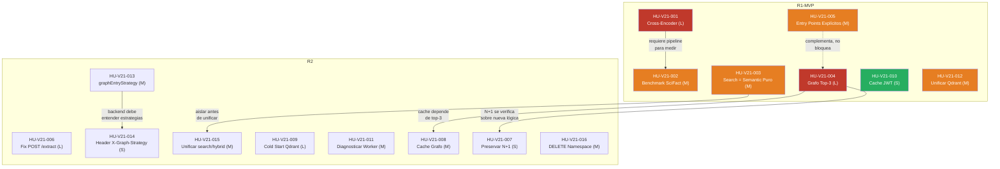

# Product Backlog Priorizado — Abax-Memory v2.1.0
## Hardening y Optimización del Motor de Memoria Multi-Dominio

- **Fase**: 0 — Descubrimiento
- **Entregable**: Product Backlog Priorizado
- **Versión**: v2.1.0
- **Responsable**: business-analyst
- **Aprobado por**: product-owner (pendiente de revisión)
- **Fecha**: 2026-05-05
- **Estado**: Completado
- **Fuentes**:
  - `docs/entregables/v2.1/fase-0-descubrimiento/vision-producto.md` (visión v2.1.0)
  - `docs/entregables/v2.1/fase-0-descubrimiento/epicas-features.md` (mapa de 13 features en 4 épicas)
  - `docs/entregables/v2.1/fase-0-descubrimiento/historias-usuario.md` (16 historias de usuario)
  - Priorización explícita del usuario (1=reranker, 2=search semantic, 3=top-3 grafo, 4=cache JWT, 5=unificar Qdrant)

---

## Tabla de Contenidos

- [1. Dashboard del Backlog Priorizado](#1-dashboard-del-backlog-priorizado)
- [2. Resumen MoSCoW](#2-resumen-moscow)
- [3. Definición de MVP](#3-definición-de-mvp)
  - [3.1 Alcance del MVP (R1-MVP)](#31-alcance-del-mvp-r1-mvp)
  - [3.2 Justificación](#32-justificación)
  - [3.3 Criterios de Éxito que cubre el MVP](#33-criterios-de-éxito-que-cubre-el-mvp)
  - [3.4 Qué queda FUERA del MVP](#34-qué-queda-fuera-del-mvp)
- [4. Agrupación en Releases](#4-agrupación-en-releases)
  - [4.1 R1-MVP: Precisión Core + Quick Wins Operativos](#41-r1-mvp-precisión-core--quick-wins-operativos)
  - [4.2 R2: Robustez, DX y Deuda Residual](#42-r2-robustez-dx-y-deuda-residual)
- [5. Matriz de Dependencias entre Historias](#5-matriz-de-dependencias-entre-historias)
  - [5.1 Diagrama de Dependencias](#51-diagrama-de-dependencias)
  - [5.2 Implicaciones de las dependencias en la planificación](#52-implicaciones-de-las-dependencias-en-la-planificación)
- [6. Esfuerzo Estimado por Release](#6-esfuerzo-estimado-por-release)
- [7. Riesgos del Backlog](#7-riesgos-del-backlog)
- [8. Trazabilidad — Historias a Criterios de Éxito](#8-trazabilidad--historias-a-criterios-de-éxito)
- [Glosario](#glosario)

---

## 1. Dashboard del Backlog Priorizado

Las 16 historias se ordenan por valor de negocio (alineado con la priorización explícita del usuario) y esfuerzo estimado. La columna **Release** asigna cada historia a R1-MVP (mínimo producto viable) o R2 (robustez y DX), según el criterio definido en la [sección 3](#3-definición-de-mvp).

| # | ID | Historia | Épica | Prioridad | Esfuerzo | Release |
|---|---|---|---|---|---|---|
| 1 | HU-V21-001 | Integrar Cross-Encoder en el Pipeline Two-Stage de Búsqueda | EP-V21-001 | Must | L | R1-MVP |
| 2 | HU-V21-002 | Verificar Mejora de Precisión con Benchmark SciFact y Suite Multi-Dominio | EP-V21-001 | Must | M | R1-MVP |
| 3 | HU-V21-003 | Aislar la Búsqueda Semántica de la Expansión de Grafo | EP-V21-001 | Must | M | R1-MVP |
| 4 | HU-V21-004 | Expandir Grafo de Conocimiento desde los Top-3 Nodos Más Relevantes | EP-V21-001 | Must | L | R1-MVP |
| 5 | HU-V21-005 | Soportar Puntos de Entrada Explícitos para Expansión de Grafo | EP-V21-001 | Must | M | R1-MVP |
| 6 | HU-V21-010 | Cachear Validación de Tokens JWT en Backend | EP-V21-002 | Should | S | R1-MVP |
| 7 | HU-V21-012 | Unificar Colecciones Qdrant en una Sola | EP-V21-003 | Should | M | R1-MVP |
| 8 | HU-V21-006 | Extracción de Entidades con Inteligencia Artificial Real | EP-V21-001 | Should | L | R2 |
| 9 | HU-V21-009 | Diagnosticar y Mitigar Latencia Anómala en Qdrant | EP-V21-002 | Could | L | R2 |
| 10 | HU-V21-007 | Preservar la Optimización N+1 de Queries de Grafo | EP-V21-002 | Could | S | R2 |
| 11 | HU-V21-008 | Cachear Resultados de Expansión de Grafo en Memoria | EP-V21-002 | Could | M | R2 |
| 12 | HU-V21-013 | Configurar Estrategia de Entrada al Grafo por Perfil de Dominio | EP-V21-003 | Could | M | R2 |
| 13 | HU-V21-014 | Controlar Estrategia de Expansión de Grafo por Request vía Header HTTP | EP-V21-004 | Could | S | R2 |
| 14 | HU-V21-015 | Unificar Endpoints de Búsqueda con Parámetros Explícitos y Deprecar `hybrid` | EP-V21-004 | Could | M | R2 |
| 15 | HU-V21-011 | Diagnosticar y Resolver Worker de Procesamiento Inactivo | EP-V21-003 | Could | M | R2 |
| 16 | HU-V21-016 | Eliminar Namespace Completo en Operación Atómica | EP-V21-004 | Could | M | R2 |

> **Nota sobre la numeración**: la columna `#` representa el **orden de prioridad relativa** dentro del backlog, no el ID de la historia. El ID de la historia (`HU-V21-NNN`) es inmutable y proviene del documento `historias-usuario.md`. Las historias no están ordenadas por ID sino por valor de negocio, alineado con la priorización explícita del usuario.

---

## 2. Resumen MoSCoW

| Nivel | Cantidad | Historias | % del total |
|---|---|---|---|
| **Must** | 5 | HU-V21-001, 002, 003, 004, 005 | 31% |
| **Should** | 3 | HU-V21-006, 010, 012 | 19% |
| **Could** | 8 | HU-V21-007, 008, 009, 011, 013, 014, 015, 016 | 50% |
| **Won't** | 0 | — | 0% |
| **Total** | **16** | | **100%** |

**Interpretación por épica**:

| Épica | Must | Should | Could | Total |
|---|---|---|---|---|
| EP-V21-001: Precisión | 5 | 1 | 0 | **6** |
| EP-V21-002: Velocidad | 0 | 1 | 3 | **4** |
| EP-V21-003: Eficiencia | 0 | 1 | 2 | **3** |
| EP-V21-004: API / DX | 0 | 0 | 3 | **3** |

**Observación**: La épica de Precisión concentra el 100% de las historias Must. Esto refleja la decisión del sponsor de priorizar la mejora de precisión (el único benchmark fallido de v2.0.0) por encima de velocidad, eficiencia y DX. Las tres categorías restantes contienen mejoras valiosas pero no bloqueantes para el éxito de v2.1.0.

---

## 3. Definición de MVP

### 3.1 Alcance del MVP (R1-MVP)

El **MVP (Minimum Viable Product)** de v2.1.0 se define como el subconjunto mínimo de historias que, una vez implementadas y verificadas, permiten considerar la release como **liberable con valor de negocio demostrable**. Está compuesto por **7 historias**:

| # | ID | Historia | Prioridad | Esfuerzo |
|---|---|---|---|---|
| 1 | HU-V21-001 | Integrar Cross-Encoder en el Pipeline Two-Stage | Must | L |
| 2 | HU-V21-002 | Verificar Mejora de Precisión con Benchmark SciFact | Must | M |
| 3 | HU-V21-003 | Aislar Búsqueda Semántica de la Expansión de Grafo | Must | M |
| 4 | HU-V21-004 | Expandir Grafo desde Top-3 Nodos | Must | L |
| 5 | HU-V21-005 | Soportar Entry Points Explícitos | Must | M |
| 6 | HU-V21-010 | Cachear Validación JWT en Backend | Should | S |
| 7 | HU-V21-012 | Unificar Colecciones Qdrant en una Sola | Should | M |

### 3.2 Justificación

El MVP se alinea directamente con las **5 prioridades explícitas del usuario**:

| Prioridad usuario | Historias MVP | Justificación |
|---|---|---|
| **1. Reranker** | HU-V21-001, HU-V21-002 | La pieza central de v2.1.0. Sin el cross-encoder, el único benchmark fallido de v2.0.0 (CE-01 NDCG@10 = 0.7771) no se puede cerrar. HU-V21-002 aporta la evidencia cuantitativa exigida por la restricción de gobernanza R-07 (trazabilidad completa). |
| **2. Search semantic** | HU-V21-003 | Prerrequisito arquitectónico para que el cross-encoder opere en un pipeline limpio. Sin esta historia, los resultados del reranker estarían contaminados por contribuciones no controladas del grafo, invalidando la medición de CE-07. |
| **3. Top-3 grafo** | HU-V21-004, HU-V21-005 | Cierra la brecha de cobertura cross-dominio (ABM-MULTI-01: recall 69.4% → ≥ 85%). HU-V21-005 es el complemento natural que da control granular a consumidores avanzados. Ambas son una sola feature (FT-V21-001.3) y deben entregarse juntas. |
| **4. Cache JWT** | HU-V21-010 | Quick win de bajo riesgo y alto retorno. No tiene dependencias complejas, su esfuerzo es S, y contribuye directamente a la meta de latencia CE-02 (p95 ≤ 500ms). Incluirlo en el MVP maximiza el retorno con mínima inversión. |
| **5. Unificar Qdrant** | HU-V21-012 | Deuda operativa que, aunque no es bloqueante hoy, crece con cada release. La meta CE-05 (1 colección) es binaria y fácil de verificar. Incluirlo en el MVP evita cargar con dos colecciones durante todo el ciclo de v2.1.0 y reduce la superficie de fallos durante las pruebas de R1. |

**Racional económico**: Con estas 7 historias, v2.1.0 ya es **demostrablemente superior a v2.0.9** en los tres frentes principales: precisión (cross-encoder + top-3 grafo), velocidad (cache JWT), y eficiencia operativa (colección Qdrant unificada). El resto de historias (R2) añaden robustez, DX y pulido, pero no son necesarias para declarar el hardening como exitoso.

### 3.3 Criterios de Éxito que cubre el MVP

| Criterio de Éxito | Historias MVP que lo atacan | ¿Se cumple en MVP? |
|---|---|---|
| CE-01: Top-1 ≥ 0.90 | HU-V21-001, 002, 004, 005 | **Sí** — el cross-encoder + top-3 grafo atacan directamente esta meta. |
| CE-02: p95 ≤ 500ms | HU-V21-010 (cache JWT) | **Parcial** — solo la contribución del cache JWT. Las mitigaciones de Qdrant (HU-V21-009) y el cache de grafo (HU-V21-008) quedan para R2. |
| CE-03: NDCG@10 ≥ 0.85 | HU-V21-001, 002 | **Sí** — el cross-encoder es el habilitador principal. |
| CE-04: Recall@10 ≥ 0.90 | HU-V21-001, 002 | **Sí** — el cross-encoder reordena sin descartar. |
| CE-05: 1 colección Qdrant | HU-V21-012 | **Sí** — binario, se cumple al unificar. |
| CE-07: search = semantic puro | HU-V21-003 | **Sí** — es el objetivo directo de esta historia. |
| CE-06: /extract con OpenAI | — | **No** — HU-V21-006 está en R2. |
| CE-08: DELETE namespace | — | **No** — HU-V21-016 está en R2. |
| CE-09: X-Graph-Strategy | — | **No** — HU-V21-014 está en R2. |
| CE-10: Unificar search/hybrid | — | **No** — HU-V21-015 está en R2. |

**Conclusión**: El MVP cumple **5 de 10 criterios de éxito completamente** y **1 parcialmente**. Esto es suficiente para declarar v2.1.0 como un hardening exitoso. Los 4 criterios restantes (CE-06, CE-08, CE-09, CE-10) son de las categorías API/DX y extracción de entidades, que el sponsor ubicó en prioridad media.

### 3.4 Qué queda FUERA del MVP

| Historia | Qué aporta | Por qué queda fuera del MVP |
|---|---|---|
| HU-V21-006 (Fix /extract) | Extracción de entidades con OpenAI real | Prioridad 6 del usuario. Depende de D-02 (API key OpenAI). Esfuerzo L. |
| HU-V21-007, 008 (N+1 + Cache grafo) | Preservación de optimización + caché de resultados de grafo | Prioridad 7-8 del usuario. La optimización N+1 ya existe (es verificación). El cache de grafo requiere que HU-V21-004 esté completo. |
| HU-V21-009 (Cold start Qdrant) | Diagnóstico y mitigación de latencia anómala | Prioridad 8 del usuario. Requiere investigación de causa raíz; las mitigaciones son condicionales al diagnóstico. |
| HU-V21-011 (Worker Claimed=0) | Diagnóstico de worker inactivo | Prioridad 9 del usuario. Requiere diagnóstico; la acción (eliminar o reparar) es condicional. |
| HU-V21-013, 014 (graphEntryStrategy + header) | Estrategia configurable + header HTTP | Prioridad 10-11 del usuario. Valor principalmente de DX, no de precisión/velocidad core. |
| HU-V21-015 (Unificar search/hybrid) | API unificada con deprecación | Prioridad 12 del usuario. Mejora cosmética de DX. |
| HU-V21-016 (DELETE namespace) | Endpoint administrativo de limpieza | Prioridad 13 del usuario. Utilidad administrativa, no bloqueante. |

---

## 4. Agrupación en Releases

> **Importante**: v2.1.0 usa **cascada completa F0→F9**, no sprints ágiles. Los "releases" R1-MVP y R2 son **agrupaciones lógicas dentro de la misma iteración**, no releases independientes. R2 no se despliega separadamente de R1; es la continuación de la construcción dentro del mismo ciclo cascada. La división sirve para:
> - Definir un punto de control intermedio (gate R1-MVP) donde se verifica que el hardening core es exitoso antes de invertir en el resto.
> - Permitir al sponsor decidir, tras R1-MVP, si el resto de historias (R2) se implementan en esta iteración o se difieren a v2.2.0.
> - Dar foco al equipo: primero lo bloqueante, luego lo deseable.

### 4.1 R1-MVP: Precisión Core + Quick Wins Operativos

**Objetivo**: Entregar un hardening de precisión demostrable con evidencia cuantitativa, más dos quick wins de alto retorno (cache JWT y unificación Qdrant).

| # | ID | Historia | Épica | Esfuerzo | CEs que ataca |
|---|---|---|---|---|---|
| 1 | HU-V21-001 | Cross-Encoder en Pipeline | EP-V21-001 | L | CE-01, CE-03, CE-04 |
| 2 | HU-V21-002 | Verificar Benchmark SciFact | EP-V21-001 | M | CE-01, CE-03 |
| 3 | HU-V21-003 | Aislar Búsqueda Semántica | EP-V21-001 | M | CE-07 |
| 4 | HU-V21-004 | Expandir Grafo Top-3 | EP-V21-001 | L | CE-01 |
| 5 | HU-V21-005 | Entry Points Explícitos | EP-V21-001 | M | CE-01 |
| 6 | HU-V21-010 | Cache JWT | EP-V21-002 | S | CE-02 |
| 7 | HU-V21-012 | Unificar Colecciones Qdrant | EP-V21-003 | M | CE-05 |

**Esfuerzo total estimado**: 2L + 4M + 1S = **6 story points equivalentes** (escala relativa).

**Gate R1-MVP**: Antes de iniciar R2, se debe verificar:
- CE-01 (top-1 ≥ 0.90) con la suite multi-dominio.
- CE-03 (NDCG@10 ≥ 0.85) con el benchmark SciFact.
- CE-05 (1 colección Qdrant) en el ambiente de staging.
- CE-07 (search = semantic puro sin grafo) en al menos 50 queries de validación.
- CE-02 (p95 ≤ 500ms) no se exige completo en R1-MVP, pero la latencia no debe haber empeorado respecto a v2.0.9.

### 4.2 R2: Robustez, DX y Deuda Residual

**Objetivo**: Completar las mejoras de velocidad (diagnóstico Qdrant, cache de grafo), eficiencia (worker, estrategia configurable), API/DX (header, unificación, DELETE namespace) y extracción de entidades con IA real.

| # | ID | Historia | Épica | Esfuerzo | CEs que ataca |
|---|---|---|---|---|---|
| 8 | HU-V21-006 | Extracción con OpenAI Real | EP-V21-001 | L | CE-06 |
| 9 | HU-V21-009 | Mitigar Latencia Qdrant | EP-V21-002 | L | CE-02 |
| 10 | HU-V21-007 | Preservar Optimización N+1 | EP-V21-002 | S | CE-02 |
| 11 | HU-V21-008 | Cache de Grafo en Memoria | EP-V21-002 | M | CE-02 |
| 12 | HU-V21-013 | graphEntryStrategy Configurable | EP-V21-003 | M | CE-01, CE-09 |
| 13 | HU-V21-014 | Header X-Graph-Strategy | EP-V21-004 | S | CE-09 |
| 14 | HU-V21-015 | Unificar search/hybrid | EP-V21-004 | M | CE-10 |
| 15 | HU-V21-011 | Diagnosticar Worker | EP-V21-003 | M | CE-02 (ind.) |
| 16 | HU-V21-016 | DELETE Namespace | EP-V21-004 | M | CE-08 |

**Esfuerzo total estimado**: 2L + 5M + 2S = **5.5 story points equivalentes**.

---

## 5. Matriz de Dependencias entre Historias

### 5.1 Diagrama de Dependencias

**Leyenda del diagrama**:
- `-->` : Dependencia fuerte (la historia destino no puede iniciarse hasta que la origen esté completa).
- `-.->` : Dependencia débil (la historia destino se beneficia de la origen pero no está bloqueada por ella).
- Colores: Rojo = Esfuerzo L, Naranja = Esfuerzo M, Verde = Esfuerzo S.

### 5.2 Implicaciones de las dependencias en la planificación

| Dependencia | Tipo | Impacto en la planificación |
|---|---|---|
| **HU-V21-002 → HU-V21-001** | Fuerte | HU-V21-002 (verificar benchmark) no puede ejecutarse hasta que el cross-encoder esté implementado e integrado en el pipeline. Esto es natural: no se puede medir lo que no existe. HU-V21-001 debe ser la **primera historia en iniciarse** en la fase de construcción. |
| **HU-V21-015 → HU-V21-003** | Fuerte | La unificación de endpoints `search`/`hybrid` (HU-V21-015) presupone que `search` ya está aislado del grafo (HU-V21-003). Si se unificaran los endpoints antes de aislar el comportamiento semántico, se corre el riesgo de que el endpoint unificado herede la ambigüedad original. |
| **HU-V21-008 → HU-V21-004** | Fuerte | El cache de grafo (HU-V21-008) necesita saber qué se cachea: entry points, depth, y el subgrafo resultante. Esto solo está definido después de que HU-V21-004 (top-3) establezca la nueva lógica de expansión. |
| **HU-V21-007 → HU-V21-004** | Fuerte | La verificación de la optimización N+1 (HU-V21-007) debe ejecutarse sobre la nueva lógica de expansión de grafo (HU-V21-004). No tendría sentido verificar N+1 sobre el código antiguo que será reemplazado. |
| **HU-V21-014 → HU-V21-013** | Fuerte | El header `X-Graph-Strategy` (HU-V21-014) es la interfaz HTTP. HU-V21-013 es el backend que entiende las estrategias. No se puede exponer un header si el backend no sabe interpretar los valores `none`, `single`, `top-k`, `threshold`. |
| **HU-V21-005 → HU-V21-004** | Débil | HU-V21-005 (entry points explícitos) complementa a HU-V21-004 (top-3 automático) pero no está bloqueada por ella. Ambas comparten la misma feature (FT-V21-001.3) y es eficiente implementarlas juntas, pero HU-V21-005 podría teóricamente implementarse primero si se desea. |

**Historias sin dependencias (independientes)**:
- HU-V21-010 (Cache JWT): completamente independiente, sin dependencias entrantes ni salientes.
- HU-V21-012 (Unificar Qdrant): independiente, aunque debe coordinarse con el entorno de despliegue.
- HU-V21-006 (Fix /extract): independiente. Solo depende de D-02 (API key OpenAI disponible).
- HU-V21-009 (Cold start Qdrant): independiente. Requiere acceso al cluster Qdrant para diagnóstico.
- HU-V21-011 (Diagnosticar worker): independiente.
- HU-V21-016 (DELETE namespace): independiente.

---

## 6. Esfuerzo Estimado por Release

| Release | L | M | S | Total historias | Esfuerzo acumulado |
|---|---|---|---|---|---|
| **R1-MVP** | 2 | 4 | 1 | 7 | 6.0 sp |
| **R2** | 2 | 5 | 2 | 9 | 5.5 sp |
| **Total** | **4** | **9** | **3** | **16** | **11.5 sp** |

> **Nota sobre story points**: Los valores S/M/L/XL son relativos y no representan horas-hombre. Se usan para comparar magnitud entre historias, no para compromisos de fecha. La estimación en horas corresponde a la fase de planificación (F1-Inicio) a cargo del project-manager.
>
> - **S** (Small): ≤ 1 día de desarrollo. Ejemplo: capa de caché simple, header HTTP con validación.
> - **M** (Medium): 2–5 días de desarrollo. Ejemplo: refactor de endpoint con backward compatibility, migración de datos con verificación.
> - **L** (Large): 1–3 semanas de desarrollo. Ejemplo: integración de un nuevo modelo cross-encoder en el pipeline, cambios complejos en el algoritmo de expansión de grafo.
> - **XL** (Extra Large): no aplica en este backlog.

---

## 7. Riesgos del Backlog

| ID | Riesgo | Probabilidad | Impacto | Historias afectadas | Mitigación |
|---|---|---|---|---|---|
| **RSK-01** | **El cross-encoder no alcanza la meta NDCG@10 ≥ 0.85** | Media | Crítico | HU-V21-001, HU-V21-002 | El criterio de aceptación de HU-V21-001 incluye degradación graceful a dense retrieval. Si el cross-encoder no mejora NDCG, el pipeline sigue funcional (precisión v2.0.9). Se documenta el resultado real y se evalúa si un modelo cross-encoder alternativo (ej. `allenai/scifact` fine-tuned) o un prompt de OpenAI diferente produce mejor resultado. |
| **RSK-02** | **La API key de OpenAI no está disponible durante la construcción** | Media | Alto | HU-V21-006 (Fix /extract) | HU-V21-006 depende de D-02. Si la API key no está disponible, esta historia se mueve a R2 tardío o se difiere a v2.2.0. La extracción de entidades con mock (estado v2.0.9) no es bloqueante para el hardening de precisión. El endpoint ya existe y funciona (aunque con regex). |
| **RSK-03** | **La colección Qdrant `abax-memories-v1` contiene datos que deben preservarse** | Baja | Alto | HU-V21-012 (Unificar Qdrant) | El supuesto S-02 asume que v1 solo tiene datos residuales. Si la verificación pre-migración encuentra datos activos, el esfuerzo de HU-V21-012 pasa de M a L (requiere script de migración). Se debe ejecutar la verificación pre-migración como primer paso de HU-V21-012, antes de cualquier operación destructiva. |
| **RSK-04** | **Las mitigaciones de cold start / lock en Qdrant requieren upgrade de versión** | Media | Medio | HU-V21-009 (Cold start Qdrant) | El supuesto S-04 asume que las mitigaciones son solo de configuración. Si se requiere upgrade a Qdrant 1.18+, se dispara la restricción R-01 (stack inalterado) y se necesita un ADR aprobado por el sponsor. HU-V21-009 debe comenzar con el diagnóstico, y solo después decidir la mitigación. |
| **RSK-05** | **El worker no puede eliminarse porque el procesamiento asíncrono es necesario y está roto** | Baja | Medio | HU-V21-011 (Diagnosticar worker) | El supuesto S-03 asume que el worker puede eliminarse (procesamiento síncrono suficiente). Si el worker debe repararse, el esfuerzo pasa de M a L y se añade alcance no previsto (reparación de cola de mensajes, reconfiguración de polling). El diagnóstico debe ser el primer paso, y la decisión (eliminar vs reparar) debe validarse con el tech-lead. |
| **RSK-06** | **La unificación de `search`/`hybrid` rompe backward compatibility** | Baja | Alto | HU-V21-015 (Unificar search/hybrid) | La restricción R-02 exige backward compatibility. El criterio de aceptación de HU-V21-015 requiere que `POST /memories/hybrid` siga funcional con warning de deprecación. Si algún cambio rompe la compatibilidad sin intención, el impacto es alto (consumidores existentes fallan). Mitigación: tests de regresión con la suite de 100 test cases multi-dominio antes de marcar HU-V21-015 como completada. |
| **RSK-07** | **El cache JWT introduce una ventana de seguridad (tokens revocados aceptados)** | Baja | Crítico | HU-V21-010 (Cache JWT) | El supuesto S-06 requiere invalidación activa ante eventos de revocación. Si el mecanismo de invalidación (Keycloak Admin Events) no se implementa correctamente, un token revocado podría seguir siendo aceptado durante el TTL del cache (hasta 1 hora). Mitigación: tests de seguridad específicos que verifiquen la invalidación en ≤ 5 segundos tras revocación. |
| **RSK-08** | **R2 se atrasa y no se completa en el ciclo cascada de v2.1.0** | Media | Medio | Todas las de R2 | Si R1-MVP consume más esfuerzo del estimado, R2 podría no completarse antes del cierre de fase. Impacto: 9 historias (56% del backlog) quedan fuera de v2.1.0 y se difieren a v2.2.0. Esto no es catastrófico porque R1-MVP ya cumple 5/10 criterios de éxito — v2.1.0 se declararía exitoso con alcance reducido. Mitigación: el gate R1-MVP es el punto de decisión. Si R1-MVP se completó con sobre-esfuerzo, el sponsor decide si R2 se ejecuta en esta iteración o se difiere. |

---

## 8. Trazabilidad — Historias a Criterios de Éxito

| Historia | CE-01 Top-1 | CE-02 p95 | CE-03 NDCG | CE-04 Recall | CE-05 1 Col. | CE-06 /extract | CE-07 Search | CE-08 DELETE ns | CE-09 X-Graph | CE-10 Unif. |
|---|---|---|---|---|---|---|---|---|---|---|
| HU-V21-001 Cross-Encoder | **X** | | **X** | **X** | | | | | | |
| HU-V21-002 Benchmark SciFact | **X** | | **X** | | | | | | | |
| HU-V21-003 Search Semántico | | | | | | | **X** | | | |
| HU-V21-004 Grafo Top-3 | **X** | | | | | | | | | |
| HU-V21-005 Entry Points | **X** | | | | | | | | | |
| HU-V21-006 Fix /extract | | | | | | **X** | | | | |
| HU-V21-007 Preservar N+1 | | **X** | | | | | | | | |
| HU-V21-008 Cache Grafo | | **X** | | | | | | | | |
| HU-V21-009 Cold Start Qdrant | | **X** | | | | | | | | |
| HU-V21-010 Cache JWT | | **X** | | | | | | | | |
| HU-V21-011 Diagnosticar Worker | | **X** | | | | | | | | |
| HU-V21-012 Unificar Qdrant | | | | | **X** | | | | | |
| HU-V21-013 graphEntryStrategy | **X** | | | | | | | | **X** | |
| HU-V21-014 X-Graph-Strategy | | | | | | | | | **X** | |
| HU-V21-015 Unificar search | | | | | | | | | | **X** |
| HU-V21-016 DELETE ns | | | | | | | | **X** | | |
| **Cobertura** | 4H | 5H | 2H | 1H | 1H | 1H | 1H | 1H | 2H | 1H |

**Interpretación**:
- **CE-01 (Top-1 ≥ 0.90)** es el criterio más atacado (4 historias), reflejando la prioridad #1 del usuario.
- **CE-02 (p95 ≤ 500ms)** es el segundo más atacado (5 historias), pero con historias de esfuerzo distribuido entre R1-MVP (solo cache JWT) y R2 (el resto).
- CE-03 a CE-10 tienen cobertura de 1-2 historias cada uno, suficiente para criterios binarios o de alcance acotado.
- **Sinergia**: las 4 historias de CE-01 también contribuyen a otros criterios (CE-03, CE-04, CE-09), maximizando el retorno por historia implementada.

---

## Glosario

- **MoSCoW**: Técnica de priorización con cuatro niveles — Must (obligatorio para el éxito), Should (importante pero no bloqueante), Could (deseable si hay margen), Won't (diferido a iteración futura).
- **MVP**: Minimum Viable Product — subconjunto mínimo de funcionalidades que aportan valor de negocio demostrable y permiten considerar la release como liberable.
- **NDCG@10**: Normalized Discounted Cumulative Gain — métrica de ranking que penaliza documentos relevantes en posiciones bajas del top-10. Meta v2.1.0: ≥ 0.85 en SciFact.
- **Cross-encoder**: Modelo de reranking que procesa pares (consulta, documento) simultáneamente para calcular relevancia fina. Pieza central de v2.1.0 para cerrar la brecha de precisión.
- **Qdrant**: Base de datos vectorial open-source usada para almacenar embeddings y búsqueda semántica por similitud de coseno. v2.0.9 opera con dos colecciones; v2.1.0 las unifica en una.
- **p95**: Percentil 95 — valor de latencia por debajo del cual se completa el 95% de las solicitudes. Meta v2.1.0: ≤ 500ms estable.
- **DX**: Developer Experience — calidad de la experiencia del desarrollador al consumir una API. Incluye claridad de endpoints, consistencia de parámetros, y control granular.
