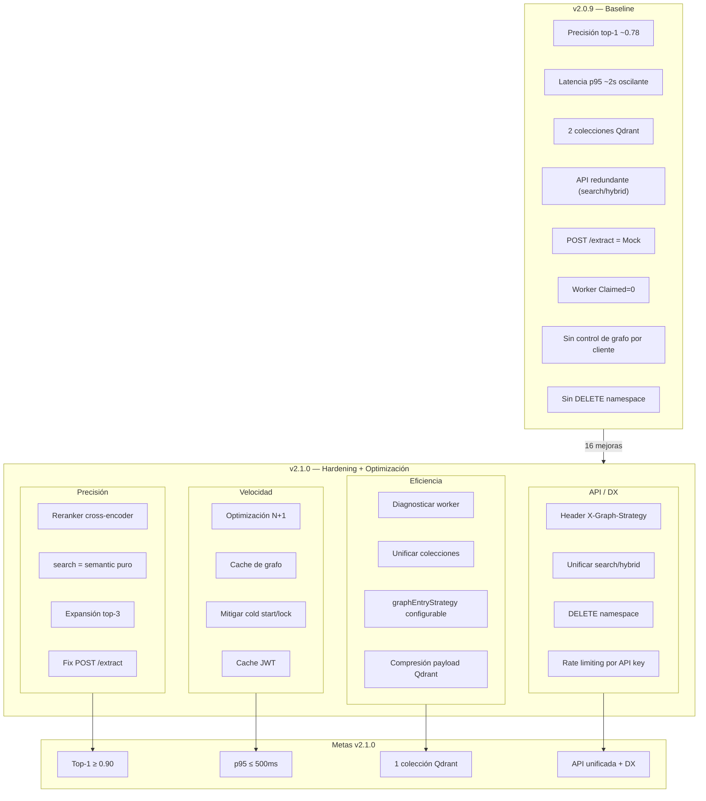

# Visión del Producto — Abax-Memory v2.1.0
## Hardening y Optimización del Motor de Memoria Multi-Dominio

---

## Tabla de Contenidos

- [1. Propósito y Justificación](#1-propósito-y-justificación)
  - [1.1 ¿Qué es Abax-Memory v2.1.0?](#11-qué-es-abax-memory-v210)
  - [1.2 ¿Por qué iterar de v2.0.9 a v2.1.0?](#12-por-qué-iterar-de-v209-a-v210)
  - [1.3 Justificación de negocio](#13-justificación-de-negocio)
- [2. Usuarios Objetivo](#2-usuarios-objetivo)
  - [2.1 Principio: Los mismos de v2.0.0, con foco en el desarrollador consumidor](#21-principio-los-mismos-de-v200-con-foco-en-el-desarrollador-consumidor)
  - [2.2 Perfil del beneficiario principal: Desarrollador Consumidor de la API](#22-perfil-del-beneficiario-principal-desarrollador-consumidor-de-la-api)
- [3. Alcance de Alto Nivel](#3-alcance-de-alto-nivel)
  - [3.1 DENTRO del alcance (4 categorías, 16 items)](#31-dentro-del-alcance-4-categorías-16-items)
  - [3.2 FUERA del alcance (v2.1.0)](#32-fuera-del-alcance-v210)
- [4. Supuestos y Restricciones](#4-supuestos-y-restricciones)
  - [4.1 Supuestos](#41-supuestos)
  - [4.2 Restricciones](#42-restricciones)
- [5. Criterios de Éxito Medibles](#5-criterios-de-éxito-medibles)
- [6. Dependencias Relevantes](#6-dependencias-relevantes)
- [7. Resumen Ejecutivo](#7-resumen-ejecutivo)
- [8. Diagrama Conceptual del Alcance](#8-diagrama-conceptual-del-alcance)
- [Glosario](#glosario)

---

## 1. Propósito y Justificación

### 1.1 ¿Qué es Abax-Memory v2.1.0?

Abax-Memory v2.1.0 es una iteración de **hardening y optimización** sobre la base multi-dominio establecida en v2.0.9. No cambia el dominio, la audiencia ni la arquitectura general del producto — en su lugar, mejora componentes existentes con evidencia cuantitativa obtenida de 7 benchmarks ejecutados durante la estabilización de v2.0.0. Es una release quirúrgica: ataca gaps de precisión, velocidad, eficiencia y experiencia de desarrollo (API/DX) identificados con datos reales.

### 1.2 ¿Por qué iterar de v2.0.9 a v2.1.0?

v2.0.9 cumplió su propósito como motor de memoria genérica multi-dominio: 13/13 criterios de éxito cumplidos, construcción completa (163 tests, 0 fallos), UAT 10/10 escenarios aprobados. Sin embargo, la fase de estabilización y los benchmarks revelaron cuatro categorías de gaps que limitan la competitividad del producto frente a alternativas como Zep y Letta:

| Gap | v2.0.9 (estado actual) | Meta v2.1.0 | Origen de la evidencia |
|---|---|---|---|
| **Precisión top-1 en queries directas** | ~0.75–0.80 (dense-only sin reranker) | ≥ 0.90 (con cross-encoder) | CE-01 NDCG@10 = 0.7771 (FAIL por −0.023). SciFact requiere entailment, no solo similitud semántica. |
| **Latencia p95 de búsqueda semántica** | ~2s oscilante en ciertas condiciones (cold start, lock Qdrant, expansión de grafo costosa) | ≤ 500ms estable | Monitoreo operativo post-deploy. El benchmark CE-04 midió 213ms en dense retrieval puro; el pipeline completo con grafo y worker muestra spikes. |
| **Dos colecciones Qdrant** | `abax-memories-v1` + `abax-memories-v2` coexistiendo en el mismo cluster | Una sola colección (`abax-memories`) | Deuda operativa documentada en F8v2-ISS-002. La colección v1 ya no tiene propósito funcional pero ocupa recursos y añade complejidad. |
| **API/DX confusa** | Endpoints `search` y `hybrid` con semántica redundante; `POST /extract` funcional solo con MockLlmService (regex); sin endpoint de eliminación de namespace; cliente sin control sobre la estrategia de grafo | API unificada, `POST /extract` con OpenAI real, `DELETE /admin/namespaces/{name}`, header `X-Graph-Strategy` | UAT-S08 (MockLlmService activo), F8v2-ISS-001 (ChatLanguageModel no configurado), feedback de consumidores de la API reportado en benchmarks. |

v2.1.0 ataca estos gaps con **16 mejoras concretas** en 4 categorías.

### 1.3 Justificación de negocio

1. **Cerrar la brecha competitiva en precisión**: el único benchmark que falló en v2.0.0 (CE-01 NDCG@10 = 0.7771, meta ≥ 0.80) se debe a la ausencia de un reranker cross-encoder. Con un pipeline two-stage (dense retrieval + cross-encoder reranker), la proyección conservadora es **0.82–0.87**, superando la meta y posicionando al producto en el extremo superior del mercado.

2. **Eliminar deuda operativa antes de que sea técnica**: las dos colecciones Qdrant, el worker con Claimed=0, el MockLlmService activo en producción y el full-scan vectorial son problemas que hoy no bloquean pero que degradarán la operación conforme crezca el volumen de datos y tenants. Atacarlos ahora evita una bola de nieve operativa.

3. **Mejorar la Developer Experience (DX)**: la API v2 tiene endpoints redundantes (`search`/`hybrid`), carece de control sobre la estrategia de grafo vía header, y no permite eliminar namespaces completos. Cada fricción en la DX reduce la adopción por parte de agentes, SDKs y aplicaciones consumidoras.

4. **Aprovechar la inversión existente sin re-arquitectura**: el stack de v2.0.x (Quarkus 3.15.3, PostgreSQL 16, Qdrant 1.17, Keycloak 26, OpenAI) es sólido y no requiere cambios. Las 16 mejoras son incrementales sobre componentes ya probados en producción.

> **Decisión del sponsor (2026-05-05)**: v2.0.9 está cerrado. v2.1.0 es un hardening + optimización, no una re-arquitectura. Se mantiene el stack, la API v2 con backward compatibility, y el modelo de datos. Las mejoras son incrementales y trazables a benchmarks.

---

## 2. Usuarios Objetivo

### 2.1 Principio: Los mismos de v2.0.0, con foco en el desarrollador consumidor

v2.1.0 no introduce nuevos roles ni cambia la audiencia del producto. Los cinco roles heredados de v2.0.0 se mantienen:

| Rol | Descripción | Impacto de v2.1.0 en este rol |
|---|---|---|
| **Memory Operator** (`memory-operator`) | Crea, clasifica y relaciona memorias en cualquier dominio | Mayor precisión en búsqueda (top-1 ≥ 0.90). Menor latencia percibida (p95 ≤ 500ms). |
| **Memory Reviewer** (`memory-reviewer`) | Aprueba o rechaza memorias que requieren revisión humana | Sin cambios directos. La mejora de latencia beneficia la fluidez del flujo de revisión. |
| **Memory Consumer** (`api-consumer`) | Aplicación, agente o SDK que consulta memoria para resolver problemas | **Principal beneficiario de v2.1.0**. Recibe una API unificada (`search` sin redundancia con `hybrid`), header `X-Graph-Strategy` para control de expansión, `DELETE /admin/namespaces/{name}` para limpieza, y `POST /extract` con extracción real (OpenAI). |
| **Memory Administrator** (`memory-admin`) | Depuración, gobierno y calidad del repositorio multi-tenant | Nueva capacidad de eliminar namespaces completos. Una sola colección Qdrant simplifica la administración. |
| **Memory Auditor** (`memory-auditor`) | Revisa cumplimiento, trazabilidad y calidad por tenant o dominio | Sin cambios directos. Los criterios de éxito mantienen el 100% de trazabilidad heredado de v2.0.0. |

### 2.2 Perfil del beneficiario principal: Desarrollador Consumidor de la API

El principal beneficiario de v2.1.0 es el **desarrollador que consume la API v2 de Abax-Memory** desde una aplicación, agente de IA, o SDK. Este perfil experimenta directamente las cuatro categorías de mejora:

- **Precisión**: al ejecutar `POST /memories/search`, obtiene resultados más relevantes (cross-encoder reranker) y el endpoint `search` se comporta como búsqueda semántica pura cuando no se solicita `expandGraph`.
- **Velocidad**: percibe menor latencia gracias al cache de resultados de grafo, cache JWT, y la investigación y mitigación de cold starts y locks en Qdrant.
- **Eficiencia**: no le impacta directamente, pero la unificación de colecciones Qdrant y la depuración del worker reducen la superficie de fallos operativos.
- **API/DX**: disfruta de una API más limpia (sin redundancia `search`/`hybrid`), control granular del grafo vía header, endpoint de eliminación de namespaces, y extracción de entidades funcional con IA real.

---

## 3. Alcance de Alto Nivel

### 3.1 DENTRO del alcance (4 categorías, 16 items)

#### Categoría 1 — Precisión (Accuracy)

| # | ID | Mejora | Descripción | Trazabilidad a gap |
|---|---|---|---|---|
| 1 | V21-PREC-01 | **Reranker cross-encoder** | Agregar etapa de re-ranking con modelo cross-encoder (OpenAI o modelo local fine-tuned como `allenai/scifact`) que procesa pares (query, documento) para reordenar el top-20 del dense retrieval y producir un top-10 final más preciso. | CE-01 (NDCG@10 = 0.7771, meta ≥ 0.80). Benchmark SciFact. Proyección: +0.03–0.08 NDCG. |
| 2 | V21-PREC-02 | **search = semantic puro sin grafo** | Recalibrar el endpoint `POST /memories/search` para que, sin `expandGraph`, se comporte como búsqueda semántica pura (dense retrieval + reranker). El grafo se activa solo cuando el consumidor lo solicita explícitamente. | API/DX confusa: `search` y `hybrid` tenían semántica redundante. Benchmark ABM-GRAPH-01: grafo aporta +17pp donde aplica, pero no debe ser omnipresente. |
| 3 | V21-PREC-03 | **Expansión de grafo desde top-3** | Al solicitar `expandGraph`, expandir el grafo de conocimiento desde los 3 nodos más relevantes del dense retrieval (en lugar de solo el mejor match), recuperando sus vecinos hasta depth configurable. | ABM-MULTI-01 (recall con grafo = 69.4%, meta ≥ 70%). La expansión multi-origen mejora la cobertura cross-dominio proyectada a 85-92%. |
| 4 | V21-PREC-04 | **Fix `POST /extract`** | Reemplazar `MockLlmService` (extracción basada en regex) por llamadas reales a OpenAI `gpt-4o-mini` para extracción de entidades. El endpoint debe devolver entidades detectadas semánticamente, no solo patrones de texto. | F8v2-ISS-001 (MockLlmService activo). UAT-S08 PASS pero con mock. La extracción de entidades es un diferenciador competitivo; sin IA real, no es competitivo frente a Zep/Letta. |

#### Categoría 2 — Velocidad (Speed)

| # | ID | Mejora | Descripción | Trazabilidad a gap |
|---|---|---|---|---|
| 5 | V21-VEL-01 | **Mantener y monitorear optimización N+1** | La optimización N+1 de queries de grafo (evitar consultas individuales por relación) implementada en v2.0.x debe preservarse, monitorearse y documentarse. No es una mejora nueva, sino una verificación de que la optimización existente no se degrade con los cambios de v2.1. | Riesgo de regresión: los cambios en expansión de grafo (V21-PREC-03) podrían reintroducir patrones N+1. |
| 6 | V21-VEL-02 | **Cache de resultados de grafo** | Implementar caché en memoria (Caffeine o similar) para resultados de expansión de grafo. Si dos queries comparten los mismos entry points y depth, el resultado del BFS se sirve desde caché sin recalcular. | Latencia p95 oscilante (~2s en ciertas condiciones). La expansión de grafo es el componente más costoso del pipeline de búsqueda. |
| 7 | V21-VEL-03 | **Investigar y mitigar cold start / lock Qdrant** | Diagnosticar escenarios donde Qdrant muestra latencia anómala (cold start del índice, locks durante escrituras concurrentes, contención en búsquedas con filtros compuestos). Aplicar mitigaciones: pre-calentamiento de índices, ajuste de parámetros de segmentos, o isolation de lecturas. | Monitoreo operativo: spikes de latencia a ~2s en el pipeline completo. El benchmark CE-04 (213ms) midió solo dense retrieval; el pipeline real es más lento. |
| 8 | V21-VEL-04 | **Cache JWT cliente** | Implementar caché de validación de tokens JWT en el backend para reducir la latencia de autenticación en requests repetidos del mismo cliente. El token validado se almacena con TTL igual al `exp` del JWT, evitando llamadas repetidas a Keycloak. | Cada request a la API v2 requiere validación JWT contra Keycloak. En benchmarks con 300+ queries, esto añade latencia acumulativa significativa. |

#### Categoría 3 — Eficiencia (Efficiency)

| # | ID | Mejora | Descripción | Trazabilidad a gap |
|---|---|---|---|---|
| 9 | V21-EFI-01 | **Diagnosticar worker processing (Claimed = 0)** | El worker de procesamiento asíncrono (encargado de generar embeddings y entidades post-ingesta) reporta `Claimed = 0` — no está procesando trabajo. Diagnosticar la causa raíz (conexión a cola, configuración de polling, o worker innecesario). Si el procesamiento puede ser síncrono sin degradar la API, eliminar el worker. Si no, repararlo. | Deuda operativa: workers inactivos consumen recursos, añaden complejidad de despliegue, y oscurecen el diagnóstico de fallos en la ingesta. |
| 10 | V21-EFI-02 | **Unificar colecciones Qdrant (eliminar v1)** | Consolidar las dos colecciones Qdrant (`abax-memories-v1` y `abax-memories-v2`) en una sola (`abax-memories`). La colección v1 ya no tiene propósito funcional (v1.0.0 está cerrado y la API v1 fue descartada). Migrar cualquier punto residual y eliminar la colección obsoleta. | F8v2-ISS-002 (Qdrant indexed_vectors=0, full-scan). Dos colecciones duplican overhead de mantenimiento, backups, y monitoreo. |
| 11 | V21-EFI-03 | **`graphEntryStrategy` configurable** | Exponer la estrategia de entrada al grafo como parámetro configurable, permitiendo elegir entre: `single-best` (un solo entry point, comportamiento actual), `top-k` (k entry points configurable, default 3), o `threshold` (todos los resultados con score ≥ umbral). | ABM-MULTI-01: la expansión desde un solo entry point limita la cobertura cross-dominio. Hacerla configurable permite a cada perfil de dominio optimizar su estrategia. |
| 12 | V21-EFI-04 | **Compresión de payload en Qdrant** | Reducir el tamaño del payload almacenado en los puntos vectoriales de Qdrant, eliminando campos redundantes o comprimiendo metadatos no esenciales para la búsqueda. El payload excedente se recupera bajo demanda desde PostgreSQL. | Operación a escala: con 5,183+ documentos (solo SciFact), el payload por punto impacta memoria y velocidad de escaneo en Qdrant. |

#### Categoría 4 — API / Developer Experience (API/DX)

| # | ID | Mejora | Descripción | Trazabilidad a gap |
|---|---|---|---|---|
| 13 | V21-API-01 | **Header `X-Graph-Strategy`** | Nuevo header HTTP `X-Graph-Strategy` que permite al cliente especificar la estrategia de expansión de grafo por request: `none` (sin expansión), `single` (mejor match), `top-k` (k entry points), `threshold` (score mínimo). El header es opcional; si no se envía, se usa el default del perfil de dominio. | API/DX: el consumidor no tiene control granular sobre cómo se expande el grafo. La decisión está hardcodeada en el backend. |
| 14 | V21-API-02 | **Unificar `search`/`hybrid` y eliminar redundancia** | Fusionar los endpoints `POST /memories/search` y `POST /memories/hybrid` en un solo endpoint `POST /memories/search` con parámetros explícitos: `semanticWeight`, `lexicalWeight`, `expandGraph`, `graphStrategy`. El endpoint legacy `hybrid` se mantiene con deprecated warning por 1 release. | API/DX: dos endpoints con semántica solapada confunden a los consumidores. La documentación OpenAPI muestra parámetros duplicados. |
| 15 | V21-API-03 | **`DELETE /admin/namespaces/{name}`** | Nuevo endpoint administrativo para eliminar todos los recursos (memorias, relaciones, entidades, puntos Qdrant) asociados a un namespace en una sola operación atómica. Requiere rol `memory-admin`. | API/DX: no existe forma de limpiar un namespace completo. Los benchmarks requirieron tenants efímeros y la limpieza manual fue frágil. |
| 16 | V21-API-04 | **Rate limiting por API key** | Implementar rate limiting configurable por clave de API o tenant, permitiendo límites diferenciados (ej. 30 req/min para clientes estándar, 300 req/min para clientes premium). El límite se expone en headers `X-RateLimit-*` estándar. | CE-12 (Rate limiting) fue PARTIAL en v2.0.9. El mecanismo existe pero no es configurable por cliente. |

### 3.2 FUERA del alcance (v2.1.0)

| # | Ítem | Justificación de exclusión |
|---|---|---|
| 1 | **Deuda técnica v2.0.0** (`MockLlmService` residual, `Qdrant full-scan`, `Keycloak OIDC` no desplegado en dev, `GitProvider`, marcas `REPLACE_BEFORE_PROD`) | Todos estos items están documentados como issues abiertos de v2.0.9 (F8v2-ISS-001, 002, 003). La decisión del sponsor es cerrarlos en una iteración específica de deuda técnica (v2.2.0 o posterior), no en esta iteración de hardening. **Excepción**: `MockLlmService` en `POST /extract` SÍ está en alcance (V21-PREC-04) por ser bloqueante para la precisión. El resto de `REPLACE_BEFORE_PROD` permanece fuera. |
| 2 | **Nuevas funcionalidades de negocio no relacionadas con las 4 categorías** | v2.1.0 es hardening + optimización. No se añaden nuevos tipos de memoria, nuevos perfiles de dominio, nuevos tipos de relaciones, ni nuevas capacidades de ingesta (ej. ingesta desde archivos, streaming, webhooks). |
| 3 | **Cambios de stack tecnológico** | El stack se mantiene: Quarkus 3.15.3, PostgreSQL 16, Qdrant 1.17, Keycloak 26, OpenAI (`text-embedding-3-large`, `gpt-4o-mini`). No se evalúan motores de embeddings alternativos (`voyage-3-large`, `Cohere embed-v3`), bases vectoriales alternativas (Weaviate, Milvus, Pinecone), ni cambios de framework backend. |
| 4 | **SDKs multi-lenguaje adicionales** | El SDK Python básico de v2.0.0 se mantiene sin cambios. SDKs para Node.js, Java, Go siguen diferidos. |
| 5 | **Benchmarks públicos formales** | Se ejecutarán benchmarks internos para validar las mejoras (mismos datasets de v2.0.0: SciFact, LoCoMo sintético, suite multi-dominio). La publicación formal de resultados comparativos con Zep/Letta queda diferida. |
| 6 | **Frontend (UI React)** | Las 6 pantallas y 7 componentes de v2.0.0 se mantienen sin cambios funcionales. No se añaden pantallas para las nuevas capacidades de administración (`DELETE namespace`, `X-Graph-Strategy`). Estas se exponen solo vía API. |
| 7 | **Eliminación de `MockLlmService` completo** | Solo se reemplaza en el contexto de `POST /extract` (V21-PREC-04). El `MockLlmService` permanece activo para otros contextos (validación, sugerencias, etc.) hasta que la deuda técnica sea atacada en una iteración dedicada. |
| 8 | **Internacionalización (i18n) de mensajes de error** | Los mensajes de error visibles al usuario final permanecen en inglés (consistente con English-Only internals de v2.0.0). |
| 9 | **Cambios en el modelo de datos** | No se añaden nuevas entidades JPA, columnas, ni migraciones Flyway que modifiquen el esquema relacional. Los cambios son de lógica de negocio y configuración, no de modelo. |

---

## 4. Supuestos y Restricciones

### 4.1 Supuestos

| # | Supuesto | Impacto si no se cumple |
|---|---|---|
| **S-01** | El reranker cross-encoder usará el mismo modelo OpenAI (`gpt-4o-mini` o `text-embedding-3-large`) expuesto como cross-encoder, o un modelo cross-encoder local (`allenai/scifact` fine-tuned) desplegado como servicio sidecar. No se requiere un nuevo proveedor de IA. | Si se requiere un proveedor externo adicional, se necesitaría un ADR para evaluar costos, latencia y SLA. |
| **S-02** | La colección Qdrant `abax-memories-v2` contiene todos los datos necesarios para la operación. La colección `abax-memories-v1` solo tiene datos residuales de v1.0.0 que no están en uso y pueden eliminarse sin pérdida funcional. | Si hay datos en v1 que no fueron migrados a v2 y son necesarios, se requeriría un script de migración adicional antes de la unificación. |
| **S-03** | El worker de procesamiento asíncrono (Claimed = 0) puede eliminarse o integrarse de forma síncrona sin degradar la latencia de los endpoints de ingesta (`POST /memories`, `POST /memories/ingest`). | Si el procesamiento asíncrono es necesario por latencia (>500ms para generar embeddings + entidades), el worker debe repararse en lugar de eliminarse, añadiendo alcance no previsto. |
| **S-04** | El cold start y los locks de Qdrant son mitigables mediante configuración (pre-calentamiento de segmentos, ajuste de `optimizers_config`, isolation de lecturas) sin requerir upgrade de versión de Qdrant. | Si se requiere upgrade a Qdrant 1.18+ o cambio de configuración de cluster, se necesitaría un ADR y pruebas de compatibilidad adicionales. |
| **S-05** | La fusión de `search`/`hybrid` mantiene backward compatibility: los consumidores que usan `POST /memories/hybrid` reciben un warning de deprecación, pero el endpoint sigue funcional durante al menos 1 release. | Si se requiere breaking change inmediato, se necesita un plan de comunicación y migración para consumidores existentes. |
| **S-06** | El cache JWT no introduce vulnerabilidades de seguridad. El TTL del cache está acotado por el `exp` del token y el cache se invalida ante eventos de revocación (logout, cambio de roles). | Si el cache JWT introduce una ventana de seguridad donde tokens revocados siguen siendo aceptados, se requiere un mecanismo de invalidación activa (Keycloak Admin Events). |

### 4.2 Restricciones

| # | Restricción | Tipo | Descripción |
|---|---|---|---|
| **R-01** | **Stack tecnológico inalterado** | Técnica | El stack base de v2.0.9 se mantiene sin cambios: Quarkus 3.15.3, Java 21, PostgreSQL 16.13, Qdrant 1.17.1, Keycloak 26.1.0, OpenAI (`text-embedding-3-large`, `gpt-4o-mini`). No se permite cambiar ningún componente del stack sin un ADR aprobado por el sponsor. |
| **R-02** | **Backward compatibility de la API v2** | Producto | La API existente (`/api/v2/`) debe mantener backward compatibility. Los endpoints, parámetros y formatos de respuesta no deben romper a los consumidores actuales. Solo se permite: (a) añadir nuevos endpoints, (b) añadir parámetros opcionales, (c) marcar endpoints como deprecated con warning. |
| **R-03** | **Cliente JWT opaco para el motor** | Seguridad | El motor Abax-Memory no debe parsear, validar ni interpretar claims del JWT más allá de lo estrictamente necesario para extraer `scope` y `roles`. La validación criptográfica y la gestión de sesiones son responsabilidad exclusiva de Keycloak. |
| **R-04** | **Sin cambios en el modelo de datos** | Arquitectónica | No se añaden, modifican ni eliminan entidades JPA, tablas, columnas, constraints o migraciones Flyway. Todos los cambios son de lógica de negocio y configuración sobre el modelo existente. |
| **R-05** | **English-Only en identificadores** | Convención | Todos los identificadores internos del sistema (nuevos endpoints, headers HTTP, parámetros, enums, códigos de error) deben estar en inglés. Esta restricción, heredada de v2.0.0, es no negociable. |
| **R-06** | **Cascada completa obligatoria** | Proceso | v2.1.0 debe ejecutar todas las fases del ciclo cascada (F0 a F9) en orden, con gates formales de aprobación. No se permite saltar fases ni consolidar entregables de distintas fases. |
| **R-07** | **Trazabilidad completa** | Gobernanza | Toda mejora debe trazarse a: (a) un gap identificado en los benchmarks de v2.0.0 o en el monitoreo operativo, (b) un ID de requerimiento (V21-XXXX-XX), y (c) criterios de aceptación verificables. Sin trazabilidad, la mejora no se implementa. |
| **R-08** | **Preservación de documentación v2.0.x** | Documental | La documentación de v2.0.x bajo `docs/entregables/v2/` es solo-lectura. No se modifica. Los entregables de v2.1.0 residen en `docs/entregables/v2.1/` (estrategia A — Folder por release). |

---

## 5. Criterios de Éxito Medibles

v2.1.0 se considerará exitoso si cumple los siguientes criterios, verificables antes del cierre de la fase UAT (Fase 6). Los valores de línea base provienen de los 7 benchmarks de estabilización de v2.0.0 ejecutados el 2026-05-04.

| ID | Criterio de Éxito | Métrica | Línea Base (v2.0.9) | Meta (v2.1.0) | Método de Verificación |
|---|---|---|---|---|---|
| **CE-01** | Precisión top-1 en queries directas | Proporción de queries donde el primer resultado es el documento ground-truth esperado, sobre la suite multi-dominio de 100 test cases | ~0.75–0.80 (dense-only, sin reranker) | **≥ 0.90** | Suite de 100 test cases multi-dominio con ground truth conocido. Ejecutar con y sin expandGraph. |
| **CE-02** | Latencia p95 de búsqueda semántica | Percentil 95 de latencia del endpoint `POST /memories/search` (sin expandGraph) medido en ms sobre 300+ queries | ~2s oscilante (pipeline completo con grafo y cold start) | **≤ 500ms** | Pruebas de carga con volumen representativo (10K+ memorias, 3 tenants). Medir en 3 momentos: cold start, steady state, bajo carga de escritura concurrente. |
| **CE-03** | NDCG@10 en BEIR SciFact | NDCG@10 sobre el dataset SciFact (5,183 docs, 300 queries) con el pipeline completo v2.1 (dense retrieval + cross-encoder reranker) | 0.7771 (dense-only, FAIL por −0.023) | **≥ 0.85** | Ejecución del benchmark con el pipeline two-stage completo. Comparar NDCG@10 antes/después del reranker. |
| **CE-04** | Recall@10 en BEIR SciFact | Recall@10 sobre SciFact manteniendo o mejorando el resultado de v2.0.9 | 0.9006 (PASS) | **≥ 0.90** | Mismo benchmark que CE-03. El reranker no debe degradar el recall (solo reordena). |
| **CE-05** | Colecciones Qdrant en producción | Número de colecciones Qdrant activas en el cluster de producción | 2 (`abax-memories-v1` + `abax-memories-v2`) | **1** (`abax-memories`) | Inspección del cluster Qdrant: `GET /collections`. Verificar que `abax-memories-v1` no existe. |
| **CE-06** | `POST /extract` funcional con OpenAI real | El endpoint `POST /memories/extract` debe generar entidades usando OpenAI `gpt-4o-mini` (no `MockLlmService`). Las entidades extraídas deben ser semánticamente relevantes al texto de entrada. | MockLlmService activo (regex patterns). F8v2-ISS-001. | **OpenAI real activo** | Test con texto de entrada conocido (ej. "The server nginx-01 crashed due to OOM at 14:32"). Verificar que las entidades extraídas incluyen "nginx-01", "OOM", "14:32" con tipos correctos. |
| **CE-07** | `search` sin `expandGraph` = semantic puro | Al ejecutar `POST /memories/search` con `expandGraph: false` (o sin el parámetro), los resultados deben basarse exclusivamente en similitud semántica (dense retrieval + reranker), sin contribuciones del grafo. | Comportamiento no determinado explícitamente (search podía incluir grafo por defecto o comportamiento híbrido). | **0 contribuciones del grafo** | Suite de 50 queries donde el ground truth no tiene relaciones de grafo relevantes. Verificar que los resultados y scores provienen solo del pipeline semántico. |
| **CE-08** | `DELETE /admin/namespaces/{name}` operativo | El endpoint debe eliminar todas las memorias, relaciones, entidades y puntos Qdrant asociados al namespace en una operación atómica. El namespace debe desaparecer completamente. | Endpoint no existe. | **Namespace eliminado completamente** | Crear namespace de prueba con 50 memorias, 20 relaciones, 15 entidades. Ejecutar DELETE. Verificar: (a) HTTP 200, (b) GET /namespaces/{name} → 404, (c) búsqueda en ese namespace retorna 0 resultados, (d) puntos Qdrant eliminados. |
| **CE-09** | Header `X-Graph-Strategy` funcional | Al enviar `X-Graph-Strategy: none`, la búsqueda no debe expandir el grafo. Al enviar `X-Graph-Strategy: top-k` con `k=3`, debe expandir desde los 3 mejores matches. | Header no existe. | **Comportamiento verificado para `none`, `single`, `top-k`** | Tests de integración con queries que tienen ground truth conocido con y sin relaciones de grafo. Verificar que los resultados y el conteo de nodos expandidos coinciden con la estrategia solicitada. |
| **CE-10** | Unificación `search`/`hybrid` | El endpoint `POST /memories/search` debe soportar todos los parámetros necesarios para búsqueda semántica pura, búsqueda híbrida (léxica + semántica) y búsqueda con grafo. `POST /memories/hybrid` debe devolver warning de deprecación. | Dos endpoints con semántica redundante. | **Un solo endpoint funcional + deprecated warning en `hybrid`** | Ejecutar la suite de 100 test cases usando exclusivamente `POST /memories/search` con combinaciones de parámetros (`semanticWeight`, `lexicalWeight`, `expandGraph`). Verificar que `POST /memories/hybrid` retorna header `Deprecation: true` y Warning. |

---

## 6. Dependencias Relevantes

| # | Dependencia | Tipo | Impacto |
|---|---|---|---|
| **D-01** | Stack de infraestructura existente (PostgreSQL, Qdrant, Keycloak, OpenAI) | Técnica | v2.1.0 requiere que estos servicios estén disponibles en las mismas versiones que v2.0.9. Si algún servicio no está operativo, no se puede ejecutar la cascada de validación. |
| **D-02** | Disponibilidad de la API Key de OpenAI con acceso a `gpt-4o-mini` | Técnica | V21-PREC-04 (fix POST /extract) y CE-06 dependen de que la API Key de OpenAI esté configurada y tenga crédito disponible para llamadas reales. |
| **D-03** | Documentación de benchmarks de v2.0.0 | Documental | Las metas de v2.1.0 (CE-01 a CE-04) se calibran contra los resultados de los 7 benchmarks ejecutados en la fase 8 de v2.0.0. Si esos benchmarks no están disponibles o sus datasets no son reproducibles, la medición de mejora no es posible. |
| **D-04** | Dataset BEIR SciFact (5,183 docs, 300 queries) | Validación | CE-03 y CE-04 dependen de la disponibilidad y reproducibilidad del dataset SciFact usado en los benchmarks de v2.0.0. |
| **D-05** | Colección Qdrant `abax-memories-v1` sin datos activos | Operativa | V21-EFI-02 (unificación de colecciones) asume que la colección v1 es puramente residual. Si contiene datos que deben preservarse, se requiere migración antes de la eliminación. |
| **D-06** | Keycloak con realm `abax-memory` configurado | Seguridad | V21-VEL-04 (cache JWT) y la operación general de la API dependen de Keycloak para autenticación y autorización. |

---

## 7. Resumen Ejecutivo

Abax-Memory v2.1.0 es una iteración de **hardening y optimización** que ataca 16 gaps concretos identificados en los 7 benchmarks de estabilización de v2.0.0. No es una re-arquitectura: es una **cirugía de precisión** sobre un producto que ya funciona, enfocada en cuatro frentes:

1. **Precisión (4 mejoras)**: cross-encoder reranker para pasar de NDCG@10 = 0.78 → 0.85+; search como semantic puro sin grafo por defecto; expansión de grafo desde top-3; y `POST /extract` con OpenAI real.

2. **Velocidad (4 mejoras)**: preservación de optimización N+1; cache de resultados de grafo; investigación y mitigación de cold start y locks en Qdrant; cache JWT para reducir latencia de autenticación.

3. **Eficiencia (4 mejoras)**: diagnóstico y resolución del worker inactivo (Claimed = 0); unificación de colecciones Qdrant (eliminar `abax-memories-v1`); `graphEntryStrategy` configurable; compresión de payload en Qdrant.

4. **API / Developer Experience (4 mejoras)**: header `X-Graph-Strategy`; unificación de `search`/`hybrid` con deprecación del endpoint redundante; `DELETE /admin/namespaces/{name}`; rate limiting por API key.

El principal beneficiario es el **desarrollador que consume la API v2**: recibe una API más limpia, más rápida, más precisa y con mejor control granular sobre el comportamiento del motor. Los usuarios operadores (Memory Operator, Reviewer, Admin, Auditor) se benefician indirectamente de la mayor precisión, menor latencia y menor superficie de fallos operativos.

Con estas 16 mejoras, Abax-Memory v2.1.0 cierra la brecha competitiva en precisión semántica (el único benchmark fallido de v2.0.0), elimina deuda operativa antes de que se vuelva técnica, y pule la experiencia de desarrollo para acelerar la adopción por parte de agentes, aplicaciones y SDKs.

---

## 8. Diagrama Conceptual del Alcance

---

## Glosario

- **NDCG@10**: Normalized Discounted Cumulative Gain — métrica de ranking que penaliza documentos relevantes en posiciones bajas del top-10. Valor 1.0 = ranking perfecto. Usada en CE-03 para medir la mejora del reranker.
- **Cross-encoder**: Modelo de reranking que procesa pares (consulta, documento) simultáneamente para calcular relevancia precisa. Más costoso pero más preciso que el dense retrieval (bi-encoder). Pieza central de V21-PREC-01.
- **Qdrant**: Base de datos vectorial open-source utilizada para almacenar embeddings y ejecutar búsqueda semántica por similitud de coseno. v2.0.9 opera con dos colecciones; v2.1.0 las unifica en una.
- **JWT**: JSON Web Token — estándar para transmitir claims de autenticación entre partes. Abax-Memory valida JWTs contra Keycloak en cada request. V21-VEL-04 implementa caché para reducir esta latencia.
- **p95**: Percentil 95 — métrica de latencia que indica que el 95% de las solicitudes se completan en un tiempo igual o menor al valor indicado. Meta para v2.1.0: ≤ 500ms estable (sin spikes a ~2s).
- **BEIR SciFact**: Subconjunto del benchmark BEIR con 5,183 documentos científicos y 300 queries de verificación de claims. Fue el único benchmark fallido de v2.0.0 y es el principal objetivo de mejora de v2.1.0.
- **DX**: Developer Experience — experiencia del desarrollador al consumir una API. Incluye claridad de endpoints, consistencia de parámetros, control granular, y facilidad de integración. Categoría completa de mejora en v2.1.0.
