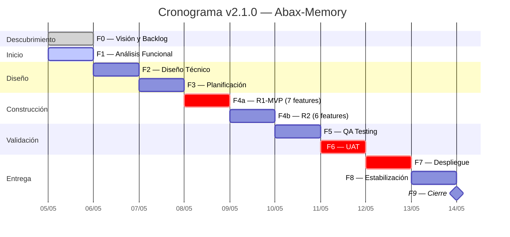

# Acta de Constitución del Proyecto — Abax-Memory v2.1.0
## "Hardening & Optimización del Motor de Memoria Multi-Dominio"

---

## Tabla de Contenidos

- [1. Información General del Proyecto](#1-información-general-del-proyecto)
- [2. Objetivo del Proyecto](#2-objetivo-del-proyecto)
- [3. Alcance del Proyecto](#3-alcance-del-proyecto)
  - [3.1 Dentro del Alcance](#31-dentro-del-alcance)
  - [3.2 Fuera del Alcance](#32-fuera-del-alcance)
- [4. Restricciones](#4-restricciones)
- [5. Supuestos](#5-supuestos)
- [6. Interesados Clave (Stakeholders)](#6-interesados-clave-stakeholders)
- [7. Hitos Principales y Cronograma](#7-hitos-principales-y-cronograma)
- [8. Presupuesto y Recursos](#8-presupuesto-y-recursos)
- [9. Criterios de Éxito](#9-criterios-de-éxito)
- [10. Plan de Entregables por Fase](#10-plan-de-entregables-por-fase)
- [11. Estructura de Gobernanza](#11-estructura-de-gobernanza)
- [12. Firmas y Aprobaciones](#12-firmas-y-aprobaciones)
- [Glosario](#glosario)

---

## 1. Información General del Proyecto

| Campo | Valor |
|---|---|
| **Nombre del Proyecto** | Abax-Memory v2.1.0 — "Hardening & Optimización del Motor de Memoria Multi-Dominio" |
| **Versión** | v2.1.0 |
| **Tipo de Iteración** | Hardening y optimización (no re-arquitectura) |
| **Versión Predecesora** | v2.0.9 (cerrada el 2026-05-05) |
| **Sponsor / Product Owner** | Usuario (product-owner) |
| **Project Manager** | project-manager |
| **Fecha de Constitución** | 2026-05-05 |
| **Metodología** | Cascada completa (F0 → F9) con gates formales de aprobación |
| **Stack Tecnológico** | Quarkus 3.15.3, Java 21, PostgreSQL 16.13, Qdrant 1.17.1, Keycloak 26.1.0, OpenAI (`text-embedding-3-large`, `gpt-4o-mini`) |
| **Repositorio** | `breisnerlopez/abax-memory` |
| **Documentación** | `docs/entregables/v2.1/` (estrategia A — Folder por release) |

> **Decisión del sponsor (2026-05-05)**: v2.0.9 está cerrado. v2.1.0 es un hardening + optimización, no una re-arquitectura. Se mantiene el stack, la API v2 con backward compatibility, y el modelo de datos. Las mejoras son incrementales y trazables a benchmarks.

---

## 2. Objetivo del Proyecto

### 2.1 Propósito

Abax-Memory v2.1.0 es una iteración de **hardening y optimización** sobre la base multi-dominio establecida en v2.0.9. No cambia el dominio, la audiencia ni la arquitectura general del producto — en su lugar, **refina componentes existentes con evidencia cuantitativa** obtenida de 7 benchmarks ejecutados durante la estabilización de v2.0.0.

Es una **release quirúrgica**: ataca gaps de precisión, velocidad, eficiencia y experiencia de desarrollo (API/DX) identificados con datos reales, sin introducir nuevo alcance funcional de negocio.

### 2.2 Objetivos Estratégicos (OKR)

| Objetivo | Resultado Clave (KR) | Línea Base (v2.0.9) | Meta (v2.1.0) |
|---|---|---|---|
| **O1: Precisión competitiva** | KR1.1: Top-1 en queries directas sobre suite multi-dominio | ~0.75–0.80 (dense-only) | **≥ 0.90** |
| | KR1.2: NDCG@10 en benchmark BEIR SciFact | 0.7771 (FAIL) | **≥ 0.85** |
| | KR1.3: Recall@10 en SciFact mantenido o mejorado | 0.9006 | **≥ 0.90** |
| **O2: Latencia predecible** | KR2.1: p95 de latencia en `POST /memories/search` (sin expandGraph) | ~2s oscilante | **≤ 500ms** |
| **O3: Infraestructura simplificada** | KR3.1: Colecciones Qdrant activas en producción | 2 | **1** |
| **O4: API de clase mundial** | KR4.1: Endpoints de búsqueda unificados sin redundancia | 2 (`search` + `hybrid`) | **1 + deprecated warning** |
| | KR4.2: `POST /extract` con IA real (OpenAI) | MockLlmService (regex) | **OpenAI `gpt-4o-mini`** |

### 2.3 Justificación de Negocio

1. **Cerrar la brecha competitiva en precisión**: el único benchmark fallido de v2.0.0 (CE-01 NDCG@10 = 0.7771, meta ≥ 0.80) se debe a la ausencia de un reranker cross-encoder. Con un pipeline two-stage (dense retrieval + cross-encoder reranker), la proyección conservadora es **0.82–0.87**, posicionando al producto en el extremo superior del mercado frente a alternativas como Zep y Letta.

2. **Eliminar deuda operativa antes de que sea técnica**: las dos colecciones Qdrant, el worker con `Claimed=0`, el `MockLlmService` activo en producción y el full-scan vectorial son problemas que hoy no bloquean pero que degradarán la operación conforme crezca el volumen de datos y tenants.

3. **Mejorar la Developer Experience (DX)**: la API v2 tiene endpoints redundantes (`search`/`hybrid`), carece de control sobre la estrategia de grafo vía header, y no permite eliminar namespaces completos. Cada fricción en la DX reduce la adopción por parte de agentes, SDKs y aplicaciones consumidoras.

4. **Aprovechar la inversión existente sin re-arquitectura**: el stack de v2.0.x es sólido y no requiere cambios. Las 13 mejoras son incrementales sobre componentes ya probados en producción.

---

## 3. Alcance del Proyecto

### 3.1 Dentro del Alcance

v2.1.0 implementa **13 features** agrupadas en **4 épicas**, derivadas de los gaps identificados en los 7 benchmarks de estabilización de v2.0.0:

#### Épica 1 — EP-V21-001: Precisión del Motor de Búsqueda (4 features)

| ID | Feature | Gap que ataca | Prioridad |
|---|---|---|---|
| FT-V21-001.1 | **Reranker Cross-Encoder** en pipeline two-stage (dense retrieval → cross-encoder → top-5) | CE-01 NDCG@10 = 0.7771 (único benchmark fallido) | **1** — Máxima |
| FT-V21-001.2 | **Búsqueda Semántica Pura**: `search` sin `expandGraph` = solo pipeline semántico | API/DX confusa: semántica redundante entre `search`/`hybrid` | **2** — Alta |
| FT-V21-001.3 | **Expansión de Grafo Top-3** con `entryPoints` configurables | ABM-MULTI-01 recall con grafo = 69.4% (meta ≥ 70%) | **3** — Alta |
| FT-V21-001.4 | **Fix `POST /extract`**: OpenAI `gpt-4o-mini` real en lugar de `MockLlmService` | F8v2-ISS-001: MockLlmService activo con regex | **6** — Media-Alta |

#### Épica 2 — EP-V21-002: Velocidad y Latencia (3 features)

| ID | Feature | Gap que ataca | Prioridad |
|---|---|---|---|
| FT-V21-002.1 | **Optimización N+1 + Cache de Grafo**: preservar N+1 y agregar caché Caffeine | Latencia p95 ~2s oscilante (expansión de grafo costosa) | **7** — Media |
| FT-V21-002.2 | **Cold Start / Lock Qdrant**: diagnóstico y mitigación de latencia anómala | Spikes de latencia a ~2s en pipeline completo | **8** — Media |
| FT-V21-002.3 | **Cache JWT** en backend con TTL = `exp` del token | Latencia acumulativa de validación JWT en 300+ queries | **4** — Alta |

#### Épica 3 — EP-V21-003: Eficiencia Operativa (3 features)

| ID | Feature | Gap que ataca | Prioridad |
|---|---|---|---|
| FT-V21-003.1 | **Diagnóstico Worker** (`Claimed=0`): eliminar o reparar worker inactivo | Worker inactivo consume recursos, añade complejidad | **9** — Media |
| FT-V21-003.2 | **Unificar Colecciones Qdrant**: eliminar `abax-memories-v1`, consolidar en `abax-memories` | 2 colecciones duplican overhead de mantenimiento (F8v2-ISS-002) | **5** — Alta |
| FT-V21-003.3 | **`graphEntryStrategy` Configurable**: `single-best`, `top-k`, `threshold` | Estrategia de entrada al grafo hardcodeada | **10** — Media |

#### Épica 4 — EP-V21-004: API / Developer Experience (3 features)

| ID | Feature | Gap que ataca | Prioridad |
|---|---|---|---|
| FT-V21-004.1 | **Header `X-Graph-Strategy`**: control granular por request (`none`, `single`, `top-k`, `threshold`) | Sin control de grafo por request del cliente | **11** — Media |
| FT-V21-004.2 | **Unificar `search`/`hybrid`**: un solo endpoint con parámetros explícitos + deprecación de `hybrid` | Endpoints redundantes con semántica solapada | **12** — Media |
| FT-V21-004.3 | **`DELETE /admin/namespaces/{name}`**: eliminación atómica de namespace completo | Sin endpoint para limpiar namespaces | **13** — Media |

### 3.2 Fuera del Alcance

Los siguientes ítems están **explícitamente excluidos** de v2.1.0:

| # | Ítem Excluido | Justificación |
|---|---|---|
| 1 | **Deuda técnica v2.0.0** (`MockLlmService` residual completo, `Qdrant full-scan`, `Keycloak OIDC` no desplegado en dev, `GitProvider`, marcas `REPLACE_BEFORE_PROD`) | Diferida a iteración de deuda técnica dedicada (v2.2.0+). **Excepción**: `MockLlmService` en `POST /extract` SÍ está en alcance (FT-V21-001.4). |
| 2 | **Nuevas funcionalidades de negocio** no relacionadas con las 4 categorías | v2.1.0 es hardening + optimización, no feature release. No se añaden nuevos tipos de memoria, perfiles de dominio, tipos de relaciones, ni capacidades de ingesta. |
| 3 | **Cambios de stack tecnológico** | Se mantiene Quarkus 3.15.3, PostgreSQL 16, Qdrant 1.17, Keycloak 26, OpenAI. No se evalúan motores de embedding ni bases vectoriales alternativas. |
| 4 | **SDKs multi-lenguaje adicionales** | Solo SDK Python básico heredado de v2.0.0. Node.js, Java, Go diferidos. |
| 5 | **Benchmarks públicos formales** | Solo benchmarks internos (mismos datasets: SciFact, LoCoMo sintético, suite multi-dominio). Publicación comparativa con Zep/Letta diferida. |
| 6 | **Frontend (UI React)** | Las 6 pantallas y 7 componentes de v2.0.0 se mantienen sin cambios funcionales. Nuevas capacidades de administración solo vía API. |
| 7 | **Internacionalización (i18n)** de mensajes de error | Mensajes permanecen en inglés (consistente con English-Only internals). |
| 8 | **Cambios en el modelo de datos** | No se añaden, modifican ni eliminan entidades JPA, tablas, columnas, constraints o migraciones Flyway. |

---

## 4. Restricciones

| ID | Restricción | Tipo | Descripción |
|---|---|---|---|
| **R-01** | Stack tecnológico inalterado | Técnica | El stack base de v2.0.9 se mantiene sin cambios. Cualquier cambio requiere un ADR aprobado por el sponsor. |
| **R-02** | Backward compatibility de la API v2 | Producto | La API existente (`/api/v2/`) debe mantener backward compatibility. Solo se permite añadir endpoints, parámetros opcionales, y marcar endpoints como deprecated con warning. |
| **R-03** | Cliente JWT opaco para el motor | Seguridad | El motor no debe parsear ni interpretar claims del JWT más allá de `scope` y `roles`. La validación criptográfica es responsabilidad exclusiva de Keycloak. |
| **R-04** | Sin cambios en el modelo de datos | Arquitectónica | No se añaden, modifican ni eliminan entidades JPA, tablas, columnas, constraints o migraciones Flyway. Todos los cambios son de lógica de negocio y configuración. |
| **R-05** | English-Only en identificadores | Convención | Todos los identificadores internos (endpoints, headers HTTP, parámetros, enums, códigos de error) deben estar en inglés. No negociable. |
| **R-06** | Cascada completa obligatoria (F0 → F9) | Proceso | Debe ejecutarse el ciclo cascada completo con gates formales. No se permite saltar fases ni consolidar entregables de distintas fases. |
| **R-07** | Trazabilidad completa | Gobernanza | Toda mejora debe trazarse a: (a) gap en benchmarks o monitoreo, (b) ID de requerimiento (V21-XXXX-XX), (c) criterios de aceptación verificables. Sin trazabilidad, la mejora no se implementa. |
| **R-08** | Preservación de documentación v2.0.x | Documental | La documentación de v2.0.x bajo `docs/entregables/v2/` es solo-lectura. Los entregables de v2.1.0 residen en `docs/entregables/v2.1/`. |

---

## 5. Supuestos

| ID | Supuesto | Impacto si no se cumple |
|---|---|---|
| **S-01** | El reranker cross-encoder usará el mismo proveedor OpenAI (`gpt-4o-mini`) o un modelo local (`allenai/scifact`) sin requerir nuevo proveedor externo. | Si se requiere un proveedor adicional, se necesitaría un ADR para evaluar costos, latencia y SLA. |
| **S-02** | La colección Qdrant `abax-memories-v2` contiene todos los datos necesarios. `abax-memories-v1` solo tiene datos residuales de v1.0.0 que pueden eliminarse sin pérdida funcional. | Si hay datos en v1 no migrados a v2, se requeriría un script de migración adicional antes de la unificación. |
| **S-03** | El worker de procesamiento asíncrono (`Claimed=0`) puede eliminarse o integrarse de forma síncrona sin degradar la latencia de ingesta (`POST /memories`, `POST /memories/ingest`). | Si el procesamiento asíncrono es necesario por latencia, el worker debe repararse, añadiendo alcance no previsto. |
| **S-04** | El cold start y los locks de Qdrant son mitigables mediante configuración (pre-calentamiento de segmentos, ajuste de `optimizers_config`, isolation de lecturas), sin requerir upgrade de versión. | Si se requiere upgrade a Qdrant 1.18+, se dispara R-01 y se necesita un ADR aprobado por el sponsor. |
| **S-05** | La fusión de `search`/`hybrid` mantiene backward compatibility: `POST /memories/hybrid` sigue funcional con warning de deprecación durante al menos 1 release. | Si se requiere breaking change inmediato, se necesita un plan de comunicación y migración para consumidores existentes. |
| **S-06** | El cache JWT no introduce vulnerabilidades de seguridad. El TTL del cache está acotado por el `exp` del token y se invalida ante eventos de revocación. | Si el cache JWT introduce una ventana de seguridad donde tokens revocados siguen siendo aceptados, se requiere invalidación activa vía Keycloak Admin Events. |

---

## 6. Interesados Clave (Stakeholders)

### 6.1 Matriz de Interesados

| Rol | Agente | Responsabilidad en v2.1.0 | Nivel de Influencia | Nivel de Interés |
|---|---|---|---|---|
| **Sponsor / Product Owner** | product-owner | Aprueba visión, alcance, gates de fase y aceptación final (UAT). Define prioridades. | Alto | Alto |
| **Project Manager** | project-manager | Planifica, controla alcance/cronograma/recursos, gestiona riesgos, comunica estado. Responsable de esta Acta. | Alto | Alto |
| **Business Analyst** | business-analyst | Levanta y documenta requerimientos funcionales, criterios de aceptación, historias de usuario. Ejecuta F1 (Functional Analysis). | Medio | Alto |
| **Tech Lead** | tech-lead | Diseña arquitectura de solución, aprueba decisiones técnicas (ADR), revisa código (anti-mock review). Responsable de F2 (Technical Design). | Alto | Alto |
| **Solution Architect** | solution-architect | Define arquitectura de integración, modelo de despliegue, estrategia de caching y seguridad. | Alto | Medio |
| **DevOps** | devops | Gestiona ambientes, CI/CD, despliegue, infraestructura Qdrant/PostgreSQL/Keycloak. Responsable de F7 (Deployment). | Medio | Alto |
| **Developer Backend** | developer-backend | Implementa las 13 features en el backend Quarkus. Responsable de F4 (Construction). | Medio | Alto |
| **QA Lead** | qa-lead | Diseña y ejecuta casos de prueba, benchmarks de validación, pruebas de regresión. Responsable de F5 (QA Testing). | Medio | Alto |
| **Developer Frontend** | developer-frontend | Sin cambios funcionales en v2.1.0 (UI React se mantiene). Rol de soporte para verificar que la API no rompe el frontend existente. | Bajo | Bajo |

### 6.2 Matriz RACI Simplificada por Fase

| Fase | Sponsor | PM | BA | Tech Lead | Sol. Arch. | DevOps | Dev Backend | QA | Dev Frontend |
|---|---|---|---|---|---|---|---|---|---|
| F0 — Descubrimiento | A | R | R | C | C | I | I | I | I |
| F1 — Análisis Funcional | I | A | R | C | C | I | I | I | I |
| F2 — Diseño Técnico | I | A | C | R | R | C | C | I | I |
| F3 — Planificación | A | R | C | C | C | C | I | I | I |
| F4 — Construcción | I | A | C | R | C | C | R | I | I |
| F5 — QA Testing | I | A | C | C | I | C | C | R | I |
| F6 — UAT | R/A | A | C | C | I | I | I | C | I |
| F7 — Despliegue | A | R | I | C | C | R | C | I | I |
| F8 — Estabilización | I | R | I | C | C | R | C | C | I |
| F9 — Cierre | A | R | C | C | C | C | I | I | I |

> **Leyenda**: R = Responsible (ejecuta), A = Accountable (aprueba), C = Consulted, I = Informed

---

## 7. Hitos Principales y Cronograma

### 7.1 Hitos del Proyecto (Gates de Fase)

| Hito | Fase | Descripción | Criterio de Aprobación | Fecha Estimada | Estado |
|---|---|---|---|---|---|
| **H0** | F0 — Descubrimiento | Visión del producto, épicas, backlog priorizado y decisión de iteración | Sponsor aprueba visión y alcance | 2026-05-05 | ✅ Aprobado |
| **H1** | F1 — Inicio / Análisis Funcional | Acta de constitución, especificación funcional detallada por feature, criterios de aceptación | PM aprueba acta; BA completa 13 especificaciones funcionales | 2026-05-05 | 🔵 En curso (hoy) |
| **H2** | F2 — Diseño Técnico | Documento de diseño técnico, ADRs, modelo de integración | Tech Lead + Solution Architect aprueban diseño | 2026-05-06 | ⚪ Pendiente |
| **H3** | F3 — Planificación | Plan detallado de construcción, asignación de tareas, cronograma de sprints internos | PM aprueba plan; equipo confirma capacidad | 2026-05-06 | ⚪ Pendiente |
| **H4** | F4 — Construcción (MVP) | R1-MVP completado: 7 features core (cross-encoder, search isolation, top-3 grafo, entry points, cache JWT, unificar Qdrant, benchmark) | Gate R1-MVP: CE-01, CE-03, CE-05, CE-07 verificados | 2026-05-07 | ⚪ Pendiente |
| **H5** | F4 — Construcción (R2) | R2 completado: 6 features restantes (fix /extract, cold start Qdrant, N+1 + cache grafo, graphEntryStrategy, X-Graph-Strategy, unificar search/hybrid, worker, DELETE namespace) | Todas las historias con criterios de aceptación satisfechos. Anti-mock review aprobada. | 2026-05-08 | ⚪ Pendiente |
| **H6** | F5 — QA Testing | Suite completa de tests funcionales, benchmarks SciFact + multi-dominio, pruebas de carga (latencia p95) | QA Lead aprueba. 10/10 criterios de éxito verificados. | 2026-05-08 | ⚪ Pendiente |
| **H7** | F6 — UAT | Validación del sponsor sobre los 10 criterios de éxito en ambiente staging | Sponsor aprueba formalmente. Acta UAT firmada. | 2026-05-09 | ⚪ Pendiente |
| **H8** | F7 — Despliegue | Deploy planificado a producción con plan de rollback | DevOps ejecuta deploy. Verificación post-deploy exitosa. | 2026-05-09 | ⚪ Pendiente |
| **H9** | F8 — Estabilización | Monitoreo post-deploy (24-48h), ajustes, documentación de lecciones aprendidas | Sin defectos críticos abiertos. Benchmarks post-deploy consistentes con QA. | 2026-05-10 | ⚪ Pendiente |
| **H10** | F9 — Cierre | Informe de cierre, release tag, lecciones aprendidas, cierre formal | Sponsor aprueba cierre. Release v2.1.0 publicada. | 2026-05-10 | ⚪ Pendiente |

### 7.2 Cronograma Visual

### 7.3 Hitos Contractuales (Línea Base)

| Hito | Fecha Compromiso | Entregable Clave | Responsable |
|---|---|---|---|
| **Inicio F1** | 2026-05-05 | Acta de Constitución aprobada | project-manager |
| **Gate F2** | 2026-05-06 | Diseño técnico aprobado | tech-lead |
| **Gate F4 (MVP)** | 2026-05-07 | 5/10 criterios de éxito cumplidos | developer-backend |
| **Gate F4 (Completo)** | 2026-05-08 | 13 features implementadas | developer-backend |
| **Gate F6 (UAT)** | 2026-05-09 | Sponsor aprueba 10/10 criterios | product-owner |
| **Cierre F9** | 2026-05-10 | Release v2.1.0 publicada | project-manager |

---

## 8. Presupuesto y Recursos

### 8.1 Equipo

| Recurso | Cantidad | Dedicación | Notas |
|---|---|---|---|
| **Project Manager** | 1 | 100% durante F1–F9 | Responsable de planificación, control y comunicación |
| **Business Analyst** | 1 | 100% durante F1, consultado en F2–F6 | Especificación funcional y criterios de aceptación |
| **Tech Lead** | 1 | 100% durante F2–F5, consultado en F1 | Diseño técnico, ADRs, anti-mock review |
| **Solution Architect** | 1 | 100% durante F2, consultado en F4, F7 | Arquitectura de caching, seguridad, despliegue |
| **DevOps** | 1 | 100% durante F7–F8, parcial en F4 | Infraestructura, CI/CD, despliegue |
| **Developer Backend** | 1 | 100% durante F4 | Implementación de las 13 features |
| **QA Lead** | 1 | 100% durante F5, parcial en F4 (criterios) | Diseño y ejecución de pruebas, benchmarks |
| **Developer Frontend** | 1 | Parcial en F5–F6 (verificación de no regresión) | Sin cambios funcionales en UI React |
| **Product Owner (Sponsor)** | 1 | Puntual en gates (F0, F6, F9) | Aprobaciones formales |

**Total**: 9 agentes.

### 8.2 Infraestructura

| Recurso | Costo Adicional | Notas |
|---|---|---|
| **Ambiente de desarrollo** | Sin costo adicional | Mismo cluster que v2.0.9 |
| **Ambiente de QA / Staging** | Sin costo adicional | Mismo cluster que v2.0.9 |
| **Qdrant (producción)** | Sin costo adicional | La unificación de colecciones (FT-V21-003.2) **reduce** el overhead |
| **PostgreSQL (producción)** | Sin costo adicional | Sin cambios en el modelo de datos |
| **Keycloak** | Sin costo adicional | Sin cambios en realm o configuración |
| **OpenAI API** | Costo operativo existente | `gpt-4o-mini` para `POST /extract` (FT-V21-001.4) y cross-encoder (FT-V21-001.1). Costo marginal respecto al uso actual de embeddings. |
| **GitHub Actions / CI/CD** | Sin costo adicional | Mismo pipeline que v2.0.9 |
| **GitHub Container Registry** | Sin costo adicional | Misma cuenta GHCR |

**Presupuesto total del proyecto**: **$0 adicional** en infraestructura. Los costos de OpenAI API son marginales y están dentro del consumo operativo existente. El equipo de 9 agentes no representa costo adicional de personal.

---

## 9. Criterios de Éxito

v2.1.0 se considerará exitoso si cumple **10 criterios de éxito medibles**, verificables antes del cierre de la fase UAT (Fase 6). Los valores de línea base provienen de los 7 benchmarks de estabilización de v2.0.0 ejecutados el 2026-05-04.

| ID | Criterio | Métrica | Línea Base (v2.0.9) | Meta (v2.1.0) | Método de Verificación | Features Vinculadas |
|---|---|---|---|---|---|---|
| **CE-01** | Precisión top-1 | Proporción de queries donde el 1er resultado es el ground-truth esperado (suite multi-dominio, 100 test cases) | ~0.75–0.80 | **≥ 0.90** | Suite multi-dominio con ground truth conocido. Ejecutar con y sin expandGraph. | FT-V21-001.1, FT-V21-001.3, FT-V21-003.3 |
| **CE-02** | Latencia p95 | Percentil 95 de latencia de `POST /memories/search` (sin expandGraph) en ms, sobre 300+ queries con 10K+ memorias y 3 tenants | ~2s oscilante | **≤ 500ms** | Pruebas de carga en 3 momentos: cold start, steady state, bajo escritura concurrente. | FT-V21-002.1, FT-V21-002.2, FT-V21-002.3, FT-V21-003.1 |
| **CE-03** | NDCG@10 SciFact | NDCG@10 sobre BEIR SciFact (5,183 docs, 300 queries) con pipeline two-stage (dense retrieval + cross-encoder reranker) | 0.7771 (FAIL) | **≥ 0.85** | Ejecución del benchmark con pipeline completo. Comparar antes/después del reranker. | FT-V21-001.1 |
| **CE-04** | Recall@10 SciFact | Recall@10 sobre SciFact manteniendo o mejorando v2.0.9 | 0.9006 (PASS) | **≥ 0.90** | Mismo benchmark que CE-03. Verificar que el reranker no degrada recall. | FT-V21-001.1 |
| **CE-05** | Colecciones Qdrant | Número de colecciones Qdrant activas en producción | 2 | **1** (`abax-memories`) | `GET /collections` en cluster Qdrant. Verificar `abax-memories-v1` no existe. | FT-V21-003.2 |
| **CE-06** | `POST /extract` funcional | Endpoint genera entidades usando OpenAI `gpt-4o-mini` (no MockLlmService). Entidades semánticamente relevantes. | MockLlmService (regex) | **OpenAI real activo** | Test con texto conocido. Verificar entidades extraídas con tipos correctos. | FT-V21-001.4 |
| **CE-07** | `search` = semantic puro | Sin `expandGraph`, resultados basados exclusivamente en similitud semántica, 0 contribuciones del grafo | Comportamiento no determinado | **0 contribuciones del grafo** | Suite de 50 queries sin relaciones de grafo relevantes. Verificar origen de scores. | FT-V21-001.2 |
| **CE-08** | `DELETE /admin/namespaces/{name}` | Endpoint elimina atómicamente todas las memorias, relaciones, entidades y puntos Qdrant del namespace | No existe | **Namespace eliminado completamente** | Crear namespace con 50 memorias, 20 relaciones, 15 entidades. DELETE → verificar HTTP 200, GET 404, búsqueda 0 resultados, Qdrant limpio. | FT-V21-004.3 |
| **CE-09** | `X-Graph-Strategy` funcional | Header controla estrategia de grafo: `none` (sin expansión), `single`, `top-k` con `k=3` | No existe | **Comportamiento verificado para `none`, `single`, `top-k`** | Tests de integración con ground truth conocido. Verificar resultados y conteo de nodos expandidos según estrategia. | FT-V21-003.3, FT-V21-004.1 |
| **CE-10** | Unificación `search`/`hybrid` | `POST /memories/search` soporta búsqueda semántica pura, híbrida y con grafo. `POST /memories/hybrid` devuelve `Deprecation: true` + Warning 299. | 2 endpoints redundantes | **1 endpoint funcional + deprecated warning** | Suite de 100 test cases usando solo `search` con combinaciones de parámetros. Verificar header `Deprecation` en `hybrid`. | FT-V21-004.2 |

---

## 10. Plan de Entregables por Fase

| Fase | Entregables Clave | Responsable | Gate de Aprobación |
|---|---|---|---|
| **F0 — Descubrimiento** | Visión del Producto, Mapa de Épicas/Features, Backlog Priorizado, Historias de Usuario | business-analyst | ✅ Sponsor aprobó (2026-05-05) |
| **F1 — Inicio / Análisis Funcional** | **Acta de Constitución** (este documento), Especificación Funcional por Feature, Criterios de Aceptación (Given/When/Then), Matriz de Trazabilidad | project-manager, business-analyst | PM + Sponsor aprueban |
| **F2 — Diseño Técnico** | Documento de Diseño Técnico, ADRs (cross-encoder, cache JWT, caché de grafo, unificación Qdrant), Diagrama de Arquitectura | tech-lead, solution-architect | Tech Lead + Solution Architect aprueban |
| **F3 — Planificación** | Plan de Construcción, WBS, Estimaciones por tarea, Asignaciones | project-manager | PM aprueba |
| **F4 — Construcción** | Código fuente (13 features), Tests unitarios, Anti-Mock Review | developer-backend | Tech Lead aprueba anti-mock review |
| **F5 — QA Testing** | Plan de Pruebas, Casos de Prueba, Resultados de Benchmarks (SciFact, multi-dominio, carga), Reporte de Defectos | qa-lead | QA Lead aprueba; 10/10 CEs verificados |
| **F6 — UAT** | Acta UAT, Evidencia de Criterios de Éxito | product-owner | Sponsor aprueba formalmente |
| **F7 — Despliegue** | Plan de Despliegue, Checklist Pre-Deploy, Plan de Rollback, Verificación Post-Deploy | devops | DevOps ejecuta; PM + Sponsor verifican |
| **F8 — Estabilización** | Reporte de Monitoreo, Benchmarks Post-Deploy, Lecciones Aprendidas Preliminares | devops, qa-lead | PM aprueba cierre de estabilización |
| **F9 — Cierre** | Informe de Cierre, Release Tag v2.1.0, Lecciones Aprendidas, Actualización de Docs Transversales | project-manager | Sponsor aprueba cierre formal |

---

## 11. Estructura de Gobernanza

### 11.1 Proceso de Toma de Decisiones

| Tipo de Decisión | Responsable | Nivel de Escalamiento |
|---|---|---|
| **Cambios de alcance** | Solo con Control de Cambios formal (evaluación de impacto en tiempo/costo/calidad/riesgo). Aprobación: Sponsor. | Project Manager → Sponsor |
| **Decisiones técnicas** | Tech Lead + Solution Architect. ADR obligatorio para cambios que afecten arquitectura. | Tech Lead → PM → Sponsor |
| **Ajustes de cronograma ≤ 1 día** | Project Manager (con notificación al Sponsor) | — |
| **Ajustes de cronograma > 1 día** | Sponsor | Project Manager → Sponsor |
| **Aceptación de entregables** | Según gate de fase (ver sección 10) | Responsable de fase → PM → Sponsor |
| **Escalamiento de bloqueos** | Project Manager escala al Sponsor si un bloqueo persiste > 4h sin resolución | — |

### 11.2 Comunicación

| Canal | Audiencia | Frecuencia | Responsable |
|---|---|---|---|
| **Reporte de Avance** | Sponsor, todos los stakeholders | Al cierre de cada fase | project-manager |
| **Acta de Reunión** | Participantes de cada gate | Al finalizar cada gate de fase | project-manager |
| **Matriz de Riesgos** | Sponsor, PM | Actualización continua; revisión formal al inicio de cada fase | project-manager |
| **Registro de Entregables** | Todos los stakeholders | Actualización al completar cada entregable | project-manager |
| **Bitácora del Proyecto** (`docs/bitacora.md`) | Histórico para futuras iteraciones | Actualización por cada agente al completar su tarea | Todos los agentes |

### 11.3 Gestión de Riesgos

Los **8 riesgos identificados** en el Backlog Priorizado (RSK-01 a RSK-08) se gestionan con el siguiente protocolo:

1. **Revisión proactiva**: al inicio de cada fase, el PM revisa la matriz de riesgos y actualiza probabilidad e impacto según nueva información.
2. **Disparadores**: cada riesgo tiene un disparador documentado. Al activarse, el PM ejecuta el plan de mitigación y escala si es necesario.
3. **Escalamiento**: riesgos con impacto Crítico (RSK-01, RSK-07) se escalan inmediatamente al Sponsor. Riesgos con impacto Alto (RSK-02, RSK-03, RSK-06) se reportan en el informe de avance de fase.
4. **Control de Cambios**: si un riesgo se materializa y requiere cambio de alcance, se activa el proceso formal de Control de Cambios (ver sección 11.1).

---

## 12. Firmas y Aprobaciones

La presente Acta de Constitución formaliza el inicio del proyecto Abax-Memory v2.1.0 y autoriza al Project Manager a proceder con la Fase 1 (Análisis Funcional) y las fases subsecuentes del ciclo cascada, dentro del alcance, restricciones y criterios de éxito aquí definidos.

| Rol | Nombre | Firma | Fecha |
|---|---|---|---|
| **Sponsor / Product Owner** | product-owner | ⬜ Pendiente | |
| **Project Manager** | project-manager | ✅ Aprobado | 2026-05-05 |

> **Nota**: La aprobación del Sponsor se considera implícita por la aprobación de la Fase 0 (Visión del Producto, Backlog Priorizado, y decisión de iteración) registrada el 2026-05-05 en `docs/iteration-log.md`. La firma explícita en esta Acta se solicitará durante el gate de la Fase 1.

---

## Glosario

- **NDCG@10**: Normalized Discounted Cumulative Gain — métrica de ranking que penaliza documentos relevantes en posiciones bajas del top-10. Valor 1.0 = ranking perfecto.
- **Cross-encoder**: Modelo de reranking que procesa pares (consulta, documento) simultáneamente para calcular relevancia precisa. Más costoso pero más preciso que el dense retrieval (bi-encoder).
- **p95**: Percentil 95 — valor de latencia por debajo del cual se completa el 95% de las solicitudes.
- **Qdrant**: Base de datos vectorial open-source utilizada para almacenar embeddings y ejecutar búsqueda semántica por similitud de coseno.
- **JWT**: JSON Web Token — estándar para transmitir claims de autenticación entre partes. Abax-Memory valida JWTs contra Keycloak en cada request.
- **DX**: Developer Experience — calidad de la experiencia del desarrollador al consumir una API, incluyendo claridad de endpoints, consistencia de parámetros y control granular.
- **BEIR SciFact**: Subconjunto del benchmark BEIR con 5,183 documentos científicos y 300 queries de verificación de claims. Fue el único benchmark fallido de v2.0.0.
