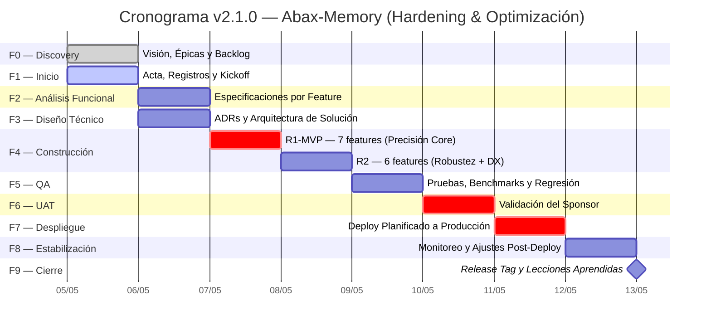

# Cronograma Preliminar — Abax-Memory v2.1.0
## "Hardening & Optimización del Motor de Memoria Multi-Dominio"

- **Fase**: 1 — Inicio
- **Entregable**: Cronograma Preliminar
- **Versión**: v2.1.0
- **Responsable**: project-manager
- **Fecha**: 2026-05-05
- **Estado**: Completado
- **Fuentes**:
  - `docs/entregables/v2.1/fase-1-inicio/acta-de-constitucion.md` (hitos y cronograma base)
  - `docs/entregables/v2.1/fase-1-inicio/matriz-riesgos.md` (16 riesgos, R-V21-014 crítico de cronograma)
  - `docs/entregables/v2.1/fase-0-descubrimiento/backlog-priorizado.md` (16 historias, R1-MVP y R2)
  - `docs/entregables/v2.1/fase-0-descubrimiento/epicas-features.md` (13 features en 4 épicas)

---

## Tabla de Contenidos

- [1. Diagrama Gantt del Proyecto](#1-diagrama-gantt-del-proyecto)
- [2. Tabla de Fases](#2-tabla-de-fases)
- [3. Hitos Clave (Milestones)](#3-hitos-clave-milestones)
- [4. Ruta Crítica](#4-ruta-crítica)
- [5. Asignación de Recursos](#5-asignación-de-recursos)
- [6. Buffer y Contingencias](#6-buffer-y-contingencias)
- [7. Supuestos del Cronograma](#7-supuestos-del-cronograma)
- [8. Control de Cambios al Cronograma](#8-control-de-cambios-al-cronograma)
- [Glosario](#glosario)

---

## 1. Diagrama Gantt del Proyecto

El siguiente diagrama muestra las 9 fases activas (F0 ya completada, F1 en curso, F2–F9 pendientes) del ciclo cascada para v2.1.0. La duración total estimada es de **6 días calendario** (2026-05-05 a 2026-05-10), con un buffer de contingencia de +1 día (hasta 2026-05-11) en caso de materialización de R-V21-014.



### Leyenda del Gantt

| Símbolo | Significado |
|---|---|
| `done` / ✅ | Fase completada y aprobada |
| `active` / 🔵 | Fase en curso |
| `crit` / 🔴 | Fase en ruta crítica (sin holgura) |
| `milestone` / ◆ | Hito de cierre (duración 0) |
| Sin marca / ⚪ | Fase pendiente |

---

## 2. Tabla de Fases

| # | Fase | Duración | Inicio | Fin Estimado | Entregables Principales | Responsable | Gate Approver | Dependencias |
|---|---|---|---|---|---|---|---|---|
| **F0** | Discovery | 1 día | 2026-05-05 | 2026-05-05 ✅ | Visión del Producto, Mapa de Épicas/Features, Backlog Priorizado, Historias de Usuario | business-analyst | product-owner | — (arranque) |
| **F1** | Inicio | 1 día | 2026-05-05 | 2026-05-05 🔵 | Acta de Constitución, Registro de Interesados, Matriz de Riesgos Inicial, Presentación de Kickoff | project-manager | product-owner | F0 |
| **F2** | Análisis Funcional | 1 día | 2026-05-06 | 2026-05-06 | Especificación Funcional por Feature (13), Criterios de Aceptación (Given/When/Then), Matriz de Trazabilidad | business-analyst | project-manager | F1 |
| **F3** | Diseño Técnico | 1 día | 2026-05-06 | 2026-05-06 | Documento de Diseño Técnico, ADRs (cross-encoder, cache JWT, caché grafo, unificación Qdrant), Diagrama de Arquitectura, Plan de Construcción | tech-lead, solution-architect | project-manager | F2 |
| **F4a** | Construcción R1-MVP | 1 día | 2026-05-07 | 2026-05-07 | Código fuente (7 features: cross-encoder, benchmark, search isolation, grafo top-3, entry points, cache JWT, unificar Qdrant), Tests unitarios | developer-backend | tech-lead | F3 |
| **F4b** | Construcción R2 | 1 día | 2026-05-08 | 2026-05-08 | Código fuente (6 features restantes: fix /extract, cold start Qdrant, N+1 + cache grafo, graphEntryStrategy, X-Graph-Strategy, unificar search/hybrid, worker, DELETE namespace), Anti-Mock Review | developer-backend | tech-lead | F4a (gate R1-MVP) |
| **F5** | QA Testing | 1 día | 2026-05-08 | 2026-05-09 | Plan de Pruebas, Casos de Prueba, Resultados de Benchmarks (SciFact, multi-dominio, carga), Reporte de Defectos | qa-lead | project-manager | F4b |
| **F6** | UAT | 1 día | 2026-05-09 | 2026-05-09 | Acta UAT, Evidencia de 10 Criterios de Éxito | product-owner | product-owner | F5 |
| **F7** | Despliegue | 1 día | 2026-05-09 | 2026-05-09 | Plan de Despliegue, Checklist Pre-Deploy, Plan de Rollback, Verificación Post-Deploy | devops | product-owner | F6 |
| **F8** | Estabilización | 1 día | 2026-05-09 | 2026-05-10 | Reporte de Monitoreo (24h), Benchmarks Post-Deploy, Lecciones Aprendidas Preliminares | devops, qa-lead | project-manager | F7 |
| **F9** | Cierre | 1 día | 2026-05-10 | 2026-05-10 | Informe de Cierre, Release Tag v2.1.0, Lecciones Aprendidas, Actualización de Docs Transversales | project-manager | product-owner | F8 |

> **Nota sobre F2 y F3**: Ambas fases están planificadas para el mismo día (2026-05-06). La especificación funcional detallada (F2) se produce en la mañana por el business-analyst. El diseño técnico y los ADRs (F3) se elaboran en la tarde por el tech-lead y solution-architect, una vez que las especificaciones están disponibles. Si los requerimientos ya están suficientemente detallados desde F0 (backlog priorizado con 16 historias), F2 podría completarse en medio día, liberando la tarde completa para F3.

> **Nota sobre F5 y F4b**: QA comienza el 2026-05-08 en cuanto las features de R2 están disponibles, pero el testing de las 7 features de R1-MVP puede iniciarse en paralelo desde el 2026-05-07 (tan pronto como R1-MVP está completo). Esto reduce el riesgo de cuello de botella en QA.

---

## 3. Hitos Clave (Milestones)

| ID | Hito | Fase | Descripción | Criterio de Aprobación | Fecha Compromiso | Estado |
|---|---|---|---|---|---|---|
| **M0** | Fase 0 Aprobada | F0 | Visión del producto, épicas, backlog priorizado y decisión de iteración aprobados | Sponsor aprueba visión y alcance | 2026-05-05 | ✅ Completado |
| **M1** | Fase 1 Aprobada | F1 | Acta de constitución, registro de interesados, matriz de riesgos y cronograma aprobados | PM presenta gate package; sponsor aprueba formalmente | 2026-05-05 | 🔵 En curso (hoy) |
| **M2** | MVP (R1) Construido | F4a | 7 features core implementadas: cross-encoder, benchmark SciFact, search isolation, grafo top-3, entry points, cache JWT, unificar Qdrant | Gate R1-MVP: CE-01, CE-03, CE-05, CE-07 verificados. Anti-mock review parcial aprobada | 2026-05-07 | ⚪ Pendiente |
| **M3** | QA Completado | F5 | Suite completa de tests funcionales, benchmarks SciFact + multi-dominio, pruebas de carga (p95). 10/10 criterios de éxito verificados | QA Lead aprueba. 0 defectos críticos abiertos. Benchmarks ≥ metas | 2026-05-08 a 2026-05-09 | ⚪ Pendiente |
| **M4** | UAT Aprobado | F6 | Validación del sponsor sobre los 10 criterios de éxito en ambiente staging | Sponsor firma Acta UAT. 10/10 CE verificados o PARTIAL documentados | 2026-05-09 | ⚪ Pendiente |
| **M5** | v2.1.0 Desplegado | F7 | Deploy planificado a producción con plan de rollback | DevOps ejecuta deploy. Verificación post-deploy exitosa. Rollback no activado | 2026-05-09 | ⚪ Pendiente |
| **M6** | Proyecto Cerrado | F9 | Informe de cierre, release tag, lecciones aprendidas, cierre formal | Sponsor aprueba cierre. Release v2.1.0 publicada | 2026-05-10 | ⚪ Pendiente |

### Línea de Tiempo de Hitos

```
May 05    May 06    May 07    May 08    May 09    May 10
  │         │         │         │         │         │
  M0✅      │         M2        M3       M4+M5     M6◆
  M1🔵      │         ▲         ▲         ▲         ▲
  ──────────┼─────────┼─────────┼─────────┼─────────┼──────
            │         │         │         │         │
           F2+F3    F4a(R1)   F4b(R2)  F6+UAT   F8+F9
                                +F5      +F7
```

---

## 4. Ruta Crítica

### 4.1 Identificación

En un proyecto cascada puro con fases secuenciales (F0→F9), la **ruta crítica es la cadena completa de fases**, ya que cada fase depende de la finalización y aprobación (gate) de la anterior. No hay fases paralelas que ofrezcan holgura.

```
F0 → F1 → F2 → F3 → F4a → F4b → F5 → F6 → F7 → F8 → F9
```

### 4.2 Camino Crítico Detallado

| Secuencia | Fase | Duración | Fecha | Holgura |
|---|---|---|---|---|
| 1 | F0 — Discovery | 1 día | 2026-05-05 | 0 ✅ |
| 2 | F1 — Inicio | 1 día | 2026-05-05 | 0 🔵 |
| 3 | F2 — Análisis Funcional | 1 día | 2026-05-06 | 0 |
| 4 | F3 — Diseño Técnico | 1 día | 2026-05-06 | 0 |
| 5 | F4a — Construcción R1-MVP | 1 día | 2026-05-07 | 0 |
| 6 | F4b — Construcción R2 | 1 día | 2026-05-08 | 0 |
| 7 | F5 — QA Testing | 1 día | 2026-05-08–09 | 0 |
| 8 | F6 — UAT | 1 día | 2026-05-09 | 0 |
| 9 | F7 — Despliegue | 1 día | 2026-05-09 | 0 |
| 10 | F8 — Estabilización | 1 día | 2026-05-09–10 | 0 |
| 11 | F9 — Cierre | 1 día | 2026-05-10 | 0 |
| **Total** | **11 pasos, 9 fases activas** | **6 días** | | **0 días de holgura** |

### 4.3 Implicaciones

- **Holgura cero**: cualquier retraso en una fase se propaga 1:1 a la fecha de cierre.
- **F2 y F3 son el primer punto de estrangulamiento**: si las especificaciones funcionales no están listas en la mañana del 2026-05-06, el diseño técnico se retrasa a la tarde/noche o al día siguiente, desplazando todo el cronograma.
- **F4a (R1-MVP) es el punto de decisión**: si R1-MVP no se completa el 2026-05-07, el sponsor debe decidir si R2 se ejecuta (comprimiendo QA) o se difiere a v2.2.0 (liberando presión sobre F4b y F5).
- **F4b y F5 comparten el 2026-05-08**: el único solapamiento permisible es que QA comience a probar features de R1-MVP mientras R2 se termina de construir.

### 4.4 Diagrama de Ruta Crítica


---

## 5. Asignación de Recursos

### 5.1 Matriz de Participación por Fase

Basada en la matriz RACI del Acta de Constitución (sección 6.2). Se indica el nivel de involucramiento esperado para cada uno de los 9 agentes del equipo.

| Rol (Agente) | F0 | F1 | F2 | F3 | F4a | F4b | F5 | F6 | F7 | F8 | F9 |
|---|---|---|---|---|---|---|---|---|---|---|---|
| **product-owner** (Sponsor) | A | I | I | I | I | I | I | R/A | A | I | A |
| **project-manager** | R | A | A | A | A | A | A | A | R | R | R |
| **business-analyst** | R | R | R | C | C | C | C | C | I | I | C |
| **tech-lead** | C | C | C | R | R | R | C | C | C | C | C |
| **solution-architect** | C | C | C | R | C | C | I | I | C | C | C |
| **developer-backend** | I | I | I | C | R | R | C | I | C | C | I |
| **qa-lead** | I | I | I | I | C | C | R | C | I | C | I |
| **devops** | I | I | I | C | C | C | C | I | R | R | C |
| **developer-frontend** | I | I | I | I | I | I | I | C | I | I | I |

> **Leyenda**: R = Responsible (ejecuta), A = Accountable (aprueba/gate), C = Consulted (consultado), I = Informed (informado)

### 5.2 Carga de Trabajo por Fase

| Fase | Roles con dedicación ≥ 50% | Intensidad |
|---|---|---|
| F0 — Discovery | PM, BA (100%) | Alta |
| F1 — Inicio | PM (100%), BA (100%) | Alta |
| F2 — Análisis Funcional | BA (100%), PM (50%) | Media-Alta |
| F3 — Diseño Técnico | TL (100%), SA (100%), PM (30%) | Alta |
| F4a — Construcción R1-MVP | DEV (100%), TL (50%), PM (30%) | Alta |
| F4b — Construcción R2 | DEV (100%), TL (30%), PM (30%) | Alta |
| F5 — QA Testing | QA (100%), DEV (30%), TL (20%) | Alta |
| F6 — UAT | Sponsor (50%), PM (50%), QA (30%) | Media |
| F7 — Despliegue | DevOps (100%), PM (100%), TL (30%) | Alta |
| F8 — Estabilización | DevOps (50%), QA (50%), PM (100%) | Media |
| F9 — Cierre | PM (100%), Sponsor (30%) | Media |

### 5.3 Notas sobre Recursos

1. **Developer Backend es el cuello de botella**: un solo agente implementa las 13 features. Si el esfuerzo real excede la estimación, R2 se difiere a v2.2.0 (decisión en gate R1-MVP, M2).
2. **Tech Lead como soporte**: puede implementar historias de baja complejidad (cache JWT, headers HTTP) si el developer-backend está saturado.
3. **QA Lead puede iniciar parcialmente en F4a**: diseñar casos de prueba y ejecutar tests de R1-MVP mientras R2 se construye.
4. **Developer Frontend**: sin cambios funcionales en UI React. Rol de verificación de no-regresión en F5–F6.
5. **DevOps**: carga concentrada en F7–F8. Debe preparar scripts de deploy y rollback durante F4 (construcción) como actividad de fondo.

---

## 6. Buffer y Contingencias

### 6.1 Reserva de Contingencia

| Tipo | Duración | Activación | Ubicación en el Cronograma |
|---|---|---|---|
| **Buffer de Cronograma** | +1 día (2026-05-11) | Si R-V21-014 se materializa (cronograma comprimido no se cumple) | Posterior a F9. Funciona como "día extra" que puede insertarse entre cualquier fase |
| **Buffer de R1-MVP** | +0.5 día (tarde del 2026-05-07) | Si R1-MVP requiere > 1 día | Se consume del día de R2 (F4b), comprimiendo R2 o difiriéndolo parcialmente |
| **Buffer de QA** | +0.5 día (mañana del 2026-05-09) | Si los benchmarks o tests revelan defectos que requieren re-trabajo | Se consume del día de UAT (F6), acortando la ventana de validación del sponsor |
| **Buffer de Rollback** | Incluido en plan de despliegue | Si el deploy a producción falla y se requiere rollback + re-deploy | El plan de despliegue (F7) incluye una ventana de rollback de 2 horas. Si se activa, F8 (estabilización) se acorta proporcionalmente |

### 6.2 Contingencias por Riesgo Específico

Cada riesgo identificado en la [Matriz de Riesgos](matriz-riesgos.md) tiene un plan de contingencia documentado. Los que impactan directamente el cronograma son:

| Riesgo | Severidad | Impacto en Cronograma | Gatillo | Acción de Cronograma |
|---|---|---|---|---|
| **R-V21-014** — Cronograma comprimido | 🔴 Crítico | +1–2 días | R1-MVP no completado al cierre del 2026-05-07 | (a) Extender F4a a 2 días, recortar R2. (b) Diferir R2 completo a v2.2.0. (c) Escalar al sponsor para extensión de cronograma |
| **R-V21-001** — Reranker no alcanza meta NDCG@10 | 🟠 Alto | +0.5 día | Benchmark SciFact ≤ 0.82 en primera iteración | Iteración adicional de prompt engineering o cambio de modelo cross-encoder; consumir buffer de R1-MVP |
| **R-V21-007** — OpenAI API no disponible | 🟠 Alto | +0.5–1 día | HTTP 429/401 al iniciar F4 | Usar modelo local `allenai/scifact` como fallback; diferir benchmarks con OpenAI a F8 (post-deploy) |
| **R-V21-010** — Scope creep en R2 | 🟡 Medio | +0.5 día por feature expandida | Una feature "M" requiere > 5 archivos de cambio | Activar control de cambios formal; recortar features Could de R2; diferir a v2.2.0 |
| **R-V21-013** — Cross-encoder excede presupuesto de latencia | 🟠 Alto | +0.5 día | Latencia incremental > 200ms por query | Reducir batch size del cross-encoder (20→10 pares); implementar timeout estricto de 250ms |

### 6.3 Protocolo de Activación de Contingencia

1. **Detección**: el PM o responsable de fase detecta una desviación ≥ 0.5 días respecto al cronograma base.
2. **Notificación**: el PM notifica al sponsor en ≤ 2 horas, indicando el riesgo materializado, el impacto estimado, y la contingencia propuesta.
3. **Decisión**: el sponsor aprueba o rechaza la activación de la contingencia. Si el impacto es > 1 día, se requiere control de cambios formal.
4. **Ejecución**: se activa la contingencia aprobada y se actualiza el cronograma en este documento.
5. **Comunicación**: se notifica a todos los stakeholders el nuevo cronograma y las fases afectadas.

### 6.4 Cronograma con Buffer Visualizado

```
May 05 │ May 06 │ May 07 │ May 08 │ May 09 │ May 10 │ May 11
───────┼────────┼────────┼────────┼────────┼────────┼────────
F0✅ F1 │ F2+F3  │  F4a   │ F4b+F5 │ F6+F7  │ F8+F9  │ BUFFER
       │        │        │        │        │        │ (cont.)
```

> El buffer del 2026-05-11 **no está asignado a ninguna fase**. Se activa exclusivamente si el cronograma base no se cumple y el sponsor aprueba la extensión. En condiciones normales, el proyecto cierra el 2026-05-10.

---

## 7. Supuestos del Cronograma

Este cronograma asume las siguientes condiciones. Si alguna no se cumple, se debe re-evaluar el cronograma inmediatamente.

| ID | Supuesto | Impacto si no se cumple |
|---|---|---|
| **CS-01** | Las 16 historias de usuario están correctamente dimensionadas (S/M/L) y el esfuerzo real no excede el estimado | R-V21-014 se materializa; se activa buffer de R1-MVP o se difiere R2 |
| **CS-02** | El business-analyst completa las 13 especificaciones funcionales en ≤ 4 horas (mañana del 2026-05-06) | F3 (Diseño Técnico) se retrasa a la tarde/noche del 2026-05-06 o al 2026-05-07 |
| **CS-03** | El tech-lead y solution-architect producen ADRs y diseño en ≤ 4 horas (tarde del 2026-05-06) | F4a (Construcción) no puede iniciar el 2026-05-07; se desplaza todo el cronograma |
| **CS-04** | La API key de OpenAI está activa y con créditos suficientes durante toda F4 | R-V21-007 se materializa; se usa modelo local como fallback |
| **CS-05** | El ambiente de staging/QA está disponible y es réplica fiel de producción | Las pruebas de QA y UAT no son representativas; riesgo de defectos en producción |
| **CS-06** | No hay indisponibilidad de agentes del equipo durante el ciclo del proyecto (2026-05-05 a 2026-05-10) | Retraso en fases donde el agente es Responsible (R) |
| **CS-07** | Los benchmarks de v2.0.0 son reproducibles en el ambiente actual | R-V21-011 se materializa; CE-03 y CE-04 se verifican solo con valores absolutos de v2.1.0 |

---

## 8. Control de Cambios al Cronograma

### 8.1 Reglas de Modificación

| Tipo de Cambio | Quién lo Aprueba | Proceso |
|---|---|---|
| Ajuste ≤ 4 horas dentro de una misma fase | Project Manager | Notificación al sponsor (no requiere aprobación) |
| Desplazamiento de una fase completa ≤ 1 día | Project Manager | Notificación al sponsor con justificación (no requiere control de cambios formal) |
| Extensión del cronograma > 1 día | Sponsor | Control de cambios formal: solicitud → evaluación de impacto → aprobación/rechazo |
| Reducción de alcance (diferir historias a v2.2.0) | Sponsor | Decisión en gate R1-MVP (M2). Ya contemplado en RSK-08 / R-V21-010 |
| Cancelación de una fase completa | Sponsor | Control de cambios formal con evaluación de impacto en criterios de éxito |

### 8.2 Log de Cambios al Cronograma

| ID | Fecha | Cambio Solicitado | Impacto | Decisión | Aprobador |
|---|---|---|---|---|---|
| — | — | — | — | — | — |

> Este log se completa durante la ejecución del proyecto. La versión inicial (v1.0) del cronograma no tiene cambios registrados.

---

## Glosario

- **Ruta Crítica**: Secuencia más larga de actividades dependientes que determina la duración mínima del proyecto. Cualquier retraso en una actividad de la ruta crítica retrasa el proyecto completo.
- **Holgura**: Cantidad de tiempo que una actividad puede retrasarse sin afectar la fecha de finalización del proyecto. En cascada pura con fases secuenciales, la holgura es típicamente cero.
- **Buffer**: Tiempo adicional reservado para absorber incertidumbre sin afectar la fecha de entrega comprometida. No está asignado a ninguna actividad específica.
- **Gantt**: Diagrama de barras que representa la duración de las fases y sus dependencias temporales en una línea de tiempo. El eje horizontal es el tiempo; las barras representan la duración de cada fase.
- **ADR**: Architecture Decision Record — documento que registra una decisión arquitectónica, su contexto, alternativas evaluadas y consecuencias. Obligatorio para decisiones que afectan stack, integraciones o modelo de datos.
- **R1-MVP**: Release 1 — Minimum Viable Product. Subconjunto de 7 historias que constituye el mínimo liberable de v2.1.0, cubriendo 5/10 criterios de éxito.
- **NDCG@10**: Normalized Discounted Cumulative Gain — métrica de ranking que evalúa la calidad del orden de los 10 primeros resultados. Meta v2.1.0: ≥ 0.85 en SciFact.

---

> **Control de versión de este documento**:
> - **v1.0** — 2026-05-05 — Apertura del cronograma preliminar durante F1-Inicio. Línea base sujeta a aprobación en gate F1 (M1).
> - **Próxima revisión**: Gate F1 (2026-05-05, hoy) y al inicio de cada fase subsiguiente.
