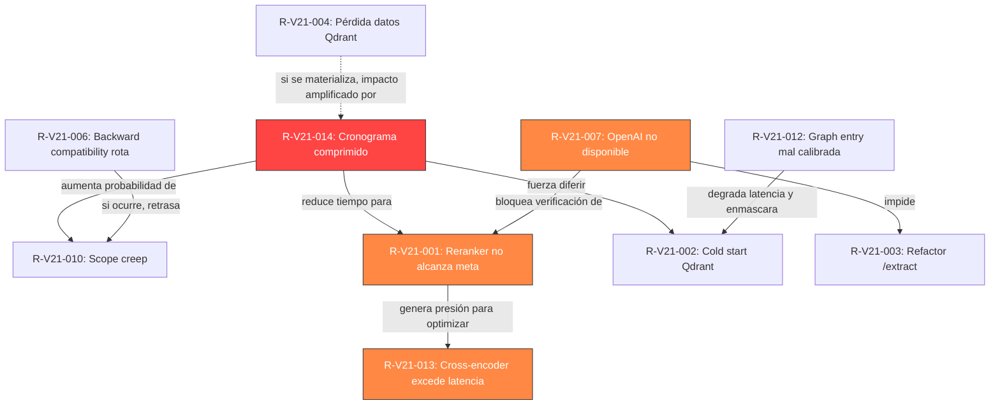

# Matriz de Riesgos Inicial — Abax-Memory v2.1.0
## Hardening y Optimización del Motor de Memoria Multi-Dominio

---

## Tabla de Contenidos

- [1. Contexto y Propósito](#1-contexto-y-propósito)
- [2. Registro de Riesgos](#2-registro-de-riesgos)
  - [2.1 Riesgos Técnicos](#21-riesgos-técnicos)
  - [2.2 Riesgos de Cronograma](#22-riesgos-de-cronograma)
  - [2.3 Riesgos de Dependencia Externa](#23-riesgos-de-dependencia-externa)
  - [2.4 Riesgos de Equipo](#24-riesgos-de-equipo)
  - [2.5 Riesgos de Alcance](#25-riesgos-de-alcance)
- [3. Matriz de Calor](#3-matriz-de-calor)
- [4. Top 5 Riesgos por Severidad](#4-top-5-riesgos-por-severidad)
- [5. Plan de Respuesta por Nivel de Severidad](#5-plan-de-respuesta-por-nivel-de-severidad)
- [6. Calendario de Monitoreo de Riesgos](#6-calendario-de-monitoreo-de-riesgos)
- [7. Trazabilidad — Riesgos a Features e Historias de Usuario](#7-trazabilidad--riesgos-a-features-e-historias-de-usuario)
- [8. Mapa de Dependencias entre Riesgos](#8-mapa-de-dependencias-entre-riesgos)
- [Glosario](#glosario)

---

## 1. Contexto y Propósito

### 1.1 Proyecto

Abax-Memory v2.1.0 es una iteración de **hardening y optimización** sobre v2.0.9. Implementa **13 features** en **4 épicas** con un equipo de **9 agentes**, metodología cascada completa (F0 → F9), y stack Quarkus/PostgreSQL/Qdrant/Keycloak/OpenAI. El cronograma comprimido contempla 4 días de construcción (R1-MVP: 2026-05-07, R2: 2026-05-08) y cierre el 2026-05-10.

### 1.2 Propósito de esta Matriz

Este documento identifica, evalúa y planifica la respuesta a **16 riesgos específicos** de la iteración v2.1.0. Cada riesgo se clasifica por probabilidad, impacto, severidad, y se vincula a las features e historias de usuario afectadas. La matriz se actualizará al inicio de cada fase del proyecto.

### 1.3 Relación con Riesgos del Backlog

El Backlog Priorizado identificó 8 riesgos preliminares (RSK-01 a RSK-08) durante la fase de Descubrimiento. Este documento los **formaliza, expande y profundiza** con: señales tempranas, responsables, planes de contingencia detallados, y trazabilidad completa a historias de usuario. Los IDs originales del backlog se referencian en cada riesgo correspondiente para mantener la cadena de trazabilidad.

| RSK Backlog | Riesgo en esta Matriz | Evolución |
|---|---|---|
| RSK-01 | R-V21-001 | Formalizado con señales tempranas, contingencia y responsable |
| RSK-02 | R-V21-007 | Ampliado: no solo afecta `/extract` sino también benchmarks del reranker |
| RSK-03 | R-V21-004 | Formalizado con checklist pre-migración detallado |
| RSK-04 | R-V21-002 | Ampliado con diagnóstico estructurado y plan de escalamiento |
| RSK-05 | R-V21-005 | Formalizado con árbol de decisión (eliminar vs reparar) |
| RSK-06 | R-V21-006 | Ampliado con suite de regresión y validación de headers HTTP |
| RSK-07 | R-V21-008 | Formalizado con tests de seguridad y mecanismo de invalidación |
| RSK-08 | R-V21-010 | Desdoblado en R-V21-010 (scope creep) y R-V21-014 (cronograma) |

---

## 2. Registro de Riesgos

### 2.1 Riesgos Técnicos

#### R-V21-001: Reranker Cross-Encoder no Alcanza la Meta de Precisión

| Campo | Valor |
|---|---|
| **ID** | R-V21-001 |
| **Categoría** | Técnico |
| **Descripción** | El modelo cross-encoder (OpenAI `gpt-4o-mini` o `allenai/scifact`) integrado como segunda etapa del pipeline no produce la mejora de +10-15 puntos en top-1 prometida. El NDCG@10 en SciFact se mantiene en ~0.78 en lugar de alcanzar ≥ 0.85. La inversión en el reranker no se traduce en ganancia de precisión medible. |
| **Probabilidad** | Media |
| **Impacto** | Alto |
| **Severidad** | **Alto** |
| **Señal temprana** | El benchmark SciFact ejecutado tras integrar el cross-encoder muestra NDCG@10 ≤ 0.82 en la primera iteración (gap ≥ 0.03 respecto a la meta). El ground-truth document no asciende en el ranking en ≥ 50% de los casos donde el dense retrieval falló. |
| **Mitigación** | 1. HU-V21-001 incluye criterio de aceptación de degradación graceful (si el cross-encoder no está disponible, el pipeline opera en modo dense-only sin fallar). 2. HU-V21-002 exige verificación cuantitativa temprana (benchmark SciFact completo apenas el cross-encoder esté integrado, no al final de F4). 3. Evaluar dos proveedores en paralelo (OpenAI `gpt-4o-mini` y modelo local `allenai/scifact`) para comparar precisión. 4. El prompt de OpenAI para el cross-encoder debe incluir instrucciones de entailment específicas para SciFact. |
| **Contingencia** | Si el cross-encoder no alcanza la meta NDCG@10 ≥ 0.85: (a) documentar el valor real obtenido y la brecha; (b) evaluar fine-tuning de `allenai/scifact` con datos del dominio (requiere S-M-L de esfuerzo adicional); (c) si la mejora es parcial pero significativa (≥ 0.82), declarar CE-03 como PARTIAL con justificación; (d) la release v2.1.0 se libera con la precisión alcanzada — el pipeline sigue funcional. Escalar al sponsor en el gate R1-MVP. |
| **Responsable** | tech-lead |
| **Historias afectadas** | HU-V21-001, HU-V21-002 |
| **Referencia backlog** | RSK-01 |

---

#### R-V21-002: Cold Start y Locks de Qdrant No se Resuelven

| Campo | Valor |
|---|---|
| **ID** | R-V21-002 |
| **Categoría** | Técnico |
| **Descripción** | La investigación de causa raíz de HU-V21-009 no identifica el origen de los spikes de latencia p95 ~2s en Qdrant. Las mitigaciones basadas en configuración (`optimizers_config`, `flush_interval_sec`, `read_consistency`) no son suficientes y el problema persiste sin diagnóstico claro, impidiendo cumplir CE-02 (p95 ≤ 500ms estable). |
| **Probabilidad** | Media |
| **Impacto** | Medio |
| **Severidad** | **Medio** |
| **Señal temprana** | Tras 2 días de investigación, el diagnóstico no produce un documento con al menos 1 causa raíz específica respaldada por evidencia de logs o métricas de Qdrant. Las pruebas de carga en QA muestran que la latencia p95 sigue > 500ms en al menos 1 de los 3 escenarios (cold start, steady state, bajo escritura concurrente). |
| **Mitigación** | 1. El primer entregable de HU-V21-009 debe ser el documento de diagnóstico (ADR o runbook), no la mitigación. 2. Activar logs DEBUG en Qdrant durante las pruebas de carga para capturar tiempos de segmento, GC pauses y locks. 3. Involucrar a devops desde F2 (diseño técnico) para instrumentar Qdrant con métricas de Prometheus: `qdrant_segments_search_time_seconds`, `qdrant_collections_locks_wait_seconds`. 4. Supuesto S-04 asume que las mitigaciones son solo de configuración — validar este supuesto en el diagnóstico. |
| **Contingencia** | Si el diagnóstico no encuentra causa raíz configurable: (a) escalar a devops para upgrade de Qdrant a 1.18+ (requiere ADR por R-01); (b) si el upgrade no es viable en el ciclo de v2.1.0, declarar CE-02 como PARTIAL con la latencia real alcanzada y documentar el cold start como deuda técnica para v2.2.0; (c) el pipeline sin grafo (búsqueda semántica pura) puede cumplir p95 ≤ 500ms aun si el pipeline con grafo no — reportar ambos valores por separado. |
| **Responsable** | devops |
| **Historias afectadas** | HU-V21-009 |
| **Referencia backlog** | RSK-04 |

---

#### R-V21-003: `POST /extract` Requiere Refactor Profundo del Pipeline

| Campo | Valor |
|---|---|
| **ID** | R-V21-003 |
| **Categoría** | Técnico |
| **Descripción** | Reemplazar `MockLlmService` por OpenAI real en `POST /extract` no es un cambio superficial de dependencia. El pipeline de extracción actual (basado en regex) puede tener acoplamiento con el formato de respuesta, el modelo de entidades, o los consumidores del endpoint. El refactor podría requerir cambios en el `EntityExtractorService`, el `LlmClient`, o incluso el modelo de datos de entidades (violando R-04). |
| **Probabilidad** | Media |
| **Impacto** | Medio |
| **Severidad** | **Medio** |
| **Señal temprana** | Durante el spike técnico inicial de HU-V21-006, el developer-backend reporta que `MockLlmService` está referenciado en más de 3 clases o que el contrato de respuesta del endpoint está acoplado al formato regex (campos específicos que OpenAI no devuelve en el mismo formato). |
| **Mitigación** | 1. Ejecutar un spike técnico de 2-4 horas como primer paso de HU-V21-006: mapear todas las referencias a `MockLlmService`, entender el contrato actual del endpoint, y diseñar el adapter para OpenAI antes de escribir código. 2. Mantener el endpoint `POST /extract` con el mismo contrato de respuesta (no cambiar el schema JSON), limitando el cambio al proveedor interno. 3. HU-V21-006 es Should (no Must) — si el refactor es más costoso de lo estimado, puede moverse al final de R2 o diferirse sin bloquear R1-MVP. |
| **Contingencia** | Si el refactor excede el esfuerzo estimado (L → XL): (a) entregar HU-V21-006 con alcance reducido: `POST /extract` usa OpenAI pero solo para los tipos de entidad que no requieren cambio de schema; (b) documentar las entidades pendientes como deuda técnica; (c) si el refactor es inviable en v2.1.0, diferir completamente a v2.2.0 — el endpoint ya funciona con MockLlmService y no es bloqueante para los criterios de éxito core (CE-01 a CE-05). Escalar al sponsor si se requiere diferir. |
| **Responsable** | developer-backend |
| **Historias afectadas** | HU-V21-006 |
| **Referencia backlog** | — (Riesgo nuevo específico de implementación) |

---

#### R-V21-004: Unificación de Colecciones Qdrant Causa Pérdida de Datos

| Campo | Valor |
|---|---|
| **ID** | R-V21-004 |
| **Categoría** | Técnico |
| **Descripción** | La migración de la colección `abax-memories-v1` a `abax-memories-v2` (o la eliminación directa de v1) falla o corrompe datos. Puntos vectoriales quedan huérfanos (sin referencia desde PostgreSQL), o la verificación pre-migración no detecta dependencias ocultas y se eliminan datos que sí estaban en uso. |
| **Probabilidad** | Baja |
| **Impacto** | Alto |
| **Severidad** | **Medio** |
| **Señal temprana** | La verificación pre-migración (primer paso de HU-V21-012) encuentra puntos en `abax-memories-v1` que están referenciados desde la tabla `memories` en PostgreSQL. Esto contradice el supuesto S-02 ("solo datos residuales"). |
| **Mitigación** | 1. HU-V21-012 exige explícitamente una verificación pre-migración documentada en un checklist antes de cualquier operación destructiva. 2. La verificación debe ejecutar un query SQL que cruce `memory_id` en PostgreSQL contra `point_id` en Qdrant para ambas colecciones. 3. Si se encuentran datos activos en v1, se debe ejecutar un script de migración (mover puntos de v1 a v2) antes de eliminar. 4. Tomar un snapshot de Qdrant antes de la operación de eliminación (requiere acceso de devops). 5. Ejecutar la unificación primero en ambiente de staging/QA y validar con 50 queries de la suite multi-dominio. |
| **Contingencia** | Si se detectan datos activos en `abax-memories-v1`: (a) pausar la eliminación inmediatamente; (b) crear script de migración punto-por-punto con verificación de integridad (hash de vector); (c) el esfuerzo de HU-V21-012 pasa de M a L; (d) si la migración es demasiado costosa para v2.1.0, diferir la unificación a v2.2.0 y declarar CE-05 como diferido con justificación. Si ocurre pérdida de datos en producción: activar rollback desde snapshot de Qdrant y escalar inmediatamente al sponsor. |
| **Responsable** | devops |
| **Historias afectadas** | HU-V21-012 |
| **Referencia backlog** | RSK-03 |

---

#### R-V21-005: Worker de Procesamiento Tiene Dependencias Ocultas

| Campo | Valor |
|---|---|
| **ID** | R-V21-005 |
| **Categoría** | Técnico |
| **Descripción** | Eliminar el worker de procesamiento asíncrono (`Claimed=0`) rompe una dependencia no documentada. El worker podría estar referenciado en: health checks del orquestador, scripts de deploy, configuración de Docker Compose, o monitoreo que espera el proceso worker corriendo. Su eliminación causa fallos en cascada no previstos. |
| **Probabilidad** | Media |
| **Impacto** | Bajo |
| **Severidad** | **Bajo** |
| **Señal temprana** | Durante el diagnóstico (primer paso de HU-V21-011), se encuentran referencias al worker en `docker-compose.yml`, `application.properties`, health checks de Kubernetes, o scripts de CI/CD. |
| **Mitigación** | 1. HU-V21-011 debe comenzar con un mapeo completo de referencias al worker en todo el repositorio (grep por `worker`, `WorkerService`, `Claimed`, nombres de cola). 2. Si el worker se elimina, actualizar simultáneamente: `docker-compose.yml`, health checks, scripts de deploy, documentación de arquitectura. 3. Ejecutar el despliegue en staging sin el worker y verificar que: health checks pasan, ingesta funciona, búsqueda funciona, monitoreo no alerta. |
| **Contingencia** | Si la eliminación del worker causa fallos: (a) restaurar el worker inmediatamente (revertir el cambio); (b) documentar las dependencias descubiertas; (c) planificar la eliminación en v2.2.0 con un plan de migración que aborde cada dependencia. Si el worker debe repararse (no eliminarse), el esfuerzo de HU-V21-011 pasa de M a L. |
| **Responsable** | developer-backend |
| **Historias afectadas** | HU-V21-011 |
| **Referencia backlog** | RSK-05 |

---

#### R-V21-006: Backward Compatibility Rota en API de Búsqueda

| Campo | Valor |
|---|---|
| **ID** | R-V21-006 |
| **Categoría** | Técnico |
| **Descripción** | Los cambios en los endpoints `search` y `hybrid` (unificación, nuevos parámetros, cambios en el pipeline semántico) rompen la backward compatibility exigida por R-02. Consumidores existentes que usan `POST /memories/search` o `POST /memories/hybrid` con el formato de v2.0.9 reciben errores 400, resultados diferentes, o campos faltantes en la respuesta. |
| **Probabilidad** | Baja |
| **Impacto** | Alto |
| **Severidad** | **Medio** |
| **Señal temprana** | La suite de regresión de 100 test cases multi-dominio ejecutada contra el endpoint unificado produce resultados diferentes a v2.0.9 en ≥ 5% de los casos, o el endpoint `hybrid` legacy retorna error en lugar del warning `Deprecation: true`. |
| **Mitigación** | 1. R-02 es una restricción no negociable. HU-V21-015 exige explícitamente que `POST /memories/hybrid` siga funcional con warning de deprecación. 2. Ejecutar la suite de regresión de 100 test cases multi-dominio de v2.0.0 contra el nuevo endpoint unificado y contra el endpoint legacy `hybrid` antes de marcar HU-V21-015 como completada. 3. Los nuevos parámetros (`semanticWeight`, `lexicalWeight`, `expandGraph`) deben ser opcionales con defaults que reproduzcan el comportamiento de v2.0.9. 4. El schema de respuesta no debe eliminar ningún campo existente; solo puede agregar campos nuevos opcionales. |
| **Contingencia** | Si se detecta una ruptura de backward compatibility: (a) detener el despliegue; (b) identificar el cambio específico que rompe la compatibilidad; (c) restaurar el comportamiento legacy como default y colocar el nuevo comportamiento detrás de un feature flag o header; (d) si la ruptura es inevitable (ej. cambio en el modelo de scoring), documentar un plan de migración para consumidores y requerir aprobación explícita del sponsor mediante control de cambios formal. |
| **Responsable** | tech-lead |
| **Historias afectadas** | HU-V21-015 |
| **Referencia backlog** | RSK-06 |

---

#### R-V21-013: Cross-Encoder Excede el Presupuesto de Latencia de 200ms

| Campo | Valor |
|---|---|
| **ID** | R-V21-013 |
| **Categoría** | Técnico |
| **Descripción** | El cross-encoder, procesando hasta 20 pares (query, documento) por request, añade más de 200ms de latencia incremental respecto al dense retrieval puro. Esto empuja la latencia total de `POST /memories/search` (sin expandGraph) por encima de la meta p95 ≤ 500ms (CE-02), creando un conflicto directo entre precisión (CE-01/CE-03) y velocidad (CE-02). |
| **Probabilidad** | Media |
| **Impacto** | Alto |
| **Severidad** | **Alto** |
| **Señal temprana** | Las pruebas de latencia del cross-encoder en ambiente de desarrollo muestran que cada evaluación de par (query, documento) toma ≥ 15ms con OpenAI, resultando en 20 × 15 = 300ms solo para el reranker, excediendo el presupuesto de 200ms. |
| **Mitigación** | 1. HU-V21-001 establece un límite máximo de 20 candidatos a evaluar por el cross-encoder. Si 20 es demasiado, evaluar reducir a top-15 o top-10 con una validación de que el recall no se degrada. 2. Usar batch processing: enviar los 20 pares en una sola llamada a OpenAI (si el modelo lo soporta) en lugar de 20 llamadas individuales. 3. Implementar un timeout estricto de 250ms para la etapa de cross-encoder; si se excede, servir los resultados del dense retrieval sin reranking. 4. Considerar modelo local (`allenai/scifact`) que podría tener latencia más predecible que OpenAI. |
| **Contingencia** | Si el cross-encoder consistentemente excede el presupuesto de latencia: (a) reducir el batch size a top-10 y medir impacto en NDCG@10; (b) implementar reranking asíncrono (el resultado inmediato es dense-only, el reranking se aplica en background y se actualiza en una segunda response vía `Preference-Applied: reranked`); (c) si ninguna optimización es suficiente, reportar el trade-off precisión vs latencia al sponsor para decisión: priorizar CE-01 (precisión) o CE-02 (latencia). |
| **Responsable** | tech-lead |
| **Historias afectadas** | HU-V21-001, HU-V21-002 |
| **Referencia backlog** | — (Riesgo nuevo derivado de la interacción CE-01 vs CE-02) |

---

#### R-V21-015: Regresión en Dense Retrieval por Cambios en el Pipeline

| Campo | Valor |
|---|---|
| **ID** | R-V21-015 |
| **Categoría** | Técnico |
| **Descripción** | Las modificaciones al pipeline de búsqueda para aislar el comportamiento semántico (HU-V21-003), integrar el cross-encoder (HU-V21-001), y cambiar la expansión de grafo (HU-V21-004) introducen una regresión no detectada en el dense retrieval base. La precisión del pipeline sin cross-encoder y sin grafo es peor que en v2.0.9. |
| **Probabilidad** | Baja |
| **Impacto** | Alto |
| **Severidad** | **Medio** |
| **Señal temprana** | Los tests unitarios del `DenseRetrievalService` fallan tras los cambios de pipeline. La suite multi-dominio ejecutada con `expandGraph: false` y sin cross-encoder muestra top-1 < 0.75 (línea base v2.0.9 ~0.75-0.80). |
| **Mitigación** | 1. Ejecutar la suite multi-dominio de 100 test cases antes de iniciar cualquier cambio en el pipeline para establecer la línea base exacta de v2.0.9. 2. Tras cada cambio mayor en el pipeline (aislar búsqueda semántica, integrar cross-encoder, cambiar expansión de grafo), re-ejecutar la suite sin el nuevo componente para verificar que el dense retrieval base no se degradó. 3. Tests unitarios del `DenseRetrievalService` deben pasar en cada commit. |
| **Contingencia** | Si se detecta regresión: (a) git bisect para identificar el commit que introdujo la regresión; (b) revertir el cambio específico y aislarlo en una rama separada; (c) si la regresión es inherente a un cambio necesario (ej. el aislamiento semántico requiere modificar el pipeline de forma que afecta el scoring), documentar el trade-off y escalar al tech-lead para decisión de arquitectura. |
| **Responsable** | developer-backend |
| **Historias afectadas** | HU-V21-001, HU-V21-003, HU-V21-004 |
| **Referencia backlog** | — (Riesgo nuevo de regresión) |

---

#### R-V21-016: Caché de Grafo (Caffeine) Introduce Inconsistencia de Datos

| Campo | Valor |
|---|---|
| **ID** | R-V21-016 |
| **Categoría** | Técnico |
| **Descripción** | La caché en memoria de resultados de expansión de grafo (HU-V21-008) sirve datos stale después de que el grafo fue modificado (nueva memoria, nueva relación, o eliminación). Dos queries consecutivas reciben diferentes resultados de grafo porque la invalidación de caché no se disparó correctamente. |
| **Probabilidad** | Media |
| **Impacto** | Medio |
| **Severidad** | **Medio** |
| **Señal temprana** | Los tests de integración de HU-V21-008 que verifican invalidación tras añadir una relación muestran que la segunda query sigue sirviendo desde caché (cache hit en lugar de cache miss). |
| **Mitigación** | 1. HU-V21-008 exige explícitamente un criterio de aceptación de invalidación: "cuando se añade una nueva relación al grafo, la entrada del caché para ese entry point se invalida". 2. Implementar invalidación por evento: al crear/eliminar una memoria o relación, publicar un evento `GraphModified` que invalide las entradas de caché afectadas. 3. TTL conservador (30-60 segundos) como red de seguridad: incluso si la invalidación por evento falla, los datos stale expiran rápidamente. 4. Métrica `graph_cache_stale_hit` expuesta para monitorear hits a entradas que debieron ser invalidadas. |
| **Contingencia** | Si la invalidación por evento es frágil: (a) reducir TTL a 10-15 segundos; (b) considerar caché por query hash en lugar de por entry point (más preciso pero menos reutilizable); (c) si la inconsistencia persiste, deshabilitar la caché de grafo para v2.1.0 (la feature es Could, no bloqueante) y diferir a v2.2.0 con un mecanismo de invalidación más robusto. |
| **Responsable** | developer-backend |
| **Historias afectadas** | HU-V21-008 |
| **Referencia backlog** | — (Riesgo nuevo de caché) |

---

### 2.2 Riesgos de Cronograma

#### R-V21-010: Scope Creep — Las 13 Features se Expanden Durante el Desarrollo

| Campo | Valor |
|---|---|
| **ID** | R-V21-010 |
| **Categoría** | Alcance |
| **Descripción** | Durante la construcción, el equipo descubre que las features requieren más trabajo del estimado. Las historias "L" se convierten en "XL", las "M" en "L". Features que el backlog estimó como acotadas revelan complejidad oculta. El alcance de 13 features se expande de facto sin control de cambios formal. |
| **Probabilidad** | Media |
| **Impacto** | Medio |
| **Severidad** | **Medio** |
| **Señal temprana** | Durante F2 (Diseño Técnico) o el inicio de F4 (Construcción), el developer-backend o tech-lead reportan que una feature "M" requiere cambios en más de 5 archivos o toca módulos no previstos. El esfuerzo estimado de R1-MVP pasa de 6.0 sp a ≥ 9.0 sp. |
| **Mitigación** | 1. La restricción R-06 exige cascada completa. La fase F2 (Diseño Técnico) debe producir estimaciones de esfuerzo detalladas por feature antes de iniciar F4. 2. El backlog ya divide el trabajo en R1-MVP (7 historias, 5 criterios de éxito) y R2 (9 historias). R1-MVP es el mínimo liberable — si R1-MVP se completa, v2.1.0 ya tiene valor. 3. Cualquier expansión de alcance debe pasar por control de cambios formal (ver Acta de Constitución, sección 11.1). No se permite "hacerlo y después documentarlo". 4. El PM revisa el avance diario contra el plan y activa el gate R1-MVP como punto de decisión. |
| **Contingencia** | Si el scope creep amenaza el cronograma: (a) el gate R1-MVP es el punto de decisión — si R1-MVP se completó, el sponsor decide si R2 se ejecuta en esta iteración o se difiere; (b) las features de R2 se priorizan por valor (las 9 historias Could/Should ya están ordenadas en el backlog); (c) lo que no se complete en v2.1.0 se transfiere al backlog de v2.2.0. Escalar al sponsor en el gate R1-MVP. |
| **Responsable** | project-manager |
| **Historias afectadas** | HU-V21-006 a HU-V21-016 (R2) |
| **Referencia backlog** | RSK-08 |

---

#### R-V21-011: Dependencia de Benchmarks v2.0.0 — Sin Línea Base No se Puede Medir Mejora

| Campo | Valor |
|---|---|
| **ID** | R-V21-011 |
| **Categoría** | Cronograma |
| **Descripción** | Los benchmarks de v2.0.0 (SciFact, multi-dominio, carga) son la línea base contra la cual se mide la mejora de v2.1.0. Si los datasets no están disponibles, los scripts de benchmark no son reproducibles, o el ambiente de v2.0.9 no puede recrearse para comparación, no se puede verificar objetivamente que v2.1.0 mejoró la precisión y latencia. |
| **Probabilidad** | Baja |
| **Impacto** | Alto |
| **Severidad** | **Medio** |
| **Señal temprana** | Al intentar ejecutar el benchmark SciFact en el ambiente actual, el script falla porque el dataset no está en la ruta esperada, o el formato de los resultados de v2.0.9 no es parseable por la herramienta de comparación. |
| **Mitigación** | 1. Los benchmarks de v2.0.0 están documentados en `docs/entregables/v2/fase-8-estabilizacion/benchmarks-consolidado.md` con valores exactos, datasets usados y comandos ejecutados. 2. Los datasets (SciFact, LoCoMo sintético, suite multi-dominio) deben estar versionados en el repositorio o en un storage accesible. 3. HU-V21-002 incluye la re-ejecución del benchmark como criterio de aceptación — el primer paso es verificar que el benchmark corre en el ambiente actual. 4. Los scripts de benchmark deben estar en el repositorio y ser ejecutables con un solo comando. |
| **Contingencia** | Si los benchmarks no son reproducibles: (a) documentar la discrepancia y usar los valores reportados en `benchmarks-consolidado.md` como línea base histórica (con la anotación de que no se pudo reproducir); (b) ejecutar los benchmarks de v2.1.0 y comparar contra los valores documentados, aceptando el riesgo de que diferencias de ambiente puedan explicar parte del delta; (c) si la imposibilidad de reproducir es total, CE-03 y CE-04 se verifican solo con los valores absolutos de v2.1.0 (sin delta). |
| **Responsable** | qa-lead |
| **Historias afectadas** | HU-V21-002 |
| **Referencia backlog** | — (Riesgo nuevo de dependencia de artefactos) |

---

#### R-V21-012: Graph Entry Strategy Mal Calibrada Degrada Latencia

| Campo | Valor |
|---|---|
| **ID** | R-V21-012 |
| **Categoría** | Técnico |
| **Descripción** | La expansión de grafo desde top-3 entry points (FT-V21-001.3) expande demasiados nodos cuando el grafo es denso, degradando la latencia del pipeline con `expandGraph: true` a niveles peores que v2.0.9. El BFS desde 3 orígenes con profundidad 2 en un grafo de 100+ nodos puede retornar 30-50 nodos, anulando las ganancias del caché de grafo y la optimización N+1. |
| **Probabilidad** | Media |
| **Impacto** | Medio |
| **Severidad** | **Medio** |
| **Señal temprana** | Las pruebas de carga con `expandGraph: true` y `graphDepth: 2` en un grafo con ≥ 50 nodos muestran latencia p95 > 1s (el doble de la meta). El conteo de nodos expandidos (`graphExpandedNodes.totalCount`) supera 30 en el 50% de las queries. |
| **Mitigación** | 1. HU-V21-004 establece `graphDepth` configurable — empezar con profundidad conservadora (1) y aumentar solo si el recall lo requiere. 2. HU-V21-013 permite configurar la estrategia por perfil de dominio — dominios con grafos densos pueden usar `single-best` o `threshold` alto en lugar de `top-3`. 3. HU-V21-014 da control al cliente vía header `X-Graph-Strategy` para que el propio consumidor decida el trade-off cobertura vs latencia. 4. Implementar un límite máximo de nodos expandidos por request (ej. 50) con truncamiento y warning en logs. |
| **Contingencia** | Si la expansión top-3 degrada la latencia inaceptablemente: (a) reducir el default de `graphK` de 3 a 2; (b) implementar BFS con timeout (si la expansión excede 200ms, devolver resultados parciales); (c) la feature FT-V21-001.3 se considera entregada si el recall multi-dominio mejora, aunque la latencia con grafo no cumpla CE-02 — documentar el trade-off y reportar ambos valores. |
| **Responsable** | tech-lead |
| **Historias afectadas** | HU-V21-004, HU-V21-013, HU-V21-014 |
| **Referencia backlog** | — (Riesgo nuevo de calibración) |

---

### 2.3 Riesgos de Dependencia Externa

#### R-V21-007: OpenAI API No Disponible Durante Benchmarks o Construcción

| Campo | Valor |
|---|---|
| **ID** | R-V21-007 |
| **Categoría** | Dependencia Externa |
| **Descripción** | La API de OpenAI sufre rate limiting, outage, o la API key configurada no tiene créditos/quota suficiente. Esto impide: (a) verificar el cross-encoder en benchmarks SciFact (HU-V21-002), (b) ejecutar `POST /extract` con IA real (HU-V21-006), (c) cualquier prueba de integración que dependa de OpenAI. |
| **Probabilidad** | Media |
| **Impacto** | Alto |
| **Severidad** | **Alto** |
| **Señal temprana** | Al iniciar F4, una llamada de prueba a OpenAI retorna HTTP 429 (rate limit) o 401 (API key inválida). Los credits del dashboard de OpenAI muestran saldo insuficiente para ejecutar 300+ queries del benchmark SciFact. |
| **Mitigación** | 1. HU-V21-001 exige degradación graceful: si el cross-encoder no está disponible, el pipeline opera en modo dense-only sin error 500. 2. HU-V21-006 exige respuesta HTTP 503 con mensaje claro si OpenAI no está configurado. 3. Tener un modelo local (`allenai/scifact`) como fallback para el cross-encoder, eliminando la dependencia de OpenAI para benchmarks de precisión. 4. Estimar el consumo de tokens del benchmark SciFact (300 queries × 20 pares × ~100 tokens/par ≈ 600K tokens) y verificar que la quota lo cubre antes de ejecutar. 5. Ejecutar los benchmarks en horario de baja demanda de OpenAI (madrugada UTC). |
| **Contingencia** | Si OpenAI no está disponible durante un período prolongado: (a) ejecutar benchmarks con el modelo local `allenai/scifact` y reportar ambos valores (OpenAI y local) cuando OpenAI vuelva a estar disponible; (b) para `POST /extract`, mantener el endpoint funcional con mensaje 503 y un mensaje claro al consumidor; (c) si la indisponibilidad de OpenAI se extiende más de 24h, escalar al sponsor para decidir si se ajusta el cronograma o se procede solo con modelo local. |
| **Responsable** | devops |
| **Historias afectadas** | HU-V21-001, HU-V21-002, HU-V21-006 |
| **Referencia backlog** | RSK-02 |

---

### 2.4 Riesgos de Equipo

#### R-V21-014: Cronograma Comprimido — 13 Features en 4 Días con Equipo de 9 Agentes

| Campo | Valor |
|---|---|
| **ID** | R-V21-014 |
| **Categoría** | Cronograma |
| **Descripción** | El cronograma del proyecto (Acta de Constitución, sección 7) asigna 2 días para construir las 13 features (F4a: 2026-05-07, F4b: 2026-05-08). Con 4 historias "L" (que individualmente pueden tomar 1-3 semanas), el cronograma es extremadamente ajustado. El equipo de 9 agentes tiene un solo developer-backend para implementar 13 features. Cualquier bloqueo, demora en dependencias externas, o feature que resulte más compleja de lo estimado consume el margen cero del cronograma. |
| **Probabilidad** | Alta |
| **Impacto** | Alto |
| **Severidad** | **Crítico** |
| **Señal temprana** | Al finalizar F2 (Diseño Técnico, 2026-05-06), las estimaciones detalladas de esfuerzo muestran que R1-MVP requiere ≥ 3 días de desarrollo (no 1 día). O durante el primer día de F4, el developer-backend completa solo 2 de las 7 historias de R1-MVP. |
| **Mitigación** | 1. La división en R1-MVP (7 historias) y R2 (9 historias) es la principal mitigación: R1-MVP ya cubre 5/10 criterios de éxito y es el mínimo liberable. 2. Priorización estricta: las 5 historias Must (todas de Precisión) se implementan primero. 3. El developer-backend puede recibir soporte del tech-lead para historias de menor complejidad (cache JWT, headers HTTP). 4. Las historias "Could" de R2 son explícitamente diferibles — el backlog ya las marcó como no bloqueantes. 5. El gate R1-MVP (2026-05-07) es el punto de control: si R1-MVP se completa a tiempo, v2.1.0 ya es exitoso. |
| **Contingencia** | Si el cronograma no se cumple: (a) R1-MVP es innegociable — se completa aunque requiera extender F4a; (b) R2 se recorta: implementar solo las historias Should (HU-V21-006, HU-V21-010, HU-V21-012) y diferir las Could a v2.2.0; (c) si ni siquiera R1-MVP se completa en el tiempo disponible, escalar al sponsor para extender el cronograma 1-2 días, con evaluación de impacto en fases subsecuentes (QA, UAT, despliegue). El sponsor ya aprobó que R2 puede diferirse (RSK-08 del backlog). |
| **Responsable** | project-manager |
| **Historias afectadas** | HU-V21-006 a HU-V21-016 (R2 principalmente) |
| **Referencia backlog** | RSK-08 (desdoblado) |

---

### 2.5 Riesgos de Alcance

#### R-V21-008: Cache JWT Introduce Ventana de Seguridad

| Campo | Valor |
|---|---|
| **ID** | R-V21-008 |
| **Categoría** | Técnico |
| **Descripción** | El caché de validación JWT con TTL igual al `exp` del token (HU-V21-010) introduce una ventana de vulnerabilidad: un token revocado (por logout, cambio de roles, o compromiso de credenciales) sigue siendo aceptado por el backend durante el TTL del caché (potencialmente hasta 1 hora). Esto viola el principio de invalidación inmediata de sesiones. |
| **Probabilidad** | Baja |
| **Impacto** | Alto |
| **Severidad** | **Medio** |
| **Señal temprana** | Los tests de seguridad de HU-V21-010 muestran que, tras revocar un token en Keycloak, el backend sigue aceptándolo durante ≥ 30 segundos (más del máximo aceptable de 5 segundos especificado en el criterio de aceptación). |
| **Mitigación** | 1. Implementar invalidación activa vía Keycloak Admin Events: suscribirse a eventos de revocación (logout, token revoke, role change) e invalidar la entrada correspondiente en el caché. 2. El criterio de aceptación de HU-V21-010 exige invalidación en ≤ 5 segundos tras recepción del evento. 3. TTL del caché debe ser el mínimo entre `exp - now` y un máximo configurable (ej. 15 minutos) como defensa en profundidad. 4. Tests de seguridad específicos que verifiquen: (a) token revocado → HTTP 401 en ≤ 5s, (b) cambio de roles → nuevos roles efectivos en ≤ 5s, (c) token expirado → HTTP 401. 5. Métrica `jwt_cache_invalidation_lag_seconds` expuesta para monitoreo. |
| **Contingencia** | Si la invalidación activa no es viable en v2.1.0: (a) reducir el TTL máximo del caché a 5 minutos (en lugar de 1 hora), limitando la ventana de vulnerabilidad; (b) deshabilitar el caché JWT para operaciones sensibles (DELETE, admin) manteniéndolo solo para lecturas (GET, search); (c) documentar explícitamente la ventana de seguridad en el runbook de operaciones y en la documentación de la API. Si el riesgo es inaceptable para el sponsor, deshabilitar completamente el caché JWT en v2.1.0. |
| **Responsable** | solution-architect |
| **Historias afectadas** | HU-V21-010 |
| **Referencia backlog** | RSK-07 |

---

#### R-V21-009: `DELETE /admin/namespaces/{name}` Elimina Datos de Producción por Error

| Campo | Valor |
|---|---|
| **ID** | R-V21-009 |
| **Categoría** | Alcance |
| **Descripción** | El nuevo endpoint `DELETE /admin/namespaces/{name}` (HU-V21-016) es una operación destructiva irreversible. Una invocación accidental (namespace incorrecto, error de script, confusión entre staging y producción) podría eliminar datos reales de producción. El endpoint requiere rol `memory-admin`, pero la autorización no protege contra errores humanos de administradores legítimos. |
| **Probabilidad** | Baja |
| **Impacto** | Alto |
| **Severidad** | **Medio** |
| **Señal temprana** | Durante las pruebas en staging, un QA o developer ejecuta `DELETE /admin/namespaces/benchmark-sifact` y elimina accidentalmente el namespace incorrecto porque el nombre era similar (`benchmark-scifact` vs `benchmark-sifact`). |
| **Mitigación** | 1. Implementar confirmación explícita: el endpoint debe requerir un header `X-Confirm-Namespace: <namespace>` cuyo valor coincida exactamente con el `{name}` del path. Sin este header, retornar HTTP 400. 2. Registrar un evento de auditoría inmutable (log + tabla `audit_log`) con: timestamp, usuario, rol, IP, namespace eliminado, y resumen de recursos destruidos. 3. El endpoint debe rechazar namespaces que contengan las palabras `prod`, `production`, o que estén marcados con un flag `protected: true` en la configuración. 4. Documentar explícitamente en el runbook de operaciones que este endpoint es destructivo e irreversible. 5. HU-V21-016 exige atomicidad (todo o nada) — si la operación falla parcialmente, el namespace debe quedar intacto. |
| **Contingencia** | Si ocurre eliminación accidental en producción: (a) restaurar desde el backup más reciente de PostgreSQL y Qdrant; (b) el RPO (Recovery Point Objective) depende de la frecuencia de backups — documentar este RPO en el runbook; (c) implementar un período de gracia (soft delete con retención de 24h) en v2.2.0. Si el sponsor considera el riesgo inaceptable, requerir doble autenticación (dos roles `memory-admin` diferentes) para ejecutar el DELETE. |
| **Responsable** | developer-backend |
| **Historias afectadas** | HU-V21-016 |
| **Referencia backlog** | — (Riesgo nuevo de operación destructiva) |

---

## 3. Matriz de Calor

La matriz de calor cruza **Probabilidad** (eje Y) con **Impacto** (eje X). Cada celda muestra los IDs de los riesgos que caen en esa combinación.

### 3.1 Tabla de Calor

|                   | **Impacto Bajo** | **Impacto Medio** | **Impacto Alto** |
|-------------------|:----------------:|:-----------------:|:----------------:|
| **Prob. Alta**    | —                | —                 | **R-V21-014** |
| **Prob. Media**   | R-V21-005        | R-V21-002, R-V21-003, R-V21-010, R-V21-012, R-V21-016 | **R-V21-001, R-V21-007, R-V21-013** |
| **Prob. Baja**    | —                | —                 | R-V21-004, R-V21-006, R-V21-008, R-V21-009, R-V21-011, R-V21-015 |

### 3.2 Leyenda de Severidad

| Color | Severidad | Combinaciones | Cantidad |
|---|---|---|---|
| 🔴 **Crítico** | Crítico | Alta × Alto | 1 |
| 🟠 **Alto** | Alto | Media × Alto | 3 |
| 🟡 **Medio** | Medio | Media × Medio, Baja × Alto | 11 |
| 🟢 **Bajo** | Bajo | Media × Bajo | 1 |

### 3.3 Distribución por Severidad

| Severidad | Cantidad | % | IDs |
|---|---|---|---|
| **Crítico** | 1 | 6.3% | R-V21-014 |
| **Alto** | 3 | 18.8% | R-V21-001, R-V21-007, R-V21-013 |
| **Medio** | 11 | 68.8% | R-V21-002, R-V21-003, R-V21-004, R-V21-006, R-V21-008, R-V21-009, R-V21-010, R-V21-011, R-V21-012, R-V21-015, R-V21-016 |
| **Bajo** | 1 | 6.3% | R-V21-005 |
| **Total** | **16** | **100%** | |

### 3.4 Distribución por Categoría

| Categoría | Cantidad | IDs |
|---|---|---|
| **Técnico** | 11 | R-V21-001, R-V21-002, R-V21-003, R-V21-004, R-V21-005, R-V21-006, R-V21-008, R-V21-012, R-V21-013, R-V21-015, R-V21-016 |
| **Cronograma** | 2 | R-V21-011, R-V21-014 |
| **Dependencia Externa** | 1 | R-V21-007 |
| **Alcance** | 2 | R-V21-009, R-V21-010 |

---

## 4. Top 5 Riesgos por Severidad

| # | ID | Riesgo | Severidad | Prob. | Impacto | Responsable | Justificación de la posición |
|---|---|---|---|---|---|---|---|
| **1** | R-V21-014 | Cronograma comprimido — 13 features en 4 días | 🔴 Crítico | Alta | Alto | project-manager | Es el único riesgo con severidad Crítico. El cronograma tiene margen cero. Si se materializa, impacta toda la release. La mitigación principal (R1-MVP como mínimo liberable) ya está en el backlog. |
| **2** | R-V21-001 | Reranker cross-encoder no alcanza meta NDCG@10 ≥ 0.85 | 🟠 Alto | Media | Alto | tech-lead | Es la justificación central de v2.1.0. Si el reranker no mejora la precisión, la iteración pierde su propósito principal. La degradación graceful mitiga el impacto funcional pero no el de negocio. |
| **3** | R-V21-007 | OpenAI API no disponible durante benchmarks o construcción | 🟠 Alto | Media | Alto | devops | Bloquea la verificación del reranker (HU-V21-002) y `POST /extract` (HU-V21-006). Afecta 3 historias de 2 épicas distintas. La mitigación de modelo local (`allenai/scifact`) reduce pero no elimina el impacto. |
| **4** | R-V21-013 | Cross-encoder excede presupuesto de latencia de 200ms | 🟠 Alto | Media | Alto | tech-lead | Crea un conflicto directo entre los dos objetivos principales de v2.1.0: precisión (CE-01, CE-03) vs velocidad (CE-02). No hay solución obvia que optimice ambos. |
| **5** | R-V21-004 | Unificación de colecciones Qdrant causa pérdida de datos | 🟡 Medio | Baja | Alto | devops | Impacto Alto (pérdida de datos en producción) compensado por probabilidad Baja (mitigaciones robustas). Es el riesgo de mayor impacto entre los de severidad Media. |

---

## 5. Plan de Respuesta por Nivel de Severidad

### 5.1 Crítico (🔴)

**Definición**: Probabilidad Alta × Impacto Alto. Amenaza la viabilidad de la release.

**Protocolo**:
1. **Escalamiento inmediato**: el PM notifica al sponsor en cuanto el riesgo se detecta o su probabilidad sube a Alta. No esperar al gate de fase.
2. **Plan de acción en ≤ 4h**: el PM convoca al tech-lead y developer-backend para definir un plan de respuesta concreto.
3. **Decisión del sponsor**: el sponsor decide entre: (a) extender cronograma, (b) reducir alcance (R2 se difiere), (c) aceptar el riesgo.
4. **Comunicación**: el plan de respuesta se documenta en el acta de reunión y se distribuye a todos los stakeholders.
5. **Seguimiento diario**: el riesgo se revisa en cada standup diario hasta que se mitiga o se materializa.

**Aplica a**: R-V21-014.

### 5.2 Alto (🟠)

**Definición**: Probabilidad Media × Impacto Alto. Puede impedir el cumplimiento de criterios de éxito core.

**Protocolo**:
1. **Notificación al sponsor**: en el reporte de avance de fase, con evaluación de impacto en criterios de éxito.
2. **Dueño asignado full-time**: el responsable del riesgo dedica tiempo prioritario a la mitigación durante la fase donde el riesgo es más probable.
3. **Trigger documentado**: cada riesgo Alto tiene un disparador concreto. Al activarse, se ejecuta el plan de contingencia de inmediato.
4. **Revisión en cada gate**: el PM revisa el estado de todos los riesgos Alto antes de aprobar el gate de fase.
5. **Escalamiento si no se resuelve en 1 fase**: si un riesgo Alto persiste sin mitigación durante más de una fase, se escala al sponsor.

**Aplica a**: R-V21-001, R-V21-007, R-V21-013.

### 5.3 Medio (🟡)

**Definición**: Probabilidad Media × Impacto Medio, o Baja × Alto. Puede degradar calidad o cronograma pero no bloquear la release.

**Protocolo**:
1. **Monitoreo activo**: el PM revisa el riesgo al inicio de cada fase y actualiza probabilidad e impacto según nueva información.
2. **Mitigación incorporada al plan**: las acciones de mitigación son parte del plan de construcción (no requieren recursos extraordinarios).
3. **Dueño asignado part-time**: el responsable monitorea el riesgo como parte de sus responsabilidades regulares.
4. **Reporte en informe de avance**: solo si el riesgo escala a Alto o se materializa.
5. **Aceptación informada**: si la probabilidad es Baja y la mitigación es costosa, el PM puede proponer aceptar el riesgo (documentando la decisión).

**Aplica a**: R-V21-002, R-V21-003, R-V21-004, R-V21-006, R-V21-008, R-V21-009, R-V21-010, R-V21-011, R-V21-012, R-V21-015, R-V21-016.

### 5.4 Bajo (🟢)

**Definición**: Probabilidad Media × Impacto Bajo. Molestia operativa sin impacto material en criterios de éxito.

**Protocolo**:
1. **Aceptar y monitorear**: el riesgo se acepta sin plan de contingencia activo.
2. **Revisión en gate F4 (Construcción)**: si el riesgo no se materializó para el fin de F4, se cierra.
3. **Dueño asignado para monitoreo pasivo**: el responsable verifica que la señal temprana no se active, sin acción proactiva.

**Aplica a**: R-V21-005.

---

## 6. Calendario de Monitoreo de Riesgos

| Fase | Fecha | Acción de Monitoreo | Riesgos a Revisar con Mayor Atención |
|---|---|---|---|
| **F1 — Inicio** | 2026-05-05 | Apertura de matriz. Todos los riesgos en estado inicial. | R-V21-014 (cronograma validado al cerrar planificación) |
| **F2 — Diseño Técnico** | 2026-05-06 | Revisar riesgos técnicos tras definir arquitectura. Actualizar probabilidad de R-V21-001, R-V21-003, R-V21-013 según decisiones de diseño. | R-V21-001, R-V21-003, R-V21-013 |
| **F3 — Planificación** | 2026-05-06 | Validar cronograma contra estimaciones detalladas. Si R1-MVP requiere > 1 día, activar contingencia de R-V21-014. | R-V21-014, R-V21-010 |
| **F4a — R1-MVP** | 2026-05-07 | Revisión al completar cada historia Must. Benchmark SciFact temprano para detectar R-V21-001. | R-V21-001, R-V21-007 |
| **F4b — R2** | 2026-05-08 | Decisión de continuar R2 o diferir según estado de R1-MVP (trigger de RSK-08 / R-V21-010 / R-V21-014). | R-V21-010, R-V21-014 |
| **F5 — QA Testing** | 2026-05-08 | Verificar benchmarks, tests de seguridad (R-V21-008), tests de regresión (R-V21-006, R-V21-015). | R-V21-006, R-V21-008, R-V21-011, R-V21-015 |
| **F6 — UAT** | 2026-05-09 | Sponsor revisa riesgos abiertos. Decisión de aceptación de riesgos residuales. | Todos los riesgos abiertos |
| **F7 — Despliegue** | 2026-05-09 | Verificar plan de rollback para R-V21-004 y R-V21-009. | R-V21-004, R-V21-009 |
| **F8 — Estabilización** | 2026-05-10 | Monitoreo post-deploy: latencia (R-V21-002, R-V21-013), seguridad (R-V21-008), datos (R-V21-004). | R-V21-002, R-V21-004, R-V21-008, R-V21-013 |
| **F9 — Cierre** | 2026-05-10 | Cierre formal de todos los riesgos. Registro de riesgos materializados y lecciones aprendidas. | Todos — cierre |

---

## 7. Trazabilidad — Riesgos a Features e Historias de Usuario

| Riesgo | Severidad | Features Afectadas | Historias Afectadas | CEs en Riesgo |
|---|---|---|---|---|
| R-V21-001 | 🟠 Alto | FT-V21-001.1 | HU-V21-001, HU-V21-002 | CE-01, CE-03, CE-04 |
| R-V21-002 | 🟡 Medio | FT-V21-002.2 | HU-V21-009 | CE-02 |
| R-V21-003 | 🟡 Medio | FT-V21-001.4 | HU-V21-006 | CE-06 |
| R-V21-004 | 🟡 Medio | FT-V21-003.2 | HU-V21-012 | CE-05 |
| R-V21-005 | 🟢 Bajo | FT-V21-003.1 | HU-V21-011 | CE-02 (indirecto) |
| R-V21-006 | 🟡 Medio | FT-V21-004.2 | HU-V21-015 | CE-10 |
| R-V21-007 | 🟠 Alto | FT-V21-001.1, FT-V21-001.4 | HU-V21-001, HU-V21-002, HU-V21-006 | CE-03, CE-06 |
| R-V21-008 | 🟡 Medio | FT-V21-002.3 | HU-V21-010 | CE-02 |
| R-V21-009 | 🟡 Medio | FT-V21-004.3 | HU-V21-016 | CE-08 |
| R-V21-010 | 🟡 Medio | FT-V21-004.*, FT-V21-003.* | HU-V21-006 a HU-V21-016 | CE-06, CE-08, CE-09, CE-10 |
| R-V21-011 | 🟡 Medio | FT-V21-001.1 | HU-V21-002 | CE-03 |
| R-V21-012 | 🟡 Medio | FT-V21-001.3, FT-V21-003.3, FT-V21-004.1 | HU-V21-004, HU-V21-013, HU-V21-014 | CE-01, CE-09 |
| R-V21-013 | 🟠 Alto | FT-V21-001.1 | HU-V21-001, HU-V21-002 | CE-01, CE-02, CE-03 |
| R-V21-014 | 🔴 Crítico | FT-V21-004.*, FT-V21-003.*, FT-V21-002.* | HU-V21-006 a HU-V21-016 | CE-05, CE-06, CE-08, CE-09, CE-10 |
| R-V21-015 | 🟡 Medio | FT-V21-001.1, FT-V21-001.2, FT-V21-001.3 | HU-V21-001, HU-V21-003, HU-V21-004 | CE-01, CE-07 |
| R-V21-016 | 🟡 Medio | FT-V21-002.1 | HU-V21-008 | CE-02 |

**Criterios de Éxito más amenazados**:
- **CE-02 (p95 ≤ 500ms)** — amenazado por 6 riesgos (R-V21-002, R-V21-005, R-V21-008, R-V21-013, R-V21-014, R-V21-016)
- **CE-01 (Top-1 ≥ 0.90)** — amenazado por 4 riesgos (R-V21-001, R-V21-012, R-V21-013, R-V21-015)
- **CE-03 (NDCG@10 ≥ 0.85)** — amenazado por 4 riesgos (R-V21-001, R-V21-007, R-V21-011, R-V21-013)

---

## 8. Mapa de Dependencias entre Riesgos

Algunos riesgos no son independientes: la materialización de uno aumenta la probabilidad o el impacto de otro.

---

## Glosario

- **NDCG@10**: Normalized Discounted Cumulative Gain — métrica de ranking que evalúa la calidad del orden de los 10 primeros resultados, penalizando documentos relevantes en posiciones bajas. Meta v2.1.0: ≥ 0.85 en SciFact.
- **Cross-encoder**: Modelo de reranking que procesa pares (query, documento) simultáneamente para calcular relevancia fina, a diferencia del bi-encoder (dense retrieval) que codifica query y documento por separado.
- **p95**: Percentil 95 — valor de latencia por debajo del cual se completa el 95% de las solicitudes. Meta v2.1.0: ≤ 500ms en `POST /memories/search` sin expansión de grafo.
- **Qdrant**: Base de datos vectorial open-source utilizada para almacenar embeddings y ejecutar búsqueda semántica por similitud de coseno. Versión actual: 1.17.1.
- **JWT**: JSON Web Token — estándar para transmitir claims de autenticación entre partes. Abax-Memory valida JWTs contra Keycloak en cada request. La caché JWT (FT-V21-002.3) introduce el riesgo R-V21-008.
- **BFS**: Breadth-First Search — algoritmo de recorrido de grafos por niveles de profundidad, usado para expandir el grafo de conocimiento desde entry points.
- **RPO**: Recovery Point Objective — cantidad máxima de datos que se acepta perder ante un incidente, medida en tiempo (ej. RPO de 1 hora = se acepta perder hasta 1 hora de datos).

---

> **Control de versión de este documento**:
> - **v1.0** — 2026-05-05 — Apertura de matriz con 16 riesgos identificados durante F1-Inicio.
> - **Próxima revisión**: F2-Diseño Técnico (2026-05-06), donde se actualizarán probabilidades e impactos según las decisiones de arquitectura.
