# Diagramas de Proceso — Abax-Memory v2.1.0
## Hardening y Optimización del Motor de Memoria Multi-Dominio

---

## Tabla de Contenidos

- [1. Introducción](#1-introducción)
  - [1.1 Propósito](#11-propósito)
  - [1.2 Convenciones de los diagramas](#12-convenciones-de-los-diagramas)
- [2. Diagramas de Proceso](#2-diagramas-de-proceso)
  - [2.1 Flujo de Búsqueda con Reranker Cross-Encoder (FT-001.1)](#21-flujo-de-búsqueda-con-reranker-cross-encoder-ft-0011)
  - [2.2 Flujo de Búsqueda Semántica Pura `search` con `expandGraph=false` (FT-001.2)](#22-flujo-de-búsqueda-semántica-pura-search-con-expandgraphfalse-ft-0012)
  - [2.3 Flujo de Expansión de Grafo Multi-Origen (FT-001.3)](#23-flujo-de-expansión-de-grafo-multi-origen-ft-0013)
  - [2.4 Flujo `POST /extract` con OpenAI Real (FT-001.4)](#24-flujo-post-extract-con-openai-real-ft-0014)
  - [2.5 Flujo Unificado de Endpoints de Búsqueda (FT-004.2)](#25-flujo-unificado-de-endpoints-de-búsqueda-ft-0042)
  - [2.6 Flujo `DELETE /admin/namespaces/{name}` (FT-004.3)](#26-flujo-delete-adminnamespacesname-ft-0043)
  - [2.7 Flujo de Caché de Validación JWT (FT-002.3)](#27-flujo-de-caché-de-validación-jwt-ft-0023)
  - [2.8 Flujo de Unificación de Colecciones Qdrant (FT-003.2)](#28-flujo-de-unificación-de-colecciones-qdrant-ft-0032)
- [3. Vista Integrada de Endpoints v2.1.0](#3-vista-integrada-de-endpoints-v210)
- [4. Matriz de Trazabilidad — Diagramas a Features](#4-matriz-de-trazabilidad--diagramas-a-features)
- [5. Glosario](#5-glosario)

---

## 1. Introducción

### 1.1 Propósito

Este documento contiene los **8 diagramas de proceso** que modelan los flujos modificados o introducidos por Abax-Memory v2.1.0. Cada diagrama visualiza:

- El **flujo actual (v2.0.9)** y el **flujo propuesto (v2.1.0)** cuando aplica comparación.
- Los **actores** involucrados (cliente, backend, Qdrant, OpenAI, Keycloak, administrador).
- Los **puntos de decisión** que gobiernan bifurcaciones en el flujo.
- El **manejo de errores** y degradación graceful en cada etapa.

Los diagramas están trazados a las features, historias de usuario, reglas de negocio y criterios de éxito de v2.1.0 documentados en los entregables de la fase 2.

### 1.2 Convenciones de los diagramas

| Convención | Significado |
|---|---|
| Nodos **rectangulares** (`[ ]`) | Procesos o acciones del sistema |
| Nodos **rombo** (`{ }`) | Puntos de decisión / bifurcaciones |
| Nodos **cilíndricos** (`[( )]`) | Almacenamiento persistente (Qdrant, PostgreSQL, caché) |
| Nodos **hexagonales** (`{{ }}`) | Sistemas externos (OpenAI, Keycloak) |
| Líneas **sólidas** (`--->`) | Flujo exitoso / camino feliz |
| Líneas **punteadas** (`-.->`) | Flujo de error / degradación / excepción |
| Color **rojo** / `#f8d7da` | Error o condición de fallo |
| Color **verde** / `#d4edda` | Éxito / resultado final |
| Color **ámbar** / `#fff3cd` | Degradación graceful / warning |
| Color **azul oscuro** (`#1a365d`) | Proceso core del pipeline |

---

## 2. Diagramas de Proceso

### 2.1 Flujo de Búsqueda con Reranker Cross-Encoder (FT-001.1)

**Feature**: FT-V21-001.1 — Pipeline Two-Stage con Reranker Cross-Encoder
**Historias**: HU-V21-001, HU-V21-002
**Reglas de negocio**: BR-V21-001
**Criterios de éxito**: CE-01, CE-03, CE-04

#### 2.1.1 Comparación: v2.0.9 vs v2.1.0

**Tipo de diagrama**: Flowchart (comparativo)

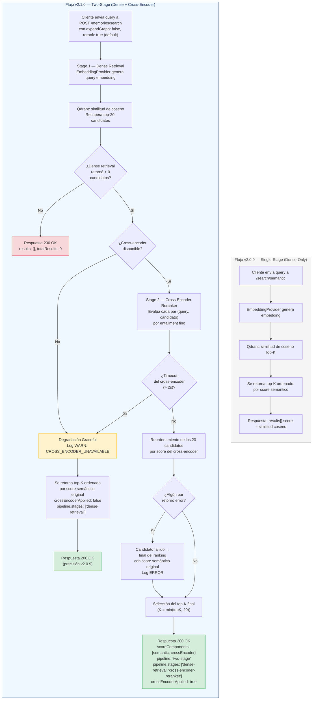

#### 2.1.2 Descripción textual del flujo

**Flujo principal (camino feliz)**:

1. El cliente envía una request a `POST /memories/search` con `expandGraph: false` y `rerank: true` (default).
2. **Stage 1 — Dense Retrieval**: `EmbeddingProvider` genera el embedding del query y consulta Qdrant por similitud de coseno, recuperando los **top-20** candidatos más relevantes.
3. **Stage 2 — Cross-Encoder Reranker**: un modelo cross-encoder evalúa cada uno de los 20 pares (query, documento) para determinar relevancia fina por entailment.
4. Los 20 candidatos se reordenan según el score del cross-encoder.
5. Se retorna el **top-K final** (K = valor de `topK` solicitado, máximo 20) con `scoreComponents` desglosado, `pipeline: "two-stage"` y `crossEncoderApplied: true`.

**Degradación graceful (cross-encoder no disponible)**:
- Si el cross-encoder no está disponible (API key ausente, modelo no desplegado), el sistema **degrada** a dense retrieval puro.
- Registra `WARN CROSS_ENCODER_UNAVAILABLE`.
- Retorna resultados con precisión de v2.0.9, `crossEncoderApplied: false`.
- **Nunca** retorna error HTTP al cliente por indisponibilidad del cross-encoder.

**Degradación por timeout**:
- Si la etapa de cross-encoder excede 2 segundos, se cancela y se retorna el orden del dense retrieval.

**Error parcial en un par**:
- Si el cross-encoder falla para 1 de los 20 pares, ese candidato se coloca al final del ranking con su score semántico original. Los 19 restantes se evalúan normalmente.

#### 2.1.3 Actores involucrados

| Actor | Rol |
|---|---|
| **Cliente API** | Consumidor que envía `POST /memories/search` |
| **EmbeddingProvider** | Genera el embedding del query (`text-embedding-3-large`) |
| **Qdrant** | Base vectorial: ejecuta búsqueda por similitud de coseno sobre los 20 candidatos más cercanos |
| **Cross-Encoder** | Modelo de reranking (OpenAI `gpt-4o-mini` o local `allenai/scifact`) que evalúa pares (query, documento) |

#### 2.1.4 Puntos de decisión

| # | Decisión | Condición | Ramas |
|---|---|---|---|
| D1 | ¿Hay candidatos? | Dense retrieval retorna 0 resultados | Sí → continúa al cross-encoder. No → `results: []`. |
| D2 | ¿Cross-encoder disponible? | API key configurada y modelo accesible | Sí → ejecuta reranker. No → degradación graceful a dense-only. |
| D3 | ¿Timeout del cross-encoder? | Etapa excede 2 segundos | Sí → degradación a dense-only. No → continúa. |
| D4 | ¿Error en algún par? | Cross-encoder falla para un candidato específico | Sí → candidato al final con score semántico. No → ranking normal. |

#### 2.1.5 Manejo de errores

| Código | Condición | Respuesta |
|---|---|---|
| `200 OK` | Cross-encoder no disponible | Degradación graceful. `crossEncoderApplied: false`. `pipeline.stages: ["dense-retrieval"]`. Log `WARN`. |
| `200 OK` | Timeout del cross-encoder | Degradación graceful. Igual que arriba + `CROSS_ENCODER_TIMEOUT` en logs. |
| `200 OK` | Error en 1 de 20 pares | Candidato fallido al final del ranking. Log `ERROR`. |
| `200 OK` | 0 candidatos del dense retrieval | `results: []`, `totalResults: 0`. |
| `400` | `query` vacío | `VALIDATION_ERROR: "query must not be blank"`. |
| `400` | `topK: 0` o `topK > 100` | `VALIDATION_ERROR`. |

---

### 2.2 Flujo de Búsqueda Semántica Pura `search` con `expandGraph=false` (FT-001.2)

**Feature**: FT-V21-001.2 — Búsqueda Semántica Pura (`search` sin `expandGraph`)
**Historias**: HU-V21-003
**Reglas de negocio**: BR-V21-002
**Criterios de éxito**: CE-07

#### 2.2.1 Comparación: Comportamiento v2.0.9 vs v2.1.0

**Tipo de diagrama**: Flowchart (comparativo con dos columnas)

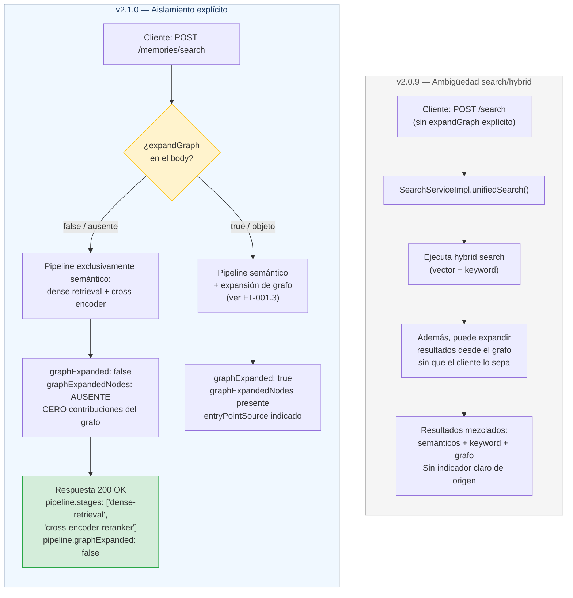

#### 2.2.2 Descripción textual del flujo

**v2.0.9 (estado actual — ambigüedad)**:

En v2.0.9, el endpoint `POST /search` (implementado como `unifiedSearch()`) ejecuta hybrid search (vector + keyword) y **puede incluir resultados expandidos desde el grafo** sin que el cliente lo haya solicitado explícitamente. Los resultados llegan mezclados sin un indicador claro de si provienen del pipeline semántico o del grafo. Esto crea ambigüedad: el consumidor no sabe qué pipeline produjo cada resultado.

**v2.1.0 (estado propuesto — aislamiento)**:

El endpoint `POST /memories/search` ahora evalúa el parámetro `expandGraph`:

- **`expandGraph: false` o ausente**: el pipeline es **exclusivamente semántico** (dense retrieval + cross-encoder). El campo `pipeline.graphExpanded` es `false` y `graphExpandedNodes` está **ausente** de la respuesta. **Cero** contribuciones del grafo.
- **`expandGraph: true` o objeto con `depth`**: se activa la expansión de grafo (comportamiento definido en FT-001.3). Los resultados del grafo se marcan con `graphExpanded: true` e incluyen `expandedFrom` y `relationType`.

#### 2.2.3 Actores involucrados

| Actor | Rol |
|---|---|
| **Cliente API** | Decide explícitamente si quiere grafo (`expandGraph: true`) o no |
| **SearchService** | Orquesta el pipeline. Respeta estrictamente el parámetro `expandGraph` |
| **Qdrant** | Búsqueda semántica por similitud de coseno |
| **Cross-Encoder** | Reranker (si está disponible) |
| **Grafo de conocimiento** | Solo se activa si `expandGraph: true` |

#### 2.2.4 Puntos de decisión

| # | Decisión | Condición | Ramas |
|---|---|---|---|
| D1 | ¿`expandGraph` presente? | Body contiene el campo `expandGraph` | Ausente → `false` (default). Presente → evalúa valor. |
| D2 | ¿`expandGraph: true`? | El campo es `true` o un objeto con `depth` | Sí → pipeline semántico + grafo. No → solo pipeline semántico. |

#### 2.2.5 Manejo de errores

| Código | Condición | Respuesta |
|---|---|---|
| `200 OK` | `expandGraph: false` (o ausente) | Resultados 100% semánticos. `graphExpanded: false`. Sin `graphExpandedNodes`. |
| `200 OK` | `expandGraph: true` | Resultados con grafo. `graphExpanded: true` en cada resultado expandido. |
| `400` | `expandGraph.depth: 0` | `VALIDATION_ERROR: "expandGraph.depth must be >= 1"`. |
| `400` | `expandGraph.depth > 5` | `VALIDATION_ERROR: "expandGraph.depth must be <= 5"`. |

---

### 2.3 Flujo de Expansión de Grafo Multi-Origen (FT-001.3)

**Feature**: FT-V21-001.3 — Expansión de Grafo desde Top-3 con `entryPoints` Explícitos
**Historias**: HU-V21-004, HU-V21-005
**Reglas de negocio**: BR-V21-003, BR-V21-004
**Criterios de éxito**: CE-01

#### 2.3.1 Diagrama principal

**Tipo de diagrama**: Flowchart

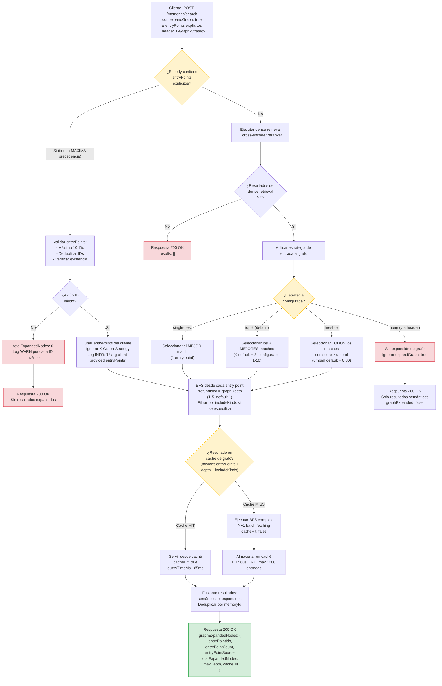

#### 2.3.2 Diagrama de secuencia: Expansión con `entryPoints` explícitos

**Tipo de diagrama**: Sequence Diagram

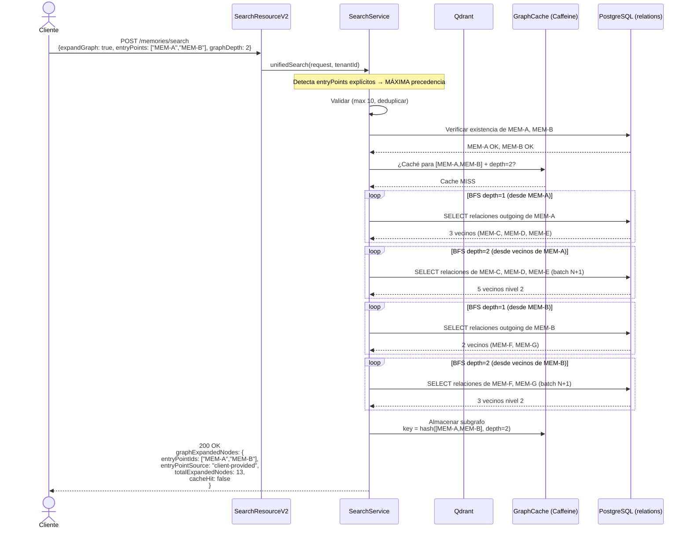

#### 2.3.3 Descripción textual del flujo

**Caso A — `entryPoints` explícitos del cliente (máxima precedencia)**:

1. El cliente envía `expandGraph: true` con `entryPoints: ["MEM-A", "MEM-B"]`.
2. El sistema **ignora** el dense retrieval y cualquier header `X-Graph-Strategy`. Los `entryPoints` del cliente tienen **precedencia absoluta** (BR-V21-004).
3. Valida los IDs: máximo 10, deduplica duplicados, verifica existencia.
4. Si ningún ID es válido → `totalExpandedNodes: 0`.
5. Si hay IDs válidos → expande BFS desde cada uno con la profundidad configurada (`graphDepth`).
6. Respuesta incluye `entryPointSource: "client-provided"`.

**Caso B — Selección automática (sin `entryPoints`)**:

1. El cliente envía `expandGraph: true` **sin** `entryPoints`.
2. Se ejecuta el pipeline semántico completo (dense retrieval + cross-encoder).
3. Se aplica la estrategia de entrada al grafo configurada (por perfil de dominio o por header `X-Graph-Strategy`):
   - `top-k` (default v2.1.0): expande desde los K mejores matches (K=3 por defecto).
   - `single-best`: expande solo desde el mejor match (comportamiento v2.0.9).
   - `threshold`: expande desde todos los matches con score ≥ umbral.
   - `none`: sin expansión, incluso con `expandGraph: true`.
4. BFS desde cada entry point, con caché de resultados de grafo (FT-002.1).
5. Fusión de resultados semánticos + expandidos, deduplicados por `memoryId`.

#### 2.3.4 Actores involucrados

| Actor | Rol |
|---|---|
| **Cliente API** | Proporciona `expandGraph`, `entryPoints`, headers `X-Graph-*` |
| **SearchService** | Orquesta el pipeline: dense retrieval, selección de entry points, BFS |
| **Qdrant** | Dense retrieval: top-K candidatos por similitud de coseno |
| **Cross-Encoder** | Reordena entry points antes de la expansión |
| **GraphCache (Caffeine)** | Cachea subgrafos por (entryPoints, depth, includeKinds) |
| **PostgreSQL (relations)** | Almacena relaciones del grafo; consultado vía batch N+1 |

#### 2.3.5 Puntos de decisión

| # | Decisión | Condición | Ramas |
|---|---|---|---|
| D1 | ¿`entryPoints` explícitos? | Body contiene array `entryPoints` con al menos 1 ID | Sí → ignora dense retrieval y `X-Graph-Strategy`. No → selección automática. |
| D2 | ¿IDs válidos? | Al menos 1 entry point existe en el sistema | Sí → expande. No → `totalExpandedNodes: 0`. |
| D3 | ¿Estrategia? | Configuración de perfil o header `X-Graph-Strategy` | `top-k` (default), `single-best`, `threshold`, `none`. |
| D4 | ¿Cache hit? | Mismos entryPoints + depth + includeKinds en caché | Sí → servir desde caché (~85ms). No → BFS completo (~320ms). |

#### 2.3.6 Manejo de errores

| Código | Condición | Respuesta |
|---|---|---|
| `200 OK` | 0 resultados del dense retrieval | `results: []`. Sin expansión de grafo. |
| `200 OK` | `entryPoints` con IDs inválidos | Se excluyen silenciosamente. Log `WARN` por cada uno. Si ningún ID es válido → `totalExpandedNodes: 0`. |
| `200 OK` | `graphDepth` mayor que profundidad real del grafo | Se expande hasta la profundidad máxima disponible. `maxDepth` refleja el valor real. |
| `400` | `entryPoints` con más de 10 IDs | `VALIDATION_ERROR: "entryPoints: maximum 10 entries allowed"`. |
| `400` | `X-Graph-Strategy: invalid` | `VALIDATION_ERROR`. |
| `400` | `X-Graph-K` fuera de rango (1-10) | `VALIDATION_ERROR`. |

---

### 2.4 Flujo `POST /extract` con OpenAI Real (FT-001.4)

**Feature**: FT-V21-001.4 — `POST /extract` con OpenAI Real
**Historias**: HU-V21-006
**Reglas de negocio**: BR-V21-005
**Criterios de éxito**: CE-06

#### 2.4.1 Comparación: v2.0.9 (MockLlmService) vs v2.1.0 (OpenAI)

**Tipo de diagrama**: Flowchart

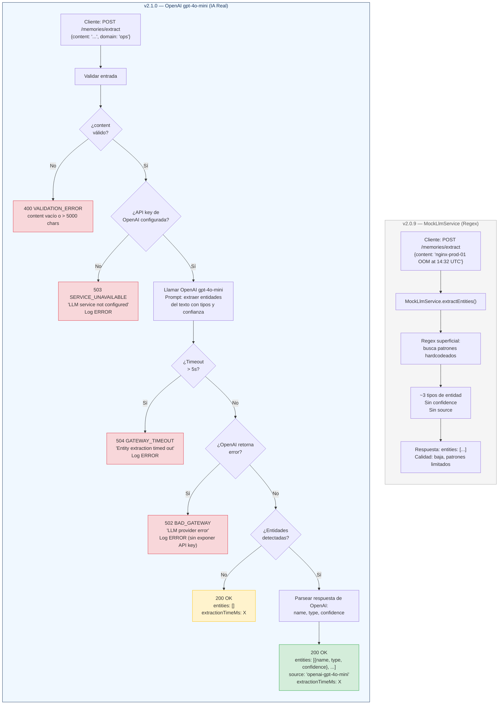

#### 2.4.2 Descripción textual del flujo

**v2.0.9 (MockLlmService)**:

El endpoint `POST /extract` usa `MockLlmService`, que aplica **regex superficial** para detectar patrones hardcodeados. Solo reconoce ~3 tipos de entidad, no asigna confianza, y no indica la fuente de extracción. Este es el hallazgo F8v2-ISS-001 documentado en la fase de estabilización de v2.0.9.

**v2.1.0 (OpenAI Real)**:

1. El cliente envía `POST /memories/extract` con `content` (texto, máx. 5000 caracteres) y `domain` (opcional, sugiere dominio para orientar la extracción).
2. Se valida que `content` no esté vacío y no exceda 5000 caracteres.
3. Se verifica que la API key de OpenAI esté configurada.
4. Se llama a OpenAI `gpt-4o-mini` con un prompt de extracción de entidades.
5. Si OpenAI detecta entidades, se parsean y retornan con `name`, `type` (SERVER, SERVICE, ERROR_CONDITION, TIMESTAMP, PERSON, ORGANIZATION, etc.) y `confidence` [0.0, 1.0].
6. La respuesta incluye `source: "openai-gpt-4o-mini"` y `extractionTimeMs`.
7. **Nunca** se degrada silenciosamente a `MockLlmService`. Si OpenAI no está disponible, el endpoint retorna error.

#### 2.4.3 Actores involucrados

| Actor | Rol |
|---|---|
| **Cliente API** | Envía texto para extracción de entidades |
| **SearchResourceV2 / ExtractResource** | Valida entrada y orquesta la llamada |
| **OpenAI (gpt-4o-mini)** | Servicio externo de IA: extrae entidades por análisis semántico |

#### 2.4.4 Puntos de decisión

| # | Decisión | Condición | Ramas |
|---|---|---|---|
| D1 | ¿Content válido? | No vacío, ≤ 5000 caracteres | Sí → continúa. No → `400`. |
| D2 | ¿API key configurada? | Variable de entorno / config presente | Sí → llama a OpenAI. No → `503`. |
| D3 | ¿Timeout? | OpenAI no responde en ≤ 5s | Sí → `504`. No → continúa. |
| D4 | ¿OpenAI error? | API key vencida, sin crédito, etc. | Sí → `502`. No → continúa. |
| D5 | ¿Entidades detectadas? | OpenAI retorna lista no vacía | Sí → retorna entidades. No → `entities: []`. |

#### 2.4.5 Manejo de errores

| Código | Condición | Respuesta |
|---|---|---|
| `400` | `content` vacío | `VALIDATION_ERROR: "content must not be blank"`. |
| `400` | `content` > 5000 caracteres | `VALIDATION_ERROR: "content exceeds maximum length of 5000 characters"`. |
| `503` | API key no configurada | `SERVICE_UNAVAILABLE: "Entity extraction unavailable: LLM service not configured"`. |
| `502` | API key vencida / sin crédito | `BAD_GATEWAY: "Entity extraction failed: LLM provider error"`. Log `ERROR` sin exponer API key. |
| `504` | Timeout > 5s | `GATEWAY_TIMEOUT: "Entity extraction timed out"`. |
| `200 OK` | Sin entidades detectadas | `entities: []`. No es error. |

---

### 2.5 Flujo Unificado de Endpoints de Búsqueda (FT-004.2)

**Feature**: FT-V21-004.2 — Unificación de Endpoints `search` y `hybrid`
**Historias**: HU-V21-015
**Reglas de negocio**: BR-V21-012
**Criterios de éxito**: CE-10

#### 2.5.1 Diagrama de enrutamiento unificado

**Tipo de diagrama**: Flowchart

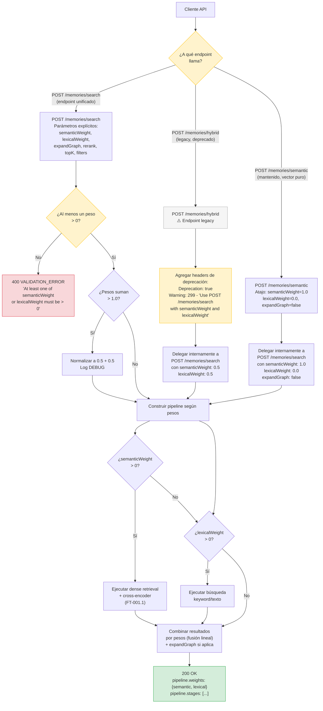

#### 2.5.2 Tabla de modos de búsqueda unificados

| Modo | `semanticWeight` | `lexicalWeight` | `expandGraph` | Equivalente v2.0.9 |
|---|---|---|---|---|
| **Semántico puro** | `1.0` | `0.0` | `false` | `POST /search/semantic` |
| **Léxico puro** | `0.0` | `1.0` | `false` | No existía |
| **Híbrido balanceado** | `0.6` | `0.4` | `false` | `POST /search/hybrid` (≈) |
| **Híbrido legacy** | `0.5` | `0.5` | `false` | `POST /search/hybrid` (exacto) |
| **Semántico + Grafo** | `1.0` | `0.0` | `true` | `POST /search` (unified, pero ambiguo) |

#### 2.5.3 Descripción textual del flujo

**v2.0.9 (estado actual — endpoints redundantes)**:

En v2.0.9, existen tres endpoints de búsqueda con semántica solapada:
- `POST /search/semantic` → vector puro
- `POST /search/hybrid` → vector + keyword
- `POST /search` → unified (mezcla hybrid + grafo, con ambigüedad)

El consumidor no tiene claro qué endpoint usar ni qué parámetros controlan cada comportamiento.

**v2.1.0 (estado propuesto — unificación)**:

1. **Endpoint unificado**: `POST /memories/search` acepta `semanticWeight` [0.0, 1.0] y `lexicalWeight` [0.0, 1.0] para cubrir **todos** los modos de búsqueda.
2. Al menos uno de los pesos debe ser > 0 (si ambos son 0 → `400`).
3. Si los pesos suman > 1.0, se normalizan internamente (ej. 0.7 + 0.7 → 0.5 + 0.5).
4. `POST /memories/hybrid` se mantiene **funcional** pero retorna headers de deprecación (`Deprecation: true`, `Warning: 299`). Internamente delega a `/search` con pesos 0.5/0.5.
5. `POST /memories/semantic` se mantiene como atajo para búsqueda vectorial pura (`semanticWeight: 1.0, lexicalWeight: 0.0`).

#### 2.5.4 Actores involucrados

| Actor | Rol |
|---|---|
| **Cliente API** | Elige el endpoint y los pesos según el modo de búsqueda deseado |
| **SearchResourceV2** | Enruta requests, aplica headers de deprecación en `/hybrid` |
| **SearchService** | Construye el pipeline según los pesos y ejecuta la búsqueda |

#### 2.5.5 Puntos de decisión

| # | Decisión | Condición | Ramas |
|---|---|---|---|
| D1 | ¿Endpoint? | El cliente llama a `/search`, `/hybrid` o `/semantic` | `/search` → parámetros explícitos. `/hybrid` → legacy con warning. `/semantic` → atajo. |
| D2 | ¿Pesos válidos? | Al menos uno > 0 | Sí → continúa. No → `400`. |
| D3 | ¿Normalización necesaria? | `semanticWeight + lexicalWeight > 1.0` | Sí → normaliza a 0.5/0.5. No → usa los pesos originales. |

#### 2.5.6 Manejo de errores

| Código | Condición | Respuesta |
|---|---|---|
| `400` | `semanticWeight: 0.0, lexicalWeight: 0.0` | `VALIDATION_ERROR: "At least one of semanticWeight or lexicalWeight must be > 0"`. |
| `400` | `semanticWeight` o `lexicalWeight` fuera de [0.0, 1.0] | `VALIDATION_ERROR`. |
| `200 OK` | Pesos suman > 1.0 | Normalización interna. Log `DEBUG`. Resultados con pesos 0.5/0.5. |
| `200 OK` | `lexicalWeight > 0` sin índice léxico | Degradación a `semanticWeight: 1.0`. Log `WARN`. |
| `200 OK` (con headers) | `POST /memories/hybrid` | `Deprecation: true`, `Warning: 299`. Funcionalidad idéntica a v2.0.9. |

---

### 2.6 Flujo `DELETE /admin/namespaces/{name}` (FT-004.3)

**Feature**: FT-V21-004.3 — `DELETE /admin/namespaces/{name}`
**Historias**: HU-V21-016
**Reglas de negocio**: BR-V21-013
**Criterios de éxito**: CE-08

#### 2.6.1 Diagrama de eliminación atómica

**Tipo de diagrama**: Flowchart

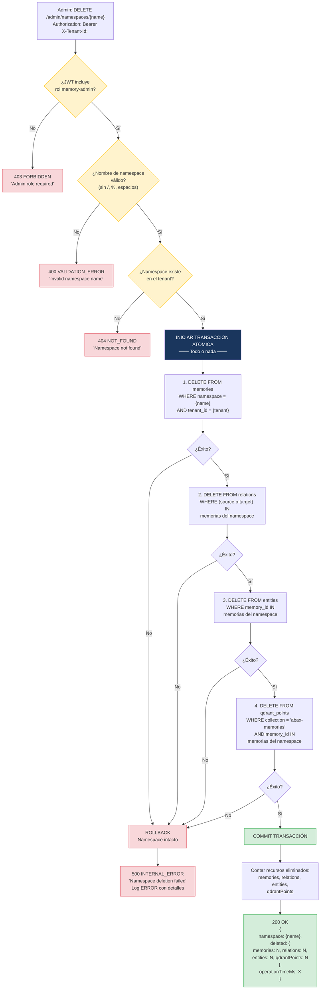

#### 2.6.2 Diagrama de secuencia: Eliminación exitosa

**Tipo de diagrama**: Sequence Diagram

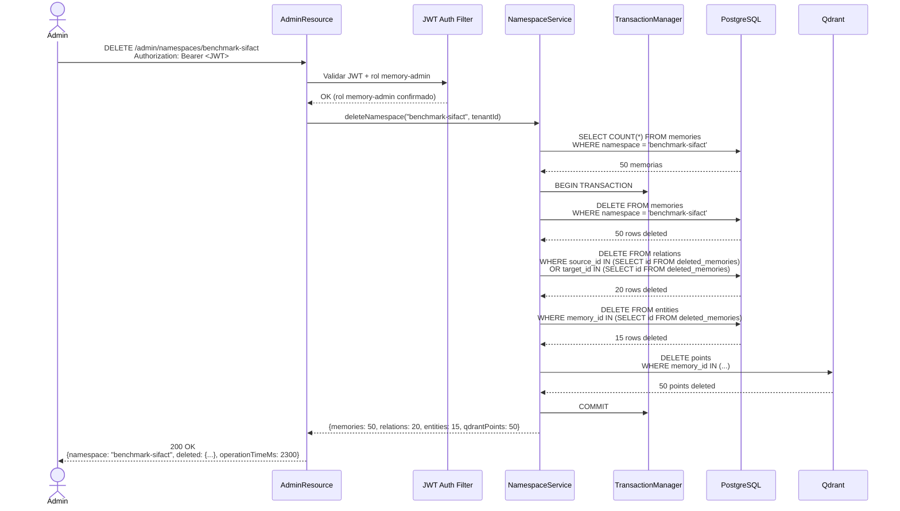

#### 2.6.3 Descripción textual del flujo

1. El administrador envía `DELETE /admin/namespaces/{name}` con un JWT que incluye el rol `memory-admin`.
2. Se valida la autenticación y el rol. Sin `memory-admin` → `403 FORBIDDEN`.
3. Se valida que el nombre del namespace sea válido (sin `/`, `%`, espacios).
4. Se verifica que el namespace exista en el tenant. Si no existe → `404 NOT_FOUND`.
5. Se inicia una **transacción atómica**. Todos los pasos son parte de la misma transacción: todo o nada.
6. **Paso 1**: eliminar todas las memorias del namespace en PostgreSQL.
7. **Paso 2**: eliminar todas las relaciones donde source o target sean memorias del namespace.
8. **Paso 3**: eliminar todas las entidades vinculadas a las memorias del namespace.
9. **Paso 4**: eliminar todos los puntos vectoriales en Qdrant correspondientes a las memorias del namespace.
10. Si **todos** los pasos son exitosos → `COMMIT`. Se cuentan los recursos eliminados y se retorna `200 OK` con el resumen.
11. Si **cualquier** paso falla → `ROLLBACK` completo. El namespace permanece intacto. Se retorna `500 INTERNAL_ERROR`.

#### 2.6.4 Actores involucrados

| Actor | Rol |
|---|---|
| **Admin (usuario)** | Inicia la eliminación del namespace |
| **JWT Auth Filter** | Valida autenticación y rol `memory-admin` |
| **NamespaceService** | Orquesta la eliminación atómica |
| **TransactionManager** | Garantiza atomicidad: todo o nada |
| **PostgreSQL** | Almacena memorias, relaciones y entidades |
| **Qdrant** | Almacena puntos vectoriales |

#### 2.6.5 Puntos de decisión

| # | Decisión | Condición | Ramas |
|---|---|---|---|
| D1 | ¿Rol `memory-admin`? | JWT incluye el rol requerido | Sí → continúa. No → `403`. |
| D2 | ¿Nombre válido? | Sin `/`, `%`, espacios | Sí → continúa. No → `400`. |
| D3 | ¿Namespace existe? | Hay al menos 1 memoria en ese namespace | Sí → inicia transacción. No → `404`. |
| D4 | ¿Éxito en cada paso? | DELETE de PG y Qdrant sin errores | Sí → COMMIT. No → ROLLBACK. |

#### 2.6.6 Manejo de errores

| Código | Condición | Respuesta |
|---|---|---|
| `403` | Sin rol `memory-admin` | `FORBIDDEN: "Admin role required for namespace deletion"`. |
| `400` | Nombre con caracteres inválidos | `VALIDATION_ERROR: "Invalid namespace name"`. |
| `404` | Namespace no existe | `NOT_FOUND: "Namespace not found"`. |
| `200 OK` | Namespace con 0 recursos | Todos los contadores en 0. No es error. |
| `500` | Fallo parcial durante la eliminación | `INTERNAL_ERROR`. ROLLBACK completo. Namespace intacto. Log `ERROR` con detalles. |
| `404` | Dos DELETE concurrentes al mismo namespace | El primero retorna `200`, el segundo `404`. |

---

### 2.7 Flujo de Caché de Validación JWT (FT-002.3)

**Feature**: FT-V21-002.3 — Cache de Validación JWT en Backend
**Historias**: HU-V21-010
**Reglas de negocio**: BR-V21-007
**Criterios de éxito**: CE-02

#### 2.7.1 Diagrama de secuencia: Ciclo de vida del token en caché

**Tipo de diagrama**: Sequence Diagram

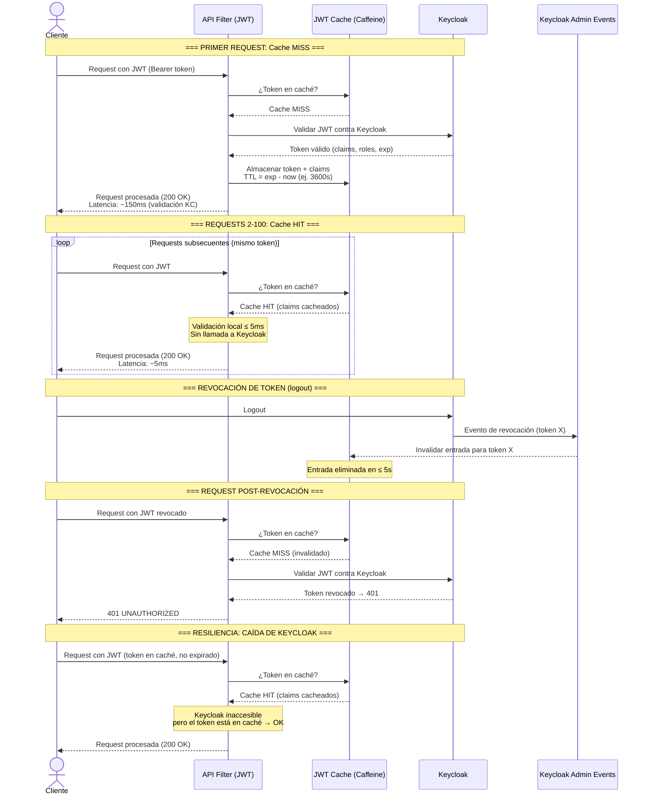

#### 2.7.2 Diagrama de flujo: Decisión de validación

**Tipo de diagrama**: Flowchart

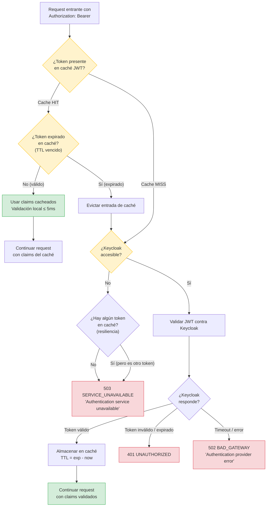

#### 2.7.3 Descripción textual del flujo

**Cache MISS (primer request o tras expiración)**:

1. Llega una request con un JWT en el header `Authorization`.
2. El filtro de autenticación consulta el caché JWT. No encuentra el token → Cache MISS.
3. Se valida el JWT contra Keycloak. Si Keycloak está inaccesible → `503`.
4. Si el token es válido, se almacena en caché con TTL = `exp - now` (típicamente 1 hora).
5. La request se procesa normalmente. Latencia total de autenticación: ~150ms.

**Cache HIT (requests subsecuentes)**:

1. El token está en caché y no ha expirado.
2. Se usan los claims cacheados. Validación local ≤ 5ms. **Sin llamada a Keycloak**.
3. Para 100 requests con el mismo token, el ahorro acumulado es de ~14.5 segundos.

**Invalidación por revocación (logout)**:

1. El usuario hace logout en Keycloak.
2. Keycloak emite un evento de revocación (Admin Events).
3. El backend recibe el evento e invalida la entrada de caché en ≤ 5s.
4. Requests subsecuentes con ese token → Cache MISS → validación contra Keycloak → `401`.

**Resiliencia ante caída de Keycloak**:

- Si Keycloak está inaccesible pero el token está en caché y no expirado → **Cache HIT exitoso**. La request se procesa normalmente.
- Si Keycloak está inaccesible y el token **no** está en caché → `503`.

#### 2.7.4 Actores involucrados

| Actor | Rol |
|---|---|
| **Cliente API** | Envía requests con JWT en header `Authorization` |
| **API Filter (JWT)** | Intercepta requests, consulta caché, valida JWT |
| **JWT Cache (Caffeine)** | Caché en memoria: tokens válidos con TTL = `exp - now` |
| **Keycloak** | Servicio externo de autenticación: valida y revoca tokens |
| **Keycloak Admin Events** | Notifica eventos de revocación al backend |

#### 2.7.5 Puntos de decisión

| # | Decisión | Condición | Ramas |
|---|---|---|---|
| D1 | ¿Token en caché? | Entrada presente en Caffeine | Sí → Cache HIT. No → Cache MISS. |
| D2 | ¿TTL vencido? | `now > stored_at + TTL` | Sí → evictar, validar contra KC. No → usar claims cacheados. |
| D3 | ¿Keycloak accesible? | Conexión TCP a Keycloak OK | Sí → validar. No → `503` (si no hay caché). |
| D4 | ¿Token válido? | Keycloak responde con claims | Sí → cachear + continuar. No → `401`. |

#### 2.7.6 Manejo de errores

| Código | Condición | Respuesta |
|---|---|---|
| `401` | Token inválido o expirado (Keycloak rechaza) | `UNAUTHORIZED`. |
| `401` | Token revocado, caché invalidado, Keycloak rechaza | `UNAUTHORIZED`. |
| `503` | Keycloak inaccesible y token no está en caché | `SERVICE_UNAVAILABLE: "Authentication service unavailable"`. |
| `200 OK` | Keycloak inaccesible pero token en caché no expirado | Cache HIT exitoso. Request procesada normalmente. |
| `200 OK` | Token renovado (nuevo JWT emitido) | Cache MISS → validación KC → nuevo ciclo de caché. |

---

### 2.8 Flujo de Unificación de Colecciones Qdrant (FT-003.2)

**Feature**: FT-V21-003.2 — Unificación de Colecciones Qdrant
**Historias**: HU-V21-012
**Reglas de negocio**: BR-V21-009
**Criterios de éxito**: CE-05

#### 2.8.1 Diagrama del proceso de migración

**Tipo de diagrama**: Flowchart (proceso de migración, no runtime)

```mermaid
flowchart TD
    START["INICIO: Proceso de Unificación<br/>de Colecciones Qdrant<br/>(offline, pre-deploy v2.1.0)"] --> V1["1. VERIFICACIÓN PRE-MIGRACIÓN"]
    
    V1 --> V1A["Consultar PostgreSQL:<br/>¿Hay memorias activas referenciando<br/>puntos en 'abax-memories-v1'?"]
    V1A --> V1B{"¿Puntos activos<br/>en v1?"}
    
    V1B -- "No (solo datos huérfanos)" --> V2["2. RESPALDO PRE-ELIMINACIÓN"]
    V1B -- "Sí (datos necesarios)" --> MIG["2a. MIGRACIÓN DE PUNTOS ACTIVOS"]
    
    MIG --> MIG1["Copiar puntos de 'abax-memories-v1'<br/>a 'abax-memories'<br/>(API Qdrant: upsert batch)"]
    MIG1 --> MIG2["Verificar integridad:<br/>todos los memory_id migrados<br/>tienen su punto en 'abax-memories'"]
    MIG2 --> MIG3{"¿Migración<br/>exitosa?"}
    MIG3 -- "No" --> ABORT["ABORTAR:<br/>Ambas colecciones intactas<br/>Log ERROR<br/>Notificar a DevOps"]
    MIG3 -- "Sí" --> V2
    
    V2 --> V2A["Crear snapshot de 'abax-memories-v1'<br/>(API Qdrant: create snapshot)"]
    V2A --> V2B["Verificar snapshot creado correctamente"]
    V2B --> V3["3. ELIMINACIÓN DE COLECCIÓN V1"]
    
    V3 --> V3A["Ejecutar DELETE /collections/abax-memories-v1<br/>(API Qdrant)"]
    V3A --> V3B{"¿Eliminación<br/>exitosa?"}
    V3B -- "No" --> ROLLBACK_MIG["ROLLBACK:<br/>Restaurar desde snapshot si fue necesario<br/>Ambas colecciones intactas<br/>Log ERROR"]
    V3B -- "Sí" --> V4["4. VERIFICACIÓN POST-ELIMINACIÓN"]
    
    V4 --> V4A["GET /collections (API Qdrant)"]
    V4A --> V4B{"¿Exactamente 1<br/>colección?"}
    V4B -- "No" --> V4_ERR["FALLO DE VERIFICACIÓN<br/>Investigar colecciones remanentes"]
    V4B -- "Sí" --> V4C["GET /collections/abax-memories-v1"]
    V4C --> V4D{"¿Retorna<br/>404?"}
    V4D -- "No" --> V4_ERR
    V4D -- "Sí" --> V5["5. PRUEBAS FUNCIONALES"]
    
    V5 --> V5A["Ejecutar 50 queries de la suite<br/>multi-dominio contra /memories/search"]
    V5A --> V5B{"¿100% resultados<br/>esperados?"}
    V5B -- "No" --> V5_ERR["REGRESIÓN DETECTADA<br/>Restaurar snapshot si es necesario<br/>Investigar causa"]
    V5B -- "Sí" --> V5C["Ingestar 10 memorias nuevas"]
    V5C --> V5D{"¿Puntos creados en<br/>'abax-memories'?<br/>¿Buscables en ≤ 2s?"}
    V5D -- "No" --> V5_ERR
    V5D -- "Sí" --> DONE["UNIFICACIÓN COMPLETADA<br/>✓ 1 colección activa: 'abax-memories'<br/>✓ 'abax-memories-v1' eliminada<br/>✓ Suite multi-dominio: 100% pass<br/>✓ Ingesta funcional<br/>✓ CE-05 cumplido"]
    
    style START fill:#1a365d,color:#fff
    style V1B fill:#fff3cd,stroke:#ffc107
    style MIG3 fill:#fff3cd,stroke:#ffc107
    style V3B fill:#fff3cd,stroke:#ffc107
    style V4B fill:#fff3cd,stroke:#ffc107
    style V4D fill:#fff3cd,stroke:#ffc107
    style ABORT fill:#f8d7da,stroke:#dc3545
    style ROLLBACK_MIG fill:#f8d7da,stroke:#dc3545
    style V4_ERR fill:#f8d7da,stroke:#dc3545
    style V5_ERR fill:#f8d7da,stroke:#dc3545
    style DONE fill:#d4edda,stroke:#28a745
```

#### 2.8.2 Estado antes y después

**Tipo de diagrama**: Flowchart (comparativo)

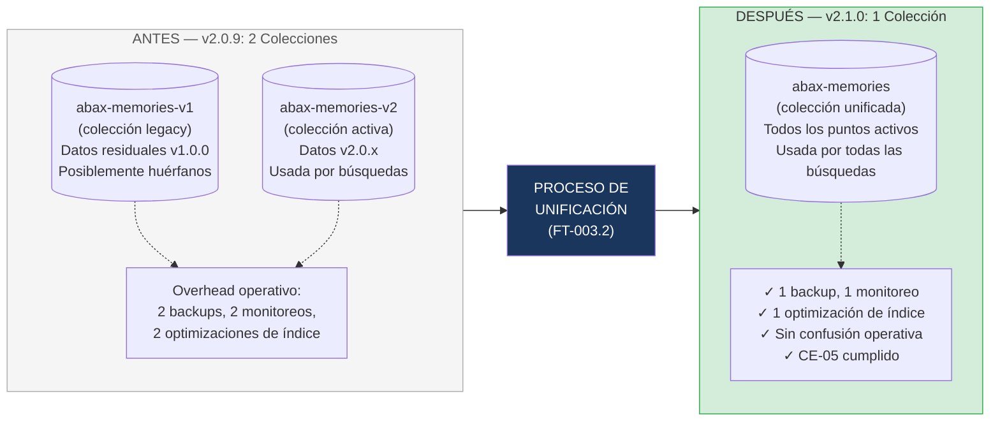

#### 2.8.3 Descripción textual del flujo

Este no es un flujo de runtime sino un **proceso de migración offline** que debe ejecutarse antes del despliegue de v2.1.0. El proceso tiene 5 fases:

**Fase 1 — Verificación pre-migración**:
- Consultar PostgreSQL para determinar si la colección `abax-memories-v1` contiene puntos vectoriales referenciados por memorias activas.
- Si solo contiene datos huérfanos (sin referencias activas en la tabla `memories`), se procede directamente a la eliminación.
- Si contiene datos necesarios, se ejecuta migración antes de eliminar.

**Fase 2 — Respaldo / Migración**:
- Si hay datos activos: copiar puntos de `abax-memories-v1` a `abax-memories` vía API de Qdrant (upsert batch). Verificar integridad post-migración.
- Crear snapshot de `abax-memories-v1` como respaldo ante cualquier fallo.

**Fase 3 — Eliminación**:
- Ejecutar `DELETE /collections/abax-memories-v1` en la API de Qdrant.
- Si la eliminación falla: rollback (restaurar desde snapshot si fue necesario). Ambas colecciones permanecen intactas.

**Fase 4 — Verificación post-eliminación**:
- `GET /collections` debe mostrar exactamente 1 colección.
- `GET /collections/abax-memories-v1` debe retornar `404`.

**Fase 5 — Pruebas funcionales**:
- Ejecutar 50 queries de la suite multi-dominio: 100% resultados esperados.
- Ingestar 10 memorias nuevas: puntos creados en `abax-memories`, buscables en ≤ 2s.

**Resultado final**: exactamente 1 colección Qdrant activa (`abax-memories`), criterio CE-05 cumplido.

#### 2.8.4 Actores involucrados

| Actor | Rol |
|---|---|
| **DevOps** | Ejecuta el proceso de migración, maneja snapshots y rollback |
| **PostgreSQL** | Fuente de verdad sobre qué puntos están activos |
| **Qdrant API** | Destino de la migración, eliminación de colección legacy |
| **QA** | Ejecuta pruebas funcionales post-migración para verificar integridad |

#### 2.8.5 Puntos de decisión

| # | Decisión | Condición | Ramas |
|---|---|---|---|
| D1 | ¿Puntos activos en v1? | Hay `memory_id` activos en PostgreSQL referenciando `abax-memories-v1` | Sí → migrar antes de eliminar. No → eliminar directamente. |
| D2 | ¿Migración exitosa? | Todos los puntos copiados y verificados | Sí → continuar a eliminación. No → abortar (colecciones intactas). |
| D3 | ¿Eliminación exitosa? | Qdrant confirma DELETE de la colección | Sí → verificación post-eliminación. No → rollback. |
| D4 | ¿Verificación OK? | Exactamente 1 colección, v1 retorna 404 | Sí → pruebas funcionales. No → investigar. |
| D5 | ¿Pruebas funcionales OK? | 100% suite multi-dominio, ingesta funcional | Sí → unificación completada. No → regresión, investigar. |

#### 2.8.6 Manejo de errores

| Condición | Acción |
|---|---|
| Puntos activos encontrados en v1, migración falla | ABORTAR. Ambas colecciones intactas. Log `ERROR`. Notificar a DevOps. |
| Eliminación de v1 falla | ROLLBACK. Restaurar snapshot si aplica. Colecciones intactas. |
| Verificación post-eliminación falla (múltiples colecciones) | Investigar colecciones remanentes. No continuar hasta resolver. |
| Pruebas funcionales fallan (regresión en búsquedas) | Restaurar snapshot si es necesario. Investigar causa raíz. |
| Operación de búsqueda durante la migración | Sin interrupción. Las búsquedas operan contra la colección activa. |

---

## 3. Vista Integrada de Endpoints v2.1.0

**Tipo de diagrama**: Flowchart (mapa de endpoints unificados)

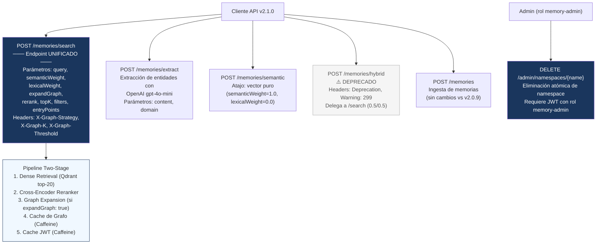

---

## 4. Matriz de Trazabilidad — Diagramas a Features

| Diagrama | Feature | Regla de negocio | Historia de usuario | Criterio de éxito |
|---|---|---|---|---|
| 2.1 Reranker Cross-Encoder | FT-V21-001.1 | BR-V21-001 | HU-V21-001, HU-V21-002 | CE-01, CE-03, CE-04 |
| 2.2 Búsqueda Semántica Pura | FT-V21-001.2 | BR-V21-002 | HU-V21-003 | CE-07 |
| 2.3 Expansión de Grafo | FT-V21-001.3, FT-V21-003.3 | BR-V21-003, BR-V21-004 | HU-V21-004, HU-V21-005, HU-V21-013 | CE-01, CE-09 |
| 2.4 `POST /extract` | FT-V21-001.4 | BR-V21-005 | HU-V21-006 | CE-06 |
| 2.5 Unificación de Endpoints | FT-V21-004.2 | BR-V21-012 | HU-V21-015 | CE-10 |
| 2.6 `DELETE /admin/namespaces` | FT-V21-004.3 | BR-V21-013 | HU-V21-016 | CE-08 |
| 2.7 Cache JWT | FT-V21-002.3 | BR-V21-007 | HU-V21-010 | CE-02 |
| 2.8 Unificación Colecciones Qdrant | FT-V21-003.2 | BR-V21-009 | HU-V21-012 | CE-05 |

**Cobertura**: 8 diagramas cubren 9 de las 13 features de v2.1.0. Las 4 features no diagramadas (FT-002.1, FT-002.2, FT-003.1, FT-004.1) están representadas como sub-flujos dentro de los diagramas existentes (caché de grafo en 2.3, headers en 2.3/2.5, cold start/mitigación de Qdrant es optimización interna sin flujo visible, worker es diagnóstico interno sin flujo de API).

---

## 5. Glosario

- **Cross-encoder**: Modelo de reranking que procesa pares (consulta, documento) simultáneamente para calcular relevancia fina por entailment. Más preciso que el dense retrieval (bi-encoder).
- **BFS**: Breadth-First Search — algoritmo de recorrido de grafos por niveles (profundidad), usado para expandir el grafo de conocimiento desde entry points.
- **Qdrant**: Base de datos vectorial open-source para almacenar embeddings y búsqueda semántica por similitud de coseno.
- **JWT**: JSON Web Token — estándar para transmitir claims de autenticación. Abax-Memory valida JWTs contra Keycloak y cachea el resultado.
- **Caffeine**: Biblioteca Java de caché en memoria usada para el caché de grafo y el caché de validación JWT en v2.1.0.
- **entryPoint**: Nodo semilla desde el cual se inicia la expansión BFS del grafo de conocimiento. Puede ser automático (dense retrieval) o explícito (cliente).
- **NDCG@10**: Normalized Discounted Cumulative Gain — métrica de ranking que penaliza documentos relevantes en posiciones bajas del top-10.
