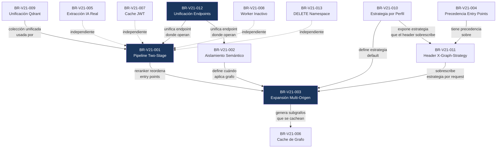

# Documento de Reglas de Negocio — Abax-Memory v2.1.0
## Hardening y Optimización del Motor de Memoria Multi-Dominio

---

## Tabla de Contenidos

- [1. Introducción](#1-introducción)
  - [1.1 Propósito](#11-propósito)
  - [1.2 Alcance de las reglas](#12-alcance-de-las-reglas)
  - [1.3 Convenciones](#13-convenciones)
- [2. Catálogo de Reglas de Negocio](#2-catálogo-de-reglas-de-negocio)
  - [2.1 Pipeline y Recuperación Semántica](#21-pipeline-y-recuperación-semántica)
    - [BR-V21-001: Pipeline Two-Stage con Reranker Cross-Encoder](#br-v21-001-pipeline-two-stage-con-reranker-cross-encoder)
    - [BR-V21-002: Aislamiento de Búsqueda Semántica Pura](#br-v21-002-aislamiento-de-búsqueda-semántica-pura)
    - [BR-V21-003: Expansión de Grafo Multi-Origen](#br-v21-003-expansión-de-grafo-multi-origen)
    - [BR-V21-004: Precedencia de Entry Points Explícitos](#br-v21-004-precedencia-de-entry-points-explícitos)
    - [BR-V21-005: Extracción de Entidades con IA Real](#br-v21-005-extracción-de-entidades-con-ia-real)
  - [2.2 Caché y Eficiencia](#22-caché-y-eficiencia)
    - [BR-V21-006: Cache de Resultados de Grafo de Conocimiento](#br-v21-006-cache-de-resultados-de-grafo-de-conocimiento)
    - [BR-V21-007: Cache de Validación JWT en Backend](#br-v21-007-cache-de-validación-jwt-en-backend)
  - [2.3 Infraestructura y Operaciones](#23-infraestructura-y-operaciones)
    - [BR-V21-008: Eliminación de Worker Inactivo](#br-v21-008-eliminación-de-worker-inactivo)
    - [BR-V21-009: Unificación de Colecciones Qdrant](#br-v21-009-unificación-de-colecciones-qdrant)
  - [2.4 Configurabilidad del Grafo de Conocimiento](#24-configurabilidad-del-grafo-de-conocimiento)
    - [BR-V21-010: Estrategia de Entrada al Grafo Configurable por Perfil](#br-v21-010-estrategia-de-entrada-al-grafo-configurable-por-perfil)
    - [BR-V21-011: Control de Estrategia por Header HTTP](#br-v21-011-control-de-estrategia-por-header-http)
  - [2.5 API y Developer Experience](#25-api-y-developer-experience)
    - [BR-V21-012: Unificación de Endpoints de Búsqueda](#br-v21-012-unificación-de-endpoints-de-búsqueda)
    - [BR-V21-013: Eliminación Atómica de Namespace](#br-v21-013-eliminación-atómica-de-namespace)
- [3. Clasificación por Tipo](#3-clasificación-por-tipo)
- [4. Dependencias entre Reglas](#4-dependencias-entre-reglas)
  - [4.1 Mapa de Dependencias](#41-mapa-de-dependencias)
  - [4.2 Análisis de Dependencias](#42-análisis-de-dependencias)
- [5. Matriz de Trazabilidad](#5-matriz-de-trazabilidad)
  - [5.1 Reglas → Features → Criterios de Éxito](#51-reglas--features--criterios-de-éxito)
  - [5.2 Reglas → Historias de Usuario](#52-reglas--historias-de-usuario)
- [6. Gobernanza de Reglas](#6-gobernanza-de-reglas)
  - [6.1 Owners por Regla](#61-owners-por-regla)
  - [6.2 Proceso de Modificación](#62-proceso-de-modificación)
  - [6.3 Vigencia y Revisión](#63-vigencia-y-revisión)
- [7. Compatibilidad con v2.0.9](#7-compatibilidad-con-v209)
- [8. Glosario](#8-glosario)

---

## 1. Introducción

### 1.1 Propósito

Este documento formaliza, expande y gobierna las **13 reglas de negocio** de Abax-Memory v2.1.0. Cada regla establece un comportamiento no-negociable del sistema: una restricción que debe cumplirse, una validación que debe ejecutarse, un cálculo que debe producirse, o un proceso que debe desencadenarse.

Las reglas aquí documentadas son la fuente de verdad para el equipo de implementación (`developer-backend`, `developer-frontend`), verificación (`qa-lead`, `qa-functional`) y gobierno (`product-owner`, `tech-lead`). Todo caso de prueba, review de código y aceptación de feature debe referenciar estas reglas.

### 1.2 Alcance de las reglas

Las 13 reglas cubren cuatro categorías funcionales de v2.1.0, alineadas con las 4 épicas del producto:

| Categoría | Reglas | Épica vinculada |
|---|---|---|
| Pipeline y Recuperación Semántica | BR-V21-001 a BR-V21-005 | EP-V21-001 — Precisión |
| Caché y Eficiencia | BR-V21-006, BR-V21-007 | EP-V21-002 — Velocidad |
| Infraestructura y Operaciones | BR-V21-008, BR-V21-009 | EP-V21-003 — Eficiencia Operativa |
| Configurabilidad del Grafo | BR-V21-010, BR-V21-011 | EP-V21-003, EP-V21-004 |
| API y Developer Experience | BR-V21-012, BR-V21-013 | EP-V21-004 — API/DX |

**Fuera del alcance de este documento**: Reglas de negocio heredadas de v2.0.9 que no sufren modificación en v2.1.0 (roles RBAC, ciclo de vida de memorias, filtros estructurados, modelo de datos). Dichas reglas permanecen vigentes y documentadas en `docs/entregables/v2/fase-2-analisis/reglas-de-negocio.md`.

### 1.3 Convenciones

- Cada regla se identifica con ID único: `BR-V21-NNN` (Business Rule, versión 2.1, número secuencial).
- Las reglas usan lenguaje prescriptivo: **debe**, **siempre**, **nunca**. No hay ambigüedad con "puede" o "debería".
- Los ejemplos son casos concretos extraídos de la especificación funcional. No son exhaustivos.
- Las excepciones se documentan explícitamente. Si una regla no tiene excepción documentada, significa que **siempre** aplica en su dominio.

---

## 2. Catálogo de Reglas de Negocio

### 2.1 Pipeline y Recuperación Semántica

---

#### BR-V21-001: Pipeline Two-Stage con Reranker Cross-Encoder

| Campo | Descripción |
|---|---|
| **ID** | BR-V21-001 |
| **Nombre** | Pipeline Two-Stage con Reranker Cross-Encoder |
| **Descripción** | Toda búsqueda semántica debe ejecutar un pipeline de dos etapas. En la primera etapa (dense retrieval), el query embedding se compara contra Qdrant por similitud de coseno, recuperando los **20 candidatos más relevantes**. En la segunda etapa (cross-encoder reranker), cada par (query, candidato) se evalúa con un modelo cross-encoder que determina relevancia fina por entailment. Los 20 candidatos se reordenan por el score del cross-encoder y se retorna el **top-5 final** (o `topK` si es menor o igual a 20). |
| **Tipo** | Proceso |
| **Origen** | FT-V21-001.1 (Pipeline con Reranker Cross-Encoder), HU-V21-001, HU-V21-002 |
| **Ejemplo** | Query: _"Does the mRNA vaccine reduce transmission?"_. Dense retrieval recupera 20 memorias de SciFact con scores entre 0.65 y 0.85. El cross-encoder evalúa cada par y reordena: la memoria que prueba _"mRNA vaccine showed 95% efficacy"_ sube de posición 4 a posición 1 con score combinado 0.94. El top-5 final contiene las memorias con mejor entailment, no necesariamente las de mayor similitud semántica. |
| **Excepción** | Si el cross-encoder **no está disponible** (API key de OpenAI ausente, modelo local no desplegado), el pipeline **degrada gracefulmente** a dense retrieval puro (comportamiento v2.0.9). Se registra `CROSS_ENCODER_UNAVAILABLE` en logs con nivel `WARN`. El endpoint retorna `200 OK` con `pipeline.crossEncoderApplied: false` y `pipeline.stages: ["dense-retrieval"]`. **Nunca** se debe retornar error HTTP al cliente por indisponibilidad del cross-encoder. |
| **Impacto si se viola** | Sin reranker, la precisión top-1 se estanca en ~0.78 (dense-only) y el criterio de éxito CE-01 (top-1 ≥ 0.90) es inalcanzable. Si el sistema retorna error en lugar de degradar, se pierde resiliencia: una caída del cross-encoder derriba todas las búsquedas. |

---

#### BR-V21-002: Aislamiento de Búsqueda Semántica Pura

| Campo | Descripción |
|---|---|
| **ID** | BR-V21-002 |
| **Nombre** | Aislamiento de Búsqueda Semántica Pura |
| **Descripción** | Cuando el endpoint `POST /memories/search` recibe `expandGraph: false` (explícito o por omisión), el sistema **nunca** debe incluir resultados provenientes de expansión del grafo de conocimiento. Todos los resultados deben originarse exclusivamente del pipeline semántico (dense retrieval + cross-encoder). El campo `pipeline.graphExpanded` debe ser `false` y el campo `graphExpandedNodes` debe estar **ausente** de la respuesta. |
| **Tipo** | Restricción |
| **Origen** | FT-V21-001.2 (Búsqueda Semántica Pura), HU-V21-003 |
| **Ejemplo** | Query: _"database connection timeout troubleshooting"_. El consumidor envía `expandGraph: false`. El sistema retorna 8 resultados, todos con `graphExpanded: false` y `scoreComponents` que reflejan el pipeline semántico. Aunque el grafo de conocimiento contenga relaciones relevantes entre "timeout" y "connection pool", **ningún** resultado expandido desde el grafo aparece porque el consumidor no lo solicitó. |
| **Excepción** | Sin excepción. Si `expandGraph: false` (o ausente), **cero** contribuciones del grafo. Esto incluye el caso donde `expandGraph` está completamente ausente del body, que se interpreta como `false`. |
| **Impacto si se viola** | Se reintroduce la ambigüedad de v2.0.9 donde `search` podía incluir resultados del grafo sin que el consumidor lo supiera. Se incumple el criterio de éxito CE-07. Consumidores que dependen de resultados puramente semánticos (ej. benchmarks de precisión) obtienen resultados contaminados con expansiones de grafo no solicitadas. |

---

#### BR-V21-003: Expansión de Grafo Multi-Origen

| Campo | Descripción |
|---|---|
| **ID** | BR-V21-003 |
| **Nombre** | Expansión de Grafo Multi-Origen |
| **Descripción** | Cuando el consumidor solicita `expandGraph: true` **sin** especificar `entryPoints` explícitos, el sistema debe expandir el grafo de conocimiento desde los **K nodos más relevantes** del dense retrieval, donde K depende de la estrategia configurada. La estrategia por defecto para v2.1.0 es `top-k` con K=3. La expansión usa BFS por niveles respetando `graphDepth` (1–5, default 1) y filtra vecinos según `includeKinds` si se especifica. |
| **Tipo** | Cálculo |
| **Origen** | FT-V21-001.3 (Expansión de Grafo Top-3 + entryPoints), HU-V21-004, HU-V21-005 |
| **Ejemplo** | Query: _"OOM error in nginx"_. Dense retrieval top-3: MEM-001 (score 0.91, _"nginx OOM at 14:32 UTC"_ ), MEM-002 (score 0.87, _"kernel OOM killer invoked"_ ), MEM-003 (score 0.84, _"nginx memory limit 512Mi"_ ). Con estrategia `top-k` (K=3), el sistema expande BFS desde los 3 nodos, recuperando vecinos como _"nginx depends_on api-gateway"_ (desde MEM-001), _"OOM caused_by memory leak in worker process"_ (desde MEM-002). Resultado: 14 nodos expandidos desde 3 entry points. |
| **Excepción** | Si el dense retrieval retorna **menos de K resultados** (ej. solo 1 resultado con score > 0), se expande desde los N resultados disponibles. `entryPointCount` en la respuesta refleja el valor real (ej. 1). No es error. Si retorna **0 resultados**, no se invoca la expansión de grafo y se retorna `results: []`. |
| **Impacto si se viola** | Expandir desde un solo entry point (comportamiento v2.0.9) limita la cobertura cross-dominio. El benchmark ABM-MULTI-01 mostró recall con grafo = 69.4% desde un solo origen. Con top-3, la proyección es 85–92%. Sin esta regla, el criterio CE-01 (top-1 ≥ 0.90) se ve comprometido en escenarios cross-dominio. |

---

#### BR-V21-004: Precedencia de Entry Points Explícitos

| Campo | Descripción |
|---|---|
| **ID** | BR-V21-004 |
| **Nombre** | Precedencia de Entry Points Explícitos |
| **Descripción** | Cuando el consumidor proporciona `entryPoints` explícitos en el body de la request (array de IDs de memorias), el sistema **debe** usarlos como nodos semilla para la expansión del grafo, **ignorando completamente** la selección automática del dense retrieval del pipeline y cualquier header `X-Graph-Strategy`. Los `entryPoints` explícitos tienen **máxima precedencia** sobre cualquier otra fuente de entry points. La respuesta debe reflejar `entryPointSource: "client-provided"`. |
| **Tipo** | Restricción |
| **Origen** | FT-V21-001.3 (Expansión de Grafo Top-3 + entryPoints), HU-V21-005 |
| **Ejemplo** | Un consumidor avanzado conoce dos memorias semilla relevantes: `MEM-user-001` y `MEM-user-002`. Envía `expandGraph: true` con `entryPoints: ["MEM-user-001", "MEM-user-002"]`. El sistema expande BFS desde esos dos nodos. Los resultados del dense retrieval (que podrían haber seleccionado `MEM-sem-005` como mejor match) se ignoran completamente para la expansión. `entryPointSource` retorna `"client-provided"`. |
| **Excepción** | **IDs inválidos**: si alguno de los `entryPoints` no existe en el sistema, se excluye silenciosamente con log `WARN ENTRY_POINT_NOT_FOUND`. La expansión continúa desde los IDs válidos restantes. Si **ningún** entry point es válido, `graphExpandedNodes.totalExpandedNodes` es 0. **IDs duplicados** en el array se deduplican silenciosamente (log `DEBUG`). **Límite de 10 entry points**: si el array contiene más de 10 IDs, el sistema retorna `HTTP 400 VALIDATION_ERROR`. |
| **Impacto si se viola** | Consumidores avanzados que conocen los nodos semilla correctos pierden control sobre la expansión. Si el sistema ignora sus `entryPoints` y usa la selección automática, los resultados de la expansión pueden ser irrelevantes o incompletos. Se rompe la confianza en la API para casos de uso avanzados. |

---

#### BR-V21-005: Extracción de Entidades con IA Real

| Campo | Descripción |
|---|---|
| **ID** | BR-V21-005 |
| **Nombre** | Extracción de Entidades con IA Real |
| **Descripción** | El endpoint `POST /memories/extract` **debe** utilizar OpenAI `gpt-4o-mini` para extraer entidades del texto de entrada mediante análisis semántico. Las entidades extraídas deben incluir: nombre canónico (`name`), clasificación (`type`: `SERVER`, `SERVICE`, `ERROR_CONDITION`, `TIMESTAMP`, `PERSON`, `ORGANIZATION`, `METRIC`, `TECHNOLOGY`, `LOCATION`, entre otros), y score de confianza (`confidence` [0.0, 1.0]). La respuesta debe incluir `source: "openai-gpt-4o-mini"` y `extractionTimeMs`. Bajo ninguna circunstancia debe usarse `MockLlmService` (extracción por regex) en producción. |
| **Tipo** | Proceso |
| **Origen** | FT-V21-001.4 (POST /extract con OpenAI Real), HU-V21-006 |
| **Ejemplo** | Input: _"nginx-prod-01 suffered OOM at 14:32 UTC. api-gateway was affected."_. Output: `entities: [{name: "nginx-prod-01", type: "SERVER", confidence: 0.95}, {name: "OOM", type: "ERROR_CONDITION", confidence: 0.92}, {name: "14:32 UTC", type: "TIMESTAMP", confidence: 0.99}, {name: "api-gateway", type: "SERVICE", confidence: 0.88}]`. |
| **Excepción** | Si la API key de OpenAI **no está configurada**: `HTTP 503 SERVICE_UNAVAILABLE`. Si la API key está **vencida o sin crédito**: `HTTP 502 BAD_GATEWAY`. Si OpenAI **no detecta entidades** en el texto: `HTTP 200 OK` con `entities: []`. Si el **timeout** de OpenAI excede 5 segundos: `HTTP 504 GATEWAY_TIMEOUT`. El sistema **nunca** debe degradar silenciosamente a `MockLlmService`; si OpenAI no está disponible, el endpoint debe reportar el error. |
| **Impacto si se viola** | Extracción por regex (MockLlmService) produce entidades superficiales con ~3 tipos hardcodeados y sin confianza. La calidad de extracción no es competitiva frente a Zep/Letta. Se incumple el criterio CE-06 y se perpetúa el hallazgo F8v2-ISS-001 documentado en v2.0.9. |

---

### 2.2 Caché y Eficiencia

---

#### BR-V21-006: Cache de Resultados de Grafo de Conocimiento

| Campo | Descripción |
|---|---|
| **ID** | BR-V21-006 |
| **Nombre** | Cache de Resultados de Grafo de Conocimiento |
| **Descripción** | Los resultados de la expansión BFS del grafo de conocimiento deben cachearse en memoria. Si dos queries comparten exactamente el mismo conjunto de `entryPointIds` (hash del conjunto ordenado), `graphDepth` e `includeKinds`, el subgrafo resultado se sirve desde caché sin recalcular. La clave de caché se compone del hash de `entryPointIds + graphDepth + includeKinds`. Parámetros: TTL default 60 segundos, capacidad máxima default 1,000 entradas, política de evicción LRU. La respuesta debe incluir `pipeline.graphExpandedNodes.cacheHit: true/false`. |
| **Tipo** | Cálculo |
| **Origen** | FT-V21-002.1 (Preservación N+1 + Cache de Grafo), HU-V21-007, HU-V21-008 |
| **Ejemplo** | Query 1: `expandGraph: true`, dense retrieval selecciona entry points `[MEM-A, MEM-B, MEM-C]`, `graphDepth: 2`. BFS ejecutado: 320ms. `cacheHit: false`. Query 2 (5 segundos después): mismos entry points y depth. Resultado servido desde caché: 85ms. `cacheHit: true`. Query 3: mismos entry points pero `graphDepth: 3`. Cache miss: nueva BFS. |
| **Excepción** | **Invalidación**: ante cualquier mutación del grafo que afecte a los entry points cacheados (nueva relación, eliminación de relación, cambio de status de una memoria vecina), la entrada de caché correspondiente se invalida inmediatamente. **TTL vencido**: la entrada se evicta automáticamente y la siguiente query ejecuta BFS fresco. **Capacidad llena**: política LRU evicta la entrada menos recientemente usada sin error. **Mismos entry points pero distinto `includeKinds`**: cache miss forzado (la clave incluye `includeKinds`). |
| **Impacto si se viola** | Sin caché, cada query con `expandGraph: true` ejecuta BFS completo aunque los entry points y depth sean idénticos a una query anterior. La latencia acumulada degrada el p95 por debajo de la meta de 500ms (CE-02). En escenarios con múltiples queries sobre el mismo subgrafo (ej. exploración iterativa), el impacto es multiplicativo. |

---

#### BR-V21-007: Cache de Validación JWT en Backend

| Campo | Descripción |
|---|---|
| **ID** | BR-V21-007 |
| **Nombre** | Cache de Validación JWT en Backend |
| **Descripción** | El backend debe cachear en memoria el resultado de la validación de tokens JWT contra Keycloak. Un token validado exitosamente se almacena con TTL igual al valor del campo `exp` del JWT (típicamente 1 hora). Requests subsecuentes con el mismo token se validan contra el caché local sin llamar a Keycloak. La caché se invalida proactivamente ante eventos de revocación (logout, cambio de roles) recibidos de Keycloak Admin Events. Se deben exponer métricas: `jwt_cache_hit_ratio`, `jwt_cache_size`, `jwt_cache_evictions`. |
| **Tipo** | Seguridad / Cálculo |
| **Origen** | FT-V21-002.3 (Cache de Validación JWT), HU-V21-010 |
| **Ejemplo** | Cliente envía 100 requests con el mismo JWT (válido por 1 hora). Request 1: cache miss, validación contra Keycloak (150ms). Requests 2–100: cache hit, validación local (≤5ms cada una). Latencia acumulada ahorrada: ~14.5 segundos. Si el usuario hace logout después del request 50, Keycloak emite evento de revocación. La caché se invalida en ≤5s. El request 51+ con ese token recibe `HTTP 401`. |
| **Excepción** | **Primer request** de un cliente: siempre cache miss; validación contra Keycloak. **JWT expirado** en caché: evicción por TTL, nueva validación contra Keycloak. **Keycloak inaccesible** y token no está en caché: `HTTP 503 SERVICE_UNAVAILABLE`. **Keycloak inaccesible** y token está en caché no expirado: cache hit exitoso; esto proporciona resiliencia ante caídas temporales de Keycloak. **Token revocado** pero evento de revocación no recibido aún: ventana máxima de aceptación = TTL restante del caché. |
| **Impacto si se viola** | Sin caché JWT, cada request a la API v2 requiere validación contra Keycloak (50–200ms por request según latencia de red). En benchmarks con 300+ queries, esta latencia se acumula y contribuye a que el p95 exceda los 500ms (CE-02). Adicionalmente, una caída de Keycloak derriba todas las requests autenticadas; con caché, los tokens ya validados siguen funcionando. |

---

### 2.3 Infraestructura y Operaciones

---

#### BR-V21-008: Eliminación de Worker Inactivo

| Campo | Descripción |
|---|---|
| **ID** | BR-V21-008 |
| **Nombre** | Eliminación de Worker Inactivo |
| **Descripción** | El worker de procesamiento asíncrono que reporta `Claimed = 0` debe ser **diagnosticado y resuelto** antes del despliegue de v2.1.0. El resultado debe ser uno de dos escenarios: (A) el worker es innecesario → se elimina del despliegue; o (B) el worker es necesario pero está roto → se repara (conexión a cola, polling, etc.). En ambos casos, `POST /memories` debe seguir creando memorias correctamente (`HTTP 201`) y la memoria debe ser buscable semánticamente en ≤ 5 segundos tras la ingesta. No debe haber workers inactivos consumiendo recursos. |
| **Tipo** | Proceso |
| **Origen** | FT-V21-003.1 (Diagnóstico Worker Inactivo), HU-V21-011 |
| **Ejemplo** | Escenario A: tras diagnóstico, se confirma que el procesamiento de embeddings y entidades es síncrono dentro del request `POST /memories`. El worker se elimina del `docker-compose.yml` de producción. Ingesta de 10 memorias: las 10 son buscables en ≤ 2s. Sin worker ejecutándose. Escenario B: el worker es necesario para generación de embeddings de alta latencia. Se repara la conexión a la cola RabbitMQ. Worker procesa 45 de 50 memorias en ≤ 30s post-ingesta. `Claimed ≥ 45`. |
| **Excepción** | Este es un proceso de diagnóstico, no una regla binaria. Si el diagnóstico revela que el worker es necesario y no puede repararse dentro del alcance de v2.1.0 (ej. requiere cambio de stack de mensajería), se debe escalar como **riesgo** al sponsor para decisión. En ningún caso se despliega v2.1.0 con un worker roto e inactivo. |
| **Impacto si se viola** | Workers inactivos consumen CPU, memoria y conexiones sin producir valor. Añaden ruido al monitoreo (alertas falsas, confusión operativa). La ingesta podría fallar silenciosamente si el worker era el mecanismo esperado de procesamiento asíncrono y no hay fallback síncrono. |

---

#### BR-V21-009: Unificación de Colecciones Qdrant

| Campo | Descripción |
|---|---|
| **ID** | BR-V21-009 |
| **Nombre** | Unificación de Colecciones Qdrant |
| **Descripción** | El cluster Qdrant de producción debe contener **exactamente una colección** activa llamada `abax-memories`. La colección legacy `abax-memories-v1` (datos residuales de v1.0.0) debe ser eliminada. **Precondición obligatoria**: antes de eliminar `abax-memories-v1`, se debe verificar que no contiene puntos vectoriales referenciados activamente desde la tabla `memories` en PostgreSQL. Si contiene datos necesarios, se debe ejecutar migración a `abax-memories` antes de la eliminación. |
| **Tipo** | Proceso |
| **Origen** | FT-V21-003.2 (Unificación Colecciones Qdrant), HU-V21-012 |
| **Ejemplo** | Verificación pre-migración: `SELECT COUNT(*) FROM qdrant_points WHERE collection = 'abax-memories-v1' AND memory_id IN (SELECT id FROM memories WHERE lifecycle_status = 'active')` → 0 resultados. Colección v1 solo contiene puntos huérfanos. Se procede a eliminar `abax-memories-v1` vía API de Qdrant. `GET /collections` retorna solo `abax-memories`. 50 queries de la suite multi-dominio contra `POST /memories/search`: 100% resultados esperados. |
| **Excepción** | **Datos activos en v1**: si la verificación encuentra puntos con `memory_id` activo en PostgreSQL, se ejecuta script de migración (copia de puntos a `abax-memories`, verificación de integridad) antes de eliminar. La eliminación solo ocurre tras migración exitosa verificada. **Error durante la eliminación**: rollback completo. Ambas colecciones permanecen intactas. Log `ERROR`. Sin pérdida de datos. **Operación de búsqueda durante la migración**: sin interrupción. Las búsquedas operan contra la colección activa. |
| **Impacto si se viola** | Dos colecciones duplican overhead de mantenimiento (backups, monitoreo, optimización de índices), ocupan memoria en el cluster Qdrant, y añaden confusión operativa. Se incumple el criterio CE-05. Si `abax-memories-v1` se elimina sin verificación previa y contenía datos activos, se produce **pérdida de datos** con impacto directo en búsquedas semánticas. |

---

### 2.4 Configurabilidad del Grafo de Conocimiento

---

#### BR-V21-010: Estrategia de Entrada al Grafo Configurable por Perfil

| Campo | Descripción |
|---|---|
| **ID** | BR-V21-010 |
| **Nombre** | Estrategia de Entrada al Grafo Configurable por Perfil de Dominio |
| **Descripción** | Cada perfil de dominio debe exponer un campo `graphEntryStrategy` que define la estrategia de entrada al grafo de conocimiento para queries en ese dominio. Valores aceptados: `single-best` (un solo entry point), `top-k` (K entry points, con parámetro `graphK` en rango 1–10, default 3), `threshold` (todos los matches con score ≥ umbral, con parámetro `graphThreshold` en rango [0.0, 1.0], default 0.80). La estrategia configurada en el perfil es el **default** para todas las queries en ese dominio y puede ser sobrescrita por request vía `X-Graph-Strategy`. |
| **Tipo** | Restricción |
| **Origen** | FT-V21-003.3 (graphEntryStrategy Configurable), HU-V21-013 |
| **Ejemplo** | Perfil `infrastructure`: `graphEntryStrategy: {strategy: "top-k", graphK: 3}`. Perfil `legal`: `graphEntryStrategy: {strategy: "threshold", graphThreshold: 0.85}` (solo expande desde matches muy confiables). Perfil `biomedical`: `graphEntryStrategy: {strategy: "top-k", graphK: 5}` (mayor cobertura para entidades muy interrelacionadas). Una query en `infrastructure` sin header `X-Graph-Strategy` expande desde top-3. La misma query en `legal` expande solo desde matches con score ≥ 0.85. |
| **Excepción** | **graphK = 1** en estrategia `top-k`: funcionalmente equivalente a `single-best`. No es error. **graphThreshold = 1.0**: solo expande desde matches con score perfecto (en la práctica, casi nunca expande). No es error. **graphThreshold = 0.0**: todos los resultados del dense retrieval son entry points; se aplica límite interno de 10 entry points máximo. **Cambio de estrategia** en perfil activo: se aplica inmediatamente a nuevas queries sin necesidad de reinicio. |
| **Impacto si se viola** | Sin esta regla, la estrategia de grafo permanece hardcodeada (comportamiento v2.0.9) y todos los dominios usan la misma estrategia, ignorando que dominios con entidades muy relacionadas (infraestructura) se benefician de `top-k` mientras que dominios con relaciones ruidosas (legal) funcionan mejor con `threshold` alto o `single-best`. La precisión cross-dominio (CE-01) se resiente. |

---

#### BR-V21-011: Control de Estrategia por Header HTTP

| Campo | Descripción |
|---|---|
| **ID** | BR-V21-011 |
| **Nombre** | Control de Estrategia de Expansión por Header HTTP |
| **Descripción** | El consumidor de la API puede controlar la estrategia de expansión del grafo por request individual mediante headers HTTP, sobrescribiendo la configuración del perfil de dominio. Headers soportados: `X-Graph-Strategy` (`none`, `single`, `top-k`, `threshold`), `X-Graph-K` (1–10, solo aplica con `top-k`), `X-Graph-Threshold` (0.0–1.0, solo aplica con `threshold`). El header `X-Graph-Strategy: none` desactiva completamente la expansión de grafo para esa request, incluso si `expandGraph: true` en el body. Los `entryPoints` explícitos en el body tienen **precedencia** sobre cualquier header. |
| **Tipo** | Restricción |
| **Origen** | FT-V21-004.1 (Header X-Graph-Strategy), HU-V21-014 |
| **Ejemplo** | Perfil de dominio configurado con `top-k` (K=3). Consumidor envía `X-Graph-Strategy: single` en una request específica: el sistema expande solo desde el mejor match. Otra request del mismo consumidor sin el header: vuelve al default `top-k` (K=3). Consumidor envía `X-Graph-Strategy: none` con `expandGraph: true` en body: sin expansión de grafo; `expandGraph` en body es ignorado (log `DEBUG`). `entryPointSource` retorna `"header-override"`. |
| **Excepción** | `X-Graph-Strategy: invalid` → `HTTP 400`. `X-Graph-K: 0` o `> 10` → `HTTP 400`. `X-Graph-Threshold` fuera de [0.0, 1.0] → `HTTP 400`. `X-Graph-K` enviado sin `X-Graph-Strategy` o con `single`/`threshold` → header ignorado, log `DEBUG`, no es error. `X-Graph-Threshold` enviado con `top-k` → ignorado, log `DEBUG`. Los `entryPoints` explícitos en body siempre tienen **precedencia** sobre cualquier header (ver BR-V21-004). |
| **Impacto si se viola** | Sin este header, el consumidor no tiene control granular sobre la expansión por request. Debe confiar en el default del perfil de dominio o cambiar la configuración global del perfil (lo cual afecta a todos los consumidores de ese dominio). Se incumple el criterio CE-09. La DX se degrada: consumidores avanzados no pueden optimizar queries individuales. |

---

### 2.5 API y Developer Experience

---

#### BR-V21-012: Unificación de Endpoints de Búsqueda

| Campo | Descripción |
|---|---|
| **ID** | BR-V21-012 |
| **Nombre** | Unificación de Endpoints de Búsqueda (`search` y `hybrid`) |
| **Descripción** | Los endpoints `POST /memories/search` y `POST /memories/hybrid` deben unificarse en un solo endpoint `POST /memories/search` con parámetros explícitos que cubren todos los modos de búsqueda: `semanticWeight` [0.0, 1.0], `lexicalWeight` [0.0, 1.0], `expandGraph`, `rerank`. Al menos uno de `semanticWeight` o `lexicalWeight` debe ser > 0. El endpoint legacy `POST /memories/hybrid` debe mantenerse **funcional** pero retornar headers de deprecación: `Deprecation: true` y `Warning: 299`. Internamente, `hybrid` delega a `search` con `semanticWeight: 0.5, lexicalWeight: 0.5`. |
| **Tipo** | Restricción |
| **Origen** | FT-V21-004.2 (Unificación search/hybrid), HU-V21-015 |
| **Ejemplo** | Búsqueda semántica pura: `semanticWeight: 1.0, lexicalWeight: 0.0`. Búsqueda híbrida balanceada: `semanticWeight: 0.6, lexicalWeight: 0.4`. Búsqueda léxica pura: `semanticWeight: 0.0, lexicalWeight: 1.0`. Request a `POST /memories/hybrid` → respuesta `200 OK` con headers `Deprecation: true, Warning: 299 - "Use POST /memories/search..."`. Resultados idénticos a v2.0.9. |
| **Excepción** | `semanticWeight: 0.0, lexicalWeight: 0.0` → `HTTP 400`: _"At least one of semanticWeight or lexicalWeight must be > 0"_. `semanticWeight` o `lexicalWeight` fuera de [0.0, 1.0] → `HTTP 400`. **Pesos que suman > 1.0** (ej. 0.7 + 0.7): se normalizan internamente a 0.5 + 0.5, log `DEBUG`. **`lexicalWeight > 0` sin índice léxico disponible**: se degrada a `semanticWeight: 1.0`, log `WARN`. **`POST /memories/hybrid` con `semanticWeight` en body**: el parámetro se ignora; pesos fijos 0.5/0.5 para backward compatibility. |
| **Impacto si se viola** | Dos endpoints con semántica solapada confunden a los consumidores y complican la documentación OpenAPI. Se incumple el criterio CE-10. Si se elimina `hybrid` sin período de deprecación, se rompe la backward compatibility (R-02) y se afecta a consumidores existentes que dependen de ese endpoint. |

---

#### BR-V21-013: Eliminación Atómica de Namespace

| Campo | Descripción |
|---|---|
| **ID** | BR-V21-013 |
| **Nombre** | Eliminación Atómica de Namespace |
| **Descripción** | El endpoint `DELETE /admin/namespaces/{name}` debe eliminar **atómica e irreversiblemente** todos los recursos asociados a un namespace dentro del tenant autenticado: memorias, relaciones, entidades y puntos vectoriales en Qdrant. La operación es **todo o nada**: o bien se eliminan todos los recursos, o bien (en caso de fallo parcial) el namespace permanece intacto sin estado inconsistente. Requiere rol `memory-admin`. No hay soft-delete ni papelera de reciclaje. La respuesta exitosa (`200 OK`) incluye contadores de recursos eliminados: `memories`, `relations`, `entities`, `qdrantPoints` y `operationTimeMs`. |
| **Tipo** | Proceso |
| **Origen** | FT-V21-004.3 (DELETE /admin/namespaces/{name}), HU-V21-016 |
| **Ejemplo** | Admin ejecuta `DELETE /api/v2/admin/namespaces/benchmark-sifact` con JWT de rol `memory-admin`. El sistema inicia transacción: elimina 50 memorias, 20 relaciones, 15 entidades de PostgreSQL, y 50 puntos vectoriales de Qdrant. Commit exitoso. Respuesta: `{"namespace":"benchmark-sifact","deleted":{"memories":50,"relations":20,"entities":15,"qdrantPoints":50},"operationTimeMs":2300}`. |
| **Excepción** | **Namespace no existe**: `HTTP 404 NOT_FOUND`. **Sin rol `memory-admin`**: `HTTP 403 FORBIDDEN`. **Namespace con 0 recursos**: `HTTP 200 OK` con todos los contadores en 0. **Nombre con caracteres inválidos** (`/`, `%`, espacios): `HTTP 400 VALIDATION_ERROR`. **Fallo parcial** durante la eliminación (ej. Qdrant inaccesible a mitad de operación): rollback completo, `HTTP 500 INTERNAL_ERROR`, namespace queda intacto. **Dos DELETE concurrentes** al mismo namespace: el primero retorna `200`, el segundo `404`. **Búsquedas en curso** durante el DELETE: se completan con los datos existentes; nuevas búsquedas post-DELETE retornan 0 resultados. |
| **Impacto si se viola** | Sin atomicidad, un fallo parcial deja el namespace en estado inconsistente (memorias eliminadas de PostgreSQL pero puntos vectoriales huérfanos en Qdrant, o viceversa). Sin restricción de rol `memory-admin`, cualquier consumidor podría destruir datos. Sin endpoint, la limpieza de namespaces —esencial para benchmarks y escenarios de prueba— requiere operaciones manuales frágiles y propensas a residuos. Se incumple el criterio CE-08. |

---

## 3. Clasificación por Tipo

Cada regla se clasifica en una de cinco categorías de negocio. La distribución permite al equipo de implementación y QA comprender el peso relativo de cada tipo de regla y aplicar las estrategias de verificación adecuadas.

| Tipo | Cantidad | Reglas | Estrategia de verificación recomendada |
|---|---|---|---|
| **Restricción** | 5 | BR-V21-002, BR-V21-004, BR-V21-010, BR-V21-011, BR-V21-012 | Casos de prueba negativos (entradas que deben ser rechazadas), validación de constraints en request/response. |
| **Proceso** | 4 | BR-V21-001, BR-V21-005, BR-V21-008, BR-V21-013 | Pruebas end-to-end del flujo completo, verificación de atomicidad (BR-V21-013), verificación de degradación graceful (BR-V21-001). |
| **Cálculo** | 2 | BR-V21-003, BR-V21-006 | Pruebas con datos controlados para verificar resultados determinísticos (top-K, cache hit/miss), benchmarks de latencia. |
| **Seguridad** | 2 | BR-V21-007, BR-V21-013 | Pruebas de autenticación/autorización (401/403), pruebas de invalidación de caché ante revocación, métricas de cache hit ratio. |

> **Nota**: BR-V21-013 se clasifica en dos tipos (Proceso y Seguridad) porque contiene tanto un proceso de eliminación atómica como una restricción de autorización (rol `memory-admin`). En la tabla anterior se cuenta una vez en Proceso.

**Resumen visual**:

| Tipo | Conteo | % |
|---|---|---|
| Restricción | 5 | 38% |
| Proceso | 4 | 31% |
| Cálculo | 2 | 15% |
| Seguridad | 2 | 15% |
| **Total** | **13** | **100%** |

---

## 4. Dependencias entre Reglas

### 4.1 Mapa de Dependencias

### 4.2 Análisis de Dependencias

| Dependencia | Regla dependiente | Regla prerequisito | Naturaleza |
|---|---|---|---|
| **D-01** | BR-V21-003 (Expansión Multi-Origen) | BR-V21-001 (Pipeline Two-Stage) | Funcional: el reranker de BR-V21-001 reordena los entry points antes de la expansión. Sin BR-V21-001, BR-V21-003 expande desde el orden del dense retrieval sin rerankear. |
| **D-02** | BR-V21-003 (Expansión Multi-Origen) | BR-V21-002 (Aislamiento Semántico) | Lógico: BR-V21-002 define que sin `expandGraph: true` no hay grafo. BR-V21-003 solo aplica cuando BR-V21-002 permite la activación. |
| **D-03** | BR-V21-006 (Cache de Grafo) | BR-V21-003 (Expansión Multi-Origen) | Funcional: el caché almacena subgrafos generados por BR-V21-003. Sin BR-V21-003, no hay subgrafos que cachear. |
| **D-04** | BR-V21-003 (Expansión Multi-Origen) | BR-V21-010 (Estrategia por Perfil) | Configuración: BR-V21-010 define la estrategia default. BR-V21-003 la ejecuta. |
| **D-05** | BR-V21-011 (Header X-Graph-Strategy) | BR-V21-010 (Estrategia por Perfil) | Jerarquía: BR-V21-011 sobrescribe lo que BR-V21-010 define como default. |
| **D-06** | BR-V21-011 (Header X-Graph-Strategy) | BR-V21-004 (Precedencia Entry Points) | Precedencia: BR-V21-004 tiene precedencia sobre BR-V21-011. Si hay `entryPoints` explícitos, BR-V21-011 se ignora. |
| **D-07** | BR-V21-012 (Unificación Endpoints) | BR-V21-001, BR-V21-002 (Pipeline + Aislamiento) | Plataforma: BR-V21-012 unifica el endpoint donde BR-V21-001 y BR-V21-002 operan. |
| **D-08** | BR-V21-001 (Pipeline Two-Stage) | BR-V21-009 (Unificación Qdrant) | Plataforma: BR-V21-001 opera contra la colección que BR-V21-009 unifica. |

**Reglas independientes** (sin dependencias funcionales con otras reglas de v2.1.0):

- **BR-V21-005** (Extracción IA Real): endpoint independiente, sin relación con búsqueda ni grafo.
- **BR-V21-007** (Cache JWT): opera a nivel de middleware de autenticación, ortogonal al pipeline de búsqueda.
- **BR-V21-008** (Worker Inactivo): opera a nivel de ingesta, sin relación con búsqueda.
- **BR-V21-013** (DELETE Namespace): endpoint administrativo independiente.

---

## 5. Matriz de Trazabilidad

### 5.1 Reglas → Features → Criterios de Éxito

| Regla | Feature vinculada | Épica | CE-01 Top-1 | CE-02 p95 | CE-03 NDCG | CE-04 Recall | CE-05 1 Col. | CE-06 Extract | CE-07 Search | CE-08 DELETE | CE-09 X-Graph | CE-10 Unif. |
|---|---|---|---|---|---|---|---|---|---|---|---|---|
| BR-V21-001 | FT-V21-001.1 | EP-001 | **X** | | **X** | **X** | | | | | | |
| BR-V21-002 | FT-V21-001.2 | EP-001 | | | | | | | **X** | | | |
| BR-V21-003 | FT-V21-001.3 | EP-001 | **X** | | | | | | | | | |
| BR-V21-004 | FT-V21-001.3 | EP-001 | **X** | | | | | | | | | |
| BR-V21-005 | FT-V21-001.4 | EP-001 | | | | | | **X** | | | | |
| BR-V21-006 | FT-V21-002.1 | EP-002 | | **X** | | | | | | | | |
| BR-V21-007 | FT-V21-002.3 | EP-002 | | **X** | | | | | | | | |
| BR-V21-008 | FT-V21-003.1 | EP-003 | | **X** | | | | | | | | |
| BR-V21-009 | FT-V21-003.2 | EP-003 | | | | | **X** | | | | | |
| BR-V21-010 | FT-V21-003.3 | EP-003 | **X** | | | | | | | | **X** | |
| BR-V21-011 | FT-V21-004.1 | EP-004 | | | | | | | | | **X** | |
| BR-V21-012 | FT-V21-004.2 | EP-004 | | | | | | | | | | **X** |
| BR-V21-013 | FT-V21-004.3 | EP-004 | | | | | | | | **X** | | |

**Cobertura**: 10 de 10 criterios de éxito tienen al menos una regla vinculada. CE-02 (p95 ≤ 500ms) es atacado por 3 reglas (BR-V21-006, BR-V21-007, BR-V21-008). CE-01 (top-1 ≥ 0.90) es atacado por 3 reglas (BR-V21-001, BR-V21-003, BR-V21-004).

### 5.2 Reglas → Historias de Usuario

| Regla | Historias de Usuario vinculadas |
|---|---|
| BR-V21-001 | HU-V21-001, HU-V21-002 |
| BR-V21-002 | HU-V21-003 |
| BR-V21-003 | HU-V21-004, HU-V21-005 |
| BR-V21-004 | HU-V21-005 |
| BR-V21-005 | HU-V21-006 |
| BR-V21-006 | HU-V21-007, HU-V21-008 |
| BR-V21-007 | HU-V21-010 |
| BR-V21-008 | HU-V21-011 |
| BR-V21-009 | HU-V21-012 |
| BR-V21-010 | HU-V21-013 |
| BR-V21-011 | HU-V21-014 |
| BR-V21-012 | HU-V21-015 |
| BR-V21-013 | HU-V21-016 |

**Cobertura**: 13 reglas cubren 16 historias de usuario (100% de las historias del backlog priorizado v2.1.0). 3 historias son compartidas entre 2 reglas (HU-V21-005 → BR-V21-003 + BR-V21-004; HU-V21-007, HU-V21-008 → BR-V21-006).

---

## 6. Gobernanza de Reglas

### 6.1 Owners por Regla

Cada regla tiene un **responsable de negocio** (owner) que valida su vigencia, responde consultas de implementación y autoriza modificaciones. El owner por defecto es el **product-owner**, salvo que se delegue explícitamente.

| Regla | Owner primario | Owner técnico (consulta) |
|---|---|---|
| BR-V21-001 | product-owner | tech-lead |
| BR-V21-002 | product-owner | tech-lead |
| BR-V21-003 | product-owner | tech-lead |
| BR-V21-004 | product-owner | tech-lead |
| BR-V21-005 | product-owner | developer-backend |
| BR-V21-006 | product-owner | developer-backend |
| BR-V21-007 | product-owner | devops |
| BR-V21-008 | product-owner | devops |
| BR-V21-009 | product-owner | devops |
| BR-V21-010 | product-owner | tech-lead |
| BR-V21-011 | product-owner | tech-lead |
| BR-V21-012 | product-owner | tech-lead |
| BR-V21-013 | product-owner | developer-backend |

### 6.2 Proceso de Modificación

Toda modificación a una regla de negocio (cambio de condición, acción, excepción o tipo) debe seguir el **proceso de control de cambios** formal:

1. **Solicitud**: cualquier stakeholder (product-owner, tech-lead, QA, dev) identifica una necesidad de cambio y la documenta en una solicitud de cambio (RFC).
2. **Evaluación de impacto**: el business-analyst, en coordinación con el tech-lead, evalúa:
   - Reglas afectadas directa e indirectamente (usando la matriz de dependencias, sección 4).
   - Features, historias de usuario y criterios de éxito impactados.
   - Esfuerzo de reimplementación y reverificación.
   - Riesgo de romper backward compatibility (R-02).
3. **Decisión**: el product-owner aprueba o rechaza el cambio. Si se aprueba, se asigna prioridad en el backlog.
4. **Actualización**: el business-analyst actualiza este documento, incrementa el estado de versión en el frontmatter y registra el cambio en `docs/iteration-log.md`.
5. **Propagación**: se notifica a los roles afectados (developer-backend, qa-functional) para actualizar implementación y casos de prueba.

### 6.3 Vigencia y Revisión

- **Vigencia**: estas reglas rigen durante todo el ciclo de vida de v2.1.0 (desarrollo, QA, UAT, despliegue, estabilización). Se archivan como baseline al cierre de v2.1.0.
- **Revisión programada**: al finalizar la fase de construcción (fase 4), el business-analyst revisa las reglas contra la implementación real para detectar desviaciones.
- **Revisión ad-hoc**: ante cualquier hallazgo de QA que cuestione una regla, se activa revisión inmediata con el product-owner.
- **Conflicto con la implementación**: si el código implementado difiere de la regla documentada, la regla documentada **prevalece** hasta que el product-owner apruebe explícitamente el cambio. El código debe corregirse, no la regla.

---

## 7. Compatibilidad con v2.0.9

Las reglas de v2.1.0 modifican el comportamiento en los siguientes puntos respecto a v2.0.9. Las reglas de v2.0.9 que no se listan aquí permanecen vigentes sin cambios.

| Regla v2.1.0 | Cambio respecto a v2.0.9 | Naturaleza del cambio |
|---|---|---|
| BR-V21-001 | Pipeline era single-stage (dense-only). Ahora es two-stage con reranker. | **Aditivo**: el pipeline base (dense-only) sigue disponible como degradación graceful. |
| BR-V21-002 | `search` sin `expandGraph` podía incluir resultados del grafo (ambigüedad). Ahora es exclusivamente semántico. | **Correctivo**: endurece la semántica. Consumidores que dependían de resultados del grafo sin `expandGraph` explícito pueden ver diferencias. |
| BR-V21-003 | Expansión de grafo era siempre desde el mejor match único (`single-best`). Ahora el default es `top-k` con K=3. | **Aditivo**: más entry points = potencialmente más resultados expandidos. Consumidores existentes que no especificaban estrategia verán cambio. |
| BR-V21-004 | `entryPoints` explícitos no existían. | **Aditivo**: nueva capacidad. Sin impacto en consumidores existentes. |
| BR-V21-005 | `POST /extract` usaba MockLlmService (regex). Ahora debe usar OpenAI `gpt-4o-mini`. | **Correctivo**: reemplaza mock por IA real. Calidad de entidades significativamente superior. |
| BR-V21-006 | No existía caché de grafo. | **Aditivo**: transparente para el consumidor. Solo cambia latencia. |
| BR-V21-007 | No existía caché JWT. | **Aditivo**: transparente para el consumidor. Solo cambia latencia. |
| BR-V21-008 | Worker con `Claimed = 0` existía sin diagnosticar. | **Correctivo**: elimina deuda operativa. Transparente para el consumidor. |
| BR-V21-009 | Dos colecciones Qdrant (`v1` + `v2`). Ahora una sola (`abax-memories`). | **Correctivo**: elimina deuda operativa. Transparente para el consumidor. |
| BR-V21-010 | `graphEntryStrategy` no existía. Comportamiento hardcodeado `single-best`. | **Aditivo**: nueva configurabilidad. Perfiles existentes heredan default `top-k`. |
| BR-V21-011 | Header `X-Graph-Strategy` no existía. | **Aditivo**: nuevo header. Sin impacto en consumidores que no lo envíen. |
| BR-V21-012 | Endpoints `search` y `hybrid` eran independientes con semántica solapada. Ahora unificados con `hybrid` deprecado. | **Aditivo**: `hybrid` sigue funcional. `search` extendido. Sin breaking changes. |
| BR-V21-013 | No existía endpoint de eliminación de namespace. | **Aditivo**: nuevo endpoint administrativo. Sin impacto en consumidores existentes. |

---

## 8. Glosario

- **Cross-encoder**: Modelo de reranking que procesa pares (consulta, documento) simultáneamente para calcular relevancia fina por entailment. Más costoso pero más preciso que el dense retrieval (bi-encoder).
- **BFS**: Breadth-First Search — algoritmo de recorrido de grafos por niveles (profundidad), usado para expandir el grafo de conocimiento desde entry points.
- **Qdrant**: Base de datos vectorial open-source usada para almacenar embeddings y búsqueda semántica por similitud de coseno. v2.1.0 unifica las dos colecciones de v2.0.9 en una sola.
- **p95**: Percentil 95 — valor de latencia por debajo del cual se completa el 95% de las solicitudes. Meta v2.1.0: ≤ 500ms estable.
- **JWT**: JSON Web Token — estándar para transmitir claims de autenticación. Abax-Memory valida JWTs contra Keycloak.
- **entryPoint**: Nodo semilla desde el cual se inicia la expansión BFS del grafo de conocimiento. Puede ser automático (dense retrieval) o explícito (cliente).
- **NDCG@10**: Normalized Discounted Cumulative Gain — métrica de ranking que penaliza documentos relevantes en posiciones bajas del top-10. Meta v2.1.0: ≥ 0.85 en SciFact.
