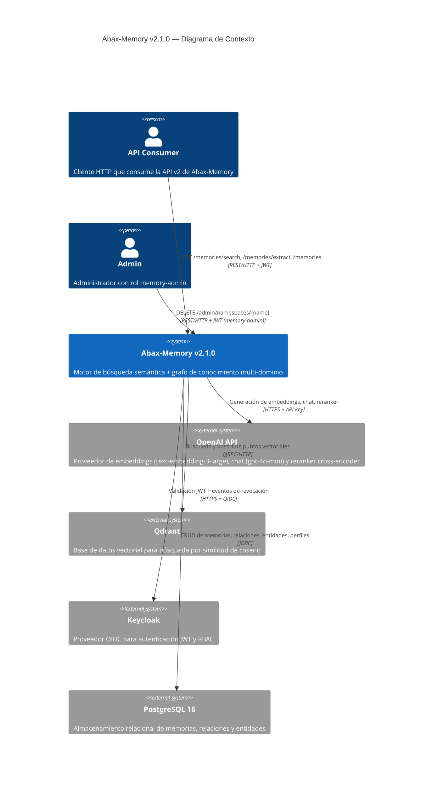
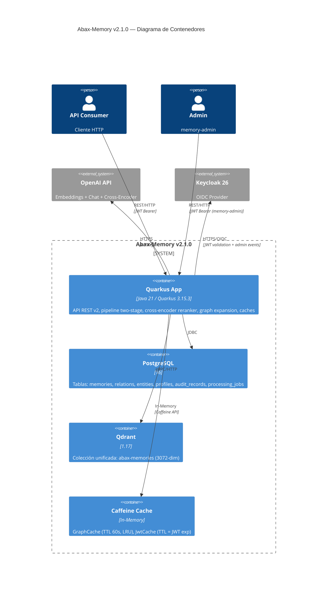
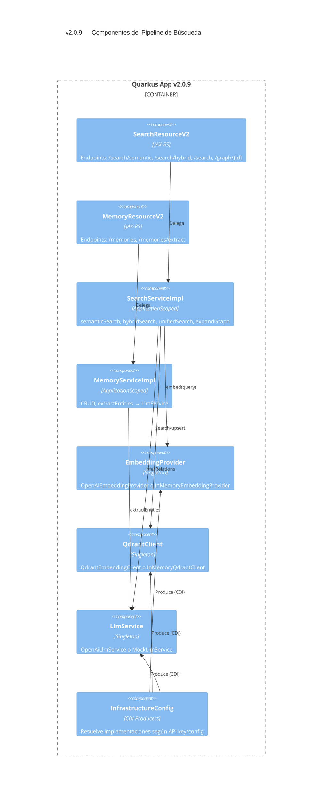
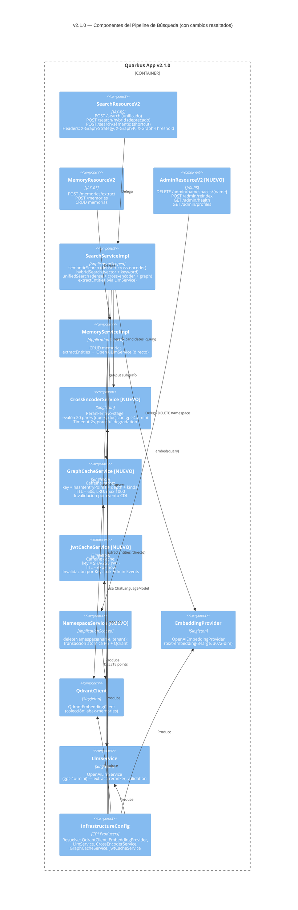
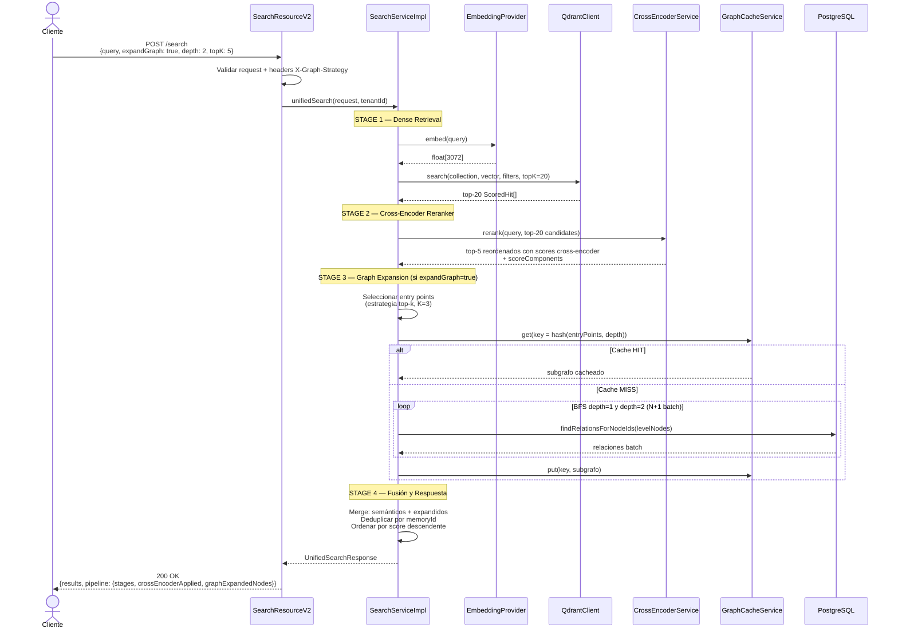

# Documento de Arquitectura — Abax-Memory v2.1.0

- **Fase**: 3 — Diseño Técnico
- **Entregable**: Documento de Arquitectura
- **Versión**: v2.1.0
- **Responsable**: solution-architect
- **Fecha**: 2026-05-06
- **Estado**: Completado

**Fuentes**:
- `docs/entregables/v2.1/fase-2-analisis/especificacion-funcional.md`
- `docs/entregables/v2.1/fase-2-analisis/reglas-de-negocio.md`
- `docs/entregables/v2.1/fase-2-analisis/diagramas-de-proceso.md`
- `docs/entregables/v2.1/fase-2-analisis/criterios-de-aceptacion.md`
- Codebase: `backend-quarkus/src/main/java/com/abax/memory/` (SearchServiceImpl, MemoryServiceImpl, SearchResourceV2, MemoryResourceV2, InfrastructureConfig, DomainProfileEntity, etc.)
- Codebase: `backend-quarkus/src/main/java/com/abax/memory/infrastructure/ai/` (OpenAiLlmService, MockLlmService, EmbeddingProvider)
- Codebase: `backend-quarkus/src/main/resources/application.properties`

---

## Tabla de Contenidos

- [1. Visión General de la Arquitectura](#1-visión-general-de-la-arquitectura)
  - [1.1 Stack Tecnológico](#11-stack-tecnológico)
  - [1.2 Estructura de Paquetes](#12-estructura-de-paquetes)
  - [1.3 Diagrama de Alto Nivel (C4 — Contexto)](#13-diagrama-de-alto-nivel-c4--contexto)
  - [1.4 Diagrama de Contenedores (C4 — Container)](#14-diagrama-de-contenedores-c4--container)
- [2. Arquitectura Actual (v2.0.9) — Línea Base](#2-arquitectura-actual-v209--línea-base)
  - [2.1 Pipeline de Búsqueda Actual](#21-pipeline-de-búsqueda-actual)
  - [2.2 Diagrama de Componentes v2.0.9](#22-diagrama-de-componentes-v209)
  - [2.3 Diagnóstico de Hallazgos Relevantes](#23-diagnóstico-de-hallazgos-relevantes)
- [3. Decisiones de Diseño (ADR) por Feature](#3-decisiones-de-diseño-adr-por-feature)
  - [3.1 EP-V21-001 — Precisión del Motor de Búsqueda](#31-ep-v21-001--precisión-del-motor-de-búsqueda)
    - [ADR-001: Reranker Cross-Encoder (FT-001.1)](#adr-001-reranker-cross-encoder-ft-0011)
    - [ADR-002: Aislamiento de Búsqueda Semántica Pura (FT-001.2)](#adr-002-aislamiento-de-búsqueda-semántica-pura-ft-0012)
    - [ADR-003: Expansión de Grafo Multi-Origen (FT-001.3)](#adr-003-expansión-de-grafo-multi-origen-ft-0013)
    - [ADR-004: Extracción de Entidades con OpenAI Real (FT-001.4)](#adr-004-extracción-de-entidades-con-openai-real-ft-0014)
  - [3.2 EP-V21-002 — Velocidad y Latencia](#32-ep-v21-002--velocidad-y-latencia)
    - [ADR-005: Cache de Grafo con Caffeine (FT-002.1)](#adr-005-cache-de-grafo-con-caffeine-ft-0021)
    - [ADR-006: Mitigación de Latencia Qdrant (FT-002.2)](#adr-006-mitigación-de-latencia-qdrant-ft-0022)
    - [ADR-007: Cache de Validación JWT (FT-002.3)](#adr-007-cache-de-validación-jwt-ft-0023)
  - [3.3 EP-V21-003 — Eficiencia Operativa](#33-ep-v21-003--eficiencia-operativa)
    - [ADR-008: Diagnóstico y Resolución del Worker Inactivo (FT-003.1)](#adr-008-diagnóstico-y-resolución-del-worker-inactivo-ft-0031)
    - [ADR-009: Unificación de Colecciones Qdrant (FT-003.2)](#adr-009-unificación-de-colecciones-qdrant-ft-0032)
    - [ADR-010: graphEntryStrategy Configurable (FT-003.3)](#adr-010-graphentrystrategy-configurable-ft-0033)
  - [3.4 EP-V21-004 — API y Developer Experience](#34-ep-v21-004--api-y-developer-experience)
    - [ADR-011: Header X-Graph-Strategy (FT-004.1)](#adr-011-header-x-graph-strategy-ft-0041)
    - [ADR-012: Unificación de Endpoints search/hybrid (FT-004.2)](#adr-012-unificación-de-endpoints-searchhybrid-ft-0042)
    - [ADR-013: DELETE /admin/namespaces/{name} (FT-004.3)](#adr-013-delete-adminnamespacesname-ft-0043)
- [4. Diagrama de Componentes v2.1.0](#4-diagrama-de-componentes-v210)
  - [4.1 Diagrama C4 — Componentes](#41-diagrama-c4--componentes)
  - [4.2 Diagrama de Secuencia: Pipeline Two-Stage](#42-diagrama-de-secuencia-pipeline-two-stage)
- [5. Modelo de Datos](#5-modelo-de-datos)
  - [5.1 Entidades JPA — Sin cambios estructurales](#51-entidades-jpa--sin-cambios-estructurales)
  - [5.2 Colección Qdrant Unificada](#52-colección-qdrant-unificada)
  - [5.3 Configuración de Perfil de Dominio (JSONB)](#53-configuración-de-perfil-de-dominio-jsonb)
- [6. Seguridad](#6-seguridad)
  - [6.1 Cache JWT](#61-cache-jwt)
  - [6.2 DELETE /admin/namespaces — Rol memory-admin](#62-delete-adminnamespaces--rol-memory-admin)
  - [6.3 X-Graph-Strategy — Sin impacto de seguridad](#63-x-graph-strategy--sin-impacto-de-seguridad)
- [7. Estrategia de Testing](#7-estrategia-de-testing)
  - [7.1 Tests Contract (API)](#71-tests-contract-api)
  - [7.2 Benchmarks (Precisión)](#72-benchmarks-precisión)
  - [7.3 Benchmarks (Latencia)](#73-benchmarks-latencia)
  - [7.4 A/B Testing del Reranker](#74-ab-testing-del-reranker)
  - [7.5 Tests de Integración](#75-tests-de-integración)
- [8. Matriz de Integraciones](#8-matriz-de-integraciones)
- [9. Estimación de Complejidad Técnica](#9-estimación-de-complejidad-técnica)
- [10. Riesgos Técnicos](#10-riesgos-técnicos)
- [11. Glosario](#11-glosario)

---

## 1. Visión General de la Arquitectura

### 1.1 Stack Tecnológico

Abax-Memory v2.1.0 es una iteración de **hardening incremental** sobre la arquitectura existente de v2.0.9. **El stack no cambia** (restricción R-01 de la Visión del Producto).

| Capa | Tecnología | Versión | Rol en v2.1.0 |
|---|---|---|---|
| **Runtime** | Quarkus (JAX-RS / CDI / Panache) | 3.15.3 | Contenedor de aplicación |
| **Lenguaje** | Java | 21 | Lógica de negocio y servicios |
| **Base de datos** | PostgreSQL (via Hibernate + Panache + Flyway) | 16 | Almacenamiento relacional (memorias, relaciones, entidades, perfiles) |
| **Vector store** | Qdrant | 1.17 | Búsqueda semántica por similitud de coseno (embeddings 3072-dim) |
| **Auth** | Keycloak (OIDC) | 26 | Autenticación JWT + RBAC |
| **IA — Embeddings** | OpenAI `text-embedding-3-large` | API | Generación de query embeddings y embeddings de documentos |
| **IA — Chat / Reranker** | OpenAI `gpt-4o-mini` | API | Extracción de entidades, reranker cross-encoder, inferencia de relaciones |
| **Cache** | Caffeine | — (nuevo) | Cache de grafo + cache JWT (nueva dependencia en v2.1.0) |

> **Nota sobre Caffeine**: v2.1.0 introduce Caffeine como dependencia nueva para los caches de grafo (FT-002.1) y JWT (FT-002.3). No es un cambio de stack, es una adición de librería Java compatible con Quarkus 3.15.3.

### 1.2 Estructura de Paquetes

La arquitectura sigue un patrón de **capas con inversión de dependencias** (domain service interfaces + infrastructure implementations), consistente con v2.0.9:

```
backend-quarkus/src/main/java/com/abax/memory/
├── api/
│   ├── rest/v2/           # JAX-RS Resources (SearchResourceV2, MemoryResourceV2, +AdminResourceV2)
│   └── dto/v2/            # Request/Response DTOs (SearchRequest, UnifiedSearchRequest, ExtractRequest, etc.)
├── domain/
│   ├── service/           # Interfaces (SearchService, MemoryService, LlmService, RelationService, +GraphCacheService)
│   ├── model/             # Domain models (MemoryFragment, Relation, DomainProfile, ExtractedEntity, +GraphExpansionResult)
│   └── enums/             # Enums (MemoryKind, LifecycleState, RelationType, SensitivityLevel, +GraphEntryStrategy)
├── infrastructure/
│   ├── service/           # Implementations (SearchServiceImpl, MemoryServiceImpl, RelationServiceImpl, +GraphCacheServiceImpl)
│   ├── ai/                # AI adapters (EmbeddingProvider, OpenAIEmbeddingProvider, OpenAiLlmService, MockLlmService, +CrossEncoderService)
│   ├── qdrant/            # Qdrant adapters (QdrantClient, QdrantEmbeddingClient, InMemoryQdrantClient)
│   ├── persistence/       # JPA Entities (MemoryFragmentEntity, RelationEntity, DomainProfileEntity, etc.)
│   ├── security/          # Auth filters (TenantFilter, TenantContext, RateLimiter, +JwtCacheFilter)
│   └── cache/             # (NUEVO) Cache components (GraphCache, JwtCache, CacheMetrics)
└── config/
    └── InfrastructureConfig.java  # CDI producers (QdrantClient, EmbeddingProvider, LlmService, +CrossEncoderService, +CacheConfig)
```

> Los items marcados con `+` son **nuevos** en v2.1.0 o sufren cambios significativos.

### 1.3 Diagrama de Alto Nivel (C4 — Contexto)



### 1.4 Diagrama de Contenedores (C4 — Container)



---

## 2. Arquitectura Actual (v2.0.9) — Línea Base

### 2.1 Pipeline de Búsqueda Actual

El pipeline de búsqueda en v2.0.9 (`SearchServiceImpl.java`) opera en **single-stage**:

1. **Dense retrieval**: `EmbeddingProvider.embed(query)` → `QdrantClient.search(collection, vector, filters, topK)` → top-K candidatos por similitud de coseno.
2. **Hybrid search** (`hybridSearch`): combina score semántico (70%) + score léxico (30% keyword via `computeKeywordScore`).
3. **Unified search** (`unifiedSearch`): ejecuta hybrid search + expande grafo desde top-K resultados vía `expandGraphConsolidated`. El grafo siempre contribuye si `expandGraph=true` (default en el DTO).
4. **Sin reranker**: el orden final es directamente el del dense retrieval o la fusión híbrida.

**Limitaciones funcionales diagnosticadas**:
- **F8v2-ISS-001**: `POST /extract` puede caer en `MockLlmService` (regex) cuando `ChatLanguageModel` CDI no es resoluble.
- **Worker inactivo**: `abax.v2.processing.auto-run=true` pero `Claimed=0` sin carga procesada.
- **Dos colecciones Qdrant**: `abax-memories-v1` (legacy, posiblemente huérfana) + `abax-memories-v2` (activa, hardcodeada en `SearchServiceImpl.QDRANT_COLLECTION`).
- **Ambigüedad search/hybrid**: `unifiedSearch` mezcla vector + keyword + grafo sin control granular del consumidor.
- **Sin caché JWT**: cada request valida el token contra Keycloak (50–200ms adicionales por request).

### 2.2 Diagrama de Componentes v2.0.9



### 2.3 Diagnóstico de Hallazgos Relevantes

| Hallazgo | Causa raíz inferida del código | Severidad |
|---|---|---|
| **`POST /extract` retorna 400** | `InfrastructureConfig.llmService()` produce `MockLlmService` cuando `ChatLanguageModel` no es resoluble o `OPENAI_API_KEY` no configurada. `MockLlmService.extractEntities()` usa regex superficial. Si la API key está ausente, el endpoint debería retornar 503, no 400. Ver **ADR-004**. | Alta |
| **Worker `Claimed=0`** | `abax.processing.auto-run=false` en `application.properties` (v1), y `abax.v2.processing.auto-run=true` pero el worker puede no estar arrancando correctamente porque la ingesta (`POST /memories`) ya procesa embeddings y entidades de forma síncrona en `MemoryServiceImpl`. Ver **ADR-008**. | Media |
| **Colección Qdrant hardcodeada** | `SearchServiceImpl.QDRANT_COLLECTION = "abax-memories-v2"`. No usa la propiedad `abax.v2.qdrant.collection`. Hay dos configuraciones en `application.properties`: `abax.qdrant.collection=abax-memories` (v1) y `abax.v2.qdrant.collection=abax-memories-v2` (v2). Ver **ADR-009**. | Media |
| **Sin JWT cache** | El `TenantFilter` extrae tenant del header o JWT sin cachear el resultado de validación contra Keycloak. Cada request autenticado paga la latencia de red a Keycloak. Ver **ADR-007**. | Media |
| **Sin caché de grafo** | `expandGraphConsolidated` ejecuta BFS completo en cada request, aunque dos queries compartan entry points y depth. Ver **ADR-005**. | Baja |

---

## 3. Decisiones de Diseño (ADR) por Feature

### 3.1 EP-V21-001 — Precisión del Motor de Búsqueda

---

### ADR-001: Reranker Cross-Encoder (FT-001.1)

- **Estado**: Aceptado
- **Fecha**: 2026-05-06
- **Contexto**: v2.0.9 usa pipeline single-stage (dense retrieval → top-K). La precisión top-1 se estanca en ~0.78. El benchmark SciFact muestra NDCG@10 = 0.7771. v2.1.0 requiere top-1 ≥ 0.90 y NDCG@10 ≥ 0.85 (CE-01, CE-03). La especificación funcional define un pipeline two-stage: Stage 1 (dense retrieval top-20) → Stage 2 (cross-encoder reranker → top-5 final). La latencia adicional del cross-encoder no debe exceder 200ms (presupuesto total: p95 ≤ 500ms).
- **Decisión**: Implementar el cross-encoder reranker usando **OpenAI `gpt-4o-mini`** como proveedor remoto, reutilizando el `ChatLanguageModel` CDI bean existente (usado por `OpenAiLlmService`). El reranker se implementa como un nuevo servicio `CrossEncoderService` inyectado en `SearchServiceImpl`.

  **Alternativas consideradas**:

  | Alternativa | Descripción | Ventajas | Desventajas |
  |---|---|---|---|
  | **A: OpenAI `gpt-4o-mini`** (seleccionada) | Usar el mismo `ChatLanguageModel` bean existente para evaluar pares (query, documento) vía prompt de entailment | Sin nueva infraestructura, reutiliza `OpenAiLlmService`, consistencia con el resto del stack AI, sin dependencia de GPU | Latencia de red (~200ms por lote de 20), costo por API call, requiere API key |
  | **B: Cross-encoder local (`sentence-transformers`)** | Desplegar modelo `allenai/scifact` o `cross-encoder/ms-marco-MiniLM-L-6-v2` en un contenedor sidecar o en-process | Latencia mucho menor (≤50ms), sin costo por API call, sin dependencia de red | Requiere GPU o contenedor con PyTorch, nueva infraestructura, gestión de modelos, rompe la restricción R-01 ("stack inalterado") |
  | **C: API de reranking de Cohere** | Usar Cohere Rerank API como servicio externo | Especializado en reranking, alta calidad | Nuevo proveedor, nueva dependencia de API, costo adicional, complejidad de integración |

  **Criterios de evaluación (matriz ponderada)**:

  | Criterio | Peso | A: OpenAI | B: Local | C: Cohere |
  |---|---|---|---|---|
  | Tiempo de implementación | 30% | 9 (2.7) | 4 (1.2) | 6 (1.8) |
  | Latencia (≤200ms batch) | 25% | 6 (1.5) | 9 (2.25) | 7 (1.75) |
  | Costo operativo | 20% | 7 (1.4) | 9 (1.8) | 5 (1.0) |
  | Complejidad de infraestructura | 15% | 9 (1.35) | 3 (0.45) | 7 (1.05) |
  | Calidad de reranking | 10% | 8 (0.8) | 7 (0.7) | 9 (0.9) |
  | **Total** | **100%** | **7.75** | **6.40** | **6.50** |

- **Diseño del pipeline**: El reranker se ubica en `SearchServiceImpl` como método privado `rerankWithCrossEncoder(List<QdrantClient.ScoredHit> candidates, String query)`. Recibe los top-20 candidatos del dense retrieval y retorna la lista reordenada con scores del cross-encoder. Se invoca tanto en `semanticSearch` como en `unifiedSearch` (antes de la expansión de grafo).

- **Manejo de latencia**:
  - Timeout de 2 segundos para la llamada al cross-encoder (un solo prompt que evalúa los 20 pares).
  - Si el timeout se excede → degradación graceful: se retorna el orden del dense retrieval + log `WARN CROSS_ENCODER_TIMEOUT`.
  - Si el cross-encoder no está disponible (API key ausente, `ChatLanguageModel` no resoluble) → `CROSS_ENCODER_UNAVAILABLE` + degradación a dense-only.

- **Estrategia de fallback**:
  1. `ChatLanguageModel` no resoluble (sin API key) → `InfrastructureConfig` loguea `WARN`. `CrossEncoderService` retorna `Optional.empty()`.
  2. `SearchServiceImpl` detecta `Optional.empty()` → omite Stage 2, retorna dense-only.
  3. Error en el prompt de reranking (malformed JSON) → log `ERROR`, se omite el reranking para esa query.

- **Consecuencias**:
  - **Positivas**: Precisión esperada top-1 ≥ 0.90 (mejora de +0.12 a +0.15 sobre dense-only). Sin nueva infraestructura. Implementación en ~3 días.
  - **Negativas**: ~200ms de latencia adicional en el camino feliz. Costo por API call (~$0.0003 por lote de 20 pares con `gpt-4o-mini`). Dependencia de disponibilidad de OpenAI.
  - **Riesgos**: Si OpenAI tiene una interrupción, el pipeline degrada a dense-only (v2.0.9). La precisión cae a ~0.78 durante la interrupción, pero el sistema sigue funcionando.

---

### ADR-002: Aislamiento de Búsqueda Semántica Pura (FT-001.2)

- **Estado**: Aceptado
- **Fecha**: 2026-05-06
- **Contexto**: En v2.0.9, `UnifiedSearchRequest.expandGraph` tiene default `true`. El `unifiedSearch` siempre ejecuta hybrid search + graph expansion, mezclando resultados sin que el consumidor tenga control granular. La especificación funcional FT-001.2 exige que `expandGraph: false` (explícito o por omisión) aisle completamente la búsqueda semántica del grafo.
- **Decisión**: **Modificar `UnifiedSearchRequest`** para que `expandGraph` tenga default `false` (en lugar de `true`). **Modificar `SearchServiceImpl.unifiedSearch()`** para que cuando `expandGraph=false`:
  1. Ejecute el pipeline semántico (dense retrieval + cross-encoder).
  2. **No invoque** `expandGraphConsolidated()`.
  3. Retorne `pipeline.graphExpanded: false` y **no incluya** el campo `graphExpandedNodes`.

  Cuando `expandGraph=true` o es un objeto con `depth`: ejecuta el pipeline semántico + expansión de grafo desde los top-K entry points.

  **El flag `expandGraph` controla exclusivamente la activación del grafo**. No afecta el comportamiento del pipeline semántico (dense + cross-encoder).

- **Alternativas**:
  - **A: Mantener `expandGraph=true` como default y agregar flag `pureSemantic`**: Añade otro parámetro. Confunde. Rechazada.
  - **B: Endpoint separado `/search/pure`**: Duplica endpoints. Va contra FT-004.2 (unificación). Rechazada.

- **Consecuencias**:
  - **Positivas**: Control granular del consumidor. Elimina ambigüedad v2.0.9. Compatible con FT-004.2 (unificación).
  - **Negativas**: Cambio de default puede afectar consumidores que dependían de `expandGraph=true` implícito. Mitigado porque v2.1.0 documenta el cambio (Compatibilidad §5 en especificación funcional).
  - **Riesgos**: Consumidores existentes que no envían `expandGraph` y esperaban resultados del grafo verán menos resultados. Se mitiga con documentación y headers de deprecación donde aplique.

---

### ADR-003: Expansión de Grafo Multi-Origen (FT-001.3)

- **Estado**: Aceptado
- **Fecha**: 2026-05-06
- **Contexto**: v2.0.9 expande el grafo desde los top-K resultados del dense retrieval (`graphTopK=5` por defecto en `UnifiedSearchRequest`). La especificación FT-001.3 cambia el default a top-3 y añade `entryPoints` explícitos con máxima precedencia. También introduce las estrategias `single-best`, `top-k`, `threshold` configuradas por perfil o header.
- **Decisión**: **Extender `SearchServiceImpl.expandGraphConsolidated()`** para que acepte:
  1. **`entryPoints` explícitos**: array de UUIDs en el request body. Si están presentes, tienen **máxima precedencia** → se ignoran dense retrieval y headers. Se usan como seeds de BFS.
  2. **Estrategia configurable**: `single-best`, `top-k`, `threshold` — resuelta desde el perfil de dominio o el header `X-Graph-Strategy` (ver ADR-011).
  3. **Default `graphTopK=3`** (cambio desde 5 en v2.0.9).

  **El cambio se implementa en `SearchServiceImpl`**, no en un nuevo `GraphExpander`. El método `expandGraphConsolidated` ya está diseñado para multi-seed BFS con batch fetching N+1. La extensión consiste en:
  - Añadir lógica de selección de entry points (explícitos vs automáticos vs estrategia).
  - Añadir validación de `entryPoints` (max 10, deduplicación, verificación de existencia).
  - Exponer metadata en `UnifiedSearchResponse`: `entryPointIds`, `entryPointCount`, `entryPointSource`, `totalExpandedNodes`, `maxDepth`, `cacheHit`.

- **Exposición en API**: `entryPoints` se añade como campo opcional `List<String>` en `UnifiedSearchRequest`. El `entryPointSource` se incluye en la respuesta.

- **Consecuencias**:
  - **Positivas**: Recall multi-dominio proyectado de 69.4% (single-best v2.0.9) a ≥85% (top-3). Control granular vía `entryPoints` explícitos.
  - **Negativas**: Más resultados expandidos = más latencia en queries con grafo. Mitigado por ADR-005 (cache de grafo). Cambio de default de 5 a 3 entry points afecta a consumidores existentes.
  - **Riesgos**: Expansión desde 3 entry points puede duplicar nodos si los seeds comparten vecinos. Ya manejado por `visited` set en `expandGraphConsolidated`.

---

### ADR-004: Extracción de Entidades con OpenAI Real (FT-001.4)

- **Estado**: Aceptado
- **Fecha**: 2026-05-06
- **Contexto**: `POST /memories/extract` actualmente delega en `MemoryServiceImpl.extractEntities()` → `LlmService.extractEntities()`. El `LlmService` es producido por `InfrastructureConfig.llmService()`, que elige entre `OpenAiLlmService` (si `ChatLanguageModel` CDI es resoluble y API key válida) o `MockLlmService` (regex superficial). Cuando la API key no está configurada, se usa `MockLlmService` silenciosamente, retornando entidades de baja calidad (hallazgo F8v2-ISS-001). La especificación FT-001.4 exige que el endpoint use **exclusivamente** OpenAI `gpt-4o-mini` y **nunca** degrade a `MockLlmService`.

- **Diagnóstico del 400 actual**: El error 400 en `POST /extract` no es un bug de validación. Ocurre porque:
  1. `InfrastructureConfig.llmService()` detecta que `OPENAI_API_KEY` no está configurada o `ChatLanguageModel` no es resoluble.
  2. Produce `MockLlmService` con log `WARN`.
  3. `MockLlmService.extractEntities()` usa regex superficial y **siempre** retorna al menos una entidad (`"Test Entity"`).
  4. El error 400 probablemente proviene de otra validación en el request (ej. `@NotBlank` en `ExtractRequest.content` con un valor que no llega correctamente).

  **Acción**: Separar la lógica de `LlmService` para `POST /extract` del resto de usos de LLM (validación, resúmenes, inferencia de relaciones). El endpoint `/extract` debe usar **exclusivamente** `OpenAiLlmService` y fallar con errores HTTP explícitos si OpenAI no está disponible.

- **Decisión**: **Modificar `MemoryServiceImpl.extractEntities()`** para:
  1. No depender del `LlmService` genérico inyectado. En su lugar, usar directamente `OpenAiLlmService` (inyectado como dependencia separada o resuelto vía `InfrastructureConfig`).
  2. Si `OPENAI_API_KEY` no está configurada → `HTTP 503 SERVICE_UNAVAILABLE`.
  3. Si OpenAI retorna error → `HTTP 502 BAD_GATEWAY`.
  4. Si timeout > 5s → `HTTP 504 GATEWAY_TIMEOUT`.
  5. Si OpenAI retorna 0 entidades → `HTTP 200 OK` con `entities: []`.
  6. **Nunca** degradar a `MockLlmService`.

  **El pipeline de extracción usa el mismo cliente OpenAI (`ChatLanguageModel`)** que `OpenAiLlmService`, por lo que no hay duplicación de configuración. La diferencia es el manejo de errores: `OpenAiLlmService` silenciosamente retorna lista vacía en caso de fallo (para no romper flujos batch), mientras que `POST /extract` debe reportar el error explícitamente.

- **Alternativas**:
  - **A: Hacer que `OpenAiLlmService` lance excepciones en `/extract`**: Rompe el contrato de `LlmService` para otros callers. Rechazada.
  - **B: Crear `ExtractService` separado**: Añade una capa innecesaria. `MemoryServiceImpl` ya es el orquestador adecuado.

- **Consecuencias**:
  - **Positivas**: `POST /extract` siempre usa IA real en producción. Errores explícitos y diagnosticables. Cumple CE-06.
  - **Negativas**: Si OpenAI no está disponible, `POST /extract` falla (no degrada). Esto es intencional (BR-V21-005: "nunca debe degradar silenciosamente a MockLlmService").
  - **Riesgos**: Dependencia de disponibilidad de OpenAI para el endpoint `/extract`.

---

### 3.2 EP-V21-002 — Velocidad y Latencia

---

### ADR-005: Cache de Grafo con Caffeine (FT-002.1)

- **Estado**: Aceptado
- **Fecha**: 2026-05-06
- **Contexto**: `expandGraphConsolidated` en `SearchServiceImpl` ejecuta BFS completo en cada request con `expandGraph: true`, incluso cuando dos queries comparten los mismos `entryPoints` y `graphDepth`. La especificación FT-002.1 requiere cachear subgrafos en memoria con TTL de 60s y políticas LRU.

- **Decisión**: Implementar **cache de grafo en memoria usando Caffeine** como librería de caché local. Crear `GraphCacheService` que envuelve un `Cache<String, GraphExpansionResult>` de Caffeine.

  **Configuración del caché**:
  | Parámetro | Valor | Configurable vía |
  |---|---|---|
  | Clave | `hash(sorted(entryPointIds)) + ":" + graphDepth + ":" + hash(includeKinds)` | — |
  | TTL | 60 segundos | `abax.v2.graph-cache.ttl-seconds` |
  | Capacidad máxima | 1,000 entradas | `abax.v2.graph-cache.max-size` |
  | Política de evicción | LRU (por defecto en Caffeine) | — |

  **Invalidación**: Ante cualquier mutación del grafo (create/delete de `RelationEntity`), se invalida la entrada de caché cuyos `entryPointIds` incluyan el `sourceId` o `targetId` de la relación mutada. La invalidación se implementa como un evento CDI (`@Observes GraphMutatedEvent`) disparado desde `RelationServiceImpl`.

  **Ubicación en el código**: `SearchServiceImpl.unifiedSearch()` consulta `graphCacheService.get(key)` antes de invocar `expandGraphConsolidated()`. Si cache hit → retorna el resultado cacheado con `cacheHit: true`. Si cache miss → ejecuta BFS, almacena en caché, retorna con `cacheHit: false`.

- **Alternativas**:
  - **A: Redis**: Overkill para caché local. Añade latencia de red y dependencia de infraestructura. Rechazada para v2.1.0.
  - **B: HashMap simple sin TTL**: Sin control de memoria, riesgo de OOM. Rechazada.

- **Consecuencias**:
  - **Positivas**: Latencia de expansión de grafo reducida de ~320ms a ~85ms en cache hit. Sin dependencia de infraestructura externa. Caffeine es ligero y bien integrado con Quarkus (via `quarkus-cache` extension o manual).
  - **Negativas**: Memoria adicional (~50MB estimado para 1,000 entradas de subgrafos). Invalidación por evento añade acoplamiento entre `RelationServiceImpl` y `GraphCacheService`.
  - **Riesgos**: Stale cache si la invalidación por evento falla. Mitigado por TTL de 60s (ventana máxima de staleness).

---

### ADR-006: Mitigación de Latencia Qdrant (FT-002.2)

- **Estado**: Aceptado (con fase de diagnóstico previa)
- **Fecha**: 2026-05-06
- **Contexto**: Spikes de latencia a ~2s observados en benchmarks de v2.0.9. La especificación FT-002.2 requiere p95 ≤ 500ms estable bajo cold start, steady state y escritura concurrente. La feature no expone nuevos parámetros; es optimización interna.

- **Decisión**: Ejecutar una **fase de diagnóstico** antes de aplicar mitigaciones. Las hipótesis a verificar (basadas en el análisis del código y configuración actual):

  | Hipótesis | Evidencia en código/config | Mitigación si se confirma |
  |---|---|---|
  | **Cold start de segmentos Qdrant**: los segmentos HNSW no están pre-calentados tras reinicio | `QdrantEmbeddingClient` no implementa warm-up queries al iniciar | Configurar `optimizers_config.default_segment_number` adecuado. Ejecutar 10–20 queries de pre-calentamiento al iniciar la aplicación (via `@Startup` CDI bean). |
  | **Lock contention en Qdrant durante escrituras concurrentes**: las escrituras bloquean lecturas | No hay configuración de `wal_config` o `optimizers_config` expuesta en `application.properties` | Configurar `wal_config.wal_capacity_mb` y `optimizers_config.flush_interval_sec`. Usar `read_consistency: majority` si aplica. |
  | **Network latency**: latencia de red entre Quarkus y Qdrant | Usa HTTP (no gRPC) en `QdrantEmbeddingClient`. Timeout no configurado explícitamente para búsquedas | Configurar timeouts HTTP. Considerar connection pooling (HTTP/1.1 keep-alive o HTTP/2). |
  | **GC pauses en Quarkus**: garbage collection durante búsquedas | Java 21 con G1GC por defecto. Sin tuning de GC | Configurar `-XX:MaxGCPauseMillis=100` y `-Xmx` adecuado. |

  **Proceso**:
  1. **Semana 1 de construcción**: ejecutar pruebas de carga con Apache Bench o k6 contra el endpoint `POST /memories/search` en tres escenarios (cold start, steady state, escritura concurrente). Medir p95, p99, y latencia por componente (embedding, Qdrant search, cross-encoder, BFS).
  2. **Semana 2**: según resultados, aplicar mitigaciones. Documentar en runbook de operaciones.
  3. Si el diagnóstico revela necesidad de upgrade de Qdrant (1.17 → 1.18+), escalar al sponsor (riesgo RSK-04 del backlog).

- **Consecuencias**:
  - **Positivas**: Enfoque basado en evidencia. Sin cambios innecesarios.
  - **Negativas**: La fase de diagnóstico consume 1 semana del cronograma.
  - **Riesgos**: Si ninguna mitigación de configuración resuelve el problema, puede requerir upgrade de Qdrant (rompe R-01). Este riesgo está identificado como RSK-04.

---

### ADR-007: Cache de Validación JWT (FT-002.3)

- **Estado**: Aceptado
- **Fecha**: 2026-05-06
- **Contexto**: Cada request a la API v2 requiere validación del JWT contra Keycloak (50–200ms). La especificación FT-002.3 requiere cachear el resultado de la validación en memoria con TTL = `exp - now` del JWT, invalidando ante eventos de revocación.

- **Decisión**: Implementar **cache de JWT en memoria usando Caffeine** en la capa de seguridad (`TenantFilter`). Crear `JwtCacheService` que almacena pares `(tokenHash, JwtClaims)` con TTL igual al campo `exp` del JWT.

  **Diseño**:
  - **Clave**: SHA-256 del token JWT completo (no se almacena el token en texto plano en el caché).
  - **TTL**: `min(exp - now, 3600)` — calculado del claim `exp` del JWT.
  - **Invalidación**: `JwtCacheService` se suscribe a Keycloak Admin Events (via webhook o polling `GET /admin/realms/{realm}/events`). Al recibir evento `LOGOUT` o `REVOKE_GRANT`, invalida la entrada correspondiente.
  - **Resiliencia**: Si Keycloak está inaccesible, los tokens cacheados no expirados se aceptan (la request se procesa). Si Keycloak está inaccesible y el token no está en caché → `HTTP 503`.

  **Ubicación**: Se añade una validación en `TenantFilter`:
  ```java
  // Pseudocódigo
  String tokenHash = sha256(jwt);
  Optional<JwtClaims> cached = jwtCacheService.get(tokenHash);
  if (cached.isPresent() && !cached.get().isExpired()) {
      // Cache hit → usar claims cacheados (≤5ms)
      setTenantContext(cached.get());
  } else {
      // Cache miss → validar contra Keycloak (50-200ms)
      JwtClaims claims = keycloakClient.validate(jwt);
      jwtCacheService.put(tokenHash, claims, claims.getTtl());
      setTenantContext(claims);
  }
  ```

  **Alternativas**:
  - **A: Cache del lado del cliente (documentación)**: Solo documentar que el cliente reutilice el token durante su TTL. No reduce latencia de validación (cada request sigue validando contra Keycloak). Rechazada.
  - **B: Redis para JWT compartido entre instancias**: Overkill para despliegue single-instance actual. Añade dependencia de Redis. Rechazada para v2.1.0.

- **Consecuencias**:
  - **Positivas**: Reducción de latencia de autenticación de 50–200ms a ≤5ms en cache hit. ~99% de requests se benefician (cache hit ratio esperado ≥0.90). Resiliencia ante caídas de Keycloak.
  - **Negativas**: Ventana máxima de 5s donde un token revocado aún se acepta (hasta que el evento de revocación se procesa). Memoria adicional (~10MB para 1,000 tokens). Complejidad adicional en `TenantFilter`.
  - **Riesgos**: Si Keycloak Admin Events no está disponible (ej. realm no configurado para emitir eventos), la invalidación solo depende del TTL (ventana máxima de hasta 1 hora).

---

### 3.3 EP-V21-003 — Eficiencia Operativa

---

### ADR-008: Diagnóstico y Resolución del Worker Inactivo (FT-003.1)

- **Estado**: Propuesto (requiere diagnóstico antes de aceptar)
- **Fecha**: 2026-05-06
- **Contexto**: El worker de procesamiento asíncrono reporta `Claimed = 0`. La propiedad `abax.v2.processing.auto-run=true` está configurada. La especificación FT-003.1 requiere diagnosticar la causa raíz y decidir entre eliminar (Escenario A: el procesamiento síncrono en `POST /memories` es suficiente) o reparar (Escenario B: se necesita worker asíncrono).

- **Diagnóstico preliminar (basado en análisis de código)**:

  Evidencia del análisis estático:
  1. `MemoryServiceImpl` procesa embeddings y entidades de forma **síncrona** durante la creación de memorias:
     - `indexFragment()` → genera embedding via `EmbeddingProvider.embed()` + upsert a Qdrant → **síncrono**.
     - `extractEntities()` → llama a `LlmService.extractEntities()` → **síncrono** (si es `OpenAiLlmService`, tarda ~1-2s).
  2. El worker (`com.btl.administrador.api.service.ProcessingWorkerService`) es parte del módulo legacy v1 (`com.btl`), no del módulo v2 (`com.abax.memory`).
  3. La propiedad `abax.processing.auto-run=false` (v1) y `abax.v2.processing.auto-run=true` (v2) — pero no hay evidencia de que el worker v2 esté implementado o conectado a una cola de mensajes.

  **Hipótesis más probable**: El worker legacy v1 está inactivo porque `abax.processing.auto-run=false`. No hay un worker v2 implementado (el procesamiento es 100% síncrono en `MemoryServiceImpl`). Si esto se confirma → **Escenario A: eliminar el worker**.

- **Decisión**: Ejecutar diagnóstico en vivo durante la primera semana de construcción:
  1. Verificar logs del worker (`ProcessingWorkerService`) en ambiente staging.
  2. Confirmar que `POST /memories` procesa embeddings y entidades síncronamente con éxito.
  3. Si se confirma el Escenario A → eliminar la configuración `abax.v2.processing.*`, eliminar el worker del deploy, documentar que el procesamiento es síncrono.
  4. Si se descubre que el worker es necesario (ej. para re-procesamiento batch) → reparar la conexión a la cola.

- **Consecuencias**:
  - **Positivas**: Eliminación de código muerto. Menor consumo de recursos. Sin workers inactivos en producción.
  - **Negativas**: Si el worker es necesario y se elimina prematuramente, la ingesta podría fallar. Mitigado por la fase de diagnóstico previa.
  - **Riesgos**: Bajo. El diagnóstico es no-destructivo y la decisión final se toma con evidencia.

---

### ADR-009: Unificación de Colecciones Qdrant (FT-003.2)

- **Estado**: Aceptado
- **Fecha**: 2026-05-06
- **Contexto**: El cluster Qdrant contiene dos colecciones: `abax-memories-v1` (legacy, datos posiblemente huérfanos) y `abax-memories-v2` (activa, hardcodeada en `SearchServiceImpl.QDRANT_COLLECTION`). La especificación FT-003.2 requiere exactamente 1 colección: `abax-memories`.

- **Decisión**: Ejecutar **script de migración offline (pre-deploy de v2.1.0)**. No se hace migración en vivo.

  **Pasos del script** (a ejecutar por DevOps, no automatizado en código):
  1. **Verificación pre-migración**: Consultar PostgreSQL para determinar si hay `memory_id` activos cuyos puntos vectoriales estén exclusivamente en `abax-memories-v1`.
     ```sql
     SELECT COUNT(*) FROM memories m
     JOIN qdrant_v1_mapping q ON m.id = q.memory_id
     WHERE m.lifecycle_status = 'active' AND m.deleted_at IS NULL
       AND q.collection = 'abax-memories-v1';
     ```
  2. **Si hay datos activos**: Migrar vía Qdrant API (`POST /collections/abax-memories/points/upsert` con batch de puntos de v1).
  3. **Snapshot**: Crear snapshot de `abax-memories-v1` como respaldo.
  4. **Eliminación**: `DELETE /collections/abax-memories-v1` via Qdrant API.
  5. **Renombrar**: Renombrar `abax-memories-v2` → `abax-memories` (o crear alias `abax-memories` → `abax-memories-v2` si Qdrant 1.17 no soporta rename).
  6. **Actualizar configuración**: Cambiar `abax.v2.qdrant.collection=abax-memories-v2` → `abax.v2.qdrant.collection=abax-memories` en `application.properties`.
  7. **Cambiar constante en código**: `SearchServiceImpl.QDRANT_COLLECTION = "abax-memories"` (o mejor, leer de `abax.v2.qdrant.collection` — eliminar el hardcode).

  **Plan de rollback**: Si cualquier paso falla:
  - Restaurar snapshot de v1 si fue necesario.
  - Ambas colecciones permanecen intactas.
  - El despliegue de v2.1.0 se pospone hasta resolver.

  **Verificación post-migración**:
  - `GET /collections` → exactamente 1 colección.
  - `GET /collections/abax-memories-v1` → 404.
  - Suite multi-dominio (50 queries) → 100% resultados esperados.
  - Ingesta de 10 memorias → puntos en `abax-memories`, buscables en ≤2s.

- **Consecuencias**:
  - **Positivas**: Una sola colección = menos overhead operativo (backups, monitoreo). Cumple CE-05.
  - **Negativas**: Proceso manual offline que requiere ventana de mantenimiento (~30 min). Riesgo de error humano.
  - **Riesgos**: Si v1 contiene datos activos no detectados en la verificación → pérdida de datos. Mitigado por snapshot y verificación pre-migración exhaustiva.

---

### ADR-010: graphEntryStrategy Configurable (FT-003.3)

- **Estado**: Aceptado
- **Fecha**: 2026-05-06
- **Contexto**: v2.0.9 hardcodea la estrategia de entrada al grafo (top-K desde dense retrieval, sin opción de `single-best` o `threshold`). La especificación FT-003.3 requiere que la estrategia sea configurable a nivel de perfil de dominio.

- **Decisión**: Almacenar `graphEntryStrategy` en el campo JSONB `config` de `DomainProfileEntity`. **No se añade una columna dedicada** (restricción R-04: modelo de datos inalterado). La configuración se parsea en runtime desde el JSONB.

  **Estructura dentro de `config` JSONB**:
  ```json
  {
    "graphEntryStrategy": {
      "strategy": "top-k",
      "graphK": 3,
      "graphThreshold": null
    }
  }
  ```

  **Valores aceptados**:
  | `strategy` | `graphK` | `graphThreshold` | Comportamiento |
  |---|---|---|---|
  | `single-best` | ignorado | ignorado | Expande desde el mejor match del dense retrieval |
  | `top-k` | 1–10 (default 3) | ignorado | Expande desde los K mejores matches |
  | `threshold` | ignorado | 0.0–1.0 (default 0.80) | Expande desde todos los matches con score ≥ umbral |

  **Resolución en runtime**: `SearchServiceImpl` lee el perfil de dominio activo (vía `TenantContext` → `DomainProfileEntity.findDefault()`), parsea `config.graphEntryStrategy`, y lo usa como default. Puede ser sobrescrito por request vía header `X-Graph-Strategy` (ADR-011).

  **No se requiere reinicio**: el perfil se lee en cada request o se cachea con TTL corto (30s).

- **Alternativas**:
  - **A: Nueva columna SQL `graph_entry_strategy`**: Más fácil de consultar e indexar. Rompe R-04 (modelo inalterado). Rechazada.
  - **B: `application.properties`**: Estrategia global, no por perfil de dominio. No cumple FT-003.3. Rechazada.

- **Consecuencias**:
  - **Positivas**: Configuración granular por dominio. Sin cambios de esquema. Hot-reload sin reinicio.
  - **Negativas**: Parseo JSONB en cada request (mitigado con caché local de perfil). Validación de configuración en runtime (no en compile-time).
  - **Riesgos**: Configuración malformada en JSONB podría causar fallback al default `top-k`. Mitigado con validación y log `WARN`.

---

### 3.4 EP-V21-004 — API y Developer Experience

---

### ADR-011: Header X-Graph-Strategy (FT-004.1)

- **Estado**: Aceptado
- **Fecha**: 2026-05-06
- **Contexto**: La especificación FT-004.1 requiere que el consumidor pueda controlar la estrategia de expansión del grafo por request mediante headers HTTP, sobrescribiendo la configuración del perfil de dominio.

- **Decisión**: Implementar como **headers HTTP**, no como campos en el body. Tres headers nuevos:

  | Header | Tipo | Valores | Default |
  |---|---|---|---|
  | `X-Graph-Strategy` | string | `none`, `single`, `top-k`, `threshold` | Config del perfil de dominio |
  | `X-Graph-K` | integer | 1–10 | 3 (del perfil) |
  | `X-Graph-Threshold` | float | 0.0–1.0 | 0.80 (del perfil) |

  **Por qué headers y no body**:
  - Separación de concerns: los headers son metadata de la request (cómo procesar), el body es el contenido (qué buscar).
  - Consistente con otros patrones HTTP (ej. `Accept`, `Accept-Encoding`, `Prefer`).
  - Los headers pueden ser añadidos por proxies/gateways sin modificar el body.
  - El body ya contiene `query`, `filters`, `expandGraph`, `topK` — añadir más parámetros de control haría el contrato confuso.

  **Reglas de precedencia** (en orden):
  1. `entryPoints` en el body (máxima precedencia — ADR-003).
  2. `X-Graph-Strategy` header.
  3. `graphEntryStrategy` del perfil de dominio (ADR-010).

  **Valores**:
  - `none`: sin expansión de grafo, incluso si `expandGraph: true` en body. Equivalente a `expandGraph: false`.
  - `single`: expande solo desde el mejor match (comportamiento v2.0.9).
  - `top-k`: expande desde los K mejores matches (K = `X-Graph-K` o default 3).
  - `threshold`: expande desde matches con score ≥ umbral (`X-Graph-Threshold` o default 0.80).

  **Implementación**: Los headers se leen en `SearchResourceV2` como `@HeaderParam` y se pasan a `SearchServiceImpl.unifiedSearch()` como parámetros adicionales o como un objeto `GraphStrategy override`.

- **Consecuencias**:
  - **Positivas**: Control granular por request. Backward compatible (headers ausentes → se usa el perfil). Consistente con REST.
  - **Negativas**: Tres headers nuevos que el consumidor debe conocer. Documentación OpenAPI debe reflejarlos.
  - **Riesgos**: Consumidores podrían enviar headers malformados → HTTP 400 con mensaje claro. No hay riesgo de seguridad (los headers no exponen datos sensibles).

---

### ADR-012: Unificación de Endpoints search/hybrid (FT-004.2)

- **Estado**: Aceptado
- **Fecha**: 2026-05-06
- **Contexto**: v2.0.9 tiene endpoints redundantes: `POST /search/semantic`, `POST /search/hybrid`, `POST /search` (unified). La especificación FT-004.2 unifica en `POST /memories/search` con parámetros `semanticWeight` y `lexicalWeight`. El endpoint `hybrid` se depreca con headers de advertencia.

- **Decisión**:

  **Nuevo endpoint unificado**:
  - `POST /memories/search` → acepta `semanticWeight` (0.0–1.0), `lexicalWeight` (0.0–1.0), `expandGraph`, `rerank`, `topK`, `filters`, `entryPoints`.
  - Al menos uno de los pesos debe ser > 0.
  - Pesos que suman > 1.0 se normalizan internamente (log `DEBUG`).
  - `semanticWeight: 1.0, lexicalWeight: 0.0` → búsqueda semántica pura.
  - `semanticWeight: 0.0, lexicalWeight: 1.0` → búsqueda léxica pura.
  - `semanticWeight: 0.6, lexicalWeight: 0.4` → búsqueda híbrida.

  **Endpoints legacy**:
  - `POST /search/hybrid` → se **mantiene funcional**, pero añade headers `Deprecation: true` y `Warning: 299 - "Use POST /memories/search with semanticWeight and lexicalWeight parameters."`. Internamente delega al endpoint unificado con `semanticWeight: 0.5, lexicalWeight: 0.5`.
  - `POST /search/semantic` → se **mantiene funcional** como atajo para `semanticWeight: 1.0, lexicalWeight: 0.0, expandGraph: false`. Sin headers de deprecación (sigue siendo útil como shortcut).
  - `POST /search` (unified v2.0.9) → se **mantiene y extiende** con los nuevos parámetros. Es el mismo endpoint que `POST /memories/search` (alias o renombrado).

  > **Nota sobre paths**: La especificación funcional usa `/memories/search`. El código actual usa `/search`. Para evitar breaking changes, se mantiene `/search` como path primario y se añade `/memories/search` como alias que redirige internamente al mismo `SearchResourceV2.unifiedSearch()`.

  **No se elimina `/hybrid`** — se depreca con warning. Esto garantiza backward compatibility (R-02).

- **Alternativas**:
  - **A: Eliminar `/hybrid` inmediatamente**: Breaking change. Rompe R-02. Rechazada.
  - **B: Redirigir `/hybrid` → `/search` con HTTP 308**: El consumidor podría no seguir redirecciones en POST. Rechazada.
  - **C: Mantener endpoints separados y añadir flags**: Perpetúa la fragmentación. Rechazada.

- **Consecuencias**:
  - **Positivas**: Un solo endpoint que cubre todos los modos de búsqueda. API más simple y documentable. Backward compatibility preservada.
  - **Negativas**: Tres paths apuntando a la misma lógica (`/search`, `/memories/search`, `/search/hybrid` → `/search`, `/search/semantic` → `/search`). Documentación debe clarificar cuál es el canónico.
  - **Riesgos**: Bajo. Los endpoints legacy se mantienen funcionales. La unificación es aditiva.

---

### ADR-013: DELETE /admin/namespaces/{name} (FT-004.3)

- **Estado**: Aceptado
- **Fecha**: 2026-05-06
- **Contexto**: v2.0.9 no tiene endpoint para eliminar namespaces completos. La especificación FT-004.3 requiere un endpoint administrativo atómico que elimine todos los recursos (memorias, relaciones, entidades, puntos Qdrant) de un namespace.

- **Decisión**: Crear **nuevo Resource `AdminResourceV2`** en el paquete `api/rest/v2/` con el endpoint:

  ```
  DELETE /api/v2/admin/namespaces/{name}
  Authorization: Bearer <JWT con rol memory-admin>
  X-Tenant-Id: <tenant>
  ```

  **Nuevo controller**: `AdminResourceV2` — separado de `SearchResourceV2` y `MemoryResourceV2` para agrupar endpoints administrativos (`DELETE namespace`, `POST /admin/reindex`, `GET /admin/health`, `GET /admin/profiles`). En el futuro, `SearchResourceV2.adminEndpoints()` se moverán a este controller.

  **Autorización**: Requiere rol `memory-admin` en el JWT. Sin este rol → `HTTP 403 FORBIDDEN`. La validación del rol se implementa en el `TenantFilter` (extendiendo la lógica actual de `X-Role` header mock) o vía anotación `@RolesAllowed("memory-admin")` de Quarkus (si se integra con Keycloak OIDC).

  **Atomicidad**: Se implementa como una transacción en `NamespaceService.deleteNamespace(name, tenantId)`:
  1. `BEGIN TRANSACTION`
  2. `DELETE FROM memories WHERE namespace = :name AND tenant_id = :tenant`
  3. `DELETE FROM relations WHERE source_id IN (SELECT id FROM deleted_memories) OR target_id IN (...)`
  4. `DELETE FROM entities WHERE memory_id IN (SELECT id FROM deleted_memories)`
  5. `DELETE FROM qdrant_points WHERE memory_id IN (...)`
  6. Si todos los pasos son exitosos → `COMMIT`. Si alguno falla → `ROLLBACK`.
  7. Contar recursos eliminados y retornar `200 OK` con resumen.

  **Confirmación**: No se requiere confirmación explícita del cliente (no hay endpoint `POST .../confirm`). La operación es irreversible (así lo especifica BR-V21-013). Si se desea un mecanismo de confirmación, se puede añadir un header `X-Confirm-Delete: true` en futuras iteraciones.

- **Alternativas**:
  - **A: Soft-delete con flag `deleted_at`**: Permitiría recuperación. No cumple BR-V21-013 ("irreversible"). Rechazada.
  - **B: Añadir endpoint en `MemoryResourceV2`**: Mezcla concerns CRUD con administración. `AdminResourceV2` es más limpio.

- **Consecuencias**:
  - **Positivas**: Operación atómica, irreversible, con resumen. Cumple CE-08. Simplifica benchmarks y limpieza de datos de prueba.
  - **Negativas**: Sin papelera de reciclaje. Si un admin se equivoca de namespace, los datos se pierden permanentemente. Mitigado por el requisito de rol `memory-admin` (no cualquier usuario puede ejecutarlo).
  - **Riesgos**: Fallo parcial en Qdrant (paso 5) deja PostgreSQL en estado inconsistente. Mitigado por la transacción: si Qdrant falla, se hace ROLLBACK de PostgreSQL. Pero Qdrant no soporta transacciones distribuidas con PostgreSQL → el orden de operaciones es: (1) eliminar de PostgreSQL dentro de transacción, (2) si éxito, eliminar de Qdrant. Si (2) falla, se loguea `ERROR` crítico y se requiere intervención manual. Alternativa: usar outbox pattern para Qdrant — pero añade complejidad significativa. Para v2.1.0, el riesgo se acepta con mitigación de log `ERROR` + alerta.

---

## 4. Diagrama de Componentes v2.1.0

### 4.1 Diagrama C4 — Componentes



### 4.2 Diagrama de Secuencia: Pipeline Two-Stage



---

## 5. Modelo de Datos

### 5.1 Entidades JPA — Sin cambios estructurales

Por restricción R-04, **no se añaden tablas, columnas, ni migraciones Flyway nuevas** en v2.1.0. Las entidades JPA existentes permanecen sin cambios:

| Entidad | Tabla | Cambios en v2.1.0 |
|---|---|---|
| `MemoryFragmentEntity` | `memories` | Ninguno |
| `RelationEntity` | `relations` | Ninguno |
| `DomainProfileEntity` | `profiles` | El campo JSONB `config` se extiende con `graphEntryStrategy` (ver §5.3). Sin cambio de esquema. |
| `AuditRecordEntity` | `audit_records` | Ninguno |
| `MemoryFragmentEntity` (v1 legacy) | `memory_fragments` | Ninguno |

### 5.2 Colección Qdrant Unificada

| Atributo | v2.0.9 | v2.1.0 |
|---|---|---|
| **Colección activa** | `abax-memories-v2` (hardcodeada) | `abax-memories` (configurable via `abax.v2.qdrant.collection`) |
| **Colección legacy** | `abax-memories-v1` (posiblemente huérfana) | Eliminada (proceso offline pre-deploy) |
| **Dimensionalidad** | 3072 | 3072 (sin cambios) |
| **Métrica de similitud** | Cosine | Cosine (sin cambios) |
| **Estructura de payload** | `tenant_id`, `kind`, `lifecycle_state`, `sensitivity_level`, `scope_id` | Sin cambios |

### 5.3 Configuración de Perfil de Dominio (JSONB)

El campo `config` (JSONB) de la tabla `profiles` se extiende con un nuevo atributo `graphEntryStrategy`. **No se modifica el esquema SQL**.

**Ejemplo de documento `config` en v2.1.0**:

```json
{
  "defaultKind": "fact",
  "defaultSensitivity": "internal",
  "defaultConfidence": 0.5,
  "suggestedTags": ["kubernetes", "postgres", "incident"],
  "graphEntryStrategy": {
    "strategy": "top-k",
    "graphK": 3,
    "graphThreshold": null
  }
}
```

**Validación en runtime**: Al leer el perfil, `SearchServiceImpl` parsea `config.graphEntryStrategy` con valores default si el campo está ausente (`strategy: "top-k"`, `graphK: 3`).

---

## 6. Seguridad

### 6.1 Cache JWT

| Aspecto | v2.0.9 | v2.1.0 |
|---|---|---|
| **Validación JWT** | Contra Keycloak en cada request (50–200ms) | Cache local Caffeine con TTL = `exp - now`. Validación contra Keycloak solo en cache miss. |
| **Invalidación** | No aplica (sin caché) | Suscripción a Keycloak Admin Events (logout, revoke). Invalidación en ≤5s. |
| **Resiliencia** | Keycloak caído → todas las requests fallan | Keycloak caído + token en caché no expirado → request procede. Si token no está en caché → `503`. |
| **Métricas** | No expuestas | `jwt_cache_hit_ratio`, `jwt_cache_size`, `jwt_cache_evictions` via `/api/v2/admin/metrics` |

### 6.2 DELETE /admin/namespaces — Rol memory-admin

| Aspecto | Decisión |
|---|---|
| **Autorización** | Requiere claim `realm_access.roles` contenga `memory-admin` en el JWT validado. |
| **Sin rol** | `HTTP 403 FORBIDDEN`: `"Admin role required for namespace deletion"`. |
| **Atomicidad** | Transacción PostgreSQL (todo o nada). Qdrant se elimina después del commit de PG (si Qdrant falla, se loguea `ERROR` crítico). |
| **Auditoría** | Cada `DELETE` exitoso genera `AuditRecord` con `action: "NAMESPACE_DELETE"`, `actor_id`, `tenant_id`, `details: {namespace, deleted_counts}`. |

### 6.3 X-Graph-Strategy — Sin impacto de seguridad

Los headers `X-Graph-Strategy`, `X-Graph-K`, `X-Graph-Threshold` son **metadata de control de comportamiento**, no datos sensibles. No requieren autorización adicional. No exponen información del sistema. No son vectores de ataque (validación estricta de valores, sin inyección).

---

## 7. Estrategia de Testing

### 7.1 Tests Contract (API)

| Tipo | Alcance | Herramienta |
|---|---|---|
| **Contract tests** | Validar que los contratos de API (request/response) no rompen entre v2.0.9 y v2.1.0 | `SearchResourceV2Test`, `MemoryResourceV2Test` existentes + nuevos tests para endpoints unificados y `DELETE /admin/namespaces` |
| **OpenAPI spec validation** | Verificar que el schema OpenAPI generado por `quarkus-smallrye-openapi` refleja correctamente los nuevos parámetros, headers y respuestas | `GET /q/openapi` + validación contra schema esperado |
| **Deprecation headers** | Verificar que `POST /search/hybrid` retorna `Deprecation: true` y `Warning: 299` | Test de integración específico |

### 7.2 Benchmarks (Precisión)

| Benchmark | Dataset | Métrica | Meta v2.1.0 | Línea base v2.0.9 |
|---|---|---|---|---|
| **SciFact** | 5,183 docs, 300 queries | NDCG@10 | ≥ 0.85 | 0.7771 |
| **SciFact** | 5,183 docs, 300 queries | Recall@10 | ≥ 0.90 | 0.9006 |
| **ABM-MULTI-01** | 50 queries cross-dominio | Recall con grafo | ≥ 85% | 69.4% |
| **Suite multi-dominio** | 100 queries con ground truth | Top-1 accuracy | ≥ 0.90 | ~0.78 (estimado) |

**Herramienta**: Script de benchmark existente (`scripts/benchmark.sh` en v2.0.0) adaptado para medir `scoreComponents.semantic` vs `scoreComponents.crossEncoder`.

### 7.3 Benchmarks (Latencia)

| Escenario | Condición | Métrica | Meta v2.1.0 |
|---|---|---|---|
| **Cold start** | Inmediatamente tras deploy | p95 `POST /search` sin expandGraph | ≤ 1s primera query, ≤ 500ms tras 10 queries |
| **Steady state** | 5 min post-deploy, carga continua | p95 `POST /search` | ≤ 500ms |
| **Escritura concurrente** | 10 escrituras + 300 queries simultáneas | p95 queries | ≤ 500ms |
| **Cache JWT** | 100 requests con mismo token | latencia auth (requests 2-100) | ≤ 5ms |
| **Cache grafo** | 3 queries idénticas con expandGraph | latencia queries 2-3 vs query 1 | ≥ 50% reducción |

**Herramienta**: k6 o Apache Bench. Scripts en `scripts/perf/`.

### 7.4 A/B Testing del Reranker

**No se implementa A/B testing en runtime** (ej. servir dense-only al 50% de requests y two-stage al otro 50%). En su lugar, se ejecuta **comparación offline**:

1. Ejecutar 100 queries de la suite multi-dominio con `rerank: false` (dense-only) y `rerank: true` (two-stage).
2. Comparar scores, ranking, top-1 accuracy, NDCG@10.
3. Documentar la mejora en el ADR-001 y en el dashboard de benchmarks.

### 7.5 Tests de Integración

| Componente | Test | Archivo |
|---|---|---|
| **CrossEncoderService** | Unitario: con MockLlmService (respuestas predecibles), verificar reordenamiento correcto | `CrossEncoderServiceTest.java` (nuevo) |
| **CrossEncoderService** | Integración: con OpenAI real (requiere API key), verificar latencia ≤ 2s | `OpenAiE2ETest.java` (extender existente) |
| **GraphCacheService** | Unitario: cache hit/miss, invalidación por evento, evicción LRU | `GraphCacheServiceTest.java` (nuevo) |
| **JwtCacheService** | Unitario: cache hit/miss, expiración TTL, invalidación por revocación | `JwtCacheServiceTest.java` (nuevo) |
| **NamespaceService** | Integración: crear namespace con 10 memorias → DELETE → verificar 0 resultados en search | `NamespaceServiceTest.java` (nuevo) |
| **Qdrant unificación** | Script de migración con datos sintéticos: verificar que la colección unificada produce los mismos resultados | `QdrantMigrationTest.java` (nuevo) |
| **Regresión v2.0.9** | Suite completa de tests existentes (SearchResourceV2Test, MemoryResourceV2Test, SearchServiceImplTest) + 100% pass | Tests existentes (sin modificar) |

---

## 8. Matriz de Integraciones

| Sistema Origen | Sistema Destino | Protocolo | Contrato | Cambio en v2.1.0 |
|---|---|---|---|---|
| **Quarkus App** | **Qdrant** | HTTP/gRPC | `QdrantClient.search(collection, vector, filters, topK)` | Colección renombrada: `abax-memories-v2` → `abax-memories`. Constante hardcodeada eliminada, se lee de `abax.v2.qdrant.collection`. |
| **Quarkus App** | **OpenAI (Embeddings)** | HTTPS | `EmbeddingProvider.embed(text)` → `float[3072]` | Sin cambios. |
| **Quarkus App** | **OpenAI (Chat / Reranker)** | HTTPS | `ChatLanguageModel.generate(prompt)` → `String` (JSON) | **Nuevo**: `CrossEncoderService` usa el mismo `ChatLanguageModel` para reranking. Prompt diseñado para entailment por lotes (20 pares). |
| **Quarkus App** | **OpenAI (Extract)** | HTTPS | `ChatLanguageModel.generate(prompt)` → `String` (JSON) | **Cambio**: `POST /extract` ahora requiere `OpenAiLlmService` explícitamente; sin fallback a `MockLlmService`. |
| **Quarkus App** | **Keycloak (OIDC)** | HTTPS | `OidcProvider.validate(token)` → `JwtClaims` | **Nuevo**: `JwtCacheService` cachea resultados. Suscripción a Keycloak Admin Events para invalidación. |
| **Quarkus App** | **Keycloak (Admin Events)** | HTTPS | `GET /admin/realms/{realm}/events?type=LOGOUT,REVOKE_GRANT` | **Nuevo**: Polling cada 5s para detectar revocaciones. |
| **Quarkus App** | **PostgreSQL** | JDBC | Panache/Hibernate entities | Sin cambios en esquema. `DELETE /admin/namespaces` ejecuta queries de eliminación atómica. |
| **GraphCacheService** | **RelationServiceImpl** | CDI Event | `@Observes GraphMutatedEvent` → invalidación de entradas | **Nuevo**: Evento CDI disparado en `createRelation`/`deleteRelation`. |
| **DevOps (script)** | **Qdrant API** | HTTP | `DELETE /collections/abax-memories-v1`, `POST /collections/.../snapshot` | **Nuevo**: Script offline de unificación de colecciones. |

---

## 9. Estimación de Complejidad Técnica

| Feature | Componentes afectados | Complejidad | Esfuerzo estimado (días) | Riesgo |
|---|---|---|---|---|
| **FT-001.1** Cross-Encoder | `CrossEncoderService` (nuevo), `SearchServiceImpl`, `InfrastructureConfig`, `UnifiedSearchResponse` | **Alta** — Nuevo servicio, integración con OpenAI, manejo de timeout y graceful degradation | 3 | Latencia >200ms si OpenAI está lento. Degradación graceful mitiga. |
| **FT-001.2** Aislamiento Semántico | `SearchServiceImpl.unifiedSearch()`, `UnifiedSearchRequest` | **Baja** — Cambio de default y branch condicional | 0.5 | Cambio de comportamiento para consumidores que no envían `expandGraph`. |
| **FT-001.3** Expansión Multi-Origen | `SearchServiceImpl.expandGraphConsolidated()`, `UnifiedSearchRequest`, `UnifiedSearchResponse` | **Media** — Extensión de método existente, validación de `entryPoints`, metadata en respuesta | 2 | Duplicación de nodos si seeds comparten vecinos (ya manejado con `visited` set). |
| **FT-001.4** Extract OpenAI Real | `MemoryServiceImpl.extractEntities()`, `ExtractRequest`, `ExtractResponse` | **Media** — Cambio en la resolución de `LlmService`, nuevos códigos de error HTTP | 1.5 | Si OpenAI no está disponible, el endpoint falla (por diseño). |
| **FT-002.1** Cache de Grafo | `GraphCacheService` (nuevo), `SearchServiceImpl`, `RelationServiceImpl` (evento CDI) | **Media** — Caffeine cache, invalidación por evento, nueva dependencia Maven | 1.5 | Stale cache si la invalidación falla (TTL 60s mitiga). |
| **FT-002.2** Latencia Qdrant | `QdrantEmbeddingClient`, `application.properties`, `@Startup` warm-up bean | **Baja-Media** — Diagnóstico + configuración. Si se requiere upgrade Qdrant → Alta. | 2 (diagnóstico) + 1 (mitigación) | Upgrade de Qdrant rompe R-01 (escalar al sponsor). |
| **FT-002.3** Cache JWT | `JwtCacheService` (nuevo), `TenantFilter` | **Media** — Caffeine cache, suscripción a Keycloak Admin Events, nueva dependencia | 2 | Ventana de 5s donde token revocado aún se acepta. |
| **FT-003.1** Worker | Diagnóstico (análisis de logs/config) + eliminación o reparación | **Baja** (Escenario A: eliminar) / **Media** (Escenario B: reparar) | 1 (diagnóstico) + 0.5 (eliminar) | Bajo si es Escenario A. Medio si requiere reparación de cola. |
| **FT-003.2** Unificar Qdrant | Script offline, `application.properties`, `SearchServiceImpl` (eliminar hardcode) | **Media** — Proceso manual con riesgo de pérdida de datos. Snapshot y verificación mitigan. | 1 (script) + 0.5 (código) | Alto si v1 contiene datos activos no detectados. |
| **FT-003.3** graphEntryStrategy | `SearchServiceImpl`, `DomainProfileEntity` (JSONB parse) | **Baja** — Extensión de configuración existente. Sin cambios de esquema. | 0.5 | Configuración malformada (mitigado con validación y default). |
| **FT-004.1** X-Graph-Strategy | `SearchResourceV2` (headers), `SearchServiceImpl` | **Baja** — Headers HTTP parseados y pasados al servicio | 0.5 | Headers malformados → 400 (validación estándar). |
| **FT-004.2** Unificar Endpoints | `SearchResourceV2`, `UnifiedSearchRequest` (nuevos campos), `SearchServiceImpl` | **Media** — Nuevos parámetros, headers de deprecación, redirección interna | 2 | Romper backward compatibility si se elimina `/hybrid` (mitigado: solo se depreca). |
| **FT-004.3** DELETE Namespace | `AdminResourceV2` (nuevo), `NamespaceService` (nuevo), `TenantFilter` (rol check) | **Alta** — Transacción atómica multi-recurso (PG + Qdrant), nuevo controller, autorización | 2.5 | Fallo parcial Qdrant sin rollback automático (ver ADR-013). |
| **Total** | — | — | **~20 días** | — |

---

## 10. Riesgos Técnicos

| ID | Riesgo | Probabilidad | Impacto | Mitigación |
|---|---|---|---|---|
| **RSK-T01** | La latencia del cross-encoder excede consistentemente 200ms, impidiendo cumplir p95 ≤ 500ms (CE-02) | Media | Alto | Timeout de 2s con degradación graceful. Si es crónico, considerar modelo local en v2.2.0. |
| **RSK-T02** | `POST /extract` queda inoperativo si OpenAI API key no está configurada en producción | Baja | Alto | Documentar requisito de API key en runbook de despliegue. Health check que verifique conectividad con OpenAI al iniciar. |
| **RSK-T03** | La unificación de colecciones Qdrant causa pérdida de datos si `abax-memories-v1` contenía puntos activos no detectados | Baja | Crítico | Verificación pre-migración exhaustiva (SQL + script). Snapshot antes de eliminar. Rollback posible. |
| **RSK-T04** | `DELETE /admin/namespaces` deja Qdrant en estado inconsistente si la eliminación de puntos falla después del commit de PostgreSQL | Baja | Alto | Orden de operaciones: (1) PG en transacción, (2) commit PG, (3) delete Qdrant. Si (3) falla → log ERROR crítico + alerta. En v2.2.0 considerar outbox pattern. |
| **RSK-T05** | La invalidación de cache JWT vía Keycloak Admin Events no funciona (realm no configurado para emitir eventos) | Media | Medio | TTL del caché actúa como ventana máxima. Documentar requisito de configuración de Keycloak Admin Events en runbook. |
| **RSK-T06** | Cambio de default `expandGraph=false` rompe integraciones existentes que dependían de `expandGraph=true` implícito | Media | Medio | Documentar cambio en CHANGELOG. `/hybrid` legacy mantiene comportamiento v2.0.9. Los consumidores pueden enviar `expandGraph: true` explícitamente. |
| **RSK-T07** | Complejidad acumulada de 13 features en una iteración causa regresiones | Media | Alto | Suite de regresión v2.0.9 debe pasar al 100% (CA-TRANS-02). Tests contract. Feature flags para desactivar cross-encoder en caso de emergencia. |

---

## 11. Glosario

- **ADR**: Architecture Decision Record — documento que registra una decisión arquitectónica con contexto, alternativas evaluadas, decisión y consecuencias.
- **BFS**: Breadth-First Search — algoritmo de recorrido de grafos por niveles, usado para expandir el grafo de conocimiento.
- **Caffeine**: Biblioteca Java de caché en memoria de alto rendimiento, introducida en v2.1.0 para cache de grafo y JWT.
- **CDI**: Contexts and Dependency Injection — estándar Jakarta EE para inyección de dependencias, usado por Quarkus.
- **Cross-encoder**: Modelo que procesa pares (consulta, documento) simultáneamente para calcular relevancia fina por entailment. Más preciso que el dense retrieval.
- **JSONB**: Tipo de columna PostgreSQL para almacenar documentos JSON con indexado, usado en `profiles.config`.
- **JWT**: JSON Web Token — estándar para transmitir claims de autenticación validados contra Keycloak.
- **NDCG@10**: Normalized Discounted Cumulative Gain — métrica de ranking que penaliza documentos relevantes en posiciones bajas del top-10.
- **p95**: Percentil 95 — latencia por debajo de la cual se completa el 95% de las solicitudes. Meta v2.1.0: ≤ 500ms.
- **Qdrant**: Base de datos vectorial open-source para búsqueda semántica por similitud de coseno.
