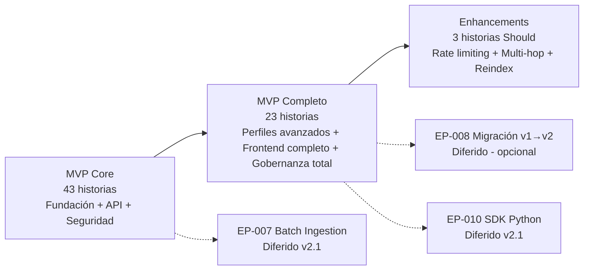
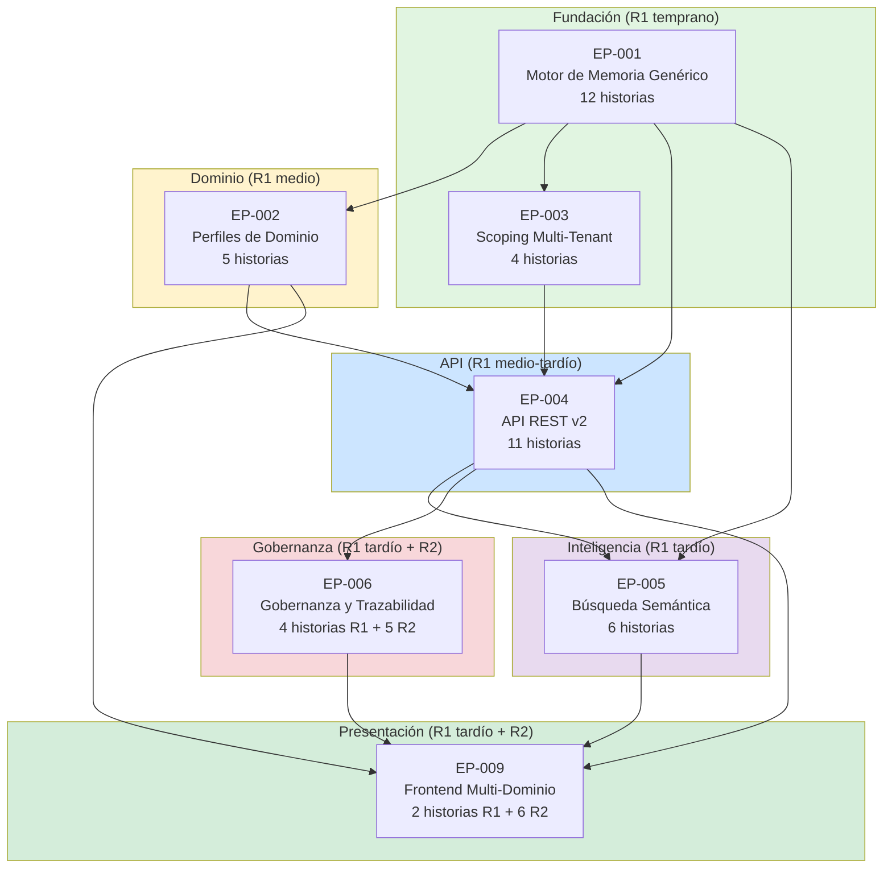

# Product Backlog Priorizado — Abax-Memory v2.0.0

## Índice

- [Resumen Ejecutivo](#resumen-ejecutivo)
- [Quick Wins Identificados](#quick-wins-identificados)
- [Dashboard Resumen](#dashboard-resumen)
- [Agrupación por Releases Sugeridos](#agrupación-por-releases-sugeridos)
  - [R1 — MVP Core](#r1--mvp-core)
  - [R2 — MVP Completo](#r2--mvp-completo)
  - [R3 — Enhancements](#r3--enhancements)
- [MVP Explícitamente Identificado](#mvp-explícitamente-identificado)
- [Justificación de Priorización](#justificación-de-priorización)
- [Mapa de Dependencias entre Épicas](#mapa-de-dependencias-entre-épicas)
- [Notas de Riesgo y Supuestos](#notas-de-riesgo-y-supuestos)
- [Glosario](#glosario)

---

## Resumen Ejecutivo

Este documento presenta el **Product Backlog Priorizado** para Abax-Memory v2.0.0 — Motor de Memoria Genérica Multi-Dominio con IA. Se derivan **69 historias de usuario** desde 7 épicas Must (EP-001 a EP-006, EP-009), organizadas en **3 releases progresivos** que permiten entregar valor incrementalmente.

### Métricas Clave del Backlog

| Métrica | Valor |
|---|---|
| Total de historias en backlog | **69** |
| Historias Must (incluidas en MVP) | **66** (95.7%) |
| Historias Should (optimizaciones diferibles) | **3** (4.3%) |
| Épicas representadas | 7 Must (EP-001 a EP-006, EP-009) |
| Features cubiertas con historias | 63/63 (100% de features Must) |
| Releases planificados | 3 (R1 Core, R2 Complete, R3 Enhancements) |
| Quick wins identificados | **16** historias de alto valor y bajo esfuerzo |

### Distribución por Release

| Release | Historias | % del Total | Tipo | Descripción |
|---|---|---|---|---|
| **R1 — MVP Core** | 43 | 62.3% | Must | Motor funcional, API completa, seguridad, gobernanza básica, UI mínima |
| **R2 — MVP Completo** | 23 | 33.3% | Must | Perfiles avanzados, búsqueda avanzada, gobernanza completa, frontend completo |
| **R3 — Enhancements** | 3 | 4.3% | Should | Rate limiting, multi-hop traversal, re-indexación masiva |
| **Fuera de scope v2.0.0** | 18 features | — | Should/Could | EP-007 Batch Ingestion, EP-008 Migración v1→v2, EP-010 SDK Python |

### Distribución de Esfuerzo

| Talla | Cantidad | % | Criterio |
|---|---|---|---|
| **S** | 21 | 30.4% | 1-3 días: validaciones, convenciones, configuraciones simples |
| **M** | 31 | 44.9% | 1-2 semanas: lógica de negocio moderada, integraciones puntuales |
| **L** | 17 | 24.6% | 3-4 semanas: features complejas, integración multi-componente |
| **XL** | 0 | 0% | — (ninguna historia individual supera 1 mes) |

---

## Quick Wins Identificados

Historias de **alto valor de negocio + bajo esfuerzo (S)** que pueden entregarse temprano para generar confianza y desbloquear capacidades posteriores:

| # | ID | Historia | Valor | Esfuerzo | Por qué es quick win |
|---|---|---|---|---|---|
| 1 | HU-001.01.1 | Clasificar memoria con kind universal | Crítico | S | Fundación del modelo. Sin esto, nada funciona. Implementación simple: enum validation. |
| 2 | HU-001.05.1 | Metadatos extensibles | Alto | S | Campo JSON libre. Habilita enriquecimiento por dominio sin cambiar schema. |
| 3 | HU-001.07.1 | Soft-delete | Alto | S | Marca un flag. Crítico para integridad de datos desde día 1. |
| 4 | HU-001.09.1 | Modelo de confidence | Alto | S | Float con validación de rango. Habilita filtrado por certeza. |
| 5 | HU-003.06.1 | Scope obligatorio en escritura | Crítico | S | Validación de campo obligatorio. Seguridad fundamental. |
| 6 | HU-002.06.1 | Defaults de sensibilidad por perfil | Alto | S | Lógica condicional simple. Gran valor de UX para operadores. |
| 7 | HU-002.07.1 | Vocabulario controlado por perfil | Medio | S | Sugerencias estáticas desde config. Mejora adopción. |
| 8 | HU-004.07.1 | Health check | Alto | S | Endpoint de verificación de dependencias. Operaciones esencial. |
| 9 | HU-004.08.1 | English-Only en API | Alto | S | Convención + linting. No negociable para interoperabilidad. |
| 10 | HU-004.11.1 | Estándares de error HTTP | Alto | S | Middleware de error handler. Developer experience desde día 1. |
| 11 | HU-004.09.1 | Documentación OpenAPI | Alto | M | Aunque es M, la doc viva acelera integraciones y testing. |
| 12 | HU-005.06.1 | Top-K configurable | Medio | S | Parámetro con límite máximo. Control de consumo de recursos. |
| 13 | HU-005.10.1 | Scoring transparente en resultados | Alto | S | Incluir campo `score` en respuesta. Transparencia del ranking. |
| 14 | HU-001.06.1 | Modelo de source tipado | Medio | S | Enum + id externo. Trazabilidad de origen. |
| 15 | HU-001.02.2 | Rechazar memoria en revisión | Alto | S | Variante de la máquina de estados. Cierra el ciclo de revisión. |
| 16 | HU-002.02.1 | Herencia del core genérico | Crítico | S | Restricción de diseño, no feature a construir. Asegura no regresión. |

> **Estrategia**: Estos quick wins deben priorizarse en las primeras 3-4 semanas del desarrollo para establecer la base del motor con validación temprana de la arquitectura de perfiles y scoping.

---

## Dashboard Resumen

A continuación se presenta el backlog completo de las 69 historias, ordenado por épica y con asignación de release, esfuerzo estimado y prioridad.

### Leyenda

| Columna | Significado |
|---|---|
| **ID** | Identificador único: `HU-{épica}.{feature}.{secuencial}` |
| **Épica** | EP-001 a EP-009 (solo Must en backlog) |
| **Prioridad** | MoSCoW: Must, Should |
| **Esfuerzo** | S (1-3d), M (1-2sem), L (3-4sem) |
| **Release** | R1 (MVP Core), R2 (MVP Completo), R3 (Enhancements) |
| **Dep. clave** | Historia(s) de la que depende directamente |

### EP-001: Motor de Memoria Genérico (12 historias)

| ID | Historia | Prioridad | Esfuerzo | Release | Dep. clave |
|---|---|---|---|---|---|
| HU-001.01.1 | Clasificar una memoria con kind universal | Must | S | R1 | — |
| HU-001.02.1 | Gestionar el ciclo de vida de una memoria | Must | M | R1 | HU-001.01.1 |
| HU-001.02.2 | Rechazar una memoria en revisión | Must | S | R1 | HU-001.02.1 |
| HU-001.03.1 | Crear relaciones tipadas entre memorias | Must | M | R1 | HU-001.01.1 |
| HU-001.03.2 | Eliminar relaciones entre memorias | Must | S | R1 | HU-001.03.1 |
| HU-001.04.1 | Extraer entidades de texto sin persistir | Must | M | R1 | HU-001.01.1 |
| HU-001.04.2 | Buscar entidades y ver sus memorias vinculadas | Must | M | R2 | HU-001.04.1, HU-004.05.1 |
| HU-001.05.1 | Enriquecer memorias con metadatos de dominio | Must | S | R1 | HU-001.01.1 |
| HU-001.06.1 | Registrar el origen de una memoria | Must | S | R1 | HU-001.01.1 |
| HU-001.07.1 | Eliminar lógicamente una memoria (soft-delete) | Must | S | R1 | HU-001.02.1 |
| HU-001.08.1 | Crear nueva versión que reemplaza anterior (supersedes) | Must | M | R1 | HU-001.03.1 |
| HU-001.09.1 | Asignar nivel de confianza a una memoria | Must | S | R1 | HU-001.01.1 |

### EP-002: Perfiles de Dominio (8 historias)

| ID | Historia | Prioridad | Esfuerzo | Release | Dep. clave |
|---|---|---|---|---|---|
| HU-002.01.1 | Definir un perfil de dominio como configuración | Must | M | R1 | HU-001.01.1 |
| HU-002.02.1 | Garantizar que todo perfil hereda la base genérica | Must | S | R1 | HU-002.01.1 |
| HU-002.03.1 | Utilizar el perfil Ops para operaciones IT | Must | M | R1 | HU-002.01.1 |
| HU-002.04.1 | Utilizar el perfil Agent para memoria conversacional | Must | M | R2 | HU-002.01.1 |
| HU-002.05.1 | Utilizar el perfil Business para conocimiento corporativo | Must | M | R2 | HU-002.01.1 |
| HU-002.06.1 | Aplicación automática de defaults según perfil | Must | S | R1 | HU-002.01.1 |
| HU-002.07.1 | Usar tags y topics sugeridos por el perfil | Must | S | R1 | HU-002.01.1 |
| HU-002.08.1 | Agregar un nuevo perfil sin modificar el core | Must | S | R2 | HU-002.01.1 |

### EP-003: Scoping Multi-Tenant (7 historias)

| ID | Historia | Prioridad | Esfuerzo | Release | Dep. clave |
|---|---|---|---|---|---|
| HU-003.01.1 | Garantizar que un tenant no accede a datos de otro | Must | L | R1 | HU-001.01.1 |
| HU-003.02.1 | Acotar memorias a un usuario específico | Must | S | R1 | HU-003.01.1 |
| HU-003.03.1 | Aislar contexto de sesión conversacional | Must | S | R2 | HU-003.02.1 |
| HU-003.04.1 | Organizar memorias por namespace | Must | S | R2 | HU-003.01.1 |
| HU-003.05.1 | Consultar y operar cross-tenant como admin | Must | M | R2 | HU-003.01.1, HU-006.07.1 |
| HU-003.06.1 | Validar que toda memoria nueva tiene scope con tenantId | Must | S | R1 | HU-003.01.1 |
| HU-003.07.1 | Filtrar automáticamente resultados por tenant del token | Must | M | R1 | HU-003.01.1, HU-004.10.1 |

### EP-004: API REST v2 (15 historias)

| ID | Historia | Prioridad | Esfuerzo | Release | Dep. clave |
|---|---|---|---|---|---|
| HU-004.01.1 | Crear una memoria vía API v2 | Must | M | R1 | HU-001.01.1, HU-003.06.1, HU-004.10.1 |
| HU-004.01.2 | Consultar detalle de una memoria | Must | S | R1 | HU-004.01.1 |
| HU-004.01.3 | Actualizar contenido y metadatos de una memoria | Must | M | R1 | HU-004.01.1 |
| HU-004.02.1 | API para crear y eliminar relaciones | Must | M | R1 | HU-001.03.1, HU-004.01.1 |
| HU-004.03.1 | Expandir el subgrafo alrededor de una memoria | Must | L | R2 | HU-004.02.1 |
| HU-004.04.1 | Ejecutar acciones de revisión vía API | Must | M | R1 | HU-001.02.1, HU-004.01.1 |
| HU-004.05.1 | API de búsqueda y consulta de entidades | Must | M | R2 | HU-001.04.1 |
| HU-004.06.1 | Consultar métricas agregadas de un tenant | Must | M | R2 | HU-004.01.1, HU-006.07.1 |
| HU-004.07.1 | Verificar disponibilidad del sistema (health) | Must | S | R1 | — (infraestructura) |
| HU-004.08.1 | Garantizar identificadores de API en inglés | Must | S | R1 | — (convención) |
| HU-004.09.1 | Acceder a especificación OpenAPI completa | Must | M | R1 | HU-004.01.1 |
| HU-004.10.1 | Autenticar requests con Bearer token JWT | Must | L | R1 | — (Keycloak) |
| HU-004.11.1 | Recibir errores estandarizados y machine-readable | Must | S | R1 | HU-004.01.1 |
| HU-004.12.1 | Validación estricta de payloads JSON | Must | M | R1 | HU-004.01.1 |
| HU-004.13.1 | Protección contra abuso mediante rate limiting | Should | M | R3 | HU-004.10.1 |

### EP-005: Búsqueda Semántica + Graph (10 historias)

| ID | Historia | Prioridad | Esfuerzo | Release | Dep. clave |
|---|---|---|---|---|---|
| HU-005.01.1 | Buscar memorias por texto libre semántico | Must | L | R1 | HU-005.07.1 |
| HU-005.02.1 | Refinar búsqueda con filtros multidimensionales | Must | L | R1 | HU-005.01.1 |
| HU-005.03.1 | Obtener vecinos de cada resultado (expandGraph) | Must | M | R2 | HU-005.01.1, HU-001.03.1 |
| HU-005.04.1 | Activar re-ranking para mejorar precisión top-K | Must | L | R2 | HU-005.01.1 |
| HU-005.05.1 | Navegar múltiples saltos de relaciones (multi-hop) | Should | L | R3 | HU-005.03.1 |
| HU-005.06.1 | Controlar cuántos resultados retorna la búsqueda (topK) | Must | S | R1 | HU-005.01.1 |
| HU-005.07.1 | Generar y almacenar embedding al crear o actualizar | Must | M | R1 | HU-004.01.1, OpenAI |
| HU-005.08.1 | Regenerar todos los embeddings (re-indexación masiva) | Should | M | R3 | HU-005.07.1 |
| HU-005.09.1 | Visibilidad gobernada por estado en búsqueda | Must | M | R1 | HU-005.01.1, HU-001.02.1 |
| HU-005.10.1 | Ver el score de relevancia en cada resultado | Must | S | R1 | HU-005.01.1 |

### EP-006: Gobernanza y Trazabilidad (9 historias)

| ID | Historia | Prioridad | Esfuerzo | Release | Dep. clave |
|---|---|---|---|---|---|
| HU-006.01.1 | Registrar toda operación de escritura en auditoría | Must | L | R1 | HU-004.01.1 |
| HU-006.01.2 | Consultar el historial de auditoría de una memoria | Must | M | R2 | HU-006.01.1 |
| HU-006.02.1 | Completar workflow de revisión: draft → pending → active | Must | M | R1 | HU-001.02.1, HU-004.04.1 |
| HU-006.03.1 | Control de visibilidad según estado y rol | Must | M | R1 | HU-001.02.1, HU-006.07.1 |
| HU-006.04.1 | Forzar revisión humana para memorias de alta criticidad | Must | M | R2 | HU-006.02.1 |
| HU-006.05.1 | Trazabilidad de qué memorias influyeron en qué decisiones | Must | L | R2 | HU-001.03.1, HU-006.01.1 |
| HU-006.06.1 | Archivar, fusionar y soft-delete como administrador | Must | L | R2 | HU-006.03.1, HU-003.05.1 |
| HU-006.07.1 | Asignar y verificar permisos según los 5 roles RBAC | Must | L | R1 | HU-004.10.1 |
| HU-006.08.1 | Auditar la creación y eliminación de relaciones | Must | M | R2 | HU-006.01.1, HU-001.03.1 |

### EP-009: Frontend Multi-Dominio (8 historias)

| ID | Historia | Prioridad | Esfuerzo | Release | Dep. clave |
|---|---|---|---|---|---|
| HU-009.01.1 | Formulario de creación adaptado al perfil activo | Must | L | R1 | HU-004.01.1, HU-002.03.1, HU-009.08.1 |
| HU-009.02.1 | Panel de búsqueda con todos los filtros del modelo | Must | L | R2 | HU-005.02.1, HU-009.08.1 |
| HU-009.03.1 | Vista dedicada para revisar memorias pendientes | Must | L | R2 | HU-004.04.1, HU-009.08.1 |
| HU-009.04.1 | Interfaz de administración para System Operator | Must | L | R2 | HU-006.06.1, HU-009.08.1 |
| HU-009.05.1 | Componente interactivo de visualización de grafo | Must | L | R2 | HU-004.03.1, HU-009.08.1 |
| HU-009.06.1 | Cambiar de perfil y ver la interfaz reconfigurarse | Must | M | R2 | HU-009.01.1 |
| HU-009.07.1 | Visualizar gráficos y métricas del tenant | Must | M | R2 | HU-004.06.1, HU-009.08.1 |
| HU-009.08.1 | Login/logout con Keycloak OIDC y UI adaptada a roles | Must | L | R1 | HU-004.10.1 |

---

## Agrupación por Releases Sugeridos

La estrategia de releases sigue un modelo de **entrega incremental** que permite validar el motor con usuarios reales en R1, completar la visión del producto en R2, y agregar capacidades de optimización en R3.



---

### R1 — MVP Core

**Objetivo**: Motor de memoria genérico funcional, expuesto mediante API REST v2 segura, con gobernanza básica y un frontend mínimo. Un Integration Builder puede crear memorias, buscar semánticamente, y un System Operator puede administrar tenants y revisar contenido.

**Criterio de salida**: Un `api-consumer` externo puede integrar el motor de memoria mediante la API v2 sin fricción. La búsqueda semántica devuelve resultados relevantes (Recall@10 ≥ 0.85). Los datos de distintos tenants están aislados (100% queries cross-tenant retornan 0 resultados).

**Historias incluidas**: 43 (62.3% del backlog)

#### EP-001: Motor de Memoria Genérico — 11 historias (núcleo completo, entidades diferido)

| ID | Historia | Esfuerzo |
|---|---|---|
| HU-001.01.1 | Clasificar una memoria con kind universal | S |
| HU-001.02.1 | Gestionar el ciclo de vida de una memoria | M |
| HU-001.02.2 | Rechazar una memoria en revisión | S |
| HU-001.03.1 | Crear relaciones tipadas entre memorias | M |
| HU-001.03.2 | Eliminar relaciones entre memorias | S |
| HU-001.04.1 | Extraer entidades de texto sin persistir | M |
| HU-001.05.1 | Enriquecer memorias con metadatos de dominio | S |
| HU-001.06.1 | Registrar el origen de una memoria | S |
| HU-001.07.1 | Eliminar lógicamente una memoria (soft-delete) | S |
| HU-001.08.1 | Crear nueva versión que reemplaza anterior (supersedes) | M |
| HU-001.09.1 | Asignar nivel de confianza a una memoria | S |

> **R1 incluye el núcleo del modelo de datos**: kinds, estados, relaciones, extracción de entidades, metadatos, source, soft-delete, versionado y confidence. La búsqueda de entidades vinculadas (HU-001.04.2) se difiere a R2 porque depende de la API de entidades (HU-004.05.1).

#### EP-002: Perfiles de Dominio — 5 historias (mecanismo + perfil Ops)

| ID | Historia | Esfuerzo |
|---|---|---|
| HU-002.01.1 | Definir un perfil de dominio como configuración | M |
| HU-002.02.1 | Garantizar que todo perfil hereda la base genérica | S |
| HU-002.03.1 | Utilizar el perfil Ops para operaciones IT | M |
| HU-002.06.1 | Aplicación automática de defaults según perfil | S |
| HU-002.07.1 | Usar tags y topics sugeridos por el perfil | S |

> **Estrategia**: Se implementa el mecanismo de perfiles con el perfil Ops como referencia funcional completa. Esto valida la arquitectura de extensibilidad sin requerir los 3 perfiles en R1. Los perfiles Agent y Business se agregan en R2 sobre la misma infraestructura ya probada.

#### EP-003: Scoping Multi-Tenant — 4 historias (aislamiento fundamental)

| ID | Historia | Esfuerzo |
|---|---|---|
| HU-003.01.1 | Garantizar que un tenant no accede a datos de otro | L |
| HU-003.02.1 | Acotar memorias a un usuario específico | S |
| HU-003.06.1 | Validar que toda memoria nueva tiene scope con tenantId | S |
| HU-003.07.1 | Filtrar automáticamente resultados por tenant del token | M |

> **El aislamiento multi-tenant es no-negociable desde R1**. Sin él, el producto no puede operar en modo multi-tenant. SessionId, namespace y cross-tenant access se agregan en R2.

#### EP-004: API REST v2 — 11 historias (CRUD + seguridad + estándares)

| ID | Historia | Esfuerzo |
|---|---|---|
| HU-004.01.1 | Crear una memoria vía API v2 | M |
| HU-004.01.2 | Consultar detalle de una memoria | S |
| HU-004.01.3 | Actualizar contenido y metadatos de una memoria | M |
| HU-004.02.1 | API para crear y eliminar relaciones | M |
| HU-004.04.1 | Ejecutar acciones de revisión vía API | M |
| HU-004.07.1 | Verificar disponibilidad del sistema (health) | S |
| HU-004.08.1 | Garantizar identificadores de API en inglés | S |
| HU-004.09.1 | Acceder a especificación OpenAPI completa | M |
| HU-004.10.1 | Autenticar requests con Bearer token JWT | L |
| HU-004.11.1 | Recibir errores estandarizados y machine-readable | S |
| HU-004.12.1 | Validación estricta de payloads JSON | M |

> **Estrategia**: CRUD completo de memorias y relaciones, autenticación JWT, validación estricta, errores estandarizados, English-Only y OpenAPI viva. Se difieren a R2: graph expansion, entity API, estadísticas y rate limiting (R3).

#### EP-005: Búsqueda Semántica + Graph — 6 historias (búsqueda fundamental)

| ID | Historia | Esfuerzo |
|---|---|---|
| HU-005.01.1 | Buscar memorias por texto libre semántico | L |
| HU-005.02.1 | Refinar búsqueda con filtros multidimensionales | L |
| HU-005.06.1 | Controlar cuántos resultados retorna la búsqueda (topK) | S |
| HU-005.07.1 | Generar y almacenar embedding al crear o actualizar | M |
| HU-005.09.1 | Visibilidad gobernada por estado en búsqueda | M |
| HU-005.10.1 | Ver el score de relevancia en cada resultado | S |

> **R1 incluye el pipeline completo de búsqueda**: embedding → indexación → búsqueda semántica → filtros → scoring → visibilidad gobernada. Graph expansion, re-ranking y multi-hop se agregan en R2/R3 sobre esta base.

#### EP-006: Gobernanza y Trazabilidad — 4 historias (gobierno fundamental)

| ID | Historia | Esfuerzo |
|---|---|---|
| HU-006.01.1 | Registrar toda operación de escritura en auditoría | L |
| HU-006.02.1 | Completar workflow de revisión: draft → pending → active | M |
| HU-006.03.1 | Control de visibilidad según estado y rol | M |
| HU-006.07.1 | Asignar y verificar permisos según los 5 roles RBAC | L |

> **R1 establece la base de gobernanza**: auditoría de mutaciones, flujo de revisión, visibilidad por estado y RBAC con 5 roles. La consulta de historial, revisión obligatoria, linaje de decisiones, depuración y auditoría de relaciones se completan en R2.

#### EP-009: Frontend Multi-Dominio — 2 historias (UI mínima funcional)

| ID | Historia | Esfuerzo |
|---|---|---|
| HU-009.01.1 | Formulario de creación adaptado al perfil activo | L |
| HU-009.08.1 | Login/logout con Keycloak OIDC y UI adaptada a roles | L |

> **R1 entrega un frontend operativo mínimo**: autenticación OIDC integrada y formulario de creación de memorias sensible al perfil. Un operador puede autenticarse y crear memorias. La búsqueda visual, panel de revisión, administración y dashboard se completan en R2.

#### Resumen de esfuerzo R1

| Talla | Cantidad | Esfuerzo estimado |
|---|---|---|
| S | 18 | 18-54 días |
| M | 17 | 85-170 días |
| L | 8 | 120-160 días |
| **Total R1** | **43** | **223-384 días-persona** |

> **Nota**: El rango amplio refleja incertidumbre sobre el stack final (Quarkus vs. alternativa). La estimación debe refinarse en Fase 3 (Diseño Técnico) cuando se fije el stack mediante ADR.

---

### R2 — MVP Completo

**Objetivo**: Completar todas las capacidades Must que no son bloqueantes para la operación básica del motor. El producto alcanza la visión completa definida en la Visión del Producto.

**Criterio de salida**: Suite de ~100 test cases multi-dominio con precisión top-1 ≥ 0.92. NDCG@10 ≥ 0.80 en BEIR SciFact. 100% de mutaciones auditadas. Frontend completo para todos los roles.

**Historias incluidas**: 23 (33.3% del backlog)

#### EP-001: Completado en R1

| ID | Historia | Esfuerzo | Nota |
|---|---|---|---|
| HU-001.04.2 | Buscar entidades y ver sus memorias vinculadas | M | Depende de API de entidades (R2) |

#### EP-002: Perfiles de Dominio — 3 historias (completar suite de perfiles)

| ID | Historia | Esfuerzo |
|---|---|---|
| HU-002.04.1 | Utilizar el perfil Agent para memoria conversacional | M |
| HU-002.05.1 | Utilizar el perfil Business para conocimiento corporativo | M |
| HU-002.08.1 | Agregar un nuevo perfil sin modificar el core | S |

#### EP-003: Scoping Multi-Tenant — 3 historias (completar modelo de scope)

| ID | Historia | Esfuerzo |
|---|---|---|
| HU-003.03.1 | Aislar contexto de sesión conversacional | S |
| HU-003.04.1 | Organizar memorias por namespace | S |
| HU-003.05.1 | Consultar y operar cross-tenant como admin | M |

#### EP-004: API REST v2 — 3 historias (API avanzada)

| ID | Historia | Esfuerzo |
|---|---|---|
| HU-004.03.1 | Expandir el subgrafo alrededor de una memoria | L |
| HU-004.05.1 | API de búsqueda y consulta de entidades | M |
| HU-004.06.1 | Consultar métricas agregadas de un tenant | M |
| — | *(Rate limiting diferido a R3)* | — |

#### EP-005: Búsqueda Semántica + Graph — 2 historias (búsqueda avanzada)

| ID | Historia | Esfuerzo |
|---|---|---|
| HU-005.03.1 | Obtener vecinos de cada resultado (expandGraph) | M |
| HU-005.04.1 | Activar re-ranking para mejorar precisión top-K | L |

#### EP-006: Gobernanza y Trazabilidad — 5 historias (gobernanza completa)

| ID | Historia | Esfuerzo |
|---|---|---|
| HU-006.01.2 | Consultar el historial de auditoría de una memoria | M |
| HU-006.04.1 | Forzar revisión humana para memorias de alta criticidad | M |
| HU-006.05.1 | Trazabilidad de qué memorias influyeron en qué decisiones | L |
| HU-006.06.1 | Archivar, fusionar y soft-delete como administrador | L |
| HU-006.08.1 | Auditar la creación y eliminación de relaciones | M |

#### EP-009: Frontend Multi-Dominio — 6 historias (frontend completo)

| ID | Historia | Esfuerzo |
|---|---|---|
| HU-009.02.1 | Panel de búsqueda con todos los filtros del modelo | L |
| HU-009.03.1 | Vista dedicada para revisar memorias pendientes | L |
| HU-009.04.1 | Interfaz de administración para System Operator | L |
| HU-009.05.1 | Componente interactivo de visualización de grafo | L |
| HU-009.06.1 | Cambiar de perfil y ver la interfaz reconfigurarse | M |
| HU-009.07.1 | Visualizar gráficos y métricas del tenant | M |

#### Resumen de esfuerzo R2

| Talla | Cantidad | Esfuerzo estimado |
|---|---|---|
| S | 3 | 3-9 días |
| M | 12 | 60-120 días |
| L | 8 | 120-160 días |
| **Total R2** | **23** | **183-289 días-persona** |

---

### R3 — Enhancements

**Objetivo**: Agregar capacidades de optimización, administración avanzada y calidad de servicio que mejoran el producto sin ser bloqueantes para su operación.

**Criterio de salida**: Rate limiting operativo por tenant. Multi-hop traversal funcional para consultas complejas de grafo. Re-indexación masiva disponible para System Operators.

**Historias incluidas**: 3 (4.3% del backlog) — historias clasificadas como Should dentro de épicas Must.

| ID | Historia | Épica | Esfuerzo | Justificación de postergación |
|---|---|---|---|---|
| HU-004.13.1 | Protección contra abuso mediante rate limiting | EP-004 | M | El MVP opera con carga controlada. Rate limiting es crítica en producción multi-tenant real pero no bloquea validación funcional. |
| HU-005.05.1 | Navegar múltiples saltos de relaciones (multi-hop) | EP-005 | L | El 90% de los casos de uso de búsqueda se cubren con búsqueda semántica + graph expansion depth=1. Multi-hop es potencia adicional para consultas complejas. |
| HU-005.08.1 | Regenerar todos los embeddings (re-indexación masiva) | EP-005 | M | Solo se requiere si cambia el motor de embeddings o se migran datos. No es necesario para la operación diaria del MVP. |

> **Nota**: Las épicas Should (EP-007 Batch Ingestion) y Could (EP-008 Migración v1→v2, EP-010 SDK Python) quedan **fuera del scope de v2.0.0** y se planificarán para releases posteriores (v2.1.0+). Ver sección _Fuera del MVP_ en [epicas-features.md](./epicas-features.md) para detalle de las 18 features diferidas.

---

## MVP Explícitamente Identificado

### Definición de MVP

El **Producto Mínimo Viable (MVP)** de Abax-Memory v2.0.0 se compone de:

> **R1 (MVP Core) + R2 (MVP Completo) = 66 historias Must**

**¿Por qué el MVP incluye tanto R1 como R2?**

La Visión del Producto establece 13 criterios de éxito (CE-01 a CE-013). El MVP debe cumplir todos los criterios aplicables a la operación del motor:

| Criterio de Éxito | Cubierto en | Release requerido |
|---|---|---|
| CE-01 NDCG@10 ≥ 0.80 | Búsqueda semántica + re-ranking | R1 + R2 (re-ranking) |
| CE-02 Recall@10 ≥ 0.90 | Búsqueda semántica | R1 |
| CE-03 LoCoMo ≥ 0.80 | Perfil Agent + búsqueda | R2 |
| CE-04 Latencia p95 < 500ms | API + búsqueda | R1 |
| CE-05 Precisión top-1 ≥ 0.92 | Suite multi-dominio | R2 (perfiles completos) |
| CE-06 8/8 kinds | Motor de memoria | R1 |
| CE-07 Aislamiento cross-tenant | Scoping | R1 |
| CE-08 Visibilidad por estado | Gobernanza | R1 |
| CE-09 100% mutaciones auditadas | Gobernanza | R1 |
| CE-10 English-Only | API | R1 |
| CE-11 9/9 relaciones | Motor de memoria | R1 |
| CE-12 Batch 100 memorias | Batch ingestion | Fuera de MVP (Should) |
| CE-13 Migración v1→v2 | Migración | Fuera de MVP (Could) |

> **Conclusión**: R1 solo cubre 8/13 criterios de éxito (CE-02, CE-04, CE-06, CE-07, CE-08, CE-09, CE-10, CE-11). R2 agrega CE-01 y CE-05 (re-ranking y suite multi-dominio). CE-03 requiere el perfil Agent (R2). Los criterios CE-12 y CE-13 son Should/Could, por tanto no son requisito del MVP.

### Qué NO es el MVP

| Ítem | Estado | Justificación |
|---|---|---|
| R1 por sí solo | ❌ No es MVP | R1 es un **MLP (Minimum Lovable Product)** para early adopters técnicos, no el producto completo. Carece de frontend completo, re-ranking, perfiles Agent/Business y gobernanza avanzada. |
| R1 + R2 | ✅ **ES el MVP** | Cumple 11/11 criterios de éxito Must. Incluye todas las capacidades definidas en la Visión del Producto. |
| R1 + R2 + R3 | ❌ Sobrepasa el MVP | R3 agrega capacidades Should que, aunque valiosas, no son necesarias para validar la propuesta de valor del producto. |

### Estrategia de validación del MVP

| Hito | Release | Qué se valida | Con quién |
|---|---|---|---|
| **Alpha** | R1 completado | Motor + API + seguridad + búsqueda básica funcionando end-to-end. | Integration Builders internos. Tests automatizados (CE-04, CE-06, CE-07, CE-08, CE-09, CE-10, CE-11). |
| **Beta cerrada** | R2 completado | Producto completo con frontend. Suite multi-dominio. | Domain Curators en 2-3 dominios (Ops, Agent, Business). Benchmark BEIR SciFact (CE-01, CE-02, CE-05). |
| **GA (v2.0.0)** | R2 + estabilización | Producto listo para producción. | Disponibilidad general. |

---

## Justificación de Priorización

### 1. Criterio MoSCoW aplicado consistentemente

La priorización respeta la clasificación definida en el Mapa de Épicas y Features:

| Nivel | Épicas | Historias | Regla de asignación a releases |
|---|---|---|---|
| **Must** | EP-001 a EP-006, EP-009 | 66 | R1 o R2 según dependencia y criticidad |
| **Should** | Dentro de épicas Must | 3 (HU-004.13, HU-005.05, HU-005.08) | R3 |
| **Should** | EP-007, EP-010 | 0 historias en backlog | Diferido a v2.1+ |
| **Could** | EP-008 | 0 historias en backlog | Diferido a v2.1+ |

**Principio**: Una historia dentro de una épica Must puede ser Should si representa una optimización o capacidad administrativa avanzada que no bloquea la operación core. Esto explica por qué 3 historias de épicas Must se asignan a R3.

### 2. Dependencias técnicas como criterio de ordenamiento

La secuencia de releases respeta la cadena de dependencias del sistema:

```
Capa de datos (EP-001 + EP-003)
    ↓
Capa de dominio (EP-002)
    ↓
Capa de API (EP-004)
    ↓
Capa de inteligencia (EP-005)
    ↓
Capa de gobernanza (EP-006)
    ↓
Capa de presentación (EP-009)
```

**Aplicación práctica en el backlog**:
- Historias de EP-001 sin dependencias → primeras en R1 (kinds, metadata, confidence)
- Historias de EP-004 (API) dependen de EP-001 (modelo) + EP-003 (scoping) → R1, después de fundación
- Historias de EP-005 (búsqueda) dependen de EP-004 (API) + EP-001 (modelo) → R1, después de API CRUD
- Historias de EP-009 (frontend) dependen de EP-004 (API) — pero se prioriza login + creación básica en R1 para tener UI funcional temprano
- Historias avanzadas (graph expansion, re-ranking, linaje de decisiones) → R2 porque dependen de capacidades R1 estables

### 3. Valor de negocio vs. Esfuerzo

La matriz valor vs. esfuerzo justifica la asignación de releases:

| Cuadrante | Descripción | Release | Ejemplos |
|---|---|---|---|
| **Alto valor + Bajo esfuerzo** | Quick wins. Se entregan primero para generar momentum. | R1 (temprano) | Kinds (S), metadata (S), soft-delete (S), health (S), English-Only (S) |
| **Alto valor + Alto esfuerzo** | Inversiones estratégicas. Se planifican con cuidado. | R1 (planificado) | Tenant isolation (L), auth JWT (L), búsqueda semántica (L), RBAC (L), auditoría (L) |
| **Medio valor + Bajo esfuerzo** | Relleno de calidad. Se intercalan entre inversiones grandes. | R1/R2 | Source tipado (S), namespace (S), sessionId (S), profile switching (M) |
| **Medio valor + Alto esfuerzo** | Candidatos a postergar. Se evalúa costo de oportunidad. | R2/R3 | Re-ranking (L), multi-hop (L), graph viz (L), admin panel (L) |

### 4. Gestión de riesgo

| Riesgo | Mitigación en el backlog |
|---|---|
| **Stack no definido** — La decisión de stack (Quarkus vs. alternativa) impacta estimaciones. | R1 incluye ADR de stack como precondición. Las estimaciones usan rangos amplios hasta que se fije. |
| **OpenAI como dependencia externa** — Latencia y costos de embeddings. | HU-005.07.1 incluye generación asíncrona de embeddings. Health check (HU-004.07.1) monitorea disponibilidad de OpenAI. |
| **Keycloak como dependencia de seguridad** — Sin auth, la API no es segura. | HU-004.10.1 (auth JWT) en R1 temprano. Sin esto, no se exponen endpoints. |
| **Complejidad del modelo de datos** — 8 kinds × 6 estados × 9 relaciones = 432 combinaciones posibles. | EP-001 se implementa completo en R1 para forzar la validación temprana del modelo. Los tests de integración (CE-11) cubren los 9 tipos de relación. |
| **Adopción del frontend** — Si el frontend llega tarde, no hay validación con usuarios no técnicos. | HU-009.01.1 (formulario de creación) y HU-009.08.1 (auth) se incluyen en R1 para tener un frontend operativo mínimo desde el inicio. |

---

## Mapa de Dependencias entre Épicas



**Lectura del grafo**: Las dependencias son transitivas. Por ejemplo, EP-009 (Frontend) depende de EP-004 (API), que a su vez depende de EP-001 (Core) y EP-003 (Scoping). Esto significa que el frontend no puede iniciarse hasta que la API esté estable, y la API no puede iniciarse hasta que el modelo de datos y el scoping estén implementados.

---

## Notas de Riesgo y Supuestos

| # | Riesgo / Supuesto | Impacto en el backlog | Acción |
|---|---|---|---|
| **S-01** | El stack de infraestructura (PostgreSQL, Qdrant, Keycloak, OpenAI) es reutilizable de v1 sin cambios estructurales. | Si no se cumple, las estimaciones L (búsqueda, auth, auditoría) pueden duplicarse. | Validar en Fase 3 (Diseño Técnico) antes de iniciar R1. |
| **S-02** | Los perfiles de dominio se definen como configuraciones sin código custom. | Si se requiere lógica por perfil, HU-002.04.1 y HU-002.05.1 suben de M a L. | Prototipar el mecanismo de perfiles con Ops (HU-002.03.1) en R1 para validar el supuesto. |
| **S-03** | El motor de embeddings (OpenAI text-embedding-3-large) es adecuado para los benchmarks. | Si se requiere cambiar motor, HU-005.07.1 y HU-005.08.1 se ven impactadas. | HU-005.08.1 (re-indexación) en R3 como seguro ante cambio de motor. |
| **S-04** | Un mismo usuario puede pertenecer a múltiples tenants (modelo plano, sin jerarquías). | Si se requieren jerarquías parent/child, el modelo de scoping (EP-003) necesita rediseño. | El backlog actual asume modelo plano. Cualquier cambio requiere re-planificación de EP-003 completo. |
| **R-05** | API v1 no existe en v2. Sin backward compatibility. | Sin impacto: simplifica el backlog al eliminar cualquier consideración de compatibilidad. | — |

---

## Glosario

- **MoSCoW**: Método de priorización: Must (debe estar), Should (debería estar), Could (podría estar), Won't (no se incluirá).
- **Quick Win**: Historia de alto valor de negocio y bajo esfuerzo que puede entregarse temprano para generar confianza y desbloquear capacidades posteriores.
- **Qdrant**: Base de datos vectorial open-source para almacenar embeddings y ejecutar búsqueda semántica por similitud de coseno.
- **OIDC**: OpenID Connect — protocolo de autenticación basado en OAuth 2.0 para verificar identidad de usuarios.
- **Embedding**: Representación vectorial densa de un texto generada por un modelo de IA que permite comparar similitud semántica.
- **NDCG@10**: Normalized Discounted Cumulative Gain — métrica de ranking que mide la calidad de resultados en las primeras 10 posiciones.
- **ADR**: Architecture Decision Record — documento que registra una decisión arquitectónica, su contexto, alternativas y consecuencias.
