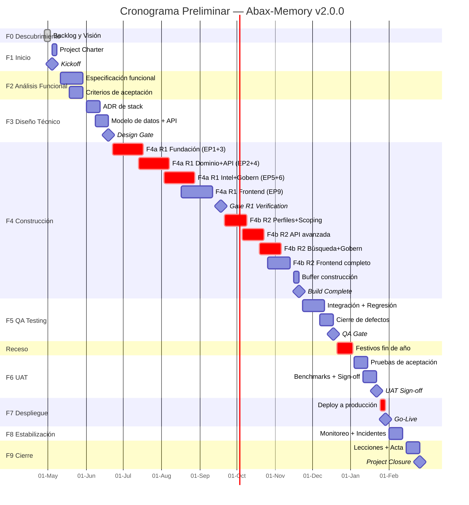

# Cronograma Preliminar — Abax-Memory v2.0.0
- **Fase**: 1 — Inicio
- **Responsable**: project-manager
- **Fecha**: 2026-05-03
- **Estado**: Completado
- **Fuentes**:
  - `docs/entregables/v2/fase-0-descubrimiento/backlog-priorizado.md`
  - `docs/entregables/v2/fase-0-descubrimiento/vision-producto.md`

---

## 1. Resumen Ejecutivo

Cronograma preliminar para el MVP de Abax-Memory v2.0.0 (66 historias Must: R1=43 + R2=23), elaborado a partir de los esfuerzos estimados en el Product Backlog Priorizado. El proyecto se ejecuta en 9 fases cascada con un equipo de 9 agentes especializados. F0 (Descubrimiento) fue completada el 2026-05-03. La estrategia de construcción es **secuencial estricta**: R2 solo inicia una vez que R1 está completo y verificado.

| Indicador | Valor |
|---|---|
| **Duración total** (F1→F9) | **41 semanas** (2026-05-04 → 2027-02-26) |
| **Go-Live** | **2027-01-29** (semana 39) |
| **Historias MVP** | 66 (R1: 43 + R2: 23) |
| **Esfuerzo estimado** | 406–673 días-persona (MVP) |
| **Equipo** | 9 agentes |
| **Estrategia R1→R2** | Secuencial estricta (R1 completo y estable antes de R2) |
| **Buffer total** | 4 semanas (2 construcción + 2 festivos) |

---

## 2. Cronograma por Fase

| Fase | Nombre | Fecha Inicio | Fecha Fin | Semanas | Días hábiles | Entregable principal |
|---|---|---|---|---|---|---|
| **F0** | Descubrimiento | — | 2026-05-03 | — | — | Backlog priorizado, Visión del Producto |
| **F1** | Inicio | 2026-05-04 | 2026-05-08 | 1 | 5 | Project Charter, Cronograma Preliminar |
| **F2** | Análisis Funcional | 2026-05-11 | 2026-05-29 | 3 | 15 | Especificación funcional detallada, Criterios de aceptación |
| **F3** | Diseño Técnico | 2026-06-01 | 2026-06-19 | 3 | 15 | ADR de stack, Modelo de datos, Contrato API v2 |
| **F4** | Construcción | 2026-06-22 | 2026-11-20 | 22 | 110 | Código fuente R1+R2, Tests unitarios |
| **F5** | QA Testing | 2026-11-23 | 2026-12-18 | 4 | 20 | Reporte de calidad, Suite de ~100 test cases |
| **F6** | UAT | 2027-01-04 | 2027-01-22 | 3 | 15 | Acta de aceptación, Resultados benchmark |
| **F7** | Despliegue | 2027-01-25 | 2027-01-29 | 1 | 5 | Plan de despliegue ejecutado, Sistema en producción |
| **F8** | Estabilización | 2027-02-01 | 2027-02-12 | 2 | 10 | Sistema estable, Incidentes cerrados |
| **F9** | Cierre | 2027-02-15 | 2027-02-26 | 2 | 10 | Lecciones aprendidas, Acta de cierre |

> **Nota**: F6 (UAT) inicia el 2027-01-04 por el receso de fin de año (2026-12-21 a 2027-01-03). Este buffer de 2 semanas por festivos está contemplado en el cronograma.

---

## 3. Desglose de la Fase de Construcción (F4)

La construcción se divide en dos oleadas secuenciales con una puerta de verificación intermedia (Gate R1).

| Oleada | Fecha Inicio | Fecha Fin | Semanas | Historias | Esfuerzo estimado |
|---|---|---|---|---|---|
| **F4a — R1 Core** | 2026-06-22 | 2026-09-11 | 12 | 43 | 223–384 d/p |
| **Gate R1** | 2026-09-14 | 2026-09-18 | 1 | — | Verificación: API funcional, aislamiento tenant, búsqueda semántica |
| **F4b — R2 Complete** | 2026-09-21 | 2026-11-13 | 8 | 23 | 183–289 d/p |
| **Buffer construcción** | 2026-11-16 | 2026-11-20 | 1 | — | Margen para imprevistos y estabilización pre-QA |

### Secuencia de capas dentro de cada oleada

```
Fundación (EP-001 + EP-003) → 4 semanas
    ↓
Dominio (EP-002) + API (EP-004) → 4 semanas
    ↓
Inteligencia (EP-005) + Gobernanza (EP-006) → 3 semanas
    ↓
Frontend (EP-009) + Integración → 3 semanas (+ verificación)
```

Las capas se solapan parcialmente dentro de cada oleada, pero el inicio de cada capa requiere que la capa inferior esté operativa. En R1 se construye el núcleo de todas las capas; en R2 se completan las capacidades avanzadas sobre la base ya estable.

---

## 4. Diagrama Gantt (Mermaid)



---

## 5. Hitos Clave

| ID | Hito | Fecha | Fase | Criterio de salida |
|---|---|---|---|---|
| **M1** | Kickoff | 2026-05-04 | F1 | Equipo ensamblado, Project Charter aprobado |
| **M2** | Design Gate | 2026-06-19 | F3 | ADR de stack aprobado, contrato API v2 congelado, modelo de datos validado |
| **M3** | Gate R1 | 2026-09-18 | F4 | API v2 funcional, aislamiento multi-tenant verificado (0% cross-tenant leakage), búsqueda semántica operativa (Recall@10 ≥ 0.85), RBAC 5 roles |
| **M4** | Build Complete | 2026-11-20 | F4 | 66 historias Must implementadas, tests unitarios ≥ 80% cobertura, linters limpios |
| **M5** | QA Gate | 2026-12-18 | F5 | Suite de ~100 test cases ejecutada, 0 defectos críticos abiertos, métricas CE-04 a CE-11 verificadas |
| **M6** | UAT Sign-off | 2027-01-22 | F6 | CE-01 (NDCG@10 ≥ 0.80), CE-02 (Recall@10 ≥ 0.90), CE-03 (LoCoMo ≥ 0.80), CE-05 (Precision top-1 ≥ 0.92) validados. Acta de aceptación firmada |
| **M7** | Go-Live | 2027-01-29 | F7 | Sistema en producción, health checks OK, rollback validado |
| **M8** | Project Closure | 2027-02-26 | F9 | Lecciones aprendidas documentadas, acta de cierre firmada |

---

## 6. Estimación Basada en Esfuerzos del Backlog

### 6.1 Desglose por Release

| Release | Historias | S | M | L | Esfuerzo (d/p) | Semanas estimadas |
|---|---|---|---|---|---|---|
| **R1 Core** | 43 | 18 | 17 | 8 | 223–384 | 12 |
| **R2 Complete** | 23 | 3 | 12 | 8 | 183–289 | 8 |
| **Total MVP** | **66** | **21** | **29** | **16** | **406–673** | **20 (+3 buffer)** |

### 6.2 Método de Estimación

Se utilizó **estimación por tres puntos** sobre los rangos del backlog:

| Parámetro | R1 | R2 | Total MVP |
|---|---|---|---|
| Optimista (O) | 223 d/p | 183 d/p | 406 d/p |
| Más probable (M) | 304 d/p | 236 d/p | 540 d/p |
| Pesimista (P) | 384 d/p | 289 d/p | 673 d/p |
| **PERT** `(O+4M+P)/6` | **303 d/p** | **236 d/p** | **539 d/p** |

### 6.3 Conversión a Semanas Calendario

| Variable | Valor | Justificación |
|---|---|---|
| Equipo | 9 agentes | Backend (4), Frontend (2), DevOps (1), QA (1), PM (1) |
| Paralelismo efectivo | 6.0 agentes | Limitado por dependencias entre capas (Fundación → API → Búsqueda → Frontend) |
| Productividad | 80% | Reuniones, revisiones, documentación, coordinación |
| Días productivos/semana | 5 × 6.0 × 0.80 = **24 d/sem** | Días-persona efectivos por semana |
| Semanas R1 | 303 / 24 ≈ **12.6 → 12** | Redondeo con buffer interno |
| Semanas R2 | 236 / 24 ≈ **9.8 → 8** | Mayor reutilización de patrones R1 |
| Buffer construcción | **3 semanas** | Gate R1 (1 sem) + buffer final (1 sem) + margen calendario (1 sem) |

---

## 7. Ruta Crítica

La ruta crítica del proyecto está formada por las fases sin holgura, donde cualquier retraso impacta directamente la fecha de Go-Live:

```
F2 → F3 → F4a (R1 Fundación) → F4a (R1 API) → F4a (R1 Búsqueda)
    → Gate R1 → F4b (R2 Perfiles) → F4b (R2 API) → F4b (R2 Búsqueda)
    → F5 → Receso → F6 → F7 (Go-Live)
```

### Actividades con holgura (no en ruta crítica)

| Actividad | Holgura | Motivo |
|---|---|---|
| F4a R1 Frontend (EP-009) | ~2 semanas | Puede iniciar tarde sin retrasar el Gate R1 |
| F4b R2 Frontend completo | ~2 semanas | La validación UAT no depende exclusivamente del frontend |
| F8 Estabilización | ~1 semana | Puede acortarse si no hay incidentes mayores |
| F9 Cierre | ~1 semana | No afecta Go-Live |

### Puntos de estrangulamiento

| Estrangulamiento | Impacto en ruta crítica | Mitigación |
|---|---|---|
| **ADR de stack (F3)** | Bloquea inicio de F4 | Priorizar en primera semana de F3. Si no hay consenso, escalar a sponsor para decisión |
| **Integración Keycloak/OIDC** | Bloquea API auth y RBAC | HU-004.10.1 es L; iniciar en semana 1 de F4. Si Keycloak no está listo, usar proveedor OIDC alternativo |
| **Embeddings OpenAI** | Bloquea búsqueda semántica | HU-005.07.1 debe ejecutarse apenas la API CRUD esté operativa. Tener cuenta OpenAI con límites configurados desde F3 |
| **Qdrant disponibilidad** | Bloquea indexación y búsqueda | Validar versión y conectividad en F3. Si se requiere migración, ejecutar antes del inicio de F4 |

---

## 8. Asignación de Recursos por Fase

| Fase | Backend (4) | Frontend (2) | DevOps (1) | QA (1) | PM (1) |
|---|---|---|---|---|---|
| **F1** | — | — | — | — | 100% |
| **F2** | 30% (revisión) | 20% (revisión) | 20% (infra) | 30% (plan) | 100% |
| **F3** | 80% (diseño) | 60% (diseño) | 80% (infra) | 60% (plan) | 100% |
| **F4a** | 100% | 80% | 100% | 50% (tests) | 50% |
| **F4b** | 100% | 100% | 60% | 50% (tests) | 50% |
| **F5** | 60% (fixes) | 40% (fixes) | 40% (env) | 100% | 80% |
| **F6** | 30% (soporte) | 30% (soporte) | 50% (env) | 80% | 100% |
| **F7** | 50% | 30% | 100% | 50% | 100% |
| **F8** | 50% (on-call) | 30% | 80% | 50% | 60% |
| **F9** | 10% | 10% | 10% | 10% | 100% |

---

## 9. Matriz de Riesgos del Cronograma

| ID | Riesgo | Categoría | Probabilidad | Impacto | Nivel | Mitigación | Responsable | Estado |
|---|---|---|---|---|---|---|---|---|
| **R-01** | Decisión de stack demorada más allá de F3 | Técnico | Media | Alto | **Crítico** | Iniciar ADR en semana 1 de F3. Escalar a sponsor si no hay consenso en 5 días. Pre-aprobar stack v1 como fallback | Tech Lead | Abierto |
| **R-02** | Keycloak no disponible o mal configurado al inicio de F4 | Técnico | Media | Crítico | **Crítico** | Validar Keycloak en F3. Tener proveedor OIDC alternativo pre-aprobado. HU-004.10.1 (auth) es prerrequisito de toda la API | DevOps | Abierto |
| **R-03** | OpenAI API con latencia o costos que exceden lo planificado | Externo | Media | Alto | **Alto** | Health check de OpenAI en F3. HU-005.07.1 con generación asíncrona. Evaluar modelo alternativo (text-embedding-3-small) si costos exceden | Tech Lead | Abierto |
| **R-04** | Velocidad del equipo menor a la estimada (24 d/sem efectivos) | Organizacional | Alta | Alto | **Alto** | Medir velocidad real en semanas 1-3 de F4. Ajustar cronograma en Gate R1 si la velocidad es < 18 d/sem. Priorizar con MoSCoW | Project Manager | Abierto |
| **R-05** | Aislamiento multi-tenant con bugs detectados tardíamente (F5) | Técnico | Media | Crítico | **Crítico** | Tests de aislamiento cross-tenant desde semana 2 de F4. Automatizar en CI. No esperar a F5 para detectar fugas | QA Lead | Abierto |
| **R-06** | Scope creep en R2 durante F4b | Funcional | Alta | Medio | **Alto** | Control de cambios formal. Gate R1 recalibra estimaciones de R2. Cualquier historia nueva requiere evaluación de impacto y aprobación del sponsor | Project Manager | Abierto |
| **R-07** | Qdrant requiere upgrade o migración durante F4 | Técnico | Baja | Alto | **Medio** | Fijar versión de Qdrant en F3. Validar compatibilidad con el cliente/sdk. Si se requiere upgrade, ejecutar antes de HU-005.07.1 | DevOps | Abierto |
| **R-08** | Receso de fin de año (2026-12-21 a 2027-01-03) causa pérdida de contexto | Organizacional | Alta | Medio | **Medio** | Documentar estado al 2026-12-18. Session de handoff pre-receso. Runbook de arranque para semana del 2027-01-04 | Project Manager | Abierto |
| **R-09** | Benchmarks (BEIR, LoCoMo) no disponibles o requieren adaptación extensa | Externo | Baja | Alto | **Medio** | Descargar y validar datasets en F2. Preparar adaptadores para LoCoMo en F4. Si no están disponibles, definir suite interna equivalente | QA Lead | Abierto |
| **R-10** | Dependencia entre capas causa espera ociosa de agentes | Organizacional | Media | Medio | **Medio** | Asignar agentes a tareas de menor dependencia (documentación, tests unitarios, tooling) durante ventanas de espera. Rotación dinámica de recursos | Tech Lead | Abierto |

---

## 10. Supuestos del Cronograma

| # | Supuesto | Si no se cumple |
|---|---|---|
| **S-01** | Stack de infraestructura v1 (PostgreSQL, Qdrant, Keycloak, OpenAI) es reutilizable sin cambios estructurales | +4–6 semanas para migrar o reconfigurar componentes |
| **S-02** | 9 agentes disponibles al 100% durante todo el proyecto, sin rotación | Cada agente menos reduce ~2.7 d/sem efectivos |
| **S-03** | Perfiles de dominio son configurables (JSON/YAML), sin código custom por perfil | +2–3 semanas por perfil que requiera lógica específica |
| **S-04** | OpenAI text-embedding-3-large continúa disponible sin cambios de API | +2 semanas para migrar a modelo alternativo + reindexar |
| **S-05** | Sin interrupciones externas mayores (incidentes de infraestructura, cambios de prioridad organizacional) | Replanificación completa con sponsor |
| **S-06** | Equipo co-ubicado (todos los agentes colaboran en el mismo workspace) con comunicación síncrona | +15% overhead de coordinación |

---

## 11. Puertas de Fase (Gates)

Cada transición de fase requiere la aprobación formal de los siguientes criterios. No se avanza sin el visto bueno del Project Manager y los stakeholders designados.

| Gate | De → A | Criterios de aprobación | Aprobador |
|---|---|---|---|
| **G0→1** | F0 → F1 | Backlog priorizado y Visión del Producto completados | Product Owner |
| **G1→2** | F1 → F2 | Project Charter y Cronograma Preliminar aprobados | Sponsor |
| **G2→3** | F2 → F3 | 66 historias con criterios de aceptación definidos. Modelo de dominio validado | Product Owner |
| **G3→4** | F3 → F4 | ADR de stack aprobado. Contrato OpenAPI v2 congelado. Modelo de datos ER validado. Entorno de desarrollo operativo | Tech Lead |
| **G4→5** | F4 → F5 | 66 historias implementadas. Tests unitarios ≥ 80% cobertura. Linters limpios. Build reproducible | Tech Lead + QA Lead |
| **G5→6** | F5 → F6 | 0 defectos críticos. Suite de 100 test cases ejecutada. CE-04 a CE-11 verificados | QA Lead |
| **G6→7** | F6 → F7 | Acta de aceptación firmada. CE-01, CE-02, CE-03, CE-05 validados. Plan de despliegue aprobado | Product Owner + Sponsor |
| **G7→8** | F7 → F8 | Despliegue exitoso. Health checks OK. Rollback validado | DevOps |
| **G8→9** | F8 → F9 | 0 incidentes críticos abiertos por > 48h. SLA de disponibilidad cumplido | DevOps + PM |
| **G9** | Cierre | Lecciones aprendidas documentadas. Acta de cierre firmada | Sponsor |

---

## 12. Notas y Próximos Pasos

1. **Refinamiento en F3**: Este cronograma es preliminar. Las estimaciones de F4 se refinarán cuando el ADR de stack esté aprobado en F3 (Diseño Técnico). Si el stack cambia respecto a v1, los esfuerzos L deben recalibrarse.

2. **R3 fuera del MVP**: Las 3 historias Should (HU-004.13 rate limiting, HU-005.05 multi-hop, HU-005.08 re-indexación) se planificarán en un cronograma separado para v2.1.0, posterior al cierre de v2.0.0.

3. **Épicas diferidas**: EP-007 (Batch Ingestion), EP-008 (Migración v1→v2) y EP-010 (SDK Python) están fuera del alcance de v2.0.0. Se planificarán en releases posteriores.

4. **Monitoreo de velocidad**: La velocidad real del equipo se medirá durante las primeras 3 semanas de F4. Si la velocidad efectiva es < 18 d/sem (75% de lo estimado), se activará el plan de contingencia: re-priorización con MoSCoW en el Gate R1.

5. **Ventana de despliegue**: La fecha de Go-Live (2027-01-29) es un viernes, lo que permite tener el fin de semana como ventana de observación antes del inicio de operación completa el lunes 2027-02-01.

---

## Glosario

- **ADR**: Architecture Decision Record — documento que registra una decisión arquitectónica, su contexto, alternativas y consecuencias.
- **d/p**: Días-persona — unidad de esfuerzo que representa el trabajo de una persona durante un día completo.
- **PERT**: Program Evaluation and Review Technique — método de estimación que usa tres valores (optimista, más probable, pesimista) para calcular una duración ponderada.
- **NDCG@10**: Normalized Discounted Cumulative Gain — métrica de ranking que mide la calidad de los resultados en las primeras 10 posiciones.
- **OIDC**: OpenID Connect — protocolo de autenticación basado en OAuth 2.0.
- **MoSCoW**: Método de priorización: Must, Should, Could, Won't.
- **Gate**: Puerta de fase — punto de control formal donde se verifica el cumplimiento de criterios antes de avanzar a la siguiente fase.
