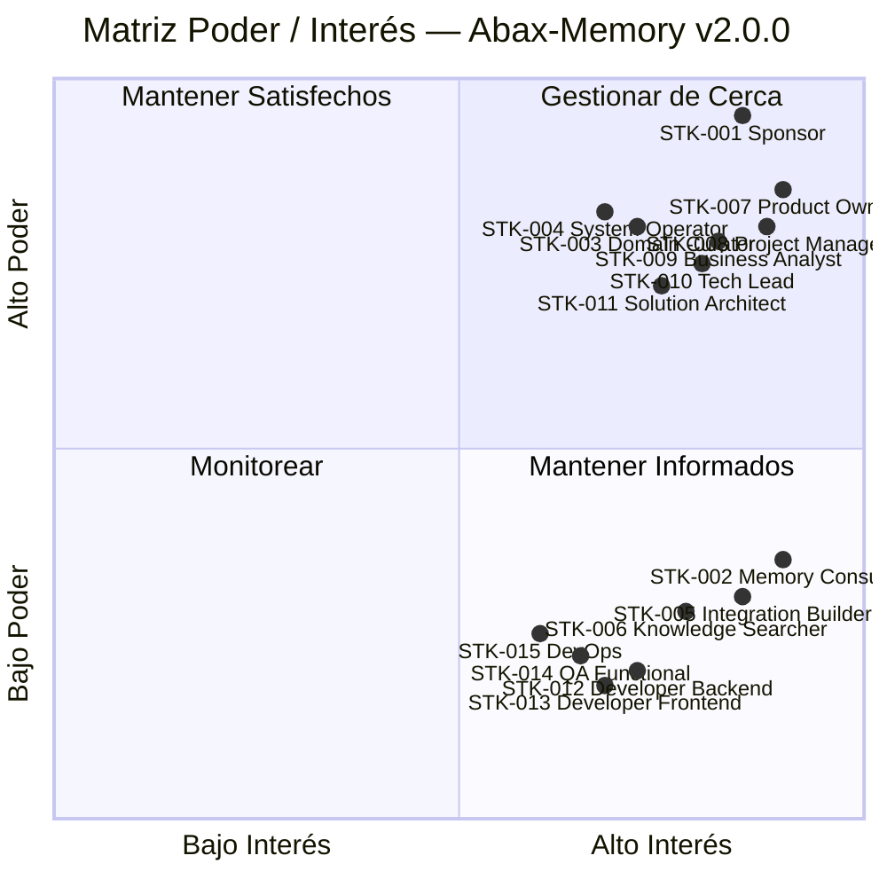

# Registro de Interesados — Abax-Memory v2.0.0
- **Fase**: 1 — Inicio (v2.0.0)
- **Responsable**: project-manager
- **Fecha**: 2026-05-03
- **Estado**: Completado
- **Release**: v2.0.0
- **Fuentes**:
  - `docs/entregables/v2/fase-0-descubrimiento/vision-producto.md` (roles del sistema, usuarios objetivo, perfiles de dominio)
  - `docs/entregables/v2/fase-0-descubrimiento/historias-usuario.md` (roles de usuario, mapping a roles técnicos)
  - `docs/entregables/v2/fase-0-descubrimiento/epicas-features.md` (alcance, épicas, features)
  - `docs/iteration-log.md` (estrategia de iteración v2, reglas de coexistencia)
  - `project-manifest.yaml` (equipo de agentes Abax)
  - `docs/entregables/v1/fase-9-cierre/` (lecciones aprendidas v1)

---

## 1. Identificación de Interesados

### 1.1 Sponsor y Usuario Directo

| ID | Interesado | Rol en el Proyecto | Tipo | Interés Principal | Nivel de Influencia | Expectativas Clave |
|---|---|---|---|---|---|---|
| **STK-001** | Usuario Sponsor | Patrocinador / Product Owner | Patrocinador | Producto funcional, competitivo en el mercado de motores de memoria, liberado con calidad. | **Alta** | Producto desplegable en producción con benchmarks comparables, API estable, y gobernanza como diferenciador. Decisión final sobre alcance, stack y criterios de aceptación. |

### 1.2 Usuarios Finales (5 Roles del Sistema)

Cada uno representa un perfil distinto de interacción con el motor de memoria v2:

| ID | Interesado | Rol en el Proyecto | Tipo | Interés Principal | Nivel de Influencia | Expectativas Clave |
|---|---|---|---|---|---|---|
| **STK-002** | Memory Consumer | Consumidor de conocimiento (`api-consumer`) | Usuario Final | Encontrar memoria relevante, confiable y actualizada para resolver problemas o tomar decisiones. | **Media** | Búsqueda semántica rápida (< 500ms p95), resultados precisos con scoring transparente, filtros estructurados potentes, expansión de grafo para navegar contexto. |
| **STK-003** | Domain Curator | Curador de dominio (`memory-operator` / `memory-reviewer`) | Usuario Final | Crear, clasificar, relacionar y mantener memorias con estructura mínima y trazabilidad. Aprobar o rechazar memorias que requieren revisión humana. | **Alta** | Ciclo de vida claro (draft → pending → active), 9 tipos de relación para modelar conocimiento complejo, perfiles de dominio que reducen la carga de configuración, revisión humana con diff antes/después. |
| **STK-004** | System Operator | Administrador del sistema (`memory-admin`) | Usuario Final | Gestionar tenants, depurar repositorio (merge, archive, soft-delete), monitorear salud del sistema y garantizar calidad global del repositorio multi-tenant. | **Alta** | Dashboard de estadísticas por tenant, herramientas de depuración masiva, acceso cross-tenant con auditoría, re-indexación masiva, purgado físico controlado. |
| **STK-005** | Integration Builder | Desarrollador integrador (`api-consumer` developer) | Usuario Final | Integrar Abax-Memory con agentes IA, aplicaciones, flujos de trabajo y pipelines de datos mediante API v2 y SDKs. | **Media** | API REST documentada (OpenAPI 3.x), SDK Python idiomático, autenticación OIDC clara, batch ingestion atómica, códigos de error estandarizados, rate limiting predecible. |
| **STK-006** | Knowledge Searcher | Buscador / Auditor de conocimiento (`memory-auditor`) | Usuario Final | Realizar búsquedas avanzadas multi-hop, auditar trazabilidad de decisiones, verificar cobertura de conocimiento y cumplimiento por dominio. | **Media** | Multi-hop traversal para consultas complejas, trazabilidad completa (quién creó/cambió/aprobó qué y cuándo), linaje de decisiones navegable, acceso a audit logs con filtros temporales. |

### 1.3 Equipo de Desarrollo — Agentes Abax (9 agentes)

El equipo responsable de diseñar, construir, probar y desplegar Abax-Memory v2.0.0:

| ID | Interesado | Rol en el Proyecto | Tipo | Interés Principal | Nivel de Influencia | Expectativas Clave |
|---|---|---|---|---|---|---|
| **STK-007** | Product Owner | Dueño del producto / Voz del usuario | Patrocinador / Equipo | Representar las necesidades del usuario final y del negocio. Validar criterios de aceptación en UAT. Decidir prioridades MoSCoW. | **Alta** | Visión de producto clara y trazable a entregables. Criterios de éxito medibles y verificables. Priorización transparente con justificación de negocio. |
| **STK-008** | Project Manager | Gestor del proyecto | Equipo | Controlar alcance, tiempo, costo y calidad. Gestionar riesgos, dependencias y comunicación a stakeholders. Asegurar gates de fase. | **Alta** | Plan de proyecto viable con hitos claros. Riesgos identificados tempranamente con mitigación. Trazabilidad de decisiones y cambios. Reportes de estado oportunos. |
| **STK-009** | Business Analyst | Analista funcional | Equipo | Traducir necesidades de negocio en requerimientos funcionales, historias de usuario, reglas de negocio y criterios de aceptación. | **Alta** | Requerimientos completos y no ambiguos. Trazabilidad requerimiento → feature → historia → criterio de aceptación. Reglas de negocio formalizadas y validadas con Product Owner. |
| **STK-010** | Tech Lead | Líder técnico | Equipo | Definir la arquitectura técnica, revisar calidad del código, aprobar diseños técnicos y decisiones de stack (ADR). | **Alta** | Diseño técnico sólido y documentado. ADRs que justifiquen decisiones de stack y arquitectura. Código limpio, testeable y mantenible. Anti-mock review antes de cada liberación. |
| **STK-011** | Solution Architect | Arquitecto de solución | Equipo | Diseñar la arquitectura global del sistema, integraciones, modelo de datos, flujos de información y restricciones técnicas. | **Alta** | Arquitectura que soporte multi-tenancy, perfiles de dominio dinámicos, y English-Only internals sin comprometer rendimiento ni seguridad. |
| **STK-012** | Developer Backend | Desarrollador backend | Equipo | Implementar la API v2, lógica de negocio, acceso a datos, integración con Qdrant/PostgreSQL/Keycloak/OpenAI. | **Media** | Especificaciones técnicas claras. Entorno de desarrollo reproducible. Dependencias declaradas y versionadas. Criterios de aceptación técnicos no ambiguos. |
| **STK-013** | Developer Frontend | Desarrollador frontend | Equipo | Implementar la UI multi-dominio, componentes reutilizables, consumo de API v2, visualización de grafo de relaciones. | **Media** | API v2 estable y documentada. Diseños y guías de estilo definidos. Componentes con criterios de accesibilidad WCAG 2.1. |
| **STK-014** | QA Functional | QA funcional | Equipo | Diseñar y ejecutar casos de prueba funcionales, regresión, trazabilidad con requerimientos y reporte de defectos. | **Media** | Criterios de aceptación verificables. Acceso a ambientes de prueba con datos representativos. Trazabilidad completa requerimiento → caso de prueba → resultado. |
| **STK-015** | DevOps / Release Engineer | Ingeniero de despliegue | Equipo | Gestionar infraestructura, ambientes, CI/CD, contenedorización, despliegue y monitoreo operativo. | **Media** | Stack definido y estable (o ADR que justifique cambios). Plan de despliegue con rollback validado. Health checks y métricas expuestas. |

---

## 2. Clasificación por Tipo de Interesado

| Tipo | Cantidad | IDs | Descripción |
|---|---|---|---|
| **Patrocinador** | 2 | STK-001, STK-007 | Definen financiamiento, autoridad y dirección estratégica del producto. |
| **Usuario Final** | 5 | STK-002 a STK-006 | Utilizarán el motor de memoria directamente en sus flujos de trabajo. |
| **Equipo Técnico** | 8 | STK-008 a STK-015 | Diseñan, construyen, prueban y despliegan el producto. |

---

## 3. Matriz Poder / Interés

### 3.1 Clasificación por Cuadrante

Cada interesado se clasifica en uno de cuatro cuadrantes según su nivel de poder (influencia sobre decisiones del proyecto) y su interés (cuánto le afecta el resultado):

| Cuadrante | Estrategia | IDs |
|---|---|---|
| **Alto Poder + Alto Interés** | Gestionar de cerca — comunicación frecuente, involucramiento directo en decisiones clave, validación de hitos. | STK-001 (Sponsor), STK-007 (Product Owner), STK-008 (Project Manager), STK-009 (Business Analyst), STK-010 (Tech Lead), STK-011 (Solution Architect) |
| **Alto Poder + Bajo Interés** | Mantener satisfechos — reportes periódicos de avance, comunicación de hitos, escalar solo desviaciones significativas. | STK-003 (Domain Curator), STK-004 (System Operator) |
| **Bajo Poder + Alto Interés** | Mantener informados — compartir avances, recopilar feedback, involucrar en validaciones y demos. | STK-002 (Memory Consumer), STK-005 (Integration Builder), STK-006 (Knowledge Searcher) |
| **Bajo Poder + Bajo Interés** | Monitorear — comunicación puntual, informar solo de cambios que les afecten directamente. | STK-012 (Developer Backend), STK-013 (Developer Frontend), STK-014 (QA Functional), STK-015 (DevOps) |

### 3.2 Visualización de la Matriz

### 3.3 Detalle por Cuadrante

#### Cuadrante 1 — Gestionar de Cerca (Alto Poder, Alto Interés)

| ID | Interesado | Canal | Frecuencia | Formato |
|---|---|---|---|---|
| STK-001 | Sponsor | Reporte ejecutivo + reunión de validación | Semanal / Por gate de fase | Dashboard de estado + presentación de hitos |
| STK-007 | Product Owner | Reunión de priorización + validación UAT | Semanal / Por historia | Backlog actualizado + demo funcional |
| STK-008 | Project Manager | Comunicación continua (rol ejecutor) | Diaria | Tablero de tareas + matriz de riesgos |
| STK-009 | Business Analyst | Reunión de refinamiento | Por fase (F1-F2) | Documentos de requerimientos + reglas de negocio |
| STK-010 | Tech Lead | Reunión técnica + code review | Por fase (F3-F4) | ADRs + diseño técnico + anti-mock review |
| STK-011 | Solution Architect | Reunión de arquitectura | Por fase (F1-F3) | Diagramas de arquitectura + ADRs |

#### Cuadrante 2 — Mantener Satisfechos (Alto Poder, Bajo Interés)

| ID | Interesado | Canal | Frecuencia | Formato |
|---|---|---|---|---|
| STK-003 | Domain Curator | Reporte de funcionalidades + demo | Por hito (F5, F6) | Demo de flujo de creación/revisión + métricas de cobertura |
| STK-004 | System Operator | Reporte de administración | Por hito (F5, F6) | Demo de dashboard admin + guía de operación |

#### Cuadrante 3 — Mantener Informados (Bajo Poder, Alto Interés)

| ID | Interesado | Canal | Frecuencia | Formato |
|---|---|---|---|---|
| STK-002 | Memory Consumer | Release notes + documentación | Por release | API docs + guía de búsqueda + ejemplos |
| STK-005 | Integration Builder | Documentación técnica + SDK examples | Por release | OpenAPI spec + SDK quickstart + ejemplos |
| STK-006 | Knowledge Searcher | Documentación + guías de auditoría | Por release | Guía de búsqueda avanzada + consultas multi-hop |

#### Cuadrante 4 — Monitorear (Bajo Poder, Bajo Interés)

| ID | Interesado | Canal | Frecuencia | Formato |
|---|---|---|---|---|
| STK-012 | Developer Backend | Daily + planning | Diaria / Por sprint | Tablero de tareas + specs técnicas |
| STK-013 | Developer Frontend | Daily + planning | Diaria / Por sprint | Tablero de tareas + guías de estilo |
| STK-014 | QA Functional | Planning + triage de defectos | Por fase (F5) | Plan de pruebas + registro de defectos |
| STK-015 | DevOps | Planning + coordinación de despliegue | Por fase (F7) | Plan de despliegue + runbooks |

---

## 4. Mapa de Intereses y Preocupaciones

### 4.1 Intereses Comunes (alineación entre stakeholders)

| Tema | Interesados Alineados | Interés Compartido |
|---|---|---|
| **Calidad del producto** | STK-001, STK-007, STK-008, STK-010, STK-014 | Criterios de éxito medibles, 0 defectos críticos en producción, benchmarks verificables. |
| **English-Only Compliance** | STK-009, STK-010, STK-011, STK-012 | Todos los identificadores internos en inglés. Riesgo de rechazo si se mezclan idiomas. |
| **API v2 estable** | STK-002, STK-005, STK-006, STK-013 | Contrato de API documentado, sin breaking changes sin aviso, códigos de error predecibles. |
| **Multi-tenancy robusta** | STK-003, STK-004, STK-011, STK-015 | Aislamiento total entre tenants, sin data leakage, rendimiento predecible por tenant. |
| **Trazabilidad completa** | STK-003, STK-004, STK-006, STK-009 | Toda mutación genera registro de auditoría inmutable con diff antes/después. |
| **Perfiles de dominio útiles** | STK-003, STK-007, STK-009 | Perfiles que realmente aceleren la adopción sin ser restrictivos ni requerir custom code. |

### 4.2 Conflictos Potenciales de Interés

| Conflicto | Stakeholders en Tensión | Descripción | Mitigación |
|---|---|---|---|
| **Stack flexible vs. estabilidad** | STK-010 (quiere libertad de elegir stack) ↔ STK-015 (necesita stack estable para operar) | La restricción R-01 permite cambiar componentes del stack si se justifica con ADR. DevOps necesita previsibilidad. | Todo cambio de stack requiere ADR aprobado antes de F3. Sin cambios post-F3 sin evaluación de impacto y plan de migración. |
| **Perfiles genéricos vs. específicos** | STK-003 (quiere perfiles ricos y adaptados) ↔ STK-011 (necesita core genérico sin lógica de dominio) | Domain Curator quiere vocabulario y metadatos ricos por dominio. La arquitectura prohíbe código específico de dominio en el core. | Los perfiles se definen como configuraciones (no código). Cualquier feature que requiera lógica específica de dominio se evalúa caso a caso. |
| **Velocidad vs. calidad** | STK-008 (presión por cronograma) ↔ STK-014 (rigor de pruebas) | Cascada penaliza desviaciones de cronograma. QA requiere ciclos completos de prueba sin atajos. | No se omiten fases de QA. Si hay presión de tiempo, se reduce alcance (MoSCoW Could), no calidad. |
| **Frontend ambicioso vs. API-first** | STK-013 (quiere UI rica e interactiva) ↔ STK-010 (prioriza API como producto principal) | La restricción R-06 exige API-first. El frontend es un consumidor más. Feature creep en UI puede distraer del core. | El frontend se acota a las features Must (EP-009). Cualquier feature de UI que requiera endpoints nuevos debe evaluarse como cambio de alcance. |

---

## 5. Estrategia de Comunicación Global

| Audiencia | Objetivo | Canal Primario | Responsable | Frecuencia Mínima |
|---|---|---|---|---|
| Sponsor | Validar dirección, aprobar gates, resolver bloqueos | Reporte ejecutivo + reunión | Project Manager | Semanal / Por gate |
| Product Owner | Priorizar backlog, validar criterios de aceptación | Reunión de trabajo + demo | Business Analyst | Semanal / Por historia |
| Usuarios Finales (5 roles) | Validar funcionalidad, recopilar feedback | Demo + release notes | Product Owner + Business Analyst | Por hito (F5, F6, F8) |
| Equipo Técnico (8 agentes) | Coordinar ejecución, resolver dependencias | Daily + planning + code review | Tech Lead + Project Manager | Diaria |
| DevOps | Coordinar despliegue, monitorear salud | Planning de release + post-deploy review | DevOps + Project Manager | Por fase (F7, F8) |

---

## 6. Actualizaciones

| Fecha | Versión | Cambio | Autor |
|---|---|---|---|
| 2026-05-03 | 1.0 | Registro inicial de interesados para v2.0.0 Fase 1. | project-manager |

---

## Glosario

- **MoSCoW**: Método de priorización: Must (obligatorio), Should (debería), Could (podría), Won't (no se incluirá).
- **ADR**: Architecture Decision Record — documento que registra una decisión arquitectónica, su contexto, alternativas evaluadas y consecuencias.
- **UAT**: User Acceptance Testing — fase 6 del ciclo cascada donde el Product Owner valida que el producto cumple los criterios de aceptación.
- **OIDC**: OpenID Connect — protocolo de autenticación basado en OAuth 2.0 para verificar identidad de usuarios y obtener claims (roles, tenants).
- **p95**: Percentil 95 — métrica de latencia que indica que el 95% de las solicitudes se completan en un tiempo igual o menor al valor indicado.
- **RBAC**: Role-Based Access Control — control de acceso basado en roles donde los permisos se asignan a roles y los usuarios heredan los permisos del rol asignado.
- **Soft-delete**: Eliminación lógica que marca un registro como `deleted` sin borrarlo físicamente, preservando trazabilidad y permitiendo recuperación.
