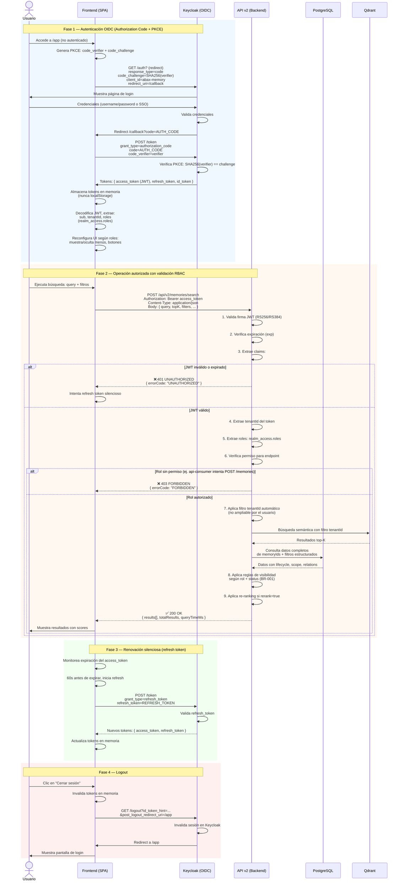

# Diagramas de Proceso — Abax-Memory v2.0.0

- **Fase**: 2 — Análisis Funcional (v2.0.0)
- **Responsable**: business-analyst
- **Fecha**: 2026-05-03
- **Estado**: Completado
- **Fuentes**:
  - `docs/entregables/v2/fase-2-analisis/especificacion-funcional.md` — 7 diagramas Mermaid base
  - `docs/entregables/v2/fase-0-descubrimiento/historias-usuario.md` — 69 historias de usuario
  - `/root/proyectos-personales/administrador/PROPUESTA-ABAX-MEMORY-GENERICO.md` — visión arquitectónica

---

## Tabla de Contenidos

1. [Ingestión de Memoria](#1-ingestión-de-memoria)
2. [Búsqueda Semántica End-to-End](#2-búsqueda-semántica-end-to-end)
3. [Ciclo de Vida Completo](#3-ciclo-de-vida-completo)
4. [Revisión Humana](#4-revisión-humana)
5. [Configuración de Perfil de Dominio](#5-configuración-de-perfil-de-dominio)
6. [Graph Traversal](#6-graph-traversal)
7. [Onboarding de Tenant](#7-onboarding-de-tenant)
8. [Flujo de Autenticación OIDC + RBAC](#8-flujo-de-autenticación-oidc--rbac)
9. [Batch Ingestion](#9-batch-ingestion)
10. [End-to-End: Usuario Universal](#10-end-to-end-usuario-universal)
11. [Glosario](#glosario)

---

## 1. Ingestión de Memoria

**Propósito**: Flujo completo desde que un usuario o sistema externo crea un fragmento de memoria hasta que está indexado vectorialmente y disponible para búsqueda semántica.

**Historias de usuario relacionadas**:
- HU-001.01.1 — Clasificar una memoria con kind universal
- HU-001.05.1 — Enriquecer memorias con metadatos de dominio
- HU-001.06.1 — Registrar el origen de una memoria
- HU-001.09.1 — Asignar nivel de confianza a una memoria
- HU-003.06.1 — Validar que toda memoria nueva tiene scope con tenantId
- HU-004.01.1 — Crear una memoria vía API v2
- HU-005.07.1 — Generar y almacenar embedding automáticamente al crear o actualizar

**Reglas de negocio implicadas**: BR-003, BR-006, BR-009, BR-011, BR-012, BR-013, BR-016, BR-017, BR-018, BR-019, BR-020

```mermaid
flowchart TD
    START([Usuario o Sistema<br/>envía POST /memories]) --> VALIDATE_AUTH{¿Token JWT<br/>válido?}
    VALIDATE_AUTH -->|No| E401["❌ HTTP 401<br/>UNAUTHORIZED"]
    VALIDATE_AUTH -->|Sí| VALIDATE_ROLE{¿Rol permite<br/>creación?}
    
    VALIDATE_ROLE -->|No: api-consumer<br/>o memory-auditor| E403["❌ HTTP 403<br/>FORBIDDEN"]
    VALIDATE_ROLE -->|Sí: memory-operator<br/>memory-reviewer<br/>memory-admin| VALIDATE_JSON{¿JSON<br/>válido?}
    
    VALIDATE_JSON -->|No| E400_JSON["❌ HTTP 400<br/>INVALID_JSON"]
    VALIDATE_JSON -->|Sí| VALIDATE_SCOPE{¿scope.tenantId<br/>presente y<br/>no vacío?}
    
    VALIDATE_SCOPE -->|No| E400_SCOPE["❌ HTTP 400<br/>VALIDATION_ERROR<br/>scope.tenantId requerido"]
    VALIDATE_SCOPE -->|Sí| VALIDATE_KIND{¿kind es uno<br/>de los 8 valores<br/>del enum?}
    
    VALIDATE_KIND -->|No| E400_KIND["❌ HTTP 400<br/>VALIDATION_ERROR<br/>kind inválido"]
    VALIDATE_KIND -->|Sí| VALIDATE_CONTENT{¿content no<br/>vacío ni solo<br/>whitespace?}
    
    VALIDATE_CONTENT -->|No| E400_CONTENT["❌ HTTP 400<br/>VALIDATION_ERROR<br/>content requerido"]
    VALIDATE_CONTENT -->|Sí| VALIDATE_RANGES{¿confidence e<br/>importance en<br/>[0.0, 1.0]?}
    
    VALIDATE_RANGES -->|No| E400_RANGE["❌ HTTP 400<br/>VALIDATION_ERROR<br/>rango inválido"]
    VALIDATE_RANGES -->|Sí| VALIDATE_UNKNOWN{¿Campos<br/>desconocidos<br/>en payload?}
    
    VALIDATE_UNKNOWN -->|Sí: strict mode| E400_UNKNOWN["❌ HTTP 400<br/>INVALID_REQUEST_BODY<br/>campo no reconocido"]
    VALIDATE_UNKNOWN -->|No| APPLY_DEFAULTS
    
    APPLY_DEFAULTS[Aplicar defaults<br/>del perfil activo o<br/>core genérico] --> CHECK_UMBRAL{¿Requiere<br/>revisión<br/>obligatoria?<br/><br/>importance ≥ 0.7<br/>Y sensitivity IN<br/>(confidential, secret)}
    
    CHECK_UMBRAL -->|Sí| FORCE_STATUS["Forzar<br/>lifecycle.status<br/>= draft<br/>(BR-006)"]
    CHECK_UMBRAL -->|No| SET_STATUS["Respetar status<br/>solicitado o<br/>aplicar default<br/>'active'"]
    
    FORCE_STATUS --> PERSIST
    SET_STATUS --> PERSIST
    
    PERSIST[Persistir en<br/>PostgreSQL<br/>con memoryId<br/>autogenerado<br/>MEM-xxxxxxxx] --> REG_AUDIT[Registrar en<br/>log de auditoría:<br/>acción='create'<br/>+ diff completo]
    
    REG_AUDIT --> GEN_EMBED[Generar embedding<br/>OpenAI text-embedding-3-large<br/>3072 dimensiones<br/>desde 'content']
    
    GEN_EMBED --> INDEX_QDRANT[Upsert en Qdrant:<br/>vector + memoryId<br/>+ payload<br/>(kind, topics, entities)]
    
    INDEX_QDRANT --> ASSEMBLE_RESPONSE[Construir response<br/>con objeto completo<br/>incluyendo memoryId,<br/>timestamps, lifecycle]
    
    ASSEMBLE_RESPONSE --> SUCCESS["✅ HTTP 201 Created<br/>Location: /api/v2/memories/{id}"]
```

**Notas importantes**:
- El `kind` es inmutable desde la creación (BR-011). No puede modificarse con `PATCH`.
- El `memoryId` lo genera siempre el sistema (BR-012). Si el cliente envía uno, se ignora o se rechaza.
- Si no se especifica `lifecycle.importance` ni `lifecycle.sensitivity`, el sistema aplica los defaults del perfil activo (BR-009). Sin perfil: `importance=0.5`, `sensitivity=internal`.
- La generación de embedding ocurre **sincrónicamente** dentro de la request de creación. La memoria no se retorna al cliente hasta que el embedding está indexado en Qdrant (HU-005.07.1).

---

## 2. Búsqueda Semántica End-to-End

**Propósito**: Flujo completo desde que un usuario envía una query en texto libre hasta que recibe resultados rankeados con expansión de grafo opcional.

**Historias de usuario relacionadas**:
- HU-005.01.1 — Buscar memorias por texto libre semántico
- HU-005.02.1 — Refinar búsqueda con filtros simultáneos
- HU-005.03.1 — Obtener vecinos de cada resultado en la misma búsqueda
- HU-005.04.1 — Activar re-ranking para mejorar precisión top-K
- HU-005.06.1 — Controlar cuántos resultados retorna la búsqueda
- HU-005.09.1 — Visibilidad gobernada por estado en búsqueda
- HU-005.10.1 — Ver el score de relevancia en cada resultado
- HU-006.03.1 — Control de visibilidad según estado y rol

**Reglas de negocio implicadas**: BR-001, BR-004

```mermaid
flowchart TD
    START([Usuario/Sistema<br/>POST /memories/search<br/>query + filtros]) --> VALID_AUTH{¿Token JWT<br/>válido?}
    VALID_AUTH -->|No| E401["❌ 401 UNAUTHORIZED"]
    VALID_AUTH -->|Sí| VALID_QUERY{¿query no<br/>vacío?}
    
    VALID_QUERY -->|No| E400["❌ 400<br/>query requerido"]
    VALID_QUERY -->|Sí| EXTRACT_TENANT[Extraer tenantId<br/>del token JWT<br/>para filtro<br/>automático BR-004]
    
    EXTRACT_TENANT --> EMBED_QUERY[Generar embedding<br/>de la query<br/>OpenAI text-embedding-3-large<br/>→ vector 3072-dim]
    
    EMBED_QUERY --> QDRANT_SEARCH[Qdrant: búsqueda por<br/>similitud de coseno<br/>top-K candidates<br/>K = topK × factor<br/>para margen de re-ranking]
    
    QDRANT_SEARCH --> APPLY_TENANT[Aplicar filtro<br/>tenantId del token<br/>obligatorio, inmutable]
    
    APPLY_TENANT --> APPLY_KINDS{¿Filtro<br/>kinds?}
    APPLY_KINDS -->|Sí| FK[Filtrar por kinds<br/>IN array]
    APPLY_KINDS -->|No| APPLY_STATUSES
    FK --> APPLY_STATUSES
    
    APPLY_STATUSES{¿Filtro<br/>statuses<br/>explícito?}
    APPLY_STATUSES -->|No| FS_DEFAULT["Aplicar default:<br/>statuses = ['active']<br/>(BR-001)"]
    APPLY_STATUSES -->|Sí| FS_USER["Validar permisos<br/>para statuses<br/>solicitados"]
    FS_DEFAULT --> APPLY_TOPICS
    FS_USER --> APPLY_TOPICS
    
    APPLY_TOPICS{¿Filtro<br/>topics?} -->|Sí| FT[Filtrar por topics<br/>AND lógico]
    APPLY_TOPICS -->|No| APPLY_ENTITIES
    FT --> APPLY_ENTITIES
    
    APPLY_ENTITIES{¿Filtro<br/>entities?} -->|Sí| FE[Filtrar por entities]
    APPLY_ENTITIES -->|No| APPLY_IMPORTANCE
    FE --> APPLY_IMPORTANCE
    
    APPLY_IMPORTANCE{¿Rango<br/>importance?} -->|Sí| FI[Filtrar importance<br/>gte/lte]
    APPLY_IMPORTANCE -->|No| APPLY_CONFIDENCE
    FI --> APPLY_CONFIDENCE
    
    APPLY_CONFIDENCE{¿Rango<br/>confidence?} -->|Sí| FC[Filtrar confidence<br/>gte/lte]
    APPLY_CONFIDENCE -->|No| APPLY_SENSITIVITY
    FC --> APPLY_SENSITIVITY
    
    APPLY_SENSITIVITY{¿Filtro<br/>sensitivities?} -->|Sí| FSENS[Filtrar por<br/>sensitivity IN]
    APPLY_SENSITIVITY -->|No| APPLY_DATES
    FSENS --> APPLY_DATES
    
    APPLY_DATES{¿Rango<br/>fechas?} -->|Sí| FD[Filtrar createdAfter<br/>createdBefore]
    APPLY_DATES -->|No| APPLY_SCOPE_EXTRA
    FD --> APPLY_SCOPE_EXTRA
    
    APPLY_SCOPE_EXTRA["Aplicar filtros<br/>opcionales de scope:<br/>userId, sessionId,<br/>namespace"] --> CHECK_RERANK{¿rerank<br/>= true?}
    
    CHECK_RERANK -->|Sí| RERANK["Re-ranking combinado:<br/>• Score semántico Qdrant (0.50)<br/>• lifecycle.importance (0.20)<br/>• lifecycle.confidence (0.15)<br/>• Frescura updatedAt (0.10)<br/>• Riqueza de relaciones (0.05)"]
    
    CHECK_RERANK -->|No| SORT_RAW[Ordenar por<br/>score semántico<br/>crudo]
    
    RERANK --> CHECK_EXPAND{¿expandGraph<br/>solicitado?}
    SORT_RAW --> CHECK_EXPAND
    
    CHECK_EXPAND -->|Sí| EXPAND["Expandir vecinos<br/>por depth y filtros<br/>includeKinds<br/>Omitir nodos deleted<br/>Respetar visibilidad<br/>por rol"]
    CHECK_EXPAND -->|No| LIMIT_TOPK[Truncar a topK<br/>máx configurable]
    
    EXPAND --> LIMIT_TOPK
    
    LIMIT_TOPK --> ASSEMBLE[Construir response:<br/>results[] con memoryId,<br/>kind, summary, score,<br/>lifecycle, topics,<br/>entities, relations]
    
    ASSEMBLE --> SUCCESS["✅ 200 OK<br/>totalResults,<br/>queryTimeMs,<br/>results[]"]
```

**Notas importantes**:
- El tenantId del token JWT es **inmutable** y se aplica siempre. Si el usuario intenta ampliar el scope en `filters.scopes.tenantId`, el sistema lo ignora o lo rechaza (BR-004, SC-08).
- El filtro por defecto `statuses = ['active']` (BR-001) solo se omite si el usuario especifica explícitamente otros estados y tiene permisos suficientes.
- El re-ranking es opcional (`rerank: true`). Sin él, los resultados se ordenan por score de similitud de coseno crudo.
- Los pesos del re-ranking son configurables y deben formalizarse en el ADR de diseño técnico. Los valores mostrados son guía funcional.

---

## 3. Ciclo de Vida Completo

**Propósito**: State diagram completo con todos los estados, transiciones permitidas, guard conditions, y acciones asociadas.

**Historias de usuario relacionadas**:
- HU-001.02.1 — Gestionar el ciclo de vida de una memoria
- HU-001.02.2 — Rechazar una memoria en revisión
- HU-001.07.1 — Eliminar lógicamente una memoria
- HU-001.08.1 — Crear una nueva versión que reemplaza una anterior
- HU-004.04.1 — Ejecutar acciones de revisión vía API
- HU-006.02.1 — Completar el workflow de revisión: draft → pending → active
- HU-006.03.1 — Control de visibilidad según estado y rol
- HU-006.04.1 — Forzar revisión humana para memorias de alta criticidad

**Reglas de negocio implicadas**: BR-001, BR-002, BR-005, BR-006

```mermaid
stateDiagram-v2
    direction LR

    [*] --> draft : CREATE<br/>POST /memories

    state "draft" as draft
    state "pending" as pending
    state "active" as active
    state "archived" as archived
    state "rejected" as rejected
    state "deleted" as deleted

    state draft {
        [*] --> draft_editing : memory creada
        draft_editing --> draft_editing : PATCH content/metadata<br/>(registrado en auditoría)
        state "Guard: importance ≥ 0.7<br/>AND sensitivity IN<br/>(confidential, secret)" as guard_forced
        note right of guard_forced : BR-006: forzado a draft<br/>aunque se solicite 'active'
    }

    draft --> pending : SUBMIT review<br/>POST /memories/{id}/review<br/>action: 'submit'
    draft --> deleted : SOFT-DELETE<br/>DELETE /memories/{id}

    state pending {
        [*] --> pending_waiting : esperando decisión
        state "Roles: memory-reviewer,<br/>memory-admin" as pending_roles
    }

    pending --> active : APPROVE review<br/>action: 'approve'<br/>+ reviewedBy, reviewedAt
    pending --> rejected : REJECT review<br/>action: 'reject'<br/>+ reviewComment obligatorio
    pending --> draft : REQUEST CHANGES<br/>action: 'submit' (retorno)<br/>+ reviewComment
    pending --> deleted : SOFT-DELETE

    state active {
        [*] --> active_visible : visible en búsqueda
        state "Visible para TODOS<br/>los roles en búsquedas" as visible_all
        state "Puede recibir<br/>relaciones entrantes" as can_receive_rels
    }

    active --> archived : ARCHIVE review<br/>action: 'archive'<br/>solo memory-admin
    active --> deleted : SOFT-DELETE
    active --> active : PATCH contenido/metadatos<br/>(reindexa si cambia content)

    state "❌ PROHIBIDO" as prohibited_active_draft
    active --> prohibited_active_draft : active → draft<br/>USAR supersedes<br/>para nueva versión

    state archived {
        [*] --> archived_hidden : fuera de circulación
        state "Solo visible para<br/>memory-admin y<br/>memory-auditor" as archived_vis
    }

    archived --> deleted : SOFT-DELETE

    state "❌ PROHIBIDO" as prohibited_archived_active
    archived --> prohibited_archived_active : archived → active<br/>CREAR nueva versión<br/>con supersedes

    state rejected {
        [*] --> rejected_blocked : esperando iteración
        state "Solo visible por<br/>creador, reviewer,<br/>admin, auditor" as rejected_vis
    }

    rejected --> draft : RESUBMIT review<br/>action: 'submit'<br/>vuelve a draft para<br/>que el creador itere
    rejected --> deleted : SOFT-DELETE

    state "❌ PROHIBIDO" as prohibited_rejected_active
    rejected --> prohibited_rejected_active : rejected → active<br/>debe pasar por<br/>draft → pending → active

    state deleted {
        [*] --> deleted_hidden : soft-delete
        state "No visible en ninguna<br/>búsqueda estándar.<br/>Solo memory-admin<br/>por endpoint admin.<br/>Vector preservado<br/>en Qdrant." as deleted_info
    }

    deleted --> [*] : PURGE (admin, futuro)<br/>eliminación física<br/>de PostgreSQL y Qdrant

    note right of prohibited_active_draft : BR-005: activo no puede<br/>volver a borrador.
    note right of prohibited_archived_active : BR-005: Archivado<br/>requiere nueva versión.
    note right of prohibited_rejected_active : BR-005: Rechazado<br/>requiere pasar por draft.
```

**Resumen de transiciones permitidas**:

| Origen | → Destino | Condición | Rol requerido |
|---|---|---|---|
| `[*]` | `draft` | POST /memories | memory-operator, memory-reviewer, memory-admin |
| `draft` | `pending` | POST /review action:'submit' | memory-operator (propio), memory-admin |
| `draft` | `deleted` | DELETE /memories/{id} | memory-operator (propio), memory-admin |
| `pending` | `active` | POST /review action:'approve' | memory-reviewer, memory-admin |
| `pending` | `rejected` | POST /review action:'reject' + comment | memory-reviewer, memory-admin |
| `pending` | `draft` | POST /review (request changes) + comment | memory-reviewer, memory-admin |
| `pending` | `deleted` | DELETE /memories/{id} | memory-operator (propio), memory-admin |
| `active` | `archived` | POST /review action:'archive' | memory-admin |
| `active` | `deleted` | DELETE /memories/{id} | memory-operator (propio), memory-admin |
| `archived` | `deleted` | DELETE /memories/{id} | memory-admin |
| `rejected` | `draft` | POST /review action:'submit' (resubmit) | memory-operator (propio) |
| `rejected` | `deleted` | DELETE /memories/{id} | memory-operator (propio), memory-admin |
| `deleted` | `[*]` | PURGE (futuro, solo admin) | memory-admin |

**Transiciones prohibidas**:

| Transición | Razón | Regla |
|---|---|---|
| `active` → `draft` | Conocimiento aprobado no puede volver a borrador. Usar `supersedes`. | BR-005 |
| `archived` → `active` | Conocimiento archivado debe crear nueva versión. | BR-005 |
| `rejected` → `active` | Debe pasar por `draft → pending → active`. | BR-005 |
| `deleted` → cualquier | Soft-delete irreversible sin purga administrativa. | BR-002 |

---

## 4. Revisión Humana

**Propósito**: Flujo de revisión con umbrales, roles y notificaciones. Cubre desde que un operador crea una memoria hasta que un revisor la aprueba o rechaza.

**Historias de usuario relacionadas**:
- HU-001.02.2 — Rechazar una memoria en revisión
- HU-004.04.1 — Ejecutar acciones de revisión vía API
- HU-006.02.1 — Completar el workflow de revisión: draft → pending → active
- HU-006.04.1 — Forzar revisión humana para memorias de alta criticidad
- HU-009.03.1 — Vista dedicada para revisar y decidir sobre memorias pendientes

**Reglas de negocio implicadas**: BR-005, BR-006

```mermaid
flowchart TD
    START([Operator crea<br/>memoria vía<br/>POST /memories]) --> CHECK_UMBRAL{¿BR-006 activa?<br/><br/>importance ≥ 0.7<br/>Y sensitivity IN<br/>(confidential, secret)}
    
    CHECK_UMBRAL -->|"Sí: forzar draft"| FORCE_DRAFT["Memoria creada<br/>con status = 'draft'<br/>independientemente<br/>de lo solicitado"]
    CHECK_UMBRAL -->|"No: respetar<br/>solicitud"| CHECK_REQUESTED{¿Status<br/>solicitado?}
    
    CHECK_REQUESTED -->|"active"| CREATED_ACTIVE["Memoria creada<br/>en 'active'<br/>directamente<br/>visible en búsquedas"]
    CHECK_REQUESTED -->|"draft"| FORCE_DRAFT
    
    FORCE_DRAFT --> DRAFT_EDITING[Operator edita<br/>y refina en draft<br/>PATCH /memories/{id}<br/>múltiples iteraciones<br/>permitidas]
    
    DRAFT_EDITING --> OPERATOR_DECISION{¿Operator<br/>decide enviar<br/>a revisión?}
    
    OPERATOR_DECISION -->|"Sí: submit"| SUBMIT["POST /memories/{id}/review<br/>action: 'submit'<br/>draft → pending"]
    OPERATOR_DECISION -->|"No: sigue<br/>editando"| DRAFT_EDITING
    OPERATOR_DECISION -->|"Abandonar"| SOFT_DELETE["DELETE /memories/{id}<br/>draft → deleted"]
    
    SUBMIT --> NOTIFY_REVIEWER[Notificar a revisores<br/>del scope:<br/>nueva memoria en pending]
    
    NOTIFY_REVIEWER --> REVIEWER_QUEUE[Aparece en bandeja<br/>de revisión:<br/>Panel de Revisión<br/>o consulta API]
    
    REVIEWER_QUEUE --> REVIEWER_OPENS[Reviewer abre<br/>detalle completo:<br/>contenido, metadata,<br/>historial de cambios,<br/>relaciones]
    
    REVIEWER_OPENS --> REVIEWER_EVALUATES{¿Decisión<br/>del revisor?}
    
    REVIEWER_EVALUATES -->|"APPROVE"| APPROVE["POST /memories/{id}/review<br/>action: 'approve'<br/>pending → active<br/>+ reviewedBy<br/>+ reviewedAt<br/>+ reviewComment opcional"]
    
    REVIEWER_EVALUATES -->|"REJECT"| REJECT["POST /memories/{id}/review<br/>action: 'reject'<br/>pending → rejected<br/>+ reviewComment<br/>OBLIGATORIO"]
    
    REVIEWER_EVALUATES -->|"REQUEST<br/>CHANGES"| REQUEST_CHANGES["POST /memories/{id}/review<br/>action: 'submit' (retorno)<br/>pending → draft<br/>+ reviewComment<br/>OBLIGATORIO"]
    
    APPROVE --> APPROVE_EFFECTS["✅ Memoria visible<br/>en búsquedas<br/>para todos los roles.<br/>Registro en auditoría:<br/>acción='review_approve'"]
    
    REJECT --> REJECT_EFFECTS["❌ Memoria en rejected.<br/>Operator recibe<br/>notificación con<br/>motivo de rechazo.<br/>Registro en auditoría:<br/>acción='review_reject'"]
    
    REJECT_EFFECTS --> OPERATOR_READS_REJECTION[Operator lee<br/>motivo de rechazo<br/>en reviewComment]
    
    OPERATOR_READS_REJECTION --> OPERATOR_ITERATES{¿Operator<br/>decide iterar?}
    OPERATOR_ITERATES -->|"Sí: resubmit"| RESUBMIT["POST /memories/{id}/review<br/>action: 'submit' (resubmit)<br/>rejected → draft"]
    OPERATOR_ITERATES -->|"No: abandona"| SOFT_DELETE
    
    RESUBMIT --> DRAFT_EDITING
    
    REQUEST_CHANGES --> REQUEST_EFFECTS["Memoria vuelve a draft<br/>Operator recibe<br/>notificación con<br/>solicitud de cambios.<br/>Registro en auditoría:<br/>acción='review_submit'"]
    
    REQUEST_EFFECTS --> DRAFT_EDITING

    CREATED_ACTIVE --> ACTIVE_LIFE["Memoria activa:<br/>visible, buscable,<br/>relacionable.<br/>Puede ser archivada<br/>o soft-deleteada<br/>posteriormente."]

    ACTIVE_LIFE --> MONITORING["Dashboards de<br/>calidad monitorean:<br/>• Tasa de aprobación<br/>• Tiempo medio en revisión<br/>• Drafts huérfanos (>30 días)"]
```

**Umbral de revisión obligatoria (BR-006)**:

| Condición | Efecto | Excepción |
|---|---|---|
| `importance ≥ 0.7` Y `sensitivity ∈ {confidential, secret}` | Forzar `status = draft` aunque se solicite `active` | memory-admin con flag + justificación en auditoría |
| Solo una condición (ej. `importance=0.8, sensitivity=internal`) | No se fuerza. Puede crearse en `active`. | — |
| Ninguna condición | No se fuerza. | — |

**Roles involucrados en el flujo de revisión**:

| Rol | Puede enviar a revisión | Puede aprobar/rechazar | Scope de revisión |
|---|---|---|---|
| `memory-operator` | ✅ (memorias propias) | ❌ | Solo sus propias memorias |
| `memory-reviewer` | ✅ | ✅ | Memorias en su scope asignado |
| `memory-admin` | ✅ | ✅ | Todas las memorias del tenant (+ cross-tenant) |
| `api-consumer` | ❌ | ❌ | Solo lectura de `active` |
| `memory-auditor` | ❌ | ❌ | Solo lectura de auditoría |

---

## 5. Configuración de Perfil de Dominio

**Propósito**: Flujo completo desde que un System Operator define un nuevo perfil de dominio hasta que está disponible para los Domain Curators.

**Historias de usuario relacionadas**:
- HU-002.01.1 — Definir un perfil de dominio como configuración
- HU-002.02.1 — Garantizar que todo perfil hereda la base genérica
- HU-002.03.1 — Utilizar el perfil Ops para gestionar conocimiento de operaciones IT
- HU-002.04.1 — Utilizar el perfil Agent para memoria conversacional
- HU-002.05.1 — Utilizar el perfil Business para conocimiento corporativo
- HU-002.06.1 — Aplicación automática de defaults según perfil
- HU-002.07.1 — Usar tags y topics sugeridos por el perfil
- HU-002.08.1 — Agregar un nuevo perfil sin modificar el core
- HU-009.06.1 — Cambiar de perfil y ver la interfaz reconfigurarse

```mermaid
flowchart TD
    START([System Operator<br/>inicia creación<br/>de perfil]) --> DEFINE_BASE[Definir estructura<br/>básica del perfil:<br/>name, version,<br/>description]
    
    DEFINE_BASE --> DEFINE_KINDS[Seleccionar<br/>recommendedKinds:<br/>subconjunto de<br/>los 8 kinds del core]
    
    DEFINE_KINDS --> DEFINE_DEFAULTS[Configurar defaults:<br/>• defaultImportance<br/>• defaultConfidence<br/>• defaultSensitivity<br/>• lifecycleDefaults]
    
    DEFINE_DEFAULTS --> DEFINE_VOCABULARY[Definir vocabulario<br/>controlado:<br/>• suggestedTags[]<br/>• suggestedTopics[]]
    
    DEFINE_VOCABULARY --> DEFINE_METADATA[Definir campos de<br/>metadatos extra:<br/>extraMetadataFields[]<br/>name, type, label]
    
    DEFINE_METADATA --> VALIDATE_PROFILE{¿name único?<br/>¿tipos válidos?<br/>¿defaults en rango?}
    
    VALIDATE_PROFILE -->|"No"| E400_PROFILE["❌ 400<br/>VALIDATION_ERROR"]
    VALIDATE_PROFILE -->|"Sí"| PERSIST_PROFILE[Persistir perfil<br/>en BD como<br/>configuración JSON]
    
    PERSIST_PROFILE --> AVAILABLE_IMMEDIATELY["✅ Perfil disponible<br/>inmediatamente<br/>sin deploy.<br/>Aparece en selector<br/>de perfiles del<br/>frontend y API."]
    
    AVAILABLE_IMMEDIATELY --> CURATOR_SELECTS[Domain Curator<br/>selecciona perfil<br/>desde el selector<br/>en la UI]
    
    CURATOR_SELECTS --> UI_RECONFIG["UI se reconfigura<br/>dinámicamente<br/>sin recarga:<br/>• Selector de kinds<br/>  con destacados<br/>• Tags sugeridos<br/>• Campos metadata extra<br/>• Defaults precargados"]
    
    UI_RECONFIG --> CURATOR_USES[Domain Curator usa<br/>el sistema con el<br/>perfil activo]
    
    CURATOR_USES --> PROFILE_EFFECTS[Efectos del perfil<br/>en operaciones:]
    
    PROFILE_EFFECTS --> EFFECT_CREATE["Creación:<br/>• Defaults de importance,<br/>  confidence, sensitivity<br/>• Kinds destacados<br/>• Campos metadata extra<br/>  expuestos"]
    
    PROFILE_EFFECTS --> EFFECT_SEARCH["Búsqueda:<br/>• Kinds del perfil<br/>  como opciones<br/>  principales en filtros<br/>• Tags sugeridos en<br/>  selectores"]
    
    PROFILE_EFFECTS --> EFFECT_INHERITANCE["Herencia del core:<br/>• Los 8 kinds siempre<br/>  disponibles<br/>• Los 9 tipos de relación<br/>  siempre usables<br/>• Perfil nunca RESTRINGE,<br/>  solo RECOMIENDA"]
    
    CURATOR_USES --> CURATOR_SWITCHES{¿Cambia<br/>de perfil?}
    CURATOR_SWITCHES -->|"Sí"| CURATOR_SELECTS
    CURATOR_SWITCHES -->|"No"| CURATOR_USES

    START --> LOAD_PREDEFINED{¿Usar perfil<br/>predefinido?}
    LOAD_PREDEFINED -->|"Ops"| OPS_TEMPLATE["Carga plantilla Ops:<br/>kinds: event, procedure<br/>tags: incident, runbook, alert<br/>metadata: affectedService,<br/>remediationSteps, rootCause<br/>defaultImportance: 0.7"]
    LOAD_PREDEFINED -->|"Agent"| AGENT_TEMPLATE["Carga plantilla Agent:<br/>kinds: fact, preference,<br/>event, decision<br/>scoping: userId, sessionId<br/>defaultSensitivity:<br/>confidential"]
    LOAD_PREDEFINED -->|"Business"| BUSINESS_TEMPLATE["Carga plantilla Business:<br/>kinds: entity, decision,<br/>note, task<br/>metadata: clientName,<br/>contractId, opportunityValue<br/>defaultSensitivity: internal"]
    LOAD_PREDEFINED -->|"Custom<br/>desde cero"| DEFINE_BASE

    OPS_TEMPLATE --> DEFINE_BASE
    AGENT_TEMPLATE --> DEFINE_BASE
    BUSINESS_TEMPLATE --> DEFINE_BASE
```

**Principio fundamental**: Un perfil **nunca restringe** las capacidades del core genérico. Solo **especializa recomendaciones, defaults y vocabulario**. Esto significa que incluso con el perfil Ops activo, un Domain Curator puede crear una memoria con `kind = "preference"` que no está en los recommendedKinds del perfil Ops (HU-002.02.1).

**Mapeo de defaults por perfil**:

| Perfil | defaultImportance | defaultConfidence | defaultSensitivity | Kinds principales |
|---|---|---|---|---|
| Core Genérico | 0.5 | 0.5 | internal | Todos (sin prioridad) |
| Ops | 0.7 | 0.5 | internal | event, procedure |
| Agent | 0.5 | 0.5 | confidential | fact, preference, event, decision |
| Business | 0.5 | 0.5 | internal | entity, decision, note, task |

---

## 6. Graph Traversal

**Propósito**: Flujo de navegación y expansión del grafo de conocimiento, incluyendo expandGraph en búsquedas, endpoint de grafo dedicado, y multi-hop traversal.

**Historias de usuario relacionadas**:
- HU-001.03.1 — Crear relaciones tipadas entre memorias
- HU-001.03.2 — Eliminar relaciones entre memorias
- HU-004.02.1 — API para crear y eliminar relaciones
- HU-004.03.1 — Expandir el subgrafo alrededor de una memoria
- HU-005.03.1 — Obtener vecinos de cada resultado en la misma búsqueda
- HU-005.05.1 — Navegar múltiples saltos de relaciones (Should)
- HU-006.05.1 — Trazabilidad de qué memorias influyeron en qué decisiones
- HU-009.05.1 — Componente interactivo de visualización de grafo

**Reglas de negocio implicadas**: BR-007, BR-014, BR-015

```mermaid
flowchart TD
    START([Usuario accede a<br/>grafo desde dos<br/>puntos de entrada]) --> ENTRY{¿Punto de<br/>entrada?}
    
    ENTRY -->|"Search con<br/>expandGraph"| SEARCH_EXPAND[POST /memories/search<br/>con expandGraph:<br/>{depth, includeKinds}]
    ENTRY -->|"Endpoint<br/>dedicado"| DIRECT_GRAPH["GET /memories/{id}/graph<br/>?depth=N<br/>&includeKinds=entity,fact"]
    ENTRY -->|"UI: clic en<br/>nodo del grafo"| UI_CLICK["Usuario hace clic<br/>en un nodo del<br/>componente visual<br/>de grafo"]
    
    SEARCH_EXPAND --> PROCESS_RESULTS
    DIRECT_GRAPH --> PROCESS_GRAPH
    UI_CLICK --> PROCESS_GRAPH

    subgraph "Procesamiento de expansión"
        PROCESS_RESULTS["Para cada resultado<br/>de búsqueda,<br/>expandir vecinos"] --> LOAD_RELS[Resolver relaciones<br/>del memoryId:<br/>consultar array<br/>'relations' en BD]
        
        PROCESS_GRAPH["Resolver memoria<br/>raíz y sus<br/>relaciones<br/>directas"] --> LOAD_RELS
        
        LOAD_RELS --> FILTER_DELETED{¿Target en<br/>estado 'deleted'?}
        FILTER_DELETED -->|"Sí"| SKIP_NODE["Omitir nodo.<br/>No seguir expandiendo<br/>a través de él."]
        FILTER_DELETED -->|"No"| FILTER_VISIBILITY{¿Usuario tiene<br/>permiso para ver<br/>este target?}
        
        FILTER_VISIBILITY -->|"No"| SKIP_NODE
        FILTER_VISIBILITY -->|"Sí"| FILTER_KINDS{¿includeKinds<br/>especificado?}
        
        FILTER_KINDS -->|"Sí"| APPLY_KIND_FILTER["Solo incluir vecinos<br/>cuyo kind esté<br/>en includeKinds[]"]
        FILTER_KINDS -->|"No: incluir todos"| INCLUDE_NODE[Incluir nodo<br/>en el grafo]
        
        APPLY_KIND_FILTER --> CHECK_KIND_MATCH{¿Kind del target<br/>en includeKinds?}
        CHECK_KIND_MATCH -->|"Sí"| INCLUDE_NODE
        CHECK_KIND_MATCH -->|"No"| SKIP_NODE
        
        INCLUDE_NODE --> CHECK_DEPTH{¿Profundidad<br/>restante > 0?}
        CHECK_DEPTH -->|"Sí"| DECREMENT_DEPTH["Decrementar depth.<br/>Para cada vecino<br/>incluido, repetir<br/>desde LOAD_RELS<br/>(BFS/DFS)."]
        CHECK_DEPTH -->|"No: profundidad<br/>agotada"| STOP_EXPAND[Detener expansión<br/>para esta rama]
        
        DECREMENT_DEPTH --> LOAD_RELS
        SKIP_NODE --> STOP_EXPAND
    end

    STOP_EXPAND --> ASSEMBLE_GRAPH
    INCLUDE_NODE --> ASSEMBLE_GRAPH
    SKIP_NODE --> ASSEMBLE_GRAPH

    ASSEMBLE_GRAPH[Construir respuesta<br/>del grafo:<br/>• root: memoria central<br/>• nodes[]: todas las<br/>  memorias alcanzadas<br/>• edges[]: sourceId,<br/>  targetId, type<br/>• depth: profundidad<br/>  alcanzada] --> APPLY_PERMISSIONS

    APPLY_PERMISSIONS[Verificar permisos<br/>de visibilidad final:<br/>• api-consumer solo ve<br/>  active en el grafo<br/>• memory-operator ve<br/>  sus propias + active<br/>• memory-admin ve todo] --> RESPONSE

    RESPONSE["✅ Response:<br/>{<br/>  root: {...},<br/>  nodes: [...],<br/>  edges: [...],<br/>  depth: N<br/>}"]

    subgraph "Operaciones de relación"
        CREATE_REL["POST /memories/{id}/relations<br/>{targetId, type}"] --> VALIDATE_REL{Validaciones}
        VALIDATE_REL -->|"targetId inexistente"| E404_REL["❌ 404 TARGET_NOT_FOUND"]
        VALIDATE_REL -->|"targetId = deleted"| E422_REL_DEL["❌ 422 UNPROCESSABLE_ENTITY<br/>target no puede estar deleted"]
        VALIDATE_REL -->|"sourceId = targetId"| E422_SELF["❌ 422<br/>auto-relación no permitida<br/>BR-015"]
        VALIDATE_REL -->|"relación duplicada"| E409_DUP["❌ 409 Conflict<br/>mismo source+target+type<br/>BR-014"]
        VALIDATE_REL -->|"type inválido"| E400_TYPE["❌ 400 VALIDATION_ERROR<br/>type debe ser uno de 9"]
        VALIDATE_REL -->|"OK"| PERSIST_REL[Persistir relación<br/>+ registrar auditoría]
        
        DELETE_REL["DELETE<br/>/memories/{id}/relations/{relId}"] --> REMOVE_REL[Eliminar relación<br/>definitivamente<br/>+ registrar auditoría]
    end
```

**Profundidades de grafo**:

| Depth | Comportamiento | Límite |
|---|---|---|
| 1 (default) | Solo vecinos directos de la memoria | — |
| 2 | Vecinos de vecinos | — |
| 3+ (multi-hop) | Navegación multi-salto | Máx. configurable (default 5) |
| > máximo | Truncado al máximo configurable | Protección de rendimiento |

**Tipos de relación y su impacto en el grafo**:

| Tipo | Direccionalidad en el grafo | Significado para navegación |
|---|---|---|
| `related_to` | Bidireccional — sin flecha | Conexión genérica entre nodos |
| `depends_on` | A → B (flecha dirigida) | Navegar hacia atrás: ¿de qué dependo? |
| `caused_by` | A → B | Navegar hacia atrás: ¿qué causó esto? |
| `resolves` | A → B | Navegar hacia adelante: ¿qué resuelve esto? |
| `contradicts` | Bidireccional — doble flecha | Señal de conflicto entre nodos |
| `supports` | A → B | Navegar hacia adelante: ¿qué respalda esto? |
| `mentions` | A → B | Navegar hacia la entidad mencionada |
| `belongs_to` | A → B | Navegar hacia el contenedor/grupo |
| `supersedes` | A → B | Navegar hacia la versión anterior |

**Linaje de decisiones (HU-006.05.1)**: Navegando el grafo con profundidad adecuada y filtrando por tipos de relación (`supports`, `caused_by`, `depends_on`), un Knowledge Searcher puede responder preguntas como "¿qué hechos respaldaron esta decisión?" (hacia atrás) o "¿qué decisiones se basaron en este procedimiento?" (hacia adelante).

---

## 7. Onboarding de Tenant

**Propósito**: Flujo completo de creación y configuración de un nuevo tenant: creación del scope, asignación de perfil de dominio, primeras configuraciones de seguridad y límites.

**Historias de usuario relacionadas**:
- HU-003.01.1 — Garantizar que un tenant no accede a datos de otro
- HU-003.06.1 — Validar que toda memoria nueva tiene scope con tenantId
- HU-002.01.1 — Definir un perfil de dominio como configuración
- HU-004.06.1 — Consultar métricas agregadas de un tenant
- HU-004.13.1 — Protección contra abuso mediante rate limiting
- HU-009.04.1 — Interfaz de administración para System Operator

```mermaid
flowchart TD
    START([System Operator<br/>inicia onboarding<br/>de nuevo tenant]) --> CREATE_TENANT["Crear tenant<br/>en Keycloak:<br/>• tenantId único<br/>• Realm o grupo<br/>  en Keycloak<br/>• Client registration"]
    
    CREATE_TENANT --> CONFIGURE_RBAC[Configurar RBAC<br/>para el tenant:<br/>asignar roles base]
    
    CONFIGURE_RBAC --> ASSIGN_ROLES[Asignar usuarios<br/>iniciales con roles:<br/>• Al menos 1 memory-admin<br/>• Al menos 1 memory-operator<br/>• Opcional: memory-reviewer<br/>• Opcional: memory-auditor]
    
    ASSIGN_ROLES --> SELECT_PROFILE{¿Asignar perfil<br/>de dominio?}
    
    SELECT_PROFILE -->|"Sí"| CHOOSE_PROFILE["Seleccionar perfil:<br/>• Ops (IT Operations)<br/>• Agent (Conversational)<br/>• Business (CRM/Legal)<br/>• Custom (definido<br/>  previamente)"]
    SELECT_PROFILE -->|"No: core<br/>genérico"| CORE_DEFAULT["Tenant usará<br/>core genérico<br/>sin especialización.<br/>Puede asignar perfil<br/>más tarde."]
    
    CHOOSE_PROFILE --> SET_DEFAULTS["Configurar defaults<br/>del tenant según<br/>perfil seleccionado:<br/>• defaultImportance<br/>• defaultConfidence<br/>• defaultSensitivity<br/>• suggestedTags<br/>• extraMetadataFields"]
    
    SET_DEFAULTS --> CONFIGURE_SCOPE
    CORE_DEFAULT --> CONFIGURE_SCOPE
    
    CONFIGURE_SCOPE[Configurar scope<br/>y límites del tenant] --> SET_RATE_LIMITS["Configurar rate limits:<br/>• requests/min por tenant<br/>  (default: 1000)<br/>• requests/min por usuario<br/>  (default: 300)<br/>• burst máximo"]
    
    SET_RATE_LIMITS --> SET_TOP_K_MAX["Configurar topK máximo<br/>permitido en búsquedas<br/>(default: 100)"]
    
    SET_TOP_K_MAX --> SET_GRAPH_DEPTH["Configurar profundidad<br/>máxima de grafo<br/>(default: 5)"]
    
    SET_GRAPH_DEPTH --> SET_STORAGE_QUOTAS["Configurar cuotas<br/>de almacenamiento:<br/>• max memories (opcional)<br/>• max batch size<br/>  (default: 100)"]
    
    SET_STORAGE_QUOTAS --> VALIDATE_SETUP{¿Configuración<br/>completa y<br/>válida?}
    
    VALIDATE_SETUP -->|"No"| FIX_CONFIG[Corregir<br/>configuración]
    FIX_CONFIG --> VALIDATE_SETUP
    
    VALIDATE_SETUP -->|"Sí"| ACTIVATE_TENANT["Activar tenant.<br/>Estado: activo.<br/>Usuarios pueden<br/>autenticarse y<br/>empezar a operar."]
    
    ACTIVATE_TENANT --> VERIFY_ISOLATION[Verificar aislamiento:<br/>• Token del tenant A<br/>  no ve datos de tenant B<br/>• 404 en queries<br/>  cross-tenant]
    
    VERIFY_ISOLATION --> FIRST_MEMORY[Crear primera<br/>memoria de prueba<br/>para validar flujo<br/>end-to-end]
    
    FIRST_MEMORY --> VERIFY_EMBED["Verificar:<br/>• Embedding generado<br/>• Indexado en Qdrant<br/>• Buscable semánticamente"]
    
    VERIFY_EMBED --> MONITOR_TENANT["Tenant operativo.<br/>Monitoreo continuo:<br/>• Stats: GET /scopes/{id}/stats<br/>• Dashboard de admin<br/>• Alertas de cuota<br/>• Logs de auditoría"]
    
    MONITOR_TENANT --> ONGOING_ADMIN[System Operator<br/>puede en cualquier<br/>momento:]
    
    ONGOING_ADMIN --> ADMIN_ACTIONS["• Cambiar perfil del tenant<br/>• Ajustar rate limits<br/>• Suspender tenant<br/>• Depurar repositorio<br/>  (merge, archive, delete)<br/>• Ver auditoría cross-tenant<br/>• Ejecutar re-indexación<br/>  masiva (Should)"]
    
    VERIFY_EMBED --> TENANT_READY["✅ Tenant listo<br/>para producción.<br/>Usuarios del tenant<br/>pueden crear, buscar,<br/>relacionar y gobernar<br/>memorias."]
```



**Configuración mínima de un tenant**:

| Elemento | Obligatorio | Default |
|---|---|---|
| `tenantId` | Sí | — |
| Rol `memory-admin` asignado | Sí | — |
| Perfil de dominio | No | Core genérico |
| Rate limits | No | 1000 req/min tenant, 300 req/min usuario |
| topK máximo | No | 100 |
| Graph depth máximo | No | 5 |
| Cuota de memorias | No | Ilimitada (MVP) |

**Aislamiento garantizado por diseño**:
- PostgreSQL: índices particionados por `scope.tenantId`.
- Qdrant: colecciones o payload filters por tenant.
- API: filtro automático por `tenantId` del JWT en cada request (SC-08).
- 404 en queries cross-tenant para no revelar existencia (SC-04).

---

## 8. Flujo de Autenticación OIDC + RBAC

**Propósito**: Sequence diagram del flujo completo de autenticación con Keycloak OIDC, desde el login del usuario hasta la autorización de una operación con validación de roles RBAC.

**Historias de usuario relacionadas**:
- HU-004.10.1 — Autenticar todas las requests con Bearer token JWT
- HU-006.07.1 — Asignar y verificar permisos según los 5 roles
- HU-009.08.1 — Login/logout con Keycloak OIDC y UI adaptada a roles



**Matriz de permisos RBAC**:

| Operación | `api-consumer` | `memory-operator` | `memory-reviewer` | `memory-admin` | `memory-auditor` |
|---|---|---|---|---|---|
| Buscar (`active`) | ✅ | ✅ | ✅ | ✅ | ✅ |
| Buscar (`pending`, `draft`) | ❌ | ✅ (propias) | ✅ | ✅ | ✅ |
| Ver detalle memoria | ✅ (active) | ✅ | ✅ | ✅ | ✅ |
| Crear memoria | ❌ | ✅ | ✅ | ✅ | ❌ |
| Actualizar memoria | ❌ | ✅ (propias) | ✅ (propias) | ✅ | ❌ |
| Soft-delete | ❌ | ✅ (propias) | ❌ | ✅ | ❌ |
| Crear/eliminar relación | ❌ | ✅ | ✅ | ✅ | ❌ |
| Revisar (approve/reject) | ❌ | ❌ | ✅ | ✅ | ❌ |
| Ver stats / auditoría | ❌ | ❌ | ❌ | ✅ | ✅ |
| Cross-tenant access | ❌ | ❌ | ❌ | ✅ | ❌ |
| Health / métricas | ❌ | ❌ | ❌ | ✅ | ❌ |

**Claims del JWT emitidos por Keycloak**:

| Claim | Origen | Ejemplo | Uso en la API |
|---|---|---|---|
| `sub` | Keycloak | `"user-uuid-1234"` | Identidad del usuario en auditoría |
| `tenantId` | Keycloak (custom) | `"acme-corp"` | Filtro automático en todas las queries |
| `realm_access.roles` | Keycloak | `["memory-operator", "api-consumer"]` | Validación RBAC en cada endpoint |
| `preferred_username` | Keycloak | `"juan@acme.com"` | Display en UI y registros de auditoría |
| `exp` | Keycloak | `1714867200` | Validación de expiración |
| `iss` | Keycloak | `"https://auth.example.com/realms/abax"` | Validación de issuer |

---

## 9. Batch Ingestion

**Propósito**: Flujo de importación masiva asíncrona de memorias. Aunque EP-007 está clasificada como **Should** (fuera del MVP), se documenta aquí como referencia de diseño para releases posteriores, incluyendo el endpoint `POST /api/v2/memories/ingest` que está documentado en la API v2.

**Épica relacionada**: EP-007 — Batch Ingestion (Should)
**Feature**: FT-007.01 a FT-007.06 (6 features diferidas)
**Regla de negocio**: BR-008 (Ingesta batch atómica)

```mermaid
flowchart TD
    START([Integration Builder<br/>o Sistema Externo<br/>envía batch]) --> VALID_AUTH{¿Token JWT<br/>válido?}
    VALID_AUTH -->|"No"| E401["❌ 401 UNAUTHORIZED"]
    VALID_AUTH -->|"Sí"| VALID_BATCH_SIZE{¿Array length<br/>≤ 100?}
    
    VALID_BATCH_SIZE -->|"No"| E400_SIZE["❌ 400<br/>BATCH_SIZE_EXCEEDED<br/>máximo 100 memorias<br/>por batch"]
    VALID_BATCH_SIZE -->|"Sí"| VALIDATE_EACH["Validar cada memoria<br/>del batch individualmente:<br/>• kind válido<br/>• content no vacío<br/>• scope.tenantId presente<br/>• confidence/importance en rango<br/>• sin campos desconocidos"]
    
    VALIDATE_EACH --> ALL_VALID{¿Todas las<br/>memorias del batch<br/>válidas?}
    
    ALL_VALID -->|"No: hay<br/>inválidas"| REPORT_ERRORS[Reportar errores<br/>de validación<br/>por índice:<br/>cuáles fallaron<br/>y por qué]
    
    ALL_VALID -->|"Sí"| BEGIN_TX[Iniciar transacción<br/>atómica PostgreSQL]
    
    BEGIN_TX --> PERSIST_ALL["Insertar todas las<br/>memorias en BD<br/>con memoryId<br/>autogenerado para<br/>cada una.<br/>Todas o ninguna<br/>(BR-008)."]
    
    PERSIST_ALL --> REGISTER_AUDIT[Registrar auditoría<br/>para cada memoria<br/>creada:<br/>acción='create',<br/>userId, timestamp]
    
    REGISTER_AUDIT --> GENERATE_EMBEDDINGS["Generar embeddings<br/>para todas las memorias<br/>del batch:<br/>• En paralelo o secuencial<br/>• OpenAI text-embedding-3-large<br/>• 3072 dimensiones c/u"]
    
    GENERATE_EMBEDDINGS --> INDEX_QDRANT[Upsert masivo en Qdrant:<br/>todos los vectores<br/>+ memoryIds + payloads]
    
    INDEX_QDRANT --> COMMIT_TX[Commit transacción<br/>PostgreSQL]
    
    COMMIT_TX --> ASSEMBLE_RESPONSE["Construir response<br/>del batch:<br/>• totalRequested<br/>• totalCreated<br/>• memoryIds[]<br/>• processingTimeMs<br/>• perItem[]: memoryId,<br/>  status, embeddingTimeMs"]
    
    ASSEMBLE_RESPONSE --> SUCCESS["✅ 201 Created<br/>(o 200 OK)<br/>Resultado del batch"]
    
    REPORT_ERRORS --> FAIL_BATCH["❌ 400 o 422<br/>Batch rechazado<br/>completamente.<br/>Ninguna memoria<br/>persistida."]
    
    %% Flujo asíncrono alternativo (futuro)
    BEGIN_TX --> ALT_ASYNC["Alternativa futura:<br/>Procesamiento asíncrono"]
    ALT_ASYNC --> QUEUE[Encolar batch en<br/>message queue<br/>(RabbitMQ/Kafka)]
    QUEUE --> WORKER[Worker procesa batch<br/>en background]
    WORKER --> PERSIST_ALL
```

**Consideraciones de diseño para la versión Should**:

| Aspecto | Decisión de diseño |
|---|---|
| **Atomicidad** | Transacción PostgreSQL: todas las memorias del batch se persisten o ninguna (BR-008). |
| **Límite** | Máximo 100 memorias por batch. Superarlo → `HTTP 400 BATCH_SIZE_EXCEEDED`. |
| **Validación** | Pre-ingesta: cada memoria del array se valida individualmente contra el mismo schema que `POST /memories`. |
| **Embeddings** | Generación secuencial en MVP de batch. Paralelización en versión final. |
| **Timeout** | Batch con 100 memorias podría exceder timeouts HTTP. Se recomienda patrón asíncrono: `202 Accepted` + polling de estado para batches grandes. |
| **Rollback parcial** | No soportado en MVP. Si una memoria falla, todo el batch se revierte. Versión futura podría soportar `partialSuccess: true` con flag. |

**Fuentes de ingesta previstas** (fuera del MVP):
- Conversaciones (chat logs → múltiples `kind: event`/`fact`/`preference`).
- Documentos (documentos largos chunked → múltiples `kind: fact`/`procedure`/`note`).
- Migración v1→v2 (memorias legacy mapeadas al nuevo modelo).
- Sincronización desde sistemas externos (CRM, ticketing, monitoreo).

---

## 10. End-to-End: Usuario Universal

**Propósito**: Historia completa de un usuario que busca conocimiento, encuentra un resultado relevante, expande su contexto navegando el grafo, verifica el linaje de una decisión, y toma acción basada en el conocimiento encontrado. Este flujo integra todos los subsistemas y demuestra la trazabilidad end-to-end del producto.

**Historias de usuario cubiertas**: HU-005.01.1, HU-005.02.1, HU-005.03.1, HU-005.10.1, HU-004.03.1, HU-006.05.1, HU-009.05.1, HU-009.02.1, HU-001.03.1, HU-004.02.1

```mermaid
flowchart TD
    START(["👤 Usuario Universal<br/>(Memory Consumer /<br/>Knowledge Searcher)<br/>abre Abax-Memory"]) --> LOGIN[Autenticación OIDC<br/>Keycloak<br/>Authorization Code + PKCE]

    LOGIN --> SELECT_PROFILE[Selecciona perfil<br/>de dominio:<br/>Ops, Agent, Business<br/>o Core Genérico]

    SELECT_PROFILE --> SEARCH_PAGE[Pantalla de Búsqueda<br/>Home:<br/>• Campo de query<br/>• Panel de filtros<br/>  colapsable<br/>• Selector de perfil<br/>  en barra superior]

    SEARCH_PAGE --> USER_TYPES_QUERY["Usuario escribe query:<br/>'¿Por qué migramos<br/>a PostgreSQL 16<br/>el año pasado?'"]

    USER_TYPES_QUERY --> USER_SETS_FILTERS["Configura filtros:<br/>• kinds: ['decision', 'fact', 'event']<br/>• createdAfter: '2025-01-01'<br/>• rerank: true<br/>• expandGraph: { depth: 2 }<br/>• topK: 5"]

    USER_SETS_FILTERS --> CLICK_SEARCH[Click en 'Buscar']

    CLICK_SEARCH --> API_CALL["POST /api/v2/memories/search<br/>Authorization: Bearer JWT<br/>Body: { query, topK, filters,<br/>  expandGraph, rerank }"]

    API_CALL --> BACKEND_PROCESS["Backend procesa:<br/>1. Embedding de la query<br/>2. Qdrant: top-20 candidates<br/>3. Filtros estructurados<br/>4. tenantId automático<br/>5. Re-ranking combinado<br/>6. Expansión de grafo (depth=2)"]

    BACKEND_PROCESS --> RESULTS_RETURNED["✅ 200 OK<br/>results[] con 5 memorias<br/>top-1: score 0.94<br/>'Decisión: Migrar BD<br/>a PostgreSQL 16'<br/>(MEM-010, kind=decision)"]

    RESULTS_RETURNED --> USER_SCANS[Usuario revisa<br/>resultados en pantalla:<br/>• Score visual (barra)<br/>• Kind (ícono + color)<br/>• Status (badge)<br/>• Summary<br/>• Topics (chips)<br/>• Entities (badges)]

    USER_SCANS --> USER_CLICKS["Usuario hace clic<br/>en el top-1:<br/>MEM-010<br/>'Migrar a PostgreSQL 16'"]

    USER_CLICKS --> DETAIL_PAGE["Pantalla de Detalle:<br/>• Contenido completo<br/>  (Markdown renderizado)<br/>• Metadata:<br/>  clientName: 'DB Cluster prod'<br/>  migrationCost: 'Bajo'<br/>• Ciclo de vida:<br/>  active, importance 0.9<br/>• Timeline de estados<br/>• Source: document, wiki-88"]

    DETAIL_PAGE --> USER_SEES_RELATIONS["Sección de Relaciones<br/>de MEM-010:<br/>• depends_on → MEM-003<br/>  'EOL PostgreSQL 15 en 2025-11'<br/>  (kind=fact, score 0.88)<br/>• supports → MEM-007<br/>  'Benchmark: PG16 30% más<br/>  rápido en queries analíticas'<br/>  (kind=fact)<br/>• caused_by → MEM-012<br/>  'Incidente: timeout BD antigua'<br/>  (kind=event)"]

    USER_SEES_RELATIONS --> USER_GRAPHS{¿Usuario quiere<br/>ver el grafo<br/>visual?}

    USER_GRAPHS -->|"Sí"| GRAPH_VIEW["Vista de Grafo interactiva:<br/>• Nodo central: MEM-010<br/>• 3 vecinos directos (depth=1)<br/>• Vecinos expandidos (depth=2):<br/>  entidades, hechos adicionales<br/>• Edges con tipo de relación<br/>  y dirección<br/>• Zoom, paneo, clic en nodos<br/>  para expandir"]

    USER_GRAPHS -->|"No: sigue<br/>en detalle"| USER_INVESTIGATES

    GRAPH_VIEW --> USER_CLICKS_NEIGHBOR["Usuario hace clic<br/>en nodo vecino:<br/>MEM-003<br/>'EOL PostgreSQL 15'"]
    
    USER_CLICKS_NEIGHBOR --> DETAIL_PAGE

    USER_SEES_RELATIONS --> USER_INVESTIGATES["Usuario investiga<br/>el linaje de la decisión:<br/>'¿Qué llevó a esta decisión?'"]

    USER_INVESTIGATES --> LINAGE_QUERY["GET /memories/MEM-010/graph<br/>?depth=3<br/>&includeKinds=fact,event"]

    LINAGE_QUERY --> LINAGE_RESULT["Linaje completo:<br/>• MEM-012: Incidente timeout BD<br/>  (event) → caused_by →<br/>• MEM-003: EOL PostgreSQL 15<br/>  (fact) → supports →<br/>• MEM-010: Decisión migrar PG16<br/>  (decision)<br/>• MEM-007: Benchmark PG16<br/>  (fact) → supports → MEM-010"]

    LINAGE_RESULT --> USER_DECIDES{¿Usuario toma<br/>acción basada<br/>en el conocimiento?}

    USER_DECIDES -->|"Sí: crear<br/>nueva memoria"| CREATE_MEMORY["Crear nueva memoria<br/>relacionada:<br/>ej. 'Plan de upgrade<br/>a PostgreSQL 17'<br/>con relation supersedes<br/>hacia MEM-010"]

    USER_DECIDES -->|"Sí: añadir<br/>relación"| ADD_RELATION["Añadir relación:<br/>POST /memories/.../relations<br/>{ targetId, type: 'supports' }<br/>conectando nuevo hallazgo<br/>a la decisión existente"]

    USER_DECIDES -->|"No: solo<br/>consumió info"| END_SESSION["Fin de la sesión.<br/>Usuario consumió<br/>conocimiento, entendió<br/>el linaje completo,<br/>y tomó decisión<br/>informada."]

    CREATE_MEMORY --> END_SESSION
    ADD_RELATION --> END_SESSION

    USER_INVESTIGATES --> USER_AUDITS{¿Usuario con rol<br/>memory-auditor?}

    USER_AUDITS -->|"Sí"| AUDIT_CHECK["Verifica auditoría<br/>de MEM-010:<br/>• Quién creó la decisión<br/>• Quién la aprobó<br/>• Historial de cambios<br/>• Relaciones creadas/eliminadas<br/>• 100% trazabilidad<br/>  (CE-09)"]

    USER_AUDITS -->|"No"| USER_DECIDES
    AUDIT_CHECK --> USER_DECIDES
```

**Resumen del viaje del usuario**:

| Paso | Acción | Componente del sistema | Épica |
|---|---|---|---|
| 1 | Login | Frontend + Keycloak OIDC | EP-009, EP-004 |
| 2 | Seleccionar perfil | Selector de perfil de dominio | EP-002, EP-009 |
| 3 | Escribir query + filtros | Pantalla de búsqueda | EP-009 |
| 4 | Ejecutar búsqueda | API v2 Search | EP-005, EP-004 |
| 5 | Revisar resultados con scores | Lista de resultados | EP-009, EP-005 |
| 6 | Abrir detalle de memoria | Pantalla de detalle | EP-009 |
| 7 | Explorar relaciones | Sección de relaciones | EP-001, EP-009 |
| 8 | Navegar grafo visual | Componente de grafo | EP-009, EP-005 |
| 9 | Investigar linaje | Graph endpoint + traversal | EP-005, EP-006 |
| 10 | Verificar auditoría | Log de auditoría | EP-006 |
| 11 | Crear nueva memoria o relación | CRUD + relaciones | EP-001, EP-004 |

---

## Glosario

- **OIDC**: OpenID Connect — protocolo de autenticación sobre OAuth 2.0 que permite verificar identidad y obtener claims (roles, tenantId).
- **JWT**: JSON Web Token — token de acceso firmado digitalmente que transporta claims del usuario.
- **Qdrant**: Base de datos vectorial open-source para almacenar embeddings y ejecutar búsqueda semántica por similitud de coseno.
- **Embedding**: Representación vectorial densa de un texto (3072 dimensiones con OpenAI `text-embedding-3-large`).
- **PKCE**: Proof Key for Code Exchange — extensión de OAuth 2.0 que protege contra ataques de interceptación de código de autorización.
- **RBAC**: Role-Based Access Control — control de acceso basado en roles. 5 roles en Abax-Memory: `api-consumer`, `memory-operator`, `memory-reviewer`, `memory-admin`, `memory-auditor`.
- **BFS**: Breadth-First Search — algoritmo de recorrido de grafos por niveles (usado en la expansión de subgrafos).

---

*Documento generado por business-analyst el 2026-05-03. Contiene 10 diagramas de proceso detallados que cubren la totalidad de las 7 épicas Must del MVP v2.0.0, 69 historias de usuario referenciadas, 20 reglas de negocio implicadas, y la épica Should EP-007 documentada como referencia de diseño futuro. Todos los diagramas siguen la notación Mermaid y son autocontenidos.*
