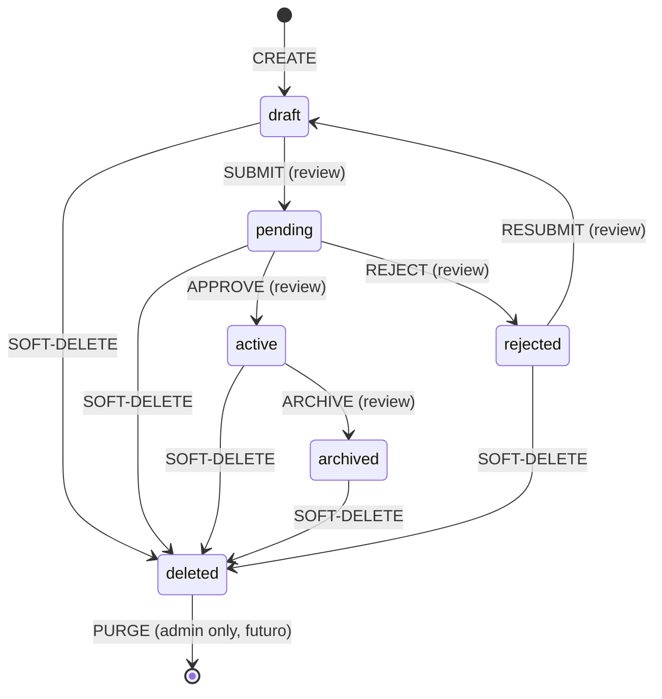
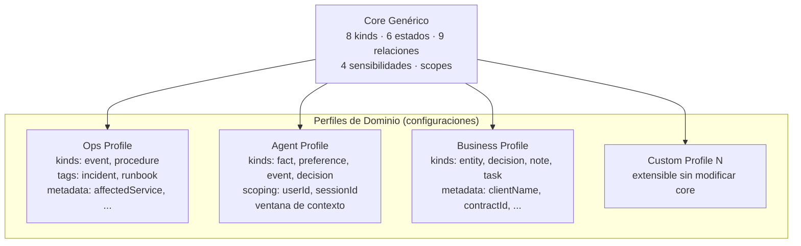
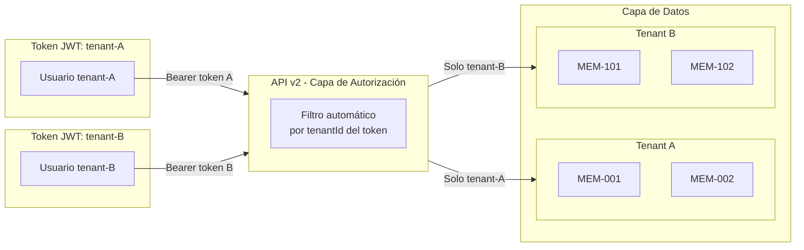
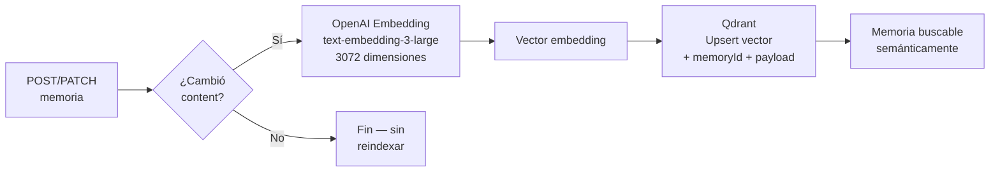
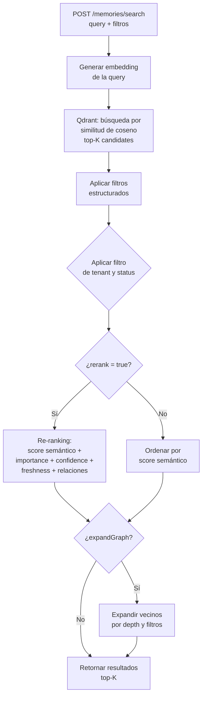
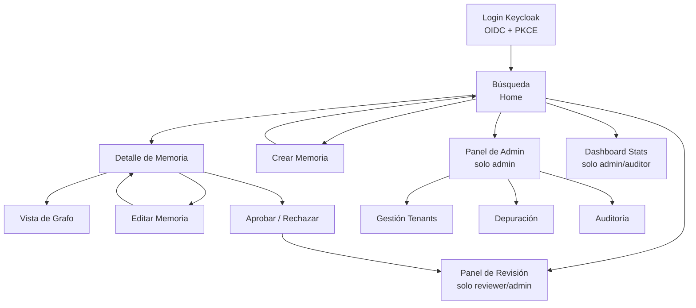

# Especificación Funcional — Abax-Memory v2.0.0
## Motor de Memoria Genérica Multi-Dominio con IA

---

## Tabla de Contenidos

1. [Resumen Ejecutivo](#1-resumen-ejecutivo)
2. [Modelo de Datos Conceptual](#2-modelo-de-datos-conceptual)
3. [Perfiles de Dominio](#3-perfiles-de-dominio)
4. [Scoping Multi-Tenant](#4-scoping-multi-tenant)
5. [API REST v2](#5-api-rest-v2)
6. [Búsqueda Semántica + Graph](#6-búsqueda-semántica--graph)
7. [Gobernanza y Trazabilidad](#7-gobernanza-y-trazabilidad)
8. [Frontend Multi-Dominio](#8-frontend-multi-dominio)
9. [English-Only Internals](#9-english-only-internals)
10. [Reglas de Negocio](#10-reglas-de-negocio)
11. [Alcance y Exclusiones](#11-alcance-y-exclusiones)
12. [Criterios de Aceptación Transversales](#12-criterios-de-aceptación-transversales)
13. [Trazabilidad de Requerimientos](#13-trazabilidad-de-requerimientos)
14. [Glosario](#glosario)

---

## 1. Resumen Ejecutivo

### 1.1 Propósito del Documento

Este documento constituye la **especificación funcional completa** de Abax-Memory v2.0.0, el motor de memoria genérica multi-dominio con inteligencia artificial. Define el **qué** del sistema — entidades, reglas, comportamientos, interfaces y restricciones — con el nivel de detalle necesario para que las fases subsiguientes de diseño técnico, implementación y verificación puedan ejecutarse sin ambigüedad.

### 1.2 Alcance del Documento

Cubre la totalidad de las **7 épicas Must** del MVP (EP-001 a EP-006, EP-009), sus 63 features asociadas y 66 historias de usuario con prioridad Must. Las épicas Should (EP-007 Batch Ingestion, EP-010 SDK Python) y Could (EP-008 Migración v1→v2) se referencian como fuera del alcance del MVP.

### 1.3 Relación con Documentos Precedentes

| Documento Fuente | Rol en esta Especificación |
|---|---|
| Visión del Producto | Reglas de negocio BR-001 a BR-010, criterios de éxito CE-01 a CE-013, restricciones R-01 a R-08 |
| Mapa de Épicas y Features | Descomposición funcional de 85+ features con priorización MoSCoW |
| Historias de Usuario | 69 historias con criterios de aceptación Given/When/Then |
| Propuesta Técnica | Modelo de datos canónico, API endpoints, perfiles de dominio, estrategia de migración |

---

## 2. Modelo de Datos Conceptual

### 2.1 Entidad Principal: MemoryFragment

`MemoryFragment` es la entidad central del sistema. Representa una unidad atómica de conocimiento — un hecho, una preferencia, un evento, una decisión, una tarea, un procedimiento, una nota o una entidad del dominio — que puede ser creada, clasificada, relacionada, buscada, versionada, auditada y gobernada a lo largo de su ciclo de vida.

#### 2.1.1 Estructura Canónica

```json
{
  "id": "MEM-xxxxxxxx",
  "kind": "fact | preference | event | decision | task | procedure | note | entity",
  "content": "texto markdown completo del conocimiento",
  "summary": "resumen conciso generado o provisto por el usuario",
  "topics": ["tag1", "tag2", "tag3"],
  "entities": ["entidad1", "entidad2"],
  "relations": [
    {
      "id": "REL-xxxxxxxx",
      "targetId": "MEM-yyyyyyyy",
      "type": "related_to | depends_on | caused_by | resolves | contradicts | supports | mentions | belongs_to | supersedes"
    }
  ],
  "metadata": { "clave": "valor" },
  "source": {
    "type": "conversation | document | api | workflow | manual | case",
    "id": "identificador-externo"
  },
  "scope": {
    "tenantId": "string (requerido)",
    "userId": "string (opcional)",
    "sessionId": "string (opcional)",
    "namespace": "string (opcional)"
  },
  "lifecycle": {
    "status": "draft | pending | active | archived | rejected | deleted",
    "confidence": 0.0,
    "importance": 0.0,
    "sensitivity": "public | internal | confidential | secret",
    "reviewedBy": "string | null",
    "reviewedAt": "ISO8601 | null",
    "reviewComment": "string | null"
  },
  "createdAt": "2026-01-01T00:00:00Z",
  "updatedAt": "2026-01-01T00:00:00Z"
}
```

#### 2.1.2 Atributos — Definiciones y Restricciones

| Atributo | Tipo | Obligatorio | Restricciones | Descripción |
|---|---|---|---|---|
| `id` | string | Automático | Formato `MEM-` + 8 caracteres alfanuméricos. Inmutable. | Identificador único global de la memoria. |
| `kind` | enum | Sí | Uno de 8 valores. Inmutable tras creación. | Clasificación primaria universal de la memoria. |
| `content` | string | Sí | Texto libre en Markdown. Mínimo 1 carácter no blanco. | Contenido semántico completo. Es la fuente para el embedding vectorial. |
| `summary` | string | No | Texto libre. Si no se provee, el sistema puede generarlo automáticamente. | Resumen conciso para presentación en listados y resultados de búsqueda. |
| `topics` | array[string] | No | Lista de tags libres. Sin límite de elementos en el MVP. | Vocabulario controlado o libre para clasificación transversal. |
| `entities` | array[string] | No | Lista de nombres de entidad. Poblado por extracción automática o manual. | Entidades nombradas mencionadas en el contenido. |
| `relations` | array[Relation] | No | Cada relation requiere `targetId` existente no `deleted`. | Conexiones tipadas y dirigidas con otras memorias. |
| `metadata` | object | No | Objeto key-value libre. Reemplazo completo en `PATCH` (no merge parcial). | Atributos específicos de dominio sin modificar el schema del core. |
| `source` | object | No | `type` debe ser uno de 6 valores. `id` es string libre. | Trazabilidad del origen del conocimiento. |
| `scope` | object | Sí | `tenantId` obligatorio. `userId`, `sessionId`, `namespace` opcionales. | Aislamiento multi-tenant y contextual. |
| `lifecycle` | object | Sí | `status` obligatorio. `confidence` en [0.0, 1.0]. `importance` en [0.0, 1.0]. `sensitivity` uno de 4 valores. | Control de madurez, visibilidad y criticidad del conocimiento. |
| `createdAt` | datetime | Automático | ISO 8601 UTC. Inmutable. | Timestamp de creación. |
| `updatedAt` | datetime | Automático | ISO 8601 UTC. Actualizado en cada mutación. | Timestamp de última modificación. |

### 2.2 Tipos de Memoria (`kind`)

Los 8 tipos universales de memoria constituyen la clasificación primaria. Son inmutables una vez creada la memoria y están definidos a nivel de sistema, no por perfil de dominio.

| Kind | Definición | Ejemplo | Cardinalidad de uso |
|---|---|---|---|
| `fact` | Hecho objetivo y verificable | "El servicio `payment-api` corre en el puerto 8080" | Uso universal. Perfil Agent: hechos sobre el usuario. |
| `preference` | Preferencia subjetiva de un usuario o entidad | "El usuario prefiere respuestas en español y tono formal" | Predominante en perfil Agent. |
| `event` | Algo que ocurrió en un momento específico | "Despliegue v1.2.0 a producción el 2026-04-15 a las 14:30 UTC" | Perfil Ops: incidentes, despliegues. |
| `decision` | Decisión documentada con contexto | "Se eligió PostgreSQL sobre MySQL por soporte de JSONB y particionamiento" | Perfil Business: acuerdos, contratos. |
| `task` | Tarea o acción pendiente o completada | "Migrar registros DNS a Cloudflare antes del 2026-06-01" | Perfil Business: compromisos, acciones. |
| `procedure` | Pasos reutilizables o instrucciones | "Procedimiento de restauración de backup: 1) Detener servicio, 2) Ejecutar pg_restore..." | Perfil Ops: runbooks, playbooks. |
| `note` | Conocimiento libre sin estructura predefinida | "Observaciones de la reunión de arquitectura del 2026-05-01" | Perfil Business: minutas, notas de reunión. |
| `entity` | Representación de una persona, organización, sistema o concepto | "Cliente: Acme Corp, contrato CTR-2026-001" | Perfil Business: clientes, empresas. |

### 2.3 Ciclo de Vida (`lifecycle.status`)

#### 2.3.1 Estados

| Estado | Significado | Visibilidad en búsqueda por defecto | Quién puede ver |
|---|---|---|---|
| `draft` | Borrador en elaboración. No listo para consumo. | No visible | `memory-operator` (propio), `memory-reviewer`, `memory-admin`, `memory-auditor` |
| `pending` | Enviado a revisión. Esperando aprobación o rechazo. | No visible | `memory-operator` (propio), `memory-reviewer`, `memory-admin`, `memory-auditor` |
| `active` | Aprobado y publicado. Visible para todos los consumidores. | **Sí, visible** | Todos los roles |
| `archived` | Archivado por obsolescencia. Fuera de circulación activa. | No visible | `memory-admin`, `memory-auditor` |
| `rejected` | Rechazado en revisión. Requiere iteración del creador. | No visible | `memory-operator` (propio), `memory-reviewer`, `memory-admin`, `memory-auditor` |
| `deleted` | Soft-delete. No visible en ninguna búsqueda estándar. | No visible | Solo `memory-admin` mediante endpoint administrativo |

#### 2.3.2 Máquina de Estados — Transiciones Permitidas



#### 2.3.3 Transiciones Prohibidas

| Transición | Razón del bloqueo |
|---|---|
| `active → draft` | BR-005. El conocimiento aprobado no puede volver a borrador. Usar `supersedes` para crear nueva versión y archivar la anterior. |
| `archived → active` | El conocimiento archivado debe crear una nueva versión vía `supersedes` si se requiere reactivar. |
| `rejected → active` | Debe pasar por `draft` para que el creador itere y luego reenvíe a `pending`. |
| `deleted → cualquier estado` | El soft-delete es irreversible sin intervención administrativa de purga. |

### 2.4 Niveles de Sensibilidad (`lifecycle.sensitivity`)

| Nivel | Significado | Impacto en visibilidad |
|---|---|---|
| `public` | Conocimiento público sin restricciones. | Visible para todos los roles. |
| `internal` | Uso interno de la organización. Default sin perfil. | Visible dentro del tenant. |
| `confidential` | Información confidencial. Requiere revisión si `importance >= 0.7`. | Visible solo para roles con permisos elevados. |
| `secret` | Información secreta. Máxima restricción. Siempre requiere revisión si `importance >= 0.7`. | Visible solo para `memory-admin` y `memory-auditor`. |

### 2.5 Relaciones (`relations`)

#### 2.5.1 Modelo de Relación

Cada relación conecta una memoria origen (`sourceId`) con una memoria destino (`targetId`) mediante un tipo semántico. Las relaciones se almacenan como parte del array `relations` en la memoria origen y son navegables en ambas direcciones mediante el grafo.

```json
{
  "id": "REL-xxxxxxxx",
  "targetId": "MEM-yyyyyyyy",
  "type": "related_to | depends_on | caused_by | resolves | contradicts | supports | mentions | belongs_to | supersedes",
  "createdAt": "2026-01-01T00:00:00Z"
}
```

#### 2.5.2 Tipos de Relación

| Tipo | Direccionalidad | Semántica | Ejemplo |
|---|---|---|---|
| `related_to` | Bidireccional | Conexión genérica sin dirección específica | Un incidente está relacionado con un runbook |
| `depends_on` | Dirigida (A → B) | A depende de B para existir o tener sentido | Una decisión depende de un hecho |
| `caused_by` | Dirigida (A → B) | A fue causado o provocado por B | Un incidente fue causado por un despliegue |
| `resolves` | Dirigida (A → B) | A resuelve o soluciona B | Un procedimiento resuelve un incidente |
| `contradicts` | Bidireccional | A contradice o es incompatible con B | Dos hechos que se contradicen entre sí |
| `supports` | Dirigida (A → B) | A respalda, apoya o justifica B | Un hecho respalda una decisión |
| `mentions` | Dirigida (A → B) | A menciona o referencia a la entidad B | Una nota menciona a un cliente |
| `belongs_to` | Dirigida (A → B) | A pertenece al grupo, colección o categoría B | Una nota de reunión pertenece a un cliente |
| `supersedes` | Dirigida (A → B) | A reemplaza o es una versión más reciente que B | Una nueva versión de un procedimiento reemplaza la anterior |

#### 2.5.3 Reglas de Creación de Relaciones

- El `targetId` debe corresponder a una memoria existente en el sistema.
- El `targetId` no puede estar en estado `deleted` (BR-007).
- El `type` debe ser uno de los 9 valores del enum.
- No se permiten relaciones duplicadas (mismo `sourceId` + `targetId` + `type`).
- Las relaciones auto-referenciadas (`sourceId == targetId`) no están permitidas.

#### 2.5.4 Reglas de Eliminación de Relaciones

- La eliminación es definitiva (no soft-delete a nivel de relación).
- Se registra en auditoría: quién eliminó, cuándo y cuál era la relación.
- Si una memoria es soft-deleteada, sus relaciones se preservan pero quedan huérfanas (el target `deleted` no se expande en grafo).

### 2.6 Entidades Extraídas (`entities`)

El sistema extrae entidades nombradas del contenido de las memorias mediante un proceso de NLP (Natural Language Processing). Las entidades se almacenan como strings en el array `entities` de cada memoria y también se indexan globalmente para búsqueda y navegación.

#### 2.6.1 Extracción de Entidades

- **Endpoint**: `POST /api/v2/memories/extract`
- **Input**: `{ "content": "texto libre" }`
- **Output**: `{ "entities": [ { "name": "Kubernetes", "type": "technology" }, ... ] }`
- **Comportamiento**: No persiste nada. Solo analiza el texto y retorna las entidades detectadas.
- **Sin entidades**: Si el texto no contiene entidades reconocibles, retorna array vacío `[]`.

#### 2.6.2 Búsqueda de Entidades

- **Endpoint**: `GET /api/v2/entities?q=<nombre_parcial>`
- **Output**: Lista de entidades que coinciden con el término de búsqueda, cada una con `memoryCount`.
- **Endpoint de detalle**: `GET /api/v2/entities/{name}`
- **Output**: Entidad con `memoryCount` y array de `memoryIds` vinculados (con `kind` y `summary` de cada memoria).

### 2.7 Modelo de `source`

| Campo | Tipo | Obligatorio | Valores permitidos |
|---|---|---|---|
| `source.type` | enum | No | `conversation`, `document`, `api`, `workflow`, `manual`, `case` |
| `source.id` | string | No | Identificador externo libre |

- Si `source` no se especifica, el campo queda `null`.
- `source.type` con valor no permitido → `HTTP 400 VALIDATION_ERROR`.

### 2.8 Modelo de `metadata`

- Campo libre tipo objeto key-value.
- No tiene schema predefinido a nivel de core.
- Los perfiles de dominio definen campos sugeridos (ej. `affectedService`, `clientName`, `contractId`).
- Actualización mediante `PATCH` reemplaza el objeto completo (no merge parcial).
- No afecta el ranking semántico ni la indexación vectorial.

### 2.9 Modelo de `confidence`

- Rango: `[0.0, 1.0]`.
- Refleja el nivel de certeza sobre la corrección de la memoria.
- Valor por defecto: `0.5` sin perfil, o el `defaultConfidence` del perfil activo (BR-009).
- Si no se especifica al crear, el sistema aplica el default del perfil.
- Valores fuera de rango → `HTTP 400 VALIDATION_ERROR`.

### 2.10 Scope

Ver sección completa en [§4. Scoping Multi-Tenant](#4-scoping-multi-tenant).

---

## 3. Perfiles de Dominio

### 3.1 Principio de Diseño

El core del motor de memoria es genérico. Cualquier especialización semántica para un dominio específico (IT Operations, memoria conversacional, CRM/Legal/Finanzas) se logra mediante **perfiles de dominio** que actúan como capas de configuración sobre el core, sin modificar la API base ni requerir código custom.

Arquitectura de perfiles:



### 3.2 Estructura de un Perfil

Cada perfil se define como una configuración (JSON/YAML o registro en base de datos) con la siguiente estructura:

```json
{
  "name": "string (requerido, único)",
  "version": "1.0",
  "description": "Descripción del perfil y su propósito",
  "recommendedKinds": ["fact", "event"],
  "defaultImportance": 0.7,
  "defaultConfidence": 0.5,
  "defaultSensitivity": "internal",
  "suggestedTags": ["tag1", "tag2"],
  "suggestedTopics": ["topic1", "topic2"],
  "extraMetadataFields": [
    { "name": "clientName", "type": "string", "label": "Nombre del Cliente" },
    { "name": "contractId", "type": "string", "label": "ID de Contrato" }
  ],
  "lifecycleDefaults": {
    "initialStatus": "draft",
    "requireReviewThreshold": { "importance": 0.7, "sensitivities": ["confidential", "secret"] }
  }
}
```

### 3.3 Herencia del Core Genérico

Todo perfil **hereda automáticamente** del core genérico. Esto significa:

| Herencia | Comportamiento |
|---|---|
| Los 8 kinds del core | Siempre están disponibles, incluso si el perfil solo recomienda 3. |
| Los 6 estados de ciclo de vida | Todos los estados y transiciones aplican a cualquier perfil. |
| Los 9 tipos de relación | Cualquier tipo de relación puede usarse independientemente del perfil. |
| Los 4 niveles de sensibilidad | El perfil puede sugerir defaults pero no restringir valores. |

**Regla**: Un perfil **nunca restringe** las capacidades del core. Solo **especializa recomendaciones, defaults y vocabulario**.

### 3.4 Perfil Ops (IT Operations)

**Propósito**: Adaptar el motor para equipos de SRE, DevOps y soporte técnico.

| Aspecto | Configuración |
|---|---|
| **Kinds principales** | `event` (incidentes, alertas, despliegues), `procedure` (runbooks, playbooks) |
| **Tags sugeridos** | `incident`, `runbook`, `alert`, `maintenance`, `postmortem`, `deployment` |
| **Topics sugeridos** | `networking`, `database`, `kubernetes`, `monitoring`, `security` |
| **Metadatos extra** | `affectedService`, `remediationSteps`, `rootCause`, `incidentSeverity`, `downtimeMinutes` |
| **Default importance** | `0.7` (equivalente al concepto de `criticality` del dominio ops) |
| **Default sensitivity** | `internal` |
| **Relaciones dominantes** | `caused_by` (incidente causado por despliegue), `resolves` (runbook resuelve incidente), `related_to` |
| **Mapeo conceptual** | `lifecycle.importance` ↔ `criticality` |

### 3.5 Perfil Agent (Conversational Memory)

**Propósito**: Adaptar el motor para agentes IA conversacionales, chatbots y asistentes.

| Aspecto | Configuración |
|---|---|
| **Kinds principales** | `fact` (hechos sobre el usuario), `preference` (preferencias), `event` (interacciones pasadas), `decision` (decisiones previas) |
| **Tags sugeridos** | `user-fact`, `user-preference`, `session-context`, `decision-history` |
| **Topics sugeridos** | `personal-info`, `communication-style`, `task-history`, `tool-usage` |
| **Metadatos extra** | `interactionType`, `turnNumber`, `contextWindow`, `agentName` |
| **Default importance** | `0.5` |
| **Default sensitivity** | `confidential` (datos personales de conversación) |
| **Scoping** | Intensivo en `scope.userId` y `scope.sessionId`. Esencial para aislar contexto entre sesiones. |
| **Priorización** | Resultados ordenados por `importance` descendente para optimizar la ventana de contexto del agente. |

### 3.6 Perfil Business (CRM / Legal / Finanzas / Producto)

**Propósito**: Adaptar el motor para entornos corporativos de relación con clientes, gestión legal, finanzas y producto.

| Aspecto | Configuración |
|---|---|
| **Kinds principales** | `entity` (cliente, empresa, producto), `decision` (acuerdo, contrato), `note` (minuta de reunión), `task` (acción, compromiso) |
| **Tags sugeridos** | `client`, `contract`, `meeting`, `opportunity`, `proposal`, `invoice` |
| **Topics sugeridos** | `sales`, `legal`, `finance`, `product`, `support` |
| **Metadatos extra** | `clientName`, `contractId`, `opportunityValue`, `meetingDate`, `attendees`, `dealStage` |
| **Default importance** | `0.5` |
| **Default sensitivity** | `internal` |
| **Relaciones dominantes** | `belongs_to` (nota pertenece a cliente), `related_to` (oportunidad relacionada con cliente), `supports` (hecho respalda decisión), `supersedes` (nueva versión de contrato reemplaza anterior) |

### 3.7 Extensibilidad para Nuevos Perfiles

La arquitectura de perfiles permite agregar nuevos dominios (salud, educación, logística, etc.) como configuraciones adicionales **sin modificar el código del core ni la API base**. Los requisitos para un nuevo perfil son:

1. Definir configuración JSON con `name`, `recommendedKinds`, `suggestedTags`, `extraMetadataFields`, defaults.
2. Registrar el perfil en el sistema (POST al endpoint de perfiles o inserción en BD).
3. El perfil queda inmediatamente disponible para los usuarios, sin deploy.

---

## 4. Scoping Multi-Tenant

### 4.1 Modelo de Scope

El modelo `scope` es el mecanismo de aislamiento de datos que permite que múltiples tenants, usuarios y sesiones coexistan en un mismo despliegue sin riesgo de fuga de información.

```json
{
  "scope": {
    "tenantId": "string (REQUERIDO)",
    "userId": "string (opcional, recomendado)",
    "sessionId": "string (opcional)",
    "namespace": "string (opcional)"
  }
}
```

### 4.2 Reglas de Scope

| ID | Regla | Descripción |
|---|---|---|
| **SC-01** | `tenantId` obligatorio en escritura | Toda creación de memoria requiere `scope.tenantId`. Sin él, `HTTP 400 VALIDATION_ERROR`. (BR-003) |
| **SC-02** | `tenantId` mínimo requerido | `scope: { tenantId: "tenant-A" }` es el payload mínimo aceptable para crear una memoria. |
| **SC-03** | Aislamiento estricto por tenant | Un usuario del tenant A nunca ve memorias del tenant B. Las búsquedas y consultas filtran automáticamente por el `tenantId` del token JWT. (BR-004) |
| **SC-04** | 404 por tenant equivocado | Si un usuario del tenant A intenta acceder a `GET /memories/{id-de-tenant-B}`, el sistema retorna `HTTP 404` (no revela la existencia de la memoria en otro tenant). |
| **SC-05** | `userId` opcional pero recomendado | Permite acotar memorias a un usuario específico dentro de un tenant. Esencial para el perfil Agent. |
| **SC-06** | `sessionId` para contexto de sesión | Permite aislar memorias de una sesión conversacional. Fundamental para agentes con múltiples sesiones simultáneas. |
| **SC-07** | `namespace` como subdivisión libre | Campo de texto libre para subdivisiones arbitrarias (por proyecto, departamento, cliente final) sin crear tenants separados. |
| **SC-08** | Filtrado automático en lectura | Toda operación de lectura aplica automáticamente el filtro de `tenantId` del token. El consumidor no necesita especificarlo. Si lo especifica, solo puede restringir (nunca ampliar) el scope del token. (FT-003.07) |
| **SC-09** | Cross-tenant access para admin | `memory-admin` con permisos explícitos puede consultar y operar cross-tenant. Toda operación cross-tenant queda registrada en auditoría. |
| **SC-10** | Índices por `tenantId` | PostgreSQL debe tener índices particionados por `scope.tenantId` para garantizar rendimiento en búsquedas multi-tenant. |

### 4.3 Diagrama de Aislamiento



### 4.4 Escenarios de Uso de Scope

| Escenario | Configuración de Scope | Ejemplo |
|---|---|---|
| SaaS multi-empresa | `tenantId` por empresa | `tenantId: "acme-corp"`, `tenantId: "globex-inc"` |
| Usuario individual dentro de empresa | `tenantId` + `userId` | `tenantId: "acme-corp"`, `userId: "juan@acme.com"` |
| Sesión de chat de agente IA | `tenantId` + `userId` + `sessionId` | `tenantId: "acme-corp"`, `userId: "user-42"`, `sessionId: "sess-abc123"` |
| Proyecto dentro de tenant | `tenantId` + `namespace` | `tenantId: "acme-corp"`, `namespace: "project-phoenix"` |

---

## 5. API REST v2

### 5.1 Principios de Diseño

- **English-Only**: todos los paths, query params, enums, códigos de error y nombres de campos en inglés (BR-010, R-04).
- **API-first**: el frontend y los SDKs son consumidores de la API, no componentes acoplados (R-06).
- **Autenticación centralizada**: Keycloak OIDC como único mecanismo de autenticación y autorización (R-07).
- **v1 descartada**: solo existe `/api/v2/`. No hay coexistencia ni backward compatibility (R-05).

### 5.2 Tabla de Endpoints

#### 5.2.1 CRUD de Memorias

| Método | Path | Propósito | Auth requerida | Roles permitidos |
|---|---|---|---|---|
| `POST` | `/api/v2/memories` | Crear una memoria | Bearer JWT | `memory-operator`, `memory-reviewer`, `memory-admin` |
| `GET` | `/api/v2/memories/{id}` | Obtener detalle completo | Bearer JWT | Todos |
| `PATCH` | `/api/v2/memories/{id}` | Actualizar contenido/metadatos | Bearer JWT | `memory-operator` (propio), `memory-admin` |
| `DELETE` | `/api/v2/memories/{id}` | Soft-delete | Bearer JWT | `memory-operator` (propio), `memory-admin` |

#### 5.2.2 Búsqueda y Grafo

| Método | Path | Propósito | Auth requerida | Roles permitidos |
|---|---|---|---|---|
| `POST` | `/api/v2/memories/search` | Búsqueda semántica + filtros + graph expand | Bearer JWT | Todos |
| `GET` | `/api/v2/memories/{id}/graph?depth=N` | Expandir subgrafo alrededor de una memoria | Bearer JWT | Todos |

#### 5.2.3 Relaciones

| Método | Path | Propósito | Auth requerida | Roles permitidos |
|---|---|---|---|---|
| `POST` | `/api/v2/memories/{id}/relations` | Crear relación tipada | Bearer JWT | `memory-operator`, `memory-admin` |
| `DELETE` | `/api/v2/memories/{id}/relations/{relId}` | Eliminar relación | Bearer JWT | `memory-operator` (propio), `memory-admin` |

#### 5.2.4 Ciclo de Vida

| Método | Path | Propósito | Auth requerida | Roles permitidos |
|---|---|---|---|---|
| `POST` | `/api/v2/memories/{id}/review` | Cambiar estado (approve/reject/archive/submit) | Bearer JWT | `memory-reviewer`, `memory-admin` |

#### 5.2.5 Entidades

| Método | Path | Propósito | Auth requerida | Roles permitidos |
|---|---|---|---|---|
| `POST` | `/api/v2/memories/extract` | Extraer entidades de texto sin persistir | Bearer JWT | Todos |
| `GET` | `/api/v2/entities?q=...` | Buscar entidades por nombre | Bearer JWT | Todos |
| `GET` | `/api/v2/entities/{name}` | Detalle de entidad con memorias vinculadas | Bearer JWT | Todos |

#### 5.2.6 Batch Ingestion (Should — fuera del MVP)

| Método | Path | Propósito | Auth requerida | Roles permitidos |
|---|---|---|---|---|
| `POST` | `/api/v2/memories/ingest` | Batch ingest atómico (máx 100) | Bearer JWT | `memory-operator`, `memory-admin` |

#### 5.2.7 Administración y Monitoreo

| Método | Path | Propósito | Auth requerida | Roles permitidos |
|---|---|---|---|---|
| `GET` | `/api/v2/scopes/{tenantId}/stats` | Estadísticas agregadas del tenant | Bearer JWT | `memory-admin`, `memory-auditor` |
| `GET` | `/api/v2/health` | Health check de dependencias | Bearer JWT (opcional) | Todos (o público configurable) |
| `GET` | `/api/v2/metrics` | Métricas Prometheus | Bearer JWT | `memory-admin` |
| `GET` | `/api/v2/openapi.json` | Especificación OpenAPI 3.x | Sin auth | Público |

### 5.3 Formato de Request/Response

#### 5.3.1 Crear Memoria

**Request**:
```json
POST /api/v2/memories
Content-Type: application/json
Authorization: Bearer <jwt>

{
  "kind": "fact",
  "content": "El servicio payment-api corre en el puerto 8080 y requiere Java 17",
  "summary": "Configuración de payment-api — puerto y runtime",
  "topics": ["payment", "infrastructure", "configuration"],
  "entities": ["payment-api", "Java 17"],
  "metadata": {
    "affectedService": "payment-api",
    "environment": "production"
  },
  "source": {
    "type": "manual",
    "id": "wiki-page-42"
  },
  "scope": {
    "tenantId": "acme-corp",
    "userId": "juan@acme.com"
  },
  "lifecycle": {
    "confidence": 0.95,
    "importance": 0.8,
    "sensitivity": "internal"
  }
}
```

**Response (201 Created)**:
```json
{
  "id": "MEM-a1b2c3d4",
  "kind": "fact",
  "content": "El servicio payment-api corre en el puerto 8080 y requiere Java 17",
  "summary": "Configuración de payment-api — puerto y runtime",
  "topics": ["payment", "infrastructure", "configuration"],
  "entities": ["payment-api", "Java 17"],
  "relations": [],
  "metadata": {
    "affectedService": "payment-api",
    "environment": "production"
  },
  "source": {
    "type": "manual",
    "id": "wiki-page-42"
  },
  "scope": {
    "tenantId": "acme-corp",
    "userId": "juan@acme.com"
  },
  "lifecycle": {
    "status": "active",
    "confidence": 0.95,
    "importance": 0.8,
    "sensitivity": "internal",
    "reviewedBy": null,
    "reviewedAt": null,
    "reviewComment": null
  },
  "createdAt": "2026-05-03T14:30:00Z",
  "updatedAt": "2026-05-03T14:30:00Z"
}
```

#### 5.3.2 Búsqueda Semántica

**Request**:
```json
POST /api/v2/memories/search
Content-Type: application/json
Authorization: Bearer <jwt>

{
  "query": "¿cómo restaurar la base de datos después de una caída?",
  "topK": 10,
  "filters": {
    "kinds": ["procedure", "event"],
    "statuses": ["active"],
    "topics": ["database", "recovery"],
    "importance": { "gte": 0.5 },
    "confidence": { "gte": 0.9 },
    "sensitivities": ["internal", "public"],
    "createdAfter": "2025-01-01",
    "createdBefore": "2026-12-31"
  },
  "expandGraph": {
    "depth": 1,
    "includeKinds": ["entity", "fact"]
  },
  "rerank": true
}
```

**Response (200 OK)**:
```json
{
  "results": [
    {
      "memoryId": "MEM-x1y2z3a4",
      "kind": "procedure",
      "summary": "Procedimiento de restauración de backup de PostgreSQL",
      "content": "1) Detener servicio\n2) Ejecutar pg_restore...",
      "score": 0.92,
      "lifecycle": {
        "status": "active",
        "importance": 0.9,
        "confidence": 0.95,
        "sensitivity": "internal"
      },
      "topics": ["database", "recovery", "postgresql"],
      "entities": ["PostgreSQL", "pg_restore"],
      "relations": [
        {
          "id": "REL-b5c6d7e8",
          "targetId": "MEM-f9g0h1i2",
          "type": "resolves",
          "targetSummary": "Caída de base de datos en producción — 2026-04-20"
        }
      ]
    }
  ],
  "totalResults": 1,
  "queryTimeMs": 320
}
```

#### 5.3.3 Revisión de Estado

**Request**:
```json
POST /api/v2/memories/MEM-a1b2c3d4/review
Content-Type: application/json
Authorization: Bearer <jwt>

{
  "action": "approve",
  "comment": "Contenido verificado contra la configuración real del servicio. Correcto."
}
```

**Response (200 OK)**:
```json
{
  "memoryId": "MEM-a1b2c3d4",
  "previousStatus": "pending",
  "newStatus": "active",
  "reviewedBy": "revisor@acme.com",
  "reviewedAt": "2026-05-03T15:00:00Z",
  "reviewComment": "Contenido verificado contra la configuración real del servicio. Correcto."
}
```

#### 5.3.4 Extracción de Entidades

**Request**:
```json
POST /api/v2/memories/extract
Content-Type: application/json
Authorization: Bearer <jwt>

{
  "content": "El servicio Kubernetes en AWS falló tras el despliegue de Jenkins"
}
```

**Response (200 OK)**:
```json
{
  "entities": [
    { "name": "Kubernetes", "type": "technology" },
    { "name": "AWS", "type": "platform" },
    { "name": "Jenkins", "type": "tool" }
  ]
}
```

#### 5.3.5 Expansión de Grafo

**Request**: `GET /api/v2/memories/MEM-a1b2c3d4/graph?depth=2&includeKinds=entity,fact`

**Response (200 OK)**:
```json
{
  "root": {
    "memoryId": "MEM-a1b2c3d4",
    "kind": "decision",
    "summary": "Migrar a PostgreSQL 16"
  },
  "nodes": [
    { "memoryId": "MEM-x1y2z3a4", "kind": "fact", "summary": "PostgreSQL 15 EOL 2025-11" },
    { "memoryId": "MEM-b5c6d7e8", "kind": "entity", "summary": "Cliente: Database Cluster prod" }
  ],
  "edges": [
    { "sourceId": "MEM-a1b2c3d4", "targetId": "MEM-x1y2z3a4", "type": "depends_on" },
    { "sourceId": "MEM-a1b2c3d4", "targetId": "MEM-b5c6d7e8", "type": "belongs_to" }
  ],
  "depth": 2
}
```

### 5.4 Códigos de Error Estandarizados

| HTTP Status | `errorCode` | Significado | Cuándo ocurre |
|---|---|---|---|
| 400 | `INVALID_JSON` | JSON malformado en el body | El payload no es JSON válido |
| 400 | `VALIDATION_ERROR` | Fallo en validación de schema | Campos requeridos ausentes, tipos incorrectos, enums inválidos |
| 400 | `INVALID_REQUEST_BODY` | Body no cumple el schema | Campos desconocidos en modo estricto |
| 400 | `BATCH_SIZE_EXCEEDED` | Batch excede 100 memorias | `POST /memories/ingest` con más de 100 elementos |
| 401 | `UNAUTHORIZED` | Token ausente o inválido | Sin header `Authorization` o token expirado/inválido |
| 403 | `FORBIDDEN` | Sin permisos para la operación | Rol no autorizado para el endpoint |
| 404 | `NOT_FOUND` | Recurso no encontrado | `memoryId` inexistente o perteneciente a otro tenant |
| 404 | `TARGET_NOT_FOUND` | Target de relación no existe | Relación a `targetId` inexistente o `deleted` |
| 415 | `UNSUPPORTED_MEDIA_TYPE` | Content-Type no soportado | No es `application/json` |
| 422 | `UNPROCESSABLE_ENTITY` | Transición de estado no permitida | `active → draft`, `rejected → active`, etc. |
| 429 | `RATE_LIMIT_EXCEEDED` | Límite de tasa excedido | Demasiadas requests por tenant/usuario |
| 500 | `INTERNAL_ERROR` | Error interno del servidor | Fallo no esperado |
| 503 | `DATABASE_UNAVAILABLE` | Base de datos no disponible | PostgreSQL o Qdrant inaccesibles |

**Formato estándar de cuerpo de error**:
```json
{
  "errorCode": "VALIDATION_ERROR",
  "message": "Validation failed for field 'kind': must be one of [fact, preference, event, decision, task, procedure, note, entity]",
  "details": [
    {
      "field": "kind",
      "error": "must be one of: fact, preference, event, decision, task, procedure, note, entity"
    }
  ]
}
```

### 5.5 Validación de Request Bodies

- **Modo estricto**: campos desconocidos en el payload son rechazados con `HTTP 400 INVALID_REQUEST_BODY`.
- **Validación de tipos**: `importance` debe ser float, no string. `kind` debe ser uno de los 8 valores del enum.
- **Validación de rangos**: `confidence` e `importance` en [0.0, 1.0].
- **Campos inmutables**: `kind` no puede modificarse tras creación. `id` nunca se acepta en requests de creación.

### 5.6 Rate Limiting

| Dimensión | Default | Configurable |
|---|---|---|
| Requests por minuto por tenant | 1000 | Sí, por tenant |
| Requests por minuto por usuario | 300 | Sí, por tenant |
| Burst máximo | 5x el rate base | No |
| Header informativo | `X-RateLimit-Remaining`, `Retry-After` | — |

Cuando se excede el límite: `HTTP 429` con `Retry-After` en segundos.

### 5.7 Autenticación y Autorización

#### 5.7.1 Flujo OIDC

1. El usuario se autentica contra Keycloak (Authorization Code Flow + PKCE para frontend, Client Credentials para integraciones server-to-server).
2. Keycloak emite un JWT con claims: `sub`, `tenantId`, `roles` (realm_access), `preferred_username`.
3. Toda request a `/api/v2/` debe incluir `Authorization: Bearer <jwt>`.
4. El backend valida firma, expiración y claims del token en cada request.
5. El `tenantId` y `roles` del token determinan el alcance de datos y operaciones permitidas.

#### 5.7.2 Matriz de Permisos RBAC

| Operación | `api-consumer` | `memory-operator` | `memory-reviewer` | `memory-admin` | `memory-auditor` |
|---|---|---|---|---|---|
| Buscar memorias (`active`) | ✅ | ✅ | ✅ | ✅ | ✅ |
| Buscar memorias (`pending`, `draft`) | ❌ | ✅ (propias) | ✅ | ✅ | ✅ |
| Ver detalle de memoria | ✅ (active) | ✅ | ✅ | ✅ | ✅ |
| Crear memoria | ❌ | ✅ | ✅ | ✅ | ❌ |
| Actualizar memoria | ❌ | ✅ (propias) | ✅ (propias) | ✅ | ❌ |
| Soft-delete memoria | ❌ | ✅ (propias) | ❌ | ✅ | ❌ |
| Crear relación | ❌ | ✅ | ✅ | ✅ | ❌ |
| Eliminar relación | ❌ | ✅ (propias) | ❌ | ✅ | ❌ |
| Revisar (approve/reject) | ❌ | ❌ | ✅ | ✅ | ❌ |
| Ver estadísticas de tenant | ❌ | ❌ | ❌ | ✅ | ✅ |
| Ver logs de auditoría | ❌ | ❌ | ❌ | ✅ | ✅ |
| Cross-tenant access | ❌ | ❌ | ❌ | ✅ | ❌ |
| Health check / Métricas | ❌ | ❌ | ❌ | ✅ | ❌ |

### 5.8 Documentación OpenAPI

- **Endpoint**: `GET /api/v2/openapi.json`
- **Formato**: OpenAPI 3.x
- **Contenido**: todos los endpoints, schemas de request/response, códigos de error, ejemplos y requisitos de autenticación.
- **Actualización**: en tiempo real (generado del código, no archivo estático).

---

## 6. Búsqueda Semántica + Graph

### 6.1 Flujo de Indexación



**Condiciones de reindexación**:
- **Creación** (`POST`): siempre genera embedding.
- **Actualización** (`PATCH`): solo regenera embedding si `content` cambió. Cambios en `metadata`, `topics`, `summary` no disparan reindexación.
- **Soft-delete**: el vector se preserva en Qdrant pero la memoria se excluye de resultados por el filtro de `status`.

### 6.2 Flujo de Búsqueda (Search)



### 6.3 Filtros Estructurados Multidimensionales

El endpoint `POST /memories/search` soporta filtros simultáneos en las siguientes dimensiones:

| Dimensión | Campo en `filters` | Tipo | Operadores |
|---|---|---|---|
| Scopes | `scopes.tenantId`, `scopes.userId`, `scopes.sessionId`, `scopes.namespace` | string | Igualdad exacta |
| Kinds | `kinds` | array[enum] | IN |
| Estados | `statuses` | array[enum] | IN |
| Topics | `topics` | array[string] | IN (AND lógico entre topics) |
| Entidades | `entities` | array[string] | IN |
| Importancia | `importance` | object `{gte, lte}` | Rango numérico |
| Confianza | `confidence` | object `{gte, lte}` | Rango numérico |
| Sensibilidad | `sensitivities` | array[enum] | IN |
| Fecha creación | `createdAfter`, `createdBefore` | ISO 8601 | Rango de fechas |

**Comportamiento**:
- Todos los filtros aplicados se combinan con AND lógico.
- Si un filtro no se especifica, no restringe resultados.
- El filtro de `statuses` tiene default `["active"]` (BR-001), aplicado siempre a menos que el usuario especifique otro valor y tenga permisos.
- El filtro de `scopes.tenantId` se aplica automáticamente desde el token y no puede ser ampliado por el usuario (solo restringido).

### 6.4 Expansión de Subgrafo (`expandGraph`)

| Parámetro | Tipo | Default | Descripción |
|---|---|---|---|
| `expandGraph.depth` | integer | 1 | Profundidad de expansión (1 = vecinos directos, 2 = vecinos de vecinos, ...). Límite máximo configurable (default 5). |
| `expandGraph.includeKinds` | array[enum] | null (todos) | Filtrar vecinos expandidos por kind. |

**Comportamiento**:
- Cada resultado de búsqueda incluye un array `relations` con los vecinos expandidos.
- Los nodos en estado `deleted` se omiten del grafo expandido.
- La expansión respeta los permisos de visibilidad del usuario (un `api-consumer` no ve vecinos en `draft` aunque estén conectados).

### 6.5 Re-Ranking (`rerank`)

Cuando `rerank: true`, el sistema aplica una segunda pasada de scoring sobre los resultados crudos de Qdrant. El score final es una combinación ponderada de:

| Señal | Peso aprox. | Descripción |
|---|---|---|
| Score semántico (Qdrant) | 0.50 | Similitud de coseno entre query y documento |
| `lifecycle.importance` | 0.20 | Importancia declarada de la memoria |
| `lifecycle.confidence` | 0.15 | Nivel de certeza sobre la corrección |
| Frescura (`updatedAt`) | 0.10 | Memorias más recientes tienen ventaja |
| Riqueza de relaciones | 0.05 | Número de conexiones en el grafo |

**Nota**: Los pesos exactos son configurables y deben documentarse en el ADR correspondiente durante la fase de diseño técnico. Los valores aquí expresados son una guía funcional.

### 6.6 Scoring Transparente

- Cada resultado de búsqueda incluye el campo `score` (0.0 a 1.0).
- Si `rerank: false`, el score es la similitud de coseno cruda de Qdrant.
- Si `rerank: true`, el score es el resultado del scoring combinado.
- El score es reproducible: misma query + mismos datos = mismos scores.
- El score es trazable para auditoría de calidad de búsqueda.

### 6.7 Multi-Hop Traversal (Should — fuera del MVP)

La capacidad de realizar consultas que siguen múltiples saltos de relaciones (ej. "todas las decisiones que dependen de eventos causados por incidentes del servicio X") se implementa mediante `expandGraph` con profundidad > 1 y filtros por tipo de relación y kind. Esta funcionalidad se clasifica como **Should** para el MVP.

### 6.8 Re-Indexación Masiva (Should — fuera del MVP)

Capacidad administrativa (`memory-admin`) de regenerar embeddings para todas las memorias de un tenant o del repositorio completo. Necesaria tras cambios de motor de embeddings. Se clasifica como **Should**.

---

## 7. Gobernanza y Trazabilidad

### 7.1 Auditoría Completa de Mutaciones

Toda operación de escritura genera un registro de auditoría inmutable. Esto incluye: creación, modificación, cambio de estado, soft-delete, creación de relación y eliminación de relación.

#### 7.1.1 Estructura del Registro de Auditoría

```json
{
  "auditId": "AUD-xxxxxxxx",
  "timestamp": "2026-05-03T14:30:00Z",
  "userId": "juan@acme.com",
  "action": "create | update | review_approve | review_reject | review_archive | review_submit | delete | create_relation | delete_relation",
  "memoryId": "MEM-xxxxxxxx",
  "tenantId": "acme-corp",
  "diff": {
    "before": { ... },
    "after": { ... }
  },
  "metadata": {
    "ipAddress": "192.168.1.100",
    "userAgent": "Mozilla/5.0 ..."
  }
}
```

#### 7.1.2 Cobertura de Auditoría

| Operación | `action` | `diff` incluye |
|---|---|---|
| Crear memoria | `create` | Objeto completo creado |
| Actualizar memoria | `update` | Campos modificados (antes/después) |
| Aprobar revisión | `review_approve` | Cambio de estado: `pending → active` |
| Rechazar revisión | `review_reject` | Cambio de estado + `reviewComment` |
| Archivar | `review_archive` | Cambio de estado: `active → archived` |
| Enviar a revisión | `review_submit` | Cambio de estado: `draft → pending` |
| Soft-delete | `delete` | Cambio de estado a `deleted` |
| Crear relación | `create_relation` | `sourceId`, `targetId`, `type` |
| Eliminar relación | `delete_relation` | Detalles de la relación eliminada |

#### 7.1.3 Acceso a Registros de Auditoría

- **Roles permitidos**: `memory-admin`, `memory-auditor`.
- **Filtros disponibles**: por `userId`, `action`, `memoryId`, rango de fechas, `tenantId`.
- **Inmutabilidad**: los registros de auditoría no pueden ser modificados ni eliminados por ningún rol.

### 7.2 Flujo de Revisión Humana

```mermaid
flowchart LR
    A[Operator<br/>crea memoria<br/>en draft] --> B{¿Requiere<br/>revisión?}
    B -->|importance >= 0.7<br/>AND sensitivity IN<br/>(confidential, secret)| C[Forzado a draft<br/>BR-006]
    B -->|No requiere| D[Puede crear<br/>en active]
    C --> E[Operator edita<br/>y refina en draft]
    E --> F[Operator envía<br/>a revisión<br/>draft → pending]
    F --> G[Reviewer evalúa]
    G --> H{¿Decisión?}
    H -->|Aprueba| I[pending → active<br/>Visible en búsquedas]
    H -->|Rechaza| J[pending → rejected<br/>con comentario]
    H -->|Solicita cambios| K[pending → draft<br/>con comentario]
    J --> E
    K --> E
```

### 7.3 Visibilidad Gobernada por Estado

| Estado | `api-consumer` | `memory-operator` | `memory-reviewer` | `memory-admin` | `memory-auditor` |
|---|---|---|---|---|---|
| `draft` | ❌ | ✅ (solo propias) | ✅ (en su scope) | ✅ | ✅ |
| `pending` | ❌ | ✅ (solo propias) | ✅ (en su scope) | ✅ | ✅ |
| `active` | ✅ | ✅ | ✅ | ✅ | ✅ |
| `archived` | ❌ | ❌ | ❌ | ✅ | ✅ |
| `rejected` | ❌ | ✅ (solo propias) | ✅ (en su scope) | ✅ | ✅ |
| `deleted` | ❌ | ❌ | ❌ | ✅ (endpoint admin) | ✅ |

### 7.4 Umbral de Revisión Obligatoria (BR-006)

**Condición compuesta**: `lifecycle.importance >= 0.7` **Y** `lifecycle.sensitivity IN (confidential, secret)`.

**Efecto**: La memoria se fuerza a estado inicial `draft` o `pending`, nunca `active`. Debe pasar por revisión humana antes de ser publicada.

**Excepción**: `memory-admin` puede saltar esta regla mediante un flag administrativo, dejando justificación registrada en auditoría.

**Condición parcial**: Si solo se cumple una de las dos condiciones (ej. `importance = 0.8` pero `sensitivity = internal`), la memoria puede crearse directamente en `active`.

### 7.5 Linaje de Decisiones

Los usuarios con rol `memory-auditor` (o `memory-admin`) pueden trazar el linaje completo de decisiones mediante el grafo de relaciones:

- **Hacia atrás**: "¿Qué hechos y eventos llevaron a esta decisión?" — navegando relaciones `supports`, `caused_by`, `depends_on`.
- **Hacia adelante**: "¿Qué decisiones se basaron en este procedimiento?" — navegando relaciones inversas.
- **Versionado**: La relación `supersedes` permite trazar la evolución de versiones de una misma decisión.

### 7.6 Depuración de Repositorio

Herramientas disponibles para `memory-admin`:

| Operación | Descripción | Efecto |
|---|---|---|
| **Archivar** | `active → archived` | La memoria sale de búsquedas por defecto pero permanece trazable. |
| **Fusionar duplicadas** | Merge de contenido y relaciones | Una memoria sobrevive, la otra se marca `deleted`. Las relaciones de ambas se consolidan en la sobreviviente. |
| **Soft-delete** | Cualquier estado → `deleted` | La memoria desaparece de toda búsqueda. Se registra motivo en auditoría. |
| **Métricas de calidad** | Stats del repositorio | Drafts huérfanos (>30 días sin modificar), memorias sin relaciones, tasa de revisión (aprobadas vs. rechazadas). |

---

## 8. Frontend Multi-Dominio

### 8.1 Principios de Diseño

- **Cliente de la API**: el frontend es un consumidor más de la API REST v2. No tiene lógica de negocio propia ni acceso directo a bases de datos.
- **Adaptación por perfil**: la interfaz se reconfigura dinámicamente según el perfil de dominio seleccionado.
- **Integración OIDC**: autenticación exclusivamente mediante Keycloak (Authorization Code Flow + PKCE).
- **Roles visibles**: la UI oculta/muestra secciones según los roles del usuario autenticado.

### 8.2 Pantallas Principales

#### 8.2.1 Pantalla de Búsqueda (Home)

- **Acceso**: todos los roles.
- **Componentes**:
  - Campo de texto libre para query semántica.
  - Panel de filtros colapsable: selectores de kinds (multi-select), statuses, topics, entities.
  - Sliders de rango para `importance` y `confidence`.
  - Date pickers para `createdAfter` / `createdBefore`.
  - Toggle switches para `expandGraph` y `rerank`.
  - Selector de `sensitivity`.
- **Resultados**: lista de cards con `score` (barra visual), `kind` (ícono + color), `status` (badge de color), `summary`, `topics` (chips), `entities` (badges).
- **Acciones por resultado**: clic para abrir detalle completo, botón para expandir grafo.

#### 8.2.2 Detalle de Memoria

- **Acceso**: todos los roles (sujeto a visibilidad por estado).
- **Componentes**:
  - Contenido completo renderizado (Markdown).
  - Metadata en tabla key-value.
  - Sección de relaciones con targets clickeables.
  - Timeline de ciclo de vida: estados con fechas.
  - Historial de auditoría (solo para `memory-admin`/`memory-auditor`).
  - Botones de acción según rol: editar, revisar, archivar, soft-delete.
- **Vista de grafo**: pestaña o toggle que renderiza el subgrafo de relaciones con nodos clickeables.

#### 8.2.3 Formulario de Creación / Edición

- **Acceso**: `memory-operator`, `memory-reviewer`, `memory-admin`.
- **Adaptación por perfil**:
  - Selector de `kind` con opciones destacadas según perfil.
  - Tags sugeridos según vocabulario controlado del perfil.
  - Campos de metadatos extra dinámicos según perfil.
  - Defaults de `importance`, `sensitivity` y `confidence` precargados.
  - Campos de scope visibles (`userId`, `sessionId`, `namespace`).
- **Validación client-side**: `kind` obligatorio, `content` no vacío, `scope.tenantId` requerido.
- **Preview**: opción de previsualizar cómo se verá la memoria en resultados de búsqueda.

#### 8.2.4 Panel de Revisión

- **Acceso**: `memory-reviewer`, `memory-admin`.
- **Bandeja de pendientes**: lista de memorias en `pending` (y opcionalmente `draft`) en el scope del revisor.
- **Columnas**: `kind`, `importance`, `sensitivity`, `summary`, fecha de envío, solicitante.
- **Acciones por item**:
  - **Abrir detalle**: vista completa con historial de cambios.
  - **Approve**: confirma transición a `active`.
  - **Reject**: requiere motivo en campo de texto. Transiciona a `rejected`.
  - **Request Changes**: requiere comentario. Devuelve a `draft`.

#### 8.2.5 Panel de Administración

- **Acceso**: `memory-admin`.
- **Secciones**:
  - **Gestión de Tenants**: lista de tenants con métricas básicas, crear/suspender/configurar.
  - **Depuración**: buscar duplicadas, ejecutar merge, archivar, soft-delete.
  - **Auditoría**: visor de registros de auditoría con filtros por usuario, acción, fecha, tenant.
  - **Cross-tenant**: toggle para activar modo cross-tenant y navegar todos los tenants.

#### 8.2.6 Dashboard de Estadísticas

- **Acceso**: `memory-admin`, `memory-auditor`.
- **Gráficos**:
  - **Pie chart**: distribución por `kind`.
  - **Line chart**: evolución temporal de creaciones (por semana/mes).
  - **Bar chart**: proporción por `status`.
  - **Top entities** y **top topics**: listas ordenadas.
  - **Tasa de revisión**: aprobadas vs. rechazadas.
- **Filtro de fecha**: todos los gráficos se actualizan al seleccionar rango de fechas.

### 8.3 Flujo de Navegación



### 8.4 Selector de Perfil de Dominio

- **Ubicación**: barra superior o menú lateral, siempre visible.
- **Opciones**: "Sin perfil (Core Genérico)", "Ops Profile", "Agent Profile", "Business Profile", y cualquier perfil custom definido.
- **Comportamiento**: al cambiar de perfil, la interfaz se reconfigura inmediatamente (sin recarga de página):
  - Kinds destacados en formulario de creación y filtros de búsqueda.
  - Tags sugeridos.
  - Campos de metadatos extra.
  - Defaults de `importance`, `sensitivity`, `confidence`.
- **Persistencia**: el perfil seleccionado se guarda como preferencia de usuario (localStorage o backend).

### 8.5 Autenticación en el Frontend

1. Usuario no autenticado → redirigido a login de Keycloak.
2. Autenticación exitosa → redirigido al frontend con token JWT.
3. Token almacenado en memoria (no localStorage por seguridad).
4. Renovación silenciosa con refresh token antes de expiración.
5. Logout → invalida token local, redirige a logout de Keycloak.
6. UI se adapta a roles: menús y botones visibles/ocultos según permisos del token.

---

## 9. English-Only Internals

### 9.1 Principio

**Todos los identificadores internos del sistema deben estar en inglés.** Esta es la restricción R-04 y la regla de negocio BR-010, ambas no negociables.

### 9.2 Alcance del English-Only

| Categoría | Ejemplos English-Only | Ejemplos PROHIBIDOS |
|---|---|---|
| **Kinds** | `fact`, `preference`, `event`, `decision`, `task`, `procedure`, `note`, `entity` | `hecho`, `preferencia`, `evento` |
| **Estados** | `draft`, `pending`, `active`, `archived`, `rejected`, `deleted` | `borrador`, `pendiente`, `activo`, `EN_REVISION`, `APROBADA` |
| **Tipos de relación** | `related_to`, `depends_on`, `caused_by`, `resolves`, `contradicts`, `supports`, `mentions`, `belongs_to`, `supersedes` | `relacionado_con`, `depende_de`, `causado_por` |
| **Sensibilidades** | `public`, `internal`, `confidential`, `secret` | `publico`, `interno`, `confidencial` |
| **Source types** | `conversation`, `document`, `api`, `workflow`, `manual`, `case` | `conversacion`, `documento`, `caso` |
| **Paths de API** | `/api/v2/memories`, `/api/v2/entities`, `/api/v2/memories/search` | `/api/v2/memorias`, `/api/v2/entidades` |
| **Campos del modelo** | `kind`, `lifecycle`, `scope`, `topics`, `entities`, `relations`, `metadata`, `source`, `confidence`, `importance`, `sensitivity` | `tipo`, `cicloVida`, `alcance`, `confianza` |
| **Códigos de error** | `VALIDATION_ERROR`, `TARGET_NOT_FOUND`, `UNAUTHORIZED`, `DATABASE_UNAVAILABLE` | `ERROR_VALIDACION`, `NO_AUTORIZADO` |
| **Estados HTTP canónicos** | `201 Created`, `400 Bad Request`, `404 Not Found` | — (estándar HTTP) |

### 9.3 Exclusiones del English-Only

| Categoría | Idioma permitido | Ejemplo |
|---|---|---|
| **Contenido de memorias** | Cualquier idioma | `content`: "El servicio se cayó a las 3 AM" |
| **Summary** | Cualquier idioma | `summary`: "Resumen del incidente" |
| **Metadata libre** | Cualquier idioma | `metadata.affectedService`: "api-pagos" |
| **Tags y topics** | Cualquier idioma (definidos por el usuario) | `topics`: ["redes", "base de datos"] |
| **Mensajes de error al usuario** | Potencialmente localizables | `message`: "El campo 'kind' debe ser uno de: fact, preference, ..." |
| **Labels de perfiles** | Cualquier idioma | `extraMetadataFields[].label`: "Nombre del Cliente" |

### 9.4 Verificación de Cumplimiento

La conformidad con el estándar English-Only se verifica mediante:

1. **Linter custom**: escanea código fuente, esquemas de BD, specs OpenAPI y detecta identificadores en español.
2. **Revisión manual de documentación OpenAPI**: el 100% de paths, enums y códigos de error deben estar en inglés.
3. **Criterio de éxito CE-010**: 100% de identificadores internos en inglés.

---

## 10. Reglas de Negocio

### 10.1 Tabla Maestra de Reglas de Negocio

| ID | Regla | Condición | Acción | Excepciones |
|---|---|---|---|---|
| **BR-001** | Visibilidad por defecto en búsqueda | Búsqueda sin filtro explícito de `statuses` | Solo devuelve memorias con `lifecycle.status = active` | `memory-reviewer` y `memory-admin` pueden ver `pending` y `draft` si lo solicitan explícitamente |
| **BR-002** | Soft-delete | `DELETE /memories/{id}` | Marca `lifecycle.status = deleted`. No elimina físicamente. | `memory-admin` puede purgar con endpoint administrativo futuro |
| **BR-003** | Scoping obligatorio en escritura | `POST /memories` | `scope.tenantId` es obligatorio. Sin él, `HTTP 400`. | Ninguna en MVP |
| **BR-004** | Scoping en lectura | Búsqueda o consulta | Resultados filtrados automáticamente por `scope.tenantId` del token JWT | `memory-admin` cross-tenant con permisos explícitos |
| **BR-005** | Transición de estados | `POST /memories/{id}/review` | Transiciones permitidas: `draft → pending`, `pending → active`, `pending → rejected`, `active → archived`, cualquier → `deleted`. | `active → draft` prohibida. Usar `supersedes`. `memory-admin` puede saltar umbrales con justificación. |
| **BR-006** | Umbral de revisión obligatoria | `importance >= 0.7` Y `sensitivity IN (confidential, secret)` | Memoria forzada a `draft` o `pending`. No puede crearse en `active`. | `memory-admin` con justificación de auditoría |
| **BR-007** | Relaciones con target existente | `POST /memories/{id}/relations` | `targetId` debe corresponder a memoria existente y no `deleted` | Si `targetId` no existe → `HTTP 404 TARGET_NOT_FOUND` |
| **BR-008** | Ingesta batch atómica | `POST /memories/ingest` con array de memorias | Todas o ninguna (transacción). Límite: 100 memorias. | `BATCH_SIZE_EXCEEDED` si > 100 |
| **BR-009** | Defaults de perfil | Creación sin `importance` o `sensitivity` | Aplica defaults del perfil activo. Sin perfil: `importance = 0.5`, `sensitivity = internal`. | El usuario puede sobrescribir explícitamente |
| **BR-010** | English-Only en identificadores | Todo identificador interno (kind, status, relation type, endpoint, enum, columna) | Debe estar en inglés (`UPPER_SNAKE_CASE` o `lower_snake_case`) | Contenido de memorias, tags/topics de usuario, labels de perfil, mensajes de error al usuario final |

### 10.2 Reglas de Negocio Adicionales (Específicas de Funcionalidad)

| ID | Regla | Condición | Acción | Excepciones |
|---|---|---|---|---|
| **BR-011** | `kind` inmutable | Intento de modificar `kind` vía `PATCH` | Rechazo con `HTTP 400 VALIDATION_ERROR` | Ninguna |
| **BR-012** | `id` inmutable y autogenerado | Intento de especificar `id` en creación | Ignorado (el sistema genera el `id`) o rechazado | Ninguna |
| **BR-013** | Rechazo de campos desconocidos | Payload con campos no definidos en el schema | `HTTP 400 INVALID_REQUEST_BODY` | Ninguna en MVP (strict mode) |
| **BR-014** | Relaciones no duplicadas | Mismo `sourceId` + `targetId` + `type` | Rechazo con `HTTP 409 Conflict` o `HTTP 422` | Ninguna |
| **BR-015** | Sin auto-relaciones | `sourceId == targetId` | Rechazo con `HTTP 422` | Ninguna |
| **BR-016** | Embedding solo al cambiar `content` | `PATCH` que solo modifica `metadata`, `topics` u otros | No se regenera embedding | Si cambia `content`, se regenera siempre |
| **BR-017** | `confidence` en rango | Valor fuera de [0.0, 1.0] | `HTTP 400 VALIDATION_ERROR` | Ninguna |
| **BR-018** | `importance` en rango | Valor fuera de [0.0, 1.0] | `HTTP 400 VALIDATION_ERROR` | Ninguna |
| **BR-019** | `content` no vacío | `content` es string vacío o solo whitespace | `HTTP 400 VALIDATION_ERROR` | Ninguna |
| **BR-020** | `scope.tenantId` no vacío | `scope.tenantId` es string vacío | `HTTP 400 VALIDATION_ERROR` | Ninguna |

---

## 11. Alcance y Exclusiones

### 11.1 DENTRO del Alcance (v2.0.0 MVP)

| # | Ítem | Épica(s) | Features |
|---|---|---|---|
| 1 | Motor de memoria genérico (8 kinds, 6 estados, 9 relaciones, 4 sensibilidades) | EP-001 | FT-001.01 a FT-001.09 |
| 2 | Perfiles de dominio (Ops, Agent, Business + mecanismo extensible) | EP-002 | FT-002.01 a FT-002.08 |
| 3 | Scoping multi-tenant (tenantId, userId, sessionId, namespace) | EP-003 | FT-003.01 a FT-003.07 |
| 4 | API REST v2 completa (CRUD, búsqueda, graph, revisión, entidades, stats, health, métricas) | EP-004 | FT-004.01 a FT-004.13 |
| 5 | Búsqueda semántica + filtros + graph expand + re-ranking | EP-005 | FT-005.01 a FT-005.10 |
| 6 | Gobernanza (auditoría, revisión humana, visibilidad, RBAC, depuración, linaje) | EP-006 | FT-006.01 a FT-006.08 |
| 7 | Frontend multi-dominio (búsqueda, creación, revisión, admin, dashboard, grafo) | EP-009 | FT-009.01 a FT-009.08 |
| 8 | English-Only internals | EP-004 | FT-004.08 |
| 9 | Documentación OpenAPI 3.x | EP-004 | FT-004.09 |
| 10 | Autenticación OIDC/Keycloak con 5 roles RBAC | EP-004, EP-006 | FT-004.10, FT-006.07 |

### 11.2 FUERA del Alcance (v2.0.0)

| # | Ítem | Justificación |
|---|---|---|
| 1 | API v1 (`/api/v1/memorias`) | Descartada por decisión del sponsor. v1 no existe en v2 (R-05). |
| 2 | Backward compatibility con v1 | v1.0.0 cerrado y sin usuarios en producción. |
| 3 | Tipos de memoria fijos por dominio | El core es genérico. Especialización vía perfiles (R-03). |
| 4 | Federación multi-repositorio | MVP opera sobre un solo repositorio PostgreSQL + Qdrant. |
| 5 | UI especializadas por vertical | El frontend es multi-dominio genérico, no dashboards por industria. |
| 6 | Orquestación multi-agente | Abax-Memory es motor de memoria, no orquestador. |
| 7 | SDKs multi-lenguaje (Node.js, Java, Go) | Solo SDK Python en release posterior al MVP. |
| 8 | Benchmarks públicos completos | Solo benchmarks internos en MVP. |
| 9 | Automatización completa de revisión humana | Memorias de alta criticidad siempre requieren revisor humano (BR-006). |
| 10 | Localización / i18n de la API | API es English-Only. Mensajes al usuario potencialmente localizables en el futuro. |
| 11 | Catálogo cerrado de dominios | Los perfiles son configurables y evolutivos. |
| 12 | Batch ingestion (EP-007) | Should — diferido a release posterior al MVP. |
| 13 | SDK Python básico (EP-010) | Should — diferido a release posterior al MVP. |
| 14 | Migración v1→v2 (EP-008) | Could — script opcional externo, no parte del runtime. |

---

## 12. Criterios de Aceptación Transversales

Los siguientes criterios aplican a todo el sistema y deben verificarse antes del cierre de la fase UAT (Fase 6):

| ID | Criterio | Métrica | Meta | Método de Verificación |
|---|---|---|---|---|
| **CE-01** | Rendimiento semántico | NDCG@10 en BEIR SciFact (5,183 docs) | ≥ 0.80 | Benchmark automatizado |
| **CE-02** | Recall en benchmark | Recall@10 en BEIR SciFact | ≥ 0.90 | Benchmark automatizado |
| **CE-03** | Recall conversacional | Recall en LoCoMo | ≥ 0.80 | Benchmark adaptado para perfil Agent |
| **CE-04** | Latencia de búsqueda | p95 de `POST /memories/search` | < 500ms | Pruebas de carga con 10K+ memorias, 3 tenants |
| **CE-05** | Precisión top-1 | Suite interna ~100 test cases multi-dominio | ≥ 0.92 | Tests automatizados con ground truth |
| **CE-06** | Cobertura de kinds | 8/8 kinds con ≥ 10 memorias de prueba | 100% | Conteo en dataset multi-dominio |
| **CE-07** | Aislamiento multi-tenant | Queries cross-tenant retornan 0 resultados | 100% | Tests de seguridad automatizados |
| **CE-08** | Visibilidad por estado | Búsqueda sin filtro solo retorna `active` | 0 falsos positivos | Tests automatizados con memorias en todos los estados |
| **CE-09** | Trazabilidad | Mutaciones con registro de auditoría completo | 100% | Auditoría de logs tras suite CRUD |
| **CE-10** | English-Only | Identificadores internos en inglés | 100% | Linter custom + revisión OpenAPI |
| **CE-11** | Relaciones operativas | CRUD funcional para 9 tipos de relación | 9/9 | Tests de integración por tipo |
| **CE-12** | Batch ingest | 100 memorias atómicas | ≥ 99% éxito | Tests de carga con fallos simulados |
| **CE-13** | Migración v1→v2 | Memorias migradas sin pérdida semántica | 100% en muestra de 20 | Muestreo manual comparativo |

---

## 13. Trazabilidad de Requerimientos

### 13.1 Trazabilidad Épica → Feature → Historia de Usuario → Criterio de Éxito

| Épica | Features (Must) | Historias de Usuario | Criterios de Éxito Cubiertos |
|---|---|---|---|
| EP-001: Motor Genérico | FT-001.01 a FT-001.09 (9) | HU-001.01.1 a HU-001.09.1 (12) | CE-06, CE-10, CE-11 |
| EP-002: Perfiles de Dominio | FT-002.01 a FT-002.08 (8) | HU-002.01.1 a HU-002.08.1 (8) | CE-05, CE-06 |
| EP-003: Scoping Multi-Tenant | FT-003.01 a FT-003.07 (7) | HU-003.01.1 a HU-003.07.1 (7) | CE-07, CE-10 |
| EP-004: API REST v2 | FT-004.01 a FT-004.13 (13) | HU-004.01.1 a HU-004.13.1 (15) | CE-04, CE-10, CE-11 |
| EP-005: Búsqueda + Graph | FT-005.01 a FT-005.10 (10) | HU-005.01.1 a HU-005.10.1 (10) | CE-01, CE-02, CE-03, CE-04, CE-05, CE-08 |
| EP-006: Gobernanza | FT-006.01 a FT-006.08 (8) | HU-006.01.1 a HU-006.08.1 (9) | CE-08, CE-09 |
| EP-009: Frontend | FT-009.01 a FT-009.08 (8) | HU-009.01.1 a HU-009.08.1 (8) | CE-05 |
| **Total** | **63 features Must** | **69 historias Must** | **13 criterios de éxito** |

### 13.2 Trazabilidad Regla de Negocio → Feature → Épica

| Regla de Negocio | Feature Principal | Épica |
|---|---|---|
| BR-001 (Visibilidad por defecto) | FT-005.09, FT-006.03 | EP-005, EP-006 |
| BR-002 (Soft-delete) | FT-001.07 | EP-001 |
| BR-003 (Scope obligatorio) | FT-003.06 | EP-003 |
| BR-004 (Scope en lectura) | FT-003.07 | EP-003 |
| BR-005 (Transición de estados) | FT-001.02 | EP-001 |
| BR-006 (Umbral de revisión) | FT-006.04 | EP-006 |
| BR-007 (Target existente) | FT-001.03, FT-004.02 | EP-001, EP-004 |
| BR-008 (Batch atómico) | FT-007.01 | EP-007 |
| BR-009 (Defaults de perfil) | FT-002.06 | EP-002 |
| BR-010 (English-Only) | FT-004.08 | EP-004 |

---

## 14. Glosario

- **MVP**: Minimum Viable Product — versión mínima del producto con las funcionalidades esenciales para ser viable. En v2.0.0, 7 épicas Must.
- **MoSCoW**: Método de priorización: Must (debe estar), Should (debería estar), Could (podría estar), Won't (no se incluirá).
- **Qdrant**: Base de datos vectorial open-source para almacenar embeddings y ejecutar búsqueda semántica por similitud de coseno.
- **OIDC**: OpenID Connect — protocolo de autenticación sobre OAuth 2.0. Permite verificar identidad y obtener claims (roles, tenantId) desde Keycloak.
- **JWT**: JSON Web Token — token de acceso firmado digitalmente que transporta claims del usuario (identidad, roles, tenantId).
- **Embedding**: Representación vectorial densa de un texto (3072 dimensiones con OpenAI `text-embedding-3-large`) que permite comparar similitud semántica.
- **p95**: Percentil 95 — métrica de latencia: el 95% de las solicitudes se completan en un tiempo ≤ al valor indicado.

---

*Documento generado por business-analyst el 2026-05-03. Cubre la totalidad de las 7 épicas Must del MVP v2.0.0, 63 features, 69 historias de usuario, 10 reglas de negocio fundamentales, 10 reglas de negocio adicionales, y 13 criterios de éxito. Las secciones de Búsqueda Semántica (§6), Gobernanza (§7), API v2 (§5) y Frontend (§8) incluyen diagramas de flujo Mermaid y tablas detalladas de request/response. Las épicas Should (EP-007, EP-010) y Could (EP-008) se referencian como fuera del alcance del MVP.*
