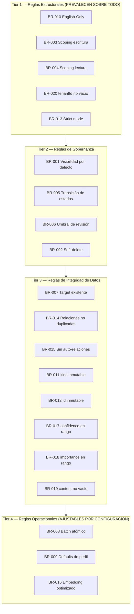
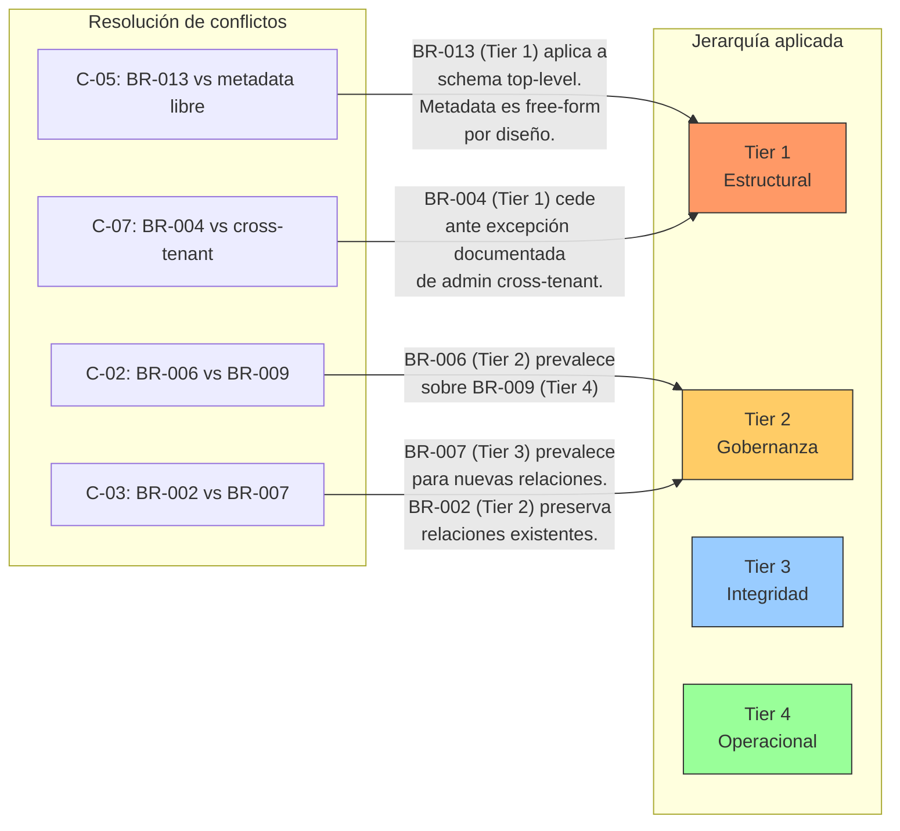

# Documento de Reglas de Negocio — Abax-Memory v2.0.0
## Motor de Memoria Genérica Multi-Dominio con IA

---

## Tabla de Contenidos

1. [Resumen Ejecutivo](#1-resumen-ejecutivo)
2. [Catálogo Completo de Reglas](#2-catálogo-completo-de-reglas-br-001-a-br-020)
   - [BR-001 a BR-010: Reglas Fundamentales](#br-001-a-br-010-reglas-fundamentales)
   - [BR-011 a BR-020: Reglas Adicionales](#br-011-a-br-020-reglas-adicionales)
3. [Agrupación por Categoría](#3-agrupación-por-categoría)
   - [3.1 Visibilidad y Scoping](#31-visibilidad-y-scoping)
   - [3.2 Ciclo de Vida y Estados](#32-ciclo-de-vida-y-estados)
   - [3.3 Gobernanza y Trazabilidad](#33-gobernanza-y-trazabilidad)
   - [3.4 Relaciones](#34-relaciones)
   - [3.5 English-Only](#35-english-only)
   - [3.6 Perfiles de Dominio](#36-perfiles-de-dominio)
   - [3.7 Integridad y Validación](#37-integridad-y-validación)
4. [Matriz de Conflictos](#4-matriz-de-conflictos)
   - [4.1 Tabla de Conflictos Identificados](#41-tabla-de-conflictos-identificados)
   - [4.2 Análisis Detallado de Cada Conflicto](#42-análisis-detallado-de-cada-conflicto)
5. [Reglas Implícitas](#5-reglas-implícitas)
   - [5.1 Catálogo de Reglas Implícitas (IR-001 a IR-009)](#51-catálogo-de-reglas-implícitas-ir-001-a-ir-009)
   - [5.2 Justificación de Cada Regla Implícita](#52-justificación-de-cada-regla-implícita)
6. [Jerarquía de Reglas](#6-jerarquía-de-reglas)
   - [6.1 Niveles Jerárquicos](#61-niveles-jerárquicos)
   - [6.2 Principio de Resolución de Conflictos](#62-principio-de-resolución-de-conflictos)
   - [6.3 Diagrama de Jerarquía](#63-diagrama-de-jerarquía)
7. [Trazabilidad Cruzada](#7-trazabilidad-cruzada)
8. [Glosario](#glosario)

---

## 1. Resumen Ejecutivo

Este documento consolida, expande y organiza las **20 reglas de negocio** definidas para Abax-Memory v2.0.0, el motor de memoria genérica multi-dominio con inteligencia artificial. Las reglas provienen de tres fuentes principales y cubren la totalidad de los comportamientos esperados del sistema en sus dimensiones de visibilidad, ciclo de vida, scoping, gobernanza, relaciones, validación y estándares internos.

### 1.1 Propósito

- Servir como **fuente única de verdad** sobre las reglas que gobiernan el sistema.
- Detectar y resolver **conflictos potenciales** entre reglas antes de la fase de diseño técnico.
- Identificar **reglas implícitas** — comportamientos deducibles del diseño que no fueron explicitados en la especificación funcional.
- Establecer una **jerarquía clara** que determine qué regla prevalece en caso de conflicto.

### 1.2 Resumen Cuantitativo

| Métrica | Valor |
|---|---|
| Reglas de negocio explícitas | **20** (BR-001 a BR-020) |
| Reglas implícitas identificadas | **9** (IR-001 a IR-009) |
| Conflictos potenciales detectados | **8** |
| Categorías de agrupación | **7** |
| Niveles jerárquicos | **4** |
| Criticidad Crítica | **7** reglas |
| Criticidad Alta | **10** reglas |
| Criticidad Media | **3** reglas |

### 1.3 Fuentes

| Fuente | Reglas cubiertas | Tipo |
|---|---|---|
| Visión del Producto (fase 0) | BR-001 a BR-010 | Reglas fundamentales del core genérico |
| Especificación Funcional (fase 2) | BR-001 a BR-020 | Reglas completas con refinamientos |
| Propuesta Técnica Genérica | Principio English-Only, modelo de datos | Fundamento arquitectónico de BR-010 |

---

## 2. Catálogo Completo de Reglas (BR-001 a BR-020)

### BR-001 a BR-010: Reglas Fundamentales

| ID | Nombre | Tipo | Condición | Acción | Excepciones | Criticidad | Fuente |
|---|---|---|---|---|---|---|---|
| **BR-001** | Visibilidad por defecto en búsqueda | Restricción | Búsqueda ejecutada sin filtro explícito de `statuses` | Solo se devuelven memorias con `lifecycle.status = active`. Las memorias en `draft`, `pending`, `archived`, `rejected` y `deleted` quedan excluidas de los resultados. | `memory-reviewer` y `memory-admin` pueden ver `pending` y `draft` si los incluyen explícitamente en `filters.statuses`. `memory-admin` y `memory-auditor` pueden ver todos los estados mediante endpoints administrativos. | **Crítica** | Visión v2, Especificación funcional |
| **BR-002** | Soft-delete | Acción habilitadora | Se ejecuta `DELETE /api/v2/memories/{id}` | La memoria se marca como `lifecycle.status = deleted`. No se elimina físicamente de la base de datos. El vector embedding se preserva en Qdrant pero queda excluido de toda búsqueda por el filtro de estado. Las relaciones de la memoria se preservan pero quedan huérfanas. | `memory-admin` puede ejecutar purga física mediante un endpoint administrativo dedicado (planificado para release posterior al MVP). | **Crítica** | Visión v2, Especificación funcional |
| **BR-003** | Scoping obligatorio en escritura | Restricción | Se crea una memoria mediante `POST /api/v2/memories` | El campo `scope` es obligatorio. Debe contener al menos `scope.tenantId` con un valor no vacío. `scope.userId`, `scope.sessionId` y `scope.namespace` son opcionales pero recomendados para granularidad de aislamiento. Sin `scope.tenantId` → `HTTP 400 VALIDATION_ERROR`. | Ninguna en el MVP. Todo tenant debe ser conocido por el sistema. | **Crítica** | Visión v2, Especificación funcional |
| **BR-004** | Scoping en lectura (aislamiento multi-tenant) | Restricción | Se ejecuta cualquier operación de lectura (búsqueda, consulta, detalle) | Los resultados se filtran automáticamente por el `scope.tenantId` extraído del token JWT del usuario autenticado. Un usuario del tenant A nunca ve memorias del tenant B. Si un usuario del tenant A intenta acceder a `GET /api/v2/memories/{id-de-tenant-B}`, el sistema retorna `HTTP 404 NOT_FOUND` (sin revelar la existencia del recurso en otro tenant). | `memory-admin` con permisos explícitos de cross-tenant access puede consultar y operar a través de tenants. Toda operación cross-tenant queda registrada en auditoría con el flag correspondiente. | **Crítica** | Visión v2, Especificación funcional |
| **BR-005** | Transición de estados permitidas | Restricción | Una memoria cambia de estado mediante `POST /api/v2/memories/{id}/review` o `DELETE` | **Transiciones permitidas**: `draft → pending` (submit), `pending → active` (approve), `pending → rejected` (reject), `active → archived` (archive), `draft → deleted` (soft-delete), `pending → deleted`, `active → deleted`, `archived → deleted`, `rejected → draft` (resubmit), `rejected → deleted`. **Transiciones prohibidas**: `active → draft` (el conocimiento aprobado no puede volver a borrador; usar `supersedes` para crear nueva versión y archivar la anterior), `archived → active` (debe crear nueva versión vía `supersedes`), `rejected → active` (debe pasar por `draft`), `deleted → cualquier estado` (soft-delete es irreversible sin purga administrativa). | `memory-admin` puede forzar transiciones excepcionales con justificación registrada en auditoría (ej. saltar el umbral de revisión de BR-006). | **Crítica** | Visión v2, Especificación funcional |
| **BR-006** | Umbral de revisión obligatoria | Acción habilitadora | Una memoria se crea con **ambas** condiciones simultáneamente: `lifecycle.importance >= 0.7` **Y** `lifecycle.sensitivity IN (confidential, secret)` | La memoria se fuerza a estado inicial `draft` (o `pending` si se envía directamente a revisión). **Nunca** puede crearse directamente en estado `active`. Debe pasar por el flujo de revisión humana (`draft → pending → active` vía aprobación de un `memory-reviewer` o `memory-admin`). | `memory-admin` puede saltar esta regla mediante un flag administrativo explícito, dejando justificación registrada en el log de auditoría. **Condición parcial**: si solo se cumple una de las dos condiciones (ej. `importance = 0.8` pero `sensitivity = internal`), la memoria puede crearse directamente en `active`. | **Crítica** | Visión v2, Especificación funcional |
| **BR-007** | Relaciones con target existente y activo | Restricción | Se crea una relación mediante `POST /api/v2/memories/{id}/relations` con un `targetId` | El `targetId` debe corresponder a una memoria existente en el sistema y cuyo `lifecycle.status` no sea `deleted`. Si `targetId` no existe o está `deleted` → `HTTP 404 TARGET_NOT_FOUND`. | Ninguna. La integridad referencial del grafo de conocimiento es no negociable. | **Alta** | Visión v2, Especificación funcional |
| **BR-008** | Ingesta batch atómica | Restricción | Se ejecuta `POST /api/v2/memories/ingest` con un array de N memorias | Todas las memorias del batch se crean dentro de una única transacción atómica: o todas se persisten exitosamente, o si cualquier memoria individual falla, **ninguna** se persiste (rollback completo). El batch tiene un límite máximo de **100 memorias** por llamada. Si el array excede 100 elementos → `HTTP 400 BATCH_SIZE_EXCEEDED`. | Ninguna. La atomicidad del batch es un requisito funcional para garantizar consistencia en ingestiones de conversaciones o documentos. | **Alta** | Visión v2, Especificación funcional |
| **BR-009** | Defaults heredados del perfil de dominio | Derivación | Se crea una memoria sin especificar explícitamente `lifecycle.importance`, `lifecycle.sensitivity` o `lifecycle.confidence` | El sistema asigna los valores por defecto definidos en el perfil de dominio activo: `defaultImportance`, `defaultSensitivity`, `defaultConfidence`. Si no hay perfil activo (core genérico): `importance = 0.5`, `confidence = 0.5`, `sensitivity = internal`. | El usuario puede sobrescribir explícitamente cualquiera de estos valores en el payload de creación. Los defaults solo aplican cuando el campo no se especifica. | **Media** | Visión v2, Especificación funcional |
| **BR-010** | English-Only en identificadores internos | Restricción | Cualquier identificador interno del sistema: `kind`, `lifecycle.status`, `relation.type`, `lifecycle.sensitivity`, `source.type`, paths de API, nombres de columnas, enums, códigos de error, campos del modelo de datos | Debe estar en inglés. La convención es `UPPER_SNAKE_CASE` para constantes y códigos de error (`VALIDATION_ERROR`, `TARGET_NOT_FOUND`), y `lower_snake_case` para campos y valores de enum (`fact`, `active`, `related_to`, `internal`). | **Excluidos del English-Only**: contenido de memorias (`content`, `summary`), tags y topics definidos por el usuario, `metadata` libre, labels de perfiles de dominio, y mensajes de error visibles al usuario final si se decide localizar. Estos pueden estar en cualquier idioma. | **Crítica** | Visión v2, Especificación funcional, Propuesta técnica |

### BR-011 a BR-020: Reglas Adicionales

| ID | Nombre | Tipo | Condición | Acción | Excepciones | Criticidad | Fuente |
|---|---|---|---|---|---|---|---|
| **BR-011** | `kind` inmutable tras creación | Restricción | Intento de modificar el campo `kind` mediante `PATCH /api/v2/memories/{id}` | La operación se rechaza con `HTTP 400 VALIDATION_ERROR`. El campo `kind` se establece en la creación y no puede modificarse posteriormente. Si se necesita reclasificar una memoria, debe crearse una nueva y relacionarse con la anterior mediante `supersedes`. | Ninguna. La inmutabilidad de la clasificación primaria es un principio de integridad del conocimiento. | **Alta** | Especificación funcional |
| **BR-012** | `id` inmutable y autogenerado | Restricción | Intento de especificar un `id` en el payload de `POST /api/v2/memories` | El sistema ignora cualquier `id` provisto por el usuario y genera uno automáticamente con el formato `MEM-` seguido de 8 caracteres alfanuméricos. Alternativamente, puede rechazar la request con `HTTP 400 INVALID_REQUEST_BODY` si el campo `id` está presente en strict mode. El `id` nunca puede modificarse mediante `PATCH`. | Ninguna. La generación de identificadores es responsabilidad exclusiva del sistema. | **Alta** | Especificación funcional |
| **BR-013** | Rechazo de campos desconocidos en el payload | Restricción | Un request body contiene campos que no están definidos en el schema del endpoint (strict mode) | La request se rechaza con `HTTP 400 INVALID_REQUEST_BODY`. Esta validación aplica a campos de primer nivel del schema. | **Excluidos del strict mode**: los contenidos del campo `metadata`, que es un objeto key-value libre. Cualquier campo dentro de `metadata` es aceptado sin validación de schema. | **Alta** | Especificación funcional |
| **BR-014** | Relaciones no duplicadas | Restricción | Intento de crear una relación con la misma combinación `sourceId + targetId + type` ya existente | La operación se rechaza con `HTTP 409 Conflict` o `HTTP 422 UNPROCESSABLE_ENTITY`. No pueden existir dos relaciones idénticas (mismo origen, mismo destino, mismo tipo). | Es posible tener dos relaciones entre las mismas memorias con distinto `type` (ej. `supports` y `related_to` entre MEM-A y MEM-B). | **Alta** | Especificación funcional |
| **BR-015** | Sin auto-relaciones | Restricción | Intento de crear una relación donde `sourceId == targetId` (una memoria relacionada consigo misma) | La operación se rechaza con `HTTP 422 UNPROCESSABLE_ENTITY`. Una memoria no puede tener relaciones consigo misma bajo ningún tipo de relación. | Ninguna. | **Alta** | Especificación funcional |
| **BR-016** | Regeneración de embedding solo al cambiar `content` | Acción habilitadora | Se ejecuta `PATCH /api/v2/memories/{id}` modificando campos de la memoria | Si el campo `content` cambió, se regenera el embedding vectorial (OpenAI `text-embedding-3-large`, 3072 dimensiones) y se actualiza en Qdrant. Si solo cambiaron `metadata`, `topics`, `summary`, `entities`, `lifecycle` u otros campos que no son `content`, **no** se regenera el embedding. | En creación (`POST`), siempre se genera embedding. | **Media** | Especificación funcional |
| **BR-017** | `confidence` en rango [0.0, 1.0] | Restricción | Se especifica un valor de `lifecycle.confidence` fuera del rango [0.0, 1.0] | La operación se rechaza con `HTTP 400 VALIDATION_ERROR`. Los valores válidos son números decimales entre 0.0 (certeza nula) y 1.0 (certeza absoluta), ambos inclusive. | Ninguna. | **Alta** | Especificación funcional |
| **BR-018** | `importance` en rango [0.0, 1.0] | Restricción | Se especifica un valor de `lifecycle.importance` fuera del rango [0.0, 1.0] | La operación se rechaza con `HTTP 400 VALIDATION_ERROR`. Los valores válidos son números decimales entre 0.0 (importancia nula) y 1.0 (importancia máxima), ambos inclusive. | Ninguna. | **Alta** | Especificación funcional |
| **BR-019** | `content` no vacío | Restricción | El campo `content` es un string vacío (`""`) o contiene únicamente caracteres de whitespace (espacios, tabs, saltos de línea) | La operación se rechaza con `HTTP 400 VALIDATION_ERROR`. Toda memoria debe tener contenido semántico. | Ninguna. | **Alta** | Especificación funcional |
| **BR-020** | `scope.tenantId` no vacío | Restricción | El campo `scope.tenantId` es un string vacío (`""`) o contiene únicamente whitespace | La operación se rechaza con `HTTP 400 VALIDATION_ERROR`. Esta regla refina BR-003: no solo `scope` es obligatorio, sino que `tenantId` dentro de `scope` debe tener un valor no vacío. | Ninguna. | **Crítica** | Especificación funcional |

---

## 3. Agrupación por Categoría

### 3.1 Visibilidad y Scoping

Agrupa las reglas que controlan **quién puede ver qué** y bajo qué condiciones de aislamiento multi-tenant.

| ID | Nombre | Propósito |
|---|---|---|
| **BR-001** | Visibilidad por defecto en búsqueda | Garantizar que los consumidores solo vean conocimiento aprobado y publicado (`active`). |
| **BR-003** | Scoping obligatorio en escritura | Todo conocimiento nuevo debe estar asociado a un tenant. |
| **BR-004** | Scoping en lectura (aislamiento) | Un tenant no puede ver el conocimiento de otro tenant. |
| **BR-020** | `scope.tenantId` no vacío | Refuerzo de BR-003: el identificador de tenant debe tener valor real. |

**Relaciones internas**: BR-020 es un refinamiento de BR-003. BR-001 y BR-004 se combinan con AND lógico en las queries: un usuario solo ve memorias `active` **dentro de su tenant**.

### 3.2 Ciclo de Vida y Estados

Agrupa las reglas que gobiernan la **máquina de estados** y la evolución temporal de las memorias.

| ID | Nombre | Propósito |
|---|---|---|
| **BR-002** | Soft-delete | Permitir eliminación lógica sin destrucción física de datos. |
| **BR-005** | Transición de estados | Definir los caminos legales entre estados del ciclo de vida. |
| **BR-011** | `kind` inmutable | La clasificación primaria de una memoria no puede alterarse una vez creada. |
| **BR-012** | `id` inmutable y autogenerado | El identificador único es responsabilidad del sistema y no puede manipularse. |

**Relaciones internas**: BR-002 depende de BR-005 (el soft-delete es una transición de estado `cualquier estado → deleted`). BR-011 y BR-012 garantizan la estabilidad de dos atributos fundamentales que no forman parte de la máquina de estados pero cuyo ciclo de vida está ligado a la creación.

### 3.3 Gobernanza y Trazabilidad

Agrupa las reglas que garantizan la **calidad, confiabilidad y auditabilidad** del repositorio de conocimiento.

| ID | Nombre | Propósito |
|---|---|---|
| **BR-006** | Umbral de revisión obligatoria | Conocimiento sensible o de alta importancia requiere validación humana antes de publicarse. |
| **BR-008** | Ingesta batch atómica | Garantizar consistencia transaccional en ingestiones masivas. |
| **BR-016** | Embedding solo al cambiar `content` | Optimizar recursos evitando reindexaciones innecesarias. |

**Relaciones internas**: BR-006 interactúa con BR-001 (una memoria forzada a `draft` por BR-006 no es visible en búsquedas por defecto hasta que sea aprobada y pase a `active`). BR-016 interactúa con BR-002 (soft-delete no dispara reindexación).

### 3.4 Relaciones

Agrupa las reglas que gobiernan la **integridad del grafo de conocimiento**.

| ID | Nombre | Propósito |
|---|---|---|
| **BR-007** | Relaciones con target existente | Evitar relaciones huérfanas o inválidas en el grafo. |
| **BR-014** | Relaciones no duplicadas | Evitar redundancia en las conexiones del grafo. |
| **BR-015** | Sin auto-relaciones | Prevenir ciclos triviales de longitud 1 que no aportan valor semántico. |

### 3.5 English-Only

| ID | Nombre | Propósito |
|---|---|---|
| **BR-010** | English-Only en identificadores internos | Estandarización internacional, interoperabilidad con ecosistemas de IA, comparabilidad con benchmarks y competidores. |

### 3.6 Perfiles de Dominio

| ID | Nombre | Propósito |
|---|---|---|
| **BR-009** | Defaults heredados del perfil | Reducir fricción en la creación de memorias aplicando valores contextuales según el dominio. |

### 3.7 Integridad y Validación

Agrupa las reglas que protegen la **calidad de los datos** en el punto de ingreso.

| ID | Nombre | Propósito |
|---|---|---|
| **BR-013** | Rechazo de campos desconocidos | Proteger el schema de datos contra atributos no definidos. |
| **BR-017** | `confidence` en rango | Garantizar que la métrica de certeza sea normalizada y comparable. |
| **BR-018** | `importance` en rango | Garantizar que la métrica de importancia sea normalizada y comparable. |
| **BR-019** | `content` no vacío | Asegurar que toda memoria tiene contenido semántico real. |

---

## 4. Matriz de Conflictos

### 4.1 Tabla de Conflictos Identificados

| ID Conflicto | Reglas involucradas | Naturaleza del conflicto | Severidad | Resolución |
|---|---|---|---|---|
| **C-01** | BR-001 vs BR-006 | BR-001 restringe búsquedas a `active`. BR-006 fuerza memorias de alta criticidad a `draft`/`pending`. | Baja — Diseño compatible | **Prevalecen ambas**: BR-006 actúa en creación; BR-001 actúa en consulta. Una memoria forzada a `draft` por BR-006 naturalmente no aparece en búsquedas por defecto hasta que sea aprobada. **No hay conflicto real**, es comportamiento deseado. |
| **C-02** | BR-006 vs BR-009 | BR-009 asigna defaults del perfil. Si el perfil define `defaultImportance >= 0.7` y `defaultSensitivity = confidential/secret`, BR-006 se dispara automáticamente para **toda** memoria creada con ese perfil, lo cual puede no ser deseado. | Media — Riesgo de fricción operativa | **Prevalecen ambas pero requieren conciencia del diseñador del perfil**: si el perfil *intencionalmente* configura defaults que disparen BR-006, el comportamiento es correcto (ej. perfil Legal donde todo debe revisarse). Si no es la intención, el perfil debe ajustar sus defaults. `memory-admin` siempre puede saltar BR-006 con justificación. |
| **C-03** | BR-002 vs BR-007 | BR-002 permite soft-delete preservando datos. BR-007 prohíbe crear relaciones hacia memorias `deleted`. | Baja — Compatible | **BR-007 prevalece en creación de relaciones**: no se pueden crear nuevas relaciones hacia targets `deleted`. Las relaciones existentes que apuntaban a una memoria antes de su soft-delete se **preservan pero quedan huérfanas** (BR-002). El grafo simplemente no expande nodos `deleted`. |
| **C-04** | BR-003 vs BR-020 | BR-003 declara `scope` obligatorio. BR-020 exige `tenantId` no vacío. | Baja — Refinamiento | **BR-020 refina BR-003**: no hay conflicto. BR-003 dice "scope requerido", BR-020 especifica "tenantId dentro de scope debe tener valor no vacío". **Ambas se aplican acumulativamente**. |
| **C-05** | BR-013 vs BR-009 / `metadata` libre | BR-013 rechaza campos desconocidos en el payload (strict mode). BR-009 y el diseño general permiten `metadata` como objeto libre de schema. | Media — Requiere delimitación precisa | **BR-013 aplica a nivel de schema top-level**. El objeto `metadata` completo es un campo conocido del schema, por tanto aceptado. Los campos *dentro* de `metadata` no están sujetos a BR-013. Un campo desconocido de primer nivel (ej. `customField` al mismo nivel que `kind`) sí se rechaza. |
| **C-06** | BR-011 vs necesidad de reclasificar | BR-011 prohíbe cambiar `kind`. Un operador podría necesitar reclasificar una memoria (ej. de `note` a `decision`). | Baja — Diseño previsto | **BR-011 prevalece**: el `kind` no se modifica. El operador debe **crear una nueva memoria** con el `kind` correcto y relacionarla con la original mediante `supersedes`. Esto preserva trazabilidad y es coherente con BR-005 (`active → draft` prohibido). |
| **C-07** | BR-004 vs acceso cross-tenant de admin | BR-004 aísla tenants. El admin necesita operar cross-tenant para depuración y gobierno. | Baja — Excepción documentada | **BR-004 cede ante `memory-admin` con permisos explícitos**: la excepción de cross-tenant access está prevista en BR-004. Toda operación cross-tenant queda registrada en auditoría. |
| **C-08** | BR-005 (`deleted → X` prohibido) vs necesidad de recuperar | BR-005 prohíbe transiciones desde `deleted`. Un error operativo podría requerir restaurar una memoria eliminada. | Baja — Diseño previsto | **BR-005 prevalece en el MVP**: `deleted` es irreversible sin purga administrativa. La restauración se maneja creando una nueva memoria con el mismo contenido (el `content` original se preserva en BD aunque `status = deleted`) y relacionándola con la eliminada si aplica. La purga administrativa con restauración se planifica para un release posterior. |

### 4.2 Análisis Detallado de Cada Conflicto

#### C-02: BR-006 vs BR-009 — Riesgo de revisión forzada no deseada

Este es el conflicto con mayor impacto operativo potencial. Si un perfil de dominio define:

```json
{
  "defaultImportance": 0.8,
  "defaultSensitivity": "confidential"
}
```

Toda memoria creada bajo ese perfil sin sobrescribir estos valores queda automáticamente sujeta a revisión humana obligatoria (BR-006). Para un perfil como Agent, donde se crean cientos de memorias por sesión, esto bloquearía el flujo.

**Recomendación para diseñadores de perfiles**: si el perfil no requiere revisión universal, mantener `defaultImportance < 0.7` o `defaultSensitivity != confidential/secret`. La combinación peligrosa (`importance >= 0.7` + `sensitivity = confidential/secret`) solo debe usarse en perfiles donde la revisión humana sea **intencionalmente universal** (ej. perfil Legal, perfil Financiero).

#### C-05: BR-013 vs metadata libre — Delimitación precisa

La regla BR-013 debe implementarse con precisión quirúrgica:

```json
// ✅ Aceptado — metadata es un campo conocido del schema
{
  "kind": "fact",
  "content": "...",
  "metadata": {
    "cualquierCampo": "cualquierValor",
    "otroCampoInventado": 123
  }
}

// ❌ Rechazado — customField no está en el schema de primer nivel
{
  "kind": "fact",
  "content": "...",
  "customField": "valor inesperado"
}
```

---

## 5. Reglas Implícitas

Las siguientes reglas no fueron declaradas explícitamente en la especificación funcional ni en la visión del producto, pero son **deducibles del diseño del sistema** y deben ser respetadas por la implementación.

### 5.1 Catálogo de Reglas Implícitas (IR-001 a IR-009)

| ID | Regla Implícita | Tipo | Deducible de | Descripción |
|---|---|---|---|---|
| **IR-001** | Pertenencia exclusiva a un scope | Restricción | Modelo de datos (§2.1.1), BR-003 | Una memoria pertenece a un único `scope` (un solo `tenantId`, un solo `userId`, un solo `sessionId`, un solo `namespace`). No puede pertenecer simultáneamente a dos tenants ni a dos usuarios. |
| **IR-002** | Estado único y transiciones atómicas | Restricción | Máquina de estados (§2.3.2), BR-005 | Una memoria solo puede estar en un estado a la vez. Las transiciones de estado son operaciones atómicas: no existe un estado intermedio entre `pending` y `active`. |
| **IR-003** | Navegabilidad bidireccional del grafo | Inferencia | Relaciones (§2.5), endpoint `/graph` | Aunque las relaciones se almacenan como array en la memoria origen, el endpoint `GET /api/v2/memories/{id}/graph` permite navegar el grafo en **ambas direcciones**. El sistema resuelve relaciones inversas (ej. "qué memorias me mencionan") en tiempo de consulta. |
| **IR-004** | Preservación de relaciones huérfanas | Inferencia | BR-002, BR-007, §2.5.4 | Al hacer soft-delete de una memoria (BR-002), sus relaciones se preservan en base de datos pero el nodo `deleted` no se expande en el grafo. Las relaciones inbound (otras memorias apuntando a la memoria eliminada) quedan huérfanas. Si en el futuro se implementa purga física, las relaciones huérfanas se eliminarían. |
| **IR-005** | Score de búsqueda determinista y reproducible | Restricción | §6.5, §6.6 | Misma query semántica + mismos datos en el repositorio = mismos scores en los resultados de búsqueda. El sistema no introduce aleatoriedad en el scoring ni en el ranking. Esto es esencial para auditoría de calidad de búsqueda y comparabilidad de benchmarks. |
| **IR-006** | Roles aditivos (unión de permisos) | Inferencia | RBAC (§5.7.2), roles (§2.2 visión) | Un usuario autenticado puede tener múltiples roles simultáneamente (ej. `memory-operator` y `memory-reviewer`). Los permisos efectivos son la **unión** de los permisos de todos sus roles. No hay conflicto entre roles porque los permisos son aditivos. |
| **IR-007** | `tenantId` efectivo deriva del token JWT | Restricción | BR-004, §4.2 (SC-08), §5.7.1 | En operaciones de lectura, el `tenantId` que determina el alcance de datos proviene del claim en el token JWT, **no** de lo que el usuario declare en el request body. Si el usuario incluye `scope.tenantId` en filtros de búsqueda, solo puede **restringir** (nunca ampliar) el scope de su token. |
| **IR-008** | Inmutabilidad del registro de auditoría | Restricción | §7.1.3 | Los registros de auditoría, una vez escritos, no pueden ser modificados ni eliminados por ningún rol del sistema, incluyendo `memory-admin`. Son un append-only log. |
| **IR-009** | Indexación sincrónica en creación | Inferencia | §6.1, BR-016 | Al crear una memoria (`POST /api/v2/memories`), el embedding se genera y se indexa en Qdrant de forma **sincrónica** antes de retornar `HTTP 201`. La memoria es inmediatamente buscable tras la respuesta exitosa. Esto difiere de sistemas donde la indexación es asincrónica. |

### 5.2 Justificación de Cada Regla Implícita

#### IR-001: Pertenencia exclusiva a un scope

El modelo `scope` es un objeto singular, no un array. El diseño implica que una memoria pertenece a exactamente un tenant y opcionalmente a un usuario, sesión y namespace. No existe el concepto de "memoria compartida entre tenants" en el MVP. Si en el futuro se necesita este patrón, requeriría una extensión del modelo (ej. `sharedWith: [tenantId]`).

#### IR-003: Navegabilidad bidireccional

Aunque el almacenamiento de relaciones es dirigido (solo en la memoria origen), el endpoint `/graph` materializa relaciones inversas. Esto implica que el sistema debe ser capaz de ejecutar queries del tipo "find all relations where I am the targetId" para construir el subgrafo completo alrededor de un nodo.

#### IR-007: TenantId del token, no del payload

Esta regla es crítica para la seguridad multi-tenant. Si el sistema confiara en el `tenantId` declarado por el usuario en el request, un atacante podría especificar `tenantId: "otro-tenant"` y acceder a datos ajenos. El token JWT firmado por Keycloak es la única fuente confiable de identidad y tenant.

#### IR-009: Indexación sincrónica

El flujo descrito en §6.1 muestra que el embedding se genera durante la creación (`POST`) y el upsert a Qdrant ocurre antes de retornar la respuesta. Esto implica que `POST /memories` tiene una latencia que incluye: validación + persistencia en PostgreSQL + generación de embedding vía OpenAI API + upsert en Qdrant. Esto es relevante para los criterios de latencia y disponibilidad.

---

## 6. Jerarquía de Reglas

En caso de conflicto o ambigüedad entre dos o más reglas, la siguiente jerarquía determina cuál prevalece.

### 6.1 Niveles Jerárquicos



### 6.2 Principio de Resolución de Conflictos

| Prioridad | Nivel | Definición | Reglas | Prevalencia |
|---|---|---|---|---|
| **1 (máxima)** | **Estructural** | Definen la arquitectura fundamental del sistema. No pueden ser relajadas ni sobrescritas por ninguna otra regla o configuración. | BR-010, BR-003, BR-004, BR-020, BR-013 | Prevalecen sobre cualquier regla de nivel inferior. |
| **2** | **Gobernanza** | Controlan la visibilidad, madurez y calidad del conocimiento. Pueden tener excepciones administrativas documentadas pero no pueden ser ignoradas por configuraciones operacionales. | BR-001, BR-005, BR-006, BR-002 | Prevalecen sobre reglas de Integridad y Operacionales. |
| **3** | **Integridad de Datos** | Garantizan que los datos sean consistentes y válidos. Aplican a nivel de validación de entrada y consistencia referencial. | BR-007, BR-014, BR-015, BR-011, BR-012, BR-017, BR-018, BR-019 | Prevalecen sobre reglas Operacionales. |
| **4 (mínima)** | **Operacional** | Optimizan el comportamiento del sistema. Pueden ser ajustadas mediante configuración de perfiles o parámetros de despliegue sin comprometer la integridad del core. | BR-008, BR-009, BR-016 | Ceden ante cualquier regla de nivel superior. |

### 6.3 Diagrama de Jerarquía



### 6.4 Reglas de Desempate

Cuando dos reglas del mismo nivel jerárquico entran en conflicto:

1. **Especificidad**: la regla más específica prevalece sobre la más general (ej. BR-020 es más específica que BR-003).
2. **Excepción documentada**: si una regla declara explícitamente una excepción para otra, la excepción prevalece en el caso concreto (ej. BR-004 declara excepción para `memory-admin` cross-tenant).
3. **Protección de datos**: en caso de duda, prevalece la regla que **restringe más** el acceso o visibilidad de los datos (principio de mínima exposición).

---

## 7. Trazabilidad Cruzada

### 7.1 Regla de Negocio → Feature → Épica

| Regla | Feature principal | Épica |
|---|---|---|
| BR-001 | FT-005.09 (Resultados filtrables por estado), FT-006.03 (Visibilidad gobernada) | EP-005, EP-006 |
| BR-002 | FT-001.07 (Soft-delete de memoria) | EP-001 |
| BR-003 | FT-003.06 (Scope obligatorio en creación) | EP-003 |
| BR-004 | FT-003.07 (Filtrado automático por tenant) | EP-003 |
| BR-005 | FT-001.02 (Máquina de estados), FT-006.04 (Revisión de estados) | EP-001, EP-006 |
| BR-006 | FT-006.04 (Umbral de revisión obligatoria) | EP-006 |
| BR-007 | FT-001.03 (Creación de relaciones), FT-004.02 (Endpoint relaciones) | EP-001, EP-004 |
| BR-008 | FT-007.01 (Batch ingest atómico) | EP-007 (Should) |
| BR-009 | FT-002.06 (Defaults por perfil de dominio) | EP-002 |
| BR-010 | FT-004.08 (English-Only compliance) | EP-004 |
| BR-011 | FT-001.01 (Campos inmutables del modelo) | EP-001 |
| BR-012 | FT-001.01 (Generación de identificadores) | EP-001 |
| BR-013 | FT-004.06 (Validación estricta de payloads) | EP-004 |
| BR-014 | FT-004.02 (Restricciones de relaciones) | EP-004 |
| BR-015 | FT-004.02 (Validación de relaciones) | EP-004 |
| BR-016 | FT-005.02 (Regeneración condicional de embeddings) | EP-005 |
| BR-017 | FT-004.06 (Validación de rangos numéricos) | EP-004 |
| BR-018 | FT-004.06 (Validación de rangos numéricos) | EP-004 |
| BR-019 | FT-004.06 (Validación de campos requeridos) | EP-004 |
| BR-020 | FT-003.06 (Validación de tenantId) | EP-003 |

### 7.2 Regla de Negocio → Criterio de Éxito

| Regla | Criterio de Éxito relacionado |
|---|---|
| BR-001, BR-002, BR-005, BR-006 | **CE-08**: Visibilidad por estado — búsqueda sin filtro solo retorna `active` (0 falsos positivos) |
| BR-003, BR-004, BR-020 | **CE-07**: Aislamiento multi-tenant — 100% de queries cross-tenant retornan 0 resultados |
| BR-010 | **CE-10**: English-Only compliance — 100% de identificadores internos en inglés |
| BR-007, BR-014, BR-015 | **CE-11**: Operaciones sobre relaciones — 9/9 tipos de relación operativos |
| BR-008 | **CE-12**: Batch ingest — tasa de éxito ≥ 99% con atomicidad |
| BR-006, BR-009, BR-016 | **CE-05**: Precisión top-1 en suite interna — ≥ 0.92 con 100 test cases |

---

## 8. Glosario

- **JWT**: JSON Web Token — token de acceso firmado digitalmente que transporta claims del usuario (identidad, roles, tenantId). Usado para autenticación y autorización en cada request a la API.
- **Qdrant**: Base de datos vectorial open-source utilizada para almacenar embeddings y ejecutar búsqueda semántica por similitud de coseno.
- **Embedding**: Representación vectorial densa de un texto (3072 dimensiones con OpenAI `text-embedding-3-large`) que permite comparar similitud semántica entre query y documentos.
- **MVP**: Minimum Viable Product — versión mínima del producto con las funcionalidades esenciales para ser viable. En v2.0.0, 7 épicas Must.
- **Strict mode**: Modo de validación de API donde cualquier campo no definido en el schema del endpoint es rechazado automáticamente con error `INVALID_REQUEST_BODY`.
- **Soft-delete**: Operación de eliminación lógica que marca un registro como `deleted` sin eliminarlo físicamente de la base de datos, preservando trazabilidad y permitiendo recuperación.
- **Cross-tenant access**: Capacidad administrativa de un `memory-admin` para consultar y operar a través de múltiples tenants, registrando cada operación en auditoría.

---

*Documento generado por business-analyst el 2026-05-03. Cubre la totalidad de las 20 reglas de negocio explícitas (BR-001 a BR-020), 9 reglas implícitas (IR-001 a IR-009), 8 conflictos potenciales analizados, 7 categorías de agrupación y 4 niveles jerárquicos. Trazabilidad completa hacia features, épicas y criterios de éxito.*
