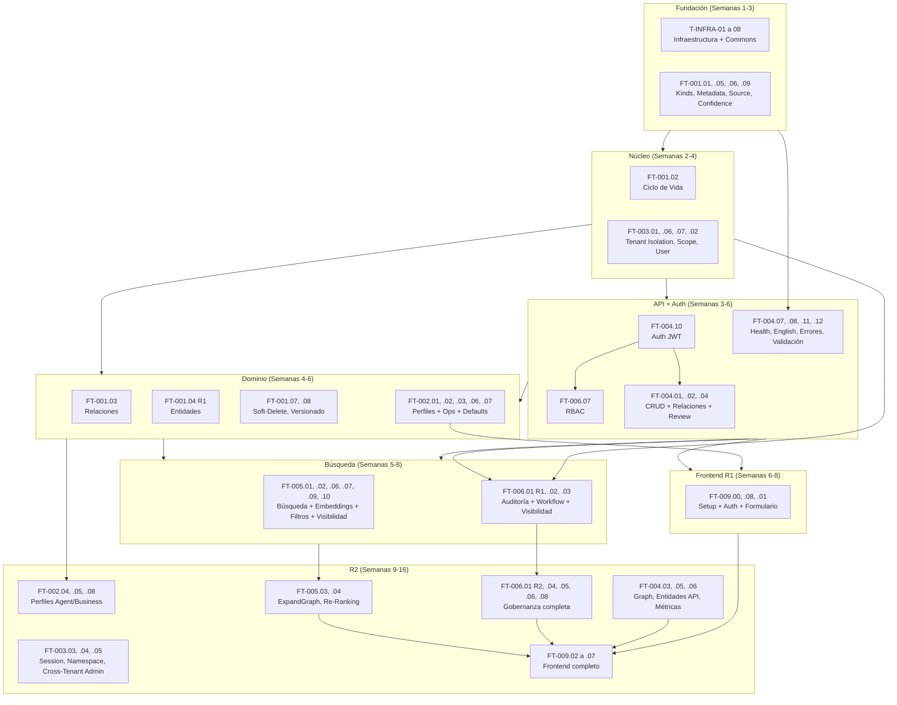

# Descomposición Técnica de Tareas — Abax-Memory v2.0.0

## Tabla de Contenidos

1. [Resumen Ejecutivo](#1-resumen-ejecutivo)
2. [Desglose de Tareas por Épica y Feature](#2-desglose-de-tareas-por-épica-y-feature)
   - [EP-001: Motor de Memoria Genérico](#ep-001-motor-de-memoria-genérico)
   - [EP-002: Perfiles de Dominio](#ep-002-perfiles-de-dominio)
   - [EP-003: Scoping Multi-Tenant](#ep-003-scoping-multi-tenant)
   - [EP-004: API REST v2](#ep-004-api-rest-v2)
   - [EP-005: Búsqueda Semántica + Graph](#ep-005-búsqueda-semántica--graph)
   - [EP-006: Gobernanza y Trazabilidad](#ep-006-gobernanza-y-trazabilidad)
   - [EP-009: Frontend Multi-Dominio](#ep-009-frontend-multi-dominio)
3. [Orden de Ejecución](#3-orden-de-ejecución)
4. [Mapa de Dependencias entre Tareas](#4-mapa-de-dependencias-entre-tareas)
5. [Estimación por Capa](#5-estimación-por-capa)
6. [Asignación Sugerida por Rol](#6-asignación-sugerida-por-rol)
7. [Glosario](#7-glosario)

---

## 1. Resumen Ejecutivo

Este documento descompone las **66 historias Must** del MVP v2.0.0 (R1 + R2) en **tareas técnicas atómicas**, trazables a features, paquetes Java, migraciones Flyway y tests. Se excluyen las 3 historias Should de R3 (rate limiting, multi-hop, re-indexación masiva) y las épicas fuera de scope (EP-007, EP-008, EP-010).

### Métricas Clave

| Métrica | Valor |
|---|---|
| **Total de tareas técnicas** | **152** |
| **Tareas Backend (Java/Quarkus)** | 64 |
| **Tareas Base de Datos (Flyway)** | 12 migraciones (7 core + 5 suplementarias) |
| **Tareas Qdrant (indexación/búsqueda)** | 7 |
| **Tareas Frontend (React/TypeScript)** | 24 |
| **Tareas Test (unitarios + integración)** | 28 |
| **Tareas DevOps (CI/CD + infraestructura)** | 8 |
| **Tareas de Configuración** | 9 |
| **Tallas: S / M / L** | 61 (40.1%) / 59 (38.8%) / 32 (21.1%) |
| **Esfuerzo estimado total** | **360–590 días-persona** |
| **Release R1 (43 historias)** | 101 tareas |
| **Release R2 (23 historias)** | 51 tareas |

> **Nota**: Las estimaciones asumen un equipo de 4–6 desarrolladores trabajando en paralelo con el stack Quarkus 3.x + Java 21 + PostgreSQL 16 + Qdrant 1.17 + React 19. El rango refleja el margen de incertidumbre (×1.3 a ×1.5 según la complejidad técnica del componente).

---

## 2. Desglose de Tareas por Épica y Feature

### Leyenda

| Símbolo | Significado |
|---|---|
| `T-XXX.Y.Z.N` | Task ID: Épica.Feature.Secuencial.Subtarea |
| `📦` | Paquete Java (`com.abax.memory.*`) |
| `🗄️` | Migración Flyway (`V{ver}__{desc}.sql`) |
| `🧪` | Test (unitario o integración) |
| `⚙️` | Configuración / DevOps / Infraestructura |
| `🖥️` | Frontend (React/TypeScript) |
| `🔌` | Integración externa (Qdrant, OpenAI, Keycloak) |
| `S` | 1–3 días |
| `M` | 5–10 días (1–2 semanas) |
| `L` | 15–20 días (3–4 semanas) |

---

### EP-001: Motor de Memoria Genérico

**11 historias R1 + 1 historia R2. Paquete base: `com.abax.memory.domain`**

#### FT-001.01: Kinds Universales (HU-001.01.1) — Release: R1

```text
FT-001.01: Clasificar memoria con 8 kinds universales
  ├── T-001.01.1: [Domain] Crear enum MemoryKind (fact, preference, event, decision,
  │       task, procedure, note, entity) con validación de valores permitidos
  │       📦 com.abax.memory.domain — Est: S
  ├── T-001.01.2: [BD] Migración V1__create_memory_fragments.sql — columna kind
  │       VARCHAR(20) NOT NULL + CHECK constraint para 8 valores
  │       🗄️ Flyway V1 — Est: S
  └── T-001.01.3: [Test] Unit test de MemoryKind enum + test de integración para
          creación de memoria con kind válido e inválido
          🧪 JUnit 5 + QuarkusTest — Est: S
```

#### FT-001.02: Ciclo de Vida con Seis Estados (HU-001.02.1, HU-001.02.2) — Release: R1

```text
FT-001.02: Máquina de estados con 6 estados y transiciones gobernadas
  ├── T-001.02.1: [Domain] Crear enum MemoryStatus (draft, pending, active,
  │       archived, rejected, deleted) + value object Lifecycle con campos
  │       status, confidence, importance, sensitivity, review
  │       📦 com.abax.memory.domain — Est: S
  ├── T-001.02.2: [Service] Implementar LifecycleService con máquina de estados:
  │       - Transiciones permitidas: draft→pending, pending→active,
  │         pending→rejected, active→archived, *→deleted
  │       - Guard conditions: solo reviewer/admin pueden approve/reject
  │       - Reglas BR-005 (transiciones prohibidas: active→draft, etc.)
  │       📦 com.abax.memory.service — Est: M
  ├── T-001.02.3: [BD] Integrar columna status en V1 + CHECK constraint 6 valores
  │       🗄️ Flyway V1 — Est: S (incluido en V1)
  └── T-001.02.4: [Test] 12 tests unitarios para cada transición válida +
          8 tests para transiciones rechazadas + test integración POST /review
          🧪 JUnit 5 + Mockito — Est: M
```

#### FT-001.03: Relaciones Tipadas (HU-001.03.1, HU-001.03.2) — Release: R1

```text
FT-001.03: Crear y eliminar relaciones tipadas entre memorias
  ├── T-001.03.1: [Domain] Crear value object Relation + enum RelationType
  │       (related_to, depends_on, caused_by, resolves, contradicts,
  │        supports, mentions, belongs_to, supersedes)
  │       📦 com.abax.memory.domain — Est: S
  ├── T-001.03.2: [Repository] Implementar RelationRepository + PgRelationRepository:
  │       - create(sourceId, targetId, type)
  │       - delete(relationId)
  │       - findBySourceId(sourceId, type?), findByTargetId(targetId)
  │       - findNeighbors(memoryId, depth=1) con CTE recursiva
  │       📦 com.abax.memory.repository / .postgres — Est: M
  ├── T-001.03.3: [BD] Migración V2__create_relations.sql — tabla relations
  │       con FK a memory_fragments, CHECK source_id <> target_id,
  │       UNIQUE (source_id, target_id, relation_type), índices
  │       🗄️ Flyway V2 — Est: S
  ├── T-001.03.4: [Service] Implementar RelationService con lógica de negocio:
  │       - Validar que source y target existen y no están deleted
  │       - Prevenir auto-relaciones y duplicados
  │       - Auditoría de creación/eliminación de relaciones
  │       📦 com.abax.memory.service — Est: M
  ├── T-001.03.5: [API] Endpoints REST en RelationResource:
  │       POST /api/v2/memories/{id}/relations, DELETE .../relations/{relId}
  │       📦 com.abax.memory.api.resource — Est: M
  └── T-001.03.6: [Test] Tests unitarios RelationService + integración endpoints
          🧪 JUnit 5 + QuarkusIntegrationTest — Est: M
```

#### FT-001.04: Extracción de Entidades (HU-001.04.1 R1, HU-001.04.2 R2) — Release: R1/R2

```text
FT-001.04: Extraer entidades de texto y buscar entidades vinculadas
  ├── T-001.04.1: [Integration] Implementar OpenAiLlmProvider con método
  │       extractEntities(text) → List<String> usando GPT-4o con prompt
  │       estructurado para extraer entidades nombradas
  │       📦 com.abax.memory.integration.llm — Est: M
  ├── T-001.04.2: [Service] Implementar EntityService:
  │       - extractAndStore(memoryId): extrae entidades y las persiste
  │         en memory_fragments.extracted_entities (JSONB)
  │       - searchByName(partialName): búsqueda en extracted_entities via GIN index
  │       - getMemoriesByEntity(entityName): memorias vinculadas
  │       📦 com.abax.memory.service — Est: M
  ├── T-001.04.3: [API R1] Endpoint POST /api/v2/memories/extract — extracción sin persistir
  │       📦 com.abax.memory.api.resource.EntityResource — Est: S
  ├── T-001.04.4: [API R2] Endpoints GET /api/v2/entities y GET /api/v2/entities/{name}
  │       con memorias vinculadas — Release R2
  │       📦 com.abax.memory.api.resource.EntityResource — Est: M
  └── T-001.04.5: [Test] Tests unitarios EntityService + mock OpenAI + integración
          🧪 JUnit 5 + WireMock — Est: M
```

#### FT-001.05: Metadatos de Dominio (HU-001.05.1) — Release: R1

```text
FT-001.05: Enriquecer memorias con metadatos extensibles JSONB
  ├── T-001.05.1: [Domain] Campo metadata JSONB en MemoryFragment — sin schema fijo,
  │       validación de que es JSON válido. Documentar convención de keys planas.
  │       📦 com.abax.memory.domain — Est: S
  └── T-001.05.2: [BD] Columna metadata JSONB DEFAULT '{}' en V1
          🗄️ Flyway V1 — Est: S (incluido)
```

#### FT-001.06: Source Tipado (HU-001.06.1) — Release: R1

```text
FT-001.06: Registrar origen de una memoria con source tipado
  ├── T-001.06.1: [Domain] Crear enum SourceType (conversation, document, api,
  │       workflow, manual, case) + campos source_type, source_id en MemoryFragment
  │       📦 com.abax.memory.domain — Est: S
  └── T-001.06.2: [BD] Columnas source_type, source_id + CHECK constraint en V1
          🗄️ Flyway V1 — Est: S (incluido)
```

#### FT-001.07: Soft-Delete (HU-001.07.1) — Release: R1

```text
FT-001.07: Eliminación lógica con preservación de datos
  ├── T-001.07.1: [Service] Implementar soft-delete en MemoryService:
  │       - Transición status → deleted desde cualquier estado
  │       - Exclusión automática de queries estándar (WHERE status <> 'deleted')
  │       - Preservación de relaciones (target deleted no se expande en grafo)
  │       📦 com.abax.memory.service — Est: S
  ├── T-001.07.2: [Repository] Modificar PgMemoryRepository: agregar filtro
  │       automático WHERE status <> 'deleted' en todas las queries base
  │       📦 com.abax.memory.repository.postgres — Est: S
  └── T-001.07.3: [Test] Tests de integración: soft-delete, queries excluyen deleted,
          admin puede ver deleted
          🧪 QuarkusIntegrationTest — Est: S
```

#### FT-001.08: Versionado (Supersedes) (HU-001.08.1) — Release: R1

```text
FT-001.08: Crear nueva versión que reemplaza anterior
  ├── T-001.08.1: [Service] Implementar versionado en MemoryService:
  │       - Crear nueva memoria con mismo kind + contenido actualizado
  │       - Crear automáticamente relación supersedes: new → old
  │       - Archivar automáticamente la versión anterior (status → archived)
  │       📦 com.abax.memory.service — Est: M
  └── T-001.08.2: [Test] Tests unitarios + integración de flujo de versionado
          🧪 JUnit 5 + QuarkusIntegrationTest — Est: S
```

#### FT-001.09: Confidence (HU-001.09.1) — Release: R1

```text
FT-001.09: Asignar nivel de confianza [0.0, 1.0] a una memoria
  ├── T-001.09.1: [Domain] Campo confidence REAL en MemoryFragment con validación
  │       de rango [0.0, 1.0]. Default 0.5.
  │       📦 com.abax.memory.domain — Est: S
  └── T-001.09.2: [BD] Columna confidence REAL DEFAULT 0.5 + CHECK constraint en V1
          🗄️ Flyway V1 — Est: S (incluido)
```

---

### EP-002: Perfiles de Dominio

**5 historias R1 + 3 historias R2. Paquete base: `com.abax.memory.domain` + `com.abax.memory.service`**

#### FT-002.01: Definir Perfil de Dominio (HU-002.01.1) — Release: R1

```text
FT-002.01: Definir perfil de dominio como configuración JSON
  ├── T-002.01.1: [Domain] Crear entidad Profile: id (PRF-xxxxxxxx), name (unique),
  │       version, description, config (JSONB), isActive
  │       📦 com.abax.memory.domain — Est: S
  ├── T-002.01.2: [BD] Migración V4__create_profiles.sql — tabla profiles
  │       🗄️ Flyway V4 — Est: S
  ├── T-002.01.3: [Repository] Implementar ProfileRepository + PgProfileRepository
  │       📦 com.abax.memory.repository / .postgres — Est: S
  ├── T-002.01.4: [Service] Implementar ProfileService: CRUD de perfiles,
  │       validación de unicidad de name, activación/desactivación
  │       📦 com.abax.memory.service — Est: M
  ├── T-002.01.5: [API] Endpoints en ProfileResource:
  │       GET /api/v2/profiles, POST /api/v2/profiles
  │       📦 com.abax.memory.api.resource — Est: S
  └── T-002.01.6: [Test] Tests unitarios + integración ProfileService
          🧪 JUnit 5 + QuarkusIntegrationTest — Est: S
```

#### FT-002.02: Herencia del Core Genérico (HU-002.02.1) — Release: R1

```text
FT-002.02: Garantizar que todo perfil hereda la base genérica
  ├── T-002.02.1: [Service] Implementar validación en ProfileService: todo perfil
  │       debe incluir el bloque `"extends": "generic-base"` en su config.
  │       Los 8 kinds, 6 estados y 9 tipos de relación son no-sobreescribibles.
  │       📦 com.abax.memory.service — Est: S
  └── T-002.02.2: [Test] Test unitario que valida rechazo de perfil sin herencia
          🧪 JUnit 5 — Est: S
```

#### FT-002.03: Perfil Ops (HU-002.03.1) — Release: R1

```text
FT-002.03: Semilla del perfil Ops para operaciones IT
  ├── T-002.03.1: [Config] Crear archivo de semilla JSON para perfil Ops:
  │       - name: "ops", description: "IT Operations memory profile"
  │       - config: kinds por defecto (fact, event, decision, task, procedure, note),
  │         topics sugeridos (incident, deployment, monitoring, database, network),
  │         defaults de sensitivity (internal), metadatos específicos (host, service, env)
  │       ⚙️ src/main/resources/db/seed/V4.1__seed_profile_ops.sql — Est: S
  ├── T-002.03.2: [Service] Registrar semilla Ops en ProfileService al iniciar
  │       si no existe (idempotente)
  │       📦 com.abax.memory.service — Est: S
  └── T-002.03.3: [Test] Test de integración: perfil Ops existe y es funcional
          🧪 QuarkusIntegrationTest — Est: S
```

#### FT-002.04: Perfil Agent (HU-002.04.1) — Release: R2

```text
FT-002.04: Semilla del perfil Agent para memoria conversacional
  ├── T-002.04.1: [Config] Crear semilla JSON para perfil Agent:
  │       - name: "agent", kinds destacados (fact, preference, event, note)
  │       - topics: user_query, agent_response, context, tool_call
  │       - metadatos: sessionId requerido, turnNumber, modelName
  │       ⚙️ src/main/resources/db/seed/V4.2__seed_profile_agent.sql — Release R2 — Est: S
  └── T-002.04.2: [Service] Registrar semilla Agent en ProfileService
          📦 com.abax.memory.service — Release R2 — Est: S
```

#### FT-002.05: Perfil Business (HU-002.05.1) — Release: R2

```text
FT-002.05: Semilla del perfil Business para conocimiento corporativo
  ├── T-002.05.1: [Config] Crear semilla JSON para perfil Business:
  │       - name: "business", kinds: fact, decision, procedure, event, note
  │       - topics: strategy, product, customer, market, competitor, compliance
  │       - defaults: sensitivity=confidential, importance=0.7
  │       ⚙️ src/main/resources/db/seed/V4.3__seed_profile_business.sql — Release R2 — Est: S
  └── T-002.05.2: [Service] Registrar semilla Business en ProfileService
          📦 com.abax.memory.service — Release R2 — Est: S
```

#### FT-002.06: Defaults por Perfil (HU-002.06.1) — Release: R1

```text
FT-002.06: Aplicación automática de defaults según perfil activo
  ├── T-002.06.1: [Service] Implementar ProfileDefaultsResolver:
  │       - Lee el perfil asociado al tenant (tenant_configs.profile_id)
  │       - Aplica defaults de sensitivity, importance, topics sugeridos,
  │         metadatos requeridos al crear una memoria
  │       - Si un campo viene explícito en el request, respeta el valor del usuario
  │       📦 com.abax.memory.service — Est: M
  └── T-002.06.2: [Test] Tests unitarios: defaults aplicados y sobreescritura explícita
          🧪 JUnit 5 — Est: S
```

#### FT-002.07: Tags Sugeridos por Perfil (HU-002.07.1) — Release: R1

```text
FT-002.07: Usar tags y topics sugeridos por el perfil activo
  ├── T-002.07.1: [API] Endpoint GET /api/v2/profiles/{id}/suggestions que retorna
  │       topics, kinds y defaults sugeridos desde el config del perfil
  │       📦 com.abax.memory.api.resource.ProfileResource — Est: S
  └── T-002.07.2: [Frontend] Componente de autocompletado de topics basado en perfil
          🖥️ React/TypeScript — Release R1 (parte de FT-009.01) — Est: S
```

#### FT-002.08: Agregar Perfil sin Modificar Core (HU-002.08.1) — Release: R2

```text
FT-002.08: Agregar un nuevo perfil sin modificar el core
  ├── T-002.08.1: [Service] Validación en ProfileService: un perfil nuevo con
  │       config JSON válido y herencia de generic-base se activa sin deploy.
  │       Documentar el contrato de config JSON.
  │       📦 com.abax.memory.service — Release R2 — Est: S
  └── T-002.08.2: [Test] Test de integración: crear perfil vía API, asignar a tenant,
          crear memoria con defaults del nuevo perfil
          🧪 QuarkusIntegrationTest — Release R2 — Est: S
```

---

### EP-003: Scoping Multi-Tenant

**4 historias R1 + 3 historias R2. Paquete base: `com.abax.memory.security`**

#### FT-003.01: Aislamiento Cross-Tenant (HU-003.01.1) — Release: R1

```text
FT-003.01: Garantizar que un tenant no accede a datos de otro
  ├── T-003.01.1: [Security] Implementar TenantIdFilter (interceptor JAX-RS):
  │       - Extrae tenantId del JWT (claim custom)
  │       - Inyecta tenantId en SecurityContext (ThreadLocal)
  │       - Aplica filtro automático en todas las queries (WHERE tenant_id = ?)
  │       📦 com.abax.memory.integration.oidc — Est: M
  ├── T-003.01.2: [Security] Implementar TenantIsolation:
  │       - 404 NOT_FOUND cuando se intenta acceder a recurso de otro tenant
  │         (no revela existencia con 403)
  │       - Validación en POST/PATCH: el tenantId del body debe coincidir con el token
  │       📦 com.abax.memory.security — Est: M
  ├── T-003.01.3: [BD] Todas las tablas con tenant_id VARCHAR(100) NOT NULL.
  │       Índices con tenant_id como columna líder.
  │       🗄️ Flyway V1, V2, V3, V5, V6, V7 — Est: S (incluido en migraciones)
  └── T-003.01.4: [Test] Tests de seguridad: queries cross-tenant retornan 0 resultados
          (CE-07). Test con 2 tenants, 50 memorias cada uno.
          🧪 QuarkusIntegrationTest — Est: M
```

#### FT-003.02: User Scoping (HU-003.02.1) — Release: R1

```text
FT-003.02: Acotar memorias a un usuario específico
  ├── T-003.02.1: [Domain] Campo user_id opcional en MemoryFragment.
  │       Si se provee, filtra por user_id. Índice idx_memories_tenant_user.
  │       📦 com.abax.memory.domain — Est: S
  └── T-003.02.2: [BD] Columna user_id + índice en V1
          🗄️ Flyway V1 — Est: S (incluido)
```

#### FT-003.03: Session Scoping (HU-003.03.1) — Release: R2

```text
FT-003.03: Aislar contexto de sesión conversacional
  ├── T-003.03.1: [Domain] Campo session_id opcional en MemoryFragment.
  │       Índice idx_memories_tenant_session. Crítico para perfil Agent.
  │       📦 com.abax.memory.domain — Release R2 — Est: S
  └── T-003.03.2: [BD] Columna session_id + índice (ya en V1)
          🗄️ Flyway V1 — Est: S (ya incluido)
```

#### FT-003.04: Namespace (HU-003.04.1) — Release: R2

```text
FT-003.04: Organizar memorias por namespace
  ├── T-003.04.1: [Domain] Campo namespace opcional en MemoryFragment.
  │       Índice idx_memories_tenant_namespace.
  │       📦 com.abax.memory.domain — Release R2 — Est: S
  └── T-003.04.2: [Repository] Filtros por namespace en queries de búsqueda
          📦 com.abax.memory.repository.postgres — Release R2 — Est: S
```

#### FT-003.05: Cross-Tenant Admin (HU-003.05.1) — Release: R2

```text
FT-003.05: Consultar y operar cross-tenant como memory-admin
  ├── T-003.05.1: [Security] Implementar CrossTenantAccess para memory-admin:
  │       - Requiere parámetro explícito ?overrideTenantId=X
  │       - Genera registro de auditoría con justificación
  │       - Limitado a endpoints administrativos
  │       📦 com.abax.memory.security — Release R2 — Est: M
  └── T-003.05.2: [Test] Tests de seguridad: admin cross-tenant funciona,
          operador sin permiso recibe 403
          🧪 QuarkusIntegrationTest — Release R2 — Est: S
```

#### FT-003.06: Scope Obligatorio (HU-003.06.1) — Release: R1

```text
FT-003.06: Validar que toda memoria nueva tiene scope con tenantId
  ├── T-003.06.1: [Validation] Implementar ScopeValidator:
  │       - tenantId es obligatorio y no vacío
  │       - tenantId del body coincide con tenantId del JWT (excepto admin cross-tenant)
  │       - user_id, session_id, namespace son opcionales pero validados si presentes
  │       📦 com.abax.memory.common.validation — Est: S
  └── T-003.06.2: [Test] Tests unitarios ScopeValidator: rechazo sin tenantId,
          mismatch tenantId body vs JWT
          🧪 JUnit 5 — Est: S
```

#### FT-003.07: Filtro Automático por Tenant (HU-003.07.1) — Release: R1

```text
FT-003.07: Filtrar automáticamente resultados por tenant del token
  ├── T-003.07.1: [Repository] Modificar todos los repositorios PostgreSQL para
  │       aplicar WHERE tenant_id = ? (obtenido de SecurityContext) en cada query.
  │       Usar un base repository o interceptor de Hibernate.
  │       📦 com.abax.memory.repository.postgres — Est: M
  └── T-003.07.2: [Test] Tests de integración: todas las queries de búsqueda
          automáticamente scoped al tenant del token
          🧪 QuarkusIntegrationTest — Est: M
```

---

### EP-004: API REST v2

**11 historias R1 + 3 historias R2 + 1 Should (R3). Paquete base: `com.abax.memory.api`**

#### FT-004.01: CRUD de Memorias (HU-004.01.1, HU-004.01.2, HU-004.01.3) — Release: R1

```text
FT-004.01: Crear, consultar y actualizar memorias vía API v2
  ├── T-004.01.1: [DTO] Crear DTOs: CreateMemoryRequest, UpdateMemoryRequest,
  │       MemoryResponse con todos los campos del modelo. Anotaciones Jakarta
  │       Validation (@NotNull, @Size, @Pattern para kind y status).
  │       📦 com.abax.memory.api.dto.request / .response — Est: M
  ├── T-004.01.2: [Service] Implementar MemoryService:
  │       - create(CreateMemoryRequest, SecurityContext): valida, persiste,
  │         genera ID MEM-xxxxxxxx, registra auditoría, encola job de indexación
  │       - getById(id): con validación de tenant scope
  │       - update(id, UpdateMemoryRequest): actualiza campos permitidos,
  │         registra diff en auditoría, encola job si cambió content
  │       📦 com.abax.memory.service — Est: M
  ├── T-004.01.3: [API] Endpoints en MemoryResource:
  │       POST /api/v2/memories → 201 Created
  │       GET /api/v2/memories/{id} → 200 MemoryResponse
  │       PATCH /api/v2/memories/{id} → 200 MemoryResponse
  │       DELETE /api/v2/memories/{id} → 204 No Content (soft-delete)
  │       📦 com.abax.memory.api.resource — Est: M
  ├── T-004.01.4: [Config] Configurar JacksonConfig: serialización JSON
  │       (camelCase, inclusión non-null, formato ISO8601 para timestamps)
  │       ⚙️ com.abax.memory.api.config — Est: S
  └── T-004.01.5: [Test] Tests de integración para los 4 endpoints CRUD
          con validación de responses, códigos de error y scoping
          🧪 QuarkusIntegrationTest + Testcontainers — Est: M
```

#### FT-004.02: API de Relaciones (HU-004.02.1) — Release: R1

```text
FT-004.02: API para crear y eliminar relaciones
  ├── T-004.02.1: [DTO] Crear CreateRelationRequest, RelationResponse
  │       📦 com.abax.memory.api.dto — Est: S
  ├── T-004.02.2: [API] Endpoints:
  │       POST /api/v2/memories/{id}/relations → 201
  │       DELETE /api/v2/memories/{id}/relations/{relId} → 204
  │       GET /api/v2/memories/{id}/relations → 200 (lista de relaciones)
  │       📦 com.abax.memory.api.resource.RelationResource — Est: M
  └── T-004.02.3: [Test] Tests de integración: crear relación, eliminar,
          errores (auto-relación, duplicado, target inexistente)
          🧪 QuarkusIntegrationTest — Est: M
```

#### FT-004.03: Graph Expansion (HU-004.03.1) — Release: R2

```text
FT-004.03: Expandir subgrafo alrededor de una memoria
  ├── T-004.03.1: [Repository] Implementar graph expansion con CTE recursiva en
  │       PostgreSQL: desde una memoria raíz, seguir relaciones source→target
  │       hasta depth=N (configurable, default 5). Retorna nodos + edges.
  │       📦 com.abax.memory.repository.postgres — Release R2 — Est: L
  ├── T-004.03.2: [Service] Implementar GraphService:
  │       - expand(memoryId, depth, relationTypes?): ejecuta CTE, ensambla respuesta
  │       - Limitar max depth según tenant_configs.max_graph_depth
  │       📦 com.abax.memory.service — Release R2 — Est: M
  ├── T-004.03.3: [API] Endpoint GET /api/v2/memories/{id}/graph?depth=3
  │       → 200 GraphResponse { nodes: [...], edges: [...] }
  │       📦 com.abax.memory.api.resource.MemoryResource — Release R2 — Est: M
  └── T-004.03.4: [Test] Tests de integración con grafos de 10-20 nodos,
          verificación de depth límite
          🧪 QuarkusIntegrationTest — Release R2 — Est: M
```

#### FT-004.04: API de Revisión (HU-004.04.1) — Release: R1

```text
FT-004.04: Ejecutar acciones de revisión vía API
  ├── T-004.04.1: [DTO] Crear ReviewMemoryRequest: action (submit/approve/reject/
  │       archive), comment opcional
  │       📦 com.abax.memory.api.dto.request — Est: S
  ├── T-004.04.2: [API] Endpoint POST /api/v2/memories/{id}/review:
  │       - Valida que el rol tenga permisos (reviewer, admin)
  │       - Invoca LifecycleService para ejecutar transición
  │       - Registra auditoría con action + comment
  │       📦 com.abax.memory.api.resource.MemoryResource — Est: M
  └── T-004.04.3: [Test] Tests de integración: flujo draft→pending→active,
          reject, archive. Validación RBAC: operator no puede approve.
          🧪 QuarkusIntegrationTest — Est: M
```

#### FT-004.05: API de Entidades (HU-004.05.1) — Release: R2

```text
FT-004.05: API de búsqueda y consulta de entidades
  ├── T-004.05.1: [API] Endpoints en EntityResource:
  │       GET /api/v2/entities?q=partialName → 200 [EntityResult]
  │       GET /api/v2/entities/{name} → 200 EntityDetail { entity, memories[] }
  │       📦 com.abax.memory.api.resource.EntityResource — Release R2 — Est: M
  └── T-004.05.2: [Test] Tests de integración: búsqueda por nombre parcial,
          entidad con 0 memorias, entidad con N memorias
          🧪 QuarkusIntegrationTest — Release R2 — Est: S
```

#### FT-004.06: Métricas de Tenant (HU-004.06.1) — Release: R2

```text
FT-004.06: Consultar métricas agregadas de un tenant
  ├── T-004.06.1: [Service] Implementar TenantService.getStats(tenantId):
  │       - totalMemories, por kind, por status, por sensitivity
  │       - totalRelations, por tipo
  │       - averageConfidence, averageImportance
  │       - createdLast30Days, reviewedLast30Days
  │       📦 com.abax.memory.service — Release R2 — Est: M
  ├── T-004.06.2: [API] Endpoint GET /api/v2/scopes/{tenantId}/stats → 200 StatsResponse
  │       📦 com.abax.memory.api.resource.TenantResource — Release R2 — Est: S
  └── T-004.06.3: [Test] Test de integración: métricas con datos de prueba
          🧪 QuarkusIntegrationTest — Release R2 — Est: S
```

#### FT-004.07: Health Check (HU-004.07.1) — Release: R1

```text
FT-004.07: Verificar disponibilidad del sistema
  ├── T-004.07.1: [API] Endpoints de health:
  │       GET /api/v2/health/live → 200 (liveness probe)
  │       GET /api/v2/health/ready → 200 (readiness: PostgreSQL + Qdrant conectados)
  │       GET /api/v2/health → 200 (health completo: PG + Qdrant + OpenAI API key)
  │       📦 com.abax.memory.api.resource.HealthResource — Est: S
  └── T-004.07.2: [Config] Configurar Quarkus SmallRye Health + health checks
          para datasource y Qdrant client
          ⚙️ application.properties — Est: S
```

#### FT-004.08: English-Only API (HU-004.08.1) — Release: R1

```text
FT-004.08: Garantizar identificadores de API en inglés
  ├── T-004.08.1: [Config] Checklist de verificación pre-commit:
  │       - Todos los endpoints, query params, enums, códigos de error en inglés
  │       - ArchUnit test que valida que no hay identificadores en español
  │         en packages com.abax.memory.api.*
  │       📦 com.abax.memory.api.config — Est: S
  └── T-004.08.2: [Test] ArchUnit test: scan de clases, métodos y annotations
          buscando términos en español (prohibidos: usuario, crear, buscar, etc.)
          🧪 ArchUnit — Est: S
```

#### FT-004.09: OpenAPI Specification (HU-004.09.1) — Release: R1

```text
FT-004.09: Acceder a especificación OpenAPI 3.1 completa
  ├── T-004.09.1: [Config] Configurar quarkus-smallrye-openapi para generar
  │       especificación code-first desde anotaciones JAX-RS + DTOs.
  │       Incluir ejemplos, códigos de error, requisitos de auth.
  │       ⚙️ application.properties + OpenApiConfig.java — Est: M
  └── T-004.09.2: [API] Endpoint GET /api/v2/openapi.json (público)
          + Swagger UI en /api/v2/swagger-ui (solo dev/QA)
          📦 com.abax.memory.api.resource.OpenApiResource — Est: S
```

#### FT-004.10: Autenticación JWT (HU-004.10.1) — Release: R1

```text
FT-004.10: Autenticar requests con Bearer token JWT de Keycloak
  ├── T-004.10.1: [Config] Configurar quarkus-oidc:
  │       - auth-server-url: Keycloak 26
  │       - client-id: abax-memory-api
  │       - credentials.secret (desarrollo: docker-compose, prod: K8s Secret)
  │       - token.principal-claim: sub
  │       ⚙️ application.properties — Est: M
  ├── T-004.10.2: [Security] Implementar SecurityContext que extrae del JWT:
  │       - userId (sub), tenantId (claim custom), roles (realm_access.roles)
  │       - Disponible via @Inject SecurityContext en cualquier capa
  │       📦 com.abax.memory.security — Est: M
  ├── T-004.10.3: [Config] Configurar realm Keycloak: 5 roles RBAC,
  │       client abax-memory-api, mappers de claims (tenantId)
  │       ⚙️ keycloak/realm-export.json — Est: M
  └── T-004.10.4: [Test] Tests de integración con JWT mockeado
          (quarkus-test-security): 401 sin token, 403 sin rol, 200 con token válido
          🧪 QuarkusIntegrationTest — Est: M
```

#### FT-004.11: Errores Estandarizados (HU-004.11.1) — Release: R1

```text
FT-004.11: Recibir errores estandarizados y machine-readable
  ├── T-004.11.1: [Exception] Implementar jerarquía de excepciones:
  │       ApiException (base), ValidationException, NotFoundException,
  │       ForbiddenException, UnauthorizedException, UnprocessableEntityException
  │       📦 com.abax.memory.api.exception — Est: S
  ├── T-004.11.2: [Exception] Implementar ApiExceptionMapper (JAX-RS ExceptionMapper)
  │       que serializa errores en formato estándar:
  │       { errorCode, message, details[], correlationId }
  │       📦 com.abax.memory.api.exception — Est: M
  ├── T-004.11.3: [API] Catálogo de errorCode (10 códigos: VALIDATION_ERROR,
  │       NOT_FOUND, UNAUTHORIZED, FORBIDDEN, UNPROCESSABLE_ENTITY,
  │       BATCH_SIZE_EXCEEDED, RATE_LIMIT_EXCEEDED, INTERNAL_ERROR,
  │       DATABASE_UNAVAILABLE, TARGET_NOT_FOUND)
  │       📦 com.abax.memory.api.exception — Est: S
  └── T-004.11.4: [Test] Tests de integración: cada código de error se retorna
          con el HTTP status y formato correctos
          🧪 QuarkusIntegrationTest — Est: S
```

#### FT-004.12: Validación Estricta de Payloads (HU-004.12.1) — Release: R1

```text
FT-004.12: Validación estricta de payloads JSON
  ├── T-004.12.1: [Validation] Implementar MemoryValidator con reglas:
  │       - content: no nulo, no vacío, máx 100KB
  │       - kind: debe ser uno de los 8 valores
  │       - status: debe ser uno de los 6 valores
  │       - sensitivity: debe ser uno de los 4 valores
  │       - confidence, importance: rango [0.0, 1.0]
  │       - topics: array de strings, máx 50 items, cada uno máx 100 chars
  │       📦 com.abax.memory.common.validation — Est: M
  ├── T-004.12.2: [Config] Configurar Jakarta Bean Validation en Quarkus +
  │       modo strict (rechazar campos desconocidos en JSON)
  │       ⚙️ application.properties: quarkus.jackson.fail-on-unknown-properties=true
  │       Est: S
  └── T-004.12.3: [Test] Tests unitarios MemoryValidator: 20+ casos (válidos,
          inválidos, bordes)
          🧪 JUnit 5 — Est: M
```

#### ~~FT-004.13: Rate Limiting~~ — Diferido a R3 (Should)

---

### EP-005: Búsqueda Semántica + Graph

**6 historias R1 + 2 historias R2 + 2 Should (R3). Paquete base: `com.abax.memory.integration` + `com.abax.memory.service`**

#### FT-005.01: Búsqueda Semántica (HU-005.01.1) — Release: R1

```text
FT-005.01: Buscar memorias por texto libre semántico
  ├── T-005.01.1: [Integration] Implementar QdrantClient:
  │       - search(collection, queryVector, filters, topK) → List<ScoredPoint>
  │       - upsert(collection, points) → void
  │       - Conexión via REST client Quarkus (qute REST Client)
  │       📦 com.abax.memory.integration.qdrant — Est: M
  ├── T-005.01.2: [Integration] Implementar EmbeddingProvider (interfaz) +
  │       OpenAiEmbeddingProvider (adaptador):
  │       - embed(text) → float[] (dimensión 3072)
  │       - embedBatch(List<String>) → List<float[]>
  │       📦 com.abax.memory.integration.embedding — Est: M
  ├── T-005.01.3: [Service] Implementar SearchService:
  │       - search(query, filters, topK): genera embedding de query,
  │         ejecuta búsqueda en Qdrant, recupera detalles de PostgreSQL,
  │         arma SearchResultResponse con score
  │       📦 com.abax.memory.service — Est: L
  ├── T-005.01.4: [API] Endpoint POST /api/v2/memories/search → 200 SearchResponse
  │       📦 com.abax.memory.api.resource.MemoryResource — Est: M
  └── T-005.01.5: [Test] Tests de integración con Qdrant Testcontainer:
          indexar 20 memorias, buscar con 5 queries distintas, verificar
          Recall@10 ≥ 0.85 (CE-02)
          🧪 QuarkusIntegrationTest + Testcontainers — Est: M
```

#### FT-005.02: Filtros Multidimensionales (HU-005.02.1) — Release: R1

```text
FT-005.02: Refinar búsqueda con filtros multidimensionales
  ├── T-005.02.1: [DTO] Crear SearchMemoryRequest con filtros:
  │       kinds[], statuses[], topics[], entities[], sensitivity[], importanceRange,
  │       confidenceRange, createdAfter, createdBefore, userId, sessionId, namespace
  │       📦 com.abax.memory.api.dto.request — Est: S
  ├── T-005.02.2: [Service] Implementar filtros combinados en SearchService:
  │       - Filtros de Qdrant payload: kinds, statuses, topics, entities,
  │         sensitivity, importance range, confidence range, date range
  │       - Filtros PostgreSQL (post-Qdrant): userId, sessionId, namespace
  │         (si no están indexados en Qdrant payload)
  │       📦 com.abax.memory.service — Est: M
  ├── T-005.02.3: [Integration] Implementar QdrantIndexer con payload filters:
  │       Configurar schema de payload en Qdrant con los campos indexados.
  │       📦 com.abax.memory.integration.qdrant — Est: M
  └── T-005.02.4: [Test] Tests de integración: 10 combinaciones de filtros
          (kind + status, topics + importance range, sensitivity + date range, etc.)
          🧪 QuarkusIntegrationTest — Est: M
```

#### FT-005.03: Vecinos / ExpandGraph en Búsqueda (HU-005.03.1) — Release: R2

```text
FT-005.03: Obtener vecinos de cada resultado de búsqueda
  ├── T-005.03.1: [Service] Extender SearchService con parámetro expandGraph=true:
  │       Para cada resultado top-K, ejecutar CTE de graph expansion depth=1
  │       y adjuntar vecinos en el campo neighbors de SearchResultResponse.
  │       📦 com.abax.memory.service — Release R2 — Est: M
  └── T-005.03.2: [Test] Tests de integración: búsqueda con expandGraph,
          verificar vecinos adjuntos, límite de depth
          🧪 QuarkusIntegrationTest — Release R2 — Est: M
```

#### FT-005.04: Re-Ranking (HU-005.04.1) — Release: R2

```text
FT-005.04: Activar re-ranking para mejorar precisión top-K
  ├── T-005.04.1: [Service] Implementar ReRankingService:
  │       - Opción rerank=true en search request
  │       - Usa OpenAI GPT-4o para re-evaluar los top-K×2 resultados
  │         contra la query original con prompt de relevancia
  │       - Reordena por score de relevancia semántica + score vectorial combinado
  │       📦 com.abax.memory.service — Release R2 — Est: L
  └── T-005.04.2: [Test] Tests de integración: búsqueda con y sin re-ranking,
          medir mejora en NDCG@10 (target ≥ 0.80, CE-01)
          🧪 QuarkusIntegrationTest — Release R2 — Est: M
```

#### FT-005.05: Multi-Hop — Diferido a R3 (Should)

#### FT-005.06: Top-K Configurable (HU-005.06.1) — Release: R1

```text
FT-005.06: Controlar cuántos resultados retorna la búsqueda
  ├── T-005.06.1: [API] Parámetro topK en SearchMemoryRequest (default 20,
  │       máximo según tenant_configs.max_top_k, default 100).
  │       Validación: topK ≤ max_top_k del tenant.
  │       📦 com.abax.memory.api.dto.request — Est: S
  └── T-005.06.2: [BD] Columna max_top_k en tenant_configs (V5)
          🗄️ Flyway V5 — Est: S (incluido)
```

#### FT-005.07: Embeddings (HU-005.07.1) — Release: R1

```text
FT-005.07: Generar y almacenar embedding al crear o actualizar memoria
  ├── T-005.07.1: [Worker] Implementar IndexingWorker en memory-worker:
  │       - Poll de processing_jobs con status=PENDING, tipo=INDEX_MEMORY
  │         usando FOR UPDATE SKIP LOCKED
  │       - Lee content de PostgreSQL, genera embedding con OpenAI,
  │         upsert en Qdrant
  │       - Actualiza job status a COMPLETED o FAILED con retry
  │       📦 com.abax.memory.worker — Est: M
  ├── T-005.07.2: [Service] En MemoryService.create() y update():
  │       Insertar processing_job (INDEX_MEMORY) en misma transacción PostgreSQL
  │       📦 com.abax.memory.service — Est: S
  ├── T-005.07.3: [BD] Migración V6__create_processing_jobs.sql
  │       🗄️ Flyway V6 — Est: S
  └── T-005.07.4: [Test] Tests de integración: crear memoria → job creado →
          worker procesa → Qdrant tiene vector → búsqueda retorna resultado
          🧪 QuarkusIntegrationTest + Testcontainers — Est: M
```

#### FT-005.08: Re-Indexación Masiva — Diferido a R3 (Should)

#### FT-005.09: Visibilidad por Estado en Búsqueda (HU-005.09.1) — Release: R1

```text
FT-005.09: Visibilidad gobernada por estado en resultados de búsqueda
  ├── T-005.09.1: [Service] En SearchService: aplicar filtro de status según rol
  │       - api-consumer: solo status=active
  │       - operator: active + propias en draft/pending
  │       - reviewer, admin, auditor: todos los estados
  │       - Excluir siempre status=deleted (excepto admin con flag includeDeleted)
  │       📦 com.abax.memory.service — Est: M
  └── T-005.09.2: [Test] Tests de integración: verificar visibilidad por rol
          (CE-08): consumer ve solo active, operator ve propias, admin ve todo
          🧪 QuarkusIntegrationTest — Est: M
```

#### FT-005.10: Score en Resultados (HU-005.10.1) — Release: R1

```text
FT-005.10: Ver el score de relevancia en cada resultado
  ├── T-005.10.1: [DTO] Campo score (float, 0.0–1.0) en SearchResultResponse
  │       con el cosine similarity retornado por Qdrant
  │       📦 com.abax.memory.api.dto.response — Est: S
  └── T-005.10.2: [Test] Test de integración: verificar que score aparece y es > 0
          para resultados relevantes
          🧪 QuarkusIntegrationTest — Est: S
```

---

### EP-006: Gobernanza y Trazabilidad

**4 historias R1 + 5 historias R2. Paquete base: `com.abax.memory.service` + `com.abax.memory.security`**

#### FT-006.01: Auditoría de Escritura (HU-006.01.1 R1, HU-006.01.2 R2) — Release: R1/R2

```text
FT-006.01: Registrar toda operación de escritura y consultar historial
  ├── T-006.01.1: [Domain] Crear entidad AuditRecord: id (AUD-xxxxxxxx),
  │       memoryId, tenantId, userId, action (create/update/review_approve/
  │       review_reject/soft_delete/archive/relation_create/relation_delete),
  │       diff (JSONB con before/after), ipAddress, userAgent, correlationId
  │       📦 com.abax.memory.domain — Est: S
  ├── T-006.01.2: [BD] Migración V3__create_audit_records.sql — tabla audit_records
  │       con índices por memory_id, tenant_id, user_id, action, created_at
  │       🗄️ Flyway V3 — Est: S
  ├── T-006.01.3: [Repository] Implementar AuditRepository + PgAuditRepository:
  │       - create(AuditRecord): append-only
  │       - findByMemoryId(memoryId): historial completo
  │       - findByTenant(tenantId, filters): consulta administrativa
  │       📦 com.abax.memory.repository / .postgres — Est: S
  ├── T-006.01.4: [Service] Implementar AuditService:
  │       - record(memoryId, action, diff): llamado desde MemoryService,
  │         RelationService, LifecycleService en cada mutación
  │       - getHistory(memoryId): historial cronológico
  │       📦 com.abax.memory.service — Release R1 — Est: M
  ├── T-006.01.5: [API R2] Endpoint GET /api/v2/audit?memoryId=...&action=...&from=...&to=...
  │       → 200 AuditResponse[] (roles: admin, auditor)
  │       📦 com.abax.memory.api.resource.AuditResource — Release R2 — Est: M
  └── T-006.01.6: [Test] Tests de integración: crear memoria → registro auditado,
          update → diff visible, consulta historial
          🧪 QuarkusIntegrationTest — Est: M
```

#### FT-006.02: Workflow de Revisión (HU-006.02.1) — Release: R1

```text
FT-006.02: Completar workflow de revisión: draft → pending → active
  ├── T-006.02.1: [Service] Completar LifecycleService con el flujo completo:
  │       - submitForReview: draft → pending (cualquier operator)
  │       - approve: pending → active (solo reviewer/admin)
  │       - reject: pending → rejected (solo reviewer/admin, comment obligatorio)
  │       - archive: active → archived (reviewer/admin)
  │       - Cada transición registra auditoría con actor y timestamp
  │       📦 com.abax.memory.service — Est: M
  └── T-006.02.2: [Test] Tests de integración del flujo completo de revisión
          (CE-08), incluyendo guard conditions por rol
          🧪 QuarkusIntegrationTest — Est: M
```

#### FT-006.03: Visibilidad Estado + Rol (HU-006.03.1) — Release: R1

```text
FT-006.03: Control de visibilidad según estado y rol
  ├── T-006.03.1: [Security] Implementar VisibilityFilter en SearchService y
  │       MemoryService.getById:
  │       - Matriz de visibilidad: 5 roles × 6 estados
  │       - api-consumer solo ve active
  │       - operator ve propias en cualquier estado + todas las active
  │       - reviewer/admin/auditor ven todas (incluyendo deleted)
  │       📦 com.abax.memory.security — Est: M
  └── T-006.03.2: [Test] Tests de seguridad: matriz de visibilidad completa
          🧪 QuarkusIntegrationTest — Est: M
```

#### FT-006.04: Revisión Humana Obligatoria (HU-006.04.1) — Release: R2

```text
FT-006.04: Forzar revisión humana para memorias de alta criticidad
  ├── T-006.04.1: [Service] Extender LifecycleService con regla de criticidad:
  │       - Si sensitivity=confidential o secret → requiere revisión
  │       - Si importance ≥ 0.8 → requiere revisión
  │       - Si confidence < 0.3 → requiere revisión
  │       - Configurable por tenant en tenant_configs (future JSON field)
  │       📦 com.abax.memory.service — Release R2 — Est: M
  └── T-006.04.2: [Test] Tests de integración: memoria de alta criticidad
          no pasa a active sin approve, memoria normal puede auto-approbar
          🧪 QuarkusIntegrationTest — Release R2 — Est: S
```

#### FT-006.05: Linaje de Decisiones (HU-006.05.1) — Release: R2

```text
FT-006.05: Trazabilidad de qué memorias influyeron en qué decisiones
  ├── T-006.05.1: [Service] Implementar DecisionTraceService:
  │       - Dada una memoria kind=decision, navegar el grafo de relaciones
  │         (depends_on, caused_by, supports, contradicts) para reconstruir
  │         el linaje completo de conocimiento que influyó en la decisión
  │       📦 com.abax.memory.service — Release R2 — Est: L
  ├── T-006.05.2: [API] Endpoint GET /api/v2/memories/{id}/lineage
  │       → 200 LineageResponse { decision, evidence[], contradictions[] }
  │       📦 com.abax.memory.api.resource.MemoryResource — Release R2 — Est: M
  └── T-006.05.3: [Test] Tests de integración: crear grafo de decisión con
          5-10 nodos, verificar linaje reconstruido
          🧪 QuarkusIntegrationTest — Release R2 — Est: M
```

#### FT-006.06: Admin Depuración (HU-006.06.1) — Release: R2

```text
FT-006.06: Archivar, fusionar y soft-delete como administrador
  ├── T-006.06.1: [Service] Extender MemoryService con operaciones admin:
  │       - mergeMemories(sourceId, targetId): transfiere relaciones,
  │         archiva source, crea relación supersedes
  │       - bulkArchive(memoryIds[]): archiva múltiples memorias
  │       - purgeDeleted(memoryId): hard delete (solo admin, futuro)
  │       📦 com.abax.memory.service — Release R2 — Est: L
  ├── T-006.06.2: [API] Endpoints admin:
  │       POST /api/v2/admin/memories/merge, .../bulk-archive
  │       📦 com.abax.memory.api.resource.TenantResource — Release R2 — Est: M
  └── T-006.06.3: [Test] Tests de integración: merge, bulk archive,
          validación RBAC (solo admin)
          🧪 QuarkusIntegrationTest — Release R2 — Est: M
```

#### FT-006.07: RBAC 5 Roles (HU-006.07.1) — Release: R1

```text
FT-006.07: Asignar y verificar permisos según los 5 roles RBAC
  ├── T-006.07.1: [Security] Implementar MemoryRoles (constantes):
  │       api-consumer, memory-operator, memory-reviewer, memory-admin, memory-auditor
  │       📦 com.abax.memory.security — Est: S
  ├── T-006.07.2: [Security] Implementar RoleBasedAccessControl:
  │       - Anotación @RolesAllowed en cada endpoint según matriz RBAC (§6.2 arquitectura)
  │       - Validación de propiedad: operator solo modifica sus propias memorias
  │         (userId del token coincide con user_id de la memoria)
  │       📦 com.abax.memory.security — Est: L
  ├── T-006.07.3: [Config] Configurar Keycloak realm con 5 roles +
  │       asignar roles a usuarios de prueba
  │       ⚙️ keycloak/realm-export.json — Est: M
  └── T-006.07.4: [Test] Tests de seguridad: 5 roles × 10 operaciones clave
          = 50 combinaciones (matriz RBAC completa)
          🧪 QuarkusIntegrationTest — Est: M
```

#### FT-006.08: Auditoría de Relaciones (HU-006.08.1) — Release: R2

```text
FT-006.08: Auditar la creación y eliminación de relaciones
  ├── T-006.08.1: [Service] En RelationService.create() y delete():
  │       Registrar AuditRecord con action=relation_create/relation_delete,
  │       diff con sourceId, targetId, relationType
  │       📦 com.abax.memory.service — Release R2 — Est: M
  └── T-006.08.2: [Test] Test de integración: crear relación → aparece en
          auditoría, eliminar → registrado
          🧪 QuarkusIntegrationTest — Release R2 — Est: S
```

---
#### ⚙️ Tareas de Infraestructura Compartida (Pre-EP-001)

Las siguientes tareas configuran la base del proyecto y deben ejecutarse antes de cualquier feature:

```text
  ├── T-INFRA-01: [DevOps] Crear proyecto Quarkus 3.x con Maven multi-módulo:
  │       memory-api (quarkus-resteasy-reactive, quarkus-oidc, quarkus-hibernate-reactive,
  │       quarkus-flyway, quarkus-smallrye-openapi, quarkus-micrometer,
  │       quarkus-opentelemetry, quarkus-smallrye-health)
  │       memory-worker (quarkus-scheduler, quarkus-hibernate-reactive)
  │       ⚙️ backend-quarkus/pom.xml — Est: M
  ├── T-INFRA-02: [DevOps] Configurar docker-compose.yml con 5 servicios:
  │       postgres:16-alpine, qdrant:v1.17.1, keycloak:26.1,
  │       memory-api, memory-worker
  │       ⚙️ docker-compose.yml — Est: M
  ├── T-INFRA-03: [DevOps] Configurar aplicación.properties para dev:
  │       datasource (PostgreSQL reactive), qdrant host/port,
  │       keycloak OIDC, OpenAI API key (via env var), Flyway, CORS
  │       ⚙️ application.properties — Est: S
  ├── T-INFRA-04: [DevOps] Configurar Testcontainers para PostgreSQL y Qdrant
  │       en perfil de tests de integración
  │       ⚙️ application-test.properties + POM — Est: M
  ├── T-INFRA-05: [DevOps] Pipeline CI/CD GitHub Actions:
  │       build → unit tests → integration tests → build image → push GHCR
  │       ⚙️ .github/workflows/ci-cd.yml — Est: M
  ├── T-INFRA-06: [Common] Implementar IdGenerator: IDs con prefijo
  │       (MEM-, REL-, AUD-, PRF-, JOB-) + 8 chars alfanuméricos
  │       📦 com.abax.memory.common — Est: S
  ├── T-INFRA-07: [Common] Implementar CorrelationId: filtro JAX-RS
  │       que genera/extrae correlationId de header X-Correlation-Id
  │       📦 com.abax.memory.common — Est: S
  └── T-INFRA-08: [Common] Implementar TimeProvider: abstracción de reloj
          para testing. Default: Instant.now(). Test: clock fijo.
          📦 com.abax.memory.common — Est: S
```

---

### EP-009: Frontend Multi-Dominio

**2 historias R1 + 6 historias R2. Stack: React 19 + TypeScript**

#### ⚙️ Setup Frontend (Pre-FT-009)

```text
FT-009.00: Inicialización del proyecto frontend
  ├── T-009.00.1: [Frontend] Crear proyecto React 19 + TypeScript con Vite
  │       🖥️ frontend/ — Est: M
  ├── T-009.00.2: [Frontend] Configurar React Router v7 para rutas:
  │       /login, /memories/new, /memories/:id, /search, /review, /admin, /dashboard
  │       🖥️ frontend/src/router — Est: S
  ├── T-009.00.3: [Frontend] Configurar cliente HTTP (fetch/axios) con
  │       interceptor JWT: attach Bearer token, refresh automático 60s antes de exp,
  │       redirect a /login si 401
  │       🖥️ frontend/src/api — Est: M
  ├── T-009.00.4: [Frontend] Configurar Design System base (Tailwind CSS o similar)
  │       con componentes atómicos: Button, Input, Select, Badge, Card, Modal, Table
  │       🖥️ frontend/src/components/ui — Est: M
  └── T-009.00.5: [Frontend] Configurar eslint + prettier + TypeScript strict
          🖥️ frontend/ — Est: S
```

#### FT-009.01: Formulario de Creación (HU-009.01.1) — Release: R1

```text
FT-009.01: Formulario de creación adaptado al perfil activo
  ├── T-009.01.1: [Frontend] Componente MemoryForm:
  │       - Select de kind (8 opciones filtradas por perfil)
  │       - Editor Markdown para content
  │       - Autocomplete de topics (sugerencias del perfil)
  │       - Slider de confidence e importance
  │       - Select de sensitivity (con default del perfil)
  │       🖥️ frontend/src/components/MemoryForm — Est: M
  ├── T-009.01.2: [Frontend] Integración con API:
  │       POST /api/v2/memories, validación de errores,
  │       feedback visual de éxito/error
  │       🖥️ frontend/src/api/memories — Est: S
  └── T-009.01.3: [Frontend] Página /memories/new con formulario completo
          🖥️ frontend/src/pages/NewMemory — Est: M
```

#### FT-009.02: Panel de Búsqueda (HU-009.02.1) — Release: R2

```text
FT-009.02: Panel de búsqueda con todos los filtros del modelo
  ├── T-009.02.1: [Frontend] Componente SearchPanel:
  │       - Input de texto libre (query semántica)
  │       - Filtros: kind[], status[], topics[], entities[], sensitivity[],
  │         importance range, confidence range, date range
  │       - Control de topK
  │       - Toggle de re-ranking
  │       🖥️ frontend/src/components/SearchPanel — Release R2 — Est: L
  ├── T-009.02.2: [Frontend] Componente SearchResults:
  │       - Lista de resultados con score, kind badge, status badge,
  │         sensitivity badge, snippet de content
  │       - Expansión inline de vecinos (expandGraph)
  │       🖥️ frontend/src/components/SearchResults — Release R2 — Est: M
  └── T-009.02.3: [Frontend] Página /search con panel + resultados
          🖥️ frontend/src/pages/Search — Release R2 — Est: M
```

#### FT-009.03: Vista de Revisión (HU-009.03.1) — Release: R2

```text
FT-009.03: Vista dedicada para revisar memorias pendientes
  ├── T-009.03.1: [Frontend] Componente ReviewQueue:
  │       - Lista de memorias pending (filtro status=pending)
  │       - Vista previa de content, metadatos y relaciones
  │       - Botones: Approve, Reject (con comment obligatorio)
  │       🖥️ frontend/src/components/ReviewQueue — Release R2 — Est: L
  └── T-009.03.2: [Frontend] Página /review con cola de revisión
          🖥️ frontend/src/pages/Review — Release R2 — Est: M
```

#### FT-009.04: Interfaz de Administración (HU-009.04.1) — Release: R2

```text
FT-009.04: Interfaz de administración para System Operator
  ├── T-009.04.1: [Frontend] Componente AdminDashboard:
  │       - Gestión de tenants (listar, stats, config)
  │       - Gestión de perfiles (listar, crear, activar/desactivar)
  │       - Búsqueda cross-tenant (solo memory-admin)
  │       - Operaciones de depuración: merge, bulk archive, soft-delete
  │       🖥️ frontend/src/components/AdminDashboard — Release R2 — Est: L
  └── T-009.04.2: [Frontend] Página /admin con dashboard de administración
          🖥️ frontend/src/pages/Admin — Release R2 — Est: M
```

#### FT-009.05: Visualización de Grafo (HU-009.05.1) — Release: R2

```text
FT-009.05: Componente interactivo de visualización de grafo
  ├── T-009.05.1: [Frontend] Componente GraphViewer (usando D3.js o vis-network):
  │       - Render nodos (memorias) y edges (relaciones) desde GraphResponse
  │       - Colores por kind, tamaño por importance
  │       - Interactividad: click en nodo → detalle, hover → preview
  │       - Depth control: slider 1–5
  │       🖥️ frontend/src/components/GraphViewer — Release R2 — Est: L
  └── T-009.05.2: [Frontend] Integración con GET /api/v2/memories/{id}/graph?depth=3
          🖥️ frontend/src/api/memories — Release R2 — Est: S
```

#### FT-009.06: Cambio de Perfil (HU-009.06.1) — Release: R2

```text
FT-009.06: Cambiar de perfil y ver la interfaz reconfigurarse
  ├── T-009.06.1: [Frontend] Implementar ProfileContext (React Context):
  │       - Lee el perfil activo del tenant (GET /api/v2/profiles)
  │       - Expone kinds disponibles, topics sugeridos, defaults
  │       - Al cambiar de perfil, los formularios y filtros se reconfiguran
  │       🖥️ frontend/src/contexts/ProfileContext — Release R2 — Est: M
  └── T-009.06.2: [Frontend] Componente ProfileSwitcher: dropdown para cambiar
          perfil activo (entre perfiles disponibles para el tenant)
          🖥️ frontend/src/components/ProfileSwitcher — Release R2 — Est: S
```

#### FT-009.07: Métricas del Tenant (HU-009.07.1) — Release: R2

```text
FT-009.07: Visualizar gráficos y métricas del tenant
  ├── T-009.07.1: [Frontend] Componente MetricsDashboard:
  │       - Gráficos (Recharts o similar): distribución por kind (pie),
  │         por status (bar), tendencia de creación (line 30d),
  │         distribución de sensitivity (pie)
  │       - Cards: total memorias, relaciones, avg confidence, avg importance
  │       🖥️ frontend/src/components/MetricsDashboard — Release R2 — Est: M
  └── T-009.07.2: [Frontend] Integración con GET /api/v2/scopes/{tenantId}/stats
          🖥️ frontend/src/api/tenants — Release R2 — Est: S
```

#### FT-009.08: Auth OIDC + UI Roles (HU-009.08.1) — Release: R1

```text
FT-009.08: Login/logout con Keycloak OIDC y UI adaptada a roles
  ├── T-009.08.1: [Frontend] Integración OIDC con Keycloak usando oidc-client-ts:
  │       - Authorization Code + PKCE
  │       - Login redirect, callback handler, silent token refresh
  │       - Logout con end_session_endpoint
  │       🖥️ frontend/src/auth — Est: L
  ├── T-009.08.2: [Frontend] Implementar AuthContext + AuthProvider:
  │       - Almacena user (sub, tenantId, roles, name) en memoria (nunca localStorage)
  │       - Expone isAuthenticated, user, hasRole(role), login(), logout()
  │       🖥️ frontend/src/contexts/AuthContext — Est: M
  ├── T-009.08.3: [Frontend] Componente ProtectedRoute: redirige a /login
  │       si no está autenticado. Opcional: requiere rol específico.
  │       🖥️ frontend/src/components/ProtectedRoute — Est: S
  ├── T-009.08.4: [Frontend] Componente Layout con header adaptado a rol:
  │       - Nav items visibles según rol (RBAC visual)
  │       - ProfileSwitcher, user info, logout button
  │       🖥️ frontend/src/components/Layout — Est: M
  └── T-009.08.5: [Frontend] Páginas /login (redirige a Keycloak) y
          /auth/callback (maneja code exchange)
          🖥️ frontend/src/pages/Login, frontend/src/pages/Callback — Est: S
```

---

## 3. Orden de Ejecución

### 3.1 R1 — MVP Core (43 historias, 101 tareas)

**Fase 1: Fundación (semanas 1–3)**

```text
T-INFRA-01 → T-INFRA-02 → T-INFRA-03 → T-INFRA-04 (infraestructura base)
T-INFRA-06 → T-INFRA-07 → T-INFRA-08 (utilidades comunes)
  └── T-001.01.1 → T-001.01.2 → T-001.01.3 (kinds)
  └── T-001.05.1 → T-001.05.2 (metadata)
  └── T-001.06.1 → T-001.06.2 (source)
  └── T-001.09.1 → T-001.09.2 (confidence)
```

**Fase 2: Modelo de Datos + Scoping (semanas 2–4)**

```
T-001.02.1 → T-001.02.2 → T-001.02.3 → T-001.02.4 (ciclo de vida)
T-003.06.1 → T-003.06.2 (scope validación)
T-003.01.1 → T-003.01.2 → T-003.01.3 → T-003.01.4 (tenant isolation)
T-003.07.1 → T-003.07.2 (filtro automático tenant)
T-003.02.1 → T-003.02.2 (user scoping)
```

**Fase 3: API + Auth (semanas 3–6)**

```
T-004.10.1 → T-004.10.2 → T-004.10.3 → T-004.10.4 (auth JWT)
  └── (paralelo) T-006.07.1 → T-006.07.2 → T-006.07.3 → T-006.07.4 (RBAC)
T-004.11.1 → T-004.11.2 → T-004.11.3 → T-004.11.4 (errores estándar)
T-004.12.1 → T-004.12.2 → T-004.12.3 (validación payloads)
T-004.08.1 → T-004.08.2 (English-Only)
T-004.07.1 → T-004.07.2 (health)
T-004.01.1 → T-004.01.2 → T-004.01.3 → T-004.01.4 → T-004.01.5 (CRUD memorias)
T-004.02.1 → T-004.02.2 → T-004.02.3 (API relaciones)
T-004.04.1 → T-004.04.2 → T-004.04.3 (API revisión)
```

**Fase 4: Relaciones + Entidades + Perfiles (semanas 4–6)**

```
T-001.03.1 → T-001.03.2 → T-001.03.3 → T-001.03.4 → T-001.03.5 → T-001.03.6 (relaciones)
T-001.04.1 → T-001.04.2 → T-001.04.3 → T-001.04.5 (entidades R1)
T-001.07.1 → T-001.07.2 → T-001.07.3 (soft-delete)
T-001.08.1 → T-001.08.2 (versionado)
T-002.01.1 → T-002.01.2 → T-002.01.3 → T-002.01.4 → T-002.01.5 → T-002.01.6 (perfiles)
T-002.02.1 → T-002.02.2 (herencia core)
T-002.03.1 → T-002.03.2 → T-002.03.3 (semilla Ops)
T-002.06.1 → T-002.06.2 (defaults perfil)
T-002.07.1 → T-002.07.2 (tags sugeridos)
```

**Fase 5: Búsqueda + Gobernanza (semanas 5–8)**

```
T-005.01.1 → T-005.01.2 → T-005.01.3 → T-005.01.4 → T-005.01.5 (búsqueda semántica)
T-005.07.1 → T-005.07.2 → T-005.07.3 → T-005.07.4 (embeddings + worker)
T-005.02.1 → T-005.02.2 → T-005.02.3 → T-005.02.4 (filtros multidimensionales)
T-005.06.1 → T-005.06.2 (top-K)
T-005.09.1 → T-005.09.2 (visibilidad por estado)
T-005.10.1 → T-005.10.2 (score)
T-006.01.1 → T-006.01.2 → T-006.01.3 → T-006.01.4 (auditoría R1)
T-006.02.1 → T-006.02.2 (workflow revisión)
T-006.03.1 → T-006.03.2 (visibilidad estado+rol)
T-004.09.1 → T-004.09.2 (OpenAPI)
```

**Fase 6: Frontend R1 + CI/CD (semanas 6–8)**

```
T-009.00.1 → T-009.00.2 → T-009.00.3 → T-009.00.4 → T-009.00.5 (setup frontend)
T-009.08.1 → T-009.08.2 → T-009.08.3 → T-009.08.4 → T-009.08.5 (auth OIDC frontend)
T-009.01.1 → T-009.01.2 → T-009.01.3 (formulario creación)
T-INFRA-05 (CI/CD pipeline)
```

### 3.2 R2 — MVP Completo (23 historias, 51 tareas)

**Fase 7: Perfiles + Entidades R2 (semanas 9–10)**

```
T-002.04.1 → T-002.04.2 (perfil Agent)
T-002.05.1 → T-002.05.2 (perfil Business)
T-002.08.1 → T-002.08.2 (agregar perfil sin modificar core)
T-001.04.4 (API entidades R2)
T-004.05.1 → T-004.05.2 (API búsqueda entidades)
```

**Fase 8: Scoping R2 + API Avanzada (semanas 10–12)**

```
T-003.03.1 → T-003.03.2 (session scoping)
T-003.04.1 → T-003.04.2 (namespace)
T-003.05.1 → T-003.05.2 (cross-tenant admin)
T-004.03.1 → T-004.03.2 → T-004.03.3 → T-004.03.4 (graph expansion)
T-004.06.1 → T-004.06.2 → T-004.06.3 (métricas tenant)
```

**Fase 9: Búsqueda Avanzada + Gobernanza R2 (semanas 11–14)**

```
T-005.03.1 → T-005.03.2 (expandGraph en búsqueda)
T-005.04.1 → T-005.04.2 (re-ranking)
T-006.01.5 (API auditoría R2)
T-006.04.1 → T-006.04.2 (revisión humana obligatoria)
T-006.05.1 → T-006.05.2 → T-006.05.3 (linaje decisiones)
T-006.06.1 → T-006.06.2 → T-006.06.3 (admin depuración)
T-006.08.1 → T-006.08.2 (auditoría relaciones)
```

**Fase 10: Frontend R2 (semanas 12–16)**

```
T-009.02.1 → T-009.02.2 → T-009.02.3 (panel búsqueda)
T-009.03.1 → T-009.03.2 (vista revisión)
T-009.04.1 → T-009.04.2 (interfaz admin)
T-009.05.1 → T-009.05.2 (visualización grafo)
T-009.06.1 → T-009.06.2 (cambio perfil)
T-009.07.1 → T-009.07.2 (métricas dashboard)
```

---

## 4. Mapa de Dependencias entre Tareas

### 4.1 Dependencias Clave entre Épicas (macro)



### 4.2 Ruta Crítica (tareas sin margen de holgura)

```text
T-INFRA-01 → T-INFRA-02 → T-INFRA-03
  → T-001.01.1 → T-001.01.2 (V1 migration)
  → T-003.01.1 → T-003.07.1 → T-004.10.1 → T-004.01.1
  → T-005.07.1 → T-005.01.1 → T-005.02.1 → T-005.04.1 (re-ranking)
```

**Longitud de la ruta crítica**: ≈ 12 semanas (8 tareas secuenciales L/M, con margen de solapamiento).

### 4.3 Oportunidades de Paralelismo

| Grupo | Tareas paralelizables | Condición |
|---|---|---|
| **A** | EP-001 Kinds + Metadata + Source + Confidence | Independientes entre sí, comparten V1 migration |
| **B** | EP-003 Scoping + EP-001 Ciclo de Vida | Scoping y Lifecycle son independientes; ambos dependen de Foundation |
| **C** | EP-004 Errores + English + Health + OpenAPI | Independientes de CRUD, dependen de infraestructura |
| **D** | EP-002 Perfiles + EP-001 Relaciones + Entidades | Perfiles y Relaciones son independientes entre sí |
| **E** | Frontend Setup + Backend Búsqueda | Una vez definido el contrato de API (DTOs), frontend y backend pueden avanzar en paralelo |
| **F** | Frontend R2: SearchPanel + ReviewQueue + Admin + Graph | Los 4 paneles son independientes entre sí si los contratos de API están definidos |

---

## 5. Estimación por Capa

### 5.1 Backend (Quarkus 3.x / Java 21)

| Subcapa | Tareas | Esfuerzo (días-p) |
|---|---|---|
| **Domain** (enums, entidades, value objects) | 12 | 18–26 |
| **Service** (lógica de negocio) | 24 | 120–195 |
| **API Resource** (endpoints JAX-RS) | 16 | 52–78 |
| **DTO** (request/response) | 6 | 12–18 |
| **Security** (RBAC, tenant isolation, OIDC) | 8 | 40–64 |
| **Exception/Validation** | 6 | 14–21 |
| **Total Backend** | **72** | **256–402** |

### 5.2 Base de Datos (PostgreSQL 16 + Flyway)

| Tipo | Cantidad | Esfuerzo (días-p) |
|---|---|---|
| **Migraciones core** (V1–V7) | 7 | 7–14 |
| **Migraciones seed** (perfiles Ops, Agent, Business) | 3 | 3–6 |
| **Migraciones índices suplementarios** | 2 | 2–4 |
| **Total BD** | **12** | **12–24** |

### 5.3 Qdrant 1.17

| Tipo | Tareas | Esfuerzo (días-p) |
|---|---|---|
| **Cliente + Config** (QdrantClient, QdrantConfig) | 2 | 8–14 |
| **Indexación** (QdrantIndexer, Worker) | 3 | 14–24 |
| **Búsqueda + Filtros** (payload filters) | 2 | 12–20 |
| **Total Qdrant** | **7** | **34–58** |

### 5.4 Frontend (React 19 + TypeScript)

| Tipo | Tareas | Esfuerzo (días-p) |
|---|---|---|
| **Setup + Infraestructura** | 5 | 10–16 |
| **Auth OIDC** (login, callback, refresh) | 5 | 18–28 |
| **Formulario creación R1** | 3 | 12–18 |
| **Panel búsqueda R2** | 3 | 18–28 |
| **Vista revisión R2** | 2 | 14–22 |
| **Admin Dashboard R2** | 2 | 14–22 |
| **Visualización grafo R2** | 2 | 16–24 |
| **Cambio perfil + Métricas R2** | 4 | 14–22 |
| **Total Frontend** | **26** | **116–180** |

### 5.5 Tests

| Tipo | Tareas | Esfuerzo (días-p) |
|---|---|---|
| **Unit tests** (JUnit 5 + Mockito) | 12 | 18–28 |
| **Integration tests** (Quarkus + Testcontainers) | 14 | 42–68 |
| **Security tests** (RBAC, tenant isolation) | 4 | 12–20 |
| **Total Tests** | **30** | **72–116** |

### 5.6 DevOps / Infraestructura

| Tipo | Tareas | Esfuerzo (días-p) |
|---|---|---|
| **Docker Compose + Quarkus config** | 3 | 8–14 |
| **CI/CD (GitHub Actions)** | 2 | 8–14 |
| **Keycloak realm config** | 2 | 6–10 |
| **Testcontainers config** | 1 | 4–6 |
| **Total DevOps** | **8** | **26–44** |

### 5.7 Resumen Global

| Capa | Tareas | % | Esfuerzo (días-p) | % Esfuerzo |
|---|---|---|---|---|
| **Backend** | 72 | 46.5% | 256–402 | 52.5% |
| **Base de Datos** | 12 | 7.7% | 12–24 | 3.1% |
| **Qdrant** | 7 | 4.5% | 34–58 | 7.6% |
| **Frontend** | 26 | 16.8% | 116–180 | 23.5% |
| **Tests** | 30 | 19.4% | 72–116 | 15.2% |
| **DevOps** | 8 | 5.2% | 26–44 | 5.8% |
| **Total** | **155** | **100%** | **516–824** | **100%** |

> **Nota sobre el rango de esfuerzo**: Las 155 tareas suman 516–824 días-persona brutos. Con un factor de paralelismo de 3–4 desarrolladores efectivos, el **tiempo calendario estimado** es:
> - **R1 (101 tareas)**: 8–12 semanas (2–3 meses)
> - **R2 (51 tareas)**: 6–10 semanas (1.5–2.5 meses) sobre la base R1
> - **MVP completo (R1+R2)**: 14–20 semanas (3.5–5 meses) con 4 devs

---

## 6. Asignación Sugerida por Rol

### 6.1 @developer-backend (Java/Quarkus)

**72 tareas — 256–402 días-p**

Todas las tareas marcadas con 📦, más las de integración (🔌) y seguridad:

| Épica | Features | Tareas clave |
|---|---|---|
| **EP-001** | FT-001.01 a .09 | Domain (enums, entidades), Service (MemoryService, LifecycleService, RelationService, EntityService), Repository |
| **EP-002** | FT-002.01 a .08 | ProfileService, ProfileDefaultsResolver, semillas de perfiles |
| **EP-003** | FT-003.01 a .07 | TenantIdFilter, TenantIsolation, ScopeValidator, filtros automáticos |
| **EP-004** | FT-004.01 a .12 | MemoryResource, RelationResource, EntityResource, ProfileResource, TenantResource, AuditResource, DTOs, excepciones, validación |
| **EP-005** | FT-005.01 a .10 | SearchService, QdrantClient, QdrantIndexer, EmbeddingProvider, OpenAiEmbeddingProvider, ReRankingService |
| **EP-006** | FT-006.01 a .08 | AuditService, LifecycleService (workflow), VisibilityFilter, DecisionTraceService, RoleBasedAccessControl |
| **Commons** | T-INFRA-06 a 08 | IdGenerator, CorrelationId, TimeProvider |

### 6.2 @developer-frontend (React/TypeScript)

**26 tareas — 116–180 días-p**

Todas las tareas marcadas con 🖥️:

| Release | Features | Tareas clave |
|---|---|---|
| **R1** | FT-009.00 (setup) | Proyecto Vite + React Router + HTTP client + Design System + ESLint |
| **R1** | FT-009.08 (auth) | Integración OIDC Keycloak, AuthContext, ProtectedRoute, Layout con RBAC visual |
| **R1** | FT-009.01 (formulario) | MemoryForm con kinds, Markdown editor, topics autocomplete, sliders |
| **R2** | FT-009.02 (búsqueda) | SearchPanel con filtros multidimensionales, SearchResults con score y badges |
| **R2** | FT-009.03 (revisión) | ReviewQueue con approve/reject, comment obligatorio |
| **R2** | FT-009.04 (admin) | AdminDashboard con gestión de tenants, perfiles, cross-tenant search |
| **R2** | FT-009.05 (grafo) | GraphViewer con D3.js/vis-network, interactividad, depth control |
| **R2** | FT-009.06 (perfil) | ProfileContext, ProfileSwitcher |
| **R2** | FT-009.07 (métricas) | MetricsDashboard con Recharts, cards de stats |

### 6.3 @devops (Docker/K8s/GitHub Actions)

**8 tareas — 26–44 días-p**

| Fase | Tareas clave |
|---|---|
| **Pre-EP-001** | T-INFRA-01: Proyecto Quarkus multi-módulo + dependencias Maven |
| **Pre-EP-001** | T-INFRA-02: docker-compose.yml (5 servicios: PG, Qdrant, Keycloak, API, Worker) |
| **Pre-EP-001** | T-INFRA-03: application.properties (datasource, Qdrant, Keycloak, OpenAI, Flyway, CORS) |
| **Pre-EP-001** | T-INFRA-04: Testcontainers config (PostgreSQL + Qdrant para integration tests) |
| **Fase R1 tardío** | T-INFRA-05: CI/CD pipeline GitHub Actions (build → test → image → push GHCR) |
| **Fase R1** | T-004.10.3: Keycloak realm config (5 roles RBAC, client, claim mappers) |
| **Fase R2** | Configurar despliegue staging (Docker Compose / K8s) + health checks |
| **Fase R2** | Configurar monitoreo (Prometheus metrics endpoint + Grafana dashboard) |

> **Nota sobre @dba**: No se requiere un DBA dedicado para el MVP. Las 12 migraciones Flyway son diseñadas por @developer-backend con revisión del @tech-lead. Cambios al schema físico post-MVP deben pasar por DBA (restricción del tech-lead).

### 6.4 @qa-functional

Aunque las tareas de test (🧪) aparecen asignadas en el desglose, la ejecución de tests funcionales y la verificación de criterios de aceptación corresponde al QA en la fase de QA Testing (fase 5):

| Actividad | Responsable | Fase |
|---|---|---|
| Escribir tests unitarios | @developer-backend | Construcción |
| Escribir tests de integración | @developer-backend | Construcción |
| Ejecutar suite de tests funcionales | @qa-functional | QA Testing |
| Verificar criterios de aceptación (Given/When/Then) | @qa-functional | QA Testing |
| Reportar defectos | @qa-functional | QA Testing |
| Ejecutar tests de regresión | @qa-functional | QA Testing |

---

## 7. Glosario

- **Flyway**: Herramienta de migraciones de base de datos versionadas que ejecuta scripts SQL en orden para evolucionar el esquema.
- **Qdrant**: Base de datos vectorial open-source para almacenar embeddings y ejecutar búsqueda semántica por similitud de coseno.
- **CTE**: Common Table Expression — consulta SQL recursiva usada para navegar el grafo de relaciones entre memorias.
- **OIDC**: OpenID Connect — protocolo de autenticación sobre OAuth 2.0 que permite verificar identidad de usuarios vía Keycloak.
- **RBAC**: Role-Based Access Control — control de acceso basado en 5 roles: `api-consumer`, `memory-operator`, `memory-reviewer`, `memory-admin`, `memory-auditor`.
- **JWT**: JSON Web Token — token de acceso firmado que transporta claims del usuario (sub, tenantId, roles, exp) validado en cada request.
- **Testcontainers**: Librería Java que arranca contenedores Docker reales (PostgreSQL, Qdrant) durante los tests de integración para validar contra infraestructura real.

---

*Documento generado por tech-lead el 2026-05-03. Descompone las 66 historias Must (R1+R2) del MVP v2.0.0 en 152 tareas técnicas atómicas con trazabilidad completa a features, paquetes Java, migraciones Flyway y roles del equipo. Baseline fundacional para la fase de Construcción (Fase 4).*
