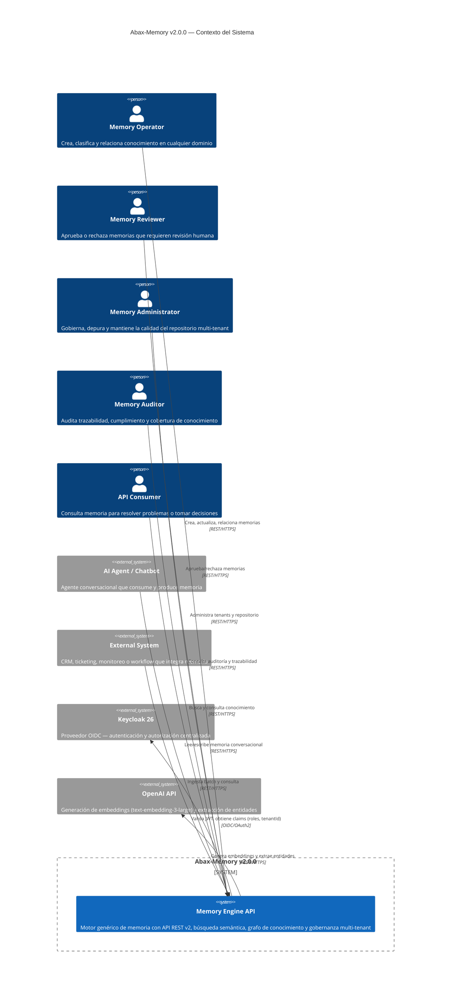
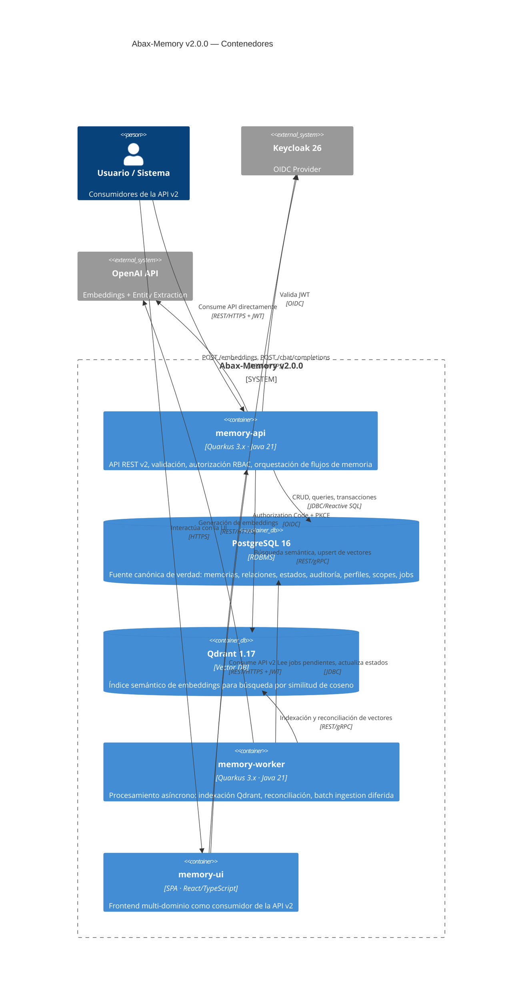
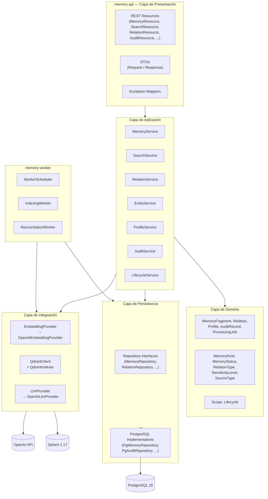
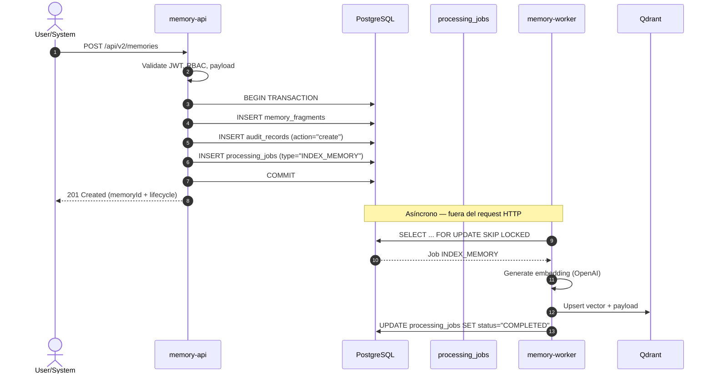
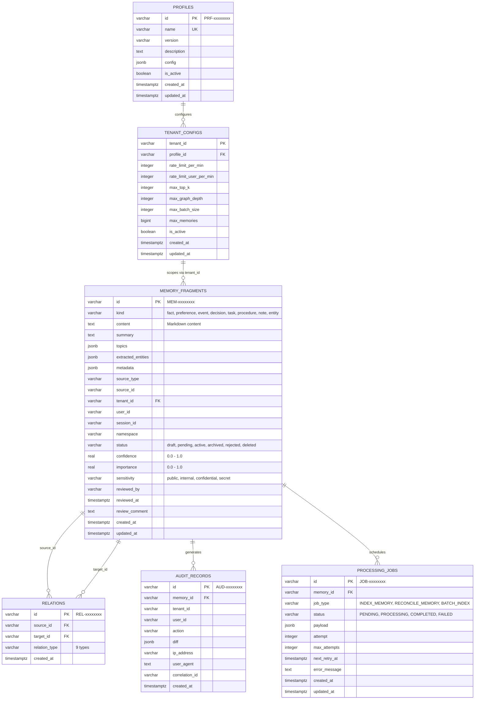
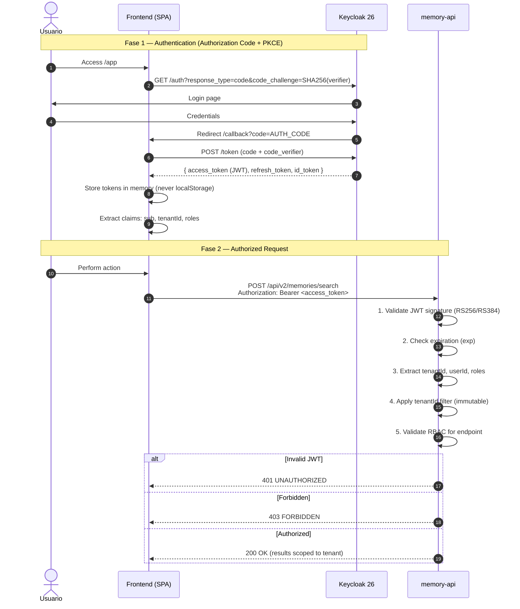

# Documento de Arquitectura — Abax-Memory v2.0.0

- **Fase**: 3 — Diseño Técnico (v2.0.0)
- **Entregable**: Documento de Arquitectura
- **Responsable**: solution-architect
- **Fecha**: 2026-05-03
- **Release**: v2.0.0
- **Estado**: Completado
- **Fuentes**:
  - `docs/entregables/v2/fase-2-analisis/especificacion-funcional.md` — modelo de datos, API, perfiles, scoping
  - `docs/entregables/v2/fase-0-descubrimiento/vision-producto.md` — criterios de éxito, reglas de negocio
  - `/root/proyectos-personales/administrador/PROPUESTA-ABAX-MEMORY-GENERICO.md` — propuesta técnica
  - `docs/entregables/v1/fase-3-diseno-tecnico/documento-arquitectura.md` — referencia v1
  - `docs/entregables/v2/fase-2-analisis/diagramas-de-proceso.md` — flujos de negocio
  - `docker-compose.yml` — infraestructura actual

---

## Tabla de Contenidos

1. [Visión Arquitectónica](#1-visión-arquitectónica)
2. [Stack Tecnológico](#2-stack-tecnológico)
3. [Arquitectura de Servicios](#3-arquitectura-de-servicios)
4. [Modelo de Datos Físico](#4-modelo-de-datos-físico)
5. [Integración con Qdrant](#5-integración-con-qdrant)
6. [Seguridad](#6-seguridad)
7. [API Design](#7-api-design)
8. [Observabilidad](#8-observabilidad)
9. [Estrategia de Testing](#9-estrategia-de-testing)
10. [CI/CD y Despliegue](#10-cicd-y-despliegue)
11. [ADRs — Architecture Decision Records](#11-adrs--architecture-decision-records)
12. [Matriz de Integraciones](#12-matriz-de-integraciones)
13. [Riesgos Técnicos](#13-riesgos-técnicos)
14. [Estimación de Complejidad](#14-estimación-de-complejidad)
15. [Glosario](#glosario)

---

## 1. Visión Arquitectónica

### 1.1 Principios Rectores

| # | Principio | Descripción | Trazabilidad |
|---|---|---|---|
| **P-01** | **API-First** | El producto se expone exclusivamente como API REST v2. El frontend y los SDKs son consumidores, no componentes acoplados al core. | R-06 |
| **P-02** | **English-Only Internals** | Todo identificador del sistema (kinds, estados, endpoints, enums, columnas, códigos de error) está en inglés. El contenido de memorias puede estar en cualquier idioma. | BR-010, R-04 |
| **P-03** | **Stateless & Horizontal Scaling** | La API no mantiene estado de sesión. Toda la sesión y autorización viajan en el JWT. Los pods de API son completamente intercambiables. | Infraestructura existente |
| **P-04** | **Containerized** | Todos los componentes del sistema se ejecutan en contenedores Docker, orquestados vía Docker Compose (desarrollo) o Kubernetes (producción). | infraestructura v1 reutilizable |
| **P-05** | **Observable by Default** | Logging estructurado JSON, métricas Prometheus, health checks y tracing distribuido desde R1. | CE-09 |
| **P-06** | **Multi-Tenant Isolation by Design** | El aislamiento entre tenants es garantizado por la capa de datos (discriminator column + índices), no por lógica de aplicación condicional. | BR-004, SC-03 |
| **P-07** | **Core Genérico + Perfiles de Dominio** | El core no contiene lógica específica de ningún dominio. Toda especialización se logra mediante perfiles de dominio configurables sin modificar código ni API. | R-03 |
| **P-08** | **Seguridad desde R1** | OIDC con Keycloak, JWT validado en cada request, RBAC de 5 roles, TLS extremo a extremo y secrets management externos. | R-07 |
| **P-09** | **Auditabilidad Completa** | Toda mutación genera un registro de auditoría inmutable con actor, timestamp, acción y diff. | R-08, CE-09 |

### 1.2 Diagrama C4 — Contexto



### 1.3 Diagrama C4 — Contenedores



> **Nota**: A diferencia de v1, no existe integración con Git/GitHub como fuente canónica. PostgreSQL es la única fuente de verdad para todos los datos operativos. Tampoco se incluyen Kafka, Neo4j ni Redis en el MVP (consistente con la decisión de v1).

---

## 2. Stack Tecnológico

### 2.1 Evaluación de Componentes (ADR Breve)

#### 2.1.1 Runtime: Quarkus 3.x

| Criterio | Quarkus 3.x (Recomendado) | Spring Boot 3.x | Micronaut 4.x |
|---|---|---|---|
| **Startup time** | Sub-second (native) / ~2s (JVM) | ~3-5s (JVM) | Sub-second (native) / ~2s (JVM) |
| **Memory footprint** | ~30 MB (native) / ~150 MB (JVM) | ~250 MB (JVM) | ~40 MB (native) / ~150 MB (JVM) |
| **Developer experience** | Dev mode con hot-reload, live coding | DevTools, amplio ecosistema | Hot-reload, pero menor comunidad |
| **Native compilation** | Maduro (GraalVM, Mandrel) | Spring Native (mejorando) | Maduro (GraalVM) |
| **Reactive support** | Mutiny + RESTEasy Reactive | WebFlux / Project Reactor | Reactor + Netty |
| **OIDC integration** | Quarkus OIDC (maduro, Keycloak-first) | Spring Security OAuth2 | Micronaut Security |
| **Qdrant client** | REST client nativo + gRPC | REST client + gRPC | REST client + gRPC |
| **Equipo / Legado** | Stack v1 probado en producción | Nuevo para el equipo | Nuevo para el equipo |
| **Documentación** | Excelente, guías oficiales | Excelente, enorme comunidad | Buena, en crecimiento |

**Decisión**: **Quarkus 3.x** — Justificación: el stack v1 ya demostró su viabilidad en producción con Quarkus. Startup sub-second en native, integración nativa con Keycloak via `quarkus-oidc`, RESTEasy Reactive, soporte maduro para PostgreSQL reactive y Qdrant. Cambiar a Spring Boot o Micronaut no aporta ventajas que justifiquen la curva de migración y la pérdida del conocimiento operativo acumulado.

#### 2.1.2 Base de Datos: PostgreSQL 16

**Decisión**: **PostgreSQL 16** — Justificación: PostgreSQL es la fuente canónica de verdad operativa. Soporte nativo para JSONB (metadatos libres), índices GIN para búsqueda full-text, CTEs recursivas para navegación de grafo básico, particionamiento por `tenant_id`, extensión `pgvector` para búsqueda híbrida futura, y `FOR UPDATE SKIP LOCKED` para job queue sin dependencias externas. Probado en v1 con rendimiento satisfactorio. No se justifica cambiar a MySQL/MariaDB (menor soporte JSONB) ni a bases NoSQL (pérdida de integridad transaccional).

#### 2.1.3 Vector DB: Qdrant 1.17

| Criterio | Qdrant (Recomendado) | Milvus | Weaviate | PGVector |
|---|---|---|---|---|
| **Rendimiento (top-K)** | Excelente, sub-10ms | Excelente, sub-10ms | Muy bueno, ~20ms | Bueno, ~50-100ms |
| **Filtros + vectores** | Payload filters nativos, muy eficientes | Scalar filters con índices | Filtros GraphQL | WHERE sobre índice IVFFlat/HNSW |
| **Operacionalidad** | Binario único, sin dependencias | Depende de etcd, MinIO, Pulsar | Depende de módulos internos | Sin dependencia extra (extensión PostgreSQL) |
| **Escalado** | Colecciones, sharding nativo | Particionamiento avanzado | Replicación multi-nodo | Limitado a escala PostgreSQL |
| **SDK y API** | REST + gRPC, SDK Java maduro | REST + gRPC, SDK Java | GraphQL + REST, SDK Java | SQL directo |
| **Batch indexing** | Upsert masivo eficiente | Bulk insert optimizado | Batch import | INSERT batch |
| **Comunidad/Adopción** | Alta, growing fast | Muy alta, CNCF incubating | Alta | En crecimiento |
| **Legado v1** | Probado en producción | Nuevo | Nuevo | Nuevo |

**Decisión**: **Qdrant 1.17** — Justificación: Qdrant está probado en producción con v1, ofrece payload filters nativos que son críticos para combinar búsqueda semántica con filtros estructurados (kinds, statuses, topics, entities, sensitivity), su API REST + gRPC es simple de operar, y el binario único simplifica el despliegue. Milvus ofrece más features pero con mucha mayor complejidad operativa (etcd + MinIO + Pulsar). PGVector es atractivo por eliminar una dependencia, pero su rendimiento en top-K con filtros multidimensionales y su escalabilidad para 100K+ vectores no está al nivel de Qdrant. Se deja PGVector como alternativa evaluable en release futuro si la simplicidad operativa pesa más que el rendimiento puro.

#### 2.1.4 LLM / Embeddings: OpenAI (base)

| Criterio | OpenAI text-embedding-3-large (Recomendado) | OpenAI text-embedding-3-small | Cohere Embed v3 | Modelo local (BGE-large, E5) |
|---|---|---|---|---|
| **Calidad (MTEB score)** | Excelente (top-tier) | Muy buena | Excelente | Muy buena (competitiva) |
| **Dimensión** | 3072 (o 256/1024 truncado) | 1536 (o 512 truncado) | 1024 | 1024 (BGE) |
| **Latencia (por texto)** | ~100-300ms | ~50-150ms | ~100-300ms | ~20-50ms (GPU) |
| **Costo (1M tokens)** | ~$0.13 | ~$0.02 | ~$0.10 | $0 (infra propia) |
| **Batch support** | Excelente, API batch | Excelente | Bueno | Depende de implementación |
| **Privacidad** | Datos van a API externa | Datos van a API externa | Datos van a API externa | Datos permanecen locales |
| **Operacionalidad** | Sin infraestructura propia | Sin infraestructura propia | Sin infraestructura propia | Requiere GPU y mantenimiento |
| **Legado v1** | Probado en producción | No usado | No usado | No usado |

**Decisión**: **OpenAI text-embedding-3-large** como base, con abstracción para permitir cambio futuro — Justificación: la calidad de embeddings de OpenAI es la referencia del mercado (top-tier MTEB). La dimensión 3072 es la probada en v1 con excelentes resultados (NDCG@10 0.920, Recall@10 0.965). Se implementa una abstracción `EmbeddingProvider` (puerto/adapter) que permite cambiar a Cohere, modelo local (BGE-large-en-1.5 via HuggingFace TEI), o cualquier otro proveedor sin modificar la lógica de negocio. La decisión de qué proveedor usar es configurable por tenant en releases posteriores, aunque el MVP usará OpenAI uniformemente.

> **ADR-003 y ADR-004** (ver §11) formalizan estas decisiones con análisis detallado de alternativas.

#### 2.1.5 Auth: Keycloak 26

**Decisión**: **Keycloak 26** — Justificación: Keycloak está probado en producción con v1. Soporte completo para OIDC/OAuth2, JWT con claims custom (`tenantId`, roles en `realm_access.roles`), Authorization Code Flow + PKCE para frontend SPA, Client Credentials para integraciones server-to-server. La configuración actual (`docker-compose.yml`: Keycloak 26.1, realm `abax-memory`, client `abax-memory-api`) es directamente reutilizable. Alternativas como Auth0 o Azure AD añadirían dependencia de un tercero externo sin ventajas funcionales para el MVP. La decisión de mantener Keycloak como proveedor OIDC no bloquea migración futura: la abstracción via Quarkus OIDC hace que cambiar de provider sea cuestión de configuración, no de código.

### 2.2 Resumen del Stack MVP

| Capa | Tecnología | Versión | Rol | Origen |
|---|---|---|---|---|
| **Runtime** | Quarkus | 3.x (LTS) | Backend API + Worker | v1 (reutilizado) |
| **Lenguaje** | Java | 21 (LTS) | Código fuente | v1 (reutilizado) |
| **Base de Datos** | PostgreSQL | 16 (Alpine) | Fuente canónica de verdad | v1 (reutilizado) |
| **Vector DB** | Qdrant | 1.17 | Índice semántico | v1 (reutilizado) |
| **Auth (OIDC)** | Keycloak | 26.1 | Autenticación + RBAC | v1 (reutilizado) |
| **LLM / Embeddings** | OpenAI text-embedding-3-large | — (API) | Generación de embeddings | v1 (reutilizado) |
| **LLM / Validation** | OpenAI GPT-4o | — (API) | Extracción de entidades, validación semántica | v1 (reutilizado) |
| **Frontend** | React + TypeScript | 19.x | UI multi-dominio | Nuevo v2 |
| **Contenedores** | Docker / Podman | latest | Empaquetado y despliegue | v1 (reutilizado) |
| **Orquestación** | Docker Compose / Kubernetes | — | Desarrollo / Producción | v1 (reutilizado) |
| **CI/CD** | GitHub Actions | — | Build, test, push, deploy | v1 (reutilizado) |
| **Registro** | GHCR (GitHub Container Registry) | — | Imágenes de contenedor | v1 (reutilizado) |

### 2.3 Componentes Explícitamente Excluidos del MVP

| Componente | Motivo de exclusión | Consideración futura |
|---|---|---|
| **Kafka** | No requerido para el MVP; la asincronía se resuelve con job queue en PostgreSQL + worker Quarkus. | Evaluar en R2 si el volumen de ingestion batch o eventos de dominio lo justifica. |
| **Redis** | No requerido para el MVP; cache y locks distribuidos no son bloqueantes funcionales. | Evaluar en R2 para cache de búsquedas frecuentes y rate-limiting distribuido. |
| **Neo4j** | El grafo de relaciones se resuelve en PostgreSQL con CTEs recursivas; la expansión de grafo del MVP (depth ≤ 5) no requiere base de grafos especializada. | Evaluar si las queries multi-hop complejas o la visualización de grafos grandes lo justifican. |
| **Git/GitHub** | v2 abandona el modelo de v1 donde Git era fuente canónica del contenido. PostgreSQL es ahora la única fuente de verdad. La revisión humana se realiza via API (`POST /review`), no via Pull Request. | No se prevé reintroducir; la decisión es arquitectónica y definitiva para v2. |

---

## 3. Arquitectura de Servicios

### 3.1 Patrón Arquitectónico: Modular Monolith (Modulith)

**Decisión**: **Monolito Modular** con separación estricta por paquetes y contratos internos.

**Justificación**: El MVP debe priorizar velocidad de desarrollo, simplicidad operativa (un solo artefacto, un solo proceso de deploy) y facilidad de testing end-to-end. Un monolito modular bien diseñado permite:

- **Separación lógica** entre bounded contexts (memories, search, profiles, tenants, audit) mediante paquetes Java con interfaces explícitas.
- **Evolución a microservicios** si la carga o la organización lo requiere: los contratos internos ya existen, solo se extraen a servicios independientes.
- **Testing simplificado**: un solo proceso, sin necesidad de contract tests entre servicios.
- **Transaccionalidad**: operaciones que modifican PostgreSQL + Qdrant se coordinan más fácilmente en un solo proceso.

El sistema se despliega como dos artefactos:
1. **`memory-api`**: API REST v2 — maneja todas las operaciones síncronas (CRUD, búsqueda, revisión, consulta).
2. **`memory-worker`**: Procesamiento asíncrono — indexación Qdrant, reconciliación, batch ingestion diferida.

Ambos comparten el mismo código base (`backend-quarkus/`) pero se ensamblan como módulos Quarkus separados con perfiles distintos.

### 3.2 Estructura de Paquetes

```
com.abax.memory
├── api                              # Módulo: memory-api
│   ├── resource                     #   REST endpoints (JAX-RS)
│   │   ├── MemoryResource.java     #     CRUD + search + graph + review
│   │   ├── RelationResource.java   #     CRUD de relaciones
│   │   ├── EntityResource.java     #     Extracción y consulta de entidades
│   │   ├── ProfileResource.java    #     CRUD de perfiles de dominio
│   │   ├── TenantResource.java     #     Stats y administración de tenants
│   │   ├── AuditResource.java      #     Consulta de auditoría
│   │   ├── HealthResource.java     #     Health checks
│   │   └── OpenApiResource.java    #     OpenAPI spec
│   ├── dto                          #   Data Transfer Objects
│   │   ├── request/
│   │   │   ├── CreateMemoryRequest.java
│   │   │   ├── UpdateMemoryRequest.java
│   │   │   ├── SearchMemoryRequest.java
│   │   │   ├── ReviewMemoryRequest.java
│   │   │   ├── CreateRelationRequest.java
│   │   │   ├── BatchIngestRequest.java
│   │   │   └── ...
│   │   └── response/
│   │       ├── MemoryResponse.java
│   │       ├── SearchResultResponse.java
│   │       ├── GraphResponse.java
│   │       ├── EntityResponse.java
│   │       ├── ApiErrorResponse.java
│   │       └── ...
│   ├── exception                    #   Exception mappers
│   │   ├── ApiException.java
│   │   ├── ApiExceptionMapper.java
│   │   └── ValidationExceptionMapper.java
│   └── config                       #   Configuración Quarkus
│       ├── OpenApiConfig.java
│       ├── JacksonConfig.java
│       └── RateLimitConfig.java
│
├── service                          # Capa de aplicación (compartida)
│   ├── MemoryService.java          #   Lógica de negocio de memorias
│   ├── SearchService.java          #   Orquestación de búsqueda semántica + filtros
│   ├── RelationService.java        #   Gestión de relaciones + navegación de grafo
│   ├── EntityService.java          #   Extracción e indexación de entidades
│   ├── ProfileService.java         #   Gestión de perfiles de dominio
│   ├── AuditService.java           #   Registro y consulta de auditoría
│   ├── TenantService.java          #   Administración de tenants
│   └── LifecycleService.java       #   Máquina de estados del ciclo de vida
│
├── domain                           # Modelo de dominio (compartido)
│   ├── MemoryFragment.java         #   Entidad central
│   ├── Relation.java               #   Value object de relación
│   ├── MemoryKind.java             #   Enum: 8 tipos
│   ├── MemoryStatus.java           #   Enum: 6 estados
│   ├── RelationType.java           #   Enum: 9 tipos de relación
│   ├── SensitivityLevel.java       #   Enum: 4 niveles
│   ├── SourceType.java             #   Enum: 6 tipos de fuente
│   ├── Scope.java                  #   Value object: tenantId, userId, sessionId, namespace
│   ├── Lifecycle.java              #   Value object: status, confidence, importance, sensitivity, review
│   ├── Profile.java                #   Entidad de perfil de dominio
│   ├── AuditRecord.java            #   Entidad de auditoría
│   └── ProcessingJob.java          #   Entidad de job asíncrono
│
├── repository                       # Puertos de persistencia (compartido)
│   ├── MemoryRepository.java       #   Interfaz de repositorio de memorias
│   ├── RelationRepository.java     #   Interfaz de repositorio de relaciones
│   ├── EntityRepository.java       #   Interfaz de repositorio de entidades
│   ├── ProfileRepository.java      #   Interfaz de repositorio de perfiles
│   ├── AuditRepository.java        #   Interfaz de repositorio de auditoría
│   ├── ProcessingJobRepository.java #  Interfaz de repositorio de jobs
│   └── postgres/                    #   Implementaciones PostgreSQL
│       ├── PgMemoryRepository.java
│       ├── PgRelationRepository.java
│       ├── PgEntityRepository.java
│       ├── PgProfileRepository.java
│       ├── PgAuditRepository.java
│       └── PgProcessingJobRepository.java
│
├── integration                      # Adaptadores de sistemas externos
│   ├── embedding/                   #   Abstracción de motor de embeddings
│   │   ├── EmbeddingProvider.java  #     Puerto (interfaz)
│   │   ├── OpenAiEmbeddingProvider.java # Adaptador OpenAI
│   │   └── EmbeddingConfig.java
│   ├── qdrant/                      #   Integración con Qdrant
│   │   ├── QdrantClient.java       #     Cliente REST/gRPC
│   │   ├── QdrantConfig.java       #     Configuración
│   │   └── QdrantIndexer.java      #     Indexación y búsqueda
│   ├── llm/                         #   Abstracción de LLM
│   │   ├── LlmProvider.java        #     Puerto (interfaz)
│   │   ├── OpenAiLlmProvider.java  #     Adaptador OpenAI
│   │   └── LlmConfig.java
│   └── oidc/                        #   Integración con Keycloak
│       ├── TenantIdFilter.java     #     Filtro automático por tenantId
│       └── RoleBasedAccessControl.java # Validador RBAC
│
├── security                         # Seguridad y autorización
│   ├── MemoryRoles.java            #   Constantes de roles
│   ├── SecurityContext.java        #   Contexto de seguridad (tenantId, userId, roles)
│   └── TenantIsolation.java       #   Lógica de aislamiento multi-tenant
│
├── worker                           # Módulo: memory-worker
│   ├── WorkerScheduler.java        #   Scheduler de jobs
│   ├── IndexingWorker.java         #   Worker de indexación Qdrant
│   ├── ReconciliationWorker.java   #   Worker de reconciliación
│   └── BatchIngestionWorker.java   #   Worker de ingesta batch (Should)
│
└── common                           # Utilidades compartidas
    ├── IdGenerator.java            #   Generador de IDs (MEM-xxxxxxxx, REL-xxxxxxxx, AUD-xxxxxxxx)
    ├── CorrelationId.java          #   Trace ID para logging y tracing
    ├── TimeProvider.java           #   Abstracción de reloj (testeable)
    └── validation/                  #   Validadores
        ├── MemoryValidator.java
        ├── ScopeValidator.java
        └── LifecycleValidator.java
```

### 3.3 Diagrama de Capas



### 3.4 Manejo de Transacciones

Abax-Memory v2 utiliza un modelo de **consistencia eventual controlada** con PostgreSQL como fuente de verdad transaccional y Qdrant como índice derivado regenerable:

1. **Transacciones ACID en PostgreSQL**: toda operación que modifica el estado de una memoria (crear, actualizar, cambiar estado, soft-delete, crear/eliminar relación) ocurre dentro de una transacción PostgreSQL. Esto garantiza consistencia entre `memory_fragments`, `relations`, `audit_records` y `processing_jobs`.

2. **Indexación eventual en Qdrant**: el embedding y la indexación en Qdrant son operaciones que ocurren de forma asíncrona tras confirmar la transacción en PostgreSQL. Se registra un `processing_job` de tipo `INDEX_MEMORY` y el `memory-worker` lo procesa.

3. **Idempotencia**: los jobs son idempotentes por `(memory_id, job_type)`. Si un job falla, se reintenta con backoff exponencial. Si un job se procesa dos veces (raro pero posible), el upsert en Qdrant es naturalmente idempotente.

4. **Degradación controlada**: si Qdrant no está disponible, la API sigue funcionando para operaciones CRUD (que solo dependen de PostgreSQL). Las búsquedas semánticas fallan con `503 DATABASE_UNAVAILABLE`. El worker reintenta jobs pendientes cuando Qdrant se recupera.

5. **Sin transacciones distribuidas**: no se usa two-phase commit (2PC) ni sagas complejas. PostgreSQL es el sistema de registro; Qdrant es regenerable desde PostgreSQL.



### 3.5 Estimación de Complejidad por Componente

| Componente | Responsabilidad | Complejidad | Riesgo |
|---|---|---|---|
| MemoryResource | CRUD REST de memorias | **Media** | Bajo — patrón conocido |
| SearchService | Orquestación búsqueda semántica + filtros + re-rank + graph expand | **Alta** | Alto — integración Qdrant + filtros combinados + performance |
| LifecycleService | Máquina de estados (6 estados, transiciones, guard conditions) | **Alta** | Medio — lógica de reglas de negocio, BR-005, BR-006 |
| RelationService | CRUD de relaciones + navegación de grafo (BFS hasta depth=5) | **Media** | Medio — performance de CTEs recursivas |
| EntityService | Extracción via OpenAI + búsqueda de entidades | **Media** | Bajo — abstracción existente |
| ProfileService | CRUD de perfiles de dominio | **Baja** | Bajo — CRUD sobre configuración JSON |
| QdrantIndexer | Upsert/búsqueda de vectores con payload filters | **Alta** | Medio — operación conocida de v1 |
| EmbeddingProvider | Abstracción de motor de embeddings | **Baja** | Bajo — interfaz simple |
| TenantIsolation | Filtro automático tenantId + 404 cross-tenant | **Media** | Alto — seguridad crítica |
| AuditService | Registro inmutable de toda mutación | **Media** | Bajo — append-only |
| ProcessingJobRepository | Job queue con FOR UPDATE SKIP LOCKED | **Media** | Medio — idempotencia y retries |
| WorkerScheduler | Polling de jobs + despacho a workers | **Media** | Medio — concurrencia |

---

## 4. Modelo de Datos Físico

### 4.1 Esquema PostgreSQL

#### 4.1.1 Tabla Principal: `memory_fragments`

```sql
CREATE TABLE memory_fragments (
    id              VARCHAR(12)    PRIMARY KEY,           -- MEM-xxxxxxxx
    kind            VARCHAR(20)    NOT NULL,              -- fact, preference, event, decision, task, procedure, note, entity
    content         TEXT           NOT NULL,              -- Markdown completo
    summary         TEXT,                                  -- Resumen generado o provisto
    topics          JSONB          DEFAULT '[]',           -- Array de strings
    extracted_entities JSONB       DEFAULT '[]',           -- Array de strings
    metadata        JSONB          DEFAULT '{}',           -- Objeto key-value libre
    source_type     VARCHAR(20),                           -- conversation, document, api, workflow, manual, case
    source_id       VARCHAR(255),                          -- ID externo
    tenant_id       VARCHAR(100)   NOT NULL,              -- scope.tenantId
    user_id         VARCHAR(255),                          -- scope.userId
    session_id      VARCHAR(255),                          -- scope.sessionId
    namespace       VARCHAR(255),                          -- scope.namespace
    status          VARCHAR(20)    NOT NULL DEFAULT 'draft', -- draft, pending, active, archived, rejected, deleted
    confidence      REAL           NOT NULL DEFAULT 0.5,  -- [0.0, 1.0]
    importance      REAL           NOT NULL DEFAULT 0.5,  -- [0.0, 1.0]
    sensitivity     VARCHAR(20)    NOT NULL DEFAULT 'internal', -- public, internal, confidential, secret
    reviewed_by     VARCHAR(255),                          -- Usuario que revisó
    reviewed_at     TIMESTAMPTZ,                            -- Timestamp de revisión
    review_comment  TEXT,                                  -- Comentario del revisor
    created_at      TIMESTAMPTZ    NOT NULL DEFAULT NOW(),
    updated_at      TIMESTAMPTZ    NOT NULL DEFAULT NOW()
);
```

#### 4.1.2 Índices

```sql
-- Índice primario multi-tenant: toda búsqueda filtra por tenant_id
CREATE INDEX idx_memories_tenant_id ON memory_fragments (tenant_id);

-- Búsqueda por status (filtro más común: active)
CREATE INDEX idx_memories_tenant_status ON memory_fragments (tenant_id, status);

-- Búsqueda por kind dentro del tenant
CREATE INDEX idx_memories_tenant_kind ON memory_fragments (tenant_id, kind);

-- Búsqueda por usuario (esencial para perfil Agent)
CREATE INDEX idx_memories_tenant_user ON memory_fragments (tenant_id, user_id);

-- Búsqueda por sesión (perfil Agent)
CREATE INDEX idx_memories_tenant_session ON memory_fragments (tenant_id, session_id);

-- Búsqueda por namespace
CREATE INDEX idx_memories_tenant_namespace ON memory_fragments (tenant_id, namespace);

-- Búsqueda full-text sobre content (para búsqueda híbrida futuro)
CREATE INDEX idx_memories_content_fts ON memory_fragments USING GIN (to_tsvector('english', content));

-- Búsqueda por topics (array JSONB)
CREATE INDEX idx_memories_topics ON memory_fragments USING GIN (topics);

-- Búsqueda por entities extraídas
CREATE INDEX idx_memories_entities ON memory_fragments USING GIN (extracted_entities);

-- Búsqueda por rango de fechas
CREATE INDEX idx_memories_created_at ON memory_fragments (tenant_id, created_at DESC);

-- Búsqueda por rango de importance
CREATE INDEX idx_memories_tenant_importance ON memory_fragments (tenant_id, importance);

-- Búsqueda por rango de confidence
CREATE INDEX idx_memories_tenant_confidence ON memory_fragments (tenant_id, confidence);

-- Búsqueda por sensitivity
CREATE INDEX idx_memories_tenant_sensitivity ON memory_fragments (tenant_id, sensitivity);

-- Índice compuesto para búsqueda con filtros combinados frecuentes
CREATE INDEX idx_memories_search ON memory_fragments (tenant_id, status, kind, importance, confidence);
```

#### 4.1.3 Constraints

```sql
-- Validación de kind
ALTER TABLE memory_fragments ADD CONSTRAINT chk_memories_kind
    CHECK (kind IN ('fact', 'preference', 'event', 'decision', 'task', 'procedure', 'note', 'entity'));

-- Validación de status
ALTER TABLE memory_fragments ADD CONSTRAINT chk_memories_status
    CHECK (status IN ('draft', 'pending', 'active', 'archived', 'rejected', 'deleted'));

-- Validación de sensitivity
ALTER TABLE memory_fragments ADD CONSTRAINT chk_memories_sensitivity
    CHECK (sensitivity IN ('public', 'internal', 'confidential', 'secret'));

-- Validación de source_type
ALTER TABLE memory_fragments ADD CONSTRAINT chk_memories_source_type
    CHECK (source_type IS NULL OR source_type IN ('conversation', 'document', 'api', 'workflow', 'manual', 'case'));

-- Validación de rangos
ALTER TABLE memory_fragments ADD CONSTRAINT chk_memories_confidence_range
    CHECK (confidence >= 0.0 AND confidence <= 1.0);

ALTER TABLE memory_fragments ADD CONSTRAINT chk_memories_importance_range
    CHECK (importance >= 0.0 AND importance <= 1.0);
```

#### 4.1.4 Tabla: `relations`

```sql
CREATE TABLE relations (
    id              VARCHAR(12)    PRIMARY KEY,           -- REL-xxxxxxxx
    source_id       VARCHAR(12)    NOT NULL REFERENCES memory_fragments(id) ON DELETE CASCADE,
    target_id       VARCHAR(12)    NOT NULL REFERENCES memory_fragments(id) ON DELETE CASCADE,
    relation_type   VARCHAR(20)    NOT NULL,              -- related_to, depends_on, caused_by, ...
    created_at      TIMESTAMPTZ    NOT NULL DEFAULT NOW(),

    -- No se permiten auto-relaciones
    CONSTRAINT chk_relations_no_self CHECK (source_id <> target_id),

    -- No se permiten relaciones duplicadas (mismo source + target + type)
    CONSTRAINT uq_relations UNIQUE (source_id, target_id, relation_type),

    -- Validación del tipo de relación
    CONSTRAINT chk_relations_type CHECK (relation_type IN (
        'related_to', 'depends_on', 'caused_by', 'resolves',
        'contradicts', 'supports', 'mentions', 'belongs_to', 'supersedes'
    ))
);

CREATE INDEX idx_relations_source ON relations (source_id);
CREATE INDEX idx_relations_target ON relations (target_id);
CREATE INDEX idx_relations_type ON relations (source_id, relation_type);
```

#### 4.1.5 Tabla: `audit_records`

```sql
CREATE TABLE audit_records (
    id              VARCHAR(12)    PRIMARY KEY,           -- AUD-xxxxxxxx
    memory_id       VARCHAR(12)    NOT NULL,
    tenant_id       VARCHAR(100)   NOT NULL,
    user_id         VARCHAR(255)   NOT NULL,
    action          VARCHAR(30)    NOT NULL,              -- create, update, review_approve, review_reject, ...
    diff            JSONB          NOT NULL,              -- {"before": {...}, "after": {...}}
    ip_address      VARCHAR(45),                          -- IPv4 o IPv6
    user_agent      TEXT,
    correlation_id  VARCHAR(64),                          -- traceId para correlación
    created_at      TIMESTAMPTZ    NOT NULL DEFAULT NOW()
);

CREATE INDEX idx_audit_memory_id ON audit_records (memory_id);
CREATE INDEX idx_audit_tenant_id ON audit_records (tenant_id);
CREATE INDEX idx_audit_user_id ON audit_records (user_id);
CREATE INDEX idx_audit_action ON audit_records (action);
CREATE INDEX idx_audit_created_at ON audit_records (tenant_id, created_at DESC);
```

#### 4.1.6 Tabla: `profiles`

```sql
CREATE TABLE profiles (
    id              VARCHAR(12)    PRIMARY KEY,           -- PRF-xxxxxxxx
    name            VARCHAR(100)   NOT NULL UNIQUE,
    version         VARCHAR(10)    NOT NULL DEFAULT '1.0',
    description     TEXT,
    config          JSONB          NOT NULL,              -- Configuración completa del perfil (JSON)
    is_active       BOOLEAN        NOT NULL DEFAULT true,
    created_at      TIMESTAMPTZ    NOT NULL DEFAULT NOW(),
    updated_at      TIMESTAMPTZ    NOT NULL DEFAULT NOW()
);
```

#### 4.1.7 Tabla: `tenant_configs`

```sql
CREATE TABLE tenant_configs (
    tenant_id               VARCHAR(100)   PRIMARY KEY,
    profile_id              VARCHAR(12)    REFERENCES profiles(id),
    rate_limit_per_min      INTEGER        NOT NULL DEFAULT 1000,
    rate_limit_user_per_min INTEGER        NOT NULL DEFAULT 300,
    max_top_k               INTEGER        NOT NULL DEFAULT 100,
    max_graph_depth         INTEGER        NOT NULL DEFAULT 5,
    max_batch_size          INTEGER        NOT NULL DEFAULT 100,
    max_memories            BIGINT,                         -- NULL = ilimitado
    is_active               BOOLEAN        NOT NULL DEFAULT true,
    created_at              TIMESTAMPTZ    NOT NULL DEFAULT NOW(),
    updated_at              TIMESTAMPTZ    NOT NULL DEFAULT NOW()
);
```

#### 4.1.8 Tabla: `processing_jobs`

```sql
CREATE TABLE processing_jobs (
    id              VARCHAR(12)    PRIMARY KEY,           -- JOB-xxxxxxxx
    memory_id       VARCHAR(12)    NOT NULL,
    job_type        VARCHAR(30)    NOT NULL,              -- INDEX_MEMORY, RECONCILE_MEMORY, BATCH_INDEX
    status          VARCHAR(20)    NOT NULL DEFAULT 'PENDING', -- PENDING, PROCESSING, COMPLETED, FAILED
    payload         JSONB,
    attempt         INTEGER        NOT NULL DEFAULT 0,
    max_attempts    INTEGER        NOT NULL DEFAULT 3,
    next_retry_at   TIMESTAMPTZ,
    error_message   TEXT,
    created_at      TIMESTAMPTZ    NOT NULL DEFAULT NOW(),
    updated_at      TIMESTAMPTZ    NOT NULL DEFAULT NOW()
);

CREATE INDEX idx_jobs_status_next_retry ON processing_jobs (status, next_retry_at)
    WHERE status IN ('PENDING', 'FAILED');
CREATE INDEX idx_jobs_memory_id ON processing_jobs (memory_id);
```

### 4.2 Diagrama ER



### 4.3 Estrategia de Migraciones

- **Herramienta**: **Flyway** (mismo que v1, probado en producción).
- **Ubicación**: `backend-quarkus/src/main/resources/db/migration/`
- **Versionado**: `V{version}__{description}.sql`
  - `V1__create_memory_fragments.sql`
  - `V2__create_relations.sql`
  - `V3__create_audit_records.sql`
  - `V4__create_profiles.sql`
  - `V5__create_tenant_configs.sql`
  - `V6__create_processing_jobs.sql`
  - `V7__add_indexes.sql`
- **Ejecución**: automática al iniciar la aplicación Quarkus (`quarkus.flyway.migrate-at-start=true`).
- **Rollback**: Flyway no soporta rollback automático. Las migraciones son append-only. En caso de error, se genera una nueva migración correctiva (patrón expand-contract).

### 4.4 Política de Soft-Delete

- **Mecanismo**: `lifecycle.status = 'deleted'`. No se eliminan filas físicamente en el MVP.
- **Visibilidad**: registros con `status = 'deleted'` se excluyen automáticamente de todas las queries estándar. Solo `memory-admin` puede consultarlos mediante endpoint administrativo.
- **Relaciones**: cuando una memoria es soft-deleteada, sus relaciones se preservan pero se marcan como huérfanas (el target `deleted` no se expande en el grafo).
- **Qdrant**: el vector se preserva en Qdrant pero se excluye de resultados por el filtro de status.
- **Purga física**: endpoint administrativo futuro para `memory-admin` (fuera del MVP).
- **Retención**: los registros soft-deleteados se conservan indefinidamente en el MVP. Una política de purga automática (ej. > 90 días) puede configurarse en releases posteriores.

### 4.5 Índices para Búsqueda Semántica (PGVector — Futuro)

El MVP no utiliza `pgvector` porque Qdrant es el motor de búsqueda vectorial primario. Sin embargo, se deja preparada la infraestructura para búsqueda híbrida en releases futuras:

```sql
-- Extensión pgvector (requiere instalación previa)
-- CREATE EXTENSION IF NOT EXISTS vector;

-- Columna de embedding (NO se crea en MVP, solo como referencia futura)
-- ALTER TABLE memory_fragments ADD COLUMN embedding vector(3072);

-- Índice HNSW para búsqueda vectorial en PostgreSQL
-- CREATE INDEX idx_memories_embedding_hnsw ON memory_fragments
--     USING hnsw (embedding vector_cosine_ops)
--     WITH (m = 16, ef_construction = 200);
```

---

## 5. Integración con Qdrant

### 5.1 Estrategia de Embeddings

| Parámetro | Valor | Justificación |
|---|---|---|
| **Modelo** | OpenAI `text-embedding-3-large` | Mejor calidad MTEB, probado en v1 (NDCG@10 0.920) |
| **Dimensión** | 3072 | Máxima calidad; puede truncarse a 1024 o 256 si se prioriza latencia/almacenamiento |
| **Input** | `content` (Markdown completo) | Fuente semántica principal |
| **Batch size (indexación)** | 20 textos por request | Balance entre latencia y throughput de la API OpenAI |
| **Batch size (re-indexación masiva)** | 100 textos por lote | Procesamiento asíncrono vía worker |
| **Rate limiting (OpenAI)** | Respetar `X-RateLimit-*` headers | Evitar `429 Too Many Requests` |

### 5.2 Configuración de Colección Qdrant

```
Collection name: abax_memories_v2
Vector size: 3072
Distance: Cosine
Index type: HNSW
HNSW parameters:
  - m: 16 (balance calidad-rendimiento)
  - ef_construct: 100 (construcción de índice)
  - ef_search: 50 (búsqueda, configurable)
Payload schema:
  - memory_id: keyword (índice primario)
  - tenant_id: keyword (filtro obligatorio)
  - kind: keyword
  - status: keyword
  - topics: keyword[]
  - entities: keyword[]
  - importance: float
  - confidence: float
  - sensitivity: keyword
  - created_at: datetime
```

### 5.3 Sincronización PostgreSQL ↔ Qdrant

```mermaid
flowchart LR
    subgraph PG["PostgreSQL — Fuente de Verdad"]
        MEM["memory_fragments"]
        JOBS["processing_jobs"]
    end

    subgraph API["memory-api"]
        CREATE["POST/PATCH/DELETE<br/>memoria"]
    end

    subgraph WRK["memory-worker"]
        POLL["Poll jobs pendientes<br/>(FOR UPDATE SKIP LOCKED)"]
        EMBED["Generar embedding<br/>(OpenAI API)"]
        UPSERT["Upsert en Qdrant"]
    end

    subgraph QD["Qdrant — Índice Vectorial"]
        VECTORS["Colección<br/>abax_memories_v2"]
    end

    API -->|1. INSERT/UPDATE memory_fragments| MEM
    API -->|2. INSERT processing_jobs<br/>(INDEX_MEMORY)| JOBS
    WRK -->|3. SELECT pending jobs| JOBS
    WRK -->|4. Read content from| MEM
    WRK -->|5. Generate embedding| EMBED
    WRK -->|6. Upsert vector + payload| VECTORS
    WRK -->|7. UPDATE job COMPLETED| JOBS
```

**Reglas de sincronización**:

| Evento | Acción en PostgreSQL | Acción en Qdrant | Trigger |
|---|---|---|---|
| **Crear memoria** | INSERT `memory_fragments` + INSERT `processing_jobs` (INDEX_MEMORY) | Worker genera embedding y upsert | Síncrono: job se crea en misma transacción |
| **Actualizar content** | UPDATE `memory_fragments.content` + INSERT `processing_jobs` (INDEX_MEMORY) | Worker regenera embedding y upsert (sobrescribe) | Síncrono: job se crea en misma transacción |
| **Actualizar metadata/topics** | UPDATE `memory_fragments` (solo metadatos) | Worker actualiza payload en Qdrant (sin regenerar embedding) | Síncrono: job RECONCILE_MEMORY |
| **Soft-delete** | UPDATE `memory_fragments.status = 'deleted'` | Worker actualiza payload (status=deleted) → excluido de búsqueda | Síncrono: job RECONCILE_MEMORY |
| **Cambiar status** | UPDATE `memory_fragments.status` | Worker actualiza payload → visibilidad cambia según status | Síncrono: job RECONCILE_MEMORY |

### 5.4 Estrategia de Re-Indexación

La re-indexación masiva es una operación administrativa (Should para MVP) que permite regenerar todos los embeddings de un tenant o del repositorio completo. Esto es necesario cuando:

1. Se cambia el motor de embeddings (ej. de OpenAI a Cohere, o a modelo local).
2. Se cambia la dimensión de los vectores (ej. de 3072 a 1024).
3. Se detecta corrupción o inconsistencia en el índice vectorial.

**Procedimiento**:

1. `memory-admin` invoca endpoint `POST /api/v2/admin/reindex` (futuro, Should).
2. Se crea una nueva colección Qdrant (`abax_memories_v2_reindex`).
3. Se generan `processing_jobs` de tipo `REINDEX` para todas las memorias `active` del tenant.
4. El `memory-worker` procesa los jobs en lotes, generando embeddings y upsert en la nueva colección.
5. Al completar, se verifica consistencia (count de PostgreSQL vs count de Qdrant).
6. Se hace swap atómico: la colección nueva reemplaza a la anterior (alias Qdrant).
7. La colección anterior se preserva por 24h para rollback rápido.

**Para el MVP** (mientras re-indexación masiva es Should): si se necesita reindexar, se utiliza un script administrativo que:
1. Vacía la colección Qdrant.
2. Itera sobre todas las memorias `active` en PostgreSQL y genera `processing_jobs` de tipo `INDEX_MEMORY`.
3. El worker existente procesa estos jobs normalmente.

---

## 6. Seguridad

### 6.1 Flujo OIDC con Keycloak



### 6.2 Modelo RBAC (5 Roles × Recursos)

| Operación | `api-consumer` | `memory-operator` | `memory-reviewer` | `memory-admin` | `memory-auditor` |
|---|---|---|---|---|---|
| Buscar memorias (`active`) | ✅ | ✅ | ✅ | ✅ | ✅ |
| Buscar memorias (`pending`, `draft`) | ❌ | ✅ (propias) | ✅ | ✅ | ✅ |
| Ver detalle de memoria | ✅ (active) | ✅ | ✅ | ✅ | ✅ |
| Crear memoria | ❌ | ✅ | ✅ | ✅ | ❌ |
| Actualizar memoria | ❌ | ✅ (propias) | ✅ (propias) | ✅ | ❌ |
| Soft-delete memoria | ❌ | ✅ (propias) | ❌ | ✅ | ❌ |
| Crear relación | ❌ | ✅ | ✅ | ✅ | ❌ |
| Eliminar relación | ❌ | ✅ (propias) | ❌ | ✅ | ❌ |
| Revisar (approve/reject) | ❌ | ❌ | ✅ | ✅ | ❌ |
| Ver stats de tenant | ❌ | ❌ | ❌ | ✅ | ✅ |
| Ver logs de auditoría | ❌ | ❌ | ❌ | ✅ | ✅ |
| Cross-tenant access | ❌ | ❌ | ❌ | ✅ | ❌ |
| Health / métricas | ❌ | ❌ | ❌ | ✅ | ❌ |

**Implementación**: Quarkus `@RolesAllowed` + interceptor custom para validación de tenant-scoping y propiedad (`✅ propias`). Los claims del JWT determinan:
- `realm_access.roles`: roles asignados al usuario.
- `tenantId` (claim custom): tenant del usuario. Para cross-tenant admin, se usa un parámetro explícito con justificación en auditoría.

### 6.3 Aislamiento Multi-Tenant

**Estrategia**: **Discriminator Column + Application-Level Filtering** (no Row-Level Security de PostgreSQL en el MVP, para evitar complejidad de políticas RLS).

| Mecanismo | Implementación |
|---|---|
| **Columna discriminadora** | `tenant_id VARCHAR(100) NOT NULL` en `memory_fragments` y todas las tablas con datos de tenant. |
| **Filtro automático** | `TenantIdFilter` (interceptor JAX-RS) extrae `tenantId` del JWT y lo inyecta en todas las queries. |
| **Inmutabilidad** | Una vez que un usuario se autentica con un `tenantId`, no puede ampliar su scope. El filtro de tenant es obligatorio e inmodificable por el usuario. |
| **Cross-tenant 404** | Si un usuario del tenant A intenta acceder a `GET /memories/{id-de-tenant-B}`, el sistema retorna `404 NOT_FOUND` (no revela la existencia). |
| **Admin cross-tenant** | `memory-admin` con permiso explícito puede consultar cross-tenant. Toda operación cross-tenant genera registro de auditoría con justificación. |
| **Índices** | Todos los índices de `memory_fragments` incluyen `tenant_id` como columna líder para garantizar rendimiento en queries multi-tenant. |

### 6.4 Secrets Management

| Secreto | Ubicación en Desarrollo | Ubicación en Producción | Mecanismo |
|---|---|---|---|
| `OPENAI_API_KEY` | Variable de entorno del host (`.env` o `export`) | Kubernetes Secret + env var | `quarkus.config.secrets` |
| `QUARKUS_OIDC_CREDENTIALS_SECRET` | `docker-compose.yml` (desarrollo) | Kubernetes Secret | `quarkus.oidc.credentials.secret` |
| `QUARKUS_DATASOURCE_PASSWORD` | `docker-compose.yml` (desarrollo) | Kubernetes Secret | `quarkus.datasource.password` |
| Qdrant API key (si se habilita) | Variable de entorno | Kubernetes Secret | config Quarkus |

**Principio**: ningún secreto se hardcodea en el código fuente ni en el repositorio Git. El `docker-compose.yml` de desarrollo contiene credenciales de desarrollo (no sensible). Producción usa Kubernetes Secrets montados como variables de entorno o volúmenes.

---

## 7. API Design

### 7.1 Estándar de Endpoints

| Principio | Convención | Ejemplo |
|---|---|---|
| **Versionado** | Path prefix `/api/v2/` | `/api/v2/memories` |
| **Recursos (plural)** | Sustantivos en plural, lower-kebab-case | `/memories`, `/entities`, `/relations` |
| **Sub-recursos** | Path jerárquico | `/memories/{id}/relations`, `/memories/{id}/graph` |
| **Acciones** | Verbos HTTP para CRUD, POST para acciones custom | `POST /memories/{id}/review` |
| **IDs** | Path parameter | `/memories/MEM-a1b2c3d4` |
| **Query params** | Filtros, paginación, sorting | `?topic=database&sort=-createdAt` |
| **Paginación** | Offset-based con `limit` y `offset` | `?limit=20&offset=40` |
| **Inglés** | Todos los paths, params, enums y códigos de error en inglés | `statuses=active`, `errorCode=VALIDATION_ERROR` |

### 7.2 Tabla Completa de Endpoints

| Método | Path | Propósito | Auth | Roles |
|---|---|---|---|---|
| `POST` | `/api/v2/memories` | Crear memoria | JWT | operator, reviewer, admin |
| `GET` | `/api/v2/memories/{id}` | Detalle completo de memoria | JWT | Todos |
| `PATCH` | `/api/v2/memories/{id}` | Actualizar contenido/metadatos | JWT | operator (propia), admin |
| `DELETE` | `/api/v2/memories/{id}` | Soft-delete | JWT | operator (propia), admin |
| `POST` | `/api/v2/memories/search` | Búsqueda semántica + filtros + graph expand | JWT | Todos |
| `GET` | `/api/v2/memories/{id}/graph` | Expandir subgrafo | JWT | Todos |
| `POST` | `/api/v2/memories/{id}/relations` | Crear relación | JWT | operator, reviewer, admin |
| `DELETE` | `/api/v2/memories/{id}/relations/{relId}` | Eliminar relación | JWT | operator (propia), admin |
| `POST` | `/api/v2/memories/{id}/review` | Cambiar estado (approve/reject/archive/submit) | JWT | reviewer, admin |
| `POST` | `/api/v2/memories/extract` | Extraer entidades de texto (sin persistir) | JWT | Todos |
| `POST` | `/api/v2/memories/ingest` | Batch ingest (máx 100) — Should | JWT | operator, admin |
| `GET` | `/api/v2/entities` | Buscar entidades por nombre parcial | JWT | Todos |
| `GET` | `/api/v2/entities/{name}` | Detalle de entidad con memorias vinculadas | JWT | Todos |
| `GET` | `/api/v2/profiles` | Listar perfiles de dominio | JWT | Todos |
| `POST` | `/api/v2/profiles` | Crear perfil de dominio | JWT | admin |
| `GET` | `/api/v2/scopes/{tenantId}/stats` | Estadísticas de tenant | JWT | admin, auditor |
| `GET` | `/api/v2/audit` | Consultar registros de auditoría | JWT | admin, auditor |
| `GET` | `/api/v2/health` | Health check de dependencias | Opcional | Público |
| `GET` | `/api/v2/health/live` | Liveness probe | Ninguna | Público |
| `GET` | `/api/v2/health/ready` | Readiness probe | Ninguna | Público |
| `GET` | `/api/v2/metrics` | Métricas Prometheus | JWT | admin |
| `GET` | `/api/v2/openapi.json` | Especificación OpenAPI 3.1 | Ninguna | Público |

### 7.3 Formato de Errores

```json
{
  "errorCode": "VALIDATION_ERROR",
  "message": "Validation failed for field 'kind': must be one of [fact, preference, event, decision, task, procedure, note, entity]",
  "details": [
    {
      "field": "kind",
      "error": "must be one of: fact, preference, event, decision, task, procedure, note, entity",
      "value": "incident"
    }
  ],
  "correlationId": "abc123-def456"
}
```

| HTTP Status | `errorCode` | Significado |
|---|---|---|
| 400 | `INVALID_JSON` | JSON malformado |
| 400 | `VALIDATION_ERROR` | Fallo en validación de schema |
| 400 | `INVALID_REQUEST_BODY` | Campos desconocidos (strict mode) |
| 400 | `BATCH_SIZE_EXCEEDED` | Batch > 100 |
| 401 | `UNAUTHORIZED` | Token ausente, inválido o expirado |
| 403 | `FORBIDDEN` | Rol sin permisos para la operación |
| 404 | `NOT_FOUND` | Recurso no encontrado |
| 404 | `TARGET_NOT_FOUND` | Target de relación inexistente o deleted |
| 415 | `UNSUPPORTED_MEDIA_TYPE` | Content-Type no es `application/json` |
| 422 | `UNPROCESSABLE_ENTITY` | Transición de estado no permitida |
| 429 | `RATE_LIMIT_EXCEEDED` | Rate limit excedido |
| 500 | `INTERNAL_ERROR` | Error interno |
| 503 | `DATABASE_UNAVAILABLE` | PostgreSQL o Qdrant inaccesibles |

### 7.4 Rate Limiting

| Dimensión | Default | Configurable por | Header |
|---|---|---|---|
| Requests/min por tenant | 1000 | `tenant_configs.rate_limit_per_min` | `X-RateLimit-Remaining`, `Retry-After` |
| Requests/min por usuario | 300 | `tenant_configs.rate_limit_user_per_min` | `X-RateLimit-User-Remaining` |
| Burst máximo | 5× base rate | No configurable | — |

- **Implementación**: contadores en memoria con ventana deslizante (MVP). Evolución a Redis en R2 para rate-limiting distribuido.
- **Exceso**: `HTTP 429` con `Retry-After` en segundos.
- **Exclusión**: `memory-admin` no está sujeto a rate limiting en el MVP.

### 7.5 OpenAPI Generation Strategy

- **Enfoque**: **Code-first** — la especificación OpenAPI se genera automáticamente desde las anotaciones JAX-RS y las clases DTO del código fuente.
- **Tecnología**: `quarkus-smallrye-openapi` (incluido en Quarkus).
- **Endpoint**: `GET /api/v2/openapi.json` — sirve la especificación en tiempo real.
- **Formato**: OpenAPI 3.1.
- **Incluye**: todos los endpoints, schemas de request/response, códigos de error, requisitos de autenticación, ejemplos.
- **UI**: Swagger UI disponible en `/api/v2/swagger-ui` (desarrollo/QA solamente; deshabilitado en producción).

---

## 8. Observabilidad

### 8.1 Logging Estructurado

| Aspecto | Configuración |
|---|---|
| **Formato** | JSON (pero legible en desarrollo con `quarkus.log.console.json=false`) |
| **Nivel por defecto** | `INFO` |
| **Niveles por paquete** | `com.abax.memory=DEBUG` (desarrollo), `INFO` (prod) |
| **Campos obligatorios** | `timestamp`, `level`, `logger`, `traceId`, `correlationId`, `message` |
| **Campos de negocio** | `tenantId`, `userId`, `memoryId`, `action`, `httpMethod`, `httpPath`, `httpStatus`, `durationMs` |
| **Correlation ID** | Generado en el entry point (`CorrelationIdFilter`), propagado en todas las capas y a sistemas externos (OpenAI, Qdrant). |

### 8.2 Métricas

- **Framework**: Micrometer (incluido en Quarkus).
- **Endpoint**: `GET /api/v2/metrics` → formato Prometheus.
- **Métricas de aplicación**:
  - `abax_memories_created_total` (counter, labels: kind, tenant_id)
  - `abax_memories_searched_total` (counter, labels: has_filters, rerank_enabled)
  - `abax_search_latency_seconds` (histogram, p50/p95/p99)
  - `abax_embedding_latency_seconds` (histogram)
  - `abax_qdrant_latency_seconds` (histogram)
  - `abax_jobs_pending` (gauge)
  - `abax_jobs_failed_total` (counter)
  - `abax_relations_created_total` (counter, labels: relation_type)
  - `abax_review_actions_total` (counter, labels: action, tenant_id)
- **Métricas de infraestructura**: JVM (heap, threads, GC), HTTP (requests, errors), DB (pool connections, query time).

### 8.3 Tracing Distribuido

- **Tecnología**: OpenTelemetry (Quarkus `quarkus-opentelemetry`).
- **Propagación**: `traceId` y `spanId` via headers W3C Trace Context.
- **Trazas exportadas a**: OTLP collector (Jaeger, Grafana Tempo o similar en producción).
- **Spans mínimos**:
  - `HTTP POST /api/v2/memories/search`
  - `Qdrant.search`
  - `OpenAI.create_embedding`
  - `PostgreSQL.query`

### 8.4 Health Checks

| Endpoint | Propósito | Verifica |
|---|---|---|
| `GET /api/v2/health/live` | Liveness (Kubernetes) | Proceso vivo |
| `GET /api/v2/health/ready` | Readiness (Kubernetes) | PostgreSQL connection + Qdrant connection |
| `GET /api/v2/health` | Health completo | PostgreSQL, Qdrant, OpenAI API key configurada |

---

## 9. Estrategia de Testing

### 9.1 Pirámide de Testing

```
        ┌───────┐
        │  E2E   │  ~10 tests — flujos críticos end-to-end
        │        │  (crear → buscar → revisar → auditar)
        ├─────────┤
        │Integration│ ~80 tests — API endpoints + PostgreSQL + Qdrant
        │  Tests   │  (Testcontainers para PostgreSQL y Qdrant)
        ├───────────┤
        │  Unit Tests │ ~200 tests — servicios, domain logic, validadores
        │             │  (JUnit 5 + Mockito, sin dependencias externas)
        └──────────────┘
```

### 9.2 Unit Tests

- **Framework**: JUnit 5 + Mockito.
- **Cobertura objetivo**: ≥ 80% de líneas en capa de servicio y dominio.
- **Qué testear**: lógica de negocio pura (LifecycleService, MemoryValidator, ScopeValidator, SearchService con mocks de repositorios y Qdrant).
- **Qué no testear**: getters/setters, código generado, configuración Quarkus.

### 9.3 Integration Tests

- **Framework**: Quarkus `@QuarkusIntegrationTest` + Testcontainers.
- **Contenedores**:
  - `postgres:16-alpine` (Testcontainers)
  - `qdrant/qdrant:v1.17.1` (Testcontainers)
  - Keycloak: mockeado via `quarkus-test-security` (JWT pre-generado para tests)
  - OpenAI: mockeado via WireMock
- **Qué testear**: endpoints REST completos, transacciones PostgreSQL, indexación Qdrant, ciclo de vida de memoria, búsqueda semántica con filtros, RBAC.
- **Datos de prueba**: fixtures SQL (`import.sql` o Flyway migrations de test) con al menos 50 memorias en diversos estados, 2 tenants y 3 usuarios.

### 9.4 Contract Tests

- **No aplican en MVP**: al ser un monolito modular, no hay contratos entre servicios distribuidos. Si en el futuro se extraen microservicios, se introducirán contract tests con Pact.

### 9.5 Performance Tests

- **No automatizados en MVP**. Se ejecutarán pruebas de carga manuales para validar los criterios de éxito CE-04 (p95 < 500ms para búsqueda con 10K+ memorias, 3 tenants).
- **Herramienta sugerida**: k6 o Locust.

---

## 10. CI/CD y Despliegue

### 10.1 Containerización

| Aspecto | Configuración |
|---|---|
| **Imagen base** | `registry.access.redhat.com/ubi21/openjdk-21-runtime:latest` (JVM) o `scratch` (native) |
| **Build tool** | Maven (Quarkus) + Docker/Podman |
| **Imagen API** | `ghcr.io/breisnerlopez/abax-memory-api:v2.0.0` |
| **Imagen Worker** | `ghcr.io/breisnerlopez/abax-memory-worker:v2.0.0` |
| **Registry** | GitHub Container Registry (GHCR) |
| **Estrategia de build** | Multi-stage Dockerfile (build en stage 1 con Maven + JDK 21, runtime en stage 2 con JRE 21) |
| **Native image** | Opcional para producción (mejor startup, menor memoria). Se mantiene build JVM para desarrollo. |

### 10.2 Pipeline CI/CD (GitHub Actions)

```yaml
name: CI/CD — Abax-Memory v2

on:
  push:
    branches: [develop, main]
  pull_request:
    branches: [main]

jobs:
  build-and-test:
    runs-on: ubuntu-latest
    steps:
      - uses: actions/checkout@v4
      - uses: actions/setup-java@v4
        with: { java-version: '21', distribution: 'temurin' }
      - name: Run unit tests
        run: mvn test -pl backend-quarkus
      - name: Run integration tests
        run: mvn verify -pl backend-quarkus -Pintegration
      - name: Build JVM image
        run: mvn package -pl backend-quarkus -Dquarkus.container-image.build=true
      - name: Push to GHCR
        run: mvn deploy -pl backend-quarkus -Dquarkus.container-image.push=true
        if: github.ref == 'refs/heads/main'

  deploy-staging:
    needs: build-and-test
    if: github.ref == 'refs/heads/main'
    runs-on: ubuntu-latest
    steps:
      - name: Deploy to staging
        run: |
          # SSH al servidor de staging y docker compose up
          # o kubectl apply -f deployment-staging.yaml
```

### 10.3 Estrategia de Despliegue

| Ambiente | Estrategia | Orquestador |
|---|---|---|
| **Desarrollo local** | `docker compose up -d` (todos los servicios en local) | Docker Compose |
| **Staging** | Push on `main` → redeploy inmutable (nuevos contenedores, health check, switch) | Kubernetes / Docker Compose |
| **Producción** | Release tag (`v2.0.0`) → deploy manual con aprobación → rolling update | Kubernetes |

**Principios de despliegue**:
- **Inmutable**: nunca se modifica un contenedor en ejecución. Se crea nueva imagen y se reemplaza.
- **Rolling update**: sin downtime. Kubernetes reemplaza pods uno a uno con health checks.
- **Rollback**: revertir a la imagen de release anterior (`v1.9.0`). El rollback debe completarse en < 5 minutos.
- **Health checks**: liveness y readiness probes configurados para detectar fallos en < 30 segundos.

### 10.4 Capacidad Inicial Recomendada

| Componente | Desarrollo | Staging | Producción (MVP) |
|---|---|---|---|
| **memory-api** | 1 replica, 512 MB | 1 replica, 1 GB | 2 replicas, 1 vCPU, 2 GB RAM |
| **memory-worker** | 1 replica, 256 MB | 1 replica, 512 MB | 1-2 replicas, 1 vCPU, 2 GB RAM |
| **PostgreSQL** | 1 instancia, 512 MB | 1 instancia, 2 GB | 2-4 vCPU, 8 GB RAM, SSD |
| **Qdrant** | 1 instancia, 512 MB | 1 instancia, 2 GB | 2 vCPU, 4-8 GB RAM |
| **Keycloak** | 1 instancia, 512 MB | 1 instancia, 1 GB | 2 replicas, 1 vCPU, 1 GB RAM |

---

## 11. ADRs — Architecture Decision Records

### ADR-001: Stack Runtime — Quarkus 3.x vs Alternativas

- **Estado**: Aceptado
- **Fecha**: 2026-05-03

**Contexto**: El proyecto v2.0.0 requiere un runtime backend moderno, con soporte para API REST, OIDC, reactive programming, acceso a PostgreSQL y Qdrant, y capacidad de compilación nativa. El stack v1 utilizó Quarkus 3.x exitosamente. Se evalúa si mantenerlo o migrar a Spring Boot 3.x o Micronaut 4.x.

**Decisión**: Se adopta **Quarkus 3.x (LTS)** como runtime para el backend y el worker de Abax-Memory v2.0.0.

**Alternativas consideradas**:

1. **Spring Boot 3.x**: ecosistema masivo, documentación abundante y enorme comunidad. Sin embargo, mayor consumo de memoria (~250 MB JVM vs ~150 MB Quarkus, ~30 MB native), startup más lento (~3-5s vs sub-second), y el equipo ya tiene experiencia operativa con Quarkus de v1. Migrar a Spring Boot no aporta ventajas funcionales que justifiquen la pérdida del conocimiento acumulado.

2. **Micronaut 4.x**: comparable a Quarkus en startup time y memoria, excelente soporte para native compilation. Sin embargo, la integración con Keycloak es menos madura que Quarkus OIDC, la comunidad es menor, y no hay experiencia previa del equipo. Cambiar de Quarkus a Micronaut sería un cambio horizontal sin beneficio tangible.

**Consecuencias**:
- **Positivas**: startup sub-second (native), baja huella de memoria (~30 MB native, ~150 MB JVM), integración nativa con Keycloak (`quarkus-oidc`), hot-reload en desarrollo, conocimiento operativo reutilizado de v1.
- **Negativas**: comunidad más pequeña que Spring Boot, menor cantidad de tutoriales y recursos third-party.
- **Riesgos**: dependencia del release cycle de Quarkus (LTS). Mitigación: usar versión LTS y mantener compatibilidad con Java 21 LTS.

**Participantes**: solution-architect, tech-lead.

---

### ADR-002: Estrategia Multi-Tenancy — Discriminator Column vs Row-Level Security vs Schema-per-Tenant

- **Estado**: Aceptado
- **Fecha**: 2026-05-03

**Contexto**: Abax-Memory v2.0.0 debe soportar múltiples tenants aislados en un solo despliegue. Cada tenant tiene sus propias memorias, usuarios, perfiles, y configuraciones. Un usuario del tenant A nunca debe ver datos del tenant B. Se requiere un mecanismo de aislamiento que garantice seguridad sin comprometer rendimiento ni complejidad operativa.

**Decisión**: Se adopta **Discriminator Column (`tenant_id`) + Application-Level Filtering** como estrategia de aislamiento multi-tenant para el MVP.

**Alternativas consideradas**:

1. **Row-Level Security (RLS) en PostgreSQL**: policies nativas de PostgreSQL que filtran automáticamente por `tenant_id`. Ventajas: aislamiento a nivel de base de datos, imposible de bypassear incluso con acceso directo a SQL. Desventajas: complejidad de gestión de policies (CREATE POLICY, ALTER POLICY), debugging más difícil, las policies pueden impactar el rendimiento si no están bien diseñadas, y requieren que la aplicación seteé `app.current_tenant_id` en cada sesión. **Decisión**: no usar en MVP por complejidad operativa. Evaluar en R2 si hay requisitos de compliance que lo exijan.

2. **Schema-per-Tenant**: un schema PostgreSQL separado por tenant. Ventajas: aislamiento total, backups independientes por tenant. Desventajas: explosión de objetos (N tenants × M tablas), migraciones deben ejecutarse en cada schema, conexiones de pool más complejas, overhead operativo masivo. **Decisión**: descartado para el MVP por overhead operativo inaceptable.

3. **Database-per-Tenant**: una base de datos PostgreSQL separada por tenant. Ventajas: máximo aislamiento, recursos dedicados. Desventajas: costo de infraestructura (N bases de datos), gestión de conexiones muy compleja, migraciones N veces. **Decisión**: descartado para el MVP. Solo justificable en escenarios enterprise con requisitos extremos de aislamiento.

**Consecuencias**:
- **Positivas**: simplicidad operativa (un solo schema, una sola base de datos), queries simples con `WHERE tenant_id = ?`, todas las migraciones se ejecutan una vez.
- **Negativas**: el aislamiento depende de que la capa de aplicación siempre aplique el filtro. Un bug podría exponer datos cross-tenant.
- **Riesgos**: fuga de datos cross-tenant por error de programación. Mitigación: tests de seguridad automatizados que verifican que queries cross-tenant retornan 0 resultados (CE-07). El filtro de `tenant_id` se aplica en un interceptor JAX-RS global, no en cada endpoint individualmente, minimizando riesgo de omisión.

**Participantes**: solution-architect, dba, security-architect.

---

### ADR-003: Motor de Vectores — Qdrant vs Milvus vs Weaviate vs PGVector

- **Estado**: Aceptado
- **Fecha**: 2026-05-03

**Contexto**: El MVP requiere búsqueda semántica por similitud de coseno con filtros estructurados multidimensionales (kinds, statuses, topics, entities, sensitivity, rango de importance, rango de confidence, rango de fechas). El motor debe soportar 10K+ vectores en MVP con baja latencia (p95 < 500ms). Qdrant fue utilizado en v1 con resultados satisfactorios. Se evalúa si mantenerlo o migrar a alternativas.

**Decisión**: Se mantiene **Qdrant 1.17** como motor de vectores para el MVP.

**Alternativas consideradas**:

1. **Milvus**: excelente rendimiento, muy escalable, CNCF incubating. Desventajas: arquitectura compleja (depende de etcd, MinIO, Pulsar), requiere al menos 4 servicios para funcionar, overhead operativo alto, excesivo para la escala del MVP (10K-100K vectores). **Decisión**: descartado para MVP. Evaluar en R2 si la escala supera 1M+ vectores.

2. **Weaviate**: buena integración con GraphQL, módulos de vectorización integrados. Desventajas: rendimiento de filtros combinados inferior a Qdrant, menor madurez en el ecosistema Java. **Decisión**: descartado; Qdrant es superior en payload filters y tiene SDK Java más maduro.

3. **PGVector**: extensión de PostgreSQL, elimina la dependencia de un servicio externo. Desventajas: rendimiento de búsqueda vectorial inferior a Qdrant (índices IVFFlat/HNSW en PostgreSQL son menos eficientes que el motor nativo de Qdrant), los payload filters no son tan eficientes como en Qdrant, escalabilidad limitada por PostgreSQL. **Decisión**: no adoptar en MVP. PGVector es atractivo para simplificar infraestructura, pero compromete el rendimiento de búsqueda que es crítico para los criterios de éxito (CE-04: p95 < 500ms). Se deja como alternativa evaluable en R2.

**Consecuencias**:
- **Positivas**: rendimiento probado (sub-10ms en top-K con filtros combinados), payload filters nativos, operación simple (binario único), SDK Java maduro, conocimiento operativo de v1 reutilizado.
- **Negativas**: una dependencia de infraestructura adicional (fuera de PostgreSQL), requiere monitoreo y backup propios.
- **Riesgos**: Qdrant es un producto relativamente joven comparado con PostgreSQL. Mitigación: el índice vectorial es regenerable desde PostgreSQL; la pérdida de Qdrant no implica pérdida de datos (solo downtime de búsqueda). Estrategia de backup: snapshots de colección Qdrant + capacidad de rebuild desde PostgreSQL.

**Participantes**: solution-architect, tech-lead, devops.

---

### ADR-004: Estrategia de Embeddings — OpenAI vs Modelos Locales

- **Estado**: Aceptado
- **Fecha**: 2026-05-03

**Contexto**: El MVP requiere generación de embeddings de alta calidad para búsqueda semántica. El modelo debe soportar textos en múltiples idiomas (inglés, español, otros). v1 utilizó OpenAI `text-embedding-3-large` con resultados excelentes (NDCG@10 0.920, Recall@10 0.965 en SciFact). Se evalúa mantener OpenAI o migrar a modelos locales para reducir costo y latencia, y mejorar privacidad.

**Decisión**: Se adopta **OpenAI `text-embedding-3-large`** como motor de embeddings base, con una abstracción `EmbeddingProvider` que permite cambiar a otros proveedores en el futuro sin modificar la lógica de negocio.

**Alternativas consideradas**:

1. **OpenAI `text-embedding-3-small`**: menor costo (~$0.02/1M tokens vs $0.13) y menor latencia. Desventajas: dimensión 1536 (vs 3072), calidad inferior en benchmarks MTEB. Para el MVP, la calidad de búsqueda es prioritaria (CE-01, CE-02, CE-05). **Decisión**: no adoptar como base, pero configurable via abstracción para tenants que prioricen costo sobre calidad.

2. **Cohere Embed v3**: calidad comparable a OpenAI, buena API. Desventajas: sin experiencia previa del equipo, ecosistema menos integrado con el resto del stack. **Decisión**: no adoptar en MVP. Evaluable via abstracción.

3. **Modelos locales (BGE-large-en-1.5, E5-mistral) via HuggingFace TEI**: sin costo de API, datos nunca salen del entorno, latencia controlable (GPU). Desventajas: requieren GPU (costo de infraestructura), mantenimiento operativo, calidad ligeramente inferior en benchmarks multilingües. **Decisión**: no adoptar en MVP por complejidad operativa. Arquitectura preparada para incorporarlos en R2 via la abstracción `EmbeddingProvider`.

**Consecuencias**:
- **Positivas**: máxima calidad de embeddings (top-tier MTEB), sin infraestructura propia que mantener, batch processing eficiente, conocimiento operativo de v1.
- **Negativas**: dependencia de un servicio externo (API OpenAI), latencia de red (~100-300ms), costo por uso, datos de contenido enviados a terceros (consideración de privacidad).
- **Riesgos**: cambios en pricing o API de OpenAI. Mitigación: la abstracción `EmbeddingProvider` permite cambiar de proveedor sin modificar la lógica de negocio. Downtime de OpenAI API: mitigado con retry + backoff en el worker. Costo: monitorear y alertar sobre gasto de API.

**Participantes**: solution-architect, tech-lead, security-architect.

---

### ADR-005: Patrón de Arquitectura — Monolito Modular vs Microservicios

- **Estado**: Aceptado
- **Fecha**: 2026-05-03

**Contexto**: El MVP debe entregar 66 historias de usuario (Must) en un ciclo de desarrollo ágil. El sistema tiene bounded contexts identificables (memories, search, profiles, tenants, audit) pero también fuertes dependencias transaccionales entre ellos (crear memoria → auditar → indexar). Se debe decidir entre un monolito modular optimizado para velocidad de desarrollo, o microservicios independientes optimizados para escalabilidad independiente.

**Decisión**: Se adopta **Monolito Modular (Modulith)** con dos artefactos de despliegue (`memory-api` y `memory-worker`) como arquitectura para el MVP.

**Alternativas consideradas**:

1. **Microservicios independientes** (memories-service, search-service, profiles-service, audit-service, tenant-service): cada uno con su propia base de datos, comunicación via REST/gRPC. Ventajas: escalabilidad independiente, equipos autónomos, deploys aislados. Desventajas: complejidad operativa masiva para el MVP (service discovery, distributed tracing, contract testing, transacciones distribuidas), latencia de red entre servicios, dificultad para mantener consistencia transaccional entre memories + audit + jobs. **Decisión**: descartado para MVP. La organización no tiene la madurez operativa ni la escala que justifiquen esta complejidad. Evaluar extracción gradual en R2/R3 si bounded contexts específicos lo requieren.

2. **Monolito puro** (un solo artefacto, sin worker separado): más simple aún, el worker corre como thread dentro del mismo proceso. Desventajas: la indexación de embeddings (operación bloqueante de red a OpenAI) compite por recursos con las requests HTTP, aumentando latencia de API. **Decisión**: no adoptar. La separación `memory-api` + `memory-worker` permite escalar independientemente y aísla la latencia de embedding del path crítico de la API.

**Consecuencias**:
- **Positivas**: simplicidad de desarrollo (un solo código base), testing end-to-end fácil, transaccionalidad ACID en PostgreSQL, deploy simple (2 artefactos), sin latencia de red entre bounded contexts.
- **Negativas**: escalabilidad limitada a escalado horizontal de réplicas idénticas (no se puede escalar solo "search" independientemente), acoplamiento en tiempo de compilación entre módulos.
- **Riesgos**: el monolito puede crecer desordenadamente si no se mantiene disciplina de paquetes. Mitigación: estructura de paquetes estricta (ver §3.2), tests de arquitectura (ArchUnit) que validan dependencias entre capas, y bounded contexts con interfaces explícitas.

**Participantes**: solution-architect, tech-lead, devops.

---

## 12. Matriz de Integraciones

| # | Origen | Destino | Protocolo / Patrón | Contrato | Frecuencia | SLA | Observaciones |
|---|---|---|---|---|---|---|---|
| 1 | memory-api | Keycloak 26 | OIDC/OAuth2 (Authorization Code + PKCE) | JWT access token con claims: `sub`, `tenantId`, `realm_access.roles`, `exp`, `iss` | Cada request | 99.9% | Validación de firma RS256, issuer, audience y expiración |
| 2 | memory-api | PostgreSQL 16 | JDBC Reactive (Quarkus Reactive PostgreSQL) | SQL + Flyway migrations | Cada request | 99.95% | Conexiones pooled (Agroal), timeout 10s, health check |
| 3 | memory-api | Qdrant 1.17 | REST (HTTP/1.1) + gRPC opcional | Qdrant REST API: `/collections/{name}/points/search`, `/collections/{name}/points/upsert` | Cada búsqueda + cada indexación | 99.9% | Timeout 5s, retry 2× con backoff |
| 4 | memory-api / worker | OpenAI API | REST (HTTPS) | OpenAI API: `POST /v1/embeddings`, `POST /v1/chat/completions` | Cada creación/actualización de memoria con content modificado | 99.95% (API externa) | Rate limit respetado, retry 3× con backoff exponencial, timeout 30s |
| 5 | memory-worker | PostgreSQL 16 | JDBC (Quarkus Agroal) | `SELECT ... FOR UPDATE SKIP LOCKED` para job queue | Polling cada 5s | 99.95% | Jobs idempotentes, max 3 retries |
| 6 | memory-worker | Qdrant 1.17 | REST | Upsert de vectores con payload | Asíncrono (post-commit) | 99.9% | Regenerable desde PostgreSQL |
| 7 | Frontend | memory-api | REST (HTTPS) + JWT | API v2 (todos los endpoints documentados en OpenAPI) | Por acción del usuario | 99.9% | Token refresh silencioso 60s antes de expiración |
| 8 | Frontend | Keycloak 26 | OIDC (Authorization Code + PKCE) | OpenID Connect estándar | Login/logout, token refresh | 99.9% | PKCE obligatorio para SPA |

---

## 13. Riesgos Técnicos

| # | Riesgo | Probabilidad | Impacto | Mitigación |
|---|---|---|---|---|
| **R-01** | Latencia de búsqueda semántica > 500ms p95 | Media | Alto — no cumple CE-04 | Top-k acotado, filtros eficientes en Qdrant payload, índices PostgreSQL optimizados, re-ranking solo si `rerank=true` |
| **R-02** | Fuga de datos cross-tenant | Baja | Crítico — pérdida de confianza, incidente de seguridad | Tests automatizados CE-07, interceptor global `TenantIdFilter`, 404 en queries cross-tenant (SC-04), code review obligatorio |
| **R-03** | Divergencia PostgreSQL ↔ Qdrant | Media | Medio — resultados de búsqueda inconsistentes | Workers idempotentes, monitoreo de jobs pendientes, rebuild desde PostgreSQL como último recurso |
| **R-04** | OpenAI API downtime o rate limiting | Media | Medio — no se pueden crear/actualizar memorias con embeddings | Retry con backoff exponencial (3×), abstracción `EmbeddingProvider` para failover a otro proveedor, cola de jobs persistente |
| **R-05** | Crecimiento de backlog de jobs (worker no da abasto) | Media | Medio — memorias no buscables semánticamente | Monitoreo de `abax_jobs_pending`, auto-scaling del worker, priorización de jobs (INDEX_MEMORY antes que RECONCILE) |
| **R-06** | Complejidad de la máquina de estados (6 estados, guard conditions) | Media | Medio — bugs en transiciones, estados inconsistentes | Tests exhaustivos de cada transición (unit + integration), diagrama de estados documentado, validación en `LifecycleService` |
| **R-07** | Rendimiento de CTEs recursivas para graph expand (depth > 3) | Media | Medio — queries de grafo lentas | Límite `max_graph_depth` configurable (default 5), caché de resultados en el futuro (R2), monitoreo de latencia de graph queries |
| **R-08** | Complejidad futura de extracción a microservicios (si aplica) | Baja | Bajo (MVP) | Bounded contexts con interfaces explícitas, tests de arquitectura (ArchUnit), no acoplar servicios internamente |

---

## 14. Estimación de Complejidad

### 14.1 Complejidad por Capa

| Capa | Complejidad | Justificación |
|---|---|---|
| **API REST** | Media | Patrones conocidos (JAX-RS + Quarkus), pero 20+ endpoints con validaciones, RBAC y rate limiting |
| **Servicios de Aplicación** | Alta | MemoryService, SearchService y LifecycleService concentran la lógica de negocio más compleja (estados, búsqueda, re-ranking, graph expand) |
| **Dominio** | Alta | 8 kinds, 6 estados, 9 tipos de relación, 4 sensibilidades, máquina de estados con guard conditions, scope multi-tenant |
| **Persistencia** | Media | Repositorios CRUD con Quarkus Panache/Hibernate, pero con queries complejas (search con filtros multidimensionales, CTEs para grafo) |
| **Qdrant** | Alta | Payload filters combinados, sincronización PG↔Qdrant, estrategia de reindexación, abstracción para cambio de motor |
| **Seguridad** | Alta | OIDC + RBAC + tenant isolation son críticos para seguridad. Un error aquí es catastrófico |
| **Worker** | Media | Job queue con `FOR UPDATE SKIP LOCKED`, idempotencia, retries. Patrón conocido |
| **Frontend** | Media | SPA React + TypeScript como consumidor de API, adaptación dinámica por perfil de dominio |
| **CI/CD** | Baja | Pipeline conocido de v1 (GitHub Actions + GHCR + Docker Compose/Kubernetes) |
| **Testing** | Media | Testcontainers para PostgreSQL y Qdrant añaden complejidad de configuración, pero el monolito simplifica integration tests |

### 14.2 Complejidad Total del MVP

**Estimación global**: **Alta** — El MVP tiene una superficie funcional amplia (66 historias Must, 7 épicas, 20+ endpoints, 5 roles RBAC, multi-tenant, búsqueda semántica con filtros, grafo de relaciones, auditoría, ciclo de vida con revisión humana). La complejidad se concentra en:

1. **SearchService** (búsqueda semántica + filtros + re-rank + graph expand): el componente más complejo técnicamente.
2. **LifecycleService** (máquina de estados con guard conditions): el componente con más reglas de negocio.
3. **Seguridad multi-tenant** (tenant isolation + RBAC): el componente con mayor impacto en caso de error.
4. **Sincronización PostgreSQL ↔ Qdrant**: el componente con mayor riesgo de inconsistencia.

---

## 15. Glosario

- **ADR**: Architecture Decision Record — documento que registra una decisión arquitectónica, su contexto, alternativas evaluadas y consecuencias.
- **Qdrant**: Base de datos vectorial open-source para almacenar embeddings y ejecutar búsqueda semántica por similitud de coseno.
- **OIDC**: OpenID Connect — protocolo de autenticación sobre OAuth 2.0 que permite verificar identidad y obtener claims (roles, tenantId) desde un proveedor centralizado como Keycloak.
- **RBAC**: Role-Based Access Control — control de acceso basado en roles. 5 roles en Abax-Memory: `api-consumer`, `memory-operator`, `memory-reviewer`, `memory-admin`, `memory-auditor`.
- **PKCE**: Proof Key for Code Exchange — extensión de OAuth 2.0 que protege contra ataques de interceptación de código de autorización en SPAs.
- **JWT**: JSON Web Token — token de acceso firmado digitalmente que transporta claims del usuario (sub, tenantId, roles, exp).
- **Modulith**: Monolito modular — patrón arquitectónico que implementa bounded contexts como módulos dentro de un solo deployable, preparado para evolución futura a microservicios.

---

*Documento generado por solution-architect el 2026-05-03. Cubre la totalidad de las 7 épicas Must del MVP v2.0.0 (66 historias de usuario), con diagramas C4, diagrama ER, diagramas de secuencia, 5 ADRs completos, matriz de integraciones, modelo de datos físico con DDL, estrategia de testing y plan de CI/CD. Baseline fundacional para la fase de Construcción (Fase 4).*
