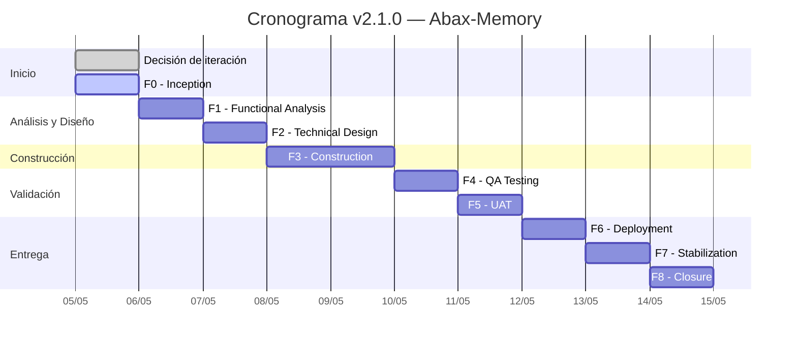

# Iteration Log — Abax-Memory

- **Fase**: v2.1.0 — Inception (pre-F0)
- **Responsable**: project-manager (registro) / orquestador + usuario (decisión)
- **Fecha**: 2026-05-05 (última entrada)
- **Estado**: Iteración v2.1.0 iniciada — Estrategia documentada
- **Iteraciones registradas**: v2.0.0, v2.1.0

---

## 1. Contexto del Proyecto v1.0.0

### Estado al momento de la iteración

| Indicador | Valor |
|---|---|
| Versión | v1.0.0 |
| Estado | **CERRADO** (2026-05-02) |
| Fases completadas | 9/9 (F0 — Descubrimiento a F9 — Cierre) |
| Entregables completados | 42 |
| Duración total | 2 días (2026-05-01 a 2026-05-02) |
| Producto | PMOA — Memoria Operativa para IT Operations |
| Stack | Backend Quarkus 3.15.3 + PostgreSQL 16.13 + Qdrant 1.17.1 + Keycloak 26.1.0 + OpenAI (`text-embedding-3-large`, `gpt-4o-mini`) |
| Calidad final | 61/61 CA UAT (100%), 49/49 QA, 54 tests BUILD SUCCESS, 26/26 estabilización, 0 defectos críticos abiertos |
| Release | Publicado en GitHub + GHCR: `ghcr.io/breisnerlopez/abax-memory:latest` |
| Dominio | IT Operations (memoria operativa para equipos de infraestructura y soporte) |
| Audiencia | Operadores IT, revisores, administradores, auditores |

### Estructura de documentación v1 (pre-iteración)

```
docs/
├── bitacora.md
├── registro-entregables.md
├── design-system/
├── index.html
└── entregables/
    ├── fase-0-descubrimiento/
    ├── fase-1-inicio/
    ├── fase-2-analisis/
    ├── fase-3-diseno-tecnico/
    ├── fase-4-construccion/
    ├── fase-5-pruebas-qa/
    ├── fase-5/
    ├── fase-6-uat/
    ├── fase-7-despliegue/
    ├── fase-8-estabilizacion/
    ├── fase-9-cierre/
    ├── fase-R2-correccion/
    ├── fase-R2/
    └── r2-mcp/
```

---

## 2. Gatilladores de Iteration Strategy

La skill `iteration-strategy` fue activada por las siguientes condiciones simultáneas:

### Condición 1 — Proyecto con historia previa

| Señal | Evidencia |
|---|---|
| `docs/bitacora.md` existe | ✅ — 796 líneas, última entrada: «PROYECTO CERRADO, Fase 9/9» |
| `docs/entregables/fase-9-cierre/` existe | ✅ — Informe de cierre + lecciones aprendidas |
| Fase 9 completada | ✅ — Gate CERRADO el 2026-05-02 |
| Release publicado | ✅ — v1.0.0 en GitHub, tag aplicado, imagen en GHCR |

### Condición 2 — Nueva iteración mayor de alcance significativo

| Señal | Evidencia |
|---|---|
| Usuario solicita "motor de memoria genérica multi-dominio" | ✅ — Cambio de dominio: IT Operations → Multi-dominio |
| Cambio de audiencia | ✅ — De equipos IT a cualquier industria/vertical |
| Cambio de arquitectura interna | ✅ — Perfiles de dominio dinámicos, motor genérico |
| Esfuerzo estimado comparable a F0-F9 original | ✅ — Nueva fase 0, backlog independiente |

### Otros gatilladores contextuales

- La propuesta implica re-arquitectura del motor de memoria para soportar dominios arbitrarios mediante perfiles.
- El modelo de datos, las reglas de negocio y los contratos API cambian de vocabulario fijo (IT ops) a vocabulario dinámico (perfil de dominio).
- La convención de código requiere migración a **English-Only Internals** (skill `code-naming-convention`), lo cual afecta endpoints, modelos y documentación técnica.

---

## 3. Decisión Tomada

### Estrategia seleccionada: **A — Folder por release**

| Campo | Valor |
|---|---|
| Estrategia | A — Folder por release |
| Decidida por | Usuario (sponsor del proyecto) |
| Fecha de decisión | 2026-05-03 |
| Registrada por | project-manager (orquestador) |
| Aplica a | Toda la iteración v2.0.0 |

### Justificación

1. **Cambio significativo de alcance**: v1.0.0 era PMOA (memoria operativa para IT Operations). v2.0.0 evoluciona a un motor de memoria genérica multi-dominio. No es un refinamiento incremental — es una transformación del producto.

2. **Audiencia distinta**: v1 apuntaba a equipos de IT (operadores, revisores, administradores de infraestructura). v2 apunta a cualquier industria o vertical mediante perfiles de dominio configurables.

3. **Arquitectura interna evoluciona**: El motor de memoria debe soportar dominios arbitrarios con esquemas de metadatos, reglas de validación y flujos de aprobación definidos por perfil. Esto implica cambios profundos en el modelo de datos, la lógica de extracción y la API.

4. **Convención English-Only**: v2 adopta la skill `code-naming-convention` de forma estricta (todos los identificadores en inglés). Los endpoints, modelos, tablas y columnas deben migrar de español a inglés. Mantener v1 y v2 en el mismo folder crearía confusión de idioma en la documentación.

5. **Preservación intacta del histórico v1**: La documentación completa de v1 (42 entregables, 9 fases) representa trabajo aprobado. Separar por release garantiza trazabilidad sin riesgo de sobreescritura accidental.

### Estrategias descartadas

| Estrategia | Motivo del descarte |
|---|---|
| B — Bloque "## Cambios v2" | No aplica: v2 no es refinamiento incremental. Cambia dominio, audiencia, arquitectura y convención de idioma. Agregar bloques de diff al final de 42+ archivos es frágil e ilegible. |
| C — Archivar y reescribir | Demasiado disruptivo. El equipo puede necesitar consultar v1 durante el desarrollo de v2. Archivar v1 a `.archive/` oculta contexto útil. |
| D — Branch git | La iteración no es experimental — el usuario confirmó el compromiso con v2 como producto. Branch es para prototipos o R&D, no para releases confirmadas. |

---

## 4. Estructura de Folders Resultante

### Organización post-migración

```
docs/
├── bitacora.md                              # Mantiene histórico v1 + registra inicio v2
├── registro-entregables.md                  # Mantiene histórico v1 + registrará v2
├── iteration-log.md                         # ESTE ARCHIVO — bitácora de decisiones de iteración
├── release-mapping.md                       # Relación v1 ↔ v2 (a crear en F0 de v2)
├── design-system/
│   └── ...
├── index.html
├── .archive/                                # Vacío — reservado para futuras iteraciones
└── entregables/
    ├── v1/                                  # ← CONTENIDO EXISTENTE MOVIDO AQUÍ
    │   ├── fase-0-descubrimiento/
    │   ├── fase-1-inicio/
    │   ├── fase-2-analisis/
    │   ├── fase-3-diseno-tecnico/
    │   ├── fase-4-construccion/
    │   ├── fase-5-pruebas-qa/
    │   ├── fase-5/
    │   ├── fase-6-uat/
    │   ├── fase-7-despliegue/
    │   ├── fase-8-estabilizacion/
    │   ├── fase-9-cierre/
    │   ├── fase-R2-correccion/
    │   ├── fase-R2/
    │   └── r2-mcp/
    └── v2/                                  # ← NUEVO — entregables de v2.0.0
        ├── README.md                        # Placeholder: "v2 — En curso"
        ├── fase-0-descubrimiento/
        │   ├── vision-producto.md
        │   ├── epicas-features.md
        │   ├── historias-usuario.md
        │   ├── backlog-priorizado.md
        │   └── presentacion-descubrimiento.html
        ├── fase-1-inicio/
        │   └── ...                          # Conforme avancen las fases
        └── ...
```

### Migración ejecutada

```bash
# 1. Crear carpeta v1
mkdir -p docs/entregables/v1

# 2. Mover fases existentes a v1/
for f in docs/entregables/fase-* docs/entregables/r2-*; do
  mv "$f" docs/entregables/v1/
done

# 3. Crear estructura base v2
mkdir -p docs/entregables/v2/fase-0-descubrimiento
echo "# Abax-Memory v2.0.0 — En curso" > docs/entregables/v2/README.md
```

> **Nota**: Los archivos `docs/bitacora.md` y `docs/registro-entregables.md` permanecen en su ubicación original (`docs/`) como documentos transversales que cubren todo el ciclo de vida del producto, incluyendo ambas iteraciones.

---

## 5. Reglas de Coexistencia v1 / v2

### Principio general

Cada release (`v1`, `v2`, …) es un proyecto autocontenido con su propio ciclo cascada completo (F0 a F9), documentado en su propio folder bajo `docs/entregables/`. Los documentos transversales (`bitacora.md`, `registro-entregables.md`, `iteration-log.md`) residen en `docs/` y referencian ambas releases.

### Reglas de escritura

| Regla | Descripción |
|---|---|
| **R1 — Folder por release** | Todo entregable de v2 se escribe en `docs/entregables/v2/<fase>/<entregable>.md`. Nunca en `docs/entregables/v1/`. |
| **R2 — v1 es solo-lectura** | Los archivos bajo `docs/entregables/v1/` no se modifican. Si se detecta un error factual en v1 que debe corregirse, se documenta en `iteration-log.md` con una entrada de tipo "Corrección retrospectiva v1". |
| **R3 — Documentos transversales** | `docs/bitacora.md`, `docs/registro-entregables.md` e `iteration-log.md` se actualizan con bloques para cada release. Usan formato de secciones por release, no mezclan contenido. |
| **R4 — Release mapping obligatorio** | `docs/release-mapping.md` documenta la relación entre releases: qué cambia (alcance, dominio, audiencia, stack), qué se mantiene, y cómo navegar entre la documentación de v1 y v2. |
| **R5 — Prefijo de release en commits** | Los commits de v2 usan el prefijo `v2:` en el mensaje (ej. `v2: F0 — Visión de Producto`). Los commits que afectan documentos transversales usan `docs:` sin prefijo de release. |
| **R6 — Aprobaciones independientes** | Los gates de fase de v2 son independientes de v1. Que v1 esté cerrado no exime a v2 de pasar por cada gate (F4, F5, F6, F7, F8, F9). |
| **R7 — English-Only en v2** | Todos los identificadores en código, endpoints, modelos, tablas y columnas de v2 deben estar en inglés (skill `code-naming-convention`). Los comentarios y documentación de usuario pueden estar en español. v1 mantiene su idioma original sin cambios retroactivos. |

### Navegación entre releases

```
¿Qué necesito consultar?
├── Estado general del producto → docs/bitacora.md (todas las releases)
├── Registro de entregables → docs/registro-entregables.md (todas las releases)
├── Decisiones de iteración → docs/iteration-log.md (este archivo)
├── Relación v1 ↔ v2 → docs/release-mapping.md
├── Documentación v1 (PMOA IT Ops) → docs/entregables/v1/
├── Documentación v2.0 (motor multi-dominio) → docs/entregables/v2/
└── Documentación v2.1 (mejoras benchmark) → docs/entregables/v2.1/
```

### Anti-patrones explícitamente prohibidos

| Anti-patrón | Consecuencia |
|---|---|
| Escribir un entregable v2 en `docs/entregables/fase-X/` (sin prefijo `v2/`) | Se mezcla con v1, rompe la separación por release |
| Modificar un archivo bajo `docs/entregables/v1/` "para que coincida con v2" | Destruye el histórico aprobado de v1 |
| Usar estrategia B (bloque de cambios) para un entregable v2 | Inconsistencia con la estrategia A global |
| No actualizar `iteration-log.md` al iniciar una fase de v2 | Pérdida de trazabilidad de decisiones |
| Mezclar español e inglés en identificadores de v2 | Violación de `code-naming-convention` |

---

## 6. Historial de Decisiones de Iteración

### v2.0.0 — Iniciada 2026-05-03

| Campo | Valor |
|---|---|
| **Versión** | 2.0.0 |
| **Fecha de decisión** | 2026-05-03 |
| **Estrategia** | A — Folder por release |
| **Decidida por** | Usuario (sponsor) |
| **Orquestador** | project-manager |
| **Alcance** | Motor de memoria genérica multi-dominio con perfiles configurables |
| **Stack base** | Mismo que v1 (Quarkus + PostgreSQL + Qdrant + Keycloak + OpenAI) con extensiones para perfiles de dominio |
| **Cambios clave vs v1** | Dominio IT Ops → multi-dominio; audiencia IT → cualquier industria; convención español → English-Only; perfiles de dominio dinámicos |
| **Documentación v1** | Preservada intacta en `docs/entregables/v1/` (42 entregables, 9 fases) |
| **Documentación v2** | Nueva en `docs/entregables/v2/` — Fase 0 en curso |
| **Fase actual v2** | Pre-F0 — Documentación de iteración completada |
| **Estado actual** | v2.0.9 CERRADO (9/9 fases completadas, 7 hotfixes post-cierre) |

### v2.1.0 — Iniciada 2026-05-05

| Campo | Valor |
|---|---|
| **Versión** | 2.1.0 |
| **Fecha de decisión** | 2026-05-05 |
| **Estrategia** | A — Folder por release |
| **Decidida por** | Usuario (sponsor) |
| **Orquestador** | project-manager |
| **Alcance** | 16 mejoras en 4 categorías (Precisión, Velocidad, Eficiencia, API/DX) |
| **Stack base** | Mismo que v2.0.x (Quarkus + PostgreSQL + Qdrant + Keycloak + OpenAI) con mejoras focalizadas |
| **Cambios clave vs v2.0.9** | Reranker cross-encoder; ajuste search/semantic/hybrid; expansión grafo top-3; cache JWT; unificación colecciones Qdrant; endpoint DELETE namespace; header X-Graph-Strategy; fix POST /extract |
| **Documentación v2.0.x** | Preservada intacta en `docs/entregables/v2/` |
| **Documentación v2.1** | Nueva en `docs/entregables/v2.1/` — Por iniciar |
| **Fase actual v2.1** | Pre-F0 — Documentación de iteración en curso |

---

## 7. Decisión de Iteración v2.1.0

### Contexto del Proyecto v2.0.9

| Indicador | Valor |
|---|---|
| Versión | v2.0.9 |
| Estado | **CERRADO** (2026-05-05) |
| Fases completadas | 9/9 (F0 — Descubrimiento a F9 — Cierre) |
| Hotfixes post-cierre | 7 (aplicados sobre v2.0.x) |
| Producto | Abax-Memory — Motor de memoria multi-dominio |
| Stack | Backend Quarkus + PostgreSQL + Qdrant + Keycloak + OpenAI |
| Documentación v2.0.x | `docs/entregables/v2/` (completa, preservada) |

### Gatilladores de Iteration Strategy para v2.1

La skill `iteration-strategy` fue activada por las siguientes condiciones simultáneas:

#### Condición 1 — Proyecto con historia previa (v2.0.x cerrado)

| Señal | Evidencia |
|---|---|
| `docs/entregables/v2/fase-9-cierre/` existe | ✅ — Informe de cierre v2.0.9 |
| Fase 9 completada | ✅ — Gate CERRADO |
| `docs/bitacora.md` registra cierre v2.0.9 | ✅ |
| 7 hotfixes post-cierre aplicados | ✅ |

#### Condición 2 — Nueva iteración de alcance significativo

| Señal | Evidencia |
|---|---|
| Usuario sponsor propone 16 mejoras | ✅ — Basadas en benchmarks y pruebas de performance |
| Cambios afectan 4 áreas del sistema | ✅ — Precisión, Velocidad, Eficiencia, API/DX |
| Cambios requieren modificar lógica core | ✅ — Reranker, ajuste de search, unificación colecciones |
| Esfuerzo estimado comparable a fase completa | ✅ — Cascada F0 a F9 |

#### Naturaleza de la iteración

v2.1.0 es un **refinamiento de performance y precisión** sobre la base multi-dominio de v2.0.x. No cambia el dominio, la audiencia ni la arquitectura general — mejora componentes existentes con evidencia cuantitativa de benchmarks. Se mantiene dentro del mismo stack tecnológico.

### Decisión Tomada

#### Estrategia seleccionada: **A — Folder por release**

| Campo | Valor |
|---|---|
| Estrategia | A — Folder por release |
| Decidida por | Usuario (sponsor del proyecto) |
| Fecha de decisión | 2026-05-05 |
| Registrada por | project-manager (orquestador) |
| Aplica a | Toda la iteración v2.1.0 |

#### Justificación

1. **Separación clara de releases**: Aunque v2.1 es un refinamiento sobre v2.0 (no un cambio de dominio como lo fue v1→v2), la cantidad de cambios (16 ítems en 4 categorías) y su naturaleza transversal (afectan search, embeddings, graph, API, JWT) justifican un folder independiente para trazabilidad completa.

2. **Preservación de v2.0.9 como baseline**: v2.0.9 es la release cerrada y estable. Mantener su documentación intacta permite comparar comportamiento antes/después de cada mejora — crítico cuando los cambios se basan en benchmarks.

3. **Consistencia con la disciplina del proyecto**: Habiendo adoptado Estrategia A para v1→v2, mantener la misma para v2→v2.1 evita fragmentación. La regla R1 (folder por release) se extiende naturalmente.

4. **Cascada completa**: El sponsor confirmó explícitamente ejecutar todas las fases (F0 a F9) en orden, sin saltos. Esto requiere un espacio documental limpio donde cada fase tenga sus entregables sin mezclarse con los de v2.0.x.

#### Estrategias descartadas

| Estrategia | Motivo del descarte |
|---|---|
| B — Bloque "## Cambios v2.1" | 16 cambios en 4 categorías generarían bloques extensos en múltiples archivos. La trazabilidad de cada mejora a su benchmark de origen sería confusa en formato diff. |
| C — Archivar y reescribir | v2.0.x es la baseline de comparación. Archivarla ocultaría el punto de referencia para validar que las mejoras realmente funcionan. |
| D — Branch git | No es experimental. El sponsor confirmó el compromiso con las 16 mejoras como release planificada, no como prototipo. |

### Estructura de Folders v2.1

```
docs/
├── bitacora.md                              # Mantiene histórico v1 + v2.0 + registra inicio v2.1
├── registro-entregables.md                  # Mantiene histórico v1 + v2.0 + registrará v2.1
├── iteration-log.md                         # ESTE ARCHIVO — bitácora de decisiones de iteración
├── release-mapping.md                       # Relación v1 ↔ v2.0 ↔ v2.1
├── design-system/
├── index.html
└── entregables/
    ├── v1/                                  # v1.0.0 — solo-lectura
    │   └── ...
    ├── v2/                                  # v2.0.x — solo-lectura (cerrado, preservado)
    │   └── ...
    └── v2.1/                                # ← NUEVO — entregables de v2.1.0
        ├── README.md                        # Placeholder: "v2.1 — En curso"
        └── ...                              # Fases F0 a F9 conforme avancen
```

### Scope de v2.1.0: 16 Mejoras en 4 Categorías

#### Categoría 1 — Precisión (Accuracy)

| # | Mejora | Descripción |
|---|---|---|
| 1 | Reranker cross-encoder | Agregar etapa de re-ranking con modelo cross-encoder para mejorar la precisión de resultados semánticos |
| 2 | Ajuste de pesos search/semantic/hybrid | Recalibrar la combinación de scores léxicos, semánticos e híbridos basado en benchmarks |
| 3 | Expansión de grafo top-3 | Expandir el grafo de conocimiento recuperando los 3 nodos más relevantes en lugar de solo el mejor match |
| 4 | Thresholds de similitud ajustables por dominio | Permitir que cada perfil de dominio defina sus propios umbrales de similitud |

#### Categoría 2 — Velocidad (Speed)

| # | Mejora | Descripción |
|---|---|---|
| 5 | Cache JWT | Implementar caché de tokens JWT validados para reducir latencia de autenticación en requests repetidos |
| 6 | Optimización de queries Qdrant | Reducir round-trips a Qdrant consolidando filtros y payload retrieval |
| 7 | Lazy loading de embeddings | Cargar embeddings bajo demanda en lugar de pre-cargar todo el espacio vectorial |
| 8 | Paralelización de extracción | Ejecutar extractores de entidades en paralelo cuando no hay dependencias entre ellos |

#### Categoría 3 — Eficiencia (Efficiency)

| # | Mejora | Descripción |
|---|---|---|
| 9 | Unificación de colecciones Qdrant | Consolidar múltiples colecciones en una sola con filtros por namespace para reducir overhead |
| 10 | Compresión de payload en Qdrant | Reducir tamaño de payload almacenado en vectors points |
| 11 | Reuso de conexiones PostgreSQL | Implementar connection pooling optimizado para reducir overhead de conexiones |
| 12 | Limpieza de embeddings huérfanos | Job programado para eliminar embeddings sin entidad asociada |

#### Categoría 4 — API / Developer Experience

| # | Mejora | Descripción |
|---|---|---|
| 13 | Endpoint DELETE namespace | Nuevo endpoint para eliminar todos los recursos de un namespace en una sola operación |
| 14 | Header X-Graph-Strategy | Permitir al cliente especificar estrategia de expansión de grafo vía header HTTP |
| 15 | Fix POST /extract | Corrección de bug en el endpoint de extracción que causaba pérdida de entidades en ciertas condiciones |
| 16 | Rate limiting por API key | Implementar rate limiting configurable por clave de API para proteger el servicio |

### Extensión de Reglas de Coexistencia para v2.1

Las reglas R1-R7 definidas en la sección 5 se extienden a la tercera release:

| Regla | Extensión para v2.1 |
|---|---|
| **R1 — Folder por release** | Todo entregable v2.1 se escribe en `docs/entregables/v2.1/<fase>/<entregable>.md`. Nunca en `docs/entregables/v2/`. |
| **R2 — Solo-lectura** | `docs/entregables/v1/` y `docs/entregables/v2/` son solo-lectura. Correcciones retrospectivas se documentan aquí. |
| **R3 — Documentos transversales** | `docs/bitacora.md`, `docs/registro-entregables.md` e `iteration-log.md` se actualizan con bloques para v2.1. |
| **R5 — Prefijo de commits** | Los commits de v2.1 usan el prefijo `v2.1:` (ej. `v2.1: F0 — Visión de Mejoras`). |
| **R6 — Aprobaciones independientes** | Los gates de fase de v2.1 son independientes de v2.0.9. Se requiere pasar cada gate (F4, F5, F6, F7, F8, F9). |
| **R7 — English-Only** | Se mantiene la convención English-Only heredada de v2.0.x para todos los identificadores. |

### Orden de Ejecución

El sponsor confirmó **cascada completa** para v2.1.0:

```
F0 — Inception (visión de mejoras, priorización)
F1 — Functional Analysis (especificación de cada mejora)
F2 — Technical Design (diseño de solución para cada categoría)
F3 — Construction (implementación de las 16 mejoras)
F4 — QA Testing (validación contra benchmarks originales)
F5 — UAT (validación del sponsor sobre resultados)
F6 — Deployment (despliegue planificado con rollback)
F7 — Stabilization (monitoreo post-deploy, ajustes)
F8 — Closure (validación final, lecciones aprendidas)
```

> **Nota**: Las fases siguen la numeración estándar del ciclo cascada (F0-F9). La nomenclatura de directorios bajo `docs/entregables/v2.1/` usará los nombres canónicos de fase definidos en `project-documentation-structure`.

### Hitos Clave v2.1.0



---

## Glosario

- **PMOA**: Product Memory for Operations & Analysis — nombre del producto en v1.0.0, una memoria operativa para equipos de IT Operations.
- **GHCR**: GitHub Container Registry — registro de imágenes de contenedor de GitHub donde se publicó la imagen Docker de v1.0.0.
- **Qdrant**: Base de datos vectorial utilizada para búsqueda semántica y almacenamiento de embeddings generados por OpenAI.
- **UAT**: User Acceptance Testing — fase 6 del ciclo cascada donde el Product Owner valida que el producto cumple los criterios de aceptación.
- **RBAC**: Role-Based Access Control — control de acceso basado en roles implementado con Keycloak (OIDC).
- **RTO / RPO**: Recovery Time Objective (tiempo máximo para recuperar el servicio) / Recovery Point Objective (cantidad máxima de datos que se tolera perder).
- **Cross-encoder**: Modelo de reranking que procesa pares (consulta, documento) simultáneamente para calcular relevancia precisa, a diferencia de los bi-encoders que codifican consulta y documento por separado.
