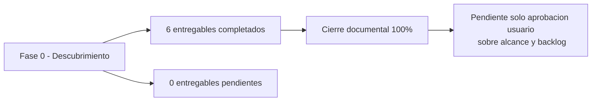

# Registro de Entregables
- **Fase**: 0-Descubrimiento
- **Entregable**: Registro de Entregables
- **Responsable**: business-analyst
- **Fecha**: 2026-05-01
- **Estado**: Completado
---

## Dashboard de estado final de Fase 0

### Resumen por fase

| Fase | Total | Completados | Pendientes | % Completitud | Semaforo | Observacion |
|---|---|---|---|---|---|---|
| 0-Descubrimiento | 6 | 6 | 0 | 100% | Verde | Todos los entregables de fase fueron completados y verificados. |

### Estado ejecutivo de Fase 0

- **Estado**: Verde
- **Cierre documental**: Completo
- **Pendiente explicitado**: Solo resta la aprobacion del usuario sobre alcance y backlog priorizado.

## Registro detallado de entregables — Fase 0

| ID | Entregable | Tipo | Ruta | Responsable | Fecha real | Estado | Observaciones |
|---|---|---|---|---|---|---|---|
| F0-DEL-001 | Vision del Producto | Doc | `docs/entregables/fase-0-descubrimiento/vision-producto.md` | business-analyst | 2026-05-01 | Completado | Entregable verificado. |
| F0-DEL-002 | Mapa de Epicas y Features | Doc | `docs/entregables/fase-0-descubrimiento/epicas-features.md` | business-analyst | 2026-05-01 | Completado | Entregable verificado. |
| F0-DEL-003 | Historias de Usuario | Doc | `docs/entregables/fase-0-descubrimiento/historias-usuario.md` | business-analyst | 2026-05-01 | Completado | Entregable verificado. |
| F0-DEL-004 | Template base de presentaciones | HTML | `docs/design-system/presentacion-template.html` | business-analyst | 2026-05-01 | Completado | Artefacto de soporte verificado. |
| F0-DEL-005 | Product Backlog Priorizado | Doc | `docs/entregables/fase-0-descubrimiento/backlog-priorizado.md` | business-analyst | 2026-05-01 | Completado | Entregable verificado. |
| F0-DEL-006 | Presentacion de Descubrimiento | Pres | `docs/entregables/fase-0-descubrimiento/presentacion-descubrimiento.html` | business-analyst | 2026-05-01 | Completado | Archivo existente y verificado. |

## Vista ejecutiva de avance

## Observaciones

- El dashboard registra estado final de Fase 0 como completo en terminos de entregables.
- No quedan pendientes documentales dentro del alcance instruido.
- La aprobacion del usuario sobre alcance y backlog se mantiene como siguiente hito de validacion, no como entregable faltante.
